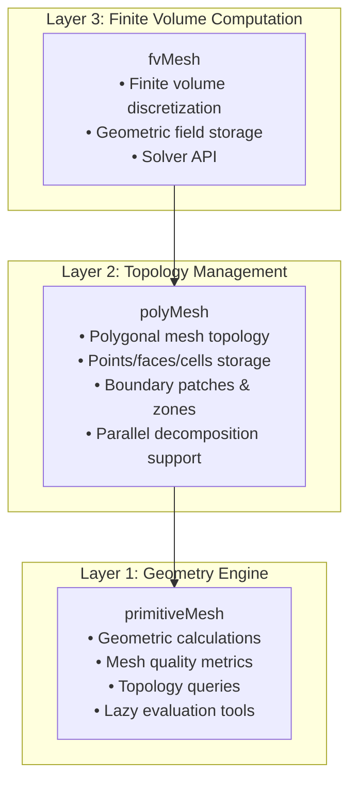

# 4. Mesh Classes: สถาปัตยกรรมระบบเรขาคณิตคำนวณของ OpenFOAM

## 📋 ภาพรวมบท

ยินดีต้อนรับสู่ **The Mesh Classes** - หัวใจของสถาปัตยกรรมระบบเรขาคณิตคำนวณของ OpenFOAM บทนี้จะสำรวจลำดับชั้นคลาสที่ซับซ้อนซึ่งแปลงข้อมูลเรขาคณิตดิบเป็น computational mesh ที่มีประสิทธิภาพสูงสำหรับการจำลอง Finite Volume

### 🎯 วัตถุประสงค์การเรียนรู้

หลังจากเสร็จสิ้นบทนี้ คุณจะเข้าใจ:

1. **ข้อมูลเรขาคณิตถูกจัดระเบียบอย่างไร** ในคลาส mesh แบบลำดับชั้นของ OpenFOAM
2. **พื้นฐานคณิตศาสตร์** ของเรขาคณิต mesh finite volume
3. **กลยุทธ์การเพิ่มประสิทธิภาพ** สำหรับเรขาคณิตการคำนวณ
4. **วิธีการเข้าถึงและจัดการ** ข้อมูล mesh สำหรับแอปพลิเคชันที่กำหนดเอง
5. **ความสัมพันธ์ระหว่างโทโพโลยีและเรขาคณิต** ใน mesh CFD

---

## 🏗️ ลำดับชั้นคลาส Mesh: สถาปัตยกรรมสามชั้น

ระบบ mesh ของ OpenFOAM ทำตาม **รูปแบบสถาปัตยกรรมสามชั้น** ที่ให้รากฐานที่แข็งแกร่งสำหรับพลศาสตร์ของไหลเชิงคำนวณ ในขณะเดียวกันก็รักษาประสิทธิภาพและความยืดหยุ่น ลำดับชั้นนี้แยกการคำนวณทางเรขาคณิต การจัดการโทโพโลยี และการดำเนินการปริมาตรจำกัดออกเป็นชั้นต่างๆ ที่เฉพาะเจาะจง

### ภาพรวมสถาปัตยกรรม



สถาปัตยกรรมสามชั้นประกอบด้วย:

1. **primitiveMesh** - เครื่องมือคำนวณเรขาคณิต
2. **polyMesh** - กรอบงานโทโพโลยี
3. **fvMesh** - ชั้นการแบ่งพื้นที่ปริมาตรจำกัด

### โครงสร้างการสืบทอด

```cpp
// Core mesh hierarchy (simplified)
primitiveMesh          // Abstract base class - pure topology
    ├── polyMesh       // Polygonal mesh with boundary information
    │   ├── fvMesh     // Finite volume mesh with field storage
    │   └── dynamicFvMesh // Mesh with motion capabilities
    └── extendedMesh   // Extended mesh with additional features
```

ที่ฐานมี **primitiveMesh** - abstract base class ที่กำหนดความสัมพันธ์ทางโทโพโลย์ระหว่าง mesh entities คลาสนี้รู้จัก:
- **Point-face connectivity**: จุดใดบ้างที่เกิดแต่ละหน้า
- **Face-cell connectivity**: หน้าใดบ้างที่ล้อมรอบแต่ละเซลล์
- **Cell-point connectivity**: จุดใดบ้างที่อยู่ในแต่ละเซลล์
- **Face-edge connectivity**: ขอบใดบ้างที่เกิดแต่ละหน้า (สำหรับคุณสมบัติขั้นสูง)

### การแยกความรับผิดชอบ

| ชั้น | หน้าที่หลัก | ความรับผิดชอบ |
|------|--------------|-----------------|
| **primitiveMesh** | การคำนวณเรขาคณิตแบบบริสุทธิ์ | • การคำนวณ centers, volumes, normals<br>• เมตริกคุณภาพ mesh<br>• Lazy evaluation |
| **polyMesh** | การจัดการโทโพโลยี | • จัดเก็บ points, faces, cells<br>• owner/neighbor relationships<br>• Boundary patches<br>• การสนับสนุนขนาน |
| **fvMesh** | การแบ่งพื้นที่ปริมาตรจำกัด | • การจัดเก็บฟิลด์เรขาคณิต<br>• API สำหรับ solver<br>• การคำนวณเรขาคณิตตามความต้องการ |

---

## 🔍 แนวคิดระดับสูง: อนุลักษณ์การวางแผนเมือง

จินตนาการการออกแบบ **เมืองทันสมัย**:

- **ผู้สำรวจที่ดิน (Points)**: วัดพิกัดที่แน่นอนของทุกสถานที่
- **ผู้วางแผนที่ดิน (Faces)**: กำหนดเขตที่ดินระหว่างแปลง
- **สถาปนิกเขต (Cells)**: ออกแบบบล็อกสามมิติ (แปลงหลายเหลี่ยม)
- **วิศวกรจราจร (Connectivity)**: สร้างความสัมพันธ์เจ้าของ/ข้างเคียง (ถนน)
- **รัฐบาลเมือง (Boundaries)**: จัดตั้งเขตที่มีกฎต่างกัน (patches)

คลาส mesh ของ OpenFOAM ทำงานเหมือน **ระบบวางแผนเมืองแบบบูรณาการ**นี้ - คลาสละหนึ่งมีความรับผิดชอบเฉพาะ และร่วมกันสร้าง computational domain ที่ทำงานได้ซึ่งสมการ CFD "อยู่และไหล"

---

## 📐 พื้นฐานคณิตศาสตร์: วิธี Finite Volume

วิธี finite volume (FVM) พื้นฐานอาศัยการแบ่ง computational domain เป็น discrete control volumes (cells) สำหรับแต่ละเซลล์ $V_i$ เราหาอินทิกรัลของสมการที่ควบคุม:

$$
\int_{V_i} \frac{\partial \phi}{\partial t} \, \mathrm{d}V + \oint_{\partial V_i} \phi \mathbf{u} \cdot \mathbf{n} \, \mathrm{d}S = \int_{V_i} S_\phi \, \mathrm{d}V
$$

โดยที่:
- $\phi$ = field variable (ความเร็ว, ความดัน, อุณหภูมิ, เป็นต้น)
- $\mathbf{u}$ = velocity field
- $\mathbf{n}$ = outward unit normal vector ที่พื้นผิว
- $S_\phi$ = source term

คลาส mesh ให้ข้อมูลเรขาคณิตที่จำเป็นในการประเมิน surface integrals และการคำนวณ control volume เหล่านี้ด้วยความแม่นยำสูง

### ทฤษฎีบทของ Gauss: พื้นฐานของ FVM

Finite volume method ถูกสร้างขึ้นจาก **divergence theorem** (ทฤษฎีบทของ Gauss) ซึ่งเป็นพื้นฐานทางคณิตศาสตร์ในการแปลง volume integrals เป็น surface integrals:

$$
\int_V \nabla \cdot \mathbf{F} \, \mathrm{d}V = \oint_{\partial V} \mathbf{F} \cdot \mathrm{d}\mathbf{S}
$$

**ตัวแปร:**
- $\mathbf{F}$ = เวกเตอร์ฟลักซ์
- $V$ = ปริมาตรควบคุม
- $S$ = พื้นผิวควบคุม
- $\mathbf{n}$ = เวกเตอร์หน่วยตั้งฉากต่อพื้นผิว

สำหรับเซลล์ discrete $i$ ที่มีปริมาตร $V_i$ และหน้า $f$ เราประมาณ volume integral โดยรวม fluxes ผ่านหน้าเซลล์ทั้งหมด:

$$
\int_{V_i} \nabla \cdot \mathbf{F} \, \mathrm{d}V \approx \sum_{f \in \partial V_i} \mathbf{F}_f \cdot \mathbf{S}_f
$$

การประมาณ discrete นี้รับประกันการอนุรักษ์แน่นอนของปริมาณที่ถูก transport ระดับเซลล์

---

## 🔧 ส่วนประกอบหลักคลาส Mesh

### 1. คลาส Points

จัดเก็บพิกัดเรขาคณิตของ vertices ของ mesh:

```cpp
class pointField : public Field<point>
{
    // Inherits from Field<point> for efficient storage
    // Provides access to coordinates via pointField[i]
};
```

จุดละหนึ่ง $p_i = (x_i, y_i, z_i)$ แทน vertex ในปริภูมิ 3 มิติ คลาส pointField ให้การเข้าถึงสุ่มถึงพิกัดเหล่านี้และรองรับ vector operations สำหรับการคำนวณเรขาคณิต

### 2. คลาส Faces

กำหนดเขตพรหมแบบหลายเหลี่ยมระหว่างเซลล์:

```cpp
class face
{
private:
    List<label> points_;  // List of point indices forming the face

public:
    // Calculate face normal vector
    vector normal(const pointField&) const;

    // Calculate face centroid
    point centre(const pointField&) const;

    // Calculate face area
    scalar area(const pointField&) const;
};
```

หน้าเชื่อมต่อหลายจุดเพื่อสร้างหลายเหลี่ยม แต่ละหน้ามี:

- **Normal vector**: $\mathbf{n} = \frac{1}{2A}\sum_{i=1}^{n} (\mathbf{r}_i \times \mathbf{r}_{i+1})$
- **Centroid**: ค่าเฉลี่ยถ่วงของพิกัดจุด
- **Area**: คำนวณโดยใช้สูตรพื้นที่หลายเหลี่ยม

### 3. คลาส Cells

แทน control volumes หลายหลี่ยมสามมิติ:

```cpp
class cell
{
private:
    List<label> faces_;  // List of face indices bounding the cell

public:
    // Calculate cell volume
    scalar mag(const pointField&, const faceList&) const;

    // Calculate cell centroid
    point centre(const pointField&, const faceList&) const;
};
```

แต่ละเซลล์ถูกกำหนดโดย bounding faces การคำนวณปริมาตรเซลล์ใช้ divergence theorem:

$$
V = \frac{1}{6} \sum_{f \in \text{faces}} (\mathbf{c}_f \cdot \mathbf{n}_f) A_f
$$

โดยที่ $\mathbf{c}_f$ คือ face centroid, $\mathbf{n}_f$ คือ face normal และ $A_f$ คือ face area

### 4. Boundary Conditions (Patches)

คอลเลกชันหน้าที่มีพฤติกรรมเฉพาะทางฟิสิกส์:

```cpp
class polyPatch
{
public:
    virtual void updateMesh(PolyTopoChange&) = 0;

    // Access to patch-specific fields
    const word& name() const;
    const labelList& meshPoints() const;
    const labelList& meshFaces() const;
};
```

---

## ⚡ กลไก Lazy Evaluation: ประสิทธิภาพหน่วยความจำ

OpenFOAM ใช้ระบบ **การคำนวณตามความต้องการ** ที่ซับซ้อน ซึ่งจะเลื่อนการคำนวณทางเรขาคณิตที่มีค่าใช้จ่ายสูงไปจนกว่าจะต้องการใช้จริง

```cpp
// 🔧 MECHANISM: Demand-driven geometric calculation
class primitiveMesh
{
private:
    // Storage for computed properties (initially empty)
    mutable autoPtr<vectorField> cellCentresPtr_;
    mutable autoPtr<scalarField> cellVolumesPtr_;
    mutable autoPtr<vectorField> faceCentresPtr_;
    mutable autoPtr<vectorField> faceAreasPtr_;

public:
    // ✅ GETTER: Compute only when needed, cache result
    const vectorField& cellCentres() const
    {
        if (!cellCentresPtr_.valid())  // Not computed yet?
        {
            // Compute on demand
            cellCentresPtr_.reset(calcCellCentres());
        }
        return cellCentresPtr_();
    }

    // ✅ INVALIDATOR: Clear cache when mesh changes
    void clearGeom()
    {
        cellCentresPtr_.clear();
        cellVolumesPtr_.clear();
        faceCentresPtr_.clear();
        faceAreasPtr_.clear();
    }
};
```

### ประสิทธิภาพหน่วยความจำ

| แนวทาง | ความต้องการหน่วยความจำ (double precision) |
|----------|-----------------------------------------------------|
| **ดั้งเดิม (คำนวณล่วงหน้า)** | |
| - ปริมาตร cell | $N_{\text{cells}} \times 8$ ไบต์ |
| - พื้นที่หน้า | $N_{\text{faces}} \times 8$ ไบต์ |
| - จุดศูนย์ถ่วงหน้า | $N_{\text{faces}} \times 24$ ไบต์ (เวกเตอร์ 3D) |
| - จุดศูนย์ถ่วง cell | $N_{\text{cells}} \times 24$ ไบต์ |
| **ตามความต้องการ** | |
| - โทโพโลยี | $O(N_{\text{cells}} + N_{\text{faces}} + N_{\text{points}})$ |
| - ปริมาณที่คำนวณ | $O(1)$ ต่อการคำนวณที่ใช้งาน |
| - หน่วยความจำสำหรับผลลัพธ์ | ถูกปล่อยทันทีหลังจากใช้ |

**ประสิทธิภาพ**: สำหรับ mesh ที่มี 1 ล้าน cell การประหยัดหน่วยความจำอาจเกิน **100 MB** เมื่อต้องการเพียงส่วนย่อยของคุณสมบัติทางเรขาคณิตในช่วงเวลาใดๆ

---

## 📊 คุณภาพ Mesh: ตัวชี้วัดและมาตรฐาน

คุณภาพของ mesh ส่งผลโดยตรงต่อความถูกต้องและการบรรจบของการจำลอง CFD OpenFOAM มีตัวชี้วัดคุณภาพหลายอย่าง:

### Non-orthogonality

วัดความเบี่ยงเบนระหว่างเวกเตอร์ปกติของหน้าและเส้นเชื่อมระหว่างจุดศูนย์กลางเซลล์ข้างเคียง:

$$
\theta = \arccos\left(\frac{\mathbf{S}_f \cdot \mathbf{d}}{|\mathbf{S}_f||\mathbf{d}|}\right)
$$

โดยที่:
- $\mathbf{S}_f$ คือเวกเตอร์พื้นที่ของหน้า
- $\mathbf{d}$ คือระยะห่างระหว่างจุดศูนย์กลางเซลล์
- $\theta$ คือมุมระหว่างพวกมัน

### Skewness

วัดว่าจุดศูนย์ถ่วงของหน้าเบี่ยงเบนจากตำแหน่งเหมาะสม:

$$
\text{skewness} = \frac{|\mathbf{c}_f - \mathbf{c}_{proj}|}{|\mathbf{d}|}
$$

### มาตรฐานคุณภาพ Mesh

| ตัวชี้วัด | ดีเยี่ยม | ดี | ยอมรับได้ | ต้องแก้ไข |
|------------|-----------|------|------------|-----------|
| Non-orthogonality | < 30° | 30-50° | 50-70° | > 70° |
| Skewness | < 1.0 | 1.0-2.0 | 2.0-4.0 | > 4.0 |
| Aspect Ratio | < 5 | 5-10 | 10-20 | > 20 |

---

## 🎯 การปรับให้เหมาะสมด้านประสิทธิภาพ

คลาส mesh ของ OpenFOAM รวมถึงการเพิ่มประสิทธิภาพหลายอย่างที่สำคัญ:

| การเพิ่มประสิทธิภาพ | วัตถุประสงค์ | ผลกระทบ |
|---|---|---|
| **Compact Storage** | Contiguous memory layouts | การใช้ cache อย่างมีประสิทธิภาพ |
| **Lazy Evaluation** | ปริมาณทางเรขาคณิต | คำนวณตามความต้องการและจัดเก็บไว้ |
| **Reference Counting** | Smart pointers | ป้องกัน memory leaks ขณะที่รักษาประสิทธิภาพ |
| **Cache-Friendly Algorithms** | Iteration patterns | การเพิ่มประสิทธิภาพสำหรับสถาปัตยกรรม CPU สมัยใหม่ |

---

## ⚠️ ข้อผิดพลาดที่พบบ่อยและวิธีแก้ไข

### ข้อผิดพลาดที่ 1: การเก็บการอ้างอิงเรขาคณิตเก่า

เมื่อคุณเก็บการอ้างอิงไปยัง `cellCentres()`, `faceAreas()`, หรือเรขาคณิตที่คำนวณแล้วที่คล้ายกัน คุณกำลังเก็บตัวชี้ไปยังข้อมูลที่แคชไว้ ซึ่งอาจถูกล้างเมื่อ `clearGeom()` ถูกเรียก

**วิธีแก้ไขที่ถูกต้อง:**
```cpp
// ✅ ดี: เก็บการอ้างอิงเมชเท่านั้น
MeshProcessor(const primitiveMesh& mesh) : mesh_(mesh) {}

void process()
{
    // ✅ ดึงข้อมูลเรขาคณิตใหม่เมื่อต้องการ
    const vectorField& centres = mesh_.cellCentres();
    processCentres(centres);

    // ถ้าเมชเปลี่ยนแปลง...
    // mesh_.clearGeom();

    // ✅ ดึงข้อมูลใหม่หลังจากการเปลี่ยนแปลง
    const vectorField& newCentres = mesh_.cellCentres();
    processCentres(newCentres);
}
```

### ข้อผิดพลาดที่ 2: การละเลยคุณภาพเมช

คุณภาพเมชที่ไม่ดีอาจทำให้เกิดความไม่เสถียรเชิงตัวเลขและผลลัพธ์ที่ไม่ถูกต้อง

**แนวทางปฏิบัติที่ดีที่สุด:**
- ตรวจสอบ mesh quality ก่อนการคำนวณ
- เลือก discretization schemes ที่เหมาะสมกับ mesh quality
- ปรับปรุง mesh หากคุณภาพต่ำกว่ามาตรฐาน

---

## 🚀 การประยุกต์ใช้ใน CFD

สถาปัตยกรรม mesh นี้ทำให้สามารถ:

- **Flux Calculations**: Face areas และ normals สำหรับ convection terms
- **Gradient Computations**: Cell centers และ volumes สำหรับ diffusion terms
- **Boundary Conditions**: Patch-specific physics และ constraints
- **Adaptive Meshing**: การปรับเปลี่ยน dynamic ของ mesh topology
- **Parallel Computation**: Domain decomposition และ load balancing

---

## 💎 บทสรุป

คลาส mesh เหล่านี้เป็น**รากฐาน**ที่การคำนวณ CFD ทั้งหมดถูกสร้างขึ้น โดยให้กรอบทางเรขาคณิตที่แปลงสมการเชิงอนุพันธ์ย่อยให้เป็นระบบพีชคณิตที่สามารถแก้ไขได้ผ่านวิธี Finite Volume

**การออกแบบสะท้อนถึง:**
- ความต้องการของพลศาสตร์ของไหลเชิงคำนวณ
- ความยืดหยุ่นสำหรับการประยุกต์ใช้ทางวิศวกรรมที่หลากหลาย
- ประสิทธิภาพสำหรับการประมวลผลขนาดใหญ่
- ความแม่นยำทางคณิตศาสตร์สำหรับผลลัพธ์ที่เชื่อถือได้

การออกแบบที่สวยงามของคลาส mesh ของ OpenFOAM ให้รากฐานที่มั่นคงสำหรับการจำลอง CFD ที่มีประสิทธิภาพสูง ทำให้เป็นหนึ่งในระบบเรขาคณิตการคำนวณที่ซับซ้อนที่สุดใน scientific computing
