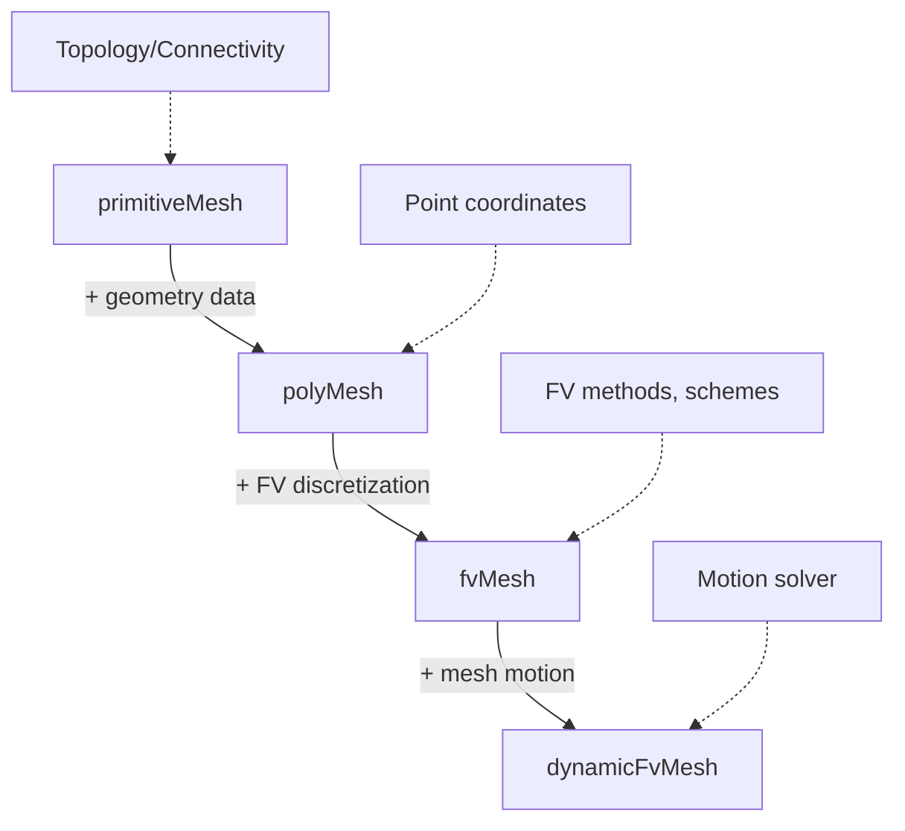

# Mesh Classes - Introduction

บทนำ Mesh Classes — พื้นฐานที่ต้องรู้

> **ทำไมต้องเรียนบทนี้?**
> - เข้าใจ **โครงสร้าง mesh** ที่ OpenFOAM ใช้
> - รู้ว่า **polyhedral mesh** ดีกว่า structured อย่างไร
> - เตรียมพร้อมสำหรับ mesh programming

---

## Learning Objectives

หลังจากอ่านบทนี้ คุณจะสามารถ:

1. **อธิบาย** ข้อดีของ polyhedral mesh เทียบกับ structured mesh
2. **ระบุ** mesh components หลัก (points, faces, cells)
3. **เข้าใจ** face-based structure และ owner-neighbour relationship
4. **แยกแยะ** ความแตกต่างระหว่าง primitiveMesh, polyMesh และ fvMesh
5. **เข้าถึง** mesh data ผ่าน OpenFOAM API
6. **อ่าน** mesh file structure ใน constant/polyMesh/

---

## Prerequisites

- [Container & Memory System](../03_CONTAINERS_MEMORY/00_Overview.md) - List, UList, PtrList
- [Basic Primitives](../01_FOUNDATION_PRIMITIVES/00_Overview.md) - Vector, point, tensor types
- ความเข้าใจพื้นฐานเกี่ยวกับ Finite Volume Method

---

## Overview

> **💡 OpenFOAM Mesh = Unstructured Polyhedral**
>
> - รองรับ **ทุกรูปร่าง cell** (hex, tet, prism, pyramid, arbitrary)
> - **Face-based** structure = efficient สำหรับ FVM
> - **Topology + Geometry** = flexible mesh representation

OpenFOAM ใช้ **unstructured polyhedral mesh** ซึ่งแตกต่างจาก structured mesh แบบดั้งเดิม โครงสร้างนี้ออกแบบมาเพื่อ:
- รองรับความซับซ้อนของเรขาคณิต CAD
- ทำ adaptive refinement ได้ง่าย
- เหมาะกับ Finite Volume Method ที่ใช้ face fluxes เป็นหลัก

---

## 1. Why Polyhedral Mesh?

### What: Unstructured Polyhedral Structure

Polyhedral mesh ใน OpenFOAM ไม่จำกัดรูปร่างของ cell สามารถผสมผสาน:
- **Hexahedral** (6 faces) - สำหรับโดเมนง่าย
- **Tetrahedral** (4 faces) - สำหรับเรขาคณิตซับซ้อน
- **Prism/Pyramid** - สำหรับ boundary layer
- **Arbitrary polyhedral** - จำนวนหน้าไม่จำกัด

### Why: Advantages Over Structured Mesh

| Advantage | Description | Impact on FVM |
|-----------|-------------|---------------|
| **Flexibility** | Any cell shape | Handles complex CAD |
| **Local refinement** | Refine specific regions | Efficient resolution |
| **Hanging nodes** | Non-conforming interfaces | Adaptive meshing |
| **Boundary layer** | Prism layers near walls | Accurate gradients |
| **Polyhedral cells** | Many neighbors per cell | Better accuracy per cell |

### How: Implementation Benefits

```cpp
// Example: Iterating over mesh - shape independent
forAll(mesh.cells(), cellI)
{
    const cell& c = mesh.cells()[cellI];
    // Works for ANY cell shape: hex, tet, polyhedron
    label nFaces = c.nFaces();
    // No need for different logic per cell type
}
```

**Key Insight**: Face-based structure ทำให้ FVM operations มีประสิทธิภาพ เพราะ fluxes ถูกคำนวณที่ face ครั้งเดียว ใช้ร่วมกับทั้ง owner และ neighbour

---

## 2. Mesh Components

### 2.1 Vertices (Points)

**What**: จุด 3 มิติที่เป็นมุมของ mesh

**Why**: เป็นพื้นฐานของ geometry representation

**How**: เก็บใน `pointField` (List of vector)

```cpp
const pointField& points = mesh.points();
// points[i] = vector(x, y, z)

// Example: Print first vertex
Info << "Vertex 0: " << points[0] << endl;

// Access components
scalar x = points[0].x();
scalar y = points[0].y();
scalar z = points[0].z();

// Calculate bounding box
point minPoint(GREAT, GREAT, GREAT);
point maxPoint(-GREAT, -GREAT, -GREAT);
forAll(points, i)
{
    minPoint = min(minPoint, points[i]);
    maxPoint = max(maxPoint, points[i]);
}
Info << "Mesh bounds: " << minPoint << " to " << maxPoint << endl;
```

### 2.2 Faces

**What**: พื้นผิว 2D ที่เกิดจากการเชื่อม vertices

**Why**: Interface ระหว่าง cells สำหรับ flux calculation

**How**: เก็บใน `faceList` (List of labelList)

```cpp
const faceList& faces = mesh.faces();
// faces[i] = list of point indices forming the face

// Example: Inspect a face
label faceI = 0;
const face& f = faces[faceI];
Info << "Face " << faceI << " has " << f.size() << " vertices" << nl;
Info << "Vertices: ";
forAll(f, fp)
{
    Info << f[fp] << " ";
}
Info << endl;

// Calculate face area (pre-computed in mesh)
const vectorField& Sf = mesh.Sf();  // Face area vectors
scalar area = mag(Sf[faceI]);
Info << "Face area: " << area << endl;

// Face center
const pointField& Cf = mesh.Cf();
Info << "Face center: " << Cf[faceI] << endl;
```

### 2.3 Cells

**What**: Volume 3D ที่เกิดจากการเชื่อม faces

**Why**: Control volumes สำหรับ FVM discretization

**How**: เก็บใน `cellList` (List of labelList)

```cpp
const cellList& cells = mesh.cells();
// cells[i] = list of face indices forming the cell

// Example: Inspect a cell
label cellI = 0;
const cell& c = cells[cellI];
Info << "Cell " << cellI << " has " << c.nFaces() << " faces" << nl;
Info << "Face labels: ";
forAll(c, cf)
{
    Info << c[cf] << " ";
}
Info << endl;

// Cell volume (pre-computed in mesh)
const scalarField& V = mesh.V();
Info << "Cell volume: " << V[cellI] << endl;

// Cell center
const vectorField& C = mesh.C();
Info << "Cell center: " << C[cellI] << endl;
```

---

## 3. Face-Based Structure

### 3.1 What is Face-Based Structure?

OpenFOAM ใช้ **face-centric topology** ซึ่งแตกต่างจาก cell-centric approach:

**Traditional Cell-Centric**:
```
Cell → lists its faces → finds neighbors
```

**OpenFOAM Face-Centric**:
```
Face → owner cell + neighbour cell
```

### 3.2 Owner-Neighbour Relationship

```
┌─────────┐                    ┌─────────┐
│         │                    │         │
│ Cell 0  │←────owner────────  │  Face f │
│         │                    │         │
└─────────┘                    └─────────┘
                                    │
                                    └────neighbour──→ ┌─────────┐
                                                      │         │
                                                      │ Cell 1  │
                                                      │         │
                                                      └─────────┘
```

**Definitions**:

| Term | Meaning | Location |
|------|---------|----------|
| **Owner** | Cell ที่ face นั้น "belongs to" | Cell with lower index |
| **Neighbour** | Cell อีกด้านของ face | Higher index cell (internal faces only) |
| **Boundary Face** | Face ที่อยู่ขอบ domain | Has owner, no neighbour |

### 3.3 Why This Structure?

**Efficiency in FVM**:

```cpp
// Example: Face flux calculation
surfaceScalarField phi
(
    IOobject("phi", runTime.timeName(), mesh),
    mesh,
    dimensionedScalar("phi", dimVolume/dimTime, 0)
);

// Flux computed ONCE per face
forAll(phi, faceI)
{
    // Interpolate velocity to face
    vector Uf = fvc::interpolate(U, faceI);
    
    // Face area vector (normal * area)
    vector Sf = mesh.Sf()[faceI];
    
    // Flux = U · Sf (used by BOTH cells)
    phi[faceI] = Uf & Sf;
}

// Later: owner cell GETS flux, neighbour cell SUBTRACTS it
// No double computation!
```

**Benefits**:
1. **Single flux calculation** per face
2. **Natural for FVM** - conservation across face interface
3. **Efficient storage** - compact topology representation
4. **Easy boundary handling** - owner-only faces

### 3.4 How to Access Owner/Neighbour

```cpp
// Owner addressing
const labelList& owner = mesh.faceOwner();
// owner[faceI] = cell ID that owns this face

// Neighbour addressing (internal faces only)
const labelList& neighbour = mesh.faceNeighbour();
// neighbour[faceI] = cell ID on other side (if internal)

// Example: Iterate internal faces
forAll(neighbour, faceI)
{
    label ownCell = owner[faceI];
    label nbrCell = neighbour[faceI];
    
    Info << "Internal face " << faceI 
         << ": Cell " << ownCell << " ↔ Cell " << nbrCell
         << endl;
}

// Example: Boundary faces
label nInternal = mesh.nInternalFaces();
for (label faceI = nInternal; faceI < mesh.nFaces(); faceI++)
{
    label ownCell = owner[faceI];
    label patchID = mesh.boundaryMesh().whichPatch(faceI);
    
    Info << "Boundary face " << faceI
         << ": Cell " << ownCell << " → Patch " << patchID
         << endl;
}

// Example: Calculate cell-face connectivity
forAll(mesh.cells(), cellI)
{
    const cell& c = mesh.cells()[cellI];
    label nFaces = c.nFaces();
    
    // Count owner vs neighbour faces
    label nOwner = 0;
    label nNeighbour = 0;
    
    forAll(c, cf)
    {
        label faceI = c[cf];
        if (owner[faceI] == cellI)
        {
            nOwner++;
        }
        else if (faceI < nInternal && neighbour[faceI] == cellI)
        {
            nNeighbour++;
        }
    }
    
    Info << "Cell " << cellI 
         << ": owns " << nOwner << " faces, neighbours " << nNeighbour
         << endl;
}
```

---

## 4. Class Hierarchy

### 4.1 Mesh Class Relationships



### 4.2 Class Responsibilities

| Class | What It Provides | When To Use |
|-------|-----------------|-------------|
| **primitiveMesh** | • Topology calculations<br>• Cell-face connectivity<br>• Point-face relationships | Mesh analysis/debugging |
| **polyMesh** | • Point coordinates (`points()`)<br>• Face definitions (`faces()`)<br>• Cell shapes (`cells()`)<br>• Boundary patches | Geometry operations |
| **fvMesh** | • Face areas (`Sf()`)<br>• Face centers (`Cf()`)<br>• Cell volumes (`V()`)<br>• Cell centers (`C()`)<br>• Interpolation schemes<br>• Discretization schemes | Solver development |
| **dynamicFvMesh** | • Mesh motion<br>• Topology changes<br>• Moving mesh solvers | Dynamic mesh cases |

### 4.3 Class Usage Examples

```cpp
// primitiveMesh: Topology queries
label nCells = mesh.nCells();
label nFaces = mesh.nFaces();
label nPoints = mesh.nPoints();
label nInternalFaces = mesh.nInternalFaces();

// polyMesh: Geometry access
const pointField& pts = mesh.points();
const faceList& fcs = mesh.faces();
const cellList& cls = mesh.cells();

// fvMesh: FV discretization data
const vectorField& Sf = mesh.Sf();      // Face area vectors
const scalarField& magSf = mesh.magSf(); // Face areas
const vectorField& Cf = mesh.Cf();      // Face centers
const scalarField& V = mesh.V();         // Cell volumes
const vectorField& C = mesh.C();         // Cell centers

// Example: Calculate cell centroid manually
forAll(mesh.cells(), cellI)
{
    const cell& c = mesh.cells()[cellI];
    vector centroid = vector::zero;
    scalar totalVol = 0;
    
    // Weight by tetrahedron volumes
    forAll(c, cf)
    {
        label faceI = c[cf];
        const face& f = mesh.faces()[faceI];
        
        // Simple centroid (cell center is pre-computed)
        centroid += mesh.C()[cellI];
    }
    
    // Better: use pre-computed
    Info << "Cell " << cellI << " center: " << mesh.C()[cellI] << endl;
}
```

### 4.4 Inter-Class Dependencies

```cpp
// Example: Using all three classes
void analyzeMesh(const fvMesh& mesh)
{
    // primitiveMesh functionality (inherited)
    Info << "Mesh topology:" << nl
         << "  Cells: " << mesh.nCells() << nl
         << "  Faces: " << mesh.nFaces() << nl
         << "  Internal faces: " << mesh.nInternalFaces() << nl
         << "  Points: " << mesh.nPoints() << endl;
    
    // polyMesh functionality
    const pointField& points = mesh.points();
    const polyBoundaryMesh& patches = mesh.boundaryMesh();
    
    // Calculate bounding box
    point minPoint = points[0];
    point maxPoint = points[0];
    forAll(points, i)
    {
        minPoint = min(minPoint, points[i]);
        maxPoint = max(maxPoint, points[i]);
    }
    Info << "Bounds: " << minPoint << " → " << maxPoint << nl;
    
    // fvMesh functionality
    const scalarField& V = mesh.V();
    scalar totalVolume = sum(V);
    scalar minVolume = min(V);
    scalar maxVolume = max(V);
    
    Info << "Volume statistics:" << nl
         << "  Total: " << totalVolume << nl
         << "  Min: " << minVolume << " (cell " << findMin(V) << ")" << nl
         << "  Max: " << maxVolume << " (cell " << findMax(V) << ")" << nl
         << "  Average: " << totalVolume / mesh.nCells() << endl;
    
    // Patch information
    Info << "Boundary patches:" << nl;
    forAll(patches, patchI)
    {
        const polyPatch& pp = patches[patchI];
        Info << "  " << pp.name() << ": " 
             << pp.size() << " faces, type: " << pp.type() << nl;
    }
}
```

---

## 5. Mesh Files

### 5.1 File Structure

**What**: OpenFOAM เก็บ mesh data ใน directory `constant/polyMesh/`

**Why**: Separate geometry from time-varying field data

**How**: ASCII/Binary format พร้อม restart capabilities

```
constant/polyMesh/
├── points          # Vertex coordinates (nPoints × 3)
├── faces           # Face → points connectivity
├── owner           # Face → owner cell addressing
├── neighbour       # Face → neighbour cell (internal only)
├── boundary        # Boundary patch definitions
└── cellZones       # Optional: cell groupings
```

### 5.2 File Formats

#### points
```cpp
// Header
FoamFile
{
    version     2.0;
    format      ascii;
    class       vectorField;
    location    "constant/polyMesh";
    object      points;
}
// * * * * * * //

// Number of points
nPoints 8;

// List of 3D coordinates
(
    (0 0 0)              // Point 0
    (1 0 0)              // Point 1
    (1 1 0)              // Point 2
    (0 1 0)              // Point 3
    (0 0 1)              // Point 4
    (1 0 1)              // Point 5
    (1 1 1)              // Point 6
    (0 1 1)              // Point 7
)
```

#### faces
```cpp
FoamFile
{
    version     2.0;
    format      ascii;
    class       faceList;
    location    "constant/polyMesh";
    object      faces;
}
// * * * * * * //

nFaces 6;

// List of faces (each = list of point indices, ordered)
(
    4(0 1 5 4)      // Face 0: points [0,1,5,4]
    4(1 2 6 5)      // Face 1
    4(2 3 7 6)      // Face 2
    4(3 0 4 7)      // Face 3
    4(0 3 2 1)      // Face 4 (bottom)
    4(4 5 6 7)      // Face 5 (top)
)
```

#### owner
```cpp
FoamFile
{
    version     2.0;
    format      ascii;
    class       labelList;
    location    "constant/polyMesh";
    object      owner;
}
// * * * * * * //

nFaces 6;

// Owner cell for each face
(
    0    // Face 0 owned by cell 0
    0    // Face 1 owned by cell 0
    0    // Face 2 owned by cell 0
    0    // Face 3 owned by cell 0
    0    // Face 4 (bottom) owned by cell 0
    0    // Face 5 (top) owned by cell 0
)
```

#### neighbour
```cpp
FoamFile
{
    version     2.0;
    format      ascii;
    class       labelList;
    location    "constant/polyMesh";
    object      neighbour;
}
// * * * * * * //

nFaces 0;

// Empty for single cell mesh (no internal faces)
// For multi-cell: list of neighbour cell IDs
(
    // Example: 1    // Face 0: neighbour cell 1
)
```

#### boundary
```cpp
FoamFile
{
    version     2.0;
    format      ascii;
    class       polyBoundaryMesh;
    location    "constant/polyMesh";
    object      boundary;
}
// * * * * * * //

nBoundaryPatches 6;

// List of boundary patches
(
    left
    {
        type            patch;
        nFaces          1;
        startFace       0;
    }
    
    right
    {
        type            patch;
        nFaces          1;
        startFace       1;
    }
    
    // ... other patches
)
```

### 5.3 Reading Mesh Files Programmatically

```cpp
// Example: Read and inspect mesh
void readAndAnalyzeMesh()
{
    // Create mesh (reads constant/polyMesh/)
    fvMesh mesh
    (
        IOobject
        (
            fvMesh::defaultRegion,
            runTime.timeName(),
            runTime,
            IOobject::MUST_READ
        )
    );
    
    // Access loaded data
    Info << "Mesh loaded successfully:" << nl
         << "  Points: " << mesh.nPoints() << nl
         << "  Faces: " << mesh.nFaces() << nl
         << "  Cells: " << mesh.nCells() << nl
         << "  Patches: " << mesh.boundaryMesh().size() << endl;
    
    // Verify addressing
    const labelList& owner = mesh.faceOwner();
    const labelList& neighbour = mesh.faceNeighbour();
    
    Info << "Addressing check:" << nl
         << "  Owner entries: " << owner.size() << nl
         << "  Neighbour entries: " << neighbour.size() << " (internal faces only)"
         << endl;
}
```

---

## 6. Practical Examples

### 6.1 Example 1: Mesh Statistics

```cpp
void printMeshStatistics(const fvMesh& mesh)
{
    Info << "=== Mesh Statistics ===" << nl;
    
    // Basic counts
    Info << "Topology:" << nl
         << "  Cells: " << mesh.nCells() << nl
         << "  Faces: " << mesh.nFaces() << nl
         << "  Internal faces: " << mesh.nInternalFaces() << nl
         << "  Boundary faces: " << (mesh.nFaces() - mesh.nInternalFaces()) << nl
         << "  Points: " << mesh.nPoints() << nl;
    
    // Volume statistics
    const scalarField& V = mesh.V();
    scalar totalVol = sum(V);
    scalar minVol = min(V);
    scalar maxVol = max(V);
    
    Info << nl << "Volumes:" << nl
         << "  Total: " << totalVol << " m³" << nl
         << "  Min: " << minVol << " m³" << nl
         << "  Max: " << maxVol << " m³" << nl
         << "  Avg: " << totalVol/mesh.nCells() << " m³" << nl
         << "  Non-orthogonality max: " << mesh.nonOrtho() << "°";
    
    // Cell type distribution
    labelList nCellFaces(mesh.nCells());
    forAll(mesh.cells(), cellI)
    {
        nCellFaces[cellI] = mesh.cells()[cellI].nFaces();
    }
    
    Info << nl << nl << "Cell shapes:" << nl;
    for (label i = 4; i <= 12; i++)
    {
        label count = 0;
        forAll(nCellFaces, cellI)
        {
            if (nCellFaces[cellI] == i) count++;
        }
        if (count > 0)
        {
            Info << "  " << i << "-faced cells: " << count << nl;
        }
    }
    
    Info << endl;
}
```

### 6.2 Example 2: Find Neighboring Cells

```cpp
void findCellNeighbors(const fvMesh& mesh, label targetCell)
{
    const cell& c = mesh.cells()[targetCell];
    const labelList& owner = mesh.faceOwner();
    const labelList& neighbour = mesh.faceNeighbour();
    
    Info << "=== Neighbors of Cell " << targetCell << " ===" << nl;
    
    DynamicList<label> neighbors;
    
    forAll(c, cf)
    {
        label faceI = c[cf];
        
        if (owner[faceI] == targetCell)
        {
            // This face is owned by targetCell
            if (faceI < mesh.nInternalFaces())
            {
                // Internal face: get neighbour
                neighbors.append(neighbour[faceI]);
            }
            else
            {
                // Boundary face
                label patchI = mesh.boundaryMesh().whichPatch(faceI);
                Info << "  Boundary → Patch: " 
                     << mesh.boundaryMesh()[patchI].name() << nl;
            }
        }
        else
        {
            // This cell is neighbour of this face
            neighbors.append(owner[faceI]);
        }
    }
    
    Info << "Internal neighbors: ";
    forAll(neighbors, i)
    {
        Info << neighbors[i] << " ";
    }
    Info << nl << "Total: " << neighbors.size() << " neighbors" << endl;
}
```

### 6.3 Example 3: Face Flux Calculation

```cpp
void calculateFaceFluxes(const fvMesh& mesh, const volVectorField& U)
{
    Info << "=== Face Flux Calculation ===" << nl;
    
    surfaceScalarField phi
    (
        IOobject("phi", runTime.timeName(), mesh),
        fvc::flux(U)  // Interpolates U to faces, computes U·Sf
    );
    
    // Statistics
    scalar sumPhi = sum(phi);
    scalar maxPhi = max(mag(phi));
    
    Info << "Flux statistics:" << nl
         << "  Sum (net): " << sumPhi << " m³/s" << nl
         << "  Max magnitude: " << maxPhi << " m³/s" << nl;
    
    // Check conservation (should be ≈ 0 for incompressible)
    scalar netFlux = sum(phi.internalField());
    Info << nl << "Conservation check:" << nl
         << "  Net internal flux: " << netFlux << " (should be ≈ 0)" << nl;
    
    // Boundary fluxes
    Info << nl << "Boundary fluxes:" << nl;
    forAll(phi.boundaryField(), patchI)
    {
        scalar patchFlux = sum(phi.boundaryField()[patchI]);
        Info << "  " << mesh.boundaryMesh()[patchI].name() 
             << ": " << patchFlux << " m³/s" << nl;
    }
    
    Info << endl;
}
```

---

## Quick Reference: Mesh Data Access

| Data | Method | Return Type | Example |
|------|--------|-------------|---------|
| **Topology** | | | |
| Number of cells | `mesh.nCells()` | `label` | `label nC = mesh.nCells();` |
| Number of faces | `mesh.nFaces()` | `label` | `label nF = mesh.nFaces();` |
| Internal faces | `mesh.nInternalFaces()` | `label` | `label nInt = mesh.nInternalFaces();` |
| Number of points | `mesh.nPoints()` | `label` | `label nP = mesh.nPoints();` |
| **Points** | | | |
| Point coordinates | `mesh.points()` | `const pointField&` | `const pointField& pts = mesh.points();` |
| **Faces** | | | |
| Face definitions | `mesh.faces()` | `const faceList&` | `const faceList& fcs = mesh.faces();` |
| Face owner | `mesh.faceOwner()` | `const labelList&` | `const labelList& own = mesh.faceOwner();` |
| Face neighbour | `mesh.faceNeighbour()` | `const labelList&` | `const labelList& nbr = mesh.faceNeighbour();` |
| **Cells** | | | |
| Cell definitions | `mesh.cells()` | `const cellList&` | `const cellList& cls = mesh.cells();` |
| **FV Geometry** | | | |
| Face area vectors | `mesh.Sf()` | `const vectorField&` | `const vectorField& Sf = mesh.Sf();` |
| Face areas | `mesh.magSf()` | `const scalarField&` | `const scalarField& magSf = mesh.magSf();` |
| Face centers | `mesh.Cf()` | `const vectorField&` | `const vectorField& Cf = mesh.Cf();` |
| Cell volumes | `mesh.V()` | `const scalarField&` | `const scalarField& V = mesh.V();` |
| Cell centers | `mesh.C()` | `const vectorField&` | `const vectorField& C = mesh.C();` |
| **Boundary** | | | |
| Boundary mesh | `mesh.boundaryMesh()` | `const polyBoundaryMesh&` | `const polyBoundaryMesh& pbm = mesh.boundaryMesh();` |
| Number of patches | `mesh.boundaryMesh().size()` | `label` | `label nPatches = mesh.boundaryMesh().size();` |

---

## 🧠 Concept Check

<details>
<summary><b>1. ทำไม OpenFOAM ใช้ face-based structure?</b></summary>

**คำตอบ**:
- **Efficient for FVM**: Face fluxes ถูกคำนวณครั้งเดียว ใช้ร่วมกับทั้ง owner และ neighbour
- **Natural conservation**: Mass/momentum fluxes ผ่าน face interface ได้โดยตรง
- **Compact storage**: เก็บแค่ owner + neighbour addressing ไม่ซับซ้อน
- **Easy boundaries**: Boundary faces มีแค่ owner ไม่ต้องจัดการกรณีพิเศษ

</details>

<details>
<summary><b>2. Boundary face มี neighbour ไหม?</b></summary>

**คำตอบ**: **ไม่มี**
- Boundary faces อยู่ที่ขอบของ computational domain
- มีแค่ **owner cell** (cell ด้านใน)
- Face ประเภทนี้ไม่มี neighbour เพราะไม่มี cell ด้านนอก
- เข้าถึงได้ผ่าน `mesh.boundaryMesh()[patchI]`

</details>

<details>
<summary><b>3. fvMesh แตกต่างจาก polyMesh อย่างไร?</b></summary>

**คำตอบ**:
| Feature | polyMesh | fvMesh |
|---------|----------|--------|
| Geometry | Points, faces, cells | เหมือนกัน |
| FV Data | ❌ | ✅ Sf, magSf, Cf, C, V |
| Schemes | ❌ | ✅ Interpolation, discretization |
| Use case | Mesh manipulation | Solver development |

**fvMesh** = **polyMesh** + Finite Volume discretization tools

</details>

<details>
<summary><b>4. ทำไม owner cell ต้องมี index น้อยกว่า neighbour?</b></summary>

**คำตอบ**:
- **Convention**: OpenFOAM บังคับว่า `owner[faceI] < neighbour[faceI]` เสมอ
- **Benefits**:
  - ลดความกำกวมการระบุ direction
  - Face normal ชี้จาก owner → neighbour
  - Flux sign สอดคล้องกับ direction นี้
  - ช่วยใน mesh checking และ parallelization

</details>

<details>
<summary><b>5. Polyhedral cells ดีกว่า hex/tet อย่างไรใน FVM?</b></summary>

**คำตอบ**:
- **More neighbors**: Polyhedral cell มาตรฐานมี ~12 faces (vs 6 สำหรับ hex)
- **Better accuracy**: ตัวอย่างเช่น gradient approximation ดีขึ้นด้วย neighbors มากขึ้น
- **Flexible refinement**: แบ่ง cell ได้โดยไม่ทำให้ quality แย่ลงมาก
- **Real-world meshes**: snappyHexMesh สร้าง polyhedral cells เป็นปกติ

</details>

---

## Key Takeaways

✅ **OpenFOAM Mesh = Unstructured Polyhedral**
- รองรับทุกรูปร่าง cell: hex, tet, prism, arbitrary polyhedron
- Flexible สำหรับ complex geometry และ adaptive refinement

✅ **Face-Based Structure = Core Efficiency**
- Fluxes คำนวณครั้งเดียวที่ face ใช้ร่วมกับทั้ง owner + neighbour
- Owner cell index < neighbour cell index (convention)
- Boundary faces มี owner เท่านั้น (ไม่มี neighbour)

✅ **Mesh Components = Points → Faces → Cells**
- `pointField`: Vertex coordinates (3D points)
- `faceList`: Faces = list of point indices
- `cellList`: Cells = list of face indices
- Topology: owner + neighbour addressing

✅ **Class Hierarchy = Specialized Layers**
- `primitiveMesh`: Topology/connectivity (base)
- `polyMesh`: Geometry + topology
- `fvMesh`: FV discretization data (Sf, Cf, C, V)
- `dynamicFvMesh`: Mesh motion capabilities

✅ **Mesh Files = constant/polyMesh/**
- points: Vertex coordinates
- faces: Face → points connectivity
- owner/neighbour: Face → cell addressing
- boundary: Patch definitions

✅ **Practical Usage**
- ใช้ `mesh.points()`, `mesh.faces()`, `mesh.cells()` สำหรับ geometry
- ใช้ `mesh.Sf()`, `mesh.Cf()`, `mesh.V()`, `mesh.C()` สำหรับ FV calculations
- ใช้ `mesh.faceOwner()`, `mesh.faceNeighbour()` สำหรับ connectivity

---

## 📖 Navigation

### Module 04: Mesh Classes
- **← Previous:** [00_Overview.md](00_Overview.md) - Module overview and prerequisites
- **Current:** `01_Introduction.md` - Mesh fundamentals and components
- **Next:** [02_Mesh_Hierarchy.md](02_Mesh_Hierarchy.md) - Detailed class relationships

### Related Topics

**Within Mesh Classes:**
- [02_Mesh_Hierarchy.md](02_Mesh_Hierarchy.md) - Deep dive into class inheritance
- [03_Geometry_Calculations.md](03_Geometry_Calculations.md) - Area, volume, normals
- [04_Mesh_Manipulation.md](04_Mesh_Manipulation.md) - Refinement, modification

**Cross-Module References:**
- [Containers & Memory](../03_CONTAINERS_MEMORY/00_Overview.md) - List, UList, PtrList for mesh storage
- [Dimensioned Types](../02_DIMENSIONED_TYPES/00_Overview.md) - Dimensioned scalars/vectors in geometry
- [Fields](../06_FIELDS/00_Overview.md) - Geometric fields on mesh (volScalarField, etc.)
- [Boundary Conditions](../07_BOUNDARY_CONDITIONS/00_Overview.md) - Patch types and conditions
- [Solver Development](../10_SOLVER_DEVELOPMENT/00_Overview.md) - Using fvMesh in solvers

### Further Resources
- OpenFOAM Source Code: `$FOAM_SRC/meshes/`
- User Guide: Section 5.1 (Mesh description)
- Doxygen: `class Foam::fvMesh`