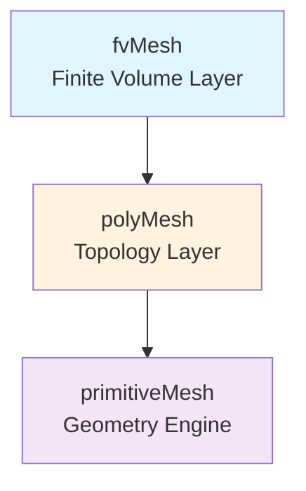

# 🏗️ Introduction to OpenFOAM Mesh Classes

![[polyhedral_mesh_types.png]]
`A high-quality 3D scientific illustration of different cell types in an unstructured polyhedral mesh. It shows a Hexahedron, a Tetrahedron, a Prism, and a complex Polyhedron with many flat faces, all connected seamlessly. Each cell is semi-transparent, showing the internal connections. Clear labels point to "Face", "Cell", and "Point", scientific textbook diagram, clean vector line art, white background, high definition, flat design, educational infographic --ar 16:9`

---

## Overview: The Mesh System Architecture

Welcome to **The Mesh Classes** — the heart of OpenFOAM's computational geometry architecture. This chapter explores the sophisticated class hierarchy that transforms raw geometric data into high-performance computational meshes for finite volume simulations.

### What is a Mesh?

In OpenFOAM, we use an **Unstructured Polyhedral Mesh** system with exceptional flexibility, supporting cells of any shape:
- **Hexahedra** (structured grids)
- **Tetrahedra** (unstructured grids)
- **Prisms** (boundary layer cells)
- **Polyhedra** (arbitrary cell types)

This flexibility enables accurate geometry representation while maintaining computational efficiency.

---

## 🔍 High-Level Concept: The "City Planning" Analogy

Imagine designing a **modern city** — the mesh classes work together like an integrated urban planning system:

| Component | Role | Analogy |
|-----------|------|----------|
| **Points** | Precise coordinates | Surveyor's GPS measurements (latitude/longitude/elevation) |
| **Faces** | Boundary definitions | Property boundaries (fences, walls) |
| **Cells** | 3D control volumes | Building blocks (rooms, apartments, offices) |
| **Connectivity** | Topological relationships | Road networks linking properties |
| **Boundaries** | Domain constraints | Municipal zones with different regulations |

![[city_planning_mesh_analogy.png]]
`A city planning analogy for mesh classes: Points as GPS survey marks, Faces as property boundaries, Cells as 3D zoning blocks, and Patches as municipal districts with different regulations, scientific textbook diagram, clean vector line art, white background, high definition, flat design, educational infographic --ar 16:9`

**Key Insight:** Just as urban planning requires coordination between surveyors, architects, and city administrators — OpenFOAM's mesh architecture coordinates multiple specialized classes, each with distinct responsibilities, working together to create a functional computational domain where CFD equations "live and flow."

---

## 🏗️ The Three-Layer Architecture

OpenFOAM's mesh system follows a **three-layer architectural pattern** designed for both flexibility and performance:



### Layer Comparison

| Layer | Primary Function | Key Responsibilities |
|-------|------------------|----------------------|
| **primitiveMesh** | Pure geometric computation | • Calculate centers, volumes, normals<br>• Mesh quality metrics<br>• Lazy evaluation mechanisms |
| **polyMesh** | Topology management | • Store points, faces, cells<br>• Owner/neighbor relationships<br>• Boundary patches<br>• Parallel decomposition support |
| **fvMesh** | Finite volume discretization | • Geometric field storage<br>• Solver API<br>• On-demand geometry calculations |

**Design Principle:** Each layer has a clear, focused responsibility, enabling independent optimization and easier maintenance.

---

## 📊 Mathematical Foundation: The Finite Volume Method

The finite volume method (FVM) fundamentally relies on dividing the computational domain into discrete control volumes (cells). For each cell $V_i$, we integrate the governing conservation equation:

$$
\int_{V_i} \frac{\partial \phi}{\partial t} \, \mathrm{d}V + \oint_{\partial V_i} \phi \mathbf{u} \cdot \mathbf{n} \, \mathrm{d}S = \int_{V_i} S_\phi \, \mathrm{d}V \tag{1}
$$

**Variables:**
- $\phi$ = field variable (velocity, pressure, temperature, etc.)
- $\mathbf{u}$ = velocity field
- $\mathbf{n}$ = outward unit normal vector at the surface
- $S_\phi$ = source term

The mesh classes provide the geometric data necessary to evaluate these surface integrals and control volume calculations with high precision.

---

## 🔧 Core Mesh Components

### 1. The Point Class

Stores geometric coordinates of mesh vertices:

```cpp
class pointField : public Field<point>
{
    // Inherits from Field<point> for efficient storage
    // Provides access to coordinates via pointField[i]
};
```

Each point $p_i = (x_i, y_i, z_i)$ represents a vertex in 3D space. The `pointField` class provides random access to these coordinates and supports vector operations for geometric calculations.

### 2. The Face Class

Defines polygonal boundaries between cells:

```cpp
class face
{
private:
    List<label> points_;  // List of point indices forming the face

public:
    // Calculate face normal vector
    vector normal(const pointField&) const;

    // Calculate face centroid
    point centre(const pointField&) const;

    // Calculate face area
    scalar area(const pointField&) const;
};
```

**Face Properties:**

- **Normal vector:** $\mathbf{n} = \frac{1}{2A}\sum_{i=1}^{n} (\mathbf{r}_i \times \mathbf{r}_{i+1})$
- **Centroid:** Weighted average of point coordinates
- **Area:** Calculated using polygon area formulas

![[face_geometry_discretization.png]]
`A diagram showing face geometry discretization: point indices, normal vector calculation via cross products, centroid position, and area calculation for a non-planar polygonal face, scientific textbook diagram, clean vector line art, white background, high definition, flat design, educational infographic --ar 16:9`

### 3. The Cell Class

Represents 3D polyhedral control volumes:

```cpp
class cell
{
private:
    List<label> faces_;  // List of face indices bounding the cell

public:
    // Calculate cell volume
    scalar mag(const pointField&, const faceList&) const;

    // Calculate cell centroid
    point centre(const pointField&, const faceList&) const;
};
```

**Cell Volume Calculation:**

Each cell is defined by its bounding faces. The cell volume calculation uses the divergence theorem:

$$
V = \frac{1}{6} \sum_{f \in \text{faces}} (\mathbf{c}_f \cdot \mathbf{n}_f) A_f \tag{2}
$$

**Variables:**
- $\mathbf{c}_f$ = face centroid
- $\mathbf{n}_f$ = face normal
- $A_f$ = face area

![[cell_volume_divergence_theorem.png]]
`A 3D cell bounded by multiple faces, illustrating the use of the divergence theorem to calculate its volume by summing (centroid · normal) over all faces, scientific textbook diagram, clean vector line art, white background, high definition, flat design, educational infographic --ar 16:9`

### 4. Boundary Conditions (Patches)

Collections of faces with specific physical behaviors:

```cpp
class polyPatch
{
public:
    virtual void updateMesh(PolyTopoChange&) = 0;

    // Access to patch-specific fields
    const word& name() const;
    const labelList& meshPoints() const;
    const labelList& meshFaces() const;
};
```

---

## ⚙️ Key Optimization Strategies

OpenFOAM's mesh classes incorporate several critical optimizations:

| Optimization | Purpose | Impact |
|--------------|---------|--------|
| **Compact Storage** | Contiguous memory layouts | Efficient cache utilization |
| **Lazy Evaluation** | Geometric quantities | Computed on-demand and cached |
| **Reference Counting** | Smart pointers | Prevents memory leaks while maintaining efficiency |
| **Cache-Friendly Algorithms** | Iteration patterns | Optimized for modern CPU architectures |

### Lazy Evaluation Mechanism

```cpp
// Example: Surface area vectors computed only on first access
const surfaceVectorField& Sf = mesh.Sf();  // Triggers computation if needed
const volScalarField& V = mesh.V();        // Cell volumes computed on-demand
```

**Benefits:**
- Reduces redundant calculations
- Saves memory
- Improves overall performance

---

## 🔗 Class Interactions

Mesh classes work together through well-defined interfaces:

```cpp
// Example: Accessing geometric information
const fvMesh& mesh = ...;  // Reference to the finite volume mesh

// Access points
const pointField& points = mesh.points();

// Access faces and their properties
const faceList& faces = mesh.faces();
vector faceNormal = faces[faceID].normal(points);

// Access cells and their properties
const cellList& cells = mesh.cells();
scalar cellVolume = cells[cellID].mag(points, faces);

// Access boundary information
const polyPatchList& patches = mesh.boundaryMesh();
const fvPatch& wallPatch = patches[wallPatchID];
```

---

## 📈 Applications in CFD

This mesh architecture enables:

- **Flux Calculations:** Face areas and normals for convection terms
- **Gradient Computations:** Cell centers and volumes for diffusion terms
- **Boundary Conditions:** Patch-specific physics and constraints
- **Adaptive Meshing:** Dynamic mesh topology modifications
- **Parallel Computation:** Domain decomposition and load balancing

---

## 🎯 Learning Objectives

After completing this chapter, you will understand:

1. **How geometric data is organized** in OpenFOAM's hierarchical mesh class structure
2. **The mathematical foundations** of finite volume mesh geometry
3. **Optimization strategies** for computational geometry
4. **How to access and manipulate** mesh data for custom applications
5. **The relationship between topology and geometry** in CFD meshes

---

> [!INFO] Next Steps
>
> This introduction provides the foundation for understanding OpenFOAM's mesh architecture. In the following sections, we will explore:
> - The detailed three-layer class hierarchy
> - Primitive mesh geometry calculations
> - Topology management in polyMesh
> - Finite volume discretization in fvMesh
> - Practical applications and best practices
>
> Continue to [[02_🏗️_The_Mesh_Class_Hierarchy_A_Three-Layer_Architecture]] for a deeper dive into the architectural design.
