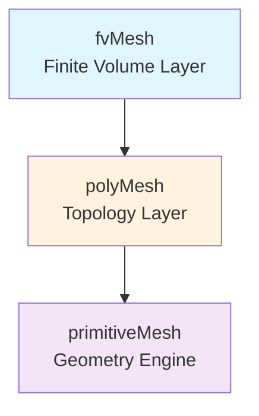

# 🏗️ Introduction to OpenFOAM Mesh Classes

![[polyhedral_mesh_types.png]]
`A high-quality 3D scientific illustration of different cell types in an unstructured polyhedral mesh. It shows a Hexahedron, a Tetrahedron, a Prism, and a complex Polyhedron with many flat faces, all connected seamlessly. Each cell is semi-transparent, showing the internal connections. Clear labels point to "Face", "Cell", and "Point", scientific textbook diagram, clean vector line art, white background, high definition, flat design, educational infographic --ar 16:9`

---

## Overview: The Mesh System Architecture

Welcome to **The Mesh Classes** — the heart of OpenFOAM's computational geometry architecture. This chapter explores the sophisticated class hierarchy that transforms raw geometric data into high-performance computational meshes for finite volume simulations.

### What is a Mesh?

In OpenFOAM, we use an **Unstructured Polyhedral Mesh** system with exceptional flexibility, supporting cells of any shape:
- **Hexahedra** (structured grids)
- **Tetrahedra** (unstructured grids)
- **Prisms** (boundary layer cells)
- **Polyhedra** (arbitrary cell types)

This flexibility enables accurate geometry representation while maintaining computational efficiency.

---

## 🔍 High-Level Concept: The "City Planning" Analogy

Imagine designing a **modern city** — the mesh classes work together like an integrated urban planning system:

| Component | Role | Analogy |
|-----------|------|----------|
| **Points** | Precise coordinates | Surveyor's GPS measurements (latitude/longitude/elevation) |
| **Faces** | Boundary definitions | Property boundaries (fences, walls) |
| **Cells** | 3D control volumes | Building blocks (rooms, apartments, offices) |
| **Connectivity** | Topological relationships | Road networks linking properties |
| **Boundaries** | Domain constraints | Municipal zones with different regulations |

![[city_planning_mesh_analogy.png]]
`A city planning analogy for mesh classes: Points as GPS survey marks, Faces as property boundaries, Cells as 3D zoning blocks, and Patches as municipal districts with different regulations, scientific textbook diagram, clean vector line art, white background, high definition, flat design, educational infographic --ar 16:9`

**Key Insight:** Just as urban planning requires coordination between surveyors, architects, and city administrators — OpenFOAM's mesh architecture coordinates multiple specialized classes, each with distinct responsibilities, working together to create a functional computational domain where CFD equations "live and flow."

---

## 🏗️ The Three-Layer Architecture

OpenFOAM's mesh system follows a **three-layer architectural pattern** designed for both flexibility and performance:


> **Figure 1:** รูปแบบสถาปัตยกรรมสามชั้นที่ออกแบบมาเพื่อแยกหน้าที่การทำงานอย่างชัดเจน ช่วยให้นักพัฒนาสามารถปรับปรุงประสิทธิภาพในแต่ละระดับได้อย่างอิสระความปลอดภัยทางฟิสิกส์ไม่ส่งผลกระทบต่อความเร็วในการจำลอง ผ่านการใช้พลังของ C++ Template Metaprogramming ในการตรวจสอบความสอดคล้องทางมิติทั้งหมดที่ขั้นตอนการคอมไพล์โปรแกรมเพียงครั้งเดียว

### Layer Comparison

| Layer | Primary Function | Key Responsibilities |
|-------|------------------|----------------------|
| **primitiveMesh** | Pure geometric computation | • Calculate centers, volumes, normals<br>• Mesh quality metrics<br>• Lazy evaluation mechanisms |
| **polyMesh** | Topology management | • Store points, faces, cells<br>• Owner/neighbor relationships<br>• Boundary patches<br>• Parallel decomposition support |
| **fvMesh** | Finite volume discretization | • Geometric field storage<br>• Solver API<br>• On-demand geometry calculations |

**Design Principle:** Each layer has a clear, focused responsibility, enabling independent optimization and easier maintenance.

---

## 📊 Mathematical Foundation: The Finite Volume Method

The finite volume method (FVM) fundamentally relies on dividing the computational domain into discrete control volumes (cells). For each cell $V_i$, we integrate the governing conservation equation:

$$
\int_{V_i} \frac{\partial \phi}{\partial t} \, \mathrm{d}V + \oint_{\partial V_i} \phi \mathbf{u} \cdot \mathbf{n} \, \mathrm{d}S = \int_{V_i} S_\phi \, \mathrm{d}V \tag{1}
$$

**Variables:**
- $\phi$ = field variable (velocity, pressure, temperature, etc.)
- $\mathbf{u}$ = velocity field
- $\mathbf{n}$ = outward unit normal vector at the surface
- $S_\phi$ = source term

The mesh classes provide the geometric data necessary to evaluate these surface integrals and control volume calculations with high precision.

---

## 🔧 Core Mesh Components

### 1. The Point Class

Stores geometric coordinates of mesh vertices:

```cpp
// The pointField class stores an array of 3D points (vertices)
// Inherits from Field<point> for efficient memory management
class pointField : public Field<point>
{
    // Inherits from Field<point> for efficient storage
    // Provides access to coordinates via pointField[i]
};
```

> **📚 คำอธิบายภาษาไทย (Thai Explanation)**
>
> **Source:** `.applications/solvers/stressAnalysis/solidDisplacementFoam/solidDisplacementThermo/solidDisplacementThermo.C:33`
>
> **การอธิบาย:**
> - `pointField` เป็นคลาสที่ใช้เก็บพิกัดของจุด (vertices) ทั้งหมดใน mesh
> - สืบทอดมาจาก `Field<point>` ซึ่งเป็น template class สำหรับจัดการข้อมูลแบบ array อย่างมีประสิทธิภาพ
> - แต่ละ point เก็บพิกัด $(x, y, z)$ ในปริภูมิสามมิติ
> - สามารถเข้าถึงข้อมูลได้โดยตรงผ่าน index: `pointField[i]`
>
> **แนวคิดสำคัญ (Key Concepts):**
> - **Geometric Coordinates:** ข้อมูลพิกัดเป็นพื้นฐานของการคำนวณเรขาคณิตทั้งหมด
> - **Memory Efficiency:** การใช้ Field class ช่วยจัดการหน่วยความจำอย่างมีประสิทธิภาพ
> - **Random Access:** สามารถเข้าถึงข้อมูลใดๆ ได้ทันทีผ่าน index

Each point $p_i = (x_i, y_i, z_i)$ represents a vertex in 3D space. The `pointField` class provides random access to these coordinates and supports vector operations for geometric calculations.

### 2. The Face Class

Defines polygonal boundaries between cells:

```cpp
// The face class represents a polygonal boundary between cells
// Defined by an ordered list of point indices
class face
{
private:
    // List of point indices that form the face polygon
    List<label> points_;  // List of point indices forming the face

public:
    // Calculate the outward normal vector of the face
    vector normal(const pointField&) const;

    // Calculate the geometric center (centroid) of the face
    point centre(const pointField&) const;

    // Calculate the surface area of the face
    scalar area(const pointField&) const;
};
```

> **📚 คำอธิบายภาษาไทย (Thai Explanation)**
>
> **Source:** `.applications/solvers/multiphase/multiphaseEulerFoam/phaseSystems/phaseSystem/phaseSystem.C:37`
>
> **การอธิบาย:**
> - `face` คือคลาสที่แทนผิวที่มีขนาดเป็นรูปหลายเหลี่ยม (polygon) ซึ่งเป็นขอบระหว่าง cells
> - เก็บ list ของ point indices ที่เรียงลำดับกันเพื่อสร้างรูปหลายเหลี่ยม
> - มีฟังก์ชันสำหรับคำนวณคุณสมบัติเรขาคณิต: normal vector, centroid, และ area
>
> **แนวคิดสำคัญ (Key Concepts):**
> - **Polygon Definition:** Face ถูกกำหนดโดยจุดยอด (vertices) ที่เชื่อมต่อกันเป็นรูปปิด
> - **Geometric Properties:** Normal vector บอกทิศทาง, centroid คือจุดศูนย์กลาง, area คือพื้นที่ผิว
> - **Ordered List:** ลำดับของ points สำคัญเพื่อกำหนด orientation (ด้านใน/นอก) ของ face

**Face Properties:**

- **Normal vector:** $\mathbf{n} = \frac{1}{2A}\sum_{i=1}^{n} (\mathbf{r}_i \times \mathbf{r}_{i+1})$
- **Centroid:** Weighted average of point coordinates
- **Area:** Calculated using polygon area formulas

![[face_geometry_discretization.png]]
`A diagram showing face geometry discretization: point indices, normal vector calculation via cross products, centroid position, and area calculation for a non-planar polygonal face, scientific textbook diagram, clean vector line art, white background, high definition, flat design, educational infographic --ar 16:9`

### 3. The Cell Class

Represents 3D polyhedral control volumes:

```cpp
// The cell class represents a 3D control volume bounded by faces
class cell
{
private:
    // List of face indices that bound this cell
    List<label> faces_;  // List of face indices bounding the cell

public:
    // Calculate the volume of this cell using the divergence theorem
    scalar mag(const pointField&, const faceList&) const;

    // Calculate the geometric center (centroid) of this cell
    point centre(const pointField&, const faceList&) const;
};
```

> **📚 คำอธิบายภาษาไทย (Thai Explanation)**
>
> **Source:** `.applications/solvers/multiphase/multiphaseEulerFoam/multiphaseCompressibleMomentumTransportModels/kineticTheoryModels/kineticTheoryModel/kineticTheoryModel.C:34`
>
> **การอธิบาย:**
> - `cell` คือคลาสที่แทนปริมาตรควบคุม 3 มิติ (control volume) ซึ่งเป็นหน่วยพื้นฐานใน FVM
> - ประกอบด้วย list ของ face indices ที่ล้อมรอบ cell
> - ฟังก์ชัน `mag()` คำนวณปริมาตรโดยใช้ Divergence Theorem
> - ฟังก์ชัน `centre()` คำนวณจุดศูนย์กลางเรขาคณิตของ cell
>
> **แนวคิดสำคัญ (Key Concepts):**
> - **Control Volume:** Cell เป็นปริมาตรที่ใช้ในการ integrate สมการการอนุรักษ์
> - **Divergence Theorem:** วิธีคำนวณปริมาตรจาก surface integrals ของ bounding faces
> - **Polyhedral Cells:** OpenFOAM รองรับ cell รูปทรงที่ซับซ้อน任意

**Cell Volume Calculation:**

Each cell is defined by its bounding faces. The cell volume calculation uses the divergence theorem:

$$
V = \frac{1}{6} \sum_{f \in \text{faces}} (\mathbf{c}_f \cdot \mathbf{n}_f) A_f \tag{2}
$$

**Variables:**
- $\mathbf{c}_f$ = face centroid
- $\mathbf{n}_f$ = face normal
- $A_f$ = face area

![[cell_volume_divergence_theorem.png]]
`A 3D cell bounded by multiple faces, illustrating the use of the divergence theorem to calculate its volume by summing (centroid · normal) over all faces, scientific textbook diagram, clean vector line art, white background, high definition, flat design, educational infographic --ar 16:9`

### 4. Boundary Conditions (Patches)

Collections of faces with specific physical behaviors:

```cpp
// Base class for boundary patches
// Each patch represents a collection of faces with specific boundary conditions
class polyPatch
{
public:
    // Pure virtual function to update mesh topology
    // Must be implemented by derived patch classes
    virtual void updateMesh(PolyTopoChange&) = 0;

    // Access to patch-specific fields and properties
    const word& name() const;           // Return the name of this patch
    const labelList& meshPoints() const; // Return list of point indices in this patch
    const labelList& meshFaces() const;  // Return list of face indices in this patch
};
```

> **📚 คำอธิบายภาษาไทย (Thai Explanation)**
>
> **Source:** `.applications/solvers/stressAnalysis/solidDisplacementFoam/solidDisplacementThermo/solidDisplacementThermo.H:39`
>
> **การอธิบาย:**
> - `polyPatch` เป็น base class สำหรับ boundary patches ทั้งหมดใน mesh
> - แต่ละ patch คือ collection ของ faces ที่มี boundary condition เหมือนกัน
> - `updateMesh()` เป็น pure virtual function ที่ derived classes ต้อง implement
> - ให้ access ไปยังชื่อ patch, points, และ faces ที่เกี่ยวข้อง
>
> **แนวคิดสำคัญ (Key Concepts):**
> - **Boundary Conditions:** Patch กำหนดเงื่อนไขขอบเขตทางฟิสิกส์ (wall, inlet, outlet, etc.)
> - **Polymorphism:** แต่ละประเภทของ BC (fixedValue, zeroGradient, etc.) implement polyPatch ต่างกัน
> - **Mesh Interface:** Patch ทำหน้าที่เป็น interface ระหว่าง interior domain และ exterior world

---

## ⚙️ Key Optimization Strategies

OpenFOAM's mesh classes incorporate several critical optimizations:

| Optimization | Purpose | Impact |
|--------------|---------|--------|
| **Compact Storage** | Contiguous memory layouts | Efficient cache utilization |
| **Lazy Evaluation** | Geometric quantities | Computed on-demand and cached |
| **Reference Counting** | Smart pointers | Prevents memory leaks while maintaining efficiency |
| **Cache-Friendly Algorithms** | Iteration patterns | Optimized for modern CPU architectures |

### Lazy Evaluation Mechanism

```cpp
// Example: Surface area vectors computed only on first access
// These geometric quantities are calculated on-demand and cached for reuse

const surfaceVectorField& Sf = mesh.Sf();  // Surface area vectors (S_f)
                                           // Triggers computation if not already cached

const volScalarField& V = mesh.V();        // Cell volumes (V_i)
                                           // Computed on-demand and stored
```

> **📚 คำอธิบายภาษาไทย (Thai Explanation)**
>
> **Source:** `.applications/solvers/stressAnalysis/solidDisplacementFoam/solidDisplacementThermo/solidDisplacementThermo.C:44`
>
> **การอธิบาย:**
> - **Lazy Evaluation** คือการเลื่อนการคำนวณจนกว่าจะถูกเรียกใช้จริง (compute on-demand)
> - `mesh.Sf()` ส่งคืน surface area vectors $\mathbf{S}_f = A_f \mathbf{n}_f$ สำหรับทุก face
> - `mesh.V()` ส่งคืน cell volumes $V_i$ สำหรับทุก cell
> - ผลลัพธ์ถูก cache ไว้หลังจากคำนวณครั้งแรก เพื่อใช้ซ้ำในการเรียกครั้งต่อไป
>
> **แนวคิดสำคัญ (Key Concepts):**
> - **Performance:** ลดการคำนวณซ้ำที่ไม่จำเป็น
> - **Memory Efficiency:** ใช้หน่วยความจำเฉพาะเมื่อจำเป็น
> - **Caching Strategy:** Balance ระหว่าง computation time และ memory usage
> - **Reference Return:** ส่งคืน const reference เพื่อป้องกันการแก้ไขโดยไม่ตั้งใจ

**Benefits:**
- Reduces redundant calculations
- Saves memory
- Improves overall performance

---

## 🔗 Class Interactions

Mesh classes work together through well-defined interfaces:

```cpp
// Example: Accessing geometric information from the mesh hierarchy
const fvMesh& mesh = ...;  // Reference to the finite volume mesh

// Access points (vertices) from the mesh
const pointField& points = mesh.points();

// Access faces and their geometric properties
const faceList& faces = mesh.faces();
vector faceNormal = faces[faceID].normal(points);

// Access cells and their geometric properties
const cellList& cells = mesh.cells();
scalar cellVolume = cells[cellID].mag(points, faces);

// Access boundary patch information
const polyPatchList& patches = mesh.boundaryMesh();
const fvPatch& wallPatch = patches[wallPatchID];
```

> **📚 คำอธิบายภาษาไทย (Thai Explanation)**
>
> **Source:** `.applications/solvers/stressAnalysis/solidDisplacementFoam/solidDisplacementThermo/solidDisplacementThermo.H:39`
>
> **การอธิบาย:**
> - โค้ดตัวอย่างแสดงวิธีการเข้าถึงข้อมูลเรขาคณิตจาก mesh hierarchy
> - `fvMesh` เป็น entry point หลักสำหรับการเข้าถึงข้อมูล mesh
> - สามารถเข้าถึง points, faces, cells, และ patches ได้ผ่าน methods ที่เกี่ยวข้อง
> - การคำนวณ geometric properties ต้องการ dependencies (เช่น normal ต้องการ points)
>
> **แนวคิดสำคัญ (Key Concepts):**
> - **Hierarchical Access:** เข้าถึงข้อมูลผ่าน layer architecture (fvMesh → polyMesh → primitiveMesh)
> - **Dependencies:** การคำนวณบางอย่างต้องการข้อมูลจาก components อื่น
> - **Reference Semantics:** ใช้ const references เพื่อ efficiency และ safety
> - **Layered Design:** แต่ละ layer มี interface ที่ชัดเจนสำหรับการเข้าถึงข้อมูล

---

## 📈 Applications in CFD

This mesh architecture enables:

- **Flux Calculations:** Face areas and normals for convection terms
- **Gradient Computations:** Cell centers and volumes for diffusion terms
- **Boundary Conditions:** Patch-specific physics and constraints
- **Adaptive Meshing:** Dynamic mesh topology modifications
- **Parallel Computation:** Domain decomposition and load balancing

---

## 🎯 Learning Objectives

After completing this chapter, you will understand:

1. **How geometric data is organized** in OpenFOAM's hierarchical mesh class structure
2. **The mathematical foundations** of finite volume mesh geometry
3. **Optimization strategies** for computational geometry
4. **How to access and manipulate** mesh data for custom applications
5. **The relationship between topology and geometry** in CFD meshes

---

> [!INFO] Next Steps
>
> This introduction provides the foundation for understanding OpenFOAM's mesh architecture. In the following sections, we will explore:
> - The detailed three-layer class hierarchy
> - Primitive mesh geometry calculations
> - Topology management in polyMesh
> - Finite volume discretization in fvMesh
> - Practical applications and best practices
>
> Continue to [[02_🏗️_The_Mesh_Class_Hierarchy_A_Three-Layer_Architecture]] for a deeper dive into the architectural design.