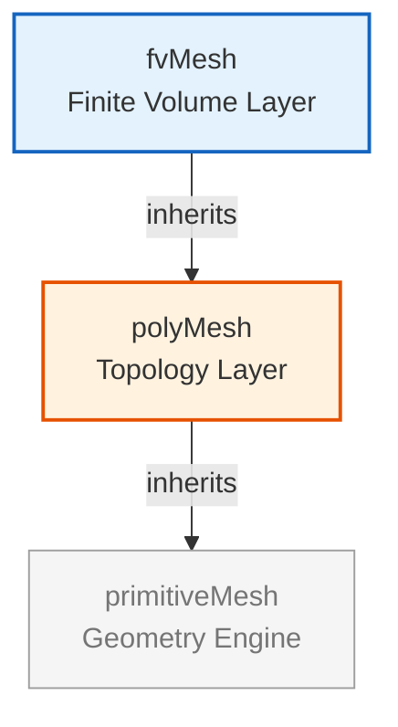

# 🏗️ บทนำสู่คลาสเมชใน OpenFOAM (Introduction to OpenFOAM Mesh Classes)

![[polyhedral_mesh_types.png]]
`A high-quality 3D scientific illustration of different cell types in an unstructured polyhedral mesh. It shows a Hexahedron, a Tetrahedron, a Prism, and a complex Polyhedron with many flat faces, all connected seamlessly. Each cell is semi-transparent, showing the internal connections. Clear labels point to "Face", "Cell", and "Point", scientific textbook diagram, clean vector line art, white background, high definition, flat design, educational infographic --ar 16:9`

---

## ภาพรวม: สถาปัตยกรรมระบบเมช (Overview: The Mesh System Architecture)

ยินดีต้อนรับสู่ **คลาสเมช (The Mesh Classes)** ซึ่งเป็นหัวใจสำคัญของสถาปัตยกรรมเรขาคณิตเชิงคำนวณใน OpenFOAM บทนี้จะสำรวจลำดับชั้นของคลาสที่ซับซ้อน ซึ่งเปลี่ยนข้อมูลเรขาคณิตดิบให้เป็นเมชเชิงคำนวณประสิทธิภาพสูงสำหรับการจำลองด้วยวิธีไฟไนต์วอลุ่ม (Finite Volume Method)

### เมชคืออะไร?

ใน OpenFOAM เราใช้ระบบ **เมชรูปทรงหลายเหลี่ยมแบบไม่มีโครงสร้าง (Unstructured Polyhedral Mesh)** ที่มีความยืดหยุ่นสูง โดยรองรับเซลล์ได้ทุกรูปทรง:
- **Hexahedra** (กริดแบบมีโครงสร้าง)
- **Tetrahedra** (กริดแบบไม่มีโครงสร้าง)
- **Prisms** (เซลล์บริเวณชั้นขอบเขต - Boundary layer cells)
- **Polyhedra** (เซลล์รูปทรงหลายเหลี่ยมใดๆ)

ความยืดหยุ่นนี้ช่วยให้สามารถแสดงรูปทรงเรขาคณิตที่แม่นยำในขณะที่ยังคงประสิทธิภาพในการคำนวณไว้ได้

---

## 🔍 แนวคิดระดับสูง: การเปรียบเทียบกับการผังเมือง (High-Level Concept: The "City Planning" Analogy)

ลองจินตนาการถึงการออกแบบ **เมืองสมัยใหม่** — คลาสเมชทำงานร่วมกันเหมือนระบบการวางผังเมืองแบบบูรณาการ:

| ส่วนประกอบ | บทบาท | การเปรียบเทียบ |
|-----------|------|----------|
| **จุด (Points)** | พิกัดที่แม่นยำ | การวัดค่า GPS ของช่างสำรวจ (ละติจูด/ลองจิจูด/ระดับความสูง) |
| **หน้า (Faces)** | การกำหนดขอบเขต | ขอบเขตทรัพย์สิน (รั้ว, กำแพง) |
| **เซลล์ (Cells)** | ปริมาตรควบคุม 3 มิติ | บล็อกอาคาร (ห้อง, อพาร์ตเมนต์, สำนักงาน) |
| **การเชื่อมต่อ (Connectivity)** | ความสัมพันธ์เชิงโทโพโลยี | เครือข่ายถนนที่เชื่อมโยงทรัพย์สินเข้าด้วยกัน |
| **ขอบเขต (Boundaries)** | ข้อจำกัดของโดเมน | เขตเทศบาลที่มีกฎระเบียบต่างกัน |

![[city_planning_mesh_analogy.png]]
`A city planning analogy for mesh classes: Points as GPS survey marks, Faces as property boundaries, Cells as 3D zoning blocks, and Patches as municipal districts with different regulations, scientific textbook diagram, clean vector line art, white background, high definition, flat design, educational infographic --ar 16:9`

**ข้อมูลเชิงลึกที่สำคัญ:** เช่นเดียวกับการวางผังเมืองที่ต้องมีการประสานงานระหว่างช่างสำรวจ สถาปนิก และผู้บริหารเมือง — สถาปัตยกรรมเมชของ OpenFOAM ประสานงานระหว่างคลาสเฉพาะทางหลายคลาส ซึ่งแต่ละคลาสมีหน้าที่แตกต่างกัน แต่ทำงานร่วมกันเพื่อสร้างโดเมนเชิงคำนวณที่สมบูรณ์ซึ่งสมการ CFD "อาศัยและไหลเวียน" อยู่

---

## 🏗️ สถาปัตยกรรมสามชั้น (The Three-Layer Architecture)

ระบบเมชของ OpenFOAM เป็นไปตาม **รูปแบบสถาปัตยกรรมสามชั้น** ที่ออกแบบมาเพื่อทั้งความยืดหยุ่นและประสิทธิภาพ:


> **รูปที่ 1:** รูปแบบสถาปัตยกรรมสามชั้นที่ออกแบบมาเพื่อแยกหน้าที่การทำงานอย่างชัดเจน ช่วยให้นักพัฒนาสามารถปรับปรุงประสิทธิภาพในแต่ละระดับได้อย่างอิสระ ผ่านการแยกความรับผิดชอบที่ชัดเจนระหว่างระดับเรขาคณิตพื้นฐาน โทโพโลยี และการดิสครีตแบบไฟไนต์วอลุ่ม

### การเปรียบเทียบแต่ละชั้น (Layer Comparison)

| ชั้น | หน้าที่หลัก | ความรับผิดชอบสำคัญ |
|-------|------------------|----------------------|
| **primitiveMesh** | การคำนวณทางเรขาคณิตบริสุทธิ์ | • คำนวณจุดศูนย์กลาง, ปริมาตร, เวกเตอร์แนวฉาก<br>• ตัวชี้วัดคุณภาพเมช<br>• กลไกการคำนวณเมื่อต้องการ (Lazy evaluation) |
| **polyMesh** | การจัดการโทโพโลยี | • จัดเก็บจุด, หน้า, เซลล์<br>• ความสัมพันธ์ระหว่างเจ้าของและเพื่อนบ้าน (Owner/neighbor)<br>• แพตช์ขอบเขต (Boundary patches)<br>• การรองรับการสลายตัวแบบขนาน (Parallel decomposition) |
| **fvMesh** | การดิสครีตแบบไฟไนต์วอลุ่ม | • การจัดเก็บสนามทางเรขาคณิต (Geometric field storage)<br>• Solver API<br>• การคำนวณเรขาคณิตตามความต้องการ |

**หลักการออกแบบ:** แต่ละชั้นมีความรับผิดชอบที่ชัดเจนและมุ่งเน้น ช่วยให้สามารถปรับปรุงประสิทธิภาพได้อย่างอิสระและบำรุงรักษาได้ง่ายขึ้น

---

## 📊 พื้นฐานทางคณิตศาสตร์: วิธีไฟไนต์วอลุ่ม (Mathematical Foundation: The Finite Volume Method)

วิธีไฟไนต์วอลุ่ม (FVM) อาศัยการแบ่งโดเมนเชิงคำนวณออกเป็นปริมาตรควบคุมแบบไม่ต่อเนื่อง (เซลล์) สำหรับแต่ละเซลล์ $V_i$ เราจะทำการอินทิเกรตสมการการอนุรักษ์ที่ควบคุมระบบ:

$$ 
\int_{V_i} \frac{\partial \phi}{\partial t} \, \mathrm{d}V + \oint_{\partial V_i} \phi \mathbf{u} \cdot \mathbf{n} \, \mathrm{d}S = \int_{V_i} S_\phi \, \mathrm{d}V \tag{1}
$$ 

**ตัวแปร:**
- $\phi$ = ตัวแปรสนาม (ความเร็ว, ความดัน, อุณหภูมิ ฯลฯ)
- $\mathbf{u}$ = สนามความเร็ว
- $\mathbf{n}$ = เวกเตอร์แนวฉากหนึ่งหน่วยที่พุ่งออกจากผิว
- $S_\phi$ = เทอมแหล่งกำเนิด (Source term)

คลาสเมชให้ข้อมูลทางเรขาคณิตที่จำเป็นในการประเมินการอินทิเกรตตามผิวและการคำนวณปริมาตรควบคุมเหล่านี้ด้วยความแม่นยำสูง

---

## 🔧 ส่วนประกอบหลักของเมช (Core Mesh Components)

### 1. คลาสจุด (The Point Class)

จัดเก็บพิกัดทางเรขาคณิตของจุดยอดเมช (Mesh vertices):

```cpp
// pointField จัดเก็บอาร์เรย์ของจุด 3 มิติ (จุดยอด)
// สืบทอดมาจาก Field<point> เพื่อการจัดการหน่วยความจำที่มีประสิทธิภาพ
class pointField : public Field<point>
{
    // สืบทอดมาจาก Field<point> เพื่อการจัดเก็บที่มีประสิทธิภาพ
    // ให้การเข้าถึงพิกัดผ่าน pointField[i]
};
```

> **📚 คำอธิบาย**
>
> - `pointField` เป็นคลาสที่ใช้เก็บพิกัดของจุด (vertices) ทั้งหมดในเมช
> - สืบทอดมาจาก `Field<point>` ซึ่งเป็นคลาสเทมเพลตสำหรับจัดการข้อมูลแบบอาร์เรย์อย่างมีประสิทธิภาพ
> - แต่ละจุดเก็บพิกัด $(x, y, z)$ ในพื้นที่สามมิติ
> - สามารถเข้าถึงข้อมูลได้โดยตรงผ่านดัชนี: `pointField[i]`
>
> **แนวคิดสำคัญ:**
> - **พิกัดทางเรขาคณิต:** ข้อมูลพิกัดเป็นพื้นฐานของการคำนวณเรขาคณิตทั้งหมด
> - **ประสิทธิภาพหน่วยความจำ:** การใช้คลาส Field ช่วยจัดการหน่วยความจำได้อย่างเหมาะสม
> - **การเข้าถึงแบบสุ่ม:** สามารถเข้าถึงข้อมูลใดๆ ได้ทันทีผ่านดัชนี

แต่ละจุด $p_i = (x_i, y_i, z_i)$ แทนจุดยอดในพื้นที่ 3 มิติ คลาส `pointField` ให้การเข้าถึงพิกัดเหล่านี้แบบสุ่มและรองรับการดำเนินการทางเวกเตอร์สำหรับการคำนวณทางเรขาคณิต

### 2. คลาสหน้า (The Face Class)

กำหนดขอบเขตที่เป็นรูปหลายเหลี่ยมระหว่างเซลล์:

```cpp
// คลาส face แทนขอบเขตที่เป็นรูปหลายเหลี่ยมระหว่างเซลล์
// กำหนดโดยรายการดัชนีของจุดที่เรียงลำดับกัน
class face
{
private:
    // รายการดัชนีของจุดที่รวมกันเป็นรูปหลายเหลี่ยมของหน้า
    List<label> points_;  // รายการดัชนีจุดที่สร้างเป็นหน้า

public:
    // คำนวณเวกเตอร์แนวฉากที่พุ่งออกจากหน้า
    vector normal(const pointField&) const;

    // คำนวณจุดศูนย์กลางทางเรขาคณิต (centroid) ของหน้า
    point centre(const pointField&) const;

    // คำนวณพื้นที่ผิวของหน้า
    scalar area(const pointField&) const;
};
```

> **📚 คำอธิบาย**
>
> - `face` คือคลาสที่แทนผิวรูปหลายเหลี่ยม (polygon) ซึ่งเป็นรอยต่อระหว่างเซลล์
> - เก็บรายการดัชนีของจุด (point indices) ที่เรียงลำดับกันเพื่อสร้างรูปหลายเหลี่ยม
> - มีฟังก์ชันสำหรับคำนวณคุณสมบัติทางเรขาคณิต: เวกเตอร์แนวฉาก (normal vector), จุดศูนย์กลาง (centroid), และพื้นที่ (area)
>
> **แนวคิดสำคัญ:**
> - **การนิยามรูปหลายเหลี่ยม:** หน้าถูกกำหนดโดยจุดยอดที่เชื่อมต่อกันเป็นรูปปิด
> - **คุณสมบัติทางเรขาคณิต:** เวกเตอร์แนวฉากบอกทิศทาง, จุดศูนย์กลางคือจุดกึ่งกลาง, และพื้นที่คือขนาดของผิว
> - **รายการที่เรียงลำดับ:** ลำดับของจุดมีความสำคัญต่อการกำหนดทิศทาง (orientation) ของหน้า

**คุณสมบัติของหน้า:**

- **เวกเตอร์แนวฉาก (Normal vector):** $\mathbf{n} = \frac{1}{2A}\sum_{i=1}^{n} (\mathbf{r}_i \times \mathbf{r}_{i+1})$
- **จุดศูนย์กลาง (Centroid):** ค่าเฉลี่ยถ่วงน้ำหนักของพิกัดจุด
- **พื้นที่ (Area):** คำนวณโดยใช้สูตรพื้นที่รูปหลายเหลี่ยม

![[face_geometry_discretization.png]]
`A diagram showing face geometry discretization: point indices, normal vector calculation via cross products, centroid position, and area calculation for a non-planar polygonal face, scientific textbook diagram, clean vector line art, white background, high definition, flat design, educational infographic --ar 16:9`

### 3. คลาสเซลล์ (The Cell Class)

แทนปริมาตรควบคุมรูปทรงหลายเหลี่ยม 3 มิติ:

```cpp
// คลาส cell แทนปริมาตรควบคุม 3 มิติที่ล้อมรอบด้วยหน้าต่างๆ
class cell
{
private:
    // รายการดัชนีของหน้าที่ล้อมรอบเซลล์นี้
    List<label> faces_;  // รายการดัชนีของหน้าที่เป็นขอบเขตของเซลล์

public:
    // คำนวณปริมาตรของเซลล์นี้โดยใช้ทฤษฎีบทการลู่ออก (Divergence theorem)
    scalar mag(const pointField&, const faceList&) const;

    // คำนวณจุดศูนย์กลางทางเรขาคณิต (centroid) ของเซลล์นี้
    point centre(const pointField&, const faceList&) const;
};
```

> **📚 คำอธิบาย**
>
> - `cell` คือคลาสที่แทนปริมาตรควบคุม 3 มิติ (control volume) ซึ่งเป็นหน่วยพื้นฐานใน FVM
> - ประกอบด้วยรายการดัชนีของหน้าที่ล้อมรอบเซลล์
> - ฟังก์ชัน `mag()` คำนวณปริมาตรโดยใช้ทฤษฎีบทการลู่ออก (Divergence Theorem)
> - ฟังก์ชัน `centre()` คำนวณจุดศูนย์กลางทางเรขาคณิตของเซลล์
>
> **แนวคิดสำคัญ:**
> - **ปริมาตรควบคุม:** เซลล์เป็นปริมาตรที่ใช้ในการอินทิเกรตสมการการอนุรักษ์
> - **ทฤษฎีบทการลู่ออก:** วิธีคำนวณปริมาตรจากการอินทิเกรตตามผิวของหน้าที่ล้อมรอบ
> - **เซลล์รูปทรงหลายเหลี่ยม:** OpenFOAM รองรับเซลล์รูปทรงที่ซับซ้อนใดๆ

**การคำนวณปริมาตรเซลล์:**

แต่ละเซลล์ถูกกำหนดโดยหน้าที่ล้อมรอบ การคำนวณปริมาตรเซลล์ใช้ทฤษฎีบทการลู่ออก:

$$ 
V = \frac{1}{6} \sum_{f \in \text{faces}} (\mathbf{c}_f \cdot \mathbf{n}_f) A_f \tag{2}
$$ 

**ตัวแปร:**
- $\mathbf{c}_f$ = จุดศูนย์กลางของหน้า
- $\mathbf{n}_f$ = เวกเตอร์แนวฉากของหน้า
- $A_f$ = พื้นที่หน้า

![[cell_volume_divergence_theorem.png]]
`A 3D cell bounded by multiple faces, illustrating the use of the divergence theorem to calculate its volume by summing (centroid · normal) over all faces, scientific textbook diagram, clean vector line art, white background, high definition, flat design, educational infographic --ar 16:9`

### 4. เงื่อนไขขอบเขต (Patches)

กลุ่มของหน้าที่พฤติกรรมทางกายภาพเฉพาะเจาะจง:

```cpp
// คลาสพื้นฐานสำหรับแพตช์ขอบเขต (Boundary patches)
// แต่ละแพตช์แทนกลุ่มของหน้าที่มีเงื่อนไขขอบเขตเฉพาะ
class polyPatch
{
public:
    // ฟังก์ชันเสมือนบริสุทธิ์เพื่ออัปเดตโทโพโลยีของเมช
    // ต้องถูกสร้างการทำงานในคลาสแพตช์ที่สืบทอดไป
    virtual void updateMesh(PolyTopoChange&) = 0;

    // การเข้าถึงสนามและคุณสมบัติเฉพาะของแพตช์
    const word& name() const;           // ส่งคืนชื่อของแพตช์นี้
    const labelList& meshPoints() const; // ส่งคืนรายการดัชนีจุดในแพตช์นี้
    const labelList& meshFaces() const;  // ส่งคืนรายการดัชนีหน้าในแพตช์นี้
};
```

> **📚 คำอธิบาย**
>
> - `polyPatch` เป็นคลาสพื้นฐาน (base class) สำหรับแพตช์ขอบเขตทั้งหมดในเมช
> - แต่ละแพตช์คือกลุ่มของหน้าที่มีเงื่อนไขขอบเขตทางกายภาพเหมือนกัน
> - `updateMesh()` เป็นฟังก์ชันเสมือนบริสุทธิ์ที่คลาสลูกต้องนำไปสร้างการทำงาน
> - ช่วยให้เข้าถึงข้อมูลชื่อแพตช์, จุด, และหน้าที่เกี่ยวข้อง
>
> **แนวคิดสำคัญ:**
> - **เงื่อนไขขอบเขต:** แพตช์กำหนดเงื่อนไขขอบเขตทางฟิสิกส์ (เช่น ผนัง, ทางเข้า, ทางออก ฯลฯ)
> - **พหุสัณฐาน (Polymorphism):** ประเภทของเงื่อนไขขอบเขตที่ต่างกัน (fixedValue, zeroGradient) จะมีการทำงานของ polyPatch ที่ต่างกัน
> - **ส่วนต่อประสานของเมช:** แพตช์ทำหน้าที่เป็นส่วนต่อประสานระหว่างโดเมนภายในและโลกภายนอก

---

## ⚙️ กลยุทธ์การปรับปรุงประสิทธิภาพที่สำคัญ (Key Optimization Strategies)

คลาสเมชของ OpenFOAM รวมกลยุทธ์การปรับปรุงประสิทธิภาพที่สำคัญหลายประการ:

| การปรับปรุงประสิทธิภาพ | วัตถุประสงค์ | ผลกระทบ |
|--------------|---------|--------|
| **การจัดเก็บแบบกะทัดรัด (Compact Storage)** | การจัดวางหน่วยความจำแบบต่อเนื่อง | การใช้งานแคชที่มีประสิทธิภาพ |
| **การคำนวณเมื่อต้องการ (Lazy Evaluation)** | ปริมาณทางเรขาคณิต | คำนวณเฉพาะเมื่อมีการเรียกใช้และเก็บแคชไว้ |
| **การนับการอ้างอิง (Reference Counting)** | สมาร์ทพอยน์เตอร์ (Smart pointers) | ป้องกันหน่วยความจำรั่วไหลในขณะที่ยังคงประสิทธิภาพ |
| **อัลกอริทึมที่เป็นมิตรกับแคช** | รูปแบบการวนซ้ำ | ปรับให้เหมาะสมกับสถาปัตยกรรม CPU สมัยใหม่ |

### กลไกการคำนวณเมื่อต้องการ (Lazy Evaluation Mechanism)

```cpp
// ตัวอย่าง: เวกเตอร์พื้นที่ผิวจะถูกคำนวณเมื่อมีการเข้าถึงครั้งแรกเท่านั้น
// ปริมาณทางเรขาคณิตเหล่านี้จะถูกคำนวณตามความต้องการและเก็บแคชไว้เพื่อใช้ซ้ำ

const surfaceVectorField& Sf = mesh.Sf();  // เวกเตอร์พื้นที่ผิว (S_f)
                                           // เริ่มการคำนวณหากยังไม่ได้เก็บแคชไว้

const volScalarField& V = mesh.V();        // ปริมาตรเซลล์ (V_i)
                                           // คำนวณตามความต้องการและจัดเก็บไว้
```

> **📚 คำอธิบาย**
>
> - **Lazy Evaluation** คือการเลื่อนการคำนวณออกไปจนกว่าจะมีความจำเป็นต้องใช้ข้อมูลจริง
> - `mesh.Sf()` ส่งคืนเวกเตอร์พื้นที่ผิว $\mathbf{S}_f = A_f \mathbf{n}_f$ สำหรับทุกหน้า
> - `mesh.V()` ส่งคืนปริมาตรเซลล์ $V_i$ สำหรับทุกเซลล์
> - ผลลัพธ์จะถูกเก็บแคช (cached) ไว้หลังจากคำนวณครั้งแรก เพื่อให้การเรียกใช้ครั้งต่อไปทำได้อย่างรวดเร็ว
>
> **แนวคิดสำคัญ:**
> - **ประสิทธิภาพ:** ลดการคำนวณที่ซ้ำซ้อน
> - **ประสิทธิภาพหน่วยความจำ:** ใช้หน่วยความจำเฉพาะเมื่อจำเป็นเท่านั้น
> - **กลยุทธ์การเก็บแคช:** รักษาสมดุลระหว่างเวลาในการคำนวณและการใช้หน่วยความจำ
> - **การส่งคืนการอ้างอิง:** ส่งคืนข้อมูลในรูปแบบการอ้างอิงคงที่ (const reference) เพื่อความปลอดภัย

**ประโยชน์:**
- ลดการคำนวณที่ซ้ำซ้อน
- ประหยัดหน่วยความจำ
- ปรับปรุงประสิทธิภาพโดยรวม

---

## 🔗 การปฏิสัมพันธ์ระหว่างคลาส (Class Interactions)

คลาสเมชทำงานร่วมกันผ่านส่วนต่อประสานที่กำหนดไว้อย่างดี:

```cpp
// ตัวอย่าง: การเข้าถึงข้อมูลทางเรขาคณิตจากลำดับชั้นของเมช
const fvMesh& mesh = ...;  // การอ้างอิงไปยังเมชไฟไนต์วอลุ่ม

// เข้าถึงจุด (จุดยอด) จากเมช
const pointField& points = mesh.points();

// เข้าถึงหน้าและคุณสมบัติทางเรขาคณิตของหน้า
const faceList& faces = mesh.faces();
vector faceNormal = faces[faceID].normal(points);

// เข้าถึงเซลล์และคุณสมบัติทางเรขาคณิตของเซลล์
const cellList& cells = mesh.cells();
scalar cellVolume = cells[cellID].mag(points, faces);

// เข้าถึงข้อมูลแพตช์ขอบเขต
const polyPatchList& patches = mesh.boundaryMesh();
const fvPatch& wallPatch = patches[wallPatchID];
```

> **📚 คำอธิบาย**
>
> - โค้ดตัวอย่างแสดงวิธีการดึงข้อมูลเรขาคณิตจากลำดับชั้นของเมช
> - `fvMesh` เป็นจุดเข้าถึงหลักสำหรับการดึงข้อมูลเมชทั้งหมด
> - สามารถเข้าถึงจุด, หน้า, เซลล์ และแพตช์ได้ผ่านวิธีการที่เกี่ยวข้อง
> - การคำนวณคุณสมบัติบางอย่างต้องอาศัยข้อมูลจากส่วนประกอบอื่น (เช่น การคำนวณแนวฉากต้องใช้ข้อมูลจุด)
>
> **แนวคิดสำคัญ:**
> - **การเข้าถึงแบบลำดับชั้น:** เข้าถึงข้อมูลผ่านสถาปัตยกรรมชั้น (fvMesh → polyMesh → primitiveMesh)
> - **ความสัมพันธ์ระหว่างข้อมูล:** การคำนวณบางอย่างต้องการข้อมูลอ้างอิงจากส่วนประกอบอื่นๆ
> - **ความหมายของการอ้างอิง:** ใช้การอ้างอิงคงที่เพื่อประสิทธิภาพและความปลอดภัย
> - **การออกแบบเชิงชั้น:** แต่ละชั้นมีหน้าที่ชัดเจนในการจัดการข้อมูล

---

## 📈 การประยุกต์ใช้ใน CFD (Applications in CFD)

สถาปัตยกรรมเมชนี้ช่วยให้:

- **การคำนวณฟลักซ์ (Flux Calculations):** ใช้พื้นที่และแนวฉากของหน้าสำหรับเทอมการพา (Convection terms)
- **การคำนวณเกรเดียนต์ (Gradient Computations):** ใช้จุดศูนย์กลางและปริมาตรเซลล์สำหรับเทอมการแพร่ (Diffusion terms)
- **เงื่อนไขขอบเขต (Boundary Conditions):** กำหนดฟิสิกส์และข้อจำกัดเฉพาะของแต่ละแพตช์
- **เมชแบบปรับตัว (Adaptive Meshing):** การปรับเปลี่ยนโทโพโลยีของเมชแบบไดนามิก
- **การคำนวณแบบขนาน (Parallel Computation):** การย่อยสลายโดเมนและการปรับสมดุลภาระงาน

---

## 🎯 วัตถุประสงค์การเรียนรู้ (Learning Objectives)

หลังจากจบบทนี้ คุณจะเข้าใจ:

1. **วิธีการจัดระเบียบข้อมูลเรขาคณิต** ในลำดับชั้นของคลาสเมชของ OpenFOAM
2. **พื้นฐานทางคณิตศาสตร์** ของเรขาคณิตเมชไฟไนต์วอลุ่ม
3. **กลยุทธ์การปรับปรุงประสิทธิภาพ** สำหรับเรขาคณิตเชิงคำนวณ
4. **วิธีการเข้าถึงและจัดการ** ข้อมูลเมชสำหรับการประยุกต์ใช้งานเฉพาะด้าน
5. **ความสัมพันธ์ระหว่างโทโพโลยีและเรขาคณิต** ในเมช CFD

---

> [!INFO] ขั้นตอนถัดไป
>
> บทนำนี้เป็นพื้นฐานสำหรับการทำความเข้าใจสถาปัตยกรรมเมชของ OpenFOAM ในส่วนถัดไป เราจะสำรวจ:
> - รายละเอียดลำดับชั้นของคลาสสามชั้น
> - การคำนวณเรขาคณิตของเมชพื้นฐาน (Primitive mesh)
> - การจัดการโทโพโลยีใน polyMesh
> - การดิสครีตแบบไฟไนต์วอลุ่มใน fvMesh
> - การประยุกต์ใช้งานจริงและแนวทางปฏิบัติที่ดีที่สุด
>
> อ่านต่อที่ [[02_🏗️_The_Mesh_Class_Hierarchy_A_Three-Layer_Architecture]] เพื่อเจาะลึกการออกแบบเชิงสถาปัตยกรรม
