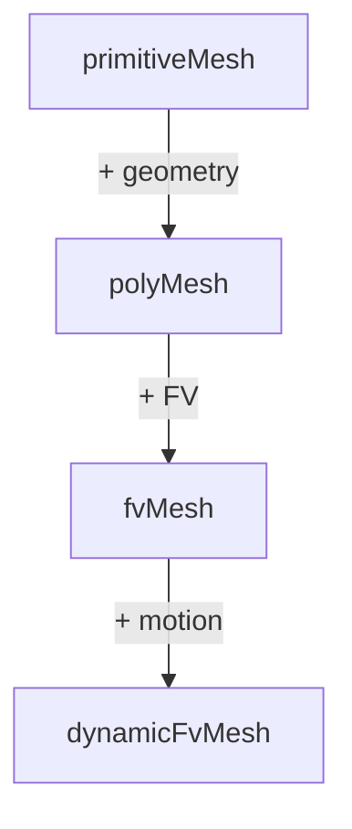

# Mesh Classes - Introduction

บทนำ Mesh Classes — พื้นฐานที่ต้องรู้

> **ทำไมต้องเรียนบทนี้?**
> - เข้าใจ **โครงสร้าง mesh** ที่ OpenFOAM ใช้
> - รู้ว่า **polyhedral mesh** ดีกว่า structured อย่างไร
> - เตรียมพร้อมสำหรับ mesh programming

---

## Overview

> **💡 OpenFOAM Mesh = Unstructured Polyhedral**
>
> - รองรับ **ทุกรูปร่าง cell** (hex, tet, prism, pyramid, arbitrary)
> - **Face-based** structure = efficient สำหรับ FVM

---

## 1. Why Polyhedral Mesh?

| Advantage | Description |
|-----------|-------------|
| **Flexibility** | Any cell shape |
| **Complex geometry** | CAD-friendly |
| **Local refinement** | Adaptive meshing |
| **Hanging nodes** | Supported |

---

## 2. Mesh Components

### Vertices (Points)

```cpp
const pointField& points = mesh.points();
// 3D coordinates of each vertex
```

### Faces

```cpp
const faceList& faces = mesh.faces();
// Each face = list of point indices
```

### Cells

```cpp
const cellList& cells = mesh.cells();
// Each cell = list of face indices
```

---

## 3. Face-Based Structure

```
Cell 0 ←─owner── Face f ──neighbour→ Cell 1
```

- **owner**: Cell ID that "owns" the face
- **neighbour**: Other cell (internal faces only)
- Boundary faces have owner only

---

## 4. Class Hierarchy



| Class | Provides |
|-------|----------|
| `primitiveMesh` | Topology/connectivity |
| `polyMesh` | Point coordinates |
| `fvMesh` | FV discretization |

---

## 5. Mesh Files

```
constant/polyMesh/
├── points      # Vertex coordinates
├── faces       # Face→points
├── owner       # Face→owner cell
├── neighbour   # Face→neighbour cell
└── boundary    # Patch definitions
```

---

## Quick Reference

| Data | Access |
|------|--------|
| Points | `mesh.points()` |
| Faces | `mesh.faces()` |
| Cells | `mesh.cells()` |
| Owners | `mesh.faceOwner()` |
| Neighbours | `mesh.faceNeighbour()` |

---

## 🧠 Concept Check

<details>
<summary><b>1. ทำไมใช้ face-based structure?</b></summary>

**Efficient FV**: face fluxes defined once, used by both owner and neighbour
</details>

<details>
<summary><b>2. boundary face มี neighbour ไหม?</b></summary>

**ไม่มี** — อยู่ขอบ mesh, มีแค่ owner cell
</details>

<details>
<summary><b>3. fvMesh มีอะไรเพิ่มจาก polyMesh?</b></summary>

**FV methods**: Sf, magSf, delta, interpolation, schemes
</details>

---

## 📖 เอกสารที่เกี่ยวข้อง

- **ภาพรวม:** [00_Overview.md](00_Overview.md)
- **Mesh Hierarchy:** [02_Mesh_Hierarchy.md](02_Mesh_Hierarchy.md)
