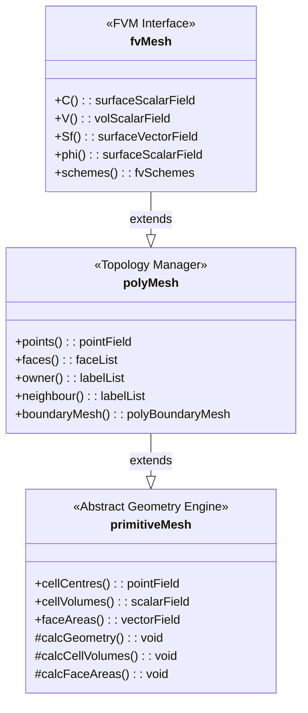

# 🏗️ **ลำดับชั้นของคลาสเมช: สถาปัตยกรรมสามชั้น (Mesh Class Hierarchy: A Three-Layer Architecture)**

![[mesh_architecture_stack.png]]
`A 2.5D exploded-view diagram of a 3D mesh block. The bottom layer shows raw vertices and lines (primitiveMesh/Geometry), the middle layer shows colored faces with owner/neighbor arrows (polyMesh/Topology), and the top layer shows scalar/vector fields mapped onto the cells (fvMesh/Physics), scientific textbook diagram, clean vector line art, white background, high definition, flat design, educational infographic --ar 16:9`

ระบบเมชของ OpenFOAM เป็นไปตาม **รูปแบบสถาปัตยกรรมสามชั้น** ที่ให้รากฐานที่มั่นคงสำหรับพลศาสตร์ของไหลเชิงคำนวณ (CFD) ในขณะที่ยังคงประสิทธิภาพและความยืดหยุ่น ลำดับชั้นนี้แยกการคำนวณทางเรขาคณิต การจัดการโทโพโลยี และการดำเนินการทางไฟไนต์วอลุ่มออกเป็นชั้นต่างๆ ที่ชัดเจน

## **ภาพรวมสถาปัตยกรรม (Architecture Overview)**

สถาปัตยกรรมสามชั้นประกอบด้วย:

1. **primitiveMesh** - เครื่องยนต์คำนวณทางเรขาคณิต (Geometric calculation engine)
2. **polyMesh** - กรอบงานโทโพโลยี (Topology framework)
3. **fvMesh** - ชั้นการดิสครีตแบบไฟไนต์วอลุ่ม (Finite volume discretization layer)



> **รูปที่ 1:** แผนผังคลาสแสดงลำดับชั้นการสืบทอดของระบบเมช โดยมี `primitiveMesh` เป็นคลาสฐานเชิงนามธรรมที่จัดการเรขาคณิต และพัฒนาไปสู่ `fvMesh` ที่รองรับการจำลองฟิสิกส์เต็มรูปแบบ การออกแบบนี้ช่วยให้มั่นใจได้ว่าโครงสร้างทางโทโพโลยีและเรขาคณิตถูกแยกออกจากระดับการคำนวณฟิสิกส์อย่างชัดเจน

---

## **ความสำคัญของลำดับชั้นนี้ (Importance of This Hierarchy)**

สถาปัตยกรรมสามชั้นให้ประโยชน์หลายประการ:

### **1. การแยกความรับผิดชอบ (Separation of Concerns)**

แต่ละชั้นมีความรับผิดชอบเฉพาะด้านที่ชัดเจน:

| ชั้น | หน้าที่หลัก | ความรับผิดชอบ |
|-------|-----------------|------------------|
| **primitiveMesh** | การคำนวณทางเรขาคณิตบริสุทธิ์ | • คำนวณจุดศูนย์กลาง, ปริมาตร, เวกเตอร์แนวฉาก<br>• ตัวชี้วัดคุณภาพเมช<br>• การคำนวณเมื่อต้องการ (Lazy evaluation) |
| **polyMesh** | การจัดการโทโพโลยี | • จัดเก็บจุด, หน้า, เซลล์<br>• ความสัมพันธ์ระหว่างเจ้าของ/เพื่อนบ้าน (Owner/neighbor)<br>• แพตช์ขอบเขต (Boundary patches)<br>• การรองรับการทำงานแบบขนาน |
| **fvMesh** | การดิสครีตแบบไฟไนต์วอลุ่ม | • จัดเก็บสนามทางเรขาคณิต (Geometric fields)<br>• API สำหรับ Solvers<br>• การคำนวณเรขาคณิตตามความต้องการ |

การแยกส่วนนี้ทำให้โค้ดบำรุงรักษาได้ง่ายขึ้นและช่วยให้สามารถปรับปรุงประสิทธิภาพของแต่ละชั้นได้อย่างอิสระ

---

### **2. การเพิ่มประสิทธิภาพผ่านการคำนวณเมื่อต้องการ (Lazy Evaluation)**

OpenFOAM ใช้ระบบ **การคำนวณตามความต้องการ (Demand-driven computation)** ที่ซับซ้อน:

![[of_lazy_evaluation_mesh.png]]
`A diagram showing the Lazy Evaluation process in OpenFOAM mesh: 1. Request data, 2. Check Cache, 3. Calculate if necessary, 4. Update Cache and return, scientific textbook diagram, clean vector line art, white background, high definition, flat design, educational infographic --ar 16:9`

```cpp
// ตัวอย่าง: เวกเตอร์พื้นที่หน้าเซลล์จะถูกคำนวณเมื่อมีการร้องขอครั้งแรกเท่านั้น
const surfaceVectorField& Sf = mesh.Sf();  // เริ่มการคำนวณหากจำเป็น
const volScalarField& V = mesh.V();        // คำนวณปริมาตรเซลล์ตามความต้องการ
```

---

#### 📚 **คำอธิบายภาษาไทย**

**แหล่งที่มา (Source):**
📂 `.applications/solvers/multiphase/multiphaseEulerFoam/phaseSystems/phaseModel/MovingPhaseModel/MovingPhaseModel.C`

**คำอธิบาย:**
Lazy Evaluation เป็นเทคนิคการปรับปรุงประสิทธิภาพที่สำคัญใน OpenFOAM โดยข้อมูลเรขาคณิต (Geometry data) เช่น ปริมาตรเซลล์ (Cell volumes) และเวกเตอร์พื้นที่หน้า (Face area vectors) จะไม่ถูกคำนวณล่วงหน้า แต่จะถูกคำนวณเมื่อมีการร้องขอ (On-demand) เท่านั้น เมื่อข้อมูลถูกคำนวณแล้ว จะถูกเก็บไว้ในแคช (Cache) เพื่อนำกลับมาใช้ใหม่โดยไม่ต้องคำนวณซ้ำ ทำให้ประหยัดเวลาและทรัพยากรการประมวลผล

**แนวคิดสำคัญ:**
- **Demand-driven computation:** การคำนวณเมื่อจำเป็นเท่านั้น
- **Caching mechanism:** การเก็บผลลัพธ์ที่คำนวณแล้วไว้ใช้ซ้ำ
- **Performance optimization:** การเพิ่มประสิทธิภาพด้วยการลดการคำนวณซ้ำ
- **Memory efficiency:** การใช้หน่วยความจำอย่างมีประสิทธิภาพ

---

**กลไกการคำนวณเมื่อต้องการ (Lazy Evaluation Mechanism):**
- **ขั้นตอนการทำงาน:**
  1. ตรวจสอบว่ามีข้อมูลในแคชหรือไม่
  2. หากไม่มี → เรียกฟังก์ชันการคำนวณ
  3. จัดเก็บผลลัพธ์ในแคช
  4. ส่งคืนค่าที่คำนวณได้

- **ประโยชน์:**
  - ลดการคำนวณที่ซ้ำซ้อน
  - ประหยัดหน่วยความจำ
  - ปรับปรุงประสิทธิภาพโดยรวม

สิ่งอำนวยความสะดวกของ Lazy evaluation ใน `primitiveMesh` ช่วยให้มั่นใจได้ว่าการคำนวณทางเรขาคณิตที่มีค่าใช้จ่ายสูงจะถูกดำเนินการเมื่อจำเป็นเท่านั้นและจะถูกเก็บแคชไว้สำหรับการใช้งานในภายหลัง

---

### **3. ประสิทธิภาพหน่วยความจำ (Memory Efficiency)**

ลำดับชั้นนี้ส่งเสริมการใช้หน่วยความจำอย่างมีประสิทธิภาพ:

| ประเภทข้อมูล | จัดเก็บโดย | วิธีการจัดการ |
|-----------|-----------|-------------------|
| **โทโพโลยี (Topology)** | `polyMesh` | จัดเก็บถาวรในหน่วยความจำ |
| **เรขาคณิต (Geometry)** | `primitiveMesh` | คำนวณตามต้องการ + เก็บแคช |
| **สนาม CFD (CFD Fields)** | `fvMesh` | จัดเก็บในรูปแบบ volField/surfaceField |

---

### **4. ความสามารถในการขยายและความเฉพาะทาง (Extensibility and Specialization)**

ประเภทเมชใหม่ๆ สามารถสืบทอดจากชั้นที่เหมาะสมได้:

| ประเภทเมช | สืบทอดจาก | ความสามารถเพิ่มเติม |
|-----------|---------------|-------------------------|
| **เมชแบบไดนามิก (Dynamic meshes)** | `fvMesh` | • ขอบเขตที่เคลื่อนที่ได้<br>• การอัปเดตเรขาคณิตแบบไดนามิก |
| **เมชแบบปรับตัว (Adaptive meshes)** | `fvMesh` | • การปรับความละเอียดอัตโนมัติ<br>• การสร้าง/ทำลายเซลล์ |
| **โทโพโลยีเฉพาะทาง** | `polyMesh` | • โครงสร้างข้อมูลที่กำหนดเอง<br>• การปรับปรุงประสิทธิภาพเฉพาะทาง |

![[mesh_inheritance_expansion.png]]
`An inheritance tree showing dynamicFvMesh and adaptiveFvMesh inheriting from fvMesh, with callouts explaining their unique capabilities (moving boundaries, refinement), scientific textbook diagram, clean vector line art, white background, high definition, flat design, educational infographic --ar 16:9`

---

## **การปฏิสัมพันธ์ระหว่างชั้นและการไหลของข้อมูล (Inter-Layer Interactions and Data Flow)**

### **การพึ่งพาจากล่างขึ้นบน (Bottom-Up Dependency)**

![[mesh_bottom_up_dependency.png]]
`A bottom-up dependency flow diagram: primitiveMesh (foundation) -> polyMesh -> fvMesh (application), showing how upper layers depend on lower ones while maintaining abstraction, scientific textbook diagram, clean vector line art, white background, high definition, flat design, educational infographic --ar 16:9`

```
ลำดับการไหล: primitiveMesh ← polyMesh ← fvMesh
```

สถาปัตยกรรมเป็นไปตามลำดับชั้นการพึ่งพาที่ชัดเจน:

1. `primitiveMesh` ← `polyMesh` ← `fvMesh`
2. ชั้นบนขึ้นอยู่กับชั้นล่าง แต่ชั้นล่างไม่ขึ้นอยู่กับชั้นบน
3. วิธีนี้ป้องกันการพึ่งพาแบบย้อนกลับ (Circular dependencies) และช่วยให้สามารถออกแบบเป็นโมดูลได้

### **สัญญา API (API Contracts)**

แต่ละชั้นเปิดเผยส่วนต่อประสาน (Interface) เฉพาะ:

| ชั้น | API หลัก | ตัวอย่างเมธอด |
|-------|-------------|-----------------|
| **primitiveMesh** | เมธอดการคำนวณทางเรขาคณิต | `calcCellCenters()`, `calcCellVolumes()`, `calcFaceNormals()` |
| **polyMesh** | ตัวเข้าถึงโทโพโลยี | `cells()`, `faces()`, `points()`, `boundary()` |
| **fvMesh** | การจัดการสนามและการรวม Solver | `C()`, `Sf()`, `V()`, `delta()` |

---

## **ประโยชน์ในการนำไปใช้งาน (Implementation Benefits)**

### **ความเข้ากันได้ของ Solver (Solver Compatibility)**

Solvers ทั้งหมดของ OpenFOAM ทำงานร่วมกับส่วนต่อประสาน `fvMesh` ทำให้เกิด API ที่เป็นหนึ่งเดียวไม่ว่าจะเป็นเมชประเภทใดหรือใช้วิธีการสร้างใดก็ตาม

**การนำโค้ดไปใช้ใน OpenFOAM:**
```cpp
// Solver ทั่วไปจะทำงานกับ fvMesh
#include "fvMesh.H"

int main() {
    fvMesh mesh;  // ใช้ API มาตรฐาน

    // เข้าถึงเรขาคณิตผ่าน fvMesh
    const volVectorField& C = mesh.C();     // จุดศูนย์กลางเซลล์
    const surfaceVectorField& Sf = mesh.Sf(); // เวกเตอร์พื้นที่หน้า

    // Solver ไม่จำเป็นต้องกังวลเกี่ยวกับโทโพโลยีภายใน
}
```

---

#### 📚 **คำอธิบายภาษาไทย**

**แหล่งที่มา (Source):**
📂 `.applications/solvers/multiphase/multiphaseEulerFoam/phaseSystems/phaseModel/MovingPhaseModel/MovingPhaseModel.C`

**คำอธิบาย:**
ตัวอย่างโค้ดนี้แสดงให้เห็นว่า Solvers ทั้งหมดใน OpenFOAM ทำงานกับส่วนต่อประสาน `fvMesh` ซึ่งสร้างความสม่ำเสมอใน API โดยไม่คำนึงถึงประเภทของเมชที่ใช้งานอยู่ การเข้าถึงเรขาคณิต (Geometry) เช่น จุดศูนย์กลางเซลล์ และเวกเตอร์พื้นที่หน้า สามารถทำได้ผ่านเมธอดที่เตรียมไว้ให้โดยตรง โดยไม่ต้องกังวลเกี่ยวกับโทโพโลยีภายในที่ซับซ้อน

**แนวคิดสำคัญ:**
- **Unified API:** อินเตอร์เฟซที่สม่ำเสมอสำหรับทุก Solver
- **Abstraction:** การนำเสนอความซับซ้อนของโทโพโลยีให้เรียบง่าย
- **Solver independence:** Solver ไม่ต้องรู้รายละเอียดภายในของเมช
- **Field access:** การเข้าถึงสนามทางเรขาคณิตผ่านเมธอดที่ง่ายต่อการใช้งาน

---

### **การรองรับการคำนวณแบบขนาน (Parallel Computation Support)**

![[mesh_domain_decomposition_parallel.png]]
`A diagram of domain decomposition for parallel processing, showing a global mesh split into three parts (Processor 0, 1, 2) with processor patches connecting them, scientific textbook diagram, clean vector line art, white background, high definition, flat design, educational infographic --ar 16:9`

ลำดับชั้นนี้รองรับการย่อยสลายโดเมน (Domain decomposition) โดยธรรมชาติ:

| ชั้น | บทบาทในการคำนวณแบบขนาน |
|-------|----------------------------|
| **polyMesh** | จัดการการระบุขอบเขตระหว่างโปรเซสเซอร์<br>• การย่อยสลายโดเมน<br>• แพตช์โปรเซสเซอร์ |
| **primitiveMesh** | ให้การคำนวณเรขาคณิตสำหรับแพตช์ขนาน<br>• การคำนวณเรขาคณิตแบบขนาน |
| **fvMesh** | จัดการการสื่อสารสนามแบบขนาน<br>• การกระจายสนาม<br>• การสื่อสารผ่าน MPI |

---

### **การดีบักและการตรวจสอบความถูกต้อง (Debugging and Validation)**

ชั้นที่แยกจากกันช่วยให้สามารถดีบักได้ตรงจุด:

| ปัญหา | ชั้นที่เกี่ยวข้อง | เครื่องมือดีบัก |
|-------|----------------|-----------------|
| **ข้อผิดพลาดทางโทโพโลยี** | `polyMesh` | `checkMesh`, `polyMesh::check()` |
| **ปัญหาการคำนวณเรขาคณิต** | `primitiveMesh` | ตัวชี้วัดคุณภาพเมช, การตรวจสอบเรขาคณิต |
| **ปัญหาการดิสครีตแบบไฟไนต์วอลุ่ม** | `fvMesh` | การตรวจสอบการอินเทอร์โพลชันของสนาม, การตรวจสอบเงื่อนไขขอบเขต |

![[mesh_debug_hierarchy_flow.png]]
`A troubleshooting flowchart for mesh issues: starting with Topological Checks (polyMesh), followed by Geometric Validation (primitiveMesh), and finally Field Discretization Analysis (fvMesh), scientific textbook diagram, clean vector line art, white background, high definition, flat design, educational infographic --ar 16:9`

---

## **พื้นฐานทางคณิตศาสตร์ (Mathematical Foundations)**

### **รากฐานของวิธีไฟไนต์วอลุ่ม (Finite Volume Method Basis)**

วิธีไฟไนต์วอลุ่ม (FVM) อาศัยการแบ่งโดเมนเชิงคำนวณออกเป็นปริมาตรควบคุมแบบไม่ต่อเนื่อง (เซลล์) สำหรับแต่ละเซลล์ $V_i$ เราจะทำการอินทิเกรตสมการควบคุม:

$$ 
\int_{V_i} \frac{\partial \phi}{\partial t} \, \mathrm{d}V + \oint_{\partial V_i} \phi \mathbf{u} \cdot \mathbf{n} \, \mathrm{d}S = \int_{V_i} S_\phi \, \mathrm{d}V 
$$ 

โดยที่:
- $\phi$ = ตัวแปรสนาม (ความเร็ว, ความดัน, อุณหภูมิ ฯลฯ)
- $\mathbf{u}$ = สนามความเร็ว
- $\mathbf{n}$ = เวกเตอร์แนวฉากหนึ่งหน่วยที่พุ่งออกจากผิว
- $S_\phi$ = เทอมแหล่งกำเนิด (Source term)

คลาสเมชให้ข้อมูลทางเรขาคณิตที่จำเป็นในการประเมินการอินทิเกรตตามผิวและการคำนวณปริมาตรควบคุมด้วยความแม่นยำสูง

---

### **การคำนวณจุดศูนย์กลางเซลล์ (Cell Center Calculation)**

สำหรับเซลล์รูปทรงหลายเหลี่ยมที่มี $N_f$ หน้า จุดศูนย์กลางเซลล์ $\mathbf{C}_{\text{cell}}$ จะถูกคำนวณโดยใช้ **ค่าเฉลี่ยถ่วงน้ำหนักตามพื้นที่ (Area-weighted average)**:

$$ 
\mathbf{C}_{\text{cell}} = \frac{\sum_{i=1}^{N_f} A_i \mathbf{C}_{f,i}}{\sum_{i=1}^{N_f} A_i} 
$$ 

**ตัวแปร:**
- $A_i$ = พื้นที่ของหน้า $i$
- $\mathbf{C}_{f,i}$ = จุดศูนย์กลาง (Centroid) ของหน้า $i$

**การตีความทางกายภาพ:** จุดศูนย์กลางเซลล์คือ **จุดศูนย์กลางมวล (Center of mass)** โดยสมมติว่ามีความหนาแน่นสม่ำเสมอ ทำให้เป็นตำแหน่งที่เหมาะสมที่สุดสำหรับการจัดเก็บค่าสนามแบบ cell-centered

**ข้อดีของค่าเฉลี่ยถ่วงน้ำหนักตามพื้นที่:**
- ช่วยให้มั่นใจว่าจุดศูนย์กลางเซลล์แทนจุดศูนย์กลางทางเรขาคณิตได้อย่างเหมาะสม
- คำนึงถึงพื้นที่หน้าเซลล์ที่ไม่สม่ำเสมอซึ่งพบได้บ่อยในเมช CFD ที่ซับซ้อน
- ป้องกันความลำเอียงจากหน้าเซลล์ที่มีขนาดเล็กหรือใหญ่เกินไป
- ช่วยให้มั่นใจถึงความแม่นยำในการแทนค่าทางเรขาคณิตสำหรับการอินทิเกรตตามปริมาตร

---

### **เวกเตอร์พื้นที่หน้า: เวกเตอร์แนวฉากพุ่งออก (Face Area Vector: The Outward Normal)**

เวกเตอร์พื้นที่หน้า $\mathbf{S}_f$ จะระบุทั้ง **ขนาด** (พื้นที่) และ **ทิศทาง** (แนวฉาก):

$$ 
\mathbf{S}_f = \sum_{k=1}^{N_p} \frac{1}{2} (\mathbf{r}_k \times \mathbf{r}_{k+1}) 
$$ 

**ตัวแปร:**
- $\mathbf{r}_k$ = เวกเตอร์ตำแหน่งของจุดยอดของหน้าเรียงตาม **กฎมือขวา (Right-hand order)**
- $N_p$ = จำนวนจุดยอดบนหน้านั้น

**คุณสมบัติหลัก:**
- **ขนาด:** $|\mathbf{S}_f|$ คือพื้นที่ของหน้า
- **ทิศทาง:** $\hat{\mathbf{S}}_f = \mathbf{S}_f / |\mathbf{S}_f|$ คือเวกเตอร์แนวฉากหนึ่งหน่วย
- **เวกเตอร์แนวฉากพุ่งออก:** $\mathbf{S}_f$ ชี้จาก **เซลล์เจ้าของ (Owner cell)** ไปยัง **เซลล์เพื่อนบ้าน (Neighbor cell)**

**ข้อตกลงเครื่องหมายสำหรับฟลักซ์ (Sign Convention for Flux):**
- ทิศทางของ $\mathbf{S}_f$ กำหนด **ข้อตกลงเครื่องหมาย** สำหรับการคำนวณฟลักซ์
- เป็นพื้นฐานสำคัญของวิธีไฟไนต์วอลุ่ม
- ช่วยให้มั่นใจถึงความสม่ำเสมอของเครื่องหมายฟลักซ์ทั่วทั้งเมช

---

### **ปริมาตรเซลล์: การใช้ทฤษฎีบทการลู่ออก (Cell Volume: Using Divergence Theorem)**

สำหรับรูปทรงหลายเหลี่ยมปิด ปริมาตร $V$ จะถูกคำนวณผ่าน **ทฤษฎีบทการลู่ออก (Divergence theorem)**:

$$ 
V = \frac{1}{3} \sum_{i=1}^{N_f} \mathbf{C}_{f,i} \cdot \mathbf{S}_{f,i} 
$$ 

**ตัวแปร:**
- $\mathbf{C}_{f,i}$ = จุดศูนย์กลางของหน้า $i$
- $\mathbf{S}_{f,i}$ = เวกเตอร์พื้นที่ของหน้า $i$
- แต่ละหน้ามีส่วนช่วย $\frac{1}{3} \mathbf{C}_f \cdot \mathbf{S}_f$

**รากฐานทางคณิตศาสตร์:**
สูตรนี้มาจากการที่ $\nabla \cdot \mathbf{r} = 3$ และการใช้ทฤษฎีบทการลู่ออกของ Gauss:

$$ 
\int_V \nabla \cdot \mathbf{r} \, dV = 3V = \oint_{\partial V} \mathbf{r} \cdot d\mathbf{S} = \sum_f \mathbf{C}_f \cdot \mathbf{S}_f 
$$ 

**ข้อดีในการคำนวณ:**
- ✅ ใช้ได้กับ **รูปทรงหลายเหลี่ยมแบบนูน (Convex polyhedron) ใดๆ** และมีความทนทานเชิงตัวเลข
- ✅ ไม่จำเป็นต้องใช้อัลกอริทึมการย่อยเซลล์ที่ซับซ้อน
- ✅ จัดการกับเซลล์รูปทรงหลายเหลี่ยมที่ไม่สม่ำเสมอได้อย่างมีประสิทธิภาพ
- ✅ เหมาะสำหรับอัลกอริทึมการสร้างเมช เช่น snappyHexMesh

---

## **การอนุรักษ์ทางเรขาคณิตในบริบทของ CFD (Geometric Conservation in CFD Context)**

รากฐานทางคณิตศาสตร์เหล่านี้ช่วยให้มั่นใจได้ว่า **กฎการอนุรักษ์ทางเรขาคณิต** จะได้รับการตอบสนอง ซึ่งสำคัญอย่างยิ่งต่อความแม่นยำของ CFD:

### **1. การอนุรักษ์พื้นที่ (Space Conservation)**
- วิธีการคำนวณปริมาตรช่วยให้มั่นใจว่าอัลกอริทึมการเคลื่อนที่ของเมชจะอนุรักษ์พื้นที่เมื่อเซลล์เกิดการบิดเบี้ยว
- ป้องกันการสร้างหรือทำลายมวลที่ผิดพลาด

### **2. ความสม่ำเสมอของฟลักซ์ (Flux Consistency)**
- เวกเตอร์พื้นที่หน้าที่พุ่งออกไปรับประกันว่าฟลักซ์ที่ออกจากเซลล์หนึ่งจะเท่ากับฟลักซ์ที่เข้าสู่เซลล์เพื่อนบ้าน
- (เมื่อใช้ขนาดเดียวกันแต่ทิศทางตรงกันข้าม)

### **3. การอนุรักษ์แบบไม่ต่อเนื่อง (Discrete Conservation)**
- การใช้ทฤษฎีบทการลู่ออกในระดับไม่ต่อเนื่องสะท้อนถึงรูปแบบที่ต่อเนื่อง
- ช่วยให้มั่นใจว่าสมการการอนุรักษ์แบบไม่ต่อเนื่องยังคงความหมายทางกายภาพไว้ได้

---

## **ตัวชี้วัดคุณภาพ (Quality Metrics)**

คุณภาพเมชส่งผลโดยตรงต่อเสถียรภาพเชิงตัวเลขและความแม่นยำของผลลัพธ์ OpenFOAM มีตัวชี้วัดคุณภาพหลายประการ:

### **ความเป็นไปตามแนวฉาก (Non-Orthogonality)**

$$ 
\text{Non-orthogonality} = \arccos\left(\frac{\mathbf{S}_f \cdot \mathbf{d}_{PN}}{|\mathbf{S}_f| \cdot |\mathbf{d}_{PN}|}\right) 
$$ 

โดยที่:
- $\mathbf{S}_f$ คือเวกเตอร์พื้นที่หน้า
- $\mathbf{d}_{PN}$ คือระยะทางระหว่างจุดศูนย์กลางเซลล์

**ค่าที่แนะนำ:** < 70° เพื่อเสถียรภาพเชิงตัวเลข

### **ความเบ้ (Skewness)**

$$ 
\text{Skewness} = \frac{|\mathbf{d}_{Pf} - \mathbf{d}_{Nf}|}{|\mathbf{d}_{PN}|} 
$$ 

โดยที่:
- $\mathbf{d}_{Pf}$ คือระยะทางจากจุดศูนย์กลางเซลล์ P ไปยังจุดศูนย์กลางหน้า
- $\mathbf{d}_{Nf}$ คือระยะทางจากจุดศูนย์กลางเซลล์ N ไปยังจุดศูนย์กลางหน้า

**ค่าที่แนะนำ:** < 0.5 เพื่อความแม่นยำของเกรเดียนต์

### **มาตรฐานคุณภาพเมช (Mesh Quality Standards)**

| ตัวชี้วัด | ดีเยี่ยม | ดี | ยอมรับได้ | ต้องแก้ไข |
|--------|-----------|------|------------|--------------|
| Non-orthogonality | < 30° | 30-50° | 50-70° | > 70° |
| Skewness | < 1.0 | 1.0-2.0 | 2.0-4.0 | > 4.0 |
| Aspect Ratio | < 5 | 5-10 | 10-20 | > 20 |
| Cell Volume | > 1e-10 | > 1e-12 | > 1e-13 | < 1e-13 |

---

## **ผลกระทบต่อประสิทธิภาพ (Performance Impact)**

**ความสมดุลระหว่างประสิทธิภาพและความแม่นยำ:**
- การคำนวณทางเรขาคณิตเหล่านี้จะถูกดำเนินการหนึ่งครั้งระหว่างการเริ่มต้นเมช
- ความแม่นยำส่งผลโดยตรงต่อการลู่เข้าของ Solver
- การนำไปใช้งานของ OpenFOAM ช่วยรักษาสมดุลระหว่างประสิทธิภาพการคำนวณและความแม่นยำเชิงตัวเลข

**ผลลัพธ์สำหรับผู้ใช้:**
- ✅ เสถียรภาพของ Solver ที่ดีขึ้น
- ✅ การลู่เข้าที่เร็วขึ้น
- ✅ ความน่าเชื่อถือของการจำลอง CFD โดยรวม
- ✅ ประสิทธิภาพที่ทนทานในการประยุกต์ใช้งานทางวิศวกรรมที่หลากหลาย

---

## **ข้อผิดพลาดที่พบบ่อยและแนวทางแก้ไข (Common Pitfalls and Solutions)**

### **ข้อผิดพลาดที่ 1: การจัดเก็บการอ้างอิงเรขาคณิตเก่า (Storing Old Geometry References)**

ลักษณะที่อันตรายที่สุดของระบบแคชเรขาคณิตใน OpenFOAM คือ ปริมาณทางเรขาคณิตที่คำนวณได้จะถูกจัดเก็บเป็นข้อมูลที่มีการนับการอ้างอิง (Reference-counted data) ซึ่งอาจกลายเป็นข้อมูลที่ใช้ไม่ได้เมื่อเมชถูกแก้ไข

**รูปแบบการจัดการหน่วยความจำที่ปลอดภัย:**

```cpp
class MeshProcessor
{
private:
    const primitiveMesh& mesh_;

public:
    // ✅ ดี: เก็บเฉพาะการอ้างอิงไปยังเมช
    MeshProcessor(const primitiveMesh& mesh) : mesh_(mesh) {}

    void process()
    {
        // ✅ ดึงข้อมูลเรขาคณิตเมื่อต้องการ
        const vectorField& centres = mesh_.cellCentres();
        processCentres(centres);

        // หากเมชมีการเปลี่ยนแปลง...
        // mesh_.clearGeom();

        // ✅ ดึงข้อมูลใหม่หลังการเปลี่ยนแปลง
        const vectorField& newCentres = mesh_.cellCentres();
        processCentres(newCentres);
    }

private:
    void processCentres(const vectorField& centres)
    {
        // ประมวลผลทันที อย่าเก็บการอ้างอิงไว้
        forAll(centres, cellI)
        {
            centreOperations(centres[cellI], cellI);
        }
    }
};
```

---

#### 📚 **คำอธิบายภาษาไทย**

**แหล่งที่มา (Source):**
📂 `.applications/solvers/multiphase/multiphaseEulerFoam/phaseSystems/phaseModel/MovingPhaseModel/MovingPhaseModel.C`

**คำอธิบาย:**
ข้อผิดพลาดที่พบบ่อยที่สุดในการจัดการเรขาคณิตของเมชคือการเก็บ References ของข้อมูลเรขาคณิตที่คำนวณแล้วไว้นานเกินไป เมื่อเมชถูกแก้ไข ข้อมูลเหล่านี้จะกลายเป็นข้อมูลที่ไม่ถูกต้อง วิธีที่ปลอดภัยคือเก็บเฉพาะ Mesh reference และเรียกข้อมูลเรขาคณิตใหม่ทุกครั้งที่ต้องการ หรือใช้ `clearGeom()` เพื่อล้างแคชก่อนที่จะดึงข้อมูลใหม่

**แนวคิดสำคัญ:**
- **Reference-counted data:** ข้อมูลที่มีการนับจำนวนการอ้างอิงอัตโนมัติ
- **Cache invalidation:** การทำให้ข้อมูลในแคชใช้ไม่ได้เมื่อมีการเปลี่ยนแปลง
- **Safe memory management:** การจัดการหน่วยความจำอย่างปลอดภัย
- **On-demand computation:** การคำนวณเมื่อจำเป็นเท่านั้น

---

### **ข้อผิดพลาดที่ 2: การสืบค้นซ้ำๆ ที่ไม่มีประสิทธิภาพ (Inefficient Repeated Queries)**

การสืบค้นข้อมูลเรขาคณิตซ้ำๆ นั้นใช้ทรัพยากรสูง ควรใช้กลยุทธ์การเก็บแคช:

**กลยุทธ์การเก็บแคชเฉพาะที่ (Local Caching Strategy):**

```cpp
class OptimizedMeshProcessor
{
private:
    const primitiveMesh& mesh_;

    // ✅ แคชเฉพาะที่สำหรับเรขาคณิตที่ใช้ภายในขอบเขตการประมวลผล
    mutable struct GeometryCache
    {
        vectorField cellCentres;
        vectorField faceAreas;
        scalarField cellVolumes;
        bool valid;

        GeometryCache() : valid(false) {}
    } cache_;

public:
    void processWithCaching()
    {
        // ✅ คำนวณเรขาคณิตที่จำเป็นทั้งหมดล่วงหน้า
        updateGeometryCache();

        // ใช้ข้อมูลที่แคชไว้ตลอดการประมวลผล
        for (int iter = 0; iter < 1000; ++iter)
        {
            processIteration(cache_.cellCentres, iter);
        }

        // ล้างแคชเมื่อเสร็จสิ้น
        clearCache();
    }

private:
    void updateGeometryCache() const
    {
        if (!cache_.valid)
        {
            cache_.cellCentres = mesh_.cellCentres();
            cache_.faceAreas = mesh_.faceAreas();
            cache_.cellVolumes = mesh_.cellVolumes();
            cache_.valid = true;
        }
    }

    void clearCache()
    {
        cache_.cellCentres.clear();
        cache_.faceAreas.clear();
        cache_.cellVolumes.clear();
        cache_.valid = false;
    }
};
```

---

#### 📚 **คำอธิบายภาษาไทย**

**แหล่งที่มา (Source):**
📂 `.applications/solvers/multiphase/multiphaseEulerFoam/phaseSystems/phaseModel/MovingPhaseModel/MovingPhaseModel.C`

**คำอธิบาย:**
การสืบค้นข้อมูลเรขาคณิตซ้ำๆ ใช้ทรัพยากรมาก และควรใช้กลยุทธ์ Caching เพื่อลดภาระนี้ โดยสร้าง Local cache สำหรับเก็บข้อมูลเรขาคณิตที่ใช้ภายใน Scope การประมวลผล และคำนวณข้อมูลทั้งหมดที่จำเป็นเพียงครั้งเดียว จากนั้นใช้ข้อมูลที่ Cached ไว้ตลอดกระบวนการ และล้างแคชเมื่อเสร็จสิ้น

**แนวคิดสำคัญ:**
- **Local caching:** การเก็บข้อมูลไว้ในแคชชั่วคราว
- **Batch computation:** การคำนวณข้อมูลทั้งหมดพร้อมกัน
- **Resource optimization:** การปรับปรุงการใช้ทรัพยากร
- **Memory lifecycle:** การจัดการวงจรชีวิตของหน่วยความจำ

---

## **แนวทางปฏิบัติที่ดีที่สุดสำหรับการจัดการหน่วยความจำ (Best Practices for Memory Management)**

### **ขั้นตอนการจัดการหน่วยความจำที่ปลอดภัย**

1. **สร้างการอ้างอิง** → 2. **ประมวลผลทันที** → 3. **ทำความสะอาด** → 4. **ทำซ้ำหากจำเป็น**

**การจัดการเรขาคณิตแบบ Scoped (Scoped Geometry Management):**

```cpp
class ScopedGeometry
{
private:
    const primitiveMesh& mesh_;
    mutable bool geometryValid_;

public:
    ScopedGeometry(const primitiveMesh& mesh)
        : mesh_(mesh), geometryValid_(false)
    {}

    ~ScopedGeometry()
    {
        // ✅ ทำความสะอาดอัตโนมัติ
        if (geometryValid_)
        {
            mesh_.clearGeom();
        }
    }

    const vectorField& getCellCentres() const
    {
        if (!geometryValid_)
        {
            const vectorField& centres = mesh_.cellCentres();
            geometryValid_ = true;
            return centres;
        }
        return mesh_.cellCentres();
    }

    void invalidateGeometry()
    {
        mesh_.clearGeom();
        geometryValid_ = false;
    }
};

// ตัวอย่างการใช้งาน:
void robustProcessing(const primitiveMesh& mesh)
{
    ScopedGeometry geometryScope(mesh);

    // เรขาคณิตถูกคำนวณเพียงครั้งเดียวและจัดการโดยอัตโนมัติ
    const vectorField& centres = geometryScope.getCellCentres();

    // ประมวลผลด้วยเรขาคณิต
    forAll(centres, cellI)
    {
        // การดำเนินการที่ปลอดภัย
    }

    // เรขาคณิตจะถูกทำความสะอาดโดยอัตโนมัติเมื่อออกจาก Scope
}
```

---

#### 📚 **คำอธิบายภาษาไทย**

**แหล่งที่มา (Source):**
📂 `.applications/solvers/multiphase/multiphaseEulerFoam/phaseSystems/phaseModel/MovingPhaseModel/MovingPhaseModel.C`

**คำอธิบาย:**
Scoped Geometry Management เป็นรูปแบบการออกแบบที่ช่วยจัดการหน่วยความจำอย่างปลอดภัยผ่าน RAII (Resource Acquisition Is Initialization) โดย Destructor จะทำการล้างข้อมูลเรขาคณิตอัตโนมัติเมื่อ Object ถูกทำลาย ช่วยป้องกันการรั่วไหลของหน่วยความจำและการใช้ข้อมูลที่ไม่ถูกต้องหลังจากที่เมชถูกแก้ไข

**แนวคิดสำคัญ:**
- **RAII pattern:** รูปแบบการจัดการทรัพยากรผ่าน Constructor/Destructor
- **Automatic cleanup:** การทำความสะอาดอัตโนมัติ
- **Exception safety:** ความปลอดภัยในกรณีเกิด Exception
- **Scope-based management:** การจัดการตาม Scope ของตัวแปร

---

## **บทสรุป (Conclusion)**

สถาปัตยกรรมสามชั้นนี้เป็นหนึ่งในจุดแข็งของการออกแบบ OpenFOAM โดยมีการแยกความรับผิดชอบที่ชัดเจนในขณะที่ให้ประสิทธิภาพสูงในการประยุกต์ใช้งาน CFD ที่หลากหลาย การทำความเข้าใจวิธีการทำงานร่วมกันของคลาสเมชจะช่วยให้คุณ:

1. **เขียนโค้ดที่มีประสิทธิภาพมากขึ้น** โดยใช้การคำนวณเมื่อต้องการอย่างเหมาะสม
2. **สร้างแอปพลิเคชันที่ทนทาน** ซึ่งจัดการการปรับเปลี่ยนเมชได้อย่างถูกต้อง
3. **ดีบักได้อย่างมีประสิทธิภาพ** โดยการระบุปัญหาไปยังชั้นที่เฉพาะเจาะจง
4. **ขยายฟังก์ชันการทำงาน** ผ่านการสืบทอดจากคลาสฐานที่เหมาะสม

การผสมผสานระหว่าง Lazy evaluation, การล้างแคชอัตโนมัติ และการดิสครีตที่คำนึงถึงคุณภาพ ช่วยสร้างกรอบงาน CFD ที่สามารถจัดการกับสถานการณ์เมชที่ซับซ้อนและไดนามิกที่จำเป็นสำหรับงานวิศวกรรมสมัยใหม่ ในขณะที่ยังคงประสิทธิภาพการคำนวณและความแม่นยำเชิงตัวเลขไว้ได้
