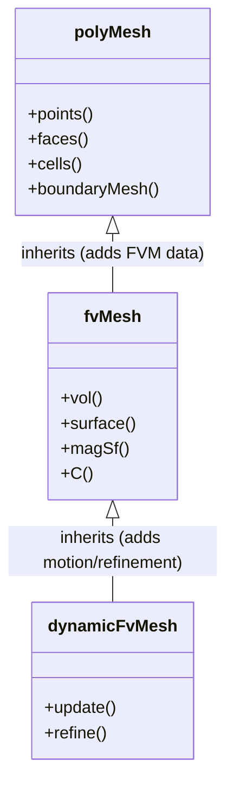

# Mesh Hierarchy

ลำดับชั้นคลาส Mesh ใน OpenFOAM — เข้าใจ Inheritance

> **ทำไมบทนี้สำคัญ?**
> - เข้าใจ **ทำไมมี 3 classes** (primitiveMesh → polyMesh → fvMesh)
> - รู้ว่า **method ไหนอยู่ class ไหน**
> - ใช้ API ได้ถูกต้อง

---

## Overview

> **💡 Mesh Hierarchy = Separation of Concerns**
>
> - `primitiveMesh`: **Topology** — "connected to what?"
> - `polyMesh`: + **Geometry** — "where are things?"
> - `fvMesh`: + **FVM** — "how to discretize?"



---

## 1. Class Hierarchy

| Class | Purpose |
|-------|---------|
| `primitiveMesh` | Topology only |
| `polyMesh` | + Geometry (points, faces) |
| `fvMesh` | + FV discretization |
| `dynamicFvMesh` | + Mesh motion |

---

## 2. primitiveMesh

### Core Data

| Method | Returns |
|--------|---------|
| `nCells()` | Number of cells |
| `nFaces()` | Number of faces |
| `nPoints()` | Number of points |
| `nInternalFaces()` | Internal face count |

### Connectivity

```cpp
// Face → Cells
label owner = mesh.faceOwner()[faceI];
label neighbour = mesh.faceNeighbour()[faceI];

// Cell → Faces
const labelList& cFaces = mesh.cells()[cellI];
```

---

## 3. polyMesh

### Geometry

```cpp
// Points (vertices)
const pointField& pts = mesh.points();

// Faces (list of point labels)
const faceList& faces = mesh.faces();

// Cell centers
const vectorField& C = mesh.cellCentres();

// Cell volumes
const scalarField& V = mesh.cellVolumes();
```

### Face Geometry

```cpp
// Face area vectors
const vectorField& Sf = mesh.faceAreas();

// Face centers
const vectorField& Cf = mesh.faceCentres();
```

---

## 4. fvMesh

### FV-Specific

```cpp
// Surface field of face area vectors
const surfaceVectorField& Sf = mesh.Sf();

// Surface field of face area magnitudes
const surfaceScalarField& magSf = mesh.magSf();

// Surface field of face centers
const surfaceVectorField& Cf = mesh.Cf();

// Volume field
const volScalarField& V = mesh.V();
```

### Boundary

```cpp
// Patches
const fvBoundaryMesh& boundary = mesh.boundary();

// Iterate patches
forAll(boundary, patchI)
{
    const fvPatch& patch = boundary[patchI];
    label nFaces = patch.size();
}
```

---

## 5. Key Relationships

```
Cell 0 ←─owner── Face f ──neighbour→ Cell 1
   ↓                                    ↓
points[faces[f][0]], points[faces[f][1]], ...
```

### Internal vs Boundary Faces

| Type | Range |
|------|-------|
| Internal | `0` to `nInternalFaces()-1` |
| Boundary | `nInternalFaces()` to `nFaces()-1` |

---

## 6. Mesh Reading

```cpp
// Standard mesh creation
#include "createMesh.H"

// Or explicit
fvMesh mesh
(
    IOobject
    (
        fvMesh::defaultRegion,
        runTime.timeName(),
        runTime,
        IOobject::MUST_READ
    )
);
```

### Mesh Files

```
constant/polyMesh/
├── points      # Coordinates
├── faces       # Face definitions
├── owner       # Face owners
├── neighbour   # Face neighbours
└── boundary    # Patch definitions
```

---

## Quick Reference

| Need | Use |
|------|-----|
| Cell count | `mesh.nCells()` |
| Face areas | `mesh.Sf()` |
| Cell volumes | `mesh.V()` |
| Cell centers | `mesh.C()` |
| Patches | `mesh.boundary()` |

---

## 🧠 Concept Check

<details>
<summary><b>1. primitiveMesh vs polyMesh ต่างกันอย่างไร?</b></summary>

- **primitiveMesh**: Topology only (connectivity)
- **polyMesh**: + Geometry (points, positions)
</details>

<details>
<summary><b>2. owner กับ neighbour คืออะไร?</b></summary>

- **owner**: Cell ที่ "เป็นเจ้าของ" face
- **neighbour**: Cell อีกด้านของ face (internal faces only)
</details>

<details>
<summary><b>3. boundary faces อยู่ตรงไหน?</b></summary>

Face indices `nInternalFaces()` ถึง `nFaces()-1`
</details>

---

## 📖 เอกสารที่เกี่ยวข้อง

- **ภาพรวม:** [00_Overview.md](00_Overview.md)
- **primitiveMesh:** [03_primitiveMesh.md](03_primitiveMesh.md)
