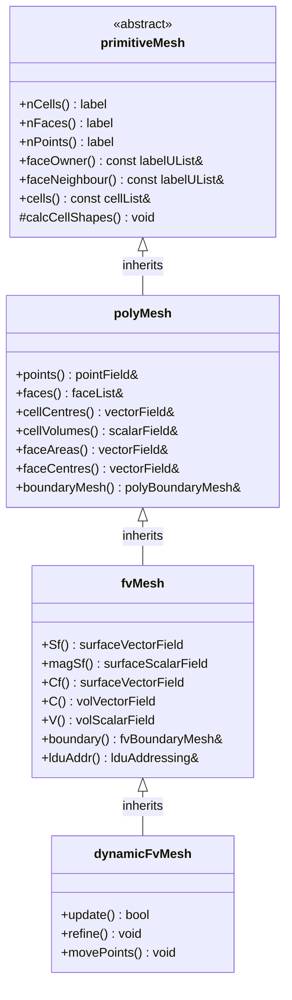

# Mesh Hierarchy

Understanding OpenFOAM's Mesh Class Inheritance Architecture

---

## 🎯 Learning Objectives

After reading this document, you should be able to:

- **Explain** the rationale behind OpenFOAM's three-level mesh hierarchy
- **Identify** which methods belong to which mesh class
- **Select** the appropriate mesh class level for your programming task
- **Navigate** the inheritance relationship between primitiveMesh, polyMesh, and fvMesh
- **Apply** the correct API calls for mesh topology, geometry, and finite volume operations

---

## Prerequisites

- Understanding of C++ inheritance and polymorphism
- Familiarity with finite volume method basics
- Knowledge of mesh topology (cells, faces, points)

---

## Overview

### What: The Three-Level Mesh Hierarchy

OpenFOAM implements a **layered mesh architecture** with three inheritance levels, each adding specific capabilities:



### Why: Separation of Concerns

| Level | Concern | Question Answered |
|-------|---------|-------------------|
| `primitiveMesh` | **Topology** | "Connected to what?" |
| `polyMesh` | **Geometry** | "Where are things?" |
| `fvMesh` | **Discretization** | "How to compute FVM operations?" |
| `dynamicFvMesh` | **Dynamics** | "How does mesh evolve?" |

This design enables:
- **Code reuse**: Topology algorithms work on any mesh type
- **Efficiency**: Only compute what you need (e.g., no FV data for pure mesh manipulation)
- **Extensibility**: New mesh types inherit all functionality

### How: Choosing Your Mesh Class

| Task | Use Class | Example |
|------|-----------|---------|
| Pure connectivity queries | `primitiveMesh` | Finding adjacent cells |
| Mesh generation/manipulation | `polyMesh` | Moving mesh points |
| Standard solver development | `fvMesh` | Computing fluxes |
| Dynamic mesh simulations | `dynamicFvMesh` | Moving valves, AMR |

---

## 1. primitiveMesh — Topology Foundation

### Purpose
Provides **topological information only** — how mesh entities connect without geometric data.

### What It Contains

| Method | Returns | Description |
|--------|---------|-------------|
| `nCells()` | `label` | Total cell count |
| `nFaces()` | `label` | Total face count |
| `nPoints()` | `label` | Total point count |
| `nInternalFaces()` | `label` | Internal faces only |
| `faceOwner()` | `const labelUList&` | Owner cell for each face |
| `faceNeighbour()` | `const labelUList&` | Neighbour cells (internal) |
| `cells()` | `const cellList&` | Cell → face connectivity |

### Key Relationships

```
Face Ownership:
─────────────────────────────────────────────────────────
Cell 0 ←─owner── Face f ──neighbour→ Cell 1
                    ↓
         points[f[0]], points[f[1]], points[f[2]], ...

Face Indexing:
─────────────────────────────────────────────────────────
[0 ─────────── nInternalFaces()-1][nInternalFaces() ───── nFaces()-1]
     Internal Faces                 Boundary Faces
```

### Code Example: Topology Queries

```cpp
// Get faces belonging to a cell
const labelList& cellFaces = mesh.cells()[cellI];
Info << "Cell " << cellI << " has " << cellFaces.size() << " faces" << endl;

// Find owner and neighbour for internal face
label faceI = 100;
if (faceI < mesh.nInternalFaces())
{
    label ownerCell = mesh.faceOwner()[faceI];
    label neighbourCell = mesh.faceNeighbour()[faceI];
    Info << "Face " << faceI << " between cells " 
         << ownerCell << " and " << neighbourCell << endl;
}
```

---

## 2. polyMesh — Geometry Layer

### Purpose
Extends `primitiveMesh` with **geometric data** — actual coordinates and geometric calculations.

### What It Adds

| Method | Returns | Description |
|--------|---------|-------------|
| `points()` | `pointField&` | Vertex coordinates |
| `faces()` | `faceList&` | Face point labels |
| `cellCentres()` | `vectorField` | Cell center positions |
| `cellVolumes()` | `scalarField` | Cell volumes |
| `faceAreas()` | `vectorField` | Face area vectors (normal × magnitude) |
| `faceCentres()` | `vectorField` | Face center positions |
| `boundaryMesh()` | `polyBoundaryMesh&` | Boundary patches |

### Code Example: Geometric Operations

```cpp
// Access mesh points
const pointField& pts = mesh.points();

// Move a single point (deforms mesh)
pts[pointI] = vector(pts[pointI].x() + 0.001, pts[pointI].y(), pts[pointI].z());

// Get cell center and volume
scalar V = mesh.cellVolumes()[cellI];
vector C = mesh.cellCentres()[cellI];

// Face area magnitude
vector Sf = mesh.faceAreas()[faceI];
scalar magSf = mag(Sf);
vector n = Sf / magSf;  // Unit normal

Info << "Cell volume: " << V << ", center: " << C << endl;
Info << "Face area: " << magSf << ", normal: " << n << endl;
```

---

## 3. fvMesh — Finite Volume Discretization

### Purpose
Extends `polyMesh` with **finite volume method data** — surface and volume fields with proper boundary addressing.

### What It Adds

| Method | Returns | Description |
|--------|---------|-------------|
| `Sf()` | `surfaceVectorField` | Face area vectors (field) |
| `magSf()` | `surfaceScalarField` | Face area magnitudes (field) |
| `Cf()` | `surfaceVectorField` | Face centers (field) |
| `C()` | `volVectorField` | Cell centers (field) |
| `V()` | `volScalarField` | Cell volumes (field) |
| `V0()` | `volScalarField` | Previous time cell volumes |
| `boundary()` | `fvBoundaryMesh&` | FV boundary patches |
| `lduAddr()` | `lduAddressing&` | Matrix addressing |

### Key Difference: Fields vs Raw Arrays

```cpp
// polyMesh: Raw geometric arrays
const vectorField& faceCenters_poly = mesh.faceCentres();  // Simple array

// fvMesh: Fields with boundary information
const surfaceVectorField& Cf = mesh.Cf();  // Field with internal + boundary faces

// Access internal face
vector cInternal = Cf.internalField()[faceI];

// Access boundary patch
vector cPatch = Cf.boundaryField()[patchI][faceI];
```

### Code Example: FV Operations

```cpp
// Compute face flux from cell-centered velocity
surfaceScalarField phi
(
    IOobject("phi", runTime.timeName(), mesh),
    mesh,
    dimensionedScalar("phi", dimVolume/dimTime, 0)
);

const volVectorField& U = ...;  // Velocity field
const surfaceVectorField& Sf = mesh.Sf();

phi = fvc::flux(U);  // Standard way

// Manual way (for understanding)
forAll(phi, faceI)
{
    if (faceI < mesh.nInternalFaces())
    {
        // Interpolate velocity to face
        label own = mesh.owner()[faceI];
        label nei = mesh.neighbour()[faceI];
        vector Uf = 0.5 * (U[own] + U[nei]);
        phi[faceI] = Uf & mesh.Sf()[faceI];
    }
}
```

### Boundary Access

```cpp
const fvBoundaryMesh& boundaries = mesh.boundary();

forAll(boundaries, patchI)
{
    const fvPatch& patch = boundaries[patchI];
    
    Info << "Patch: " << patch.name() 
         << ", type: " << patch.type()
         << ", faces: " << patch.size()
         << ", start: " << patch.start() << endl;
    
    // Access face values on patch
    const surfaceVectorField& Cf = mesh.Cf();
    const fvsPatchVectorField& CfPatch = Cf.boundaryField()[patchI];
    
    forAll(CfPatch, i)
    {
        vector faceCenter = CfPatch[i];
        // ... process face
    }
}
```

---

## 4. dynamicFvMesh — Mesh Motion and Adaptation

### Purpose
Extends `fvMesh` with **mesh update capabilities** for moving meshes and adaptive refinement.

### What It Adds

| Method | Returns | Description |
|--------|---------|-------------|
| `update()` | `bool` | Update mesh for new time step |
| `refine()` | `void` | Perform adaptive refinement |
| `movePoints(pointField&)` | `void` | Update geometry after point motion |
| `timeIndex()` | `label` | Current time index |

### Code Example: Dynamic Mesh

```cpp
// In solver
autoPtr<dynamicFvMesh> meshPtr(dynamicFvMesh::New(runTime));
dynamicFvMesh& mesh = meshPtr();

while (runTime.loop())
{
    // Update mesh topology (refinement, motion)
    bool meshChanged = mesh.update();
    
    if (meshChanged)
    {
        // Mesh changed — update fields
        U.correctBoundaryConditions();
        p.correctBoundaryConditions();
    }
    
    // Solve with new mesh
    solve(fvm::ddt(U) + fvm::div(phi, U) - fvm::laplacian(nu, U));
}
```

---

## 5. Method Comparison by Hierarchy Level

### Available Methods at Each Level

| Operation | primitiveMesh | polyMesh | fvMesh | dynamicFvMesh |
|-----------|---------------|----------|--------|---------------|
| **Entity Counts** |
| `nCells()` | ✓ | ✓ | ✓ | ✓ |
| `nFaces()` | ✓ | ✓ | ✓ | ✓ |
| `nPoints()` | ✓ | ✓ | ✓ | ✓ |
| **Topology Queries** |
| `faceOwner()` | ✓ | ✓ | ✓ | ✓ |
| `faceNeighbour()` | ✓ | ✓ | ✓ | ✓ |
| `cells()` | ✓ | ✓ | ✓ | ✓ |
| **Geometric Data** |
| `points()` | — | ✓ | ✓ | ✓ |
| `faces()` | — | ✓ | ✓ | ✓ |
| `cellCentres()` | — | ✓ | ✓ | ✓ |
| `faceAreas()` | — | ✓ | ✓ | ✓ |
| **FV Fields** |
| `Sf()` (field) | — | — | ✓ | ✓ |
| `magSf()` (field) | — | — | ✓ | ✓ |
| `C()` (field) | — | — | ✓ | ✓ |
| `V()` (field) | — | — | ✓ | ✓ |
| `boundary()` | — | — | ✓ | ✓ |
| **Dynamic Operations** |
| `update()` | — | — | — | ✓ |
| `refine()` | — | — | — | ✓ |

### Performance Considerations

| Task | Most Efficient Class | Reason |
|------|---------------------|--------|
| Count cells/faces | `primitiveMesh` | No geometric computation needed |
| Access point coordinates | `polyMesh` | Direct access without field overhead |
| Compute fluxes | `fvMesh` | Proper boundary handling |
| Moving mesh | `dynamicFvMesh` | Handles topology changes |

---

## 6. Mesh Reading and Construction

### Standard Solver Approach

```cpp
// createMesh.H (standard)
#include "createMesh.H"

// Equivalent explicit construction
fvMesh mesh
(
    IOobject
    (
        fvMesh::defaultRegion,
        runTime.timeName(),
        runTime,
        IOobject::MUST_READ
    )
);
```

### Dynamic Mesh Construction

```cpp
autoPtr<dynamicFvMesh> meshPtr
(
    dynamicFvMesh::New
    (
        runTime,
        IOobject
        (
            fvMesh::defaultRegion,
            runTime.timeName(),
            runTime,
            IOobject::MUST_READ
        )
    )
);
dynamicFvMesh& mesh = meshPtr();
```

### File Structure

```
constant/polyMesh/
├── points          # Point coordinates (x y z)
├── faces           # Face point labels
├── owner           # Owner cell for each face
├── neighbour       # Neighbour cell (internal faces only)
├── boundary        # Boundary patch definitions
└── cellZones       # (optional) Cell zones

0/, 1/, ...         # Time directories with field data
```

---

## 7. Cross-Module Connections

| Related Module | Connection |
|----------------|------------|
| **[Fields](../01_FOUNDATION_PRIMITIVES/02_Basic_Primitives.md)** | fvMesh uses GeometricFields for data storage |
| **[Boundary Conditions](../../MODULE_01_CFD_FUNDAMENTALS/CONTENT/03_BOUNDARY_CONDITIONS/)** | fvBoundaryMesh manages BC patches |
| **[Solver Development](../)** | Most solvers work with fvMesh |
| **[Discretization Schemes](../../MODULE_03_SINGLE_PHASE_FLOW/CONTENT/02_PRESSURE_VELOCITY_COUPLING/)** | FVM schemes require fvMesh addressing |

---

## 📚 Quick Reference

### Common Operations

```cpp
// Entity counts
label nCells = mesh.nCells();
label nInternalFaces = mesh.nInternalFaces();

// Geometry
const pointField& points = mesh.points();
const vectorField& cellCenters = mesh.cellCentres();
const scalarField& cellVolumes = mesh.cellVolumes();

// FV fields
const surfaceVectorField& Sf = mesh.Sf();      // Face area vectors
const surfaceScalarField& magSf = mesh.magSf(); // Face magnitudes
const volVectorField& C = mesh.C();             // Cell centers
const volScalarField& V = mesh.V();             // Cell volumes

// Boundary
const fvBoundaryMesh& boundary = mesh.boundary();
const fvPatch& patch = boundary[patchI];
```

---

## 🧠 Concept Check

<details>
<summary><b>1. Why does OpenFOAM have three mesh classes instead of one?</b></summary>

**Separation of concerns** enables:
- **Efficiency**: Use minimal data needed for task
- **Reusability**: Topology algorithms work on any mesh type
- **Extensibility**: Add functionality through inheritance
- Example: Mesh generation needs only `polyMesh` (no FV overhead)

**Key insight**: Each layer adds specific capability without forcing unnecessary computation.
</details>

<details>
<summary><b>2. What's the difference between `mesh.faceCentres()` and `mesh.Cf()`?</b></summary>

| Method | Class | Return Type | Boundary Info |
|--------|-------|-------------|---------------|
| `faceCentres()` | `polyMesh` | `vectorField` | Internal faces only |
| `Cf()` | `fvMesh` | `surfaceVectorField` | Internal + boundary faces |

**Use `faceCentres()`** for pure geometric operations  
**Use `Cf()`** for FVM computations with boundary conditions
</details>

<details>
<summary><b>3. When should I use primitiveMesh vs polyMesh vs fvMesh?</b></summary>

- **Use `primitiveMesh`** for: Topology queries, connectivity algorithms
- **Use `polyMesh`** for: Mesh generation, deformation, geometric calculations
- **Use `fvMesh`** for: Solver development, FVM operations
- **Use `dynamicFvMesh`** for: Moving meshes, adaptive refinement

**Default choice**: `fvMesh` for most solver programming tasks.
</details>

<details>
<summary><b>4. Explain the face indexing system for internal vs boundary faces.</b></summary>

```
Indices: [0 ──────────── nInternalFaces()-1][nInternalFaces() ────── nFaces()-1]
           ↑                                       ↑
    Internal faces (owner+neighbour)    Boundary faces (owner only)

Internal face example:
    label own = mesh.owner()[50];      // Valid
    label nei = mesh.neighbour()[50];  // Valid (both sides)

Boundary face example:
    label bFaceI = mesh.nInternalFaces() + 10;
    label own = mesh.owner()[bFaceI];  // Valid
    label nei = mesh.neighbour()[bFaceI];  // ⚠️ Out of bounds access!
```

**Key rule**: Always check `faceI < mesh.nInternalFaces()` before accessing `faceNeighbour()`.
</details>

---

## 🎯 Key Takeaways

- **Hierarchy design**: OpenFOAM's three-level mesh hierarchy (primitiveMesh → polyMesh → fvMesh) implements separation of concerns, adding topology, geometry, and FVM capabilities incrementally
- **Method placement**: Know which methods belong to which class — use the lowest level that provides needed functionality for best performance
- **Field distinction**: `polyMesh` provides raw geometric arrays, while `fvMesh` provides GeometricFields with proper boundary handling
- **Face indexing**: Internal faces (`0` to `nInternalFaces()-1`) have both owner and neighbour; boundary faces (`nInternalFaces()` to `nFaces()-1`) have owner only
- **Practical usage**: Most solver development uses `fvMesh` — use `dynamicFvMesh` for moving or adaptive meshes
- **Cross-module integration**: Mesh classes connect to Fields, Boundary Conditions, and discretization schemes throughout OpenFOAM

---

## 📖 Navigation

**Module: [04_MESH_CLASSES](00_Overview.md)**
- **Previous:** [01_Introduction.md](01_Introduction.md)
- **Next:** [03_Face_Cell_Point_Relationships.md](03_Face_Cell_Point_Relationships.md)

**Related Topics:**
- [Fields and GeometricFields](../01_FOUNDATION_PRIMITIVES/02_Basic_Primitives.md)
- [Boundary Conditions](../../MODULE_01_CFD_FUNDAMENTALS/CONTENT/03_BOUNDARY_CONDITIONS/00_Overview.md)
- [Mesh File Format](../../MODULE_02_MESHING_AND_CASE_SETUP/CONTENT/01_MESHING_FUNDAMENTALS/02_OpenFOAM_Mesh_Structure.md)