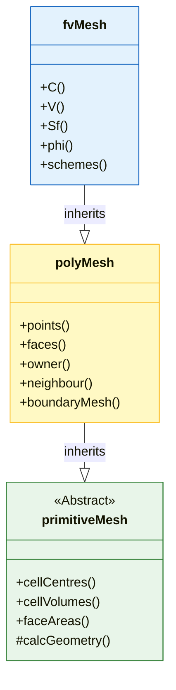

# 🏗️ **Mesh Class Hierarchy: A Three-Layer Architecture**

![[mesh_architecture_stack.png]]
`A 2.5D exploded-view diagram of a 3D mesh block. The bottom layer shows raw vertices and lines (primitiveMesh/Geometry), the middle layer shows colored faces with owner/neighbor arrows (polyMesh/Topology), and the top layer shows scalar/vector fields mapped onto the cells (fvMesh/Physics), scientific textbook diagram, clean vector line art, white background, high definition, flat design, educational infographic --ar 16:9`

OpenFOAM's mesh system follows a **three-layer architectural pattern** that provides a robust foundation for computational fluid dynamics while maintaining efficiency and flexibility. This hierarchy separates geometric calculations, topology management, and finite volume operations into distinct layers.

## **Architecture Overview**

The three-layer architecture consists of:

1. **primitiveMesh** - Geometric calculation engine
2. **polyMesh** - Topology framework
3. **fvMesh** - Finite volume discretization layer



---

## **Importance of This Hierarchy**

The three-layer architecture provides several benefits:

### **1. Separation of Concerns**

Each layer has clear, specific responsibilities:

| Layer | Primary Function | Responsibilities |
|-------|-----------------|------------------|
| **primitiveMesh** | Pure geometric calculation | • Calculate centers, volumes, normals<br>• Mesh quality metrics<br>• Lazy evaluation |
| **polyMesh** | Topology management | • Store points, faces, cells<br>• owner/neighbor relationships<br>• Boundary patches<br>• Parallel support |
| **fvMesh** | Finite volume discretization | • Store geometric fields<br>• API for solvers<br>• On-demand geometry calculation |

This separation makes the code more maintainable and allows independent optimization of each layer.

---

### **2. Performance Optimization Through Lazy Evaluation**

OpenFOAM employs a sophisticated **demand-driven computation** system:

![[of_lazy_evaluation_mesh.png]]
`A diagram showing the Lazy Evaluation process in OpenFOAM mesh: 1. Request data, 2. Check Cache, 3. Calculate if necessary, 4. Update Cache and return, scientific textbook diagram, clean vector line art, white background, high definition, flat design, educational infographic --ar 16:9`

```cpp
// Example: cell face area vectors are computed only when first requested
const surfaceVectorField& Sf = mesh.Sf();  // Triggers calculation if needed
const volScalarField& V = mesh.V();        // Cell volumes computed on demand
```

**Lazy Evaluation Mechanism:**
- **Workflow:**
  1. Check if data exists in cache
  2. If not → call calculation function
  3. Store result in cache
  4. Return computed value

- **Benefits:**
  - Reduces redundant calculations
  - Saves memory
  - Improves overall efficiency

The lazy evaluation facilities in `primitiveMesh` ensure that expensive geometric calculations are performed only when necessary and are cached for subsequent use.

---

### **3. Memory Efficiency**

The hierarchy promotes efficient memory usage:

| Data Type | Stored By | Management Method |
|-----------|-----------|-------------------|
| **Topology** | `polyMesh` | Permanently stored in memory |
| **Geometry** | `primitiveMesh` | Computed on demand + cached |
| **CFD Fields** | `fvMesh` | Stored as volField/surfaceField |

---

### **4. Extensibility and Specialization**

New mesh types can inherit from appropriate layers:

| Mesh Type | Inherits From | Additional Capabilities |
|-----------|---------------|-------------------------|
| **Dynamic meshes** | `fvMesh` | • Moving boundaries<br>• Dynamic geometry updates |
| **Adaptive meshes** | `fvMesh` | • Automatic resolution refinement<br>• Cell creation/destruction |
| **Specialized topologies** | `polyMesh` | • Custom data structures<br>• Specialized optimizations |

![[mesh_inheritance_expansion.png]]
`An inheritance tree showing dynamicFvMesh and adaptiveFvMesh inheriting from fvMesh, with callouts explaining their unique capabilities (moving boundaries, refinement), scientific textbook diagram, clean vector line art, white background, high definition, flat design, educational infographic --ar 16:9`

---

## **Inter-Layer Interactions and Data Flow**

### **Bottom-Up Dependency**

![[mesh_bottom_up_dependency.png]]
`A bottom-up dependency flow diagram: primitiveMesh (foundation) -> polyMesh -> fvMesh (application), showing how upper layers depend on lower ones while maintaining abstraction, scientific textbook diagram, clean vector line art, white background, high definition, flat design, educational infographic --ar 16:9`

```
Flow: primitiveMesh ← polyMesh ← fvMesh
```

The architecture follows a clear dependency hierarchy:

1. `primitiveMesh` ← `polyMesh` ← `fvMesh`
2. Upper layers depend on lower layers, but lower layers don't depend on upper layers
3. This prevents circular dependencies and enables modular design

### **API Contracts**

Each layer exposes a specific interface:

| Layer | Primary API | Example Methods |
|-------|-------------|-----------------|
| **primitiveMesh** | Geometric calculation methods | `calcCellCenters()`, `calcCellVolumes()`, `calcFaceNormals()` |
| **polyMesh** | Topology accessors | `cells()`, `faces()`, `points()`, `boundary()` |
| **fvMesh** | Field management and solver integration | `C()`, `Sf()`, `V()`, `delta()` |

---

## **Implementation Benefits**

### **Solver Compatibility**

All OpenFOAM solvers work with the `fvMesh` interface, creating a unified API regardless of underlying mesh type or generation method.

**OpenFOAM Code Implementation:**
```cpp
// Typical solver works with fvMesh
#include "fvMesh.H"

int main() {
    fvMesh mesh;  // Use standard API

    // Access geometry through fvMesh
    const volVectorField& C = mesh.C();     // Cell centers
    const surfaceVectorField& Sf = mesh.Sf(); // Face area vectors

    // Solver doesn't need to worry about internal topology
}
```

---

### **Parallel Computation Support**

![[mesh_domain_decomposition_parallel.png]]
`A diagram of domain decomposition for parallel processing, showing a global mesh split into three parts (Processor 0, 1, 2) with processor patches connecting them, scientific textbook diagram, clean vector line art, white background, high definition, flat design, educational infographic --ar 16:9`

The hierarchy naturally supports domain decomposition:

| Layer | Role in Parallel Computation |
|-------|----------------------------|
| **polyMesh** | Manages processor boundary identification<br>• Domain decomposition<br>• Processor patches |
| **primitiveMesh** | Provides geometry calculations for parallel patches<br>• Parallel geometry calculations |
| **fvMesh** | Manages parallel field communication<br>• Field distribution<br>• MPI communication |

---

### **Debugging and Validation**

The separate layers enable targeted debugging:

| Issue | Relevant Layer | Debugging Tools |
|-------|----------------|-----------------|
| **Topology errors** | `polyMesh` | `checkMesh`, `polyMesh::check()` |
| **Geometry calculation problems** | `primitiveMesh` | Mesh quality metrics, Geometry validation |
| **Finite volume discretization issues** | `fvMesh` | Field interpolation checks, Boundary condition validation |

![[mesh_debug_hierarchy_flow.png]]
`A troubleshooting flowchart for mesh issues: starting with Topological Checks (polyMesh), followed by Geometric Validation (primitiveMesh), and finally Field Discretization Analysis (fvMesh), scientific textbook diagram, clean vector line art, white background, high definition, flat design, educational infographic --ar 16:9`

---

## **Mathematical Foundations**

### **Finite Volume Method Basis**

The finite volume method (FVM) relies on partitioning the computational domain into discrete control volumes (cells). For each cell $V_i$, we integrate the governing equation:

$$
\int_{V_i} \frac{\partial \phi}{\partial t} \, \mathrm{d}V + \oint_{\partial V_i} \phi \mathbf{u} \cdot \mathbf{n} \, \mathrm{d}S = \int_{V_i} S_\phi \, \mathrm{d}V
$$

Where:
- $\phi$ = field variable (velocity, pressure, temperature, etc.)
- $\mathbf{u}$ = velocity field
- $\mathbf{n}$ = outward unit normal vector at the surface
- $S_\phi$ = source term

The mesh classes provide the geometric information necessary to evaluate surface integrals and control volume calculations with high accuracy.

---

### **Cell Center Calculation**

For a polyhedral cell with $N_f$ faces, the cell center $\mathbf{C}_{\text{cell}}$ is calculated using an **area-weighted average**:

$$
\mathbf{C}_{\text{cell}} = \frac{\sum_{i=1}^{N_f} A_i \mathbf{C}_{f,i}}{\sum_{i=1}^{N_f} A_i}
$$

**Variables:**
- $A_i$ = area of face $i$
- $\mathbf{C}_{f,i}$ = centroid of face $i$

**Physical Interpretation:** The cell center is the **center of mass** assuming uniform density, making it the optimal location for storing cell-centered field values.

**Advantages of Area-Weighted Average:**
- Ensures cell center properly represents the geometric center
- Accounts for non-uniform face areas common in complex CFD meshes
- Prevents bias from small or large faces
- Ensures accurate geometric representation for volume integrals

---

### **Face Area Vector: The Outward Normal**

The face area vector $\mathbf{S}_f$ encodes both **magnitude** (area) and **direction** (normal):

$$
\mathbf{S}_f = \sum_{k=1}^{N_p} \frac{1}{2} (\mathbf{r}_k \times \mathbf{r}_{k+1})
$$

**Variables:**
- $\mathbf{r}_k$ = position vectors of face vertices in **right-hand order**
- $N_p$ = number of vertices on the face

**Key Properties:**
- **Magnitude:** $|\mathbf{S}_f|$ gives the face area
- **Direction:** $\hat{\mathbf{S}}_f = \mathbf{S}_f / |\mathbf{S}_f|$ gives the unit normal
- **Outward Normal:** $\mathbf{S}_f$ points from **owner cell** to **neighbor cell**

**Sign Convention for Flux:**
- The direction of $\mathbf{S}_f$ determines the **sign convention** for flux calculations
- Fundamental to the finite volume method
- Ensures consistent flux sign conventions throughout the mesh

---

### **Cell Volume: Using Divergence Theorem**

For a closed polyhedron, the volume $V$ is calculated via the **divergence theorem**:

$$
V = \frac{1}{3} \sum_{i=1}^{N_f} \mathbf{C}_{f,i} \cdot \mathbf{S}_{f,i}
$$

**Variables:**
- $\mathbf{C}_{f,i}$ = face centroid of face $i$
- $\mathbf{S}_{f,i}$ = face area vector of face $i$
- Each face contributes $\frac{1}{3} \mathbf{C}_f \cdot \mathbf{S}_f$

**Mathematical Foundation:**
This formula derives from $\nabla \cdot \mathbf{r} = 3$ and applying Gauss's divergence theorem:

$$
\int_V \nabla \cdot \mathbf{r} \, dV = 3V = \oint_{\partial V} \mathbf{r} \cdot d\mathbf{S} = \sum_f \mathbf{C}_f \cdot \mathbf{S}_f
$$

**Computational Advantages:**
- ✅ Valid for **any convex polyhedron** and numerically robust
- ✅ Eliminates need for complex cell subdivision algorithms
- ✅ Handles non-uniform polyhedral cells efficiently
- ✅ Well-suited for mesh generation algorithms like snappyHexMesh

---

## **Geometric Conservation in CFD Context**

These mathematical foundations ensure that **geometric conservation laws** are satisfied, which is critical for CFD accuracy:

### **1. Space Conservation**
- The volume calculation method ensures mesh motion algorithms conserve space as cells deform
- Prevents creation or destruction of spurious mass

### **2. Flux Consistency**
- Outward face area vectors guarantee that flux leaving one cell equals flux entering its neighbor
- (when using same magnitude but opposite direction)

### **3. Discrete Conservation**
- Using the divergence theorem at the discrete level reflects the continuous pattern
- Ensures discrete conservation equations retain physical meaning

---

## **Quality Metrics**

Mesh quality directly affects numerical stability and result accuracy. OpenFOAM provides several quality metrics:

### **Non-Orthogonality**

$$
\text{Non-orthogonality} = \arccos\left(\frac{\mathbf{S}_f \cdot \mathbf{d}_{PN}}{|\mathbf{S}_f| \cdot |\mathbf{d}_{PN}|}\right)
$$

Where:
- $\mathbf{S}_f$ is the face area vector
- $\mathbf{d}_{PN}$ is the distance between cell centers

**Recommended:** < 70° for numerical stability

### **Skewness**

$$
\text{Skewness} = \frac{|\mathbf{d}_{Pf} - \mathbf{d}_{Nf}|}{|\mathbf{d}_{PN}|}
$$

Where:
- $\mathbf{d}_{Pf}$ is the distance from cell center P to face center
- $\mathbf{d}_{Nf}$ is the distance from cell center N to face center

**Recommended:** < 0.5 for accurate gradients

### **Mesh Quality Standards**

| Metric | Excellent | Good | Acceptable | Needs Fixing |
|--------|-----------|------|------------|--------------|
| Non-orthogonality | < 30° | 30-50° | 50-70° | > 70° |
| Skewness | < 1.0 | 1.0-2.0 | 2.0-4.0 | > 4.0 |
| Aspect Ratio | < 5 | 5-10 | 10-20 | > 20 |
| Cell Volume | > 1e-10 | > 1e-12 | > 1e-13 | < 1e-13 |

---

## **Performance Impact**

**Balance Between Efficiency and Accuracy:**
- These geometric calculations are performed once during mesh initialization
- Accuracy directly impacts solver convergence
- OpenFOAM's implementation balances computational efficiency with numerical accuracy

**Results for Users:**
- ✅ Better solver stability
- ✅ Faster convergence
- ✅ Overall CFD simulation reliability
- ✅ Robust performance across a wide range of engineering applications

---

## **Common Pitfalls and Solutions**

### **Pitfall 1: Storing Old Geometry References**

The most dangerous aspect of OpenFOAM's geometry cache system is that computed geometric quantities are stored as reference-counted data, which can become invalid when the mesh is modified.

**Safe Memory Management Pattern:**

```cpp
class MeshProcessor
{
private:
    const primitiveMesh& mesh_;

public:
    // ✅ GOOD: Store only mesh reference
    MeshProcessor(const primitiveMesh& mesh) : mesh_(mesh) {}

    void process()
    {
        // ✅ Fetch geometry when needed
        const vectorField& centres = mesh_.cellCentres();
        processCentres(centres);

        // If mesh changes...
        // mesh_.clearGeom();

        // ✅ Fetch fresh data after changes
        const vectorField& newCentres = mesh_.cellCentres();
        processCentres(newCentres);
    }

private:
    void processCentres(const vectorField& centres)
    {
        // Process immediately, don't store reference
        forAll(centres, cellI)
        {
            centreOperations(centres[cellI], cellI);
        }
    }
};
```

---

### **Pitfall 2: Inefficient Repeated Queries**

Repeated geometry queries are resource-intensive. Use caching strategies:

**Local Caching Strategy:**

```cpp
class OptimizedMeshProcessor
{
private:
    const primitiveMesh& mesh_;

    // ✅ Local cache for geometry used within processing scope
    mutable struct GeometryCache
    {
        vectorField cellCentres;
        vectorField faceAreas;
        scalarField cellVolumes;
        bool valid;

        GeometryCache() : valid(false) {}
    } cache_;

public:
    void processWithCaching()
    {
        // ✅ Compute all necessary geometry upfront
        updateGeometryCache();

        // Use cached data throughout processing
        for (int iter = 0; iter < 1000; ++iter)
        {
            processIteration(cache_.cellCentres, iter);
        }

        // Clear cache when done
        clearCache();
    }

private:
    void updateGeometryCache() const
    {
        if (!cache_.valid)
        {
            cache_.cellCentres = mesh_.cellCentres();
            cache_.faceAreas = mesh_.faceAreas();
            cache_.cellVolumes = mesh_.cellVolumes();
            cache_.valid = true;
        }
    }

    void clearCache()
    {
        cache_.cellCentres.clear();
        cache_.faceAreas.clear();
        cache_.cellVolumes.clear();
        cache_.valid = false;
    }
};
```

---

## **Best Practices for Memory Management**

### **Safe Memory Handling Steps**

1. **Create Reference** → 2. **Process Immediately** → 3. **Clean Up** → 4. **Repeat if Necessary**

**Scoped Geometry Management:**

```cpp
class ScopedGeometry
{
private:
    const primitiveMesh& mesh_;
    mutable bool geometryValid_;

public:
    ScopedGeometry(const primitiveMesh& mesh)
        : mesh_(mesh), geometryValid_(false)
    {}

    ~ScopedGeometry()
    {
        // ✅ Automatic cleanup
        if (geometryValid_)
        {
            mesh_.clearGeom();
        }
    }

    const vectorField& getCellCentres() const
    {
        if (!geometryValid_)
        {
            const vectorField& centres = mesh_.cellCentres();
            geometryValid_ = true;
            return centres;
        }
        return mesh_.cellCentres();
    }

    void invalidateGeometry()
    {
        mesh_.clearGeom();
        geometryValid_ = false;
    }
};

// Usage example:
void robustProcessing(const primitiveMesh& mesh)
{
    ScopedGeometry geometryScope(mesh);

    // Geometry computed once and managed automatically
    const vectorField& centres = geometryScope.getCellCentres();

    // Process with geometry
    forAll(centres, cellI)
    {
        // Safe operations
    }

    // Geometry automatically cleaned when leaving scope
}
```

---

## **Conclusion**

This three-layer architecture is one of OpenFOAM's key design strengths, providing clear separation of concerns while enabling high performance across a wide range of CFD applications. By understanding how the mesh classes work together, you can:

1. **Write more efficient code** by leveraging lazy evaluation appropriately
2. **Build robust applications** that handle mesh modifications correctly
3. **Debug effectively** by isolating issues to specific layers
4. **Extend functionality** through inheritance from appropriate base classes

The combination of lazy evaluation, automatic cache invalidation, and quality-aware discretization creates a CFD framework capable of handling the dynamic and complex mesh scenarios required for modern engineering applications while maintaining computational efficiency and numerical accuracy.
