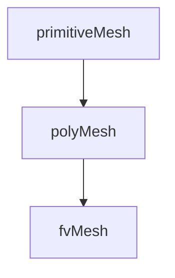

# primitiveMesh

primitiveMesh Class Reference — Topology เท่านั้น

> **ทำไมต้องรู้ primitiveMesh?**
> - เป็น **base class** ที่ polyMesh และ fvMesh สืบทอด
> - **Connectivity queries** (cell→face, face→cell) อยู่ที่นี่
> - เข้าใจ topology = debug mesh problems ได้

---

## Overview

> **💡 primitiveMesh = "Who connects to whom?"**
>
> ไม่รู้ว่าอยู่ที่ไหน (no coordinates) แต่รู้ว่า:
> - Cell มีกี่ faces
> - Face เชื่อม cells ไหน
> - Point อยู่ใน cells ไหน



---

## 1. Core Data

### Counts

| Method | Returns |
|--------|---------|
| `nCells()` | Number of cells |
| `nFaces()` | Total faces |
| `nInternalFaces()` | Internal faces |
| `nPoints()` | Number of vertices |
| `nEdges()` | Number of edges |

### Usage

```cpp
label nC = mesh.nCells();
label nF = mesh.nFaces();
label nIF = mesh.nInternalFaces();
label nBF = nF - nIF;  // Boundary faces
```

---

## 2. Connectivity

### Face → Cells

```cpp
// Owner cell (always exists)
const labelList& owner = mesh.faceOwner();
label ownerCell = owner[faceI];

// Neighbour cell (internal faces only)
const labelList& neighbour = mesh.faceNeighbour();
if (faceI < mesh.nInternalFaces())
{
    label neighbourCell = neighbour[faceI];
}
```

### Cell → Faces

```cpp
const cellList& cells = mesh.cells();
const cell& c = cells[cellI];

forAll(c, i)
{
    label faceI = c[i];
}
```

### Cell → Cells (Neighbours)

```cpp
const labelListList& cc = mesh.cellCells();
const labelList& neighbours = cc[cellI];
```

---

## 3. Face Structure

```cpp
// Face = list of point indices
const faceList& faces = mesh.faces();
const face& f = faces[faceI];

// Number of vertices
label nVerts = f.size();

// Point indices
forAll(f, i)
{
    label pointI = f[i];
}
```

---

## 4. Edge Connectivity

```cpp
// All edges
const edgeList& edges = mesh.edges();

// Cell → edges
const labelListList& ce = mesh.cellEdges();

// Face → edges
const labelListList& fe = mesh.faceEdges();
```

---

## 5. Point Connectivity

```cpp
// Point → cells
const labelListList& pc = mesh.pointCells();

// Point → faces
const labelListList& pf = mesh.pointFaces();

// Point → points (neighbors)
const labelListList& pp = mesh.pointPoints();
```

---

## 6. Boundary Structure

```cpp
// Boundary faces: from nInternalFaces() to nFaces()-1
for (label faceI = mesh.nInternalFaces(); faceI < mesh.nFaces(); faceI++)
{
    // This is a boundary face
    label ownerCell = mesh.faceOwner()[faceI];
}
```

---

## 7. Checking Functions

```cpp
// Validate mesh
mesh.checkMesh(true);  // With report

// Specific checks
mesh.checkFaceOrthogonality();
mesh.checkFaceSkewness();
mesh.checkCellVolumes();
```

---

## Quick Reference

| Connectivity | Method |
|--------------|--------|
| Face→Owner | `faceOwner()[f]` |
| Face→Neighbour | `faceNeighbour()[f]` |
| Cell→Faces | `cells()[c]` |
| Cell→Neighbours | `cellCells()[c]` |
| Point→Cells | `pointCells()[p]` |

---

## 🧠 Concept Check

<details>
<summary><b>1. owner vs neighbour ต่างกันอย่างไร?</b></summary>

- **owner**: Cell ที่ "เป็นเจ้าของ" face (มีทุก face)
- **neighbour**: Cell อีกด้านของ face (มีเฉพาะ internal faces)
</details>

<details>
<summary><b>2. ทำไมต้องแยก internal และ boundary faces?</b></summary>

- **Internal**: มี 2 cells (owner + neighbour)
- **Boundary**: มีแค่ 1 cell (owner) + BC
</details>

<details>
<summary><b>3. primitiveMesh มี geometry ไหม?</b></summary>

**ไม่มี** — เป็นแค่ topology (connectivity), geometry อยู่ใน polyMesh
</details>

---

## 📖 เอกสารที่เกี่ยวข้อง

- **ภาพรวม:** [00_Overview.md](00_Overview.md)
- **Mesh Hierarchy:** [02_Mesh_Hierarchy.md](02_Mesh_Hierarchy.md)
