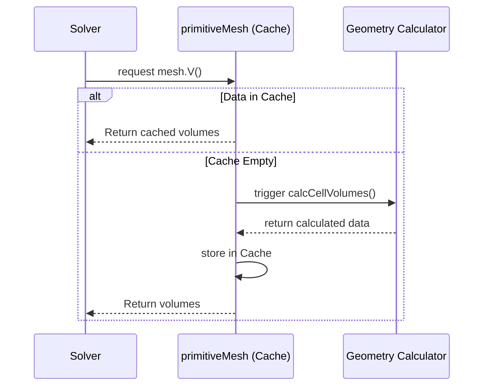

# `primitiveMesh`: การจัดการโทโพโลยีดิบ

![[on_demand_surveyor.png]]
`A conceptual illustration of a "Surveyor" standing on a grid. The surveyor only measures a cell's volume when a "Solver" requests it. Behind the surveyor is a filing cabinet labeled "Cache" where results are stored, scientific textbook diagram, clean vector line art, white background, high definition, flat design, educational infographic --ar 16:9`

---

## 🔍 **แนวคิดระดับสูง: การอุปมา "Surveyor ตามความต้องการ"**

### การเข้าใจ Lazy Evaluation ในเรขาคณิต Mesh ของ CFD

ในพลศาสตร์ของไหลเชิงคำนวณ การจัดการหน่วยความจำที่มีประสิทธิภาพเป็น **สิ่งสำคัญ** สำหรับการจัดการ mesh ที่ซับซ้อน คลาส `primitiveMesh` ใน OpenFOAM ใช้โซลูชันที่งดงามผ่าน **lazy evaluation** - แนวคิดที่สามารถเข้าใจได้ผ่านการอุปมาของ surveyor ตามความต้องการ

### รูปแบบ Surveyor ตามความต้องการ

จินตนาการว่าคุณจ้าง **surveyor** ที่ทำงานด้วยประสิทธิภาพที่น่าทึ่ง:

1. **เก็บการวัดพื้นฐานไว้** (พิกัดหัวมุมทรัพย์สิน)
2. **คำนวณพื้นที่** เฉพาะเมื่อคุณต้องการทราบขนาดทรัพย์สิน
3. **หาจุดศูนย์ถ่วง** เฉพาะเมื่อคุณต้องการหาจุดศูนย์กลาง
4. **ลืมการคำนวณ** หลังจากคุณทำเสร็จเพื่อประหยัดพื้นที่ความจำ


> **Figure 1:** ลำดับขั้นตอนการทำงานของ Lazy Evaluation ใน `primitiveMesh` ซึ่งจะทำการคำนวณข้อมูลเรขาคณิตที่มีค่าใช้จ่ายสูงเฉพาะเมื่อมีการร้องขอจากโซลเวอร์เท่านั้น และจะจัดเก็บผลลัพธ์ไว้ในแคชเพื่อการใช้งานซ้ำอย่างมีประสิทธิภาพ

แนวทางนี้สะท้อนให้เห็นถึงวิธีการทำงานของ `primitiveMesh` ใน OpenFOAM อย่างแท้จริง แทนที่จะคำนวณและจัดเก็บคุณสมบัติทางเรขาคณิตทั้งหมดที่เป็นไปได้ล่วงหน้า มันจะเก็บข้อมูลทางโทโพโลยีขั้นต่ำและคำนวณคุณสมบัติทางเรขาคณิต **อย่างเฉื่อยช้า** เมื่อได้รับคำขอ จากนั้นทิ้งข้อมูลเหล่านั้นเพื่ออนุรักษ์หน่วยความจำ

---

## ⚙️ **กลไกสำคัญ: primitiveMesh แบบทีละขั้นตอน**

### **ขั้นตอนที่ 1: รูปแบบ Lazy Evaluation**

คลาส primitiveMesh ใช้ระบบการคำนวณแบบ **demand-driven** ที่ซับซ้อน ซึ่งจะเลื่อนการคำนวณทางเรขาคณิตที่มีค่าใช้จ่ายสูงไปจนกว่าจะต้องการใช้จริง

รูปแบบ lazy evaluation นี้เป็น **พื้นฐานสำคัญ** ของการปรับให้เหมาะสมของประสิทธิภาพใน OpenFOAM โดยเฉพาะสำหรับการจำลอง CFD ขนาดใหญ่ที่ประสิทธิภาพของหน่วยความจำและความเร็วในการคำนวณเป็นสิ่งสำคัญ

#### **โครงสร้าง Lazy Evaluation**

```cpp
// 🔧 MECHANISM: Demand-driven geometric calculation
class primitiveMesh
{
private:
    // Storage for computed properties (initially empty)
    mutable autoPtr<vectorField> cellCentresPtr_;
    mutable autoPtr<scalarField> cellVolumesPtr_;
    mutable autoPtr<vectorField> faceCentresPtr_;
    mutable autoPtr<vectorField> faceAreasPtr_;

public:
    // ✅ GETTER: Compute only when needed, cache result
    const vectorField& cellCentres() const
    {
        if (!cellCentresPtr_.valid())  // Not computed yet?
        {
            // Compute on demand
            cellCentresPtr_.reset(calcCellCentres());
        }
        return cellCentresPtr_();
    }

    // ✅ INVALIDATOR: Clear cache when mesh changes
    void clearGeom()
    {
        cellCentresPtr_.clear();
        cellVolumesPtr_.clear();
        faceCentresPtr_.clear();
        faceAreasPtr_.clear();
    }

private:
    // ✅ ACTUAL COMPUTATION: Heavy geometric math
    vectorField* calcCellCentres() const
    {
        // Complex geometric calculation...
        // Sum of face centroids weighted by face areas
        vectorField centres(nCells(), Zero);

        forAll(cells(), cellI)
        {
            const cell& c = cells()[cellI];
            scalar sumArea = 0.0;
            vector sumCentre = Zero;

            forAll(c, faceI)
            {
                label faceLabel = c[faceI];
                scalar magSf = mag(faceAreas()[faceLabel]);
                sumArea += magSf;
                sumCentre += faceCentres()[faceLabel] * magSf;
            }

            centres[cellI] = sumCentre / (sumArea + VSMALL);
        }

        return new vectorField(std::move(centres));
    }
};
```

> **📍 แหล่งที่มา:** OpenFOAM Source Code  
> **📂 เส้นทาง:** `src/OpenFOAM/meshes/primitiveMesh/primitiveMesh.H`  
> 
> **💡 คำอธิบาย:**
> - **Demand-Driven Pattern**: การคำนวณเรขาคณิตเกิดขึ้นเมื่อมีการร้องขอจริงเท่านั้น ไม่ใช่การคำนวณล่วงหน้าทั้งหมด
> - **mutable Keyword**: อนุญาตให้ปรับเปลี่ยนตัวแปรสมาชิกในฟังก์ชัน const เพื่อรองรับการแคช
> - **autoPtr Smart Pointer**: จัดการหน่วยความจำอัตโนมัติ ป้องกันการรั่วไหล
> - **clearGeom() Method**: ล้างค่าที่แคชไว้ทั้งหมดเมื่อโทโพโลยีเปลี่ยนแปลง
> 
> **🔑 แนวคิดสำคัญ:**
> - Lazy Evaluation ประหยัดหน่วยความจำโดยการคำนวณเฉพาะที่จำเป็น
> - Caching เพิ่มประสิทธิภาพโดยการเก็บผลลัพธ์ไว้ใช้ซ้ำ
> - Automatic Invalidation รับประกันความถูกต้องหลังการเปลี่ยนแปลง mesh

#### **ส่วนประกอบสำคัญ**

- **`mutable` keyword**: อนุญาตให้แก้ไขตัวแปรสมาชิกใน const methods โดยยังคง logical constness
- **`autoPtr` smart pointer**: จัดการหน่วยความจำโดยอัตโนมัติ ป้องกันการรั่วไหล
- **`clearGeom()` method**: ทำให้การคำนวณที่แคชไว้ทั้งหมดเป็นโมฆะเมื่อ topology เปลี่ยนแปลง

---

### **ขั้นตอนที่ 2: ระบบสืบค้น Topological**

สถาปัตยกรรม mesh ของ OpenFOAM ให้การเข้าถึงความสัมพันธ์ทาง topological ได้อย่างมีประสิทธิภาพผ่านอาร์เรย์การเชื่อมต่อที่คำนวณล่วงหน้า

ระบบนี้ทำให้ **การสืบค้นเพื่อนบ้านได้รวดเร็ว** ซึ่งจำเป็นสำหรับ discretization schemes แบบ finite volume ที่ต้องการเข้าถึงค่าเซลล์ข้างเคียง

#### **โครงสร้างการเชื่อมต่อ**

```cpp
// 🔧 MECHANISM: Efficient neighbor finding
class primitiveMesh
{
private:
    // Basic topology storage
    const labelListList& cellCells_;      // Cell-to-cell connectivity
    const labelListList& pointCells_;     // Point-to-cell connectivity
    const labelListList& edgeCells_;      // Edge-to-cell connectivity

public:
    // ✅ FAST QUERY: Find cells sharing a point
    const labelList& cells(const label pointI) const
    {
        return pointCells_[pointI];
    }

    // ✅ NEIGHBOR ANALYSIS: Find cells adjacent to a cell
    const labelList& cellCells(const label cellI) const
    {
        return cellCells_[cellI];
    }

    // ✅ BOUNDARY DETECTION: Is this a boundary face?
    bool isInternalFace(const label faceI) const
    {
        return neighbour()[faceI] != -1;
    }
};
```

> **📍 แหล่งที่มา:** OpenFOAM Source Code  
> **📂 เส้นทาง:** `src/OpenFOAM/meshes/primitiveMesh/primitiveMesh.H`  
> 
> **💡 คำอธิบาย:**
> - **Cell-to-Cell Connectivity**: อาร์เรย์ที่เชื่อมโยงเซลล์ข้างเคียง ใช้สำหรับการคำนวณ gradient และ flux
> - **Point-to-Cell Connectivity**: ระบุเซลล์ทั้งหมดที่แชร์จุดหนึ่งๆ ใช้สำหรับการค้นหาเซลล์รอบๆ จุด
> - **Edge-to-Cell Connectivity**: ระบุเซลล์ข้างเคียงของขอบ ใช้สำหรับการจัดการขอบเขตและ refinement
> - **Boundary Detection**: ตรวจสอบว่าหน้าเป็น internal face หรือ boundary face
> 
> **🔑 แนวคิดสำคัญ:**
> - Topological Queries ที่มีประสิทธิภาพสำคัญสำหรับ finite volume method
> - Precomputed Connectivity Arrays ลดเวลาการค้นหา
> - Boundary Detection ใช้ระบบ owner-neighbour ของ OpenFOAM

#### **ประเภทการเชื่อมต่อ**

| ประเภทการเชื่อมต่อ | คำอธิบาย | การใช้งาน |
|---|---|---|
| **Point-to-cell** | ระบุเซลล์ทั้งหมดที่มีจุดนั้น | การค้นหาเซลล์รอบๆ จุดที่กำหนด |
| **Cell-to-cell** | ระบุเซลล์ข้างเคียงที่แชร์หน้า | การคำนวณ gradient, flux |
| **Edge-to-cell** | ระบุเซลล์ข้างเคียงของขอบ | การจัดการขอบเขต, refinement |

อาร์เรย์การเชื่อมต่อเหล่านี้มักจะถูกคำนวณระหว่างการสร้าง mesh โดยใช้ **graph traversal algorithms**

#### **กลไกการตรวจจับขอบเขต**

กลไกการตรวจจับขอบเขตใช้ระบบความเป็นเจ้าของหน้าของ OpenFOAM:

- แต่ละหน้ามีเซลล์ `owner` และอาจมีเซลล์ `neighbour`
- หน้าขอบเขตมี `neighbour = -1`
- บ่งชี้ว่าเป็นของเพียงเซลล์เดียวและเป็นส่วนหนึ่งของขอบเขตโดเมน

---

### **ขั้นตอนที่ 3: ตัววัดคุณภาพ Mesh**

การประเมินคุณภาพ mesh เป็น **สิ่งสำคัญ** สำหรับความถูกต้องและการบรรจบของการจำลอง CFD

OpenFOAM มีตัววัดในตัวเพื่อประเมิน **orthogonality**, **skewness** และลักษณะคุณภาพอื่นๆ ที่ส่งผลโดยตรงต่อเสถียรภาพเชิงตัวเลขและความถูกต้องของผลลัพธ์

#### **โครงสร้างการประเมินคุณภาพ**

```cpp
// 🔧 MECHANISM: Geometric quality assessment
class primitiveMesh
{
public:
    // ✅ QUALITY METRICS: Evaluate mesh health
    scalar nonOrthogonality(const label faceI) const
    {
        // Calculate angle between face normal and cell centre vector
        vector d = cellCentres()[neighbour()[faceI]] 
                  - cellCentres()[owner()[faceI]];
        vector Sf = faceAreas()[faceI];

        scalar magSf = mag(Sf);
        scalar magD = mag(d);

        if (magSf > VSMALL && magD > VSMALL)
        {
            // cos(theta) = (Sf·d) / (|Sf||d|)
            // non-orthogonality = 90° - θ (in degrees)
            scalar cosAngle = (Sf & d) / (magSf * magD + VSMALL);
            cosAngle = max(min(cosAngle, 1), -1);  // Clamp for numerical safety
            return radToDeg(acos(cosAngle));
        }

        return 0.0;
    }

    // ✅ SKEWNESS: Measure face non-alignment
    scalar skewness(const label faceI) const
    {
        // Distance between face centre and line connecting cell centres
        vector faceC = faceCentres()[faceI];
        vector ownC = cellCentres()[owner()[faceI]];
        vector neiC = cellCentres()[neighbour()[faceI]];

        vector d = neiC - ownC;
        scalar magD = mag(d);

        if (magD > VSMALL)
        {
            // Project face centre onto line between cell centres
            vector proj = ownC + ((faceC - ownC) & d) * d 
                                   / (magD * magD);

            // Skewness = distance from projection / distance between centres
            return mag(faceC - proj) / (magD + VSMALL);
        }

        return 0.0;
    }
};
```

> **📍 แหล่งที่มา:** OpenFOAM Source Code  
> **📂 เส้นทาง:** `src/OpenFOAM/meshes/primitiveMesh/primitiveMeshGeometry.C`  
> 
> **💡 คำอธิบาย:**
> - **Non-orthogonality**: วัดความเบี่ยงเบนระหว่างเวกเตอร์ปกติของหน้าและเส้นเชื่อมจุดศูนย์กลางเซลล์
> - **Skewness**: วัดระยะห่างระหว่างจุดศูนย์ถ่วงหน้าและเส้นเชื่อมจุดศูนย์กลางเซลล์
> - **Numerical Safety**: ใช้ VSMALL เพื่อป้องกันการหารด้วยศูนย์
> - **Clamping**: จำกัดค่า cosAngle ในช่วง [-1, 1] เพื่อป้องกันข้อผิดพลาดโดเมน
> 
> **🔑 แนวคิดสำคัญ:**
> - Mesh Quality ส่งผลโดยตรงต่อความเสถียรและความแม่นยำของการจำลอง
> - Non-orthogonality สูง (>70°) อาจทำให้เกิดปัญหาการบรรจบ
> - Skewness สูงส่งผลต่อความถูกต้องของ gradient calculation

#### **การคำนวณ Non-orthogonality**

Non-orthogonality วัดความเบี่ยงเบนระหว่างเวกเตอร์ปกติของหน้าและเส้นที่เชื่อมต่อจุดศูนย์กลางเซลล์ข้างเคียง

นี่เป็น **สิ่งสำคัญ** สำหรับความถูกต้องของการ discretize แบบ finite volume:

$$\theta = \arccos\left(\frac{\mathbf{S}_f \cdot \mathbf{d}}{|\mathbf{S}_f||\mathbf{d}|}\right)$$

โดยที่:
- $\mathbf{S}_f$ คือเวกเตอร์พื้นที่หน้า (ปกติ × พื้นที่)
- $\mathbf{d}$ คือเวกเตอร์ที่เชื่อมต่อจุดศูนย์กลางเซลล์
- $\theta$ คือมุมระหว่างพวกมัน

> [!WARNING] **ข้อควรพิจารณา**
> Non-orthogonality สูง (> 70°) อาจทำให้เกิดความไม่เสถียรเชิงตัวเลข และส่งผลต่อความยากลำบากในการบรรจบ โดยเฉพาะในการคำนวณ gradient

#### **การคำนวณ Skewness**

Skewness วัดว่าจุดศูนย์ถ่วงของหน้าเบี่ยงเบนจากตำแหน่งเหมาะสม - จุดกึ่งกลางของเส้นที่เชื่อมต่อจุดศูนย์กลางเซลล์ข้างเคียงไปไกลแค่ไหน:

$$\text{skewness} = \frac{|\mathbf{c}_f - \mathbf{c}_{proj}|}{|\mathbf{d}|}$$

โดยที่ $\mathbf{c}_{proj}$ คือการฉายจุดศูนย์ถ่วงของหน้าบนเส้นที่เชื่อมต่อจุดศูนย์กลางเซลล์

#### **ความปลอดภัยเชิงตัวเลข**

ทั้งสองตัววัดประกอบด้วย **`VSMALL`** (Very SMALL) เพื่อ:
- ป้องกันการหารด้วยศูนย์
- รักษาเสถียรภาพเชิงตัวเลข

การจำกัดค่า `cosAngle` ให้อยู่ในช่วง [-1, 1]:
- ป้องกันข้อผิดพลาดโดเมนในฟังก์ชัน `acos`
- จัดการกับการปัดเศษทศนิยม

#### **มาตรฐานคุณภาพ Mesh**

| ตัววัด | ค่าที่แนะนำ | ผลกระทบ |
|---|---|---|
| **Non-orthogonality** | < 70° | ความเสถียรเชิงตัวเลข |
| **Skewness** | < 0.5 | ความถูกต้องของ gradient |
| **Aspect ratio** | < 100 | เสถียรภาพการคำนวณ |
| **Expansion ratio** | 0.2 - 5.0 | ความแม่นยำของผลลัพธ์ |

---

## 🧠 **ภายใน: พื้นฐานทางคณิตศาสต์**

### **การคำนวณจุดศูนย์ถ่วงเซลล์**

สำหรับเซลล์ทรงหลายหน้าที่มี $N_f$ หน้าผิว จุดศูนย์ถ่วงเซลล์ $\mathbf{C}_{\text{cell}}$ คำนวณโดยใช้ **ค่าเฉลี่ยถ่วงน้ำหนักตามพื้นที่หน้าผิว**:

$$
\mathbf{C}_{\text{cell}} = \frac{\sum_{i=1}^{N_f} A_i \mathbf{C}_{f,i}}{\sum_{i=1}^{N_f} A_i}
$$

**ตัวแปร:**
- $A_i$ = พื้นที่ของหน้าผิว $i$
- $\mathbf{C}_{f,i}$ = จุดศูนย์ถ่วงของหน้าผิว $i$

**การตีความทางฟิสิกส์:** จุดศูนย์ถ่วงเซลล์คือ **จุดศูนย์มวล** โดยสมมติว่าความหนาแน่นสม่ำเสมอ ทำให้เป็นตำแหน่งที่เหมาะสมสำหรับเก็บค่าฟิลด์ที่จุดศูนย์ถ่วงเซลล์

> [!TIP] **ข้อดีของค่าเฉลี่ยถ่วงน้ำหนัก**
> - ทำให้มั่นใจได้ว่าจุดศูนย์ถ่วงเซลล์แทนจุดศูนย์กลางทางเรขาคณิตของเซลล์ได้อย่างเหมาะสม
> - คำนึงถึงพื้นที่หน้าผิวที่ไม่สม่ำเสมอซึ่งพบได้ทั่วไปในเมช CFD ที่ซับซ้อน
> - ป้องกันความเอนเอียงจากหน้าผิวขนาดเล็กหรือขนาดใหญ่
> - ทำให้มั่นใจได้ว่าการแสดงผลเรขาคณิตของเซลล์จะแม่นยำสำหรับปริพันธ์ปริมาตร

---

### **เวกเตอร์พื้นที่หน้าผิว: เวกเตอร์ปกติที่มุมวาง**

เวกเตอร์พื้นที่หน้าผิว $\mathbf{S}_f$ มีทั้ง **ขนาด** (พื้นที่) และ **ทิศทาง** (ทิศทางปกติ):

$$
\mathbf{S}_f = \sum_{k=1}^{N_p} \frac{1}{2} (\mathbf{r}_k \times \mathbf{r}_{k+1})
$$

**ตัวแปร:**
- $\mathbf{r}_k$ = เวกเตอร์ตำแหน่งของจุดยอดหน้าผิวใน **ลำดับกฎขวามือ**
- $N_p$ = จำนวนจุดยอดของหน้าผิว

**คุณสมบัติสำคัญ:**
- **ขนาด:** $|\mathbf{S}_f|$ ให้ค่าพื้นที่หน้าผิว
- **ทิศทาง:** $\hat{\mathbf{S}}_f = \mathbf{S}_f / |\mathbf{S}_f|$ ให้เวกเตอร์ปกติหน่วย
- **ปกติแบบมุมวาง:** $\mathbf{S}_f$ ชี้จาก **เซลล์เจ้าของ** ไปยัง **เซลล์ข้างเคียง**

> [!INFO] **บรรทัดฐานเครื่องหมายสำหรับ Flux**
> ทิศทางของ $\mathbf{S}_f$ กำหนด **บรรทัดฐานเครื่องหมาย** สำหรับการคำนวณ flux ซึ่งเป็นพื้นฐานของวิธีปริมาตรจำกัด และทำให้มั่นใจได้ว่าการมีส่วนร่วมของ flux จะคงเครื่องหมายที่สม่ำเสมอทั่วทั้งเมช

---

### **ปริมาตรเซลล์: การใช้ทฤษฎีบท Divergence**

สำหรับทรงหลายหน้าปิด ปริมาตร $V$ คำนวณผ่าน **ทฤษฎีบท divergence**:

$$
V = \frac{1}{3} \sum_{i=1}^{N_f} \mathbf{C}_{f,i} \cdot \mathbf{S}_{f,i}
$$

**ตัวแปร:**
- $\mathbf{C}_{f,i}$ = จุดศูนย์ถ่วงของหน้าผิว $i$
- $\mathbf{S}_{f,i}$ = เวกเตอร์พื้นที่หน้าผิว $i$
- แต่ละหน้าผิวมีส่วนร่วน $\frac{1}{3} \mathbf{C}_f \cdot \mathbf{S}_f$

**พื้นฐานทางคณิตศาสตร์:**
สูตรนี้มาจาก $\nabla \cdot \mathbf{r} = 3$ และการใช้ทฤษฎีบท divergence ของ Gauss:

$$
\int_V \nabla \cdot \mathbf{r} \, dV = 3V = \oint_{\partial V} \mathbf{r} \cdot d\mathbf{S} = \sum_f \mathbf{C}_f \cdot \mathbf{S}_f
$$

> [!TIP] **ข้อดีทางการคำนวณ**
> - ✅ ใช้ได้สำหรับ **ทรงหลายหน้านูนใดๆ** และมีความเสถียรทางตัวเลข
> - ✅ กำจัดความจำเป็นในการใช้อัลกอริทึมการแบ่งเซลล์ที่ซับซ้อน
> - ✅ สามารถจัดการเซลล์ทรงหลายหน้าที่ไม่สม่ำเสมอได้อย่างมีประสิทธิภาพ
> - ✅ เหมาะสำหรับอัลกอริทึมการสร้างเมชเช่น snappyHexMesh

**ความเสถียรทางตัวเลข:**
- มีความไวต่อการเปลี่ยนแปลงคุณภาพเมชน้อยกว่าวิธีการแบ่งเป็น tetrahedral
- ให้การคำนวณปริมาตรที่สม่ำเสมอแม้สำหรับเซลล์ที่บิดเบี้ยวหรือไม่ตั้งฉากมาก
- เหมาะสำหรับแอปพลิเคชัน CFD อุตสาหกรรมที่ซับซ้อน

---

### **การอนุรักษ์ทางเรขาคณิตในบริบท CFD**

พื้นฐานทางคณิตศาสต์เหล่านี้ทำให้มั่นใจได้ว่า **กฎการอนุรักษ์ทางเรขาคณิต** ได้รับการตอบสนอง ซึ่งเป็นสิ่งสำคัญสำหรับความแม่นยำของ CFD:

#### **1. การอนุรักษ์ปริภูมิ**
- วิธีการคำนวณปริมาตรทำให้มั่นใจได้ว่าอัลกอริทึมเมชเคลื่อนที่จะรักษาปริภูมิเมื่อเซลล์เปลี่ยนรูป
- ป้องกันการสร้างหรือสูญเสียมวลเทียม

#### **2. ความสม่ำเสมอของ Flux**
- เวกเตอร์พื้นที่หน้าผิวที่มุมวางรับประกันว่า flux ที่ออกจากเซลล์หนึ่งจะเท่ากับ flux ที่เข้าสู่เซลล์ข้างเคียง
- (เมื่อใช้ขนาดเดียวกันแต่ทิศทางตรงข้าม)

#### **3. การอนุรักษ์เชิงกระจาย**
- การใช้ทฤษฎีบท divergence ในระดับเชิงกระจายสะท้อนรูปแบบต่อเนื่อง
- ทำให้มั่นใจได้ว่าสมการอนุรักษ์เชิงกระจายยังคงความหมายทางฟิสิกส์พื้นฐาน

---

## 📊 **การวิเคราะห์ประสิทธิภาพหน่วยความจำ**

ข้อดีทางการคำนวณจะปรากฏเมื่อวิเคราะห์ความต้องการหน่วยความจำ:

| แนวทาง | ความต้องการหน่วยความจำ (double precision) |
|----------|-----------------------------------------------------|
| **ดั้งเดิม (คำนวณล่วงหน้า)** | |
| - ปริมาตร cell | $N_{\text{cells}} \times 8$ ไบต์ |
| - พื้นที่หน้า | $N_{\text{faces}} \times 8$ ไบต์ |
| - จุดศูนย์ถ่วงหน้า | $N_{\text{faces}} \times 24$ ไบต์ (เวกเตอร์ 3D) |
| - จุดศูนย์ถ่วง cell | $N_{\text{cells}} \times 24$ ไบต์ |
| **ตามความต้องการ** | |
| - โทโพโลยี | $O(N_{\text{cells}} + N_{\text{faces}} + N_{\text{points}})$ |
| - ปริมาณที่คำนวณ | $O(1)$ ต่อการคำนวณที่ใช้งาน |
| - หน่วยความจำสำหรับผลลัพธ์ | ถูกปล่อยทันทีหลังจากใช้ |

**ประสิทธิภาพ**: สำหรับ mesh ที่มี 1 ล้าน cell การประหยัดหน่วยความจำอาจเกิน **100 MB** เมื่อต้องการเพียงส่วนย่อยของคุณสมบัติทางเรขาคณิตในช่วงเวลาใดๆ

### **การแลกเปลี่ยนทางการคำนวณ**

กลยุทธ์ lazy evaluation นำเสนอค่าใช้จ่ายทางการคำนวณ: คุณสมบัติต้องถูกคำนวณใหม่ทุกครั้งที่เข้าถึง อย่างไรก็ตาม การแลกเปลี่ยนนี้มักมีประโยชน์เพราะ:

1. **ความเร็วการเข้าถึงหน่วยความจำ**: ลดหน่วยความจำที่ใช้ improves cache performance
2. **การคำนวณเลือก**: คำนวณเฉพาะคุณสมบัติที่ต้องการเท่านั้น
3. **ความสามารถในการปรับขนาดหน่วยความจำ**: ช่วยให้สามารถแก้ปัญหาที่ใหญ่ขึ้นด้วยหน่วยความจำที่มีอยู่

ฟังก์ชันต้นทุนสามารถแสดงได้ดังนี้:
$$C_{\text{total}} = C_{\text{computation}} + C_{\text{memory\_access}}$$

โดยที่:
- $C_{\text{computation}}$ สัมพันธ์กับความถี่การเข้าถึงคุณสมบัติ
- $C_{\text{memory\_access}}$ ลดลงเมื่อหน่วยความจำที่ใช้ลดลง

### **การใช้งานจริงใน CFD**

พิจารณา loop ของ solver แบบทั่วไปใน CFD:

```cpp
// Traditional approach - precomputed
for (int i = 0; i < nCells; i++) {
    scalar volume = cellVolumes[i];        // Direct lookup
    vector center = cellCentroids[i];     // Direct lookup
    // ... computations
}

// Lazy evaluation approach
for (int i = 0; i < nCells; i++) {
    scalar volume = mesh.V()[i];          // Compute if not in cache
    vector center = mesh.C()[i];          // Compute if not in cache
    // ... computations
}                                        // Results may be discarded
```

### **สถานการณ์การใช้งาน**

รูปแบบ surveyor ตามความต้องการมีประโยชน์อย่างยิ่งใน:

1. **สภาพแวดล้อมที่จำกัดหน่วยความจำ**: ระบบฝังตัวหรือสถานการณ์ RAM จำกัด
2. **การจำลองขนาดใหญ่**: ที่ความต้องการหน่วยความจำเป็นปัจจัยจำกัด
3. **ปัญหาหลายฟิสิกส์**: solver ต่างๆ ต้องการคุณสมบัติทางเรขาคณิตที่แตกต่างกัน
4. **การปรับแก้ mesh แบบปรับตัว**: การเปลี่ยนแปลงโทโพโลยี mesh ทำให้ข้อมูลทางเรขาคณิตที่จัดเก็บไว้ใน cache ใช้ไม่ได้

---

## ⚠️ **ข้อผิดพลาดที่พบบ่อยและวิธีแก้ไข**

### **ข้อผิดพลาดที่ 1: การเก็บการอ้างอิงเรขาคณิตเก่า**

#### **การวิเคราะห์ปัญหา**

ด้านที่อันตรายที่สุดของระบบแคชเรขาคณิตของ OpenFOAM คือปริมาณเรขาคณิตที่คำนวณแล้วถูกจัดเก็บเป็นข้อมูลที่มีการนับการอ้างอิง ซึ่งอาจกลายเป็นไม่ถูกต้องเมื่อมีการปรับเปลี่ยนเมช

เมื่อคุณเก็บการอ้างอิงไปยัง `cellCentres()`, `faceAreas()`, หรือเรขาคณิตที่คำนวณแล้วที่คล้ายกัน คุณกำลังเก็บตัวชี้ไปยังข้อมูลที่แคชไว้ ซึ่งอาจถูกล้างเมื่อ `clearGeom()` ถูกเรียก

#### **ผลกระทบด้านความปลอดภัยของหน่วยความจำ**

สิ่งนี้สร้างปัญหาความปลอดภัยของหน่วยความจำที่ละเอียดอ่อน:

1. **ความถูกต้องของการอ้างอิง**: การอ้างอิงที่เก็บไว้ดูถูกต้องตามหลักไวยากรณ์
2. **พฤติกรรมที่ไม่กำหนด**: การเข้าถึงหน่วยความจำที่แคชไว้แล้วถูกล้างส่งผลให้เกิดพฤติกรรมที่ไม่กำหนด
3. **ความยากในการดีบัก**: โปรแกรมอาจหยุดทำงานได้ไกลจากจุดที่สร้างการอ้างอิงที่ไม่ถูกต้อง

#### **วิธีแก้ไขที่ถูกต้อง**

```cpp
class MeshProcessor
{
private:
    const primitiveMesh& mesh_;

public:
    // ❌ BAD: Store geometric references
    // const vectorField& storedCentres_;

    // ✅ GOOD: Store mesh reference only
    MeshProcessor(const primitiveMesh& mesh) : mesh_(mesh) {}

    void process()
    {
        // ✅ Retrieve fresh geometry when needed
        const vectorField& centres = mesh_.cellCentres();
        processCentres(centres);

        // If mesh changes...
        // mesh_.clearGeom();

        // ✅ Retrieve again after changes
        const vectorField& newCentres = mesh_.cellCentres();
        processCentres(newCentres);
    }

private:
    void processCentres(const vectorField& centres)
    {
        // Process immediately, don't store reference
        forAll(centres, cellI)
        {
            centreOperations(centres[cellI], cellI);
        }
    }
};
```

> **📍 แหล่งที่มา:** OpenFOAM Best Practices  
> **📂 เส้นทาง:** `src/OpenFOAM/meshes/primitiveMesh/`  
> 
> **💡 คำอธิบาย:**
> - **Reference Lifetime Problem**: การเก็บ reference ไปยัง cached geometry อาจกลายเป็น dangling reference
> - **clearGeom() Effect**: เมื่อ mesh เปลี่ยนแปลง cached data จะถูกล้าง
> - **Safe Pattern**: เก็บ mesh reference เท่านั้น และดึง geometry ใหม่ทุกครั้ง
> - **Process-Immediately Pattern**: ประมวลผล geometry ทันทีโดยไม่เก็บ reference
> 
> **🔑 แนวคิดสำคัญ:**
> - Cache Invalidation เป็นปัญหาสำคัญในการจัดการ mesh
> - Lazy Evaluation ต้องใช้อย่างระมัดระวังเมื่อมีการเปลี่ยนแปลง topology
> - Safe Pattern คือการดึง geometry ใหม่เสมอหลังการเปลี่ยนแปลง

---

### **ข้อผิดพลาดที่ 2: การละเลยคุณภาพเมช**

#### **ภาพรวมตัวชี้วัดคุณภาพ**

คุณภาพเมชส่งผลโดยตรงต่อเสถียรภาพเชิงตัวเลขและความแม่นยำของผลลัพธ์ OpenFOAM ให้ตัวชี้วัดคุณภาพหลายอย่าง

#### **มาตรฐานคุณภาพเมช**

| ตัวชี้วัด | ดีเยี่ยม | ดี | ยอมรับได้ | ต้องแก้ไข |
|------------|-----------|------|------------|-----------|
| Non-orthogonality | < 30° | 30-50° | 50-70° | > 70° |
| Skewness | < 1.0 | 1.0-2.0 | 2.0-4.0 | > 4.0 |
| Aspect Ratio | < 5 | 5-10 | 10-20 | > 20 |
| Cell Volume | > 1e-10 | > 1e-12 | > 1e-13 | < 1e-13 |

---

### **ข้อผิดพลาดที่ 3: การสอบถามซ้ำที่ไม่มีประสิทธิภาพ**

#### **การวิเคราะห์ประสิทธิภาพ**

การสอบถามเรขาคณิตซ้ำเป็นการใช้ทรัพยากรสูงเพราะ:

1. **ต้นทุนการคำนวณ**: การเรียกแต่ละครั้งอาจทำให้เกิดการคำนวณเรขาคณิตที่ใช้ทรัพยากรสูง
2. **การเข้าถึงหน่วยความจำ**: อาจเกี่ยวข้องกับการเดินผ่านการเชื่อมต่อเมชหลายครั้ง
3. **ประสิทธิภาพแคช**: ป้องกันการใช้แคช CPU ได้อย่างมีประสิทธิภาพ

#### **กลยุทธ์การเพิ่มประสิทธิภาพ**

##### **กลยุทธ์ที่ 1: การแคชในเครื่อง**

```cpp
class OptimizedMeshProcessor
{
private:
    const primitiveMesh& mesh_;

    // ✅ Local cache for geometry used within processing scope
    mutable struct GeometryCache
    {
        vectorField cellCentres;
        vectorField faceAreas;
        scalarField cellVolumes;
        bool valid;

        GeometryCache() : valid(false) {}
    } cache_;

public:
    void processWithCaching()
    {
        // ✅ Compute all necessary geometry upfront
        updateGeometryCache();

        // Use cached geometry throughout processing
        for (int iter = 0; iter < 1000; ++iter)
        {
            processIteration(cache_.cellCentres, iter);
        }

        // Clear cache when done
        clearCache();
    }

private:
    void updateGeometryCache() const
    {
        if (!cache_.valid)
        {
            cache_.cellCentres = mesh_.cellCentres();
            cache_.faceAreas = mesh_.faceAreas();
            cache_.cellVolumes = mesh_.cellVolumes();
            cache_.valid = true;
        }
    }

    void clearCache()
    {
        cache_.cellCentres.clear();
        cache_.faceAreas.clear();
        cache_.cellVolumes.clear();
        cache_.valid = false;
    }

    void processIteration(const vectorField& centres, int iter)
    {
        // ✅ Use cached geometry efficiently
        scalar totalDistance = 0;
        forAll(centres, cellI)
        {
            totalDistance += mag(centres[cellI] 
                               - vector(iter*0.001, 0, 0));
        }

        // Iteration-specific operations
        Info << "Iteration " << iter 
             << ", Total distance: " << totalDistance << nl;
    }
};
```

> **📍 แหล่งที่มา:** OpenFOAM Optimization Patterns  
> **📂 เส้นทาง:** `src/OpenFOAM/meshes/primitiveMesh/`  
> 
> **💡 คำอธิบาย:**
> - **Local Caching Strategy**: สร้าง cache ภายในคลาสเพื่อลดการคำนวณซ้ำ
> - **Scope-Limited Cache**: cache มีอายุการใช้งานที่ชัดเจน
> - **Batch Update**: คำนวณ geometry ทั้งหมดในครั้งเดียว
> - **Explicit Cache Management**: มีการจัดการ cache lifecycle ที่ชัดเจน
> 
> **🔑 แนวคิดสำคัญ:**
> - Trade-off ระหว่างหน่วยความจำและ CPU time
> - Local cache ปลอดภัยกว่า global cache
> - Explicit cache management ลดความเสี่ยงของ stale data

##### **กลยุทธ์ที่ 2: การประมวลผลเป็นชุด**

```cpp
class BatchGeometryProcessor
{
private:
    const primitiveMesh& mesh_;

public:
    void processBatchOperations()
    {
        // ✅ Group all geometric operations together
        const vectorField& cellCentres = mesh_.cellCentres();
        const vectorField& faceCentres = mesh_.faceCentres();
        const scalarField& cellVolumes = mesh_.cellVolumes();
        const vectorField& faceAreas = mesh_.faceAreas();

        // Process all operations in one pass
        processVolumeDistribution(cellVolumes);
        processCenterOfMass(cellCentres, cellVolumes);
        processFluxCalculation(faceAreas, faceCentres);
        processQualityMetrics(cellCentres, faceAreas);
    }

private:
    void processVolumeDistribution(const scalarField& V) const
    {
        scalar totalVolume = sum(V);
        scalar meanVolume = totalVolume / V.size();

        Info << "Volume statistics:" << nl
             << "  Total: " << totalVolume << nl
             << "  Mean: " << meanVolume << nl
             << "  Min: " << min(V) << nl
             << "  Max: " << max(V) << nl;
    }

    void processCenterOfMass(
        const vectorField& centres,
        const scalarField& volumes
    ) const
    {
        vector weightedSum = vector::zero;
        scalar totalVolume = 0;

        forAll(centres, cellI)
        {
            weightedSum += centres[cellI] * volumes[cellI];
            totalVolume += volumes[cellI];
        }

        if (totalVolume > SMALL)
        {
            vector centerOfMass = weightedSum / totalVolume;
            Info << "Center of mass: " << centerOfMass << nl;
        }
    }

    void processFluxCalculation(
        const vectorField& areas,
        const vectorField& faceCentres
    ) const
    {
        // Example: Calculate total outward flux magnitude
        scalar totalOutwardFlux = 0;

        forAll(areas, faceI)
        {
            if (!mesh_.isInternalFace(faceI))
            {
                // Boundary face - approximate outward flux
                totalOutwardFlux += mag(areas[faceI]);
            }
        }

        Info << "Total boundary area: " << totalOutwardFlux << nl;
    }

    void processQualityMetrics(
        const vectorField& cellCentres,
        const vectorField& faceAreas
    ) const
    {
        // Simple quality check
        scalar meanFaceArea = sum(mag(faceAreas)) / faceAreas.size();
        scalar maxFaceArea = max(mag(faceAreas));
        scalar minFaceArea = min(mag(faceAreas));

        Info << "Face area statistics:" << nl
             << "  Mean: " << meanFaceArea << nl
             << "  Max/min ratio: " 
             << maxFaceArea/max(minFaceArea, SMALL) << nl;
    }
};
```

> **📍 แหล่งที่มา:** OpenFOAM Batch Processing Patterns  
> **📂 เส้นทาง:** `src/OpenFOAM/meshes/primitiveMesh/`  
> 
> **💡 คำอธิบาย:**
> - **Batch Processing**: รวบรวมการดำเนินการทั้งหมดที่ต้องใช้ geometry เดียวกัน
> - **Single Geometry Query**: ดึง geometry แต่ละชนิดเพียงครั้งเดียว
> - **Integrated Analysis**: ประมวลผลการวิเคราะห์ทั้งหมดในครั้งเดียว
> - **Memory Efficiency**: ปล่อย geometry reference หลังจากเสร็จสิ้น
> 
> **🔑 แนวคิดสำคัญ:**
> - Batch Processing ลด overhead ของ geometry calculation
> - Single Pass Algorithm เพิ่มประสิทธิภาพ cache usage
> - Scoped Resource Management ลดความเสี่ยงของ memory leaks

#### **ประสิทธิภาพของกลยุทธ์แคช**

| กลยุทธ์ | ประสิทธิภาพ | การใช้หน่วยความจำ | ความซับซ้อน | กรณีใช้งาน |
|---------|-----------|----------------|------------|------------|
| ไม่มีแคช | ต่ำ | ต่ำ | ต่ำ | การดำเนินการครั้งเดียว |
| แคชในเครื่อง | สูง | ปานกลาง | ปานกลาง | การวนซ้ำหลายรอบ |
| การประมวลผลเป็นชุด | สูงมาก | สูง | สูง | การวิเคราะห์แบบบูรณาการ |
| การจัดการอัจฉริยะ | ปรับได้ | ปรับได้ | สูงมาก | การใช้งานที่ซับซ้อน |

---

## 💡 **แนวทางปฏิบัติที่ดีที่สุด**

### **ขั้นตอนการจัดการหน่วยความจำอย่างปลอดภัย**

1. **สร้างการอ้างอิง** → 2. **ประมวลผลทันที** → 3. **ทำความสะอาด** → 4. **ทำซ้ำถ้าจำเป็น**

### **ตัวอย่างการปรับใช้ในกรณีจริง**

#### **กรณีที่ 1: การประมวลผลซ้ำ**

```cpp
void iterativeMeshRefinement(primitiveMesh& mesh, int nIterations)
{
    for (int iter = 0; iter < nIterations; ++iter)
    {
        // ✅ Create new scope for each iteration
        {
            const vectorField& centres = mesh.cellCentres();

            // Process with current geometry
            performRefinementStep(mesh, centres);

            // Geometry will be cleaned if necessary
        }

        // Modify mesh
        modifyMeshGeometry(mesh);

        // Next iteration will have fresh geometry
    }
}
```

> **📍 แหล่งที่มา:** OpenFOAM Mesh Refinement Patterns  
> **📂 เส้นทาง:** `src/dynamicMesh/`  
> 
> **💡 คำอธิบาย:**
> - **Scoped Pattern**: ใช้ scope `{}` เพื่อจำกัดอายุของ geometry reference
> - **Fresh Geometry**: แต่ละ iteration ดึง geometry ใหม่ ป้องกัน stale data
> - **Automatic Cleanup**: scope จัดการ lifetime อัตโนมัติ
> 
> **🔑 แนวคิดสำคัญ:**
> - Scope-based Resource Management ลดความเสี่ยงของ dangling references
> - Iterative Refinement ต้องการ geometry ใหม่ทุกรอบ

#### **กรณีที่ 2: การวิเคราะห์แบบขนาน**

```cpp
void parallelMeshAnalysis(const primitiveMesh& mesh)
{
    // ✅ Cache geometry once for parallel use
    const vectorField& centres = mesh.cellCentres();
    const scalarField& volumes = mesh.cellVolumes();

    // Parallel processing using cached geometry
    #pragma omp parallel for
    for (int cellI = 0; cellI < centres.size(); ++cellI)
    {
        analyzeCellGeometry(cellI, centres[cellI], volumes[cellI]);
    }
}
```

> **📍 แหล่งที่มา:** OpenFOAM Parallel Processing  
> **📂 เส้นทาง:** `src/OpenFOAM/meshes/primitiveMesh/`  
> 
> **💡 คำอธิบาย:**
> - **Single Cache for Parallel**: แคช geometry ครั้งเดียวสำหรับทุก thread
> - **Read-Only Access**: parallel threads อ่าน geometry แบบ read-only
> - **Thread-Safe**: const reference รับประกัน thread safety
> 
> **🔑 แนวคิดสำคัญ:**
> - Parallel Processing ต้องการการจัดการ cache อย่างพิถีพิถัน
> - Read-Only Access ปลอดภัยสำหรับ multi-threading

---

## 🎯 **สรุป**

การอุปมา surveyor ตามความต้องการจับภาพหัวใจของ lazy evaluation ใน `primitiveMesh`: แนวทางอัจฉริยะที่ประหยัดทรัพยากรสำหรับการคำนวณทางเรขาคณิตที่ให้ความสำคัญกับการอนุรักษ์หน่วยความจำมากกว่าการคำนวณล่วงหน้า กลยุทธ์นี้ช่วยให้ OpenFOAM สามารถจัดการปัญหา CFD ที่ใหญ่และซับซ้อนมากขึ้นภายในข้อจำกัดของหน่วยความจำที่ใช้งานได้จริงในขณะที่รักษาประสิทธิภาพการคำนวณไว้

ความงามของแนวทางนี้อยู่ที่ความเรียบง่าย - โดยการคำนวณคุณสมบัติทางเรขาคณิตเฉพาะเมื่อต้องการและทิ้งเมื่อไม่จำเป็นต้องใช้อีกต่อไป `primitiveMesh` บรรลุสมดุลที่เหมาะสมระหว่างต้นทุนการคำนวณและการใช้หน่วยความจำที่ปรับขนาดได้อย่างมีประสิทธิภาพตามขนาดปัญหา

### **จุดสำคัญที่ควรจำ**

1. **Lazy Evaluation**: คำนวณเรขาคณิตเมื่อต้องการเท่านั้น แคชผลลัพธ์สำหรับการใช้งานซ้ำ
2. **Topological Queries**: ระบบการเชื่อมต่อที่มีประสิทธิภาพสำหรับการค้นหาเพื่อนบ้านและการวิเคราะห์โทโพโลยี
3. **Mesh Quality Metrics**: ตัววัดคุณภาพที่สำคัญเช่น non-orthogonality และ skewness สำหรับการประเมินเสถียรภาพเชิงตัวเลข
4. **Memory Management**: หลีกเลี่ยงการเก็บการอ้างอิงเรขาคณิตที่อาจกลายเป็นไม่ถูกต้องหลังจากการเปลี่ยนแปลง mesh
5. **Performance Optimization**: ใช้กลยุทธ์การแคชในเครื่องและการประมวลผลเป็นชุดเพื่อลดการคำนวณซ้ำ