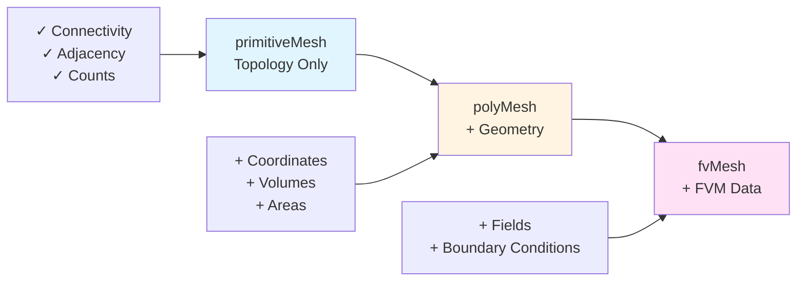

# primitiveMesh: Topology and Connectivity

> **ทำไมต้องรู้ primitiveMesh?**
> - เป็น **base class** ที่ polyMesh และ fvMesh สืบทอด
> - **Connectivity queries** (cell→face, face→cell) อยู่ที่นี่
> - เข้าใจ topology = debug mesh problems ได้

---

## Learning Objectives

หลังจากอ่านบทนี้ คุณควรจะสามารถ:
- อธิบาย **role** ของ primitiveMesh ใน mesh class hierarchy
- ใช้ **connectivity queries** เพื่อนำทางโครงสร้าง mesh
- แยกความแตกต่างระหว่าง **topology** และ **geometry**
- เขียนโค้ดเพื่อเข้าถึง cell-face-point relationships
- เลือกใช้ connectivity query ที่ **efficient** สำหรับงานต่างๆ

---

## Prerequisites

ควรมีความเข้าใจพื้นฐานเกี่ยวกับ:
- **C++ pointers และ references**: การเข้าถึงข้อมูลใน memory
- **Mesh concepts** จาก [00_Overview.md](00_Overview.md): cells, faces, points, boundaries
- **Class inheritance**: base class และ derived class relationships

---

## Overview

> **💡 primitiveMesh = "Who connects to whom?"**
>
> ไม่รู้ว่าอยู่ที่ไหน (no coordinates) แต่รู้ว่า:
> - Cell มีกี่ faces
> - Face เชื่อม cells ไหน
> - Point อยู่ใน cells ไหน

### What is primitiveMesh?

**primitiveMesh** เป็น abstract base class ที่เก็บ **topological information** เท่านั้น ไม่มีข้อมูลเกี่ยวกับ:
- ❌ พิกัดจุด (coordinates)
- ❌ ขนาด cell (volumes)
- ❌ พื้นที่ face (areas)

แต่มีข้อมูลเกี่ยวกับ:
- ✅ การเชื่อมต่อ (connectivity)
- ✅ โครงสร้าง (adjacency)
- ✅ การนับ (counts)

### Why Separate Topology from Geometry?



**Benefits of Separation:**
1. **Efficiency**: Connectivity queries ไม่ต้องโหลด geometry data
2. **Reuse**: Algorithms ที่ต้องการ topology เท่านั้นสามารถใช้ base class
3. **Clarity**: แยกสิ่งที่เป็น "structure" จาก "physics" ออกจากกัน

### Class Hierarchy Context

```cpp
// Inheritance relationship
class polyMesh : public primitiveMesh
{
    // Adds: pointFields, faceAreas, cellVolumes
};

class fvMesh : public polyMesh
{
    // Adds: geometric fields, boundary conditions
};
```

---

## 1. Core Data: Counting Entities

### Basic Count Methods

| Method | Returns | Description |
|--------|---------|-------------|
| `nCells()` | `label` | Total number of cells |
| `nFaces()` | `label` | Total faces (internal + boundary) |
| `nInternalFaces()` | `label` | Internal faces only |
| `nPoints()` | `label` | Number of vertices |
| `nEdges()` | `label` | Number of edges |
| `nInternalPoints()` | `label` | Points not on boundary |

### Practical Example: Analyzing Mesh Composition

```cpp
// Calculate mesh statistics
label nCells = mesh.nCells();
label nInternalFaces = mesh.nInternalFaces();
label nBoundaryFaces = mesh.nFaces() - nInternalFaces;
label nPoints = mesh.nPoints();

// Calculate ratios
scalar faceToCellRatio = scalar(nInternalFaces) / nCells;
scalar pointToCellRatio = scalar(nPoints) / nCells;

Info << "Mesh Statistics:" << nl
     << "  Cells: " << nCells << nl
     << "  Internal faces: " << nInternalFaces << nl
     << "  Boundary faces: " << nBoundaryFaces << nl
     << "  Points: " << nPoints << nl
     << "  Face/Cell ratio: " << faceToCellRatio << nl
     << "  Point/Cell ratio: " << pointToCellRatio << endl;

// Typical tetrahedral mesh: face/cell ≈ 4-5, point/cell ≈ 0.3
```

---

## 2. Connectivity: The Core of primitiveMesh

### 2.1 Face → Cell Relationships

**Fundamental Concept**: Every face มี **owner cell** เสมอ และ **neighbour cell** (ถ้าเป็น internal face)

```cpp
// Owner: cell ที่ face normal ชี้ออกจาก
const labelList& owner = mesh.faceOwner();
label ownerCell = owner[faceI];

// Neighbour: cell อีกด้านของ face (internal faces เท่านั้น)
const labelList& neighbour = mesh.faceNeighbour();
if (faceI < mesh.nInternalFaces())
{
    label neighbourCell = neighbour[faceI];
}
else
{
    // Boundary face - no neighbour
}
```

#### Real-World Example: Finding Face Neighbors

```cpp
// Task: Find cells sharing a specific internal face
void printFaceNeighbors(const primitiveMesh& mesh, label faceI)
{
    if (faceI < mesh.nInternalFaces())
    {
        label own = mesh.faceOwner()[faceI];
        label nei = mesh.faceNeighbour()[faceI];
        
        Info << "Internal face " << faceI 
             << " connects cells " << own << " and " << nei << endl;
    }
    else
    {
        label own = mesh.faceOwner()[faceI];
        Info << "Boundary face " << faceI 
             << " belongs to cell " << own << endl;
    }
}
```

### 2.2 Cell → Faces

```cpp
// Cell เป็น container ของ face indices
const cellList& cells = mesh.cells();
const cell& c = cells[cellI];

// Iterate over faces of this cell
forAll(c, i)
{
    label faceI = c[i];
    // Process face...
}
```

#### Practical Example: Cell Face Analysis

```cpp
// Task: Count internal vs boundary faces for a cell
void analyzeCellFaces(const primitiveMesh& mesh, label cellI)
{
    const cell& c = mesh.cells()[cellI];
    
    label nInternal = 0;
    label nBoundary = 0;
    
    forAll(c, i)
    {
        label faceI = c[i];
        if (faceI < mesh.nInternalFaces())
        {
            nInternal++;
        }
        else
        {
            nBoundary++;
        }
    }
    
    Info << "Cell " << cellI << ": "
         << nInternal << " internal faces, "
         << nBoundary << " boundary faces" << endl;
}
```

### 2.3 Cell → Cells (Neighboring Cells)

```cpp
// Direct query for cell neighbors
const labelListList& cc = mesh.cellCells();
const labelList& neighbours = cc[cellI];

// Or compute manually
void findCellNeighbors(const primitiveMesh& mesh, label cellI)
{
    const cell& c = mesh.cells()[cellI];
    HashSet<label> neighborSet;
    
    forAll(c, i)
    {
        label faceI = c[i];
        label own = mesh.faceOwner()[faceI];
        
        if (own == cellI && faceI < mesh.nInternalFaces())
        {
            // We're owner, neighbour is on other side
            neighborSet.insert(mesh.faceNeighbour()[faceI]);
        }
        else if (own != cellI)
        {
            // We're neighbour
            neighborSet.insert(own);
        }
        // else: boundary face, no neighbor cell
    }
    
    Info << "Cell " << cellI << " has " 
         << neighborSet.size() << " neighbors" << endl;
}
```

---

## 3. Face Structure

### Basic Face Access

```cpp
// Face = list of point indices (ordered)
const faceList& faces = mesh.faces();
const face& f = faces[faceI];

// Number of vertices
label nVerts = f.size();

// Access point indices
forAll(f, i)
{
    label pointI = f[i];
}
```

### Practical Example: Face Type Detection

```cpp
// Task: Classify faces by shape
void classifyFaces(const primitiveMesh& mesh)
{
    const faceList& faces = mesh.faces();
    
    label nTri = 0;    // Triangular
    label nQuad = 0;   // Quadrilateral
    label nPoly = 0;   // Polygonal (>4 vertices)
    
    forAll(faces, faceI)
    {
        label nVerts = faces[faceI].size();
        
        if (nVerts == 3)
        {
            nTri++;
        }
        else if (nVerts == 4)
        {
            nQuad++;
        }
        else
        {
            nPoly++;
        }
    }
    
    Info << "Face distribution:" << nl
         << "  Triangular: " << nTri << nl
         << "  Quadrilateral: " << nQuad << nl
         << "  Polygonal: " << nPoly << endl;
}
```

---

## 4. Edge Connectivity

### Edge Access Methods

```cpp
// All edges in mesh
const edgeList& edges = mesh.edges();

// Cell → edges connectivity
const labelListList& ce = mesh.cellEdges();

// Face → edges connectivity
const labelListList& fe = mesh.faceEdges();
```

### Practical Example: Edge-Based Analysis

```cpp
// Task: Find edges used by multiple faces (potential quality issue)
void findMultiFaceEdges(const primitiveMesh& mesh)
{
    const labelListList& faceEdges = mesh.faceEdges();
    Map<label> edgeUsage;
    
    // Count how many faces use each edge
    forAll(faceEdges, faceI)
    {
        const labelList& fEdges = faceEdges[faceI];
        forAll(fEdges, i)
        {
            label edgeI = fEdges[i];
            edgeUsage[edgeI]++;
        }
    }
    
    // Report suspicious edges
    Info << "Edges used by >2 faces:" << endl;
    forAllConstIter(Map<label>, edgeUsage, iter)
    {
        if (iter() > 2)
        {
            Info << "  Edge " << iter.key() 
                 << " used by " << iter() << " faces" << endl;
        }
    }
}
```

---

## 5. Point Connectivity

### Point → Entities Queries

```cpp
// Point → cells
const labelListList& pc = mesh.pointCells();

// Point → faces
const labelListList& pf = mesh.pointFaces();

// Point → points (neighboring points via edges)
const labelListList& pp = mesh.pointPoints();
```

### Practical Example: Boundary Point Detection

```cpp
// Task: Identify points on boundary
void markBoundaryPoints(const primitiveMesh& mesh)
{
    const labelListList& pointCells = mesh.pointCells();
    labelList boundaryPoints;
    
    forAll(pointCells, pointI)
    {
        // Boundary points belong to fewer cells
        // (heuristic: boundary cells have fewer neighbors)
        if (pointCells[pointI].size() < 8)  // Typical internal point
        {
            boundaryPoints.append(pointI);
        }
    }
    
    Info << "Found " << boundaryPoints.size() 
         << " potential boundary points" << endl;
}
```

---

## 6. Boundary Structure

### Identifying Boundary Faces

```cpp
// Boundary faces: from nInternalFaces() to nFaces()-1
label nInternal = mesh.nInternalFaces();
label nBoundary = mesh.nFaces() - nInternal;

for (label faceI = nInternal; faceI < mesh.nFaces(); faceI++)
{
    // This is a boundary face
    label ownerCell = mesh.faceOwner()[faceI];
    // No neighbour cell
    
    // Process boundary face...
}
```

### Practical Example: Boundary Face Statistics

```cpp
// Task: Analyze boundary connectivity
void analyzeBoundary(const primitiveMesh& mesh)
{
    label nInternal = mesh.nInternalFaces();
    label nBoundary = mesh.nFaces() - nInternal;
    
    // Count boundary faces per cell
    Map<label> cellBoundaryFaces;
    
    for (label faceI = nInternal; faceI < mesh.nFaces(); faceI++)
    {
        label cellI = mesh.faceOwner()[faceI];
        cellBoundaryFaces[cellI]++;
    }
    
    // Find cells with many boundary faces (potential issues)
    Info << "Cells with >4 boundary faces:" << endl;
    forAllConstIter(Map<label>, cellBoundaryFaces, iter)
    {
        if (iter() > 4)
        {
            Info << "  Cell " << iter.key() 
                 << ": " << iter() << " boundary faces" << endl;
        }
    }
}
```

---

## 7. Performance Considerations

### Computational Complexity

| Query | Complexity | When to Use |
|-------|------------|-------------|
| `faceOwner()[i]` | O(1) | Direct access - always fast |
| `faceNeighbour()[i]` | O(1) | Direct access - always fast |
| `cells()[i]` | O(1) | Direct access to cell |
| `cellCells()` | O(nFaces/cell) | Lazy evaluation - cached after first call |
| `pointCells()` | O(nCells/point) | Lazy evaluation - cached after first call |
| `cellEdges()` | O(nFaces/cell × nVerts/face) | **Expensive** - use sparingly |

### Optimization Strategies

#### 1. Cache Expensive Queries

```cpp
// BAD: Computing cellCells() multiple times
for (label i = 0; i < 10; i++)
{
    const labelListList& cc = mesh.cellCells();  // Recomputed!
}

// GOOD: Cache once
const labelListList& cc = mesh.cellCells();
for (label i = 0; i < 10; i++)
{
    // Use cached cc
}
```

#### 2. Prefer Direct Face-Based Queries

```cpp
// BAD: Using cellCells() for simple neighbor lookup
const labelListList& cc = mesh.cellCells();
forAll(cc[cellI], i)
{
    label neighborI = cc[cellI][i];
}

// GOOD: Manual traversal using faces
const cell& c = mesh.cells()[cellI];
forAll(c, i)
{
    label faceI = c[i];
    label neighborI = (mesh.faceOwner()[faceI] == cellI) 
                     ? mesh.faceNeighbour()[faceI] 
                     : mesh.faceOwner()[faceI];
}
```

#### 3. Avoid Redundant Connectivity

```cpp
// Task: Find max neighbors in mesh
// BAD: Computing full cellCells()
label maxNeighbors = 0;
const labelListList& cc = mesh.cellCells();
forAll(cc, cellI)
{
    maxNeighbors = max(maxNeighbors, cc[cellI].size());
}

// BETTER: Count using faces directly
label maxNeighbors = 0;
const cellList& cells = mesh.cells();
const labelList& owner = mesh.faceOwner();
const labelList& neighbour = mesh.faceNeighbour();

forAll(cells, cellI)
{
    label nNei = 0;
    const cell& c = cells[cellI];
    
    forAll(c, i)
    {
        label faceI = c[i];
        if (faceI < mesh.nInternalFaces())
        {
            if (owner[faceI] == cellI)
            {
                nNei++;  // Has neighbour
            }
            // else: neighbour owns this face
        }
        // else: boundary face
    }
    
    maxNeighbors = max(maxNeighbors, nNei);
}
```

### Memory Usage Considerations

```cpp
// Connectivity data is cached - be mindful of memory
// After first call, data stays in memory

// If memory is tight, use temporary queries
{
    const labelListList& cc = mesh.cellCells();
    // Use cc...
}  // cc goes out of scope, but cache remains

// To free cache (advanced):
mesh.clearOut();  // Clears all cached connectivity
```

---

## 8. Mesh Validation

### Checking Functions

```cpp
// Full mesh validation
mesh.checkMesh(true);  // With detailed report

// Specific topology checks
mesh.checkFaceOrthogonality();  // Face normal vs cell centers
mesh.checkFaceSkewness();       // Face intersection with cell line
mesh.checkCellVolumes();        // Minimum cell volume
mesh.checkTopology();           // Connectivity consistency
```

### Practical Example: Custom Validation

```cpp
// Task: Check for common topology issues
void customMeshCheck(const primitiveMesh& mesh)
{
    label nErrors = 0;
    
    // 1. Check: Every internal face should have neighbour
    for (label faceI = 0; faceI < mesh.nInternalFaces(); faceI++)
    {
        if (mesh.faceNeighbour()[faceI] < 0)
        {
            WarningIn("customMeshCheck")
                << "Internal face " << faceI << " has no neighbour!" << endl;
            nErrors++;
        }
    }
    
    // 2. Check: Cells should have >= 4 faces (tetrahedral minimum)
    const cellList& cells = mesh.cells();
    forAll(cells, cellI)
    {
        if (cells[cellI].size() < 4)
        {
            WarningIn("customMeshCheck")
                << "Cell " << cellI << " has only " 
                << cells[cellI].size() << " faces!" << endl;
            nErrors++;
        }
    }
    
    // 3. Check: No duplicate faces in cell
    forAll(cells, cellI)
    {
        const cell& c = cells[cellI];
        HashSet<label> uniqueFaces;
        
        forAll(c, i)
        {
            if (uniqueFaces.found(c[i]))
            {
                WarningIn("customMeshCheck")
                    << "Duplicate face " << c[i] 
                    << " in cell " << cellI << endl;
                nErrors++;
            }
            uniqueFaces.insert(c[i]);
        }
    }
    
    if (nErrors == 0)
    {
        Info << "Mesh topology validation: PASSED" << endl;
    }
    else
    {
        Info << "Mesh topology validation: " << nErrors 
             << " errors found" << endl;
    }
}
```

---

## 9. Integration with Other OpenFOAM Components

### Working with polyMesh

```cpp
// primitiveMesh is base class of polyMesh
const polyMesh& mesh = ...;  // Your mesh object

// Can call all primitiveMesh methods
label nCells = mesh.nCells();
const labelList& owner = mesh.faceOwner();

// Plus polyMesh-specific methods
const pointField& points = mesh.points();  // Geometry!
const vectorField& faceAreas = mesh.faceAreas();
```

### Accessing Boundary Information

```cpp
// primitiveMesh knows boundary faces exist
// But boundary patches are in polyMesh
const polyMesh& mesh = ...;

const polyBoundaryMesh& patches = mesh.boundaryMesh();

forAll(patches, patchI)
{
    const polyPatch& patch = patches[patchI];
    Info << "Patch " << patch.name() 
         << " starts at face " << patch.start() 
         << " size " << patch.size() << endl;
}
```

### Integration with Field Operations

```cpp
// Typical solver usage: connectivity + fields
const volVectorField& U = ...;  // Velocity field
const surfaceScalarField& phi = ...;  // Flux field

const labelList& owner = mesh.faceOwner();
const labelList& neighbour = mesh.faceNeighbour();

for (label faceI = 0; faceI < mesh.nInternalFaces(); faceI++)
{
    label own = owner[faceI];
    label nei = neighbour[faceI];
    
    // Use connectivity to interpolate fields
    scalar faceValue = 0.5 * (U[own] + U[nei]);
    // ... use in calculation
}
```

---

## Connectivity Quick Reference

### Basic Access Patterns

| Task | Method | Complexity |
|------|--------|------------|
| Face → Owner | `faceOwner()[faceI]` | O(1) |
| Face → Neighbour | `faceNeighbour()[faceI]` | O(1) |
| Cell → Faces | `cells()[cellI]` | O(1) |
| Cell → Neighbors | `cellCells()[cellI]` | Lazy O(n) |
| Point → Cells | `pointCells()[pointI]` | Lazy O(n) |
| Point → Faces | `pointFaces()[pointI]` | Lazy O(n) |
| Face → Edges | `faceEdges()[faceI]` | **Expensive** |

### Common Patterns

```cpp
// Iterate all internal faces
for (label faceI = 0; faceI < mesh.nInternalFaces(); faceI++)

// Iterate boundary faces
for (label faceI = mesh.nInternalFaces(); faceI < mesh.nFaces(); faceI++)

// Iterate cell faces
const cell& c = mesh.cells()[cellI];
forAll(c, i) { label faceI = c[i]; }

// Get face neighbor pair
label own = mesh.faceOwner()[faceI];
label nei = (faceI < mesh.nInternalFaces()) 
           ? mesh.faceNeighbour()[faceI] 
           : -1;
```

---

## 🧠 Concept Check

<details>
<summary><b>1. owner vs neighbour ต่างกันอย่างไร?</b></summary>

- **owner**: Cell ที่ face normal ชี้ออก (มีทุก face)
- **neighbour**: Cell อีกด้านของ face (มีเฉพาะ internal faces)
- **Convention**: Face normal ชี้จาก owner → neighbour

```cpp
// Check orientation
if (owner[faceI] == myCell)
{
    // Face points OUT of myCell
}
else
{
    // Face points INTO myCell (we are neighbour)
}
```
</details>

<details>
<summary><b>2. ทำไมต้องแยก internal และ boundary faces?</b></summary>

- **Internal faces**: มี 2 cells (owner + neighbour), ใช้ใน flux calculations
- **Boundary faces**: มี 1 cell (owner) + boundary condition, ไม่มี neighbour

```cpp
// Storage optimization
labelList owner(nFaces);           // All faces
labelList neighbour(nInternalFaces);  // Internal faces only!

// Boundary faces: nInternalFaces() ถึง nFaces()-1
```
</details>

<details>
<summary><b>3. primitiveMesh มี geometry ไหม?</b></summary>

**ไม่มี** — เป็นแค่ topology (connectivity)

- ✅ Has: "Cell 5 เชื่อมกับ faces 10, 15, 20"
- ❌ No: "Cell 5 อยู่ที่ (1.0, 2.0, 3.0)"

**Geometry** อยู่ใน **polyMesh**:
- `pointField points()` — พิกัดจุด
- `vectorField faceAreas()` — พื้นที่ face
- `scalarField cellVolumes()` — ปริมาตร cell

```cpp
// Topology (primitiveMesh)
label nCells = mesh.nCells();

// Geometry (polyMesh)
const pointField& points = mesh.points();
scalar volume = mesh.cellVolumes()[cellI];
```
</details>

<details>
<summary><b>4. เมื่อไหร่ควรใช้ cellCells() vs manual traversal?</b></summary>

**ใช้ `cellCells()` เมื่อ:**
- ต้องการ neighbor lists หลายครั้ง (cache แล้วใช้ซ้ำ)
- ความสะดวกสำคัญกว่า performance

**ใช้ manual traversal เมื่อ:**
- Performance สำคัญมาก
- ทำครั้งเดียว (ไม่ได้ profit จาก cache)
- Memory จำกัด

```cpp
// Fast one-time query
const cell& c = mesh.cells()[cellI];
forAll(c, i)
{
    label faceI = c[i];
    // ... find neighbors manually
}

// Convenient repeated use
const labelListList& cc = mesh.cellCells();
forAll(iterations, i)
{
    const labelList& neighbors = cc[cellI];  // From cache
}
```
</details>

---

## Key Takeaways

### Core Concepts

1. **primitiveMesh = Topology Only**
   - เก็บ connectivity (การเชื่อมต่อ) เท่านั้น
   - ไม่มี geometry (พิกัด, ปริมาตร, พื้นที่)
   - เป็น base class ของ polyMesh และ fvMesh

2. **Face-Cell Adjacency is Fundamental**
   - Internal faces: owner + neighbour (2 cells)
   - Boundary faces: owner only (1 cell)
   - การแยกเก็บ optimize memory และ access patterns

3. **Connectivity Queries Have Costs**
   - Direct access (`faceOwner`, `cells`): O(1) - สามารถใช้ได้เลย
   - Derived queries (`cellCells`, `pointCells`): Lazy evaluation - cache หลังใช้ครั้งแรก
   - Expensive queries (`cellEdges`, `faceEdges`): ใช้เฉพาะจำเป็น

4. **Efficient Usage Patterns**
   - Cache connectivity ที่ใช้บ่อย
   - เลือก query ที่เหมาะสมกับ task
   - ระวัง memory footprint จาก cached data

### Practical Skills

✅ **Navigate mesh topology** ด้วย connectivity queries  
✅ **Choose appropriate queries** สำหรับ task ที่ต่างกัน  
✅ **Write efficient mesh traversal** algorithms  
✅ **Debug mesh problems** ด้วย topology analysis  
✅ **Integrate with geometry** (polyMesh) เมื่อจำเป็น

---

## Navigation

### Within This Module

- **Next:** [05_Mesh_Classes.md](05_Mesh_Classes.md) — รวมทุกอย่างเข้าด้วยกัน
- **Previous:** [02_Mesh_Hierarchy.md](02_Mesh_Hierarchy.md) — ความสัมพันธ์ระหว่าง mesh classes

### Related Topics

- **Foundation Primitives:** [01_Introduction.md](01_Introduction.md) — พื้นฐาน C++ สำหรับ OpenFOAM
- **Dimensioned Types:** [02_Dimensioned_Types.md](02_Dimensioned_Types.md) — หน่วยวัดใน mesh calculations
- **Containers:** [03_Containers_Memory.md](03_Containers_Memory.md) — Memory management สำหรับ mesh data

### Cross-Reference

- **Boundary Conditions:** MODULE_01 - การใช้งาน boundary faces
- **Fields:** MODULE_03 - การใช้ connectivity สำหรับ field operations
- **Solver Development:** MODULE_05 - การเขียน solvers ที่ใช้ mesh topology