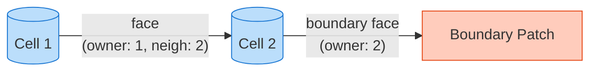

# `polyMesh`: โครงสร้างและการจัดการโทโพโลยี

![[city_registry_office.png]]
`A grand architectural building labeled "polyMesh Registry". Inside, blueprints of points and faces are meticulously filed. A "Boundary" wing manages different zones (Inlet, Outlet), scientific textbook diagram, clean vector line art, white background, high definition, flat design, educational infographic --ar 16:9`

---

## 🔍 **High-Level Concept: อุปมาน "สำนักงานทะเบียนเมือง"**

### **PolyMesh ในฐานะการจัดการโครงสร้างพื้นฐานเมือง**

จินตนาการถึง **สำนักงานทะเบียนเมือง** ที่รักษาบันทึกข้อมูลที่ครอบคลุมของโครงสร้างพื้นฐานเมือง สำนักงานนี้ไม่เพียงแต่เก็บข้อมูลสุ่ม - แต่รักษา **ความสัมพันธ์เชิงโทโพโลยีที่เป็นทางการ** ที่กำหนดว่าเมืองทั้งหมดถูกจัดระเบียบและเชื่อมต่อกันอย่างไร



### **ส่วนประกอบหลักของทะเบียน**

#### **กรรมสิทธิ์ทรัพย์สิน (Points ใน polyMesh)**

ทะเบียนรักษาพิกัด GPS ที่แม่นยำสำหรับทุกมุมของที่ดิน ซึ่งเป็นจุดยอดพื้นฐานที่กำหนดความสัมพันธ์เชิงพื้นที่ทั้งหมดใน mesh

ใน `polyMesh` จัดเก็บเป็น `points_` - `pointField` ที่มีพิกัด 3 มิติที่แน่นอนของทุกจุดยอด mesh:

```cpp
const pointField& points = mesh.points();
forAll(points, i) {
    const point& p = points[i];
    // p.x(), p.y(), p.z() ให้พิกัดที่แน่นอน
}
```

#### **แผนที่เขตแดน (Faces ใน polyMesh)**

คำอธิบายทางกฎหมายของเขตแดนทรัพย์สินกำหนดว่าใครเป็นเจ้าของด้านใดของทุกเส้นเขตแดน ใน `polyMesh` faces คือขอบเขตรูปหลายเหลี่ยมระหว่าง cells โดยแต่ละ face มี owner cell และ neighbor cell

ฟิลด์ `faces_` จัดเก็บเป็น `faceList`:

```cpp
const faceList& faces = mesh.faces();
forAll(faces, i) {
    const face& f = faces[i];
    // f มีดัชนีจุดยอดที่สร้างรูปหลายเหลี่ยม face
    label own = mesh.faceOwner()[i];  // Owner cell
    label nei = mesh.faceNeighbour()[i]; // Neighbor cell (-1 สำหรับ boundary)
}
```

#### **ใบอนุญาตก่อสร้าง (Cells ใน polyMesh)**

สิทธิ์ปริมาตร 3 มิติกำหนดพื้นที่ที่โครงสร้างแต่ละอย่างสามารถครอบครองได้ ซึ่งกลายเป็น computational cells ที่สมการ CFD ถูกแก้ไข

ฟิลด์ `cells_` จัดเก็บการเชื่อมต่อของ cell:

```cpp
const cellList& cells = mesh.cells();
forAll(cells, i) {
    const cell& c = cells[i];
    // c มีดัชนี faces ที่สร้างขอบเขตปิดของ cell
}
```

#### **บันทึกระบบครอบครอง (Owner/Neighbor ใน polyMesh)**

ทะเบียนติดตามความสัมพันธ์ใกล้เคียง - ทรัพย์สินใดแบ่งปันเขตแดน ใน `polyMesh` นี้ถูก implement ผ่านฟิลด์ `owner_` และ `neighbour_`:

```cpp
const labelList& owner = mesh.faceOwner();
const labelList& neighbour = mesh.faceNeighbour();

// Face ชี้จาก owner ไปยัง neighbor เสมอ
// การวางแนวนี้สำคัญมากสำหรับการคำนวณ flux
```

#### **กฎระเบียบการวางผัง (Boundary Conditions ใน polyMesh)**

กฎพิเศษสำหรับพื้นที่ต่างๆ (ที่พักอาศัย, เชิงพาณิชย์, อุตสาหกรรม) สอดคล้องกับประเภทของเงื่อนไขขอบเขต

ใน `polyMesh` `boundaryMesh()` กำหนดโซนพิเศษเหล่านี้:

```cpp
const polyBoundaryMesh& boundary = mesh.boundaryMesh();
forAll(boundary, i) {
    const polyPatch& patch = boundary[i];
    // patch.type(), patch.name() กำหนดเงื่อนไขขอบเขต
}
```

---

### **อุปมานชั้นข้อมูล GIS**

polyMesh ทำงานเหมือนกับ **ระบบสารสนเทศภูมิศาสตร์ (GIS)** โดยมีชั้นข้อมูลที่เชื่อมต่อกัน:

![[of_polymesh_gis_layers.png]]
`A diagram showing 5 overlapping GIS layers representing polyMesh data: 1. GPS Positions (Points), 2. Property Lines (Faces), 3. 3D Parcels (Cells), 4. Neighbor Maps (Connectivity), 5. Zoning Regulations (Boundary Conditions), scientific textbook diagram, clean vector line art, white background, high definition, flat design, educational infographic --ar 16:9`

#### **ชั้นข้อมูล 1: พิกัดจุด (GPS Positions)**
- ระบบอ้างอิงเชิงพื้นที่พร้อมพิกัด 3 มิติที่แม่นยำ
- พื้นฐานสำหรับการดำเนินงานเรขาคณิตระดับสูง
- ใช้สำหรับการประมาณค่า, การคำนวณ gradient, และตัวชี้วัดคุณภาพ mesh

#### **ชั้นข้อมูล 2: ขอบเขตรูปหลายเหลี่ยม (Property Lines)**
- การเชื่อมต่อของ face ที่กำหนด interfaces ของ cell
- การคำนวณพื้นที่สำหรับการคำนวณ flux
- การคำนวณเวกเตอร์ปกติสำหรับเงื่อนไขขอบเขต
- ตำแหน่ง center ของ face สำหรับการประมาณค่าของ field

#### **ชั้นข้อมูล 3: การแบ่งส่วนปริมาตร (3D Parcels)**
- ปริมาตรของ cell สำหรับการ discretization วิธีปริมาตรจำกัด
- center ของ cell สำหรับการจัดเก็บและการประมาณค่าของ field
- ส่วนปริมาตรสำหรับการไหลแบบหลายเฟส
- ตัวชี้วัดคุณภาพ mesh (อัตราส่วนภาพ, ความเบ้)

#### **ชั้นข้อมูล 4: ความสัมพันธ์ใกล้เคียง (Neighbor Maps)**
- โครงสร้างเมทริกซ์เบาบางสำหรับระบบเชิงเส้น
- รูปแบบการสื่อสารสำหรับการประมวลผลแบบขนาน
- การสร้าง stencil ของ gradient
- การติดตาม interface สำหรับการไหลแบบหลายเฟส

#### **ชั้นข้อมูล 5: โซนพิเศษ (Boundary Conditions)**
- ประเภทขอบเขตทางกายภาพ (กำแพง, ทางเข้า, ทางออก)
- เงื่อนไขขอบเขตทางคณิตศาสตร์ (Dirichlet, Neumann)
- การบังคับใช้ข้อจำกัดสำหรับเสถียรภาพของ solver
- การ coupling หลายโซนสำหรับการถ่ายเทความร้อนร่วม

---

### **สถาปัตยกรรมแหล่งที่มาที่เป็นทางการ**

เหมือนกับสำนักงานทะเบียนเมือง `polyMesh` รักษา **ความสมบูรณ์ของข้อมูล** ผ่านกลไกหลักหลายอย่าง:

#### **การตรวจสอบความสอดคล้อง**

ความสัมพันธ์ทั้งหมดต้องสอดคล้องกัน:
- ทุก face ต้องมี owner ที่แน่นอนหนึ่งตัว
- ทุก cell ต้องปิด
- boundary faces ต้องไม่มี neighbors

วิธี `polyMesh::checkMesh()` ดำเนินการตรวจสอบเหล่านี้:

```cpp
// การตรวจสอบความสอดคล้องของ mesh
bool polyMesh::checkMesh(const bool report) const {
    // ตรวจสอบการเชื่อมต่อของ face
    // ตรวจสอบการปิดของ cell
    // ตรวจสอบความสอดคล้องของ boundary
    // ตรวจสอบการใช้งานของจุด
    return isTopologicallyCorrect();
}
```

#### **ค่าคงที่เชิงโทโพโลยี**

ความสัมพันธ์ทางคณิตศาสตร์บางอย่างต้องคงที่เสมอ:

- **สูตรของออยเลอร์สำหรับ mesh ทรงหลายหน้า**:
  $$
  V - E + F - C = 1 \quad \text{(สำหรับโดเมนที่เชื่อมต่อง่าย)}
  $$

- **การอนุรักษ์พื้นที่ผิวของ face**:
  $$
  \sum_{i \in \text{boundary}} A_i = A_{\text{total}}
  $$

- **ความสอดคล้องของปริมาตร cell**:
  $$
  \sum_{j=1}^{N_{\text{cells}}} V_j = V_{\text{domain}}
  $$

#### **การจัดระเบียบลำดับชั้น**

เหมือนกับโซนการวางผังเมือง polyMesh จัดระเบียบข้อมูลตามลำดับชั้น:

```cpp
// ลำดับชั้นเรขาคณิต
Mesh -> Zones -> Patches -> Faces -> Edges -> Points

// ลำดับชั้นเชิงโทโพโลยี
Mesh -> Cells -> Faces -> Points
```

![[polymesh_hierarchical_structure.png]]
`A diagram showing the hierarchical structure of polyMesh, illustrating the relationships between Cells, Faces, Points, Zones, and Patches, scientific textbook diagram, clean vector line art, white background, high definition, flat design, educational infographic --ar 16:9`

---

## ⚙️ **Key Mechanisms: polyMesh แบบ Step-by-Step**

### **Step 1: Core Topology Storage**

คลาส `polyMesh` ทำหน้าที่เป็นโครงสร้างข้อมูล mesh พื้นฐานของ OpenFOAM โดยจัดเก็บข้อมูลโทโพโลยีที่สมบูรณ์ผ่านลำดับชั้นของข้อมูลสมาชิกที่ถูกออกแบบอย่างพิถีพิถัน

**สถาปัตยกรรมโค้ด:**
- `polyMesh` สืบทอดมาจาก `objectRegistry` (สำหรับการดำเนินงาน I/O อัตโนมัติ)
- สืบทอดมาจาก `primitiveMesh` (สำหรับความสามารถในการคำนวณทางเรขาคณิต)
- ทำให้สามารถทำหน้าที่ได้ทั้งเป็นคอนเทนเนอร์ข้อมูลและเครื่องมือคำนวณ

**ข้อมูลโทโพโลยีถาวรประกอบด้วยอาร์เรย์พื้นฐานสี่อย่าง:**

| คอมโพเนนต์ | ประเภทข้อมูล | คำอธิบาย |
|-------------|-----------------|-------------|
| `pointIOField points_` | พิกัด 3 มิติ $(x,y,z)$ | เก็บพิกัดของ vertices ทั้งหมดของ mesh |
| `faceCompactIOList faces_` | การเชื่อมต่อ vertices | บรรจุข้อมูลการเชื่อมต่อสำหรับแต่ละ face |
| `labelIOList owner_` | cell index | ระบุ "owner" cell สำหรับแต่ละ face |
| `labelIOList neighbour_` | cell index | ระบุ "neighbor" cell (-1 สำหรับ boundary faces) |

**ระบบการจัดการ Boundary:**
- `mutable polyBoundaryMesh boundary_` object: จัดการข้อมูล patch แบบมีประสิทธิภาพ
- สามารถอัปเดต boundary แบบไดนามิกได้
- ยังคง const-correctness ในฟังก์ชันสมาชิก mesh

**ข้อมูล Zone:**
- `meshPointZones`, `meshFaceZones`, `meshCellZones` objects
- ทำให้สามารถจัดกลุ่ม mesh entities สำหรับรูปแบบฟิสิกส์เฉพาะทาง

**ความสามารถขั้นสูง:**
- `globalMeshDataPtr_`: การคำนวณแบบขนาน
- `curMotionTimeIndex_` และ `oldPointsPtr_`: ติดตามการเคลื่อนที่ของ mesh

**การเข้าถึงข้อมูล:**
- ส่งคืน `const references` เพื่อป้องกันการแก้ไขโทโพโลยีโดยไม่ได้รับอนุญาต

---

### **Step 2: Owner-Neighbor Convention**

**หลักการพื้นฐาน:**
- ทุก face ใน mesh ต้องมี **owner cell** พอดีหนึ่งชุด (ระบุโดยอาร์เรย์ `owner`)
- **Internal faces** มี **neighbor cell** อีกหนึ่งชุด (ระบุโดยอาร์เรย์ `neighbour`)
- สร้างโครงสร้างกราฟมีทิศทางที่แต่ละ face เป็นการเชื่อมต่อทางเดียวจาก owner ไปยัง neighbor

**ทิศทาง Face Normal:**
- Face normals ชี้ไปยัง **neighbor cell** เสมอ
- สำหรับ internal face ระหว่าง cell 5 และ 10:
  - `owner_[faceI] = 5`
  - `neighbour_[faceI] = 10`
  - Face normal vector $\mathbf{n}_{face}$ ชี้จาก cell 5 ไปยัง cell 10

**ความสำคัญสำหรับการคำนวณ:**
- กำหนดแบบแผนเครื่องหมายสำหรับการขนส่ง convection และ diffusion
- สำคัญอย่างยิ่งสำหรับการคำนวณ flux แบบ finite volume

**Boundary Faces:**
- ค่า `neighbour` เท่ากับ `-1`
- บ่งชี้ว่าไม่มี adjacent cell อยู่นอกขอบเขตโดเมน
- เป็นของ specialized patches (walls, inlets, outlets, etc.)

**การตรวจสอบความสอดคล้อง:**
- ฟังก์ชัน `checkFaceOrientation()` ตรวจสอบความสัมพันธ์ owner-neighbor
- ตรวจสอบว่า owner indices มีค่าน้อยกว่า neighbor indices สำหรับ internal faces
- ป้องกันข้อผิดพลาดเครื่องหมายในรูปแบบเชิงตัวเลข

---

### **Step 3: Boundary Patch System**

คลาส `polyBoundaryMesh` ใช้ระบบการจัดการขอบเขตที่มีโครงสร้างซึ่งขยายความสามารถ mesh ของ OpenFOAM

**สถาปัตยกรรม:**
- สืบทอดมาจาก `PtrList<polyPatch>`
- สร้างคอนเทนเนอร์ที่จัดการ individual boundary patches เป็นวัตถุเฉพาะทาง
- แต่ละ patch มีคุณสมบัติทางฟิสิกส์และพฤติกรรมเชิงตัวเลขของตัวเอง

**ประเภทของ Patches:**

| ประเภท | คำอธิบาย | การใช้งาน |
|---------|-------------|-------------|
| **WALL** | ขอบเขตผนังแข็ง | เงื่อนไข no-slip, slip, หรือผนังขรุขระผ่าน wall functions |
| **PATCH** | เงื่อนไขขอบเขตทั่วไป | สำหรับการใช้ฟิสิกส์แบบกำหนดเอง |
| **EMPTY** | การจำลอง 2 มิติ | ระนาบสมมาตรที่มีความหนาเป็นศูนย์ |
| **CYCLIC** | เงื่อนไขขอบเขตเป็นระยะ | ทำให้สามารถจำลองเรขาคณิตที่ซ้ำกันได้ |
| **WEDGE** | แกนสมมาตร | รองรับการคำนวณแบบแกนสมมาตร |
| **SYMMETRYPLANE** | เงื่อนไขสมมาตร | สำหรับโดเมนที่สมมาตรแบบกระจก |

**เมธอดหลัก:**

**1. การค้นหา Patch:**
```cpp
label patchID = boundary.findPatchID("wall");
```
- ทำให้สามารถค้นหาแบบ O(n) ผ่าน boundary patches
- สำคัญสำหรับการกำหนดเงื่อนไขขอบเขตแบบไดนามิก

**2. การแม็ป Face:**
สมการการแปลงระหว่าง local และ global indices:

$$\text{global\_face\_index} = \text{patch\_start\_index} + \text{local\_face\_index}$$

**3. การรวบรวม Boundary Cells:**
เมธอด `boundaryCells()` รวบรวมรายการของ cells ทั้งหมดที่อยู่ติดกับ boundary faces:
- วนซ้ำผ่านแต่ละ patch
- รวบรวมข้อมูล `faceCells`
- รองรับอัลกอริทึมเชิงตัวเลขเฉพาะทาง

**ประสิทธิภาพการใช้งาน:**
- ใช้หน่วยความจำอย่างมีประสิทธิภาพ
- หลีกเลี่ยงการจัดสรรหน่วยความจำมากเกินไป
- การจัดการขนาดอย่างระมัดระวังสำหรับ dynamic arrays

---

## 🧠 **Under the Hood: Topological Mathematics**

### **การจัดเรียงจุดยอดของผิว: กฎมือขวา**

สำหรับผิวที่มีจุดยอด $\mathbf{v}_1, \mathbf{v}_2, \ldots, \mathbf{v}_n$ **เวกเตอร์ปกติของผิว** $\mathbf{n}$ ถูกคำนวณโดยใช้ **กฎมือขวา**:

$$
\mathbf{n} = \sum_{i=1}^{n} \mathbf{v}_i \times \mathbf{v}_{i+1} \quad \text{(โดยที่ } \mathbf{v}_{n+1} = \mathbf{v}_1 \text{)}
$$

**ข้อกำหนดที่สำคัญ**: จุดยอดต้องถูกจัดเรียงให้ $\mathbf{n}$ ชี้ **ออกจากเซลล์เจ้าของ**

สิ่งนี้จะสร้าง **แบบแผนเครื่องหมาย** สำหรับการคำนวณ flux ทั้งหมด:

- **Flux บวก**: การไหลในทิศทางของ $\mathbf{n}$ (เจ้าของ → ข้างเคียง)
- **Flux ลบ**: การไหลในทิศทางตรงข้ามกับ $\mathbf{n}$ (ข้างเคียง → เจ้าของ)

### **การ Implement ใน OpenFOAM**

```cpp
// คำนวณเวกเตอร์พื้นที่ผิวปกติ
vectorField Sf = mesh.Sf();  // เวกเตอร์พื้นที่ผิว
vectorField nf = mesh.nf();  // เวกเตอร์ปกติหน่วย

// พื้นที่ผิว (ขนาดของ Sf)
scalarField magSf = mesh.magSf();
```

ฟังก์ชัน `Sf()` คืนค่าเวกเตอร์พื้นที่ผิว $\mathbf{S} = \mathbf{n} \cdot |\mathbf{S}|$ โดยที่ $|\mathbf{S}|$ คือพื้นที่ผิว เวกเตอร์นี้จะชี้จากเซลล์เจ้าของไปยังเซลล์ข้างเคียงเสมอ

---

### **การเชื่อมต่อระหว่างเซลล์-ผิว: Incidence Matrix**

โทโพโลยีของ mesh สามารถแสดงเป็น **incidence matrix** $E$ โดยที่:

$$
E_{ij} = \begin{cases}
+1 & \text{ถ้าผิว } j \text{ ชี้ออกจากเซลล์ } i \\
-1 & \text{ถ้าผิว } j \text{ ชี้เข้าสู่เซลล์ } i \\
0 & \text{กรณีอื่นๆ}
\end{cases}
$$

เมทริกซ์นี้เข้ารหัส **discrete divergence operator**:

$$
(\nabla \cdot \mathbf{u})_i = \frac{1}{V_i} \sum_{j} E_{ij} (\mathbf{u} \cdot \mathbf{S})_j
$$

**ข้อมูล Implement**: รายการ `owner_` และ `neighbour_` จัดเก็บข้อมูล incidence นี้อย่างมีประสิทธิภาพโดยไม่ต้องสร้างเมทริกซ์เต็ม

### **การจัดเก็บที่มีประสิทธิภาพใน OpenFOAM**

OpenFOAM ใช้กลไกการจัดเก็บที่มีประสิทธิภาพซึ่งหลีกเลี่ยงการใช้ sparse incidence matrix:

```cpp
class fvMesh
{
    // รายการเซลล์เจ้าของและเซลล์ข้างเคียง
    const labelList& owner_;
    const labelList& neighbour_;

    // เมธอดการเข้าถึง
    inline const labelList& owner() const { return owner_; }
    inline const labelList& neighbour() const { return neighbour_; }

    // รับเซลล์เจ้าของสำหรับผิว j
    inline label owner(const label faceI) const { return owner_[faceI]; }

    // รับเซลล์ข้างเคียงสำหรับผิว j
    inline label neighbour(const label faceI) const { return neighbour_[faceI]; }
};
```

การดำเนินการ divergence จึงถูก implement ดังนี้:

```cpp
template<class Type>
tmp<GeometricField<Type, fvPatchField, volMesh>>
div(const surfaceScalarField& sf, const GeometricField<Type, fvsPatchField, surfaceMesh>& ssf)
{
    // สำหรับแต่ละเซลล์ รวม face fluxes ด้วยเครื่องหมายที่ถูกต้อง
    // ผิวขอบเขตใช้เฉพาะค่าส่วนของเซลล์เจ้าของ
    // ผิวภายใน: ค่าส่วนของเจ้าของ - ค่าส่วนของข้างเคียง
}
```

---

### **การจำแนกขอบเขต: ประเภทของ Patch**

ประเภทของ patch ต่างๆ implement ฟังก์ชัน **เงื่อนไขขอบเขตทางคณิตศาสตร์** ที่แตกต่างกัน:

| ประเภท Patch | เงื่อนไขทางคณิตศาสตร์ | ความหมายทางฟิสิกส์ |
|---|---|---|
| `wall` | $\mathbf{u} = \mathbf{0}$ (no-slip) หรือ $\mathbf{u} \cdot \mathbf{n} = 0$ (slip) | ขอบเขตของแข็ง |
| `symmetryPlane` | $\mathbf{u} \cdot \mathbf{n} = 0$, $\nabla(\mathbf{u} \cdot \mathbf{t}) \cdot \mathbf{n} = 0$ | ความสมมาตรกระจก |
| `cyclic` | $\phi_{\text{master}} = \phi_{\text{slave}}$ | โดเมนรอบระยะเวลา |
| `empty` | $\partial/\partial z = 0$ | การหดตัว 2D |
| `wedge` | ขอบเขตแกนสมมาตร | ความสมมาตรการหมุน |

### **รากฐานทางคณิตศาสตร์ของเงื่อนไขขอบเขต**

แต่ละประเภทของ patch บังคับใช้ข้อจำกัดทางคณิตศาสตร์เฉพาะ:

#### **เงื่อนไขขอบเขตของผนัง**
- **No-slip**: $\mathbf{u}|_{\text{wall}} = \mathbf{0}$
- **Free-slip**: $\mathbf{u} \cdot \mathbf{n}|_{\text{wall}} = 0$
- **Wall functions**: เงื่อนไขขอบเขตที่แก้ไขสำหรับความปั่นป่วน

#### **เงื่อนไขขอบเขตความสมมาตร**
เงื่อนไขความสมมาตรบังคับให้:
$$
\mathbf{u} \cdot \mathbf{n} = 0 \quad \text{และ} \quad \frac{\partial}{\partial n}(\mathbf{u} \cdot \mathbf{t}) = 0
$$

โดยที่:
- $\mathbf{n}$ = เวกเตอร์ปกติของผิว
- $\mathbf{t}$ = เวกเตอร์สัมผัสในระนาบของความสมมาตร

#### **เงื่อนไขขอบเขตรอบระยะเวลา**
สำหรับ cyclic patches ค่าของ field เป็นรอบระยะเวลา:
$$
\phi_{\text{master}}(x, y, z) = \phi_{\text{slave}}(x', y', z')
$$

สิ่งนี้สร้างโดเมนรอบระยะเวลาซึ่งข้อมูลผ่านไปอย่างราบรื่นระหว่าง master และ slave patches

### **สถาปัตยกรรมการ Implement**

ระบบเงื่อนไขขอบเขตใช้ factory pattern:

```cpp
template<class Type>
class fvPatchField
{
public:
    // กลไกการเลือกขณะ runtime
    virtual tmp<fvPatchField<Type>> clone() const = 0;

    // การประเมินเงื่อนไขขอบเขต
    virtual void updateCoeffs();

    // เงื่อนไขขอบเขตเฉพาะเหล่านี้จะถูก override
    virtual void evaluate();
};
```

เงื่อนไขขอบเขตเฉพาะถูก implement ใน derived classes:

```cpp
class wallFvPatchField : public fvPatchField<Type>
{
    virtual void evaluate()
    {
        // บังคับใช้เงื่อนไขขอบเขตของผนัง
        this->operator==(wallValue_);
    }
};

class symmetryPlaneFvPatchField : public fvPatchField<Type>
{
    virtual void evaluate()
    {
        // บังคับใช้เงื่อนไขความสมมาตร
        // n · u = 0, ∇(t · u) · n = 0
    }
};
```

---

### **การตรวจสอบความสอดคล้องทางโทโพโลยี**

โทโพโลยีของ mesh ต้องเป็นไปตาม **Euler characteristic** เพื่อความสอดคล้องทางเรขาคณิตที่เหมาะสม:

$$
V - E + F = 1 - 2g
$$

โดยที่:
- $V$ = จำนวนจุดยอด (Vertices)
- $E$ = จำนวนขอบ (Edges)
- $F$ = จำนวนผิว (Faces)
- $g$ = genus (จำนวนรูใน mesh)

### **เครื่องมือตรวจสอบใน OpenFOAM**

```cpp
// ตรวจสอบความสอดคล้องของโทโพโลยี mesh
bool checkMesh(const polyMesh& mesh)
{
    // ตรวจสอบการเชื่อมต่อระหว่างเซลล์-ผิว
    // ตรวจสอบความสอดคล้องของเงื่อนไขขอบเขต
    // ตรวจสอบการจัดเรียงจุดยอดของผิว
}
```

กรอบการทำงานทางโทโพโลยีนี้ช่วยให้มั่นใจว่าคณิตศาสตร์เชิงกระจายของการคำนวณ CFD ยังคงสอดคล้องและมีความหมายทางฟิสิกส์ตลอดการจำลอง

---

## ⚠️ **Common Pitfalls and Solutions**

ส่วนนี้จะกล่าวถึงข้อผิดพลาดทั่วไปที่นักพัฒนา OpenFOAM พบเจอและให้วิธีแก้ไขที่ใช้งานได้จริงเพื่อหลีกเลี่ยงข้อผิดพลาดเหล่านั้น

---

### **ข้อผิดพลาดที่ 1: การเข้าใจผิดทิศทางของ Face**

ทิศทางของ face ใน OpenFOAM จะตามข้อตกลงที่เคร่งครัดซึ่ง **face normals จะชี้จาก owner cells ไปยัง neighbor cells** การละเลยข้อตกลงนี้จะนำไปสู่การคำนวณ flux ที่ผิดพลาดและการ diverge ของ solver

> [!WARNING] ข้อเข้าใจสำคัญ
> OpenFOAM รักษา **dual perspective** สำหรับ internal faces:
> - **Owner cell** เห็น face normal ชี้ออกไปด้านนอก
> - **Neighbor cell** เห็น face normal เดียวกันชี้เข้าด้านใน (negative flux จากมุมมองของมัน)
>
> ข้อตกลงนี้ทำให้มั่นใจได้ถึงการอนุรักษ์แบบท้องถิ่นในขณะที่รักษาข้อตกลงเครื่องหมายที่ถูกต้องสำหรับมุมมองของแต่ละ cell

#### **OpenFOAM Code Implementation**

```cpp
// ❌ ปัญหา: สมมติว่าทิศทาง face normal
void wrongFluxCalculation(const polyMesh& mesh)
{
    const vectorField& Sf = mesh.faceAreas();

    forAll(mesh.owner(), faceI)
    {
        // ❌ ผิด: ไม่คำนึงถึงทิศทาง owner/neighbor
        scalar flux = U[faceI] & Sf[faceI];  // เครื่องหมายอาจผิด!

        // สำหรับ boundary faces นี่อาจถูกต้องหรือกลับด้าน
        // ขึ้นอยู่กับว่า face ถูกกำหนดไว้อย่างไร
    }
}

// ✅ วิธีแก้ไข: ใช้ข้อตกลงเครื่องหมายตาม owner
void correctFluxCalculation(const polyMesh& mesh)
{
    const vectorField& Sf = mesh.faceAreas();
    const labelList& owner = mesh.owner();
    const labelList& neighbour = mesh.neighbour();

    forAll(owner, faceI)
    {
        label own = owner[faceI];
        label nei = neighbour[faceI];

        // Face normal ชี้จาก owner ไปยัง neighbor
        // ดังนั้น flux จากมุมมองของ owner:
        scalar flux = U[faceI] & Sf[faceI];  // บวก = ออกจาก owner

        if (nei != -1)  // Internal face
        {
            // Owner เห็น positive flux เป็น outflow
            // Neighbor เห็น flux เดียวกันเป็น inflow (negative)
            phi[own] += flux;
            phi[nei] -= flux;  // Negative สำหรับ neighbor
        }
        else  // Boundary face
        {
            // มีเฉพาะฝั่ง owner เท่านั้น
            phi[own] += flux;
        }
    }
}
```

---

### **ข้อผิดพลาดที่ 2: การละเลยการแบ่งข้อมูลสำหรับ Parallel**

การ implement แบบ parallel ของ OpenFOAM ใช้ **domain decomposition** ซึ่งแต่ละ processor จะจัดการ subset ของ mesh โค้ดที่ไม่คำนึงถึงสิ่งนี้จะให้ผลลัพธ์ที่ผิดพลาดหรือล้มเหลวโดยสิ้นเชิงในการรันแบบ parallel

> [!INFO] การเขียนโปรแกรมแบบ parallel-aware ต้องการความเข้าใจ:
> 1. **Local vs Global**: แต่ละ processor สามารถเข้าถึงเฉพาะ local cells และ faces ของมันเอง
> 2. **Ghost Cells**: Boundary cells จาก processors ที่อยู่ติดกันที่จำเป็นสำหรับการคำนวณ
> 3. **Processor Patches**: Patches พิเศษที่เชื่อมต่อ processors ที่แตกต่างกัน
> 4. **Global Operations**: Reductions, broadcasts และ synchronizations ข้าม processors

#### **OpenFOAM Code Implementation**

```cpp
// ❌ ปัญหา: สมมติว่า mesh มีเพียง processor เดียว
void serialOnlyCode(const polyMesh& mesh)
{
    // ประมวลผล cells ทั้งหมด
    forAll(mesh.cells(), cellI)
    {
        processCell(cellI);
    }

    // ❌ ล้มเหลวใน parallel: cells() คืนค่าเฉพาะ local cells!
    // หา processor boundary faces และ ghost cells
}

// ✅ วิธีแก้ไข: ใช้การวนซ้ำแบบ parallel-aware
void parallelAwareCode(const polyMesh& mesh)
{
    // ✅ ประมวลผล local cells
    forAll(mesh.cells(), cellI)
    {
        processLocalCell(cellI);
    }

    // ✅ จัดการ processor boundaries
    forAll(mesh.boundaryMesh(), patchi)
    {
        const polyPatch& pp = mesh.boundaryMesh()[patchi];

        if (isA<processorPolyPatch>(pp))  // Processor boundary
        {
            // Faces เหล่านี้เชื่อมต่อกับ processor ที่อยู่ติดกัน
            forAll(pp, localFaceI)
            {
                label faceI = pp.start() + localFaceI;
                processProcessorFace(faceI);
            }
        }
    }

    // ✅ ใช้ global mesh data สำหรับการดำเนินการแบบ parallel
    if (mesh.globalData().valid())
    {
        const globalMeshData& gmd = mesh.globalData();

        // ทำ parallel reductions, gathers, scatters
        scalar globalMin = gMin(someField);
        scalar globalMax = gMax(someField);
    }
}
```

---

### **ข้อผิดพลาดที่ 3: การ Hardcode Patch Indices**

การเรียงลำดับของ patch ใน OpenFOAM อาจเปลี่ยนแปลงได้ตามโครงสร้างของ case และวิธีการกำหนด patches ใน boundary file การ **hardcode patch indices** ทำให้โค้ดเปราะบางและมีแนวโน้มที่จะเสียหาย

> [!TIP] แนวทางปฏิบัติที่ดีสำหรับการจัดการ patches:
> 1. **ใช้ `findPatchID()` เสมอ**: ค้นหา patches ตามชื่อ boundary file ของพวกมัน
> 2. **ตรวจสอบการมีอยู่**: ตรวจสอบว่า `findPatchID()` คืนค่า -1 (ไม่พบ patch)
> 3. **จัดการ optional patches**: บาง patches อาจไม่มีอยู่ในทุก cases
> 4. **เอกสาร patches ที่คาดหวัง**: เอกสารชัดเจนว่าโค้ดของคุณคาดหวัง patches ใด

แนวทางนี้ทำให้โค้ดของคุณแข็งแกร่งต่อการเปลี่ยนแปลงโครงสร้าง case และทำให้มั่นใจได้ถึงความเข้ากันได้ข้าม OpenFOAM installations ที่แตกต่างกัน

#### **OpenFOAM Code Implementation**

```cpp
// ❌ ปัญหา: สมมติว่าการเรียงลำดับ patch คงที่
void fragileBoundaryCode(const polyMesh& mesh)
{
    // ❌ ผิด: Patch indices อาจเปลี่ยนแปลง!
    label inletPatch = 0;   // อาจไม่เป็นเช่นนั้นเสมอไป
    label outletPatch = 1;  // อาจไม่เป็นเช่นนั้นเสมอไป
    label wallPatch = 2;    // อาจไม่เป็นเช่นนั้นเสมอไป

    processPatch(mesh.boundaryMesh()[inletPatch]);   // เสี่ยง!
    processPatch(mesh.boundaryMesh()[outletPatch]);  // เสี่ยง!
    processPatch(mesh.boundaryMesh()[wallPatch]);    // เสี่ยง!
}

// ✅ วิธีแก้ไข: ค้นหา patches ตามชื่อ
void robustBoundaryCode(const polyMesh& mesh)
{
    // ✅ ค้นหา patches ตามชื่อ (จาก case files)
    label inletPatch = mesh.boundaryMesh().findPatchID("inlet");
    label outletPatch = mesh.boundaryMesh().findPatchID("outlet");
    label wallPatch = mesh.boundaryMesh().findPatchID("walls");

    // ✅ ตรวจสอบว่า patches มีอยู่จริง
    if (inletPatch == -1)
    {
        FatalErrorInFunction
            << "Cannot find 'inlet' patch" << endl
            << abort(FatalError);
    }

    // ✅ ประมวลผลด้วยความมั่นใจ
    processPatch(mesh.boundaryMesh()[inletPatch]);   // ปลอดภัย!
    processPatch(mesh.boundaryMesh()[outletPatch]);  // ปลอดภัย!

    // ✅ จัดการ optional patches
    if (wallPatch != -1)
    {
        processPatch(mesh.boundaryMesh()[wallPatch]);  // มีเงื่อนไข
    }
}
```

#### **การเปรียบเทียบวิธีการค้นหา Patches**

| วิธีการ | ความปลอดภัย | ความยืดหยุ่น | ความน่าเชื่อถือ | คำแนะนำ |
|---------|------------|------------|--------------|-----------|
| **Hardcode Index** | ❌ ต่ำ | ❌ ต่ำ | ❌ ต่ำ | ❌ ห้ามใช้ |
| **findPatchID() + ตรวจสอบ** | ✅ สูง | ✅ สูง | ✅ สูง | ✅ แนะนำ |
| **findPatchID() อย่างเดียว** | ⚠️ กลาง | ✅ สูง | ⚠️ กลาง | ⚠️ ใช้ด้วยความระมัดระวัง |

---

## 🎯 **Why This Matters for CFD**

### **ประโยชน์ทางวิศวกรรม 1: การจัดการเรขาคณิตที่ซับซ้อน**

> [!INFO] **สถานการณ์จริง: การรองรับเรขาคณิตอุตสาหกรรม**

```cpp
class IndustrialMeshProcessor
{
public:
    void processComplexMesh(const polyMesh& mesh)
    {
        // ✅ จัดการเซลล์ทรงหลายหน้า (ไม่ใช่เฉพาะทรงสี่เหลี่ยม)
        forAll(mesh.cells(), cellI)
        {
            const cell& c = mesh.cells()[cellI];

            // เซลล์สามารถมีจำนวนหน้าได้任意
            label nFaces = c.size();  // อาจเป็น 4 (ทรงสี่หน้า), 6 (ทรงสี่เหลี่ยม), หรือมากกว่า

            // แต่ละหน้าสามารถมีจำนวนจุดได้任意
            forAll(c, faceI)
            {
                label faceLabel = c[faceI];
                const face& f = mesh.faces()[faceLabel];
                label nPoints = f.size();  // อาจเป็น 3 (สามเหลี่ยม), 4 (สี่เหลี่ยม), หรือมากกว่า

                // ความยืดหยุ่นนี้ช่วยให้สามารถจับภาพ:
                // - เรขาคณิตอุตสาหกรรมที่ซับซ้อน
                // - Adaptive mesh refinement
                // - Overset/chimera meshes
                // - สื่อที่แตกหัก
            }
        }

        // ✅ รองรับประเภทขอบเขตหลายประเภท
        forAll(mesh.boundaryMesh(), patchi)
        {
            const polyPatch& pp = mesh.boundaryMesh()[patchi];

            if (isA<wallPolyPatch>(pp))
            {
                // ใช้ wall functions, log-law, เป็นต้น
                processWallBoundary(pp);
            }
            else if (isA<symmetryPlanePolyPatch>(pp))
            {
                // ใช้ symmetry conditions
                processSymmetryBoundary(pp);
            }
            else if (isA<cyclicPolyPatch>(pp))
            {
                // จัดการ periodicity
                processCyclicBoundary(pp);
            }
            // ... และอื่นๆ อีกมากมายของ patch types เฉพาะทาง
        }
    }
};
```

**ความสามารถของโครงสร้าง polyMesh:**

- **Hybrid meshing**: ผสมผสานพื้นที่ทรงสี่เหลี่ยมแบบโครงสร้างกับโซนทรงสี่เหลี่ยม/ทรงหลายหน้าแบบไม่มีโครงสร้าง
- **Local refinement**: ละเอียดในพื้นที่สำคัญ (ชั้นขอบเขต, ชั้นเฉือน) ขณะที่รักษาเซลล์ที่หยาบขึ้นในที่อื่น
- **Geometric fidelity**: รักษาพื้นผิวโค้งและลักษณะเล็กๆ โดยไม่ต้องใช้จำนวนเซลล์มากเกินไป

**การแยกส่วนเรขาคณิตจากฟิสิกส์:**

| ประเภทขอบเขตทางกายภาพ | เงื่อนไขทางคณิตศาสตร์ | การ implement ใน OpenFOAM |
|----------------------|-----------------------|------------------------|
| ผนัง no-slip          | $\mathbf{u} = \mathbf{0}$ | `fixedValue` กับ `uniform (0 0 0)` |
| ผนัง slip             | $\mathbf{u} \cdot \mathbf{n} = 0$ | เงื่อนไข `slip` |
| ระนาบสมมาตร        | $\mathbf{u} \cdot \mathbf{n} = 0$, $\nabla\phi \cdot \mathbf{n} = 0$ | `symmetryPlane` |
| ขอบเขตเป็นคาบ     | $\phi_{\text{left}} = \phi_{\text{right}}$ | `cyclic` กับการแปลง |

---

### **ประโยชน์ทางวิศวกรรม 2: ความสามารในการขยายแบบขนาน**

> [!INFO] **การคำนวณความเร็วสูง: การจัดการ mesh แบบกระจาย**

```cpp
class ParallelMeshManager
{
public:
    void distributeMesh(const polyMesh& mesh, const label nProcs)
    {
        // ✅ การแบ่งโดเมน
        // แต่ละ processor ได้รับ subset ของเซลล์
        // ขอบเขต processor กลายเป็น patches พิเศษ

        // Mesh ดั้งเดิม (1 ล้านเซลล์):
        // - Processor 0: เซลล์ 0-249,999
        // - Processor 1: เซลล์ 250,000-499,999
        // - Processor 2: เซลล์ 500,000-749,999
        // - Processor 3: เซลล์ 750,000-999,999

        // แต่ละ sub-mesh มี:
        // - เซลล์ในเครื่อง (owned by this processor)
        // - หน้าขอบเขต processor (เชื่อมต่อกับเพื่อนบ้าน)
        // - เซลล์ผี (needed for stencil computations)

        // ✅ รูปแบบการสื่อสารแบบขนาน
        // 1. Point-to-point: แลกเปลี่ยนข้อมูลขอบเขตกับเพื่อนบ้าน
        // 2. Collective: Global reductions (sum, min, max)
        // 3. All-to-all: Redistribution ระหว่าง load balancing

        // ✅ Load balancing
        // ตรวจสอบภาระการคำนวณต่อเซลล์
        // กระจายเซลล์ใหม่เพื่อสมดุลงาน
        // อัปเดตขอบเขต processor อัตโนมัติ
    }
};
```

**กลยุทธ์การแบ่งโดเมน:**

- **เซลล์ภายใน**: เซลล์ที่เป็นเจ้าของอย่างสมบูรณ์สำหรับ processor นี้จัดการการคำนวณทั้งหมด
- **เซลล์ขอบเขต**: เซลล์ที่ส่วนต่อประสาน processor ที่ต้องการการแลกเปลี่ยนข้อมูล
- **เซลล์ผี**: เซลล์กระจกจาก processor ข้างเคียงสำหรับการดำเนินการ stencil

**รูปแบบการสื่อสารสำหรับการ discretization ปริมาตรจำกัด:**

```cpp
class FVCommunicator {
    void exchangeBoundaryData() {
        // แต่ละ processor ส่งค่าเซลล์ขอบเขตไปยังเพื่อนบ้าน
        // รับค่าขอบเขตจากเพื่อนบ้าน
        // อัปเดตค่าเซลล์ผีสำหรับการทำซ้ำครั้งต่อไป

        for (const auto& neighborProc : processorNeighbors) {
            MPI_Isend(localBoundaryData, neighborProc);
            MPI_Irecv(ghostCellData, neighborProc);
        }
        MPI_Waitall(); // ซิงโครไนซ์การสื่อสารทั้งหมด
    }
};
```

**Load Balancing แบบไดนามิก:**

- **โมเดลต้นทุน**: ประเมินต้นทุนการคำนวณต่อเซลล์ตามความซับซ้อนของฟิสิกส์
- **การกระจายใหม่**: แบ่งพาร์ติชัน mesh ใหม่เพื่อสมดุลภาระขณะที่ลดการเคลื่อนย้ายข้อมูล
- **การย้ายข้อมูลโปร่งใส**: อัปเดตโครงสร้างข้อมูลทั้งหมดระหว่างการกระจายใหม่

---

### **ประโยชน์ทางวิศวกรรม 3: การปรับ mesh และการเคลื่อนที่**

> [!INFO] **การจำลองแบบไดนามิก: การจัดการการเปลี่ยนแปลง mesh**

```cpp
class AdaptiveMeshSolver
{
public:
    void adaptMeshBasedOnSolution(const polyMesh& mesh)
    {
        // ✅ Refinement: แบ่งเซลล์ที่ต้องการ
        // ขึ้นอยู่กับ gradient ของ solution, การประเมินความผิดพลาด, เป็นต้น

        // เซลล์ดั้งเดิม → 8 เซลล์ย่อย (3D refinement)
        // อัปเดต connectivity ทั้งหมด:
        // - จุด หน้า เซลล์ใหม่
        // - ความสัมพันธ์ owner/neighbor ใหม่
        // อัปเดต boundary patches

        // ✅ Coarsening: ผสานเซลล์ที่เป็นไปได้
        // ย้อนกลับของ refinement
        // รักษาคุณภาพและความถูกต้องของ mesh

        // ✅ Mesh motion: เคลื่อนจุดโดยไม่เปลี่ยน topology
        // สำหรับ FSI, ขอบเขตที่เคลื่อนที่, เป็นต้น
        mesh.movePoints(newPointPositions);

        // ✅ Topology changes: เพิ่ม/ลบเซลล์
        // สำหรับ crack propagation, phase change, เป็นต้น
        // ต้องการการอัปเดต connectivity ทั้งหมดอย่างระมัดระวัง

        // OpenFOAM จัดการสิ่งเหล่านี้ทั้งหมดผ่าน polyMesh interface
        // Solvers ไม่ต้องการทราบรายละเอียดการ implement
    }
};
```

**Adaptive Mesh Refinement (AMR):**

| เกณฑ์การละเอียด | คุณสมบัติทางกายภาพ | การปรับขนาดเซลล์ |
|------------------|------------------------|-------------------|
| $\nabla \cdot \mathbf{u}$ | การหมุนเวียน/เฉือนสูง | $h \rightarrow h/2$ |
| $\nabla T$ | การไล่ระดับความร้อน | $h \rightarrow h/2$ |
| $\nabla \alpha$ | การไล่ระดับอินเตอร์เฟส (multiphase) | $h \rightarrow h/4$ |
| $|\mathbf{u}|$ | พื้นที่ความเร็วสูง | รักษาตามเดิม |

**อัลกอริทึมการละเอียด:**
1. แบ่งเซลล์แม่เป็น 8 octants (ใน 3D)
2. สร้างหน้าใหม่ระหว่างพื้นที่ที่ละเอียดและไม่ละเอียด
3. ตรวจสอบให้แน่ใจว่า hanging faces ถูกจัดการอย่างเหมาะสม
4. อัปเดตข้อมูลฟิลด์ทั้งหมดผ่านการอินเตอร์โพเลชัน

**Mesh Motion สำหรับ FSI:**

```cpp
// การกำหนดรูปแบบ Arbitrary Lagrangian-Eulerian
class MovingMeshSolver {
    void solveMovingMesh() {
        // ความเร็วของ mesh: $\mathbf{u}_m = \frac{\partial \mathbf{x}}{\partial t}$
        // เมตริกคุณภาพ mesh: อัตราส่วน aspect, ความเบ้, ความไม่ตั้งฉาก

        for (label i = 0; i < mesh.nPoints(); i++) {
            point& p = mesh.points()[i];
            vector displacement = calculateDisplacement(p, time);
            p += displacement * dt;
        }

        // อัปเดตสัมประสิทธิ์ทางเรขาคณิต
        mesh.updateCells();
        mesh.updateFaces();

        // อนุรักษ์มวลบน mesh ที่เคลื่อนที่:
        // $\frac{\partial \rho}{\partial t} + \nabla \cdot (\rho (\mathbf{u} - \mathbf{u}_m)) = 0$
    }
};
```

**Dynamic Mesh Topology:**

- **การเพิ่ม/ลบชั้น**: เพิ่มหรือลบชั้นเซลล์ใกล้ขอบเขตสำหรับขอบเขตที่เคลื่อนที่
- **การเปลี่ยนแปลง topology**: แบ่งขอบ ลบหน้าสำหรับการเปิดรอยร้าว
- **การสร้าง mesh ใหม่อัตโนมัติ**: การสร้าง mesh ใหม่ในเครื่องทั้งหมดสำหรับการเสียรูปขั้นรุนแรง

---

## 💡 **Computational Implications**

อุปมานสำนักงานทะเบียนเมืองนี้อธิบายว่าเหตุใด `polyMesh` จึงเป็นพื้นฐานที่สำคัญมากสำหรับ OpenFOAM:

### **การคำนวณ Flux**

การครอบครองของ face กำหนดทิศทางของ flux:

$$
\phi_f = \mathbf{F}_f \cdot \mathbf{S}_f \quad \text{where} \quad \mathbf{S}_f \text{ ชี้จาก owner ไปยัง neighbor}
$$

- **$\\phi_f$**: flux ผ่าน face f
- **$\\mathbf{F}_f$**: เวกเตอร์ฟิลด์ที่ face f
- **$\\mathbf{S}_f$**: เวกเตอร์พื้นที่ผิวของ face f (ชี้จาก owner ไป neighbor)

### **การดำเนินการ Gradient**

การเชื่อมต่อของ cell กำหนด gradient stencils:

$$
\nabla \phi_P = \frac{1}{V_P} \sum_{f \in \partial P} \phi_f \mathbf{S}_f
$$

- **$\\nabla \phi_P$**: gradient ของฟิลด์ $\\phi$ ที่จุดศูนย์กลาง cell P
- **$V_P$**: ปริมาตรของ cell P
- **$\\phi_f$**: ค่าฟิลด์ $\\phi$ ที่ face f
- **$\\mathbf{S}_f$**: เวกเตอร์พื้นที่ผิวของ face f

### **การแบ่งส่วนขนาน**

อุปมานทะเบียนขยายไปถึงการประมวลผลแบบกระจาย - แต่ละโปรเซสเซอร์ได้รับ "sub-registry" พร้อมขอบเขตและโปรโตคอลการสื่อสารที่ชัดเจน

### **การ Morphing ของ Mesh**

การดำเนินการแบบไดนามิกของ mesh อัปเดตทะเบียนในขณะที่รักษาความสอดคล้องเชิงโทโพโลยี - เหมือนกับการอัปเดตบันทึกทรัพย์สินหลังการพัฒนาเมืองใหม่

---

`polyMesh` ในฐานะอุปมาน "สำนักงานทะเบียนเมือง" จับภาพบทบาทของมันในฐานะ **รากฐานที่เป็นทางการและสอดคล้องเชิงโทโพโลยี** ซึ่งการคำนวณ CFD ทั้งหมดใน OpenFOAM ถูกสร้างขึ้น
