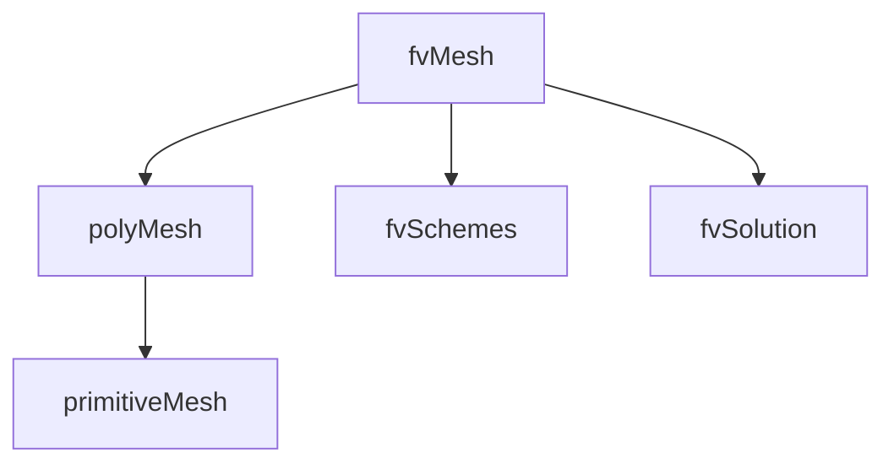

# fvMesh Class

fvMesh Class Reference

---

## Overview

> **fvMesh** = Finite Volume mesh with discretization support



---

## 1. Creation

```cpp
// Standard creation
#include "createMesh.H"

// Or explicit
fvMesh mesh
(
    IOobject
    (
        fvMesh::defaultRegion,
        runTime.timeName(),
        runTime,
        IOobject::MUST_READ
    )
);
```

---

## 2. Geometry Access

### Cell Data

```cpp
// Cell centers (volVectorField)
const volVectorField& C = mesh.C();
vector center = C[cellI];

// Cell volumes (volScalarField)
const volScalarField& V = mesh.V();
scalar vol = V[cellI];
```

### Face Data

```cpp
// Face area vectors (surfaceVectorField)
const surfaceVectorField& Sf = mesh.Sf();

// Face area magnitudes
const surfaceScalarField& magSf = mesh.magSf();

// Face centers
const surfaceVectorField& Cf = mesh.Cf();
```

---

## 3. Connectivity

```cpp
// Face owner/neighbour
const labelList& owner = mesh.faceOwner();
const labelList& neighbour = mesh.faceNeighbour();

// Cell-cell distance
const surfaceScalarField& delta = mesh.delta();
```

---

## 4. Boundary Access

```cpp
const fvBoundaryMesh& boundary = mesh.boundary();

// Iterate patches
forAll(boundary, patchI)
{
    const fvPatch& patch = boundary[patchI];
    
    // Patch properties
    word name = patch.name();
    word type = patch.type();
    label nFaces = patch.size();
    label startFace = patch.start();
}

// Find by name
label inletI = mesh.boundaryMesh().findPatchID("inlet");
```

---

## 5. Schemes and Solution

```cpp
// Access fvSchemes
const fvSchemes& schemes = mesh.schemesDict();

// Access fvSolution
const fvSolution& solution = mesh.solutionDict();
```

---

## 6. Object Registry

```cpp
// fvMesh is also an objectRegistry
const volScalarField& p = mesh.lookupObject<volScalarField>("p");

// Check if field exists
if (mesh.foundObject<volScalarField>("T"))
{
    const volScalarField& T = mesh.lookupObject<volScalarField>("T");
}
```

---

## 7. Mesh Motion

```cpp
// Move points
mesh.movePoints(newPoints);

// Update after topology change
mesh.updateMesh(topoChange);
```

---

## Quick Reference

| Method | Returns | Type |
|--------|---------|------|
| `C()` | Cell centers | volVectorField |
| `V()` | Cell volumes | DimensionedField |
| `Sf()` | Face areas | surfaceVectorField |
| `magSf()` | Face area mags | surfaceScalarField |
| `Cf()` | Face centers | surfaceVectorField |
| `boundary()` | Patches | fvBoundaryMesh |

---

## Concept Check

<details>
<summary><b>1. fvMesh มีอะไรเพิ่มจาก polyMesh?</b></summary>

**FV discretization** support: Sf, magSf, delta, schemes, solution
</details>

<details>
<summary><b>2. mesh.C() return type คืออะไร?</b></summary>

**volVectorField** — cell centers as volume field
</details>

<details>
<summary><b>3. หา patch by name อย่างไร?</b></summary>

```cpp
label patchI = mesh.boundaryMesh().findPatchID("name");
```
</details>

---

## Related Documents

- **ภาพรวม:** [00_Overview.md](00_Overview.md)
- **polyMesh:** [04_polyMesh.md](04_polyMesh.md)
