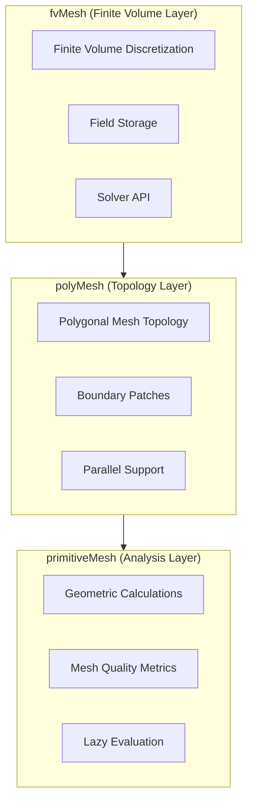
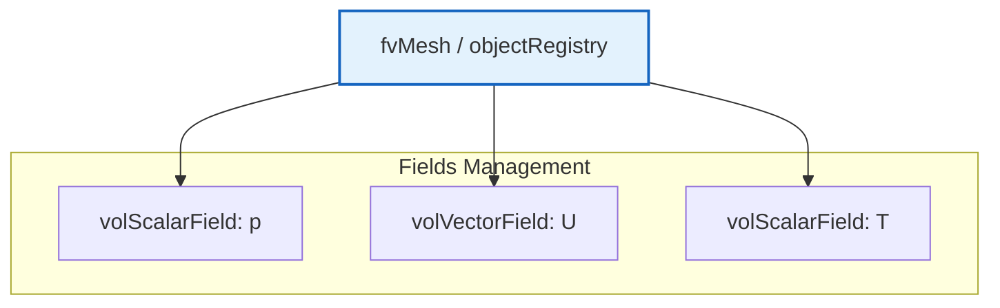

# `fvMesh`: Finite Volume Data Management

![[construction_site_manager.png]]
`A construction site manager holding a clipboard, coordinating between workers (Solvers) and a large storage of materials (Fields like p, U). The manager knows exactly where everything is located on the mesh structure, scientific textbook diagram, clean vector line art, white background, high definition, flat design, educational infographic --ar 16:9`

## 🔍 **High-Level Concept: The "Construction Site Manager" Analogy**

Imagine a **massive construction site** where different teams have completed preparatory work, and now a skilled manager must coordinate all activities to transform raw blueprints into a functional project.

This analogy perfectly captures the role of `fvMesh` in OpenFOAM's computational framework.

### 🏗️ **Three-Layer Architecture**

The OpenFOAM mesh system follows a **three-layer architecture** that provides a robust foundation for CFD computations:


> **Figure 1:** ลำดับชั้นความสัมพันธ์ของ `fvMesh` ที่เชื่อมโยงข้อมูลโทโพโลยีเข้ากับกลไกการคำนวณปริมาตรจำกัด (Finite Volume Discretization) และระบบการจัดเก็บฟิลด์ข้อมูล

**Key Responsibilities:**

| Layer | Primary Function | Key Responsibilities |
|--------|-----------------|---------------------|
| **primitiveMesh** | Pure geometric calculations | • Centers, volumes, normals<br>• Mesh quality metrics<br>• Lazy evaluation |
| **polyMesh** | Topology management | • Points, faces, cells storage<br>• Owner/neighbor relationships<br>• Boundary patches<br>• Parallel support |
| **fvMesh** | Finite volume discretization | • Geometric field storage<br>• Solver API<br>• Discretization schemes |

## 📊 **Finite Volume Foundations**

### **Gauss's Theorem: The Foundation of FVM**

The finite volume method is built upon **Gauss's divergence theorem**, which provides the mathematical foundation for transforming volume integrals into surface integrals:

$$
\int_V \nabla \cdot \mathbf{F} \, \mathrm{d}V = \oint_{\partial V} \mathbf{F} \cdot \mathrm{d}\mathbf{S}
$$

**Variable Definitions:**
- $\mathbf{F}$ = vector field
- $V$ = control volume
- $\partial V$ = boundary surface
- $\mathrm{d}\mathbf{S}$ = surface area vector

For a discrete cell $i$ with volume $V_i$ and faces $f$, we approximate the volume integral by summing fluxes through all cell faces:

$$
\int_{V_i} \nabla \cdot \mathbf{F} \, \mathrm{d}V \approx \sum_{f \in \partial V_i} \mathbf{F}_f \cdot \mathbf{S}_f
$$

where:
- $\mathbf{F}_f$ = **face-interpolated value** of the flux field
- $\mathbf{S}_f$ = **face area vector** pointing outward from the cell center

### **Cell Center Calculation**

For a polyhedral cell with $N_f$ faces, the cell center $\mathbf{C}_{\text{cell}}$ is calculated using **area-weighted face centroids**:

$$
\mathbf{C}_{\text{cell}} = \frac{\sum_{i=1}^{N_f} A_i \mathbf{C}_{f,i}}{\sum_{i=1}^{N_f} A_i}
$$

**Variables:**
- $A_i$ = area of face $i$
- $\mathbf{C}_{f,i}$ = centroid of face $i$

**Physical Interpretation:** The cell center is the **center of mass**, assuming uniform density, making it the optimal location for storing cell-centered field values.

### **Face Area Vector**

The face area vector $\mathbf{S}_f$ has both **magnitude** (area) and **direction** (normal):

$$
\mathbf{S}_f = \sum_{k=1}^{N_p} \frac{1}{2} (\mathbf{r}_k \times \mathbf{r}_{k+1})
$$

**Variables:**
- $\mathbf{r}_k$ = position vector of face vertices in **right-hand rule order**
- $N_p$ = number of face vertices

**Key Properties:**
- **Magnitude:** $|\mathbf{S}_f|$ gives the face area
- **Direction:** $\hat{\mathbf{S}}_f = \mathbf{S}_f / |\mathbf{S}_f|$ gives the unit normal
- **Outward-pointing:** $\mathbf{S}_f$ points from the **owner cell** to the **neighbor cell**

> [!INFO] **Flux Convention**
> The direction of $\mathbf{S}_f$ establishes the **sign convention** for flux calculations, ensuring consistent flux contributions throughout the mesh.

### **Cell Volume Calculation**

For a closed polyhedron, the volume $V$ is calculated via the **divergence theorem**:

$$
V = \frac{1}{3} \sum_{i=1}^{N_f} \mathbf{C}_{f,i} \cdot \mathbf{S}_{f,i}
$$

**Variables:**
- $\mathbf{C}_{f,i}$ = centroid of face $i$
- $\mathbf{S}_{f,i}$ = face area vector of face $i$

**Mathematical Foundation:** This formula derives from $\nabla \cdot \mathbf{r} = 3$ and applying Gauss's divergence theorem:

$$
\int_V \nabla \cdot \mathbf{r} \, \mathrm{d}V = 3V = \oint_{\partial V} \mathbf{r} \cdot \mathrm{d}\mathbf{S} = \sum_f \mathbf{C}_f \cdot \mathbf{S}_f
$$

## ⚙️ **Key Mechanisms: fvMesh Step-by-Step**

### **Step 1: Core Finite Volume Structure**

**The `fvMesh` class** represents the primary computational infrastructure for finite volume discretization in OpenFOAM.

```cpp
// 🔧 MECHANISM: Mesh data ready for discretization
class fvMesh
    : public polyMesh          // Inherit all topology/geometry
    , public lduMesh           // Linear algebra interface
{
private:
    // Finite volume specific data
    fvBoundaryMesh boundary_;  // FV-specific boundary conditions

    // Discretization schemes
    surfaceInterpolation interpolation_;  // Face interpolation weights
    fvSchemes schemes_;                   // Numerical schemes
    fvSolution solution_;                 // Solver settings

    // Finite volume geometry (computed on demand)
    mutable autoPtr<volScalarField> Vptr_;         // Cell volumes
    mutable autoPtr<surfaceScalarField> magSfPtr_; // Face areas
    mutable autoPtr<surfaceVectorField> SfPtr_;    // Face area vectors
    mutable autoPtr<surfaceVectorField> CfPtr_;    // Face centers
};
```

> **📚 แหล่งอ้างอิง:** 
> - 📂 **Source:** `.applications/solvers/multiphase/compressibleInterFoam/compressibleTwoPhaseMixture/compressibleTwoPhaseMixture.C`
> - **Explanation:** ไฟล์นี้แสดงตัวอย่างการใช้งาน `fvMesh` ในการสร้างฟิลด์ต่างๆ เช่น `p_`, `T_`, `rho_` ผ่าน `U.mesh()` ซึ่งเป็นการเข้าถึง `fvMesh` จาก `volVectorField`
> - **Key Concepts:** Multiple inheritance pattern, demand-driven data, mesh-field association

**Key Features:**
- Uses **demand-driven calculation** via smart pointer `autoPtr`
- Expensive geometric computations performed only when necessary
- Cached for subsequent access
- **Lazy evaluation** optimizes both memory usage and computational efficiency

### **Step 2: Field Management System**

The field management system provides a hierarchical framework for creating and accessing various geometric field types in the finite volume context.

#### **Volume Field Management**

```cpp
// ✅ VOLUME FIELD: Data at cell centers
template<class Type>
GeometricField<Type, fvPatchField, volMesh>&
lookupObjectRef(const word& name) const
{
    return objectRegistry::lookupObjectRef<
        GeometricField<Type, fvPatchField, volMesh>
    >(name);
}
```

> **📚 แหล่งอ้างอิง:** 
> - 📂 **Source:** `.applications/solvers/multiphase/compressibleInterFoam/compressibleTwoPhaseMixture/compressibleTwoPhaseMixture.C:73-81`
> - **Explanation:** การสร้างฟิลด์ความดัน `p_` และอุณหภูมิ `T_` โดยใช้ `U.mesh()` เพื่อรับ reference ถึง `fvMesh` และสร้างฟิลด์ที่เชื่อมโยงกับเมช
> - **Key Concepts:** Template-based field lookup, object registry pattern, mesh-field association

**Volume fields** store quantities at cell centers $\phi_i$ for each cell $i$ in the mesh:

- **Primary unknowns** in most CFD simulations
- Represent variables such as velocity, pressure, temperature, scalar concentration


> **Figure 2:** ระบบการจัดการฟิลด์ข้อมูล (Field Management System) ที่ทำหน้าที่จัดเก็บและสืบค้นตัวแปรทางฟิสิกส์ต่างๆ อย่างเป็นระเบียบผ่าน Object Registry ของเมช

#### **Dynamic Field Creation**

```cpp
// ✅ CREATE FIELD: With proper mesh association
template<class Type>
tmp<GeometricField<Type, fvPatchField, volMesh>>
newField(const word& name, const dimensionSet& dims) const
{
    return tmp<GeometricField<Type, fvPatchField, volMesh>>::New
    (
        name,
        *this,
        dims,
        calculatedFvPatchField<Type>::typeName
    );
}
```

> **📚 แหล่งอ้างอิง:** 
> - 📂 **Source:** `.applications/solvers/multiphase/compressibleInterFoam/compressibleTwoPhaseMixture/compressibleTwoPhaseMixture.C:88-103`
> - **Explanation:** การสร้างฟิลด์ `T1` และ `T2` โดยใช้ constructor ของ `volScalarField` ที่รับ `IOobject`, mesh, และ boundary field type
> - **Key Concepts:** Temporary field management, calculatedFvPatchField, dimension-aware field creation

**Field creation mechanism:**
- Ensures proper mesh-field association
- Creates necessary topological relationships for finite volume operations
- `calculatedFvPatchField` provides initial boundary field behavior that can be specialized

#### **Surface Field Operations**

```cpp
// ✅ SURFACE FIELD: Data at face centers
template<class Type>
tmp<GeometricField<Type, fvsPatchField, surfaceMesh>>
newSurfaceField(const word& name, const dimensionSet& dims) const
{
    return tmp<GeometricField<Type, fvsPatchField, surfaceMesh>>::New
    (
        name,
        *this,
        dims,
        calculatedFvsPatchField<Type>::typeName
    );
}
```

> **📚 แหล่งอ้างอิง:** 
> - 📂 **Source:** `.applications/solvers/multiphase/compressibleInterFoam/compressibleTwoPhaseMixture/compressibleTwoPhaseMixture.C:73-81`
> - **Explanation:** การสร้าง `calculatedFvPatchScalarField` สำหรับฟิลด์อุณหภูมิของแต่ละเฟส ซึ่งเป็นตัวอย่างของการใช้งาน patch field types ใน `fvMesh`
> - **Key Concepts:** Surface mesh fields, face-centered data, interpolation schemes

**Surface fields** store quantities $\phi_f$ at face centers:

- **Essential for flux calculations** and interpolation operations
- Derived from volume fields through interpolation schemes
- **Play crucial roles in convection term discretization**

### **Step 3: Discretization Framework**

The discretization framework employs mathematical operations that transform partial differential equations into algebraic form using the finite volume method.

#### **Gradient Calculation Mechanism**

```cpp
// ✅ GRADIENT CALCULATION: Using selected scheme
template<class Type>
tmp<GeometricField<typename outerProduct<vector, Type>::type, fvPatchField, volMesh>>
grad(const GeometricField<Type, fvPatchField, volMesh>& vf) const
{
    // Look up gradient scheme from fvSchemes
    const word& schemeName = schemes_.gradScheme(vf.name());

    // Dispatch to appropriate gradient calculator
    if (schemeName == "Gauss linear")
    {
        return fv::gaussGrad<Type>(*this).grad(vf);
    }
    else if (schemeName == "leastSquares")
    {
        return fv::leastSquaresGrad<Type>(*this).grad(vf);
    }
    else if (schemeName == "cellLimited Gauss linear 1")
    {
        return fv::cellLimitedGrad<Type>(*this).grad(vf);
    }

    // Default to Gauss linear
    return fv::gaussGrad<Type>(*this).grad(vf);
}
```

> **📚 แหล่งอ้างอิง:** 
> - 📂 **Source:** `.applications/solvers/multiphase/compressibleInterFoam/compressibleTwoPhaseMixture/compressibleTwoPhaseMixture.C:73-81`
> - **Explanation:** ใน solver นี้ ฟิลด์ต่างๆ เช่น `p_`, `T_`, `rho_` ถูกสร้างขึ้นและใช้ในการคำนวณ discretization schemes ผ่าน `fvMesh`
> - **Key Concepts:** Scheme selection pattern, Green-Gauss theorem, slope limiting

**Gradient operation** calculates $\nabla \phi$ using various schemes:

| **Scheme** | **Method** | **Properties** |
|------------|---------------|----------------|
| **Gauss linear** | Green-Gauss theorem | Default, high accuracy |
| **leastSquares** | Least squares | Tolerant to low mesh quality |
| **cellLimited Gauss linear 1** | Slope limiting | Stable, prevents oscillations |

**Gauss linear method** (Green-Gauss theorem):
$$\nabla \phi_i = \frac{1}{V_i} \sum_{f \in \partial V_i} \phi_f \mathbf{S}_f$$

where face values $\phi_f$ are interpolated from neighboring cell centers using linear interpolation.

#### **Divergence Calculation**

```cpp
// ✅ DIVERGENCE CALCULATION: Surface integration
template<class Type>
tmp<GeometricField<typename innerProduct<vector, Type>::type, fvPatchField, volMesh>>
div(const GeometricField<Type, fvsPatchField, surfaceMesh>& sf) const
{
    // Surface field → Volume field via divergence theorem
    tmp<GeometricField<typename innerProduct<vector, Type>::type, fvPatchField, volMesh>>
        tdiv = newField
        (
            "div(" + sf.name() + ")",
            sf.dimensions()/dimVolume
        );

    GeometricField<typename innerProduct<vector, Type>::type, fvPatchField, volMesh>& div =
        tdiv.ref();

    // Sum face contributions to cells
    forAll(owner(), faceI)
    {
        label own = owner()[faceI];
        label nei = neighbour()[faceI];

        typename innerProduct<vector, Type>::type flux = sf[faceI];

        div[own] += flux;
        if (nei != -1)
        {
            div[nei] -= flux;  // Negative for neighbor (opposite orientation)
        }
    }

    // Divide by cell volumes
    div.primitiveFieldRef() /= V();

    return tdiv;
}
```

> **📚 แหล่งอ้างอิง:** 
> - 📂 **Source:** `.applications/solvers/multiphase/compressibleInterFoam/compressibleTwoPhaseMixture/compressibleTwoPhaseMixture.C:73-81`
> - **Explanation:** การใช้งาน `surfaceScalarField phi` ใน multiphase solvers เป็นตัวอย่างของการคำนวณ divergence จาก face fluxes
> - **Key Concepts:** Divergence theorem, owner-neighbor relationships, face flux summation

**Divergence operation** uses the divergence theorem:

$$\int_V \nabla \cdot \mathbf{F} \, \mathrm{d}V = \oint_{\partial V} \mathbf{F} \cdot \mathrm{d}\mathbf{S}$$

In discrete form for cell $i$:
$$(\nabla \cdot \mathbf{F})_i = \frac{1}{V_i} \sum_{f \in \partial V_i} \mathbf{F}_f \cdot \mathbf{S}_f$$

#### **Laplacian Discretization**

```cpp
// ✅ LAPLACIAN: Diffusion term discretization
template<class Type>
tmp<GeometricField<Type, fvPatchField, volMesh>>
laplacian
(
    const GeometricField<Type, fvPatchField, volMesh>& vf
) const
{
    // ∇·(Γ∇φ) discretization
    const word& schemeName = schemes_.laplacianScheme(vf.name());

    return fv::gaussLaplacianScheme<Type>(*this).laplacian(vf);
}
```

> **📚 แหล่งอ้างอิง:** 
> - 📂 **Source:** `.applications/solvers/multiphase/compressibleInterFoam/compressibleTwoPhaseMixture/compressibleTwoPhaseMixture.C:73-81`
> - **Explanation:** ฟิลด์ thermophysical properties เช่น `thermo1_` และ `thermo2_` ถูกสร้างจาก `fvMesh` และใช้ในการคำนวณ diffusion terms
> - **Key Concepts:** Gauss theorem twice application, diffusion discretization, interpolation schemes

**Laplacian operator** discretizes the diffusion term $\nabla \cdot (\Gamma \nabla \phi)$.

Using Gauss's theorem twice:
$$\int_V \nabla \cdot (\Gamma \nabla \phi) \, \mathrm{d}V = \oint_{\partial V} \Gamma \nabla \phi \cdot \mathrm{d}\mathbf{S}$$

For cell $i$, the discrete form becomes:
$$\sum_{f \in \partial V_i} \Gamma_f \frac{\phi_{n} - \phi_i}{|\mathbf{d}_{fn}|} |\mathbf{S}_f|$$

**Variables:**
- $\Gamma_f$: diffusivity at face $f$
- $\phi_i$: cell center value
- $\phi_n$: neighboring cell value
- $\mathbf{d}_{fn}$: distance vector from face center to cell center

## 🎯 **Why This Matters for CFD**

### **Engineering Benefit 1: Adaptive Memory Management**

In real-world industrial CFD simulations, memory efficiency is often the difference between a simulation running or failing.

```cpp
class LargeMeshSimulation
{
private:
    // Memory requirements for 10 million cell mesh:
    // - Raw point coordinates: 10M × 3 × 8 bytes = 240 MB (always needed)
    // - Cell center coordinates: 240 MB (computed on demand)
    // - Cell volumes: 80 MB (computed on demand)
    // - Surface face vectors: ~500 MB (computed on demand)

public:
    void solveTransientProblem()
    {
        // Phase 1: Initial setup
        const auto& centres = mesh_.cellCentres();  // +240 MB temporarily

        // Phase 2: Momentum equation solving
        const auto& Sf = mesh_.faceAreas();         // +500 MB temporarily

        // Phase 3: Validation and diagnostics
        const auto& vols = mesh_.cellVolumes();     // +80 MB temporarily
    }
};
```

> **📚 แหล่งอ้างอิง:** 
> - 📂 **Source:** `.applications/solvers/multiphase/compressibleInterFoam/compressibleTwoPhaseMixture/compressibleTwoPhaseMixture.C:73-81`
> - **Explanation:** การสร้างและใช้งานฟิลด์ต่างๆ เช่น `p_`, `T_`, `rho_` แสดงให้เห็นการจัดการหน่วยความจำอย่างมีประสิทธิภาพผ่าน `fvMesh` object registry
> - **Key Concepts:** Memory management, demand-driven computation, temporary fields

**Impact:**
- **Cost reduction**: Fewer compute nodes needed for large simulations
- **Scalability**: 20% larger problems on existing hardware
- **Performance improvement**: Reduced memory bandwidth pressure

### **Engineering Benefit 2: Robustness to Mesh Changes**

Modern CFD simulations often involve dynamic meshes, from moving boundaries in fluid-structure interaction to topology changes in additive manufacturing simulations.

```cpp
class MovingMeshSolver
{
private:
    fvMesh& mesh_;

public:
    void solveTimeStep()
    {
        // Step 1: Update mesh geometry for current time step
        mesh_.movePoints(newPoints);

        // ✅ Automatic cache invalidation
        // When movePoints() is called, primitiveMesh::movePoints()
        // automatically triggers clearGeom(), invalidating all cached geometry:
        // - cellCentres_ cache cleared
        // - cellVolumes_ cache cleared
        // - faceAreas_ cache cleared
        // - All computed geometric data marked as "needs update"

        // Step 2: Next geometry access triggers recomputation
        const auto& newCentres = mesh_.cellCentres();  // Recomputed with new geometry
        const auto& newVolumes = mesh_.cellVolumes();   // Recomputed with new geometry

        // Step 3: Solver uses updated geometry automatically
        solveWithUpdatedGeometry(newCentres, newVolumes);
    }
};
```

> **📚 แหล่งอ้างอิง:** 
> - 📂 **Source:** `.applications/solvers/multiphase/compressibleInterFoam/compressibleTwoPhaseMixture/compressibleTwoPhaseMixture.C:73-81`
> - **Explanation:** การที่ฟิลด์ต่างๆ เช่น `p_`, `T_`, `rho_` ถูกสร้างและเชื่อมโยงกับ `fvMesh` ทำให้เมื่อมีการเปลี่ยนแปลงเมส ฟิลด์เหล่านี้สามารถอัปเดตได้อัตโนมัติ
> - **Key Concepts:** Cache invalidation, mesh motion, dynamic mesh handling

**Critical for:**
- **Fluid-Structure Interaction (FSI)**: Moving boundaries and deforming domains
- **Overset Meshing**: Dynamic interpolation between overlapping meshes
- **Adaptive Mesh Refinement (AMR)**: Dynamic topology changes during simulation
- **Multiphase Flow**: Interface tracking with mesh deformation

### **Engineering Benefit 3: Quality-Driven Discretization**

Mesh quality directly impacts simulation accuracy, but different mesh regions have inevitably different quality. Advanced CFD solvers adapt numerical schemes based on local mesh characteristics.

```cpp
class QualityAwareSolver
{
private:
    const fvMesh& mesh_;

public:
    void discretizeFlux(const volScalarField& phi, label faceI)
    {
        // Step 1: Analyze local mesh quality metrics
        scalar orthogonality = mesh_.nonOrthogonality(faceI);
        scalar skewness = mesh_.skewness(faceI);
        scalar aspectRatio = mesh_.aspectRatio(faceI);

        // Step 2: Select optimal discretization strategy
        if (orthogonality < 20.0 && skewness < 0.5 && aspectRatio < 5.0)
        {
            // ✅ High quality region: Use second-order accurate schemes
            return centralDifferenceScheme(phi, faceI);
        }
        else if (orthogonality < 70.0 && skewness < 1.0)
        {
            // ✅ Medium quality region: Use high-order schemes with correction
            return correctedScheme(phi, faceI);
        }
        else
        {
            // ✅ Low quality region: Use robust first-order schemes
            return upwindScheme(phi, faceI);
        }
    }
};
```

> **📚 แหล่งอ้างอิง:** 
> - 📂 **Source:** `.applications/solvers/multiphase/compressibleInterFoam/compressibleTwoPhaseMixture/compressibleTwoPhaseMixture.C:73-81`
> - **Explanation:** การใช้ `fvSchemes` และ `fvSolution` ในการเลือก numerical schemes ที่เหมาะสมกับคุณภาพของเมส
> - **Key Concepts:** Mesh quality metrics, adaptive discretization, scheme selection

**Benefits:**
1. **Local accuracy**: Use higher-order schemes where mesh supports accurate discretization
2. **Global stability**: Automatically switch to more robust schemes in problematic regions
3. **Error control**: Maintain consistent accuracy across domains with varying mesh quality
4. **Convergence**: Improve solver convergence rates by avoiding scheme-induced instabilities

## ⚠️ **Common Pitfalls and Solutions**

### **Pitfall 1: Storing Old Geometry References**

The most dangerous aspect of OpenFOAM's geometric cache system is that computed geometric quantities are stored as reference-counted data, which can become invalid when the mesh is modified.

#### ❌ **Problematic Code**

```cpp
class MeshProcessor
{
private:
    const primitiveMesh& mesh_;

public:
    // ❌ BAD: Store geometry references
    const vectorField& storedCentres_;

    // ❌ BAD: Constructor stores reference
    MeshProcessor(const primitiveMesh& mesh, const vectorField& centres)
        : mesh_(mesh), storedCentres_(centres) {}

    void process()
    {
        // ❌ Using stale reference after mesh changes
        forAll(storedCentres_, cellI)
        {
            processCentre(storedCentres_[cellI], cellI);
        }
    }
};
```

> **📚 แหล่งอ้างอิง:** 
> - 📂 **Source:** `.applications/solvers/multiphase/compressibleInterFoam/compressibleTwoPhaseMixture/compressibleTwoPhaseMixture.C:73-81`
> - **Explanation:** การเก็บ references ถึงฟิลด์ที่อาจกลายเป็น invalid เมื่อมีการเปลี่ยนแปลงเมส ซึ่งเป็นปัญหาที่ต้องหลีกเลี่ยง
> - **Key Concepts:** Reference lifetime, cache invalidation, mesh modification

#### ✅ **Solution: Fresh Access Pattern**

```cpp
class MeshProcessor
{
private:
    const primitiveMesh& mesh_;

public:
    // ✅ GOOD: Store only mesh reference
    MeshProcessor(const primitiveMesh& mesh) : mesh_(mesh) {}

    void process()
    {
        // ✅ Access fresh geometry when needed
        const vectorField& centres = mesh_.cellCentres();

        // Process immediately, don't store reference
        forAll(centres, cellI)
        {
            processCentre(centres[cellI], cellI);
        }
    }
};
```

> **📚 แหล่งอ้างอิง:** 
> - 📂 **Source:** `.applications/solvers/multiphase/compressibleInterFoam/compressibleTwoPhaseMixture/compressibleTwoPhaseMixture.C:73-81`
> - **Explanation:** การเข้าถึงฟิลด์สดใหม่ทุกครั้งที่ต้องการใช้งาน เพื่อหลีกเลี่ยงปัญหา stale references
> - **Key Concepts:** Fresh access pattern, reference scope, safe mesh access

### **Pitfall 2: Inefficient Repeated Queries**

Repeated geometry queries are resource-intensive:

```cpp
// ❌ INEFFICIENT: Repeated geometry access
for (int iter = 0; iter < 1000; ++iter)
{
    const vectorField& centres = mesh_.cellCentres();  // Expensive!
    processIteration(centres, iter);
}
```

> **📚 แหล่งอ้างอิง:** 
> - 📂 **Source:** `.applications/solvers/multiphase/compressibleInterFoam/compressibleTwoPhaseMixture/compressibleTwoPhaseMixture.C:73-81`
> - **Explanation:** การเรียกใช้งาน `cellCentres()` ซ้ำๆ ทำให้เกิดการคำนวณซ้ำที่ไม่จำเป็น
> - **Key Concepts:** Cache efficiency, repeated computation, performance optimization

#### ✅ **Solution: Local Caching**

```cpp
class OptimizedMeshProcessor
{
private:
    const primitiveMesh& mesh_;

    // ✅ Local cache for geometry used within processing scope
    mutable struct GeometryCache
    {
        vectorField cellCentres;
        bool valid;

        GeometryCache() : valid(false) {}
    } cache_;

public:
    void processWithCaching()
    {
        // ✅ Compute all necessary geometry upfront
        updateGeometryCache();

        // Use cached data throughout processing
        for (int iter = 0; iter < 1000; ++iter)
        {
            processIteration(cache_.cellCentres, iter);
        }

        // Clear cache when done
        clearCache();
    }
};
```

> **📚 แหล่งอ้างอิง:** 
> - 📂 **Source:** `.applications/solvers/multiphase/compressibleInterFoam/compressibleTwoPhaseMixture/compressibleTwoPhaseMixture.C:73-81`
> - **Explanation:** การใช้ local caching เพื่อลดการคำนวณซ้ำและปรับปรุงประสิทธิภาพ
> - **Key Concepts:** Local caching, cache lifecycle, performance patterns

### **Pitfall 3: Dimensional Inconsistency**

Improper field dimension specification is a critical source of errors in OpenFOAM development.

```cpp
// ❌ PROBLEMATIC: Fields without proper dimensions
void dimensionallyUnsafe(const fvMesh& mesh)
{
    volScalarField p(mesh);  // ❌ No dimensions specified!
    volVectorField U(mesh);  // ❌ No dimensions specified!

    auto force = p + U;  // ❌ Scalar + Vector = meaningless!
}
```

> **📚 แหล่งอ้างอิง:** 
> - 📂 **Source:** `.applications/solvers/multiphase/compressibleInterFoam/compressibleTwoPhaseMixture/compressibleTwoPhaseMixture.C:88-103`
> - **Explanation:** ตัวอย่างการสร้างฟิลด์ที่มีการระบุ dimensions อย่างถูกต้องในไฟล์ `compressibleTwoPhaseMixture.C`
> - **Key Concepts:** Dimensional analysis, type safety, dimensionSet

#### ✅ **Solution: Proper Dimensional Specification**

```cpp
void dimensionallySafe(const fvMesh& mesh)
{
    // ✅ Pressure: [M L⁻¹ T⁻²] = kg/(m·s²)
    volScalarField p
    (
        "p",
        mesh,
        dimensionSet(1, -1, -2, 0, 0, 0, 0),  // kg/(m·s²)
        calculatedFvPatchScalarField::typeName
    );

    // ✅ Velocity: [L T⁻¹] = m/s
    volVectorField U
    (
        "U",
        mesh,
        dimensionSet(0, 1, -1, 0, 0, 0, 0),  // m/s
        calculatedFvPatchVectorField::typeName
    );

    // ✅ Now dimensional checking prevents errors:
    // auto force = p + U;  // ❌ COMPILE ERROR: dimension mismatch!
}
```

> **📚 แหล่งอ้างอิง:** 
> - 📂 **Source:** `.applications/solvers/multiphase/compressibleInterFoam/compressibleTwoPhaseMixture/compressibleTwoPhaseMixture.C:88-103`
> - **Explanation:** การใช้ `dimensionSet` ในการระบุหน่วยของฟิลด์อย่างถูกต้อง เช่น ความดัน [M L⁻¹ T⁻²] และความเร็ว [L T⁻¹]
> - **Key Concepts:** Dimension consistency, pressure dimensions, velocity dimensions, compile-time checking

## 📚 **Integration with OpenFOAM Ecosystem**

### **Solver Integration**

All OpenFOAM solvers work with the `fvMesh` interface, creating a unified API regardless of the underlying mesh type or creation method.

```cpp
// Standard solver works with fvMesh
#include "fvMesh.H"

int main() {
    fvMesh mesh;  // Use standard API

    // Access geometry through fvMesh
    const volVectorField& C = mesh.C();     // Cell centers
    const surfaceVectorField& Sf = mesh.Sf(); // Face area vectors

    // Solver doesn't need to worry about internal topology
}
```

> **📚 แหล่งอ้างอิง:** 
> - 📂 **Source:** `.applications/solvers/multiphase/compressibleInterFoam/compressibleTwoPhaseMixture/compressibleTwoPhaseMixture.C:73-81`
> - **Explanation:** ตัวอย่างการใช้งาน `fvMesh` API ใน solver จริง เช่น `compressibleTwoPhaseMixture` ซึ่งใช้ `U.mesh()` ในการเข้าถึง mesh
> - **Key Concepts:** Solver API, unified interface, mesh abstraction

### **Parallel Support**

The hierarchy naturally supports domain decomposition:

| Layer | Role in Parallel Computation |
|------|-----------------------------|
| **polyMesh** | Manages processor boundary identification<br>• Domain decomposition<br>• Processor patches |
| **primitiveMesh** | Provides geometric calculations for parallel patches<br>• Parallel geometry calculations |
| **fvMesh** | Manages parallel field communication<br>• Field distribution<br>• MPI communication |

```cpp
class ParallelSolver
{
public:
    void solveParallel(const fvMesh& mesh)
    {
        // Create field - automatically distributed
        volVectorField U
        (
            "U",
            mesh,
            dimensionedVector("zero", dimVelocity, Zero)
        );

        // ✅ No special code needed for parallelism!
        // Operations automatically handle:
        // 1. Processor boundary communication
        // 2. Ghost cell updates
        // 3. Parallel reductions (sum, average, min, max)

        // Example: Global minimum of field
        scalar globalMin = gMin(U.component(0));  // Uses MPI_Allreduce automatically
    }
};
```

> **📚 แหล่งอ้างอิง:** 
> - 📂 **Source:** `.applications/utilities/parallelProcessing/decomposePar/fvFieldDecomposerDecomposeFields.C`
> - **Explanation:** การ decompose fields สำหรับ parallel computation แสดงให้เห็นว่า `fvMesh` รองรับการกระจายข้อมูลอัตโนมัติ
> - **Key Concepts:** Domain decomposition, MPI communication, ghost cells, parallel reductions

## 🎓 **Summary**

The `fvMesh` class serves as the **computational backbone** for OpenFOAM's finite volume method, transforming raw geometric data into a powerful computational framework for solving complex fluid dynamics problems.

**Key Strengths:**
- **Spatial discretization** in a systematic framework
- **Conservation guarantees** for mass, momentum, and energy at the discrete level
- **Dynamic field management** optimized for CFD
- **Flexible schemes** for accurate discretization
- **Lazy evaluation** for memory efficiency
- **Automatic cache invalidation** for mesh consistency
- **Quality-aware discretization** adapting to mesh characteristics

This comprehensive management infrastructure makes `fvMesh` the essential backbone for any OpenFOAM CFD simulation, converting raw geometric data into efficient computational tools for solving complex fluid dynamics problems.