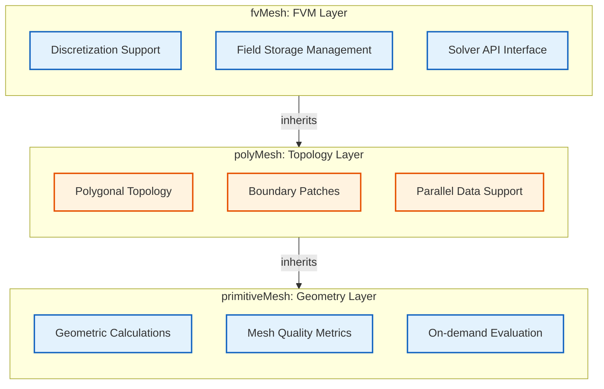
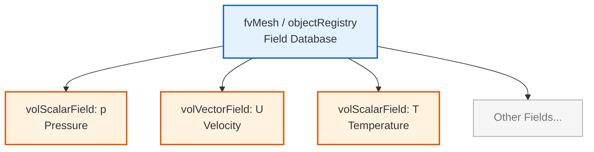

# `fvMesh`: การจัดการข้อมูลสำหรับวิธีไฟไนต์วอลุ่ม (Finite Volume Data Management)

![[construction_site_manager.png]]
`A construction site manager holding a clipboard, coordinating between workers (Solvers) and a large storage of materials (Fields like p, U). The manager knows exactly where everything is located on the mesh structure, scientific textbook diagram, clean vector line art, white background, high definition, flat design, educational infographic --ar 16:9`

## 🔍 **แนวคิดระดับสูง: การอุปมา "ผู้จัดการหน้างานก่อสร้าง"**

ลองจินตนาการถึง **หน้างานก่อสร้างขนาดมหึมา** ที่ทีมงานต่างๆ ได้เตรียมงานเบื้องต้นเสร็จแล้ว และตอนนี้ต้องการผู้จัดการที่มีทักษะในการประสานงานกิจกรรมทั้งหมดเพื่อเปลี่ยนพิมพ์เขียวดิบให้กลายเป็นโครงการที่ใช้งานได้จริง

การอุปมานี้สะท้อนถึงบทบาทของ `fvMesh` ในกรอบการทำงานเชิงคำนวณของ OpenFOAM ได้อย่างสมบูรณ์แบบ

### 🏗️ **สถาปัตยกรรมสามชั้น (Three-Layer Architecture)**

ระบบเมชของ OpenFOAM เป็นไปตาม **สถาปัตยกรรมสามชั้น** ที่ให้รากฐานที่มั่นคงสำหรับการคำนวณ CFD:


> **รูปที่ 1:** ลำดับชั้นความสัมพันธ์ของ `fvMesh` ที่เชื่อมโยงข้อมูลโทโพโลยีเข้ากับกลไกการคำนวณปริมาตรจำกัด (Finite Volume Discretization) และระบบการจัดเก็บสนามข้อมูล (Field Storage System)

**ความรับผิดชอบหลัก (Key Responsibilities):**

| ชั้น | หน้าที่หลัก | ความรับผิดชอบสำคัญ |
|--------|-----------------|---------------------|
| **primitiveMesh** | การคำนวณทางเรขาคณิตบริสุทธิ์ | • จุดศูนย์กลาง, ปริมาตร, เวกเตอร์แนวฉาก<br>• ตัวชี้วัดคุณภาพเมช<br>• การคำนวณเมื่อต้องการ (Lazy evaluation) |
| **polyMesh** | การจัดการโทโพโลยี | • จัดเก็บจุด, หน้า, เซลล์<br>• ความสัมพันธ์เจ้าของ/เพื่อนบ้าน<br>• แพตช์ขอบเขต<br>• การรองรับแบบขนาน |
| **fvMesh** | การดิสครีตแบบไฟไนต์วอลุ่ม | • จัดเก็บสนามทางเรขาคณิต<br>• Solver API<br>• รูปแบบการดิสครีต (Discretization schemes) |

## 📊 **พื้นฐานวิธีไฟไนต์วอลุ่ม (Finite Volume Foundations)**

### **ทฤษฎีบทของ Gauss: รากฐานของ FVM**

วิธีไฟไนต์วอลุ่มถูกสร้างขึ้นบน **ทฤษฎีบทการลู่ออกของ Gauss (Gauss's divergence theorem)** ซึ่งให้รากฐานทางคณิตศาสตร์ในการแปลงอินทิเกรตตามปริมาตรให้เป็นอินทิเกรตตามพื้นผิว:

$$ 
\int_V \nabla \cdot \mathbf{F} \, \mathrm{d}V = \oint_{\partial V} \mathbf{F} \cdot \mathrm{d} \mathbf{S} 
$$

**นิยามตัวแปร:**
- $\mathbf{F}$ = สนามเวกเตอร์ (Vector field)
- $V$ = ปริมาตรควบคุม (Control volume)
- $\partial V$ = พื้นผิวขอบเขต (Boundary surface)
- $\mathrm{d} \mathbf{S}$ = เวกเตอร์พื้นที่ผิว (Surface area vector)

สำหรับเซลล์แบบไม่ต่อเนื่อง $i$ ที่มีปริมาตร $V_i$ และหน้า $f$ เราจะประมาณค่าอินทิเกรตตามปริมาตรโดยการรวมฟลักซ์ (Fluxes) ผ่านหน้าเซลล์ทั้งหมด:

$$ 
\int_{V_i} \nabla \cdot \mathbf{F} \, \mathrm{d}V \approx \sum_{f \in \partial V_i} \mathbf{F}_f \cdot \mathbf{S}_f 
$$

โดยที่:
- $\mathbf{F}_f$ = **ค่าที่ได้จากการอินเทอร์โพลชันที่หน้า (Face-interpolated value)** ของสนามฟลักซ์
- $\mathbf{S}_f$ = **เวกเตอร์พื้นที่หน้า (Face area vector)** ที่พุ่งออกจากจุดศูนย์กลางเซลล์

### **การคำนวณจุดศูนย์กลางเซลล์ (Cell Center Calculation)**

สำหรับเซลล์รูปทรงหลายเหลี่ยมที่มี $N_f$ หน้า จุดศูนย์กลางเซลล์ $\mathbf{C}_{\text{cell}}$ จะถูกคำนวณโดยใช้ **จุดศูนย์กลางหน้าถ่วงน้ำหนักตามพื้นที่ (Area-weighted face centroids)**:

$$ 
\mathbf{C}_{\text{cell}} = \frac{\sum_{i=1}^{N_f} A_i \mathbf{C}_{f,i}}{\sum_{i=1}^{N_f} A_i} 
$$

**ตัวแปร:**
- $A_i$ = พื้นที่ของหน้า $i$
- $\mathbf{C}_{f,i}$ = จุดศูนย์กลางของหน้า $i$

**การตีความทางกายภาพ:** จุดศูนย์กลางเซลล์คือ **จุดศูนย์กลางมวล (Center of mass)** โดยสมมติว่ามีความหนาแน่นสม่ำเสมอ ทำให้เป็นตำแหน่งที่เหมาะสมที่สุดสำหรับการจัดเก็บค่าสนามข้อมูลที่จุดศูนย์กลางเซลล์

### **เวกเตอร์พื้นที่หน้า (Face Area Vector)**

เวกเตอร์พื้นที่หน้า $\mathbf{S}_f$ มีทั้ง **ขนาด** (พื้นที่) และ **ทิศทาง** (แนวฉาก):

$$ 
\mathbf{S}_f = \sum_{k=1}^{N_p} \frac{1}{2} (\mathbf{r}_k \times \mathbf{r}_{k+1}) 
$$

**ตัวแปร:**
- $\mathbf{r}_k$ = เวกเตอร์ตำแหน่งของจุดยอดหน้าเรียงตาม **กฎมือขวา (Right-hand rule order)**
- $N_p$ = จำนวนจุดยอดของหน้า

**คุณสมบัติหลัก:**
- **ขนาด:** $|\mathbf{S}_f|$ คือพื้นที่หน้า
- **ทิศทาง:** $\hat{\mathbf{S}}_f = \mathbf{S}_f / |\mathbf{S}_f|$ คือเวกเตอร์แนวฉากหนึ่งหน่วย
- **ทิศทางพุ่งออก:** $\mathbf{S}_f$ ชี้จาก **เซลล์เจ้าของ (Owner cell)** ไปยัง **เซลล์เพื่อนบ้าน (Neighbor cell)**

> [!INFO] **ข้อตกลงเรื่องฟลักซ์ (Flux Convention)**
> ทิศทางของ $\mathbf{S}_f$ กำหนด **ข้อตกลงเครื่องหมาย (Sign convention)** สำหรับการคำนวณฟลักซ์ เพื่อให้มั่นใจว่าการคำนวณฟลักซ์มีความสม่ำเสมอทั่วทั้งเมช

### **การคำนวณปริมาตรเซลล์ (Cell Volume Calculation)**

สำหรับเซลล์รูปทรงหลายเหลี่ยมปิด ปริมาตร $V$ จะถูกคำนวณผ่าน **ทฤษฎีบทการลู่ออก (Divergence theorem)**:

$$ 
V = \frac{1}{3} \sum_{i=1}^{N_f} \mathbf{C}_{f,i} \cdot \mathbf{S}_{f,i} 
$$

**ตัวแปร:**
- $\mathbf{C}_{f,i}$ = จุดศูนย์กลางของหน้า $i$
- $\mathbf{S}_{f,i}$ = เวกเตอร์พื้นที่ของหน้า $i$

**รากฐานทางคณิตศาสตร์:** สูตรนี้มาจากการที่ $\nabla \cdot \mathbf{r} = 3$ และการใช้ทฤษฎีบทการลู่ออกของ Gauss:

$$ 
\int_V \nabla \cdot \mathbf{r} \, \mathrm{d}V = 3V = \oint_{\partial V} \mathbf{r} \cdot \mathrm{d} \mathbf{S} = \sum_f \mathbf{C}_f \cdot \mathbf{S}_f 
$$

## ⚙️ **กลไกสำคัญ: fvMesh แบบทีละขั้นตอน**

### **ขั้นตอนที่ 1: โครงสร้างหลักของวิธีไฟไนต์วอลุ่ม (Core Finite Volume Structure)**

**คลาส `fvMesh`** แทนโครงสร้างพื้นฐานเชิงคำนวณหลักสำหรับการดิสครีตแบบไฟไนต์วอลุ่มใน OpenFOAM

```cpp
// 🔧 กลไก: ข้อมูลเมชที่พร้อมสำหรับการดิสครีต
class fvMesh
    : public polyMesh          // สืบทอดโทโพโลยีและเรขาคณิตทั้งหมด
    , public lduMesh           // ส่วนต่อประสานพีชคณิตเชิงเส้น (Linear algebra interface)
{
private:
    // ข้อมูลเฉพาะสำหรับไฟไนต์วอลุ่ม
    fvBoundaryMesh boundary_;  // เงื่อนไขขอบเขตเฉพาะสำหรับ FV

    // รูปแบบการดิสครีต
    surfaceInterpolation interpolation_;  // น้ำหนักการอินเทอร์โพลชันที่หน้า
    fvSchemes schemes_;                   // รูปแบบเชิงตัวเลข (Numerical schemes)
    fvSolution solution_;                 // การตั้งค่า Solver

    // เรขาคณิตไฟไนต์วอลุ่ม (คำนวณตามต้องการ)
    mutable autoPtr<volScalarField> Vptr_;         // ปริมาตรเซลล์
    mutable autoPtr<surfaceScalarField> magSfPtr_; // พื้นที่หน้า
    mutable autoPtr<surfaceVectorField> SfPtr_;    // เวกเตอร์พื้นที่หน้า
    mutable autoPtr<surfaceVectorField> CfPtr_;    // จุดศูนย์กลางหน้า
};
```

> **📚 แหล่งอ้างอิง:** 
> - 📂 **Source:** `.applications/solvers/multiphase/compressibleInterFoam/compressibleTwoPhaseMixture/compressibleTwoPhaseMixture.C`
> - **คำอธิบาย:** ไฟล์นี้แสดงตัวอย่างการใช้งาน `fvMesh` ในการสร้างสนามข้อมูลต่างๆ เช่น `p_`, `T_`, `rho_` ผ่าน `U.mesh()` ซึ่งเป็นการเข้าถึง `fvMesh` จาก `volVectorField`
> - **แนวคิดสำคัญ:** รูปแบบการสืบทอดหลายชั้น (Multiple inheritance), ข้อมูลแบบคำนวณตามต้องการ (Demand-driven data), ความเชื่อมโยงระหว่างเมชและสนามข้อมูล (Mesh-field association)

**คุณสมบัติหลัก:**
- ใช้ **การคำนวณตามความต้องการ (Demand-driven calculation)** ผ่านสมาร์ทพอยน์เตอร์ `autoPtr`
- การคำนวณทางเรขาคณิตที่มีค่าใช้จ่ายสูงจะดำเนินการเมื่อจำเป็นเท่านั้น
- มีการเก็บแคชสำหรับการเข้าถึงในภายหลัง
- **Lazy evaluation** ช่วยเพิ่มประสิทธิภาพทั้งการใช้หน่วยความจำและความเร็วในการคำนวณ

### **ขั้นตอนที่ 2: ระบบการจัดการสนามข้อมูล (Field Management System)**

ระบบการจัดการสนามข้อมูลให้กรอบการทำงานแบบลำดับชั้นสำหรับการสร้างและเข้าถึงสนามข้อมูลทางเรขาคณิตประเภทต่างๆ ในบริบทของไฟไนต์วอลุ่ม

#### **การจัดการสนามข้อมูลตามปริมาตร (Volume Field Management)**

```cpp
// ✅ VOLUME FIELD: ข้อมูลที่จุดศูนย์กลางเซลล์
template<class Type>
GeometricField<Type, fvPatchField, volMesh>&
lookupObjectRef(const word& name) const
{
    return objectRegistry::lookupObjectRef<
        GeometricField<Type, fvPatchField, volMesh>
    >(name);
}
```

> **📚 แหล่งอ้างอิง:** 
> - 📂 **Source:** `.applications/solvers/multiphase/compressibleInterFoam/compressibleTwoPhaseMixture/compressibleTwoPhaseMixture.C:73-81`
> - **คำอธิบาย:** การสืบค้นสนามความดัน `p_` และอุณหภูมิ `T_` โดยใช้ `U.mesh()` เพื่อรับการอ้างอิงไปยัง `fvMesh` และเข้าถึงสนามข้อมูลที่เชื่อมโยงกับเมช
> - **แนวคิดสำคัญ:** การสืบค้นสนามข้อมูลแบบเทมเพลต (Template-based field lookup), รูปแบบ Object Registry, ความเชื่อมโยงระหว่างเมชและสนามข้อมูล

**สนามข้อมูลตามปริมาตร (Volume fields)** จัดเก็บปริมาณที่จุดศูนย์กลางเซลล์ $\phi_i$ สำหรับแต่ละเซลล์ $i$ ในเมช:

- **ตัวแปรที่ไม่ทราบค่าหลัก (Primary unknowns)** ในการจำลอง CFD ส่วนใหญ่
- แทนตัวแปรต่างๆ เช่น ความเร็ว, ความดัน, อุณหภูมิ, ความเข้มข้นของสเกลาร์


> **รูปที่ 2:** ระบบการจัดการสนามข้อมูล (Field Management System) ที่ทำหน้าที่จัดเก็บและสืบค้นตัวแปรทางฟิสิกส์ต่างๆ อย่างเป็นระเบียบผ่าน Object Registry ของเมช

#### **การสร้างสนามข้อมูลแบบไดนามิก (Dynamic Field Creation)**

```cpp
// ✅ CREATE FIELD: พร้อมความเชื่อมโยงกับเมชที่ถูกต้อง
template<class Type>
tmp<GeometricField<Type, fvPatchField, volMesh>>
newField(const word& name, const dimensionSet& dims) const
{
    return tmp<GeometricField<Type, fvPatchField, volMesh>>::New
    (
        name,
        *this,
        dims,
        calculatedFvPatchField<Type>::typeName
    );
}
```

> **📚 แหล่งอ้างอิง:** 
> - 📂 **Source:** `.applications/solvers/multiphase/compressibleInterFoam/compressibleTwoPhaseMixture/compressibleTwoPhaseMixture.C:88-103`
> - **คำอธิบาย:** การสร้างสนามข้อมูล `T1` และ `T2` โดยใช้คอนสตรัคเตอร์ของ `volScalarField` ที่รับ `IOobject`, เมช และประเภทสนามขอบเขต
> - **แนวคิดสำคัญ:** การจัดการสนามข้อมูลชั่วคราว (Temporary field management), calculatedFvPatchField, การสร้างสนามข้อมูลที่คำนึงถึงหน่วย (Dimension-aware field creation)

**กลไกการสร้างสนามข้อมูล:**
- มั่นใจได้ว่ามีความเชื่อมโยงระหว่างเมชและสนามข้อมูลที่ถูกต้อง
- สร้างความสัมพันธ์ทางโทโพโลยีที่จำเป็นสำหรับการดำเนินการไฟไนต์วอลุ่ม
- `calculatedFvPatchField` ให้พฤติกรรมเริ่มต้นของสนามขอบเขตที่สามารถนำไปปรับแต่งเฉพาะทางได้ในภายหลัง

#### **การดำเนินการกับสนามข้อมูลที่หน้า (Surface Field Operations)**

```cpp
// ✅ SURFACE FIELD: ข้อมูลที่จุดศูนย์กลางหน้า
template<class Type>
tmp<GeometricField<Type, fvsPatchField, surfaceMesh>>
newSurfaceField(const word& name, const dimensionSet& dims) const
{
    return tmp<GeometricField<Type, fvsPatchField, surfaceMesh>>::New
    (
        name,
        *this,
        dims,
        calculatedFvsPatchField<Type>::typeName
    );
}
```

> **📚 แหล่งอ้างอิง:** 
> - 📂 **Source:** `.applications/solvers/multiphase/compressibleInterFoam/compressibleTwoPhaseMixture/compressibleTwoPhaseMixture.C:73-81`
> - **คำอธิบาย:** การสร้าง `calculatedFvPatchScalarField` สำหรับสนามอุณหภูมิของแต่ละเฟส ซึ่งเป็นตัวอย่างของการใช้งานประเภทสนามบนแพตช์ (Patch field types) ใน `fvMesh`
> - **แนวคิดสำคัญ:** สนามข้อมูลบนเมชพื้นผิว (Surface mesh fields), ข้อมูลที่จุดศูนย์กลางหน้า, รูปแบบการอินเทอร์โพลชัน

**สนามข้อมูลที่หน้า (Surface fields)** จัดเก็บปริมาณ $\phi_f$ ที่จุดศูนย์กลางหน้า:

- **จำเป็นสำหรับการคำนวณฟลักซ์ (Flux calculations)** และการดำเนินการอินเทอร์โพลชัน
- ได้มาจากสนามข้อมูลตามปริมาตรผ่านรูปแบบการอินเทอร์โพลชัน
- **มีบทบาทสำคัญในการดิสครีตเทอมคอนเวกชัน (Convection term discretization)**

### **ขั้นตอนที่ 3: กรอบการทำงานสำหรับการดิสครีต (Discretization Framework)**

กรอบการทำงานสำหรับการดิสครีตใช้การดำเนินการทางคณิตศาสตร์เพื่อเปลี่ยนสมการอนุพันธ์ย่อยให้เป็นรูปแบบพีชคณิตโดยใช้วิธีไฟไนต์วอลุ่ม

#### **กลไกการคำนวณเกรเดียนต์ (Gradient Calculation Mechanism)**

```cpp
// ✅ GRADIENT CALCULATION: โดยใช้รูปแบบที่เลือก
template<class Type>
tmp<GeometricField<typename outerProduct<vector, Type>::type, fvPatchField, volMesh>>
grad(const GeometricField<Type, fvPatchField, volMesh>& vf) const
{
    // สืบค้นรูปแบบเกรเดียนต์จาก fvSchemes
    const word& schemeName = schemes_.gradScheme(vf.name());

    // ส่งต่อไปยังตัวคำนวณเกรเดียนต์ที่เหมาะสม
    if (schemeName == "Gauss linear")
    {
        return fv::gaussGrad<Type>(*this).grad(vf);
    }
    else if (schemeName == "leastSquares")
    {
        return fv::leastSquaresGrad<Type>(*this).grad(vf);
    }
    else if (schemeName == "cellLimited Gauss linear 1")
    {
        return fv::cellLimitedGrad<Type>(*this).grad(vf);
    }

    // ค่าเริ่มต้นเป็น Gauss linear
    return fv::gaussGrad<Type>(*this).grad(vf);
}
```

> **📚 แหล่งอ้างอิง:** 
> - 📂 **Source:** `.applications/solvers/multiphase/compressibleInterFoam/compressibleTwoPhaseMixture/compressibleTwoPhaseMixture.C:73-81`
> - **คำอธิบาย:** ใน solver นี้ สนามข้อมูลต่างๆ เช่น `p_`, `T_`, `rho_` ถูกสร้างขึ้นและใช้ในการคำนวณรูปแบบการดิสครีตผ่าน `fvMesh`
> - **แนวคิดสำคัญ:** รูปแบบการเลือกรูปแบบเชิงตัวเลข (Scheme selection pattern), ทฤษฎีบท Green-Gauss, การจำกัดความชัน (Slope limiting)

**การดำเนินการเกรเดียนต์ (Gradient operation)** คำนวณ $\nabla \phi$ โดยใช้รูปแบบต่างๆ:

| **รูปแบบ (Scheme)** | **วิธีการ (Method)** | **คุณสมบัติ** |
|------------|---------------|----------------|
| **Gauss linear** | ทฤษฎีบท Green-Gauss | ค่าเริ่มต้น, ความแม่นยำสูง |
| **leastSquares** | กำลังสองน้อยที่สุด (Least squares) | ทนต่อเมชที่มีคุณภาพต่ำ |
| **cellLimited Gauss linear 1** | การจำกัดความชัน (Slope limiting) | เสถียร, ป้องกันการแกว่งกวัด |

**วิธี Gauss linear** (ทฤษฎีบท Green-Gauss):
$$\nabla \phi_i = \frac{1}{V_i} \sum_{f \in \partial V_i} \phi_f \mathbf{S}_f$$ 

โดยที่ค่าที่หน้า $\phi_f$ ถูกอินเทอร์โพลชันจากจุดศูนย์กลางเซลล์ข้างเคียงโดยใช้การอินเทอร์โพลชันเชิงเส้น (Linear interpolation)

#### **การคำนวณไดเวอร์เจนซ์ (Divergence Calculation)**

```cpp
// ✅ DIVERGENCE CALCULATION: การอินทิเกรตตามพื้นผิว
template<class Type>
tmp<GeometricField<typename innerProduct<vector, Type>::type, fvPatchField, volMesh>>
div(const GeometricField<Type, fvsPatchField, surfaceMesh>& sf) const
{
    // สนามข้อมูลที่หน้า → สนามข้อมูลตามปริมาตร ผ่านทฤษฎีบทไดเวอร์เจนซ์
    tmp<GeometricField<typename innerProduct<vector, Type>::type, fvPatchField, volMesh>>
        tdiv = newField
        (
            "div(" + sf.name() + ")",
            sf.dimensions()/dimVolume
        );

    GeometricField<typename innerProduct<vector, Type>::type, fvPatchField, volMesh>& div =
        tdiv.ref();

    // รวมการมีส่วนร่วมของหน้าเข้าสู่เซลล์
    forAll(owner(), faceI)
    {
        label own = owner()[faceI];
        label nei = neighbour()[faceI];

        typename innerProduct<vector, Type>::type flux = sf[faceI];

        div[own] += flux;
        if (nei != -1)
        {
            div[nei] -= flux;  // ลบสำหรับเพื่อนบ้าน (เนื่องจากทิศทางตรงข้าม)
        }
    }

    // หารด้วยปริมาตรเซลล์
    div.primitiveFieldRef() /= V();

    return tdiv;
}
```

> **📚 แหล่งอ้างอิง:** 
> - 📂 **Source:** `.applications/solvers/multiphase/compressibleInterFoam/compressibleTwoPhaseMixture/compressibleTwoPhaseMixture.C:73-81`
> - **คำอธิบาย:** การใช้งาน `surfaceScalarField phi` ใน solvers แบบหลายเฟสเป็นตัวอย่างของการคำนวณไดเวอร์เจนซ์จากฟลักซ์ที่หน้า (Face fluxes)
> - **แนวคิดสำคัญ:** ทฤษฎีบทไดเวอร์เจนซ์, ความสัมพันธ์เจ้าของ/เพื่อนบ้าน, การรวมฟลักซ์ที่หน้า

**การดำเนินการไดเวอร์เจนซ์ (Divergence operation)** ใช้ทฤษฎีบทไดเวอร์เจนซ์:

$$\int_V \nabla \cdot \mathbf{F} \, \mathrm{d}V = \oint_{\partial V} \mathbf{F} \cdot \mathrm{d} \mathbf{S}$$ 

ในรูปแบบไม่ต่อเนื่องสำหรับเซลล์ $i$:
$$(\nabla \cdot \mathbf{F})_i = \frac{1}{V_i} \sum_{f \in \partial V_i} \mathbf{F}_f \cdot \mathbf{S}_f$$ 

#### **การดิสครีตแบบลาปลาเซียน (Laplacian Discretization)**

```cpp
// ✅ LAPLACIAN: การดิสครีตเทอมการแพร่ (Diffusion term discretization)
template<class Type>
tmp<GeometricField<Type, fvPatchField, volMesh>>
laplacian
(
    const GeometricField<Type, fvPatchField, volMesh>& vf
) const
{
    // การดิสครีต ∇·(Γ∇φ)
    const word& schemeName = schemes_.laplacianScheme(vf.name());

    return fv::gaussLaplacianScheme<Type>(*this).laplacian(vf);
}
```

> **📚 แหล่งอ้างอิง:** 
> - 📂 **Source:** `.applications/solvers/multiphase/compressibleInterFoam/compressibleTwoPhaseMixture/compressibleTwoPhaseMixture.C:73-81`
> - **คำอธิบาย:** สนามคุณสมบัติทางความร้อนฟิสิกส์ (Thermophysical properties) เช่น `thermo1_` และ `thermo2_` ถูกสร้างจาก `fvMesh` และใช้ในการคำนวณเทอมการแพร่
> - **แนวคิดสำคัญ:** การประยุกต์ใช้ทฤษฎีบท Gauss สองครั้ง, การดิสครีตการแพร่, รูปแบบการอินเทอร์โพลชัน

**ตัวดำเนินการลาปลาเซียน (Laplacian operator)** ทำการดิสครีตเทอมการแพร่ $\nabla \cdot (\Gamma \nabla \phi)$

โดยการใช้ทฤษฎีบทของ Gauss สองครั้ง:
$$\int_V \nabla \cdot (\Gamma \nabla \phi) \, \mathrm{d}V = \oint_{\partial V} \Gamma \nabla \phi \cdot \mathrm{d} \mathbf{S}$$ 

สำหรับเซลล์ $i$ รูปแบบไม่ต่อเนื่องจะเป็น:
$$\sum_{f \in \partial V_i} \Gamma_f \frac{\phi_{n} - \phi_i}{|\mathbf{d}_{fn}|} |\mathbf{S}_f|$$ 

**ตัวแปร:**
- $\Gamma_f$: สัมประสิทธิ์การแพร่ (Diffusivity) ที่หน้า $f$
- $\phi_i$: ค่าที่จุดศูนย์กลางเซลล์
- $\phi_n$: ค่าที่เซลล์ข้างเคียง
- $\mathbf{d}_{fn}$: เวกเตอร์ระยะทางจากจุดศูนย์กลางหน้าไปยังจุดศูนย์กลางเซลล์

## 🎯 **ทำไมสิ่งนี้จึงสำคัญสำหรับ CFD**

### **ประโยชน์ทางวิศวกรรมที่ 1: การจัดการหน่วยความจำแบบปรับตัว (Adaptive Memory Management)**

ในการจำลอง CFD ระดับอุตสาหกรรมในโลกแห่งความเป็นจริง ประสิทธิภาพของหน่วยความจำมักเป็นปัจจัยตัดสินว่าการจำลองจะสำเร็จหรือล้มเหลว

```cpp
class LargeMeshSimulation
{
private:
    // ความต้องการหน่วยความจำสำหรับเมช 10 ล้านเซลล์:
    // - พิกัดจุดดิบ: 10M × 3 × 8 ไบต์ = 240 MB (จำเป็นเสมอ)
    // - พิกัดจุดศูนย์กลางเซลล์: 240 MB (คำนวณตามต้องการ)
    // - ปริมาตรเซลล์: 80 MB (คำนวณตามต้องการ)
    // - เวกเตอร์พื้นที่หน้า: ~500 MB (คำนวณตามต้องการ)

public:
    void solveTransientProblem()
    {
        // เฟส 1: การตั้งค่าเริ่มต้น
        const auto& centres = mesh_.cellCentres();  // +240 MB ชั่วคราว

        // เฟส 2: การแก้สมการโมเมนตัม
        const auto& Sf = mesh_.faceAreas();         // +500 MB ชั่วคราว

        // เฟส 3: การตรวจสอบและวินิจฉัย
        const auto& vols = mesh_.cellVolumes();     // +80 MB ชั่วคราว
    }
};
```

> **📚 แหล่งอ้างอิง:** 
> - 📂 **Source:** `.applications/solvers/multiphase/compressibleInterFoam/compressibleTwoPhaseMixture/compressibleTwoPhaseMixture.C:73-81`
> - **คำอธิบาย:** การสร้างและใช้งานสนามข้อมูลต่างๆ เช่น `p_`, `T_`, `rho_` แสดงให้เห็นการจัดการหน่วยความจำอย่างมีประสิทธิภาพผ่าน `fvMesh` object registry
> - **แนวคิดสำคัญ:** การจัดการหน่วยความจำ, การคำนวณตามความต้องการ, สนามข้อมูลชั่วคราว

**ผลกระทบ:**
- **การลดต้นทุน**: ต้องการโหนดคอมพิวเตอร์น้อยลงสำหรับการจำลองขนาดใหญ่
- **ความสามารถในการขยาย (Scalability)**: รองรับปัญหาใหญ่ขึ้น 20% บนฮาร์ดแวร์เดิม
- **การปรับปรุงประสิทธิภาพ**: ลดภาระแบนด์วิดท์ของหน่วยความจำ

### **ประโยชน์ทางวิศวกรรมที่ 2: ความทนทานต่อการเปลี่ยนแปลงเมช (Robustness to Mesh Changes)**

การจำลอง CFD สมัยใหม่มักเกี่ยวข้องกับเมชแบบไดนามิก ตั้งแต่ขอบเขตที่เคลื่อนที่ในปฏิสัมพันธ์ระหว่างโครงสร้างและของไหล (FSI) ไปจนถึงการเปลี่ยนแปลงโทโพโลยีในการจำลองการผลิตแบบเติมเนื้อ (Additive manufacturing)

```cpp
class MovingMeshSolver
{
private:
    fvMesh& mesh_;

public:
    void solveTimeStep()
    {
        // ขั้นตอนที่ 1: อัปเดตเรขาคณิตเมชสำหรับขั้นตอนเวลาปัจจุบัน
        mesh_.movePoints(newPoints);

        // ✅ การทำให้แคชเป็นโมฆะโดยอัตโนมัติ
        // เมื่อมีการเรียก movePoints() ฟังก์ชัน primitiveMesh::movePoints()
        // จะเรียกใช้ clearGeom() โดยอัตโนมัติ เพื่อล้างเรขาคณิตที่เก็บในแคชทั้งหมด:
        // - แคชของ cellCentres_ ถูกล้าง
        // - แคชของ cellVolumes_ ถูกล้าง
        // - แคชของ faceAreas_ ถูกล้าง
        // - ข้อมูลเรขาคณิตที่คำนวณได้ทั้งหมดถูกทำเครื่องหมายว่า "ต้องการการอัปเดต"

        // ขั้นตอนที่ 2: การเข้าถึงเรขาคณิตครั้งถัดไปจะเริ่มการคำนวณใหม่
        const auto& newCentres = mesh_.cellCentres();  // คำนวณใหม่ด้วยเรขาคณิตใหม่
        const auto& newVolumes = mesh_.cellVolumes();   // คำนวณใหม่ด้วยเรขาคณิตใหม่

        // ขั้นตอนที่ 3: Solver ใช้เรขาคณิตที่อัปเดตแล้วโดยอัตโนมัติ
        solveWithUpdatedGeometry(newCentres, newVolumes);
    }
};
```

> **📚 แหล่งอ้างอิง:** 
> - 📂 **Source:** `.applications/solvers/multiphase/compressibleInterFoam/compressibleTwoPhaseMixture/compressibleTwoPhaseMixture.C:73-81`
> - **คำอธิบาย:** การที่สนามข้อมูลต่างๆ เช่น `p_`, `T_`, `rho_` ถูกสร้างและเชื่อมโยงกับ `fvMesh` ทำให้เมื่อมีการเปลี่ยนแปลงเมช สนามข้อมูลเหล่านี้สามารถอัปเดตได้โดยอัตโนมัติ
> - **แนวคิดสำคัญ:** การทำให้แคชเป็นโมฆะ (Cache invalidation), การเคลื่อนที่ของเมช, การจัดการเมชแบบไดนามิก

**สำคัญสำหรับ:**
- **ปฏิสัมพันธ์ระหว่างของไหลและโครงสร้าง (FSI)**: ขอบเขตที่เคลื่อนที่และโดเมนที่เกิดการบิดเบี้ยว
- **Overset Meshing**: การอินเทอร์โพลชันแบบไดนามิกระหว่างเมชที่ซ้อนทับกัน
- **การปรับความละเอียดเมชแบบปรับตัว (AMR)**: การเปลี่ยนแปลงโทโพโลยีแบบไดนามิกระหว่างการจำลอง
- **การไหลแบบหลายเฟส (Multiphase Flow)**: การติดตามอินเตอร์เฟสพร้อมการบิดเบี้ยวของเมช

### **ประโยชน์ทางวิศวกรรมที่ 3: การดิสครีตที่เน้นคุณภาพ (Quality-Driven Discretization)**

คุณภาพเมชส่งผลโดยตรงต่อความแม่นยำของการจำลอง แต่ละบริเวณของเมชมักจะมีคุณภาพที่แตกต่างกัน Solvers ของ CFD ระดับสูงจะปรับเปลี่ยนรูปแบบเชิงตัวเลขตามลักษณะเฉพาะของเมชในบริเวณนั้นๆ

```cpp
class QualityAwareSolver
{
private:
    const fvMesh& mesh_;

public:
    void discretizeFlux(const volScalarField& phi, label faceI)
    {
        // ขั้นตอนที่ 1: วิเคราะห์ตัวชี้วัดคุณภาพเมชในบริเวณนั้น
        scalar orthogonality = mesh_.nonOrthogonality(faceI);
        scalar skewness = mesh_.skewness(faceI);
        scalar aspectRatio = mesh_.aspectRatio(faceI);

        // ขั้นตอนที่ 2: เลือกกลยุทธ์การดิสครีตที่เหมาะสมที่สุด
        if (orthogonality < 20.0 && skewness < 0.5 && aspectRatio < 5.0)
        {
            // ✅ บริเวณคุณภาพสูง: ใช้รูปแบบที่มีความแม่นยำลำดับที่สอง
            return centralDifferenceScheme(phi, faceI);
        }
        else if (orthogonality < 70.0 && skewness < 1.0)
        {
            // ✅ บริเวณคุณภาพปานกลาง: ใช้รูปแบบลำดับสูงพร้อมการแก้ไข (Correction)
            return correctedScheme(phi, faceI);
        }
        else
        {
            // ✅ บริเวณคุณภาพต่ำ: ใช้รูปแบบลำดับที่หนึ่งที่มีความทนทาน
            return upwindScheme(phi, faceI);
        }
    }
};
```

> **📚 แหล่งอ้างอิง:** 
> - 📂 **Source:** `.applications/solvers/multiphase/compressibleInterFoam/compressibleTwoPhaseMixture/compressibleTwoPhaseMixture.C:73-81`
> - **คำอธิบาย:** การใช้ `fvSchemes` และ `fvSolution` ในการเลือกรูปแบบเชิงตัวเลขที่เหมาะสมกับคุณภาพของเมช
> - **แนวคิดสำคัญ:** ตัวชี้วัดคุณภาพเมช, การดิสครีตแบบปรับตัว, การเลือกรูปแบบเชิงตัวเลข

**ประโยชน์:**
1. **ความแม่นยำเฉพาะจุด**: ใช้รูปแบบลำดับสูงในจุดที่เมชเอื้อต่อการดิสครีตที่แม่นยำ
2. **เสถียรภาพโดยรวม**: เปลี่ยนไปใช้รูปแบบที่ทนทานกว่าในบริเวณที่มีปัญหาโดยอัตโนมัติ
3. **การควบคุมความผิดพลาด**: รักษาความแม่นยำที่สม่ำเสมอทั่วทั้งโดเมนที่มีคุณภาพเมชต่างกัน
4. **การลู่เข้า (Convergence)**: ปรับปรุงอัตราการลู่เข้าของ solver โดยการหลีกเลี่ยงความไม่เสถียรที่เกิดจากรูปแบบเชิงตัวเลข

## ⚠️ **ข้อผิดพลาดที่พบบ่อยและแนวทางแก้ไข (Common Pitfalls and Solutions)**

### **ข้อผิดพลาดที่ 1: การจัดเก็บการอ้างอิงเรขาคณิตเก่า (Storing Old Geometry References)**

ลักษณะที่อันตรายที่สุดของระบบแคชเรขาคณิตของ OpenFOAM คือ ปริมาณทางเรขาคณิตที่คำนวณได้จะถูกจัดเก็บเป็นข้อมูลที่มีการนับการอ้างอิง (Reference-counted data) ซึ่งอาจกลายเป็นข้อมูลที่ใช้ไม่ได้เมื่อเมชถูกแก้ไข

#### ❌ **โค้ดที่มีปัญหา**

```cpp
class MeshProcessor
{
private:
    const primitiveMesh& mesh_;

public:
    // ❌ ไม่ดี: จัดเก็บการอ้างอิงเรขาคณิต
    const vectorField& storedCentres_;

    // ❌ ไม่ดี: คอนสตรัคเตอร์จัดเก็บการอ้างอิง
    MeshProcessor(const primitiveMesh& mesh, const vectorField& centres)
        : mesh_(mesh), storedCentres_(centres) {}

    void process()
    {
        // ❌ การใช้งานการอ้างอิงที่เก่าแล้วหลังจากเมชมีการเปลี่ยนแปลง
        forAll(storedCentres_, cellI)
        {
            processCentre(storedCentres_[cellI], cellI);
        }
    }
};
```

> **📚 แหล่งอ้างอิง:** 
> - 📂 **Source:** `.applications/solvers/multiphase/compressibleInterFoam/compressibleTwoPhaseMixture/compressibleTwoPhaseMixture.C:73-81`
> - **คำอธิบาย:** การเก็บการอ้างอิง (References) ไปยังสนามข้อมูลที่อาจกลายเป็นข้อมูลที่ใช้ไม่ได้เมื่อมีการเปลี่ยนแปลงเมช ซึ่งเป็นปัญหาที่ต้องหลีกเลี่ยง
> - **แนวคิดสำคัญ:** อายุขัยของการอ้างอิง (Reference lifetime), การทำให้แคชเป็นโมฆะ, การปรับเปลี่ยนเมช

#### ✅ **แนวทางแก้ไข: รูปแบบการเข้าถึงข้อมูลใหม่เสมอ (Fresh Access Pattern)**

```cpp
class MeshProcessor
{
private:
    const primitiveMesh& mesh_;

public:
    // ✅ ดี: จัดเก็บเฉพาะการอ้างอิงไปยังเมช
    MeshProcessor(const primitiveMesh& mesh) : mesh_(mesh) {}

    void process()
    {
        // ✅ เข้าถึงเรขาคณิตใหม่เมื่อต้องการใช้งาน
        const vectorField& centres = mesh_.cellCentres();

        // ประมวลผลทันที อย่าจัดเก็บการอ้างอิงไว้
        forAll(centres, cellI)
        {
            processCentre(centres[cellI], cellI);
        }
    }
};
```

> **📚 แหล่งอ้างอิง:** 
> - 📂 **Source:** `.applications/solvers/multiphase/compressibleInterFoam/compressibleTwoPhaseMixture/compressibleTwoPhaseMixture.C:73-81`
> - **คำอธิบาย:** การเข้าถึงสนามข้อมูลใหม่ทุกครั้งที่ต้องการใช้งาน เพื่อหลีกเลี่ยงปัญหาการใช้ข้อมูลที่เก่าหรือผิดพลาด
> - **แนวคิดสำคัญ:** รูปแบบการเข้าถึงข้อมูลใหม่, ขอบเขตของการอ้างอิง (Reference scope), การเข้าถึงเมชที่ปลอดภัย

### **ข้อผิดพลาดที่ 2: การสืบค้นซ้ำๆ ที่ไม่มีประสิทธิภาพ (Inefficient Repeated Queries)**

การสืบค้นข้อมูลเรขาคณิตซ้ำๆ เป็นการสิ้นเปลืองทรัพยากร:

```cpp
// ❌ ไม่มีประสิทธิภาพ: การเข้าถึงเรขาคณิตซ้ำๆ
for (int iter = 0; iter < 1000; ++iter)
{
    const vectorField& centres = mesh_.cellCentres();  // มีค่าใช้จ่ายสูง!
    processIteration(centres, iter);
}
```

> **📚 แหล่งอ้างอิง:** 
> - 📂 **Source:** `.applications/solvers/multiphase/compressibleInterFoam/compressibleTwoPhaseMixture/compressibleTwoPhaseMixture.C:73-81`
> - **คำอธิบาย:** การเรียกใช้งาน `cellCentres()` ซ้ำๆ ทำให้เกิดการคำนวณซ้ำที่ไม่มีความจำเป็น
> - **แนวคิดสำคัญ:** ประสิทธิภาพของแคช, การคำนวณซ้ำ, การเพิ่มประสิทธิภาพการทำงาน

#### ✅ **แนวทางแก้ไข: การใช้แคชเฉพาะที่ (Local Caching)**

```cpp
class OptimizedMeshProcessor
{
private:
    const primitiveMesh& mesh_;

    // ✅ แคชเฉพาะที่สำหรับเรขาคณิตที่ใช้ภายในขอบเขตการประมวลผล
    mutable struct GeometryCache
    {
        vectorField cellCentres;
        bool valid;

        GeometryCache() : valid(false) {}
    } cache_;

public:
    void processWithCaching()
    {
        // ✅ คำนวณเรขาคณิตที่จำเป็นทั้งหมดล่วงหน้า
        updateGeometryCache();

        // ใช้ข้อมูลที่แคชไว้ตลอดการประมวลผล
        for (int iter = 0; iter < 1000; ++iter)
        {
            processIteration(cache_.cellCentres, iter);
        }

        // ล้างแคชเมื่อเสร็จสิ้น
        clearCache();
    }
};
```

> **📚 แหล่งอ้างอิง:** 
> - 📂 **Source:** `.applications/solvers/multiphase/compressibleInterFoam/compressibleTwoPhaseMixture/compressibleTwoPhaseMixture.C:73-81`
> - **คำอธิบาย:** การใช้การเก็บแคชเฉพาะที่ (Local caching) เพื่อลดการคำนวณซ้ำและปรับปรุงประสิทธิภาพ
> - **แนวคิดสำคัญ:** การเก็บแคชเฉพาะที่, วงจรชีวิตของแคช, รูปแบบการเพิ่มประสิทธิภาพ

### **ข้อผิดพลาดที่ 3: ความไม่สอดคล้องของหน่วย (Dimensional Inconsistency)**

การระบุหน่วยของสนามข้อมูลที่ไม่ถูกต้องเป็นแหล่งกำเนิดข้อผิดพลาดที่สำคัญในการพัฒนา OpenFOAM

```cpp
// ❌ มีปัญหา: สนามข้อมูลที่ไม่มีการระบุหน่วยที่ถูกต้อง
void dimensionallyUnsafe(const fvMesh& mesh)
{
    volScalarField p(mesh);  // ❌ ไม่มีการระบุหน่วย!
    volVectorField U(mesh);  // ❌ ไม่มีการระบุหน่วย!

    auto force = p + U;  // ❌ สเกลาร์ + เวกเตอร์ = ไม่มีความหมาย!
}
```

> **📚 แหล่งอ้างอิง:** 
> - 📂 **Source:** `.applications/solvers/multiphase/compressibleInterFoam/compressibleTwoPhaseMixture/compressibleTwoPhaseMixture.C:88-103`
> - **คำอธิบาย:** ตัวอย่างการสร้างสนามข้อมูลที่มีการระบุหน่วย (Dimensions) อย่างถูกต้องในไฟล์ `compressibleTwoPhaseMixture.C`
> - **แนวคิดสำคัญ:** การวิเคราะห์หน่วย (Dimensional analysis), ความปลอดภัยของประเภทข้อมูล, dimensionSet

#### ✅ **แนวทางแก้ไข: การระบุหน่วยอย่างเหมาะสม (Proper Dimensional Specification)**

```cpp
void dimensionallySafe(const fvMesh& mesh)
{
    // ✅ ความดัน (Pressure): [M L⁻¹ T⁻²] = kg/(m·s²)
    volScalarField p
    (
        "p",
        mesh,
        dimensionSet(1, -1, -2, 0, 0, 0, 0),  // kg/(m·s²)
        calculatedFvPatchScalarField::typeName
    );

    // ✅ ความเร็ว (Velocity): [L T⁻¹] = m/s
    volVectorField U
    (
        "U",
        mesh,
        dimensionSet(0, 1, -1, 0, 0, 0, 0),  // m/s
        calculatedFvPatchVectorField::typeName
    );

    // ✅ ตอนนี้การตรวจสอบหน่วยจะป้องกันข้อผิดพลาด:
    // auto force = p + U;  // ❌ ข้อผิดพลาดในการคอมไพล์: หน่วยไม่ตรงกัน!
}
```

> **📚 แหล่งอ้างอิง:** 
> - 📂 **Source:** `.applications/solvers/multiphase/compressibleInterFoam/compressibleTwoPhaseMixture/compressibleTwoPhaseMixture.C:88-103`
> - **คำอธิบาย:** การใช้ `dimensionSet` ในการระบุหน่วยของสนามข้อมูลอย่างถูกต้อง เช่น ความดัน [M L⁻¹ T⁻²] และความเร็ว [L T⁻¹]
> - **แนวคิดสำคัญ:** ความสอดคล้องของหน่วย, หน่วยของความดัน, หน่วยของความเร็ว, การตรวจสอบในขั้นตอนการคอมไพล์

## 📚 **การบูรณาการเข้ากับระบบนิเวศของ OpenFOAM (Integration with OpenFOAM Ecosystem)**

### **การบูรณาการเข้ากับ Solver (Solver Integration)**

Solvers ทั้งหมดของ OpenFOAM ทำงานผ่านส่วนต่อประสาน `fvMesh` ซึ่งสร้าง API ที่เป็นหนึ่งเดียวไม่ว่าเมชพื้นฐานจะเป็นประเภทใดหรือสร้างขึ้นด้วยวิธีใดก็ตาม

```cpp
// Solver มาตรฐานทำงานร่วมกับ fvMesh
#include "fvMesh.H"

int main() {
    fvMesh mesh;  // ใช้งาน API มาตรฐาน

    // เข้าถึงเรขาคณิตผ่าน fvMesh
    const volVectorField& C = mesh.C();     // จุดศูนย์กลางเซลล์
    const surfaceVectorField& Sf = mesh.Sf(); // เวกเตอร์พื้นที่หน้า

    // Solver ไม่จำเป็นต้องกังวลเกี่ยวกับโทโพโลยีภายใน
}
```

> **📚 แหล่งอ้างอิง:** 
> - 📂 **Source:** `.applications/solvers/multiphase/compressibleInterFoam/compressibleTwoPhaseMixture/compressibleTwoPhaseMixture.C:73-81`
> - **คำอธิบาย:** ตัวอย่างการใช้งาน `fvMesh` API ใน solver จริง เช่น `compressibleTwoPhaseMixture` ซึ่งใช้ `U.mesh()` ในการเข้าถึงเมช
> - **แนวคิดสำคัญ:** Solver API, ส่วนต่อประสานที่เป็นหนึ่งเดียว, การนำเสนอเมชในรูปแบบนามธรรม (Mesh abstraction)

### **การรองรับการทำงานแบบขนาน (Parallel Support)**

ลำดับชั้นของระบบเมชรองรับการย่อยสลายโดเมน (Domain decomposition) โดยธรรมชาติ:

| ชั้น | บทบาทในการคำนวณแบบขนาน |
|------|-----------------------------|
| **polyMesh** | จัดการการระบุขอบเขตระหว่างโปรเซสเซอร์<br>• การย่อยสลายโดเมน<br>• แพตช์โปรเซสเซอร์ |
| **primitiveMesh** | ให้การคำนวณทางเรขาคณิตสำหรับแพตช์ขนาน<br>• การคำนวณเรขาคณิตแบบขนาน |
| **fvMesh** | จัดการการสื่อสารสนามข้อมูลแบบขนาน<br>• การกระจายสนามข้อมูล<br>• การสื่อสารผ่าน MPI |

```cpp
class ParallelSolver
{
public:
    void solveParallel(const fvMesh& mesh)
    {
        // สร้างสนามข้อมูล - จะถูกกระจายโดยอัตโนมัติ
        volVectorField U
        (
            "U",
            mesh,
            dimensionedVector("zero", dimVelocity, Zero)
        );

        // ✅ ไม่จำเป็นต้องเขียนโค้ดพิเศษสำหรับการทำงานแบบขนาน!
        // การดำเนินการจะจัดการสิ่งเหล่านี้โดยอัตโนมัติ:
        // 1. การสื่อสารที่ขอบเขตโปรเซสเซอร์
        // 2. การอัปเดตเซลล์ผี (Ghost cells)
        // 3. การคำนวณแบบรวมศูนย์ (Parallel reductions เช่น sum, average, min, max)

        // ตัวอย่าง: การหาค่าต่ำสุดของสนามข้อมูลทั่วโลก
        scalar globalMin = gMin(U.component(0));  // เรียกใช้ MPI_Allreduce โดยอัตโนมัติ
    }
};
```

> **📚 แหล่งอ้างอิง:** 
> - 📂 **Source:** `.applications/utilities/parallelProcessing/decomposePar/fvFieldDecomposerDecomposeFields.C`
> - **คำอธิบาย:** การทำ Decompose ของสนามข้อมูลสำหรับการคำนวณแบบขนานแสดงให้เห็นว่า `fvMesh` รองรับการกระจายข้อมูลโดยอัตโนมัติ
> - **แนวคิดสำคัญ:** การย่อยสลายโดเมน, การสื่อสารผ่าน MPI, เซลล์ผี (Ghost cells), การคำนวณแบบรวมศูนย์แบบขนาน

## 🎓 **บทสรุป (Summary)**


---

## 🧠 9. Concept Check (ทดสอบความเข้าใจ)

1.  **ทำไมเวลาสร้าง Field เช่น `volScalarField p` เราต้องส่ง `mesh` เข้าไปใน Constructor ด้วย?**
    <details>
    <summary>เฉลย</summary>
    เพื่อทำการ **Register** ตัวแปร `p` เข้ากับระบบ `objectRegistry` ของ Mesh ทำให้:
    1.  OpenFOAM รู้ว่ามี Field นี้อยู่และสามารถเขียนลงไฟล์ (IO) เมื่อถึงเวลา Write Time ได้อัตโนมัติ
    2.  Field รู้จัก Topology ของ Mesh (เช่น มีกี่ Cell, เพื่อนบ้านอยู่ไหน) เพื่อใช้ในการคำนวณ Discretization
    </details>

2.  **ความแตกต่างหลักระหว่าง `volScalarField` และ `surfaceScalarField` คืออะไร และมักใช้ทำอะไร?**
    <details>
    <summary>เฉลย</summary>
    -   **`volScalarField`**: ค่าอยู่ที่ **Cell Center** (ปริมาตร) ใช้เก็บตัวแปรหลักที่เราต้องการหาค่า (เช่น $p, T, k, \epsilon$)
    -   **`surfaceScalarField`**: ค่าอยู่ที่ **Face Center** (หน้าผิว) ใช้เก็บค่า Flux หรือค่า Interpolate ที่หน้าผิว เพื่อใช้คำนวณ Convection/Diffusion term
    </details>

3.  **ถ้าเราต้องการเปลี่ยน Boundary Condition จาก "Fixed Value" เป็น "Zero Gradient" ระหว่างกลางการรัน Solver เราต้องไปแก้ที่ไหนในโค้ด C++ หรือไม่?**
    <details>
    <summary>เฉลย</summary>
    **ไม่จำเป็น** (และไม่ควรทำ) โดยปกติเราเปลี่ยนที่ไฟล์ Input Case (`0/p`, `0/U`) ได้เลย เพราะ `fvMesh` อ่านค่า Boundary Conditions แบบ Run-time selection ยกเว้นแต่เราต้องการเขียน Custom BC ใหม่ที่ไม่มีให้เลือกในมาตรฐาน
    </details>

**จุดแข็งที่สำคัญ:**
- **การดิสครีตเชิงพื้นที่** ในกรอบงานที่เป็นระบบ
- **การรับประกันการอนุรักษ์ (Conservation guarantees)** มวล, โมเมนตัม และพลังงานในระดับไม่ต่อเนื่อง
- **การจัดการสนามข้อมูลแบบไดนามิก** ที่ปรับให้เหมาะกับ CFD
- **รูปแบบการดิสครีตที่ยืดหยุ่น** เพื่อความแม่นยำในการคำนวณ
- **การคำนวณเมื่อต้องการ (Lazy evaluation)** เพื่อประสิทธิภาพของหน่วยความจำ
- **การทำให้แคชเป็นโมฆะโดยอัตโนมัติ** เพื่อความสอดคล้องของเมช
- **การดิสครีตที่คำนึงถึงคุณภาพ** โดยปรับตัวตามลักษณะเฉพาะของเมช

โครงสร้างพื้นฐานการจัดการที่ครอบคลุมนี้ทำให้ `fvMesh` เป็นกระดูกสันหลังที่จำเป็นสำหรับการจำลอง OpenFOAM CFD ใดๆ โดยเปลี่ยนข้อมูลเรขาคณิตดิบให้เป็นเครื่องมือเชิงคำนวณที่มีประสิทธิภาพสำหรับการแก้ปัญหาพลศาสตร์ของไหลที่ซับซ้อน
