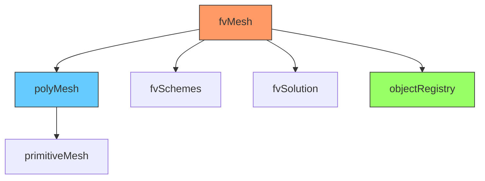

# fvMesh Class

fvMesh Class Reference — หัวใจของ Finite Volume discretization

> **ทำไมต้องรู้จัก fvMesh?**
> - **ทุก field, ทุก equation ต้องการ fvMesh** — ไม่มี mesh ไม่มี CFD
> - fvMesh เป็น "objectRegistry" = ที่เก็บ fields ทั้งหมด
> - การเข้าถึง mesh geometry ผิดวิธี = performance ลด หรือ bugs

---

## Overview

> **💡 คิดแบบนี้:**
> fvMesh = **polyMesh + FVM intelligence**
>
> - polyMesh: รู้แค่ points, faces, cells
> - fvMesh: รู้ทั้ง**geometry** และ **discretization** (Sf, V, delta)



**Inheritance chain:**
- `primitiveMesh`: topology only (owner, neighbour)
- `polyMesh`: + points, faces, patches
- `fvMesh`: + FVM geometry (Sf, V, delta) + schemes + registry

---

## 1. Creation

> **ส่วนใหญ่ไม่ต้อง create เอง** — OpenFOAM templates จัดการให้

```cpp
// Standard way (recommended)
#include "createMesh.H"
// สร้าง fvMesh mesh โดยอัตโนมัติ

// Or explicit (rare cases)
fvMesh mesh
(
    IOobject
    (
        fvMesh::defaultRegion,   // "region0" (default)
        runTime.timeName(),       // Time directory
        runTime,                  // Reference to Time
        IOobject::MUST_READ       // Must exist
    )
);
```

---

## 2. Geometry Access

### Cell Data — ข้อมูลที่ cell centers

> **ทำไม cell geometry สำคัญ?**
> - Cell volumes (V) ใช้คำนวณ unsteady term: $\frac{\rho V}{\Delta t}$
> - Cell centers (C) ใช้คำนวณ gradients

```cpp
// Cell centers (volVectorField)
const volVectorField& C = mesh.C();
vector center = C[cellI];

// Cell volumes (volScalarField::Internal)
const volScalarField::Internal& V = mesh.V();
scalar vol = V[cellI];
```

**ทำไม V() return `Internal` ไม่ใช่ `volScalarField`?**
- Volume อยู่แค่ที่ cells ไม่มี boundary → ไม่ต้องเก็บ BCs

### Face Data — ข้อมูลที่ faces

> **ทำไม face geometry สำคัญที่สุด?**
> - **FVM คำนวณ flux ที่ faces!**
> - Sf = face area vector (magnitude + direction)

```cpp
// Face area vectors (surfaceVectorField)
const surfaceVectorField& Sf = mesh.Sf();
// Sf points from owner to neighbour

// Face area magnitudes (surfaceScalarField)
const surfaceScalarField& magSf = mesh.magSf();

// Face centers (surfaceVectorField)
const surfaceVectorField& Cf = mesh.Cf();
```

**ทำไม Sf เป็น vector ไม่ใช่ scalar?**
- Sf = **area × direction** (outward normal จาก owner cell)
- Flux = (velocity · Sf) → ต้องการ dot product

---

## 3. Connectivity

> **ทำไม connectivity สำคัญ?**
> - ต้องรู้ว่า face connects cells ไหน → สร้าง matrix coefficients

```cpp
// Face owner/neighbour
const labelList& owner = mesh.faceOwner();     // face f belongs to cell owner[f]
const labelList& neighbour = mesh.faceNeighbour();  // across face f is cell neighbour[f]

// Cell-cell distance vector (surfaceVectorField)
const surfaceVectorField& delta = mesh.delta();  // Used for gradient calculation
```

**owner vs neighbour:**
- `owner[faceI]` = cell ID ที่ "เป็นเจ้าของ" face นี้
- `neighbour[faceI]` = cell ID อีกฝั่ง
- **Boundary faces:** มีแค่ owner (neighbour = -1)

---

## 4. Boundary Access

> **ทำไม boundary access สำคัญ?**
> - Post-processing: หา force บน wall
> - Custom BCs: modify boundary values

```cpp
const fvBoundaryMesh& boundary = mesh.boundary();

// Iterate all patches
forAll(boundary, patchI)
{
    const fvPatch& patch = boundary[patchI];
    
    // Patch properties
    word name = patch.name();        // "inlet", "outlet", etc.
    word type = patch.type();        // "patch", "wall", "cyclic"
    label nFaces = patch.size();     // Number of faces
    label startFace = patch.start(); // First face ID
}

// Find patch by name (common pattern)
label inletI = mesh.boundaryMesh().findPatchID("inlet");
if (inletI == -1)
{
    FatalError << "Patch 'inlet' not found!" << exit(FatalError);
}
```

---

## 5. Schemes and Solution Access

> **ทำไม access schemes จาก mesh?**
> - Discretization schemes อยู่ใน fvSchemes → mesh เป็น gateway

```cpp
// Access fvSchemes (system/fvSchemes)
const fvSchemes& schemes = mesh.schemesDict();

// Access fvSolution (system/fvSolution)  
const fvSolution& solution = mesh.solutionDict();

// Example: get relaxation factor
scalar URel = solution.fieldRelaxationFactor("U");
```

---

## 6. Object Registry

> **ทำไม fvMesh เป็น objectRegistry?**
> - **เก็บ fields ทั้งหมด** (U, p, T, k, ...) ไว้ในที่เดียว
> - Functions/utilities สามารถ lookup field ได้โดยไม่ต้องรู้ว่ามาจากไหน

```cpp
// fvMesh IS an objectRegistry!

// Lookup field by name (read-only)
const volScalarField& p = mesh.lookupObject<volScalarField>("p");

// Check if field exists before lookup
if (mesh.foundObject<volScalarField>("T"))
{
    const volScalarField& T = mesh.lookupObject<volScalarField>("T");
    // use T...
}

// Get mutable reference (non-const)
volVectorField& U = mesh.lookupObjectRef<volVectorField>("U");
```

**Common mistake:**
```cpp
// ❌ Wrong: lookup without checking
const volScalarField& T = mesh.lookupObject<volScalarField>("T");
// Crashes if T doesn't exist!

// ✅ Right: check first
if (mesh.foundObject<volScalarField>("T")) { ... }
```

---

## 7. Mesh Motion

> **ใช้เมื่อ:** Dynamic mesh (FSI, moving bodies)

```cpp
// Move points to new positions
mesh.movePoints(newPoints);

// Update after topology change (e.g., AMR)
mesh.updateMesh(topoChange);
```

---

## Quick Reference

| Method | Returns | Type | ใช้เมื่อ |
|--------|---------|------|---------|
| `C()` | Cell centers | volVectorField | Gradient calculation |
| `V()` | Cell volumes | DimensionedField | Unsteady term |
| `Sf()` | Face area vectors | surfaceVectorField | Flux calculation |
| `magSf()` | Face area magnitudes | surfaceScalarField | Normalize flux |
| `Cf()` | Face centers | surfaceVectorField | Face interpolation |
| `delta()` | Cell-cell distances | surfaceVectorField | Gradient at faces |
| `boundary()` | Patch list | fvBoundaryMesh | Post-processing |

---

## 🧠 Concept Check

<details>
<summary><b>1. fvMesh มีอะไรเพิ่มจาก polyMesh?</b></summary>

**เพิ่ม FVM-specific features:**
- Sf, magSf, delta (discretization geometry)
- fvSchemes, fvSolution access
- **objectRegistry** (เก็บ fields)

**polyMesh รู้แค่:** points, faces, cells, patches (topology + geometry)
**fvMesh รู้เพิ่ม:** FVM discretization support
</details>

<details>
<summary><b>2. mesh.C() return type คืออะไร? ทำไม?</b></summary>

**volVectorField** — cell centers เป็น vector field

**ทำไมไม่ใช่ vectorField ธรรมดา?**
- ต้องการ consistency กับ field operations
- สามารถ write/visualize ได้
- มี boundary data (patch centers)
</details>

<details>
<summary><b>3. หา patch by name อย่างไร? ทำไมต้อง check?</b></summary>

```cpp
label patchI = mesh.boundaryMesh().findPatchID("inlet");
if (patchI < 0)
{
    FatalError << "Patch not found!" << exit(FatalError);
}
```

**ทำไมต้อง check:** 
- `findPatchID` return -1 ถ้าไม่เจอ
- ใช้ -1 เป็น index → **crash** หรือ undefined behavior
</details>

<details>
<summary><b>4. ทำไม fvMesh เป็น objectRegistry สำคัญ?</b></summary>

**Centralized field storage:**
- ทุก field register กับ mesh
- utilities สามารถ `lookupObject` ได้โดยไม่ต้อง pass fields เป็น arguments
- ช่วยให้ code modular และ extensible

**ตัวอย่างการใช้:**
- `postProcess` utilities lookup fields จาก registry
- Function objects access fields โดย name
</details>

---

## 📖 เอกสารที่เกี่ยวข้อง

- **ภาพรวม:** [00_Overview.md](00_Overview.md)
- **polyMesh:** [04_polyMesh.md](04_polyMesh.md)
- **primitiveMesh:** [03_primitiveMesh.md](03_primitiveMesh.md)
- **Fields:** [../05_FIELDS_GEOMETRICFIELDS/00_Overview.md](../05_FIELDS_GEOMETRICFIELDS/00_Overview.md)
