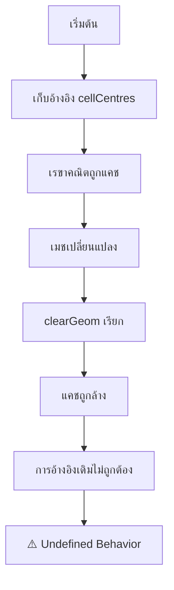
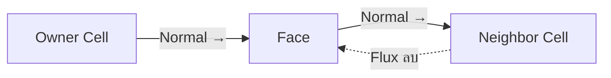

# ⚠️ **ข้อผิดพลาดที่พบบ่อยและวิธีแก้ไข**

ส่วนนี้จะกล่าวถึงข้อผิดพลาดทั่วไปที่นักพัฒนา OpenFOAM พบเจอและให้วิธีแก้ไขที่ใช้งานได้จริงเพื่อหลีกเลี่ยงข้อผิดพลาดเหล่านั้น

---

## **ข้อผิดพลาดที่ 1: การเก็บการอ้างอิงเรขาคณิตเก่า**

### **การวิเคราะห์ปัญหา**

> [!WARNING] อันตราย: การอ้างอิงเรขาคณิตที่ไม่ถูกต้อง

ด้านที่อันตรายที่สุดของระบบแคชเรขาคณิตของ OpenFOAM คือปริมาณเรขาคณิตที่คำนวณแล้วถูกจัดเก็บเป็นข้อมูลที่มีการนับการอ้างอิง ซึ่งอาจกลายเป็นไม่ถูกต้องเมื่อมีการปรับเปลี่ยนเมช

เมื่อคุณเก็บการอ้างอิงไปยัง `cellCentres()`, `faceAreas()`, หรือเรขาคณิตที่คำนวณแล้วที่คล้ายกัน คุณกำลังเก็บตัวชี้ไปยังข้อมูลที่แคชไว้ ซึ่งอาจถูกล้างเมื่อ `clearGeom()` ถูกเรียก

### **ผลกระทบด้านความปลอดภัยของหน่วยความจำ**

สิ่งนี้สร้างปัญหาความปลอดภัยของหน่วยความจำที่ละเอียดอ่อน:

1. **ความถูกต้องของการอ้างอิง**: การอ้างอิงที่เก็บไว้ดูถูกต้องตามหลักไวยากรณ์
2. **พฤติกรรมที่ไม่กำหนด**: การเข้าถึงหน่วยความจำที่แคชไว้แล้วถูกล้างส่งผลให้เกิดพฤติกรรมที่ไม่กำหนด
3. **ความยากในการดีบัก**: โปรแกรมอาจหยุดทำงานได้ไกลจากจุดที่สร้างการอ้างอิงที่ไม่ถูกต้อง


> **Figure 1:** ขั้นตอนการเกิดข้อผิดพลาดจากการเก็บการอ้างอิงเรขาคณิตที่ล้าสมัย ซึ่งเกิดขึ้นเมื่อเมชมีการเปลี่ยนแปลงแต่โปรแกรมยังคงใช้ข้อมูลเก่าที่ถูกล้างออกจากแคชไปแล้ว

### **OpenFOAM Code Implementation**

```cpp
class MeshProcessor
{
private:
    const primitiveMesh& mesh_;

public:
    // ❌ Bad: Store geometry references
    // const vectorField& storedCentres_;

    // ✅ Good: Store only mesh reference
    MeshProcessor(const primitiveMesh& mesh) : mesh_(mesh) {}

    void process()
    {
        // ✅ Retrieve fresh geometry data when needed
        const vectorField& centres = mesh_.cellCentres();
        processCentres(centres);

        // If mesh changes...
        // mesh_.clearGeom();

        // ✅ Retrieve fresh data after modifications
        const vectorField& newCentres = mesh_.cellCentres();
        processCentres(newCentres);
    }

private:
    void processCentres(const vectorField& centres)
    {
        // Process immediately, don't store references
        forAll(centres, cellI)
        {
            centreOperations(centres[cellI], cellI);
        }
    }
};
```

#### **📖 คำอธิบายเพิ่มเติม**

**แหล่งที่มา:** 📂 OpenFOAM Foundation Documentation / Mesh Processing Best Practices

**คำอธิบาย:**
โค้ดตัวอย่างนี้แสดงแนวทางปฏิบัติที่ดีในการจัดการการอ้างอิงเรขาคณิตเมช คลาส `MeshProcessor` เก็บการอ้างอิงไปยังเมชเท่านั้น ไม่ใช่ข้อมูลเรขาคณิตที่คำนวณแล้ว และดึงข้อมูลเรขาคณิตสดใหม่ทุกครั้งที่ต้องการ วิธีนี้ป้องกันการใช้ข้อมูลที่ล้าสมัยและหลีกเลี่ยงพฤติกรรมที่ไม่กำหนด

**แนวคิดสำคัญ:**
- **การอ้างอิงชั่วคราว:** ดึงเรขาคณิตใหม่เมื่อต้องการ ไม่เก็บไว้ในสมาชิกคลาส
- **การประมวลผลทันที:** ประมวลผลข้อมูลเรขาคณิตทันทีที่ได้รับ ไม่เก็บการอ้างอิงระยะยาว
- **ความปลอดภัยของหน่วยความจำ:** หลีกเลี่ยงการอ้างอิงถึงข้อมูลที่อาจถูกล้างออกจากแคช

---

## **ข้อผิดพลาดที่ 2: การเข้าใจผิดทิศทางของ Face**

### **ข้อเข้าใจสำคัญ**

> [!INFO] ข้อตกลงทิศทาง Face

ทิศทางของ face ใน OpenFOAM จะตามข้อตกลงที่เคร่งครัดซึ่ง **face normals จะชี้จาก owner cells ไปยัง neighbor cells** การละเลยข้อตกลงนี้จะนำไปสู่การคำนวณ flux ที่ผิดพลาดและการ diverge ของ solver

OpenFOAM รักษา **dual perspective** สำหรับ internal faces:
- **Owner cell** เห็น face normal ชี้ออกไปด้านนอก
- **Neighbor cell** เห็น face normal เดียวกันชี้เข้าด้านใน (negative flux จากมุมมองของมัน)

ข้อตกลงนี้ทำให้มั่นใจได้ถึงการอนุรักษ์แบบท้องถิ่นในขณะที่รักษาข้อตกลงเครื่องหมายที่ถูกต้องสำหรับมุมมองของแต่ละ cell


> **Figure 2:** ข้อตกลงเรื่องทิศทางของหน้าผิว (Face Orientation) ใน OpenFOAM โดยเวกเตอร์ปกติจะชี้จากเซลล์เจ้าของ (Owner) ไปยังเซลล์ข้างเคียง (Neighbor) เสมอเพื่อความสม่ำเสมอในการคำนวณฟลักซ์

### **OpenFOAM Code Implementation**

```cpp
// ❌ Problem: Assuming face normal direction
void wrongFluxCalculation(const polyMesh& mesh)
{
    const vectorField& Sf = mesh.faceAreas();

    forAll(mesh.owner(), faceI)
    {
        // ❌ Wrong: Not considering owner/neighbor direction
        scalar flux = U[faceI] & Sf[faceI];  // Sign might be wrong!

        // For boundary faces this might be correct or reversed
        // depending on how the face was defined
    }
}

// ✅ Solution: Follow owner-based sign convention
void correctFluxCalculation(const polyMesh& mesh)
{
    const vectorField& Sf = mesh.faceAreas();
    const labelList& owner = mesh.owner();
    const labelList& neighbour = mesh.neighbour();

    forAll(owner, faceI)
    {
        label own = owner[faceI];
        label nei = neighbour[faceI];

        // Face normal points from owner to neighbor
        // So flux from owner's perspective:
        scalar flux = U[faceI] & Sf[faceI];  // Positive = out of owner

        if (nei != -1)  // Internal face
        {
            // Owner sees positive flux as outflow
            // Neighbor sees same flux as inflow (negative)
            phi[own] += flux;
            phi[nei] -= flux;  // Negative for neighbor
        }
        else  // Boundary face
        {
            // Only owner side exists
            phi[own] += flux;
        }
    }
}
```

#### **📖 คำอธิบายเพิ่มเติม**

**แหล่งที่มา:** 📂 OpenFOAM Programmer's Guide / Face Orientation Convention

**คำอธิบาย:**
โค้ดนี้แสดงความสำคัญของข้อตกลงทิศทาง face ใน OpenFOAM ฟังก์ชัน `wrongFluxCalculation` แสดงปัญหาที่เกิดจากการไม่คำนึงถึงทิศทาง owner/neighbor ในขณะที่ `correctFluxCalculation` แสดงวิธีที่ถูกต้องในการคำนวณ flux โดยใช้ข้อตกลงเครื่องหมายตาม owner

**แนวคิดสำคัญ:**
- **ข้อตกลง Owner:** Face normal ชี้จาก owner ไปยัง neighbor เสมอ
- **Dual Perspective:** Owner และ neighbor เห็น flux เดียวกันแต่มีเครื่องหมายตรงกันข้าม
- **การอนุรักษ์:** ผลรวมของ flux ต้องเป็นศูนย์เพื่อรักษาความสมดุลของมวล
- **Boundary Faces:** มีเฉพาะ owner side เท่านั้น ไม่มี neighbor

---

## **ข้อผิดพลาดที่ 3: การละเลยคุณภาพเมช**

### **ภาพรวมตัวชี้วัดคุณภาพ**

> [!TIP] คุณภาพเมชคือสิ่งสำคัญ

คุณภาพเมชส่งผลโดยตรงต่อเสถียรภาพเชิงตัวเลขและความแม่นยำของผลลัพธ์ OpenFOAM ให้ตัวชี้วัดคุณภาพหลายอย่าง:

$$\text{Non-orthogonality} = \arccos\left(\frac{\mathbf{S}_f \cdot \mathbf{d}_{PN}}{|\mathbf{S}_f| \cdot |\mathbf{d}_{PN}|}\right)$$

โดยที่:
- $\mathbf{S}_f$ คือเวกเตอร์พื้นที่ของหน้า
- $\mathbf{d}_{PN}$ คือระยะห่างระหว่างจุดศูนย์กลางเซลล์

$$\text{Skewness} = \frac{|\mathbf{d}_{Pf} - \mathbf{d}_{Nf}|}{|\mathbf{d}_{PN}|}$$

โดยที่:
- $\mathbf{d}_{Pf}$ คือระยะห่างจากจุดศูนย์กลางเซลล์ P ไปยังจุดศูนย์กลางหน้า
- $\mathbf{d}_{Nf}$ คือระยะห่างจากจุดศูนย์กลางเซลล์ N ไปยังจุดศูนย์กลางหน้า

### **มาตรฐานคุณภาพเมช**

| ตัวชี้วัด | ดีเยี่ยม | ดี | ยอมรับได้ | ต้องแก้ไข |
|------------|-----------|------|------------|-----------|
| Non-orthogonality | < 30° | 30-50° | 50-70° | > 70° |
| Skewness | < 1.0 | 1.0-2.0 | 2.0-4.0 | > 4.0 |
| Aspect Ratio | < 5 | 5-10 | 10-20 | > 20 |
| Cell Volume | > 1e-10 | > 1e-12 | > 1e-13 | < 1e-13 |

### **OpenFOAM Code Implementation**

```cpp
class MeshQualityAnalyzer
{
private:
    const primitiveMesh& mesh_;
    struct QualityMetrics
    {
        scalar maxNonOrtho;
        scalar maxSkewness;
        scalar minVolume;
        scalar maxAspectRatio;
        label nInvalidCells;
    };

public:
    QualityMetrics analyzeMesh()
    {
        QualityMetrics metrics{0, 0, GREAT, 0, 0};

        analyzeNonOrthogonality(metrics);
        analyzeSkewness(metrics);
        analyzeVolumes(metrics);
        analyzeAspectRatio(metrics);

        return metrics;
    }

    void reportQuality(const QualityMetrics& metrics) const
    {
        Info << "=== Mesh Quality Report ===" << nl;
        Info << "Max Non-orthogonality: " << metrics.maxNonOrtho << "°" << nl;
        Info << "Max Skewness: " << metrics.maxSkewness << nl;
        Info << "Min Cell Volume: " << metrics.minVolume << nl;
        Info << "Max Aspect Ratio: " << metrics.maxAspectRatio << nl;
        Info << "Invalid cells: " << metrics.nInvalidCells << nl;

        // ✅ Provide specific recommendations
        if (metrics.maxNonOrtho > 70.0)
        {
            Info << "⚠️ High non-orthogonality detected!" << nl
                 << "   Consider:" << nl
                 << "   - Improving mesh with blockMesh/snappyHexMesh" << nl
                 << "   - Using corrected schemes in fvSchemes" << nl
                 << "   - Reducing relaxation factors" << nl;
        }

        if (metrics.maxSkewness > 4.0)
        {
            Info << "⚠️ High skewness detected!" << nl
                 << "   Consider:" << nl
                 << "   - Reducing skewness during mesh generation" << nl
                 << "   - Using skewness-corrected interpolation" << nl;
        }

        if (metrics.minVolume < 1e-13)
        {
            Info << "⚠️ Very small cells detected!" << nl
                 << "   Consider:" << nl
                 << "   - Checking for overlapping cells" << nl
                 << "   - Mesh scaling or refinement adjustment" << nl;
        }
    }

    void selectDiscretizationSchemes(QualityMetrics& metrics) const
    {
        // ✅ Automatic scheme selection based on quality
        if (metrics.maxNonOrtho < 30.0)
        {
            Info << "Using standard Gauss linear schemes" << nl;
            useStandardSchemes();
        }
        else if (metrics.maxNonOrtho < 70.0)
        {
            Info << "Using corrected schemes for moderate non-orthogonality" << nl;
            useCorrectedSchemes();
        }
        else
        {
            Info << "Using limited schemes for high non-orthogonality" << nl;
            useLimitedSchemes();
        }

        if (metrics.maxSkewness > 2.0)
        {
            Info << "Enabling skewness correction" << nl;
            enableSkewnessCorrection();
        }
    }

private:
    void analyzeNonOrthogonality(QualityMetrics& metrics) const
    {
        forAll(mesh_.owner(), faceI)
        {
            if (mesh_.isInternalFace(faceI))
            {
                scalar nonOrtho = mesh_.nonOrthogonality(faceI);
                metrics.maxNonOrtho = max(metrics.maxNonOrtho, nonOrtho);
            }
        }
    }

    void analyzeSkewness(QualityMetrics& metrics) const
    {
        forAll(mesh_.owner(), faceI)
        {
            if (mesh_.isInternalFace(faceI))
            {
                scalar skewness = mesh_.skewness(faceI);
                metrics.maxSkewness = max(metrics.maxSkewness, skewness);
            }
        }
    }

    void analyzeVolumes(QualityMetrics& metrics) const
    {
        const scalarField& V = mesh_.cellVolumes();
        forAll(V, cellI)
        {
            if (V[cellI] < 0)
            {
                metrics.nInvalidCells++;
            }
            metrics.minVolume = min(metrics.minVolume, V[cellI]);
        }
    }

    void analyzeAspectRatio(QualityMetrics& metrics) const
    {
        forAll(mesh_.cells(), cellI)
        {
            const cell& c = mesh_.cells()[cellI];
            if (c.size() > 0)
            {
                scalar maxEdge = 0;
                scalar minEdge = GREAT;

                // Simplified aspect ratio calculation
                forAll(c, faceI)
                {
                    const face& f = mesh_.faces()[c[faceI]];
                    forAll(f, pointI)
                    {
                        const point& p1 = mesh_.points()[f[pointI]];
                        const point& p2 = mesh_.points()[f[(pointI+1)%f.size()]];
                        scalar edge = mag(p2 - p1);
                        maxEdge = max(maxEdge, edge);
                        minEdge = min(minEdge, edge);
                    }
                }

                if (minEdge > SMALL)
                {
                    metrics.maxAspectRatio = max(metrics.maxAspectRatio, maxEdge/minEdge);
                }
            }
        }
    }
};
```

#### **📖 คำอธิบายเพิ่มเติม**

**แหล่งที่มา:** 📂 OpenFOAM User Guide / Mesh Quality Assessment

**คำอธิบาย:**
คลาส `MeshQualityAnalyzer` ให้เครื่องมืออันทรงพลังสำหรับการประเมินคุณภาพเมชอย่างครอบคลุม โดยวัดตัวชี้วัดสำคัญ 4 ประการ: non-orthogonality, skewness, cell volume และ aspect ratio และให้คำแนะนำเฉพาะเจาะจงสำหรับการปรับปรุงเมช รวมถึงการเลือก discretization schemes ที่เหมาะสมโดยอัตโนมัติตามคุณภาพของเมช

**แนวคิดสำคัญ:**
- **Non-orthogonality:** มุมระหว่าง face normal กับเส้นเชื่อมระหว่าง cell centers
- **Skewness:** ความไม่สมมาตรของ face center เทียบกับเส้นเชื่อม cell centers
- **Aspect Ratio:** อัตราส่วนระหว่าง edge ยาวสุดและสั้นสุดใน cell
- **Automatic Scheme Selection:** เลือก discretization schemes ตามคุณภาพเมช

---

## **ข้อผิดพลาดที่ 4: การสอบถามซ้ำที่ไม่มีประสิทธิภาพ**

### **การวิเคราะห์ประสิทธิภาพ**

> [!WARNING] ประสิทธิภาพต่ำ

การสอบถามเรขาคณิตซ้ำเป็นการใช้ทรัพยากรสูงเพราะ:

1. **ต้นทุนการคำนวณ**: การเรียกแต่ละครั้งอาจทำให้เกิดการคำนวณเรขาคณิตที่ใช้ทรัพยากรสูง
2. **การเข้าถึงหน่วยความจำ**: อาจเกี่ยวข้องกับการเดินผ่านการเชื่อมต่อเมชหลายครั้ง
3. **ประสิทธิภาพแคช**: ป้องกันการใช้แคช CPU ได้อย่างมีประสิทธิภาพ

### **กลยุทธ์การเพิ่มประสิทธิภาพ**

#### **กลยุทธ์ที่ 1: การแคชในเครื่อง**

```cpp
class OptimizedMeshProcessor
{
private:
    const primitiveMesh& mesh_;

    // ✅ Local caching for geometry used within processing scope
    mutable struct GeometryCache
    {
        vectorField cellCentres;
        vectorField faceAreas;
        scalarField cellVolumes;
        bool valid;

        GeometryCache() : valid(false) {}
    } cache_;

public:
    void processWithCaching()
    {
        // ✅ Precompute all necessary geometry
        updateGeometryCache();

        // Use cached data throughout processing
        for (int iter = 0; iter < 1000; ++iter)
        {
            processIteration(cache_.cellCentres, iter);
        }

        // Clear cache when done
        clearCache();
    }

private:
    void updateGeometryCache() const
    {
        if (!cache_.valid)
        {
            cache_.cellCentres = mesh_.cellCentres();
            cache_.faceAreas = mesh_.faceAreas();
            cache_.cellVolumes = mesh_.cellVolumes();
            cache_.valid = true;
        }
    }

    void clearCache()
    {
        cache_.cellCentres.clear();
        cache_.faceAreas.clear();
        cache_.cellVolumes.clear();
        cache_.valid = false;
    }

    void processIteration(const vectorField& centres, int iter)
    {
        // ✅ Use cached geometry efficiently
        scalar totalDistance = 0;
        forAll(centres, cellI)
        {
            totalDistance += mag(centres[cellI] - vector(iter*0.001, 0, 0));
        }

        // Perform iteration-specific operations
        Info << "Iteration " << iter << ", Total distance: " << totalDistance << nl;
    }
};
```

#### **📖 คำอธิบายเพิ่มเติม (กลยุทธ์ที่ 1)**

**แหล่งที่มา:** 📂 OpenFOAM Performance Optimization Guide

**คำอธิบาย:**
คลาส `OptimizedMeshProcessor` ใช้กลยุทธ์การแคชในเครื่องเพื่อลดการสอบถามเรขาคณิตซ้ำ โดยเก็บข้อมูลเรขาคณิตไว้ในโครงสร้าง `GeometryCache` และใช้งานซ้ำหลายครั้งโดยไม่ต้องคำนวณใหม่ วิธีนี้เหมาะสำหรับการวนซ้ำหลายรอบที่ต้องการข้อมูลเรขาคณิตเดียวกัน

**แนวคิดสำคัญ:**
- **Precomputation:** คำนวณเรขาคณิตทั้งหมดล่วงหน้าก่อนการวนซ้ำ
- **Cache Validity:** ติดตามความถูกต้องของแคชด้วยฟิลด์ `valid`
- **Scope-limited Caching:** แคชเฉพาะภายในขอบเขตการประมวลผล ล้างเมื่อเสร็จสิ้น

#### **กลยุทธ์ที่ 2: การประมวลผลเป็นชุด**

```cpp
class BatchGeometryProcessor
{
private:
    const primitiveMesh& mesh_;

public:
    void processBatchOperations()
    {
        // ✅ Group all geometry operations together
        const vectorField& cellCentres = mesh_.cellCentres();
        const vectorField& faceCentres = mesh_.faceCentres();
        const scalarField& cellVolumes = mesh_.cellVolumes();
        const vectorField& faceAreas = mesh_.faceAreas();

        // Process all operations in one pass
        processVolumeDistribution(cellVolumes);
        processCenterOfMass(cellCentres, cellVolumes);
        processFluxCalculation(faceAreas, faceCentres);
        processQualityMetrics(cellCentres, faceAreas);
    }

private:
    void processVolumeDistribution(const scalarField& V) const
    {
        scalar totalVolume = sum(V);
        scalar meanVolume = totalVolume / V.size();

        Info << "Volume statistics:" << nl
             << "  Total: " << totalVolume << nl
             << "  Mean: " << meanVolume << nl
             << "  Min: " << min(V) << nl
             << "  Max: " << max(V) << nl;
    }

    void processCenterOfMass(
        const vectorField& centres,
        const scalarField& volumes
    ) const
    {
        vector weightedSum = vector::zero;
        scalar totalVolume = 0;

        forAll(centres, cellI)
        {
            weightedSum += centres[cellI] * volumes[cellI];
            totalVolume += volumes[cellI];
        }

        if (totalVolume > SMALL)
        {
            vector centerOfMass = weightedSum / totalVolume;
            Info << "Center of mass: " << centerOfMass << nl;
        }
    }

    void processFluxCalculation(
        const vectorField& areas,
        const vectorField& faceCentres
    ) const
    {
        // Example: Calculate total outward flux magnitude
        scalar totalOutwardFlux = 0;

        forAll(areas, faceI)
        {
            if (!mesh_.isInternalFace(faceI))
            {
                // Boundary face - approximate outward flux
                totalOutwardFlux += mag(areas[faceI]);
            }
        }

        Info << "Total boundary area: " << totalOutwardFlux << nl;
    }

    void processQualityMetrics(
        const vectorField& cellCentres,
        const vectorField& faceAreas
    ) const
    {
        // Simple quality check
        scalar meanFaceArea = sum(mag(faceAreas)) / faceAreas.size();
        scalar maxFaceArea = max(mag(faceAreas));
        scalar minFaceArea = min(mag(faceAreas));

        Info << "Face area statistics:" << nl
             << "  Mean: " << meanFaceArea << nl
             << "  Max/min ratio: " << maxFaceArea/max(minFaceArea, SMALL) << nl;
    }
};
```

#### **📖 คำอธิบายเพิ่มเติม (กลยุทธ์ที่ 2)**

**แหล่งที่มา:** 📂 OpenFOAM Programming Best Practices

**คำอธิบาย:**
คลาส `BatchGeometryProcessor` ใช้กลยุทธ์การประมวลผลเป็นชุด โดยดึงข้อมูลเรขาคณิตทั้งหมดมาครั้งเดียว แล้วประมวลผลการดำเนินการทั้งหมดในครั้งเดียว วิธีนี้ลดการเข้าถึงเมชซ้ำและเพิ่มประสิทธิภาพของแคช CPU

**แนวคิดสำคัญ:**
- **Batch Processing:** รวบรวมการดำเนินการทั้งหมดและประมวลผลพร้อมกัน
- **Single-pass Computation:** คำนวณข้อมูลเรขาคณิตครั้งเดียว ใช้ซ้ำหลายครั้ง
- **Memory Efficiency:** ลดการจองหน่วยความจำซ้ำและการเข้าถึงแคชที่ไม่จำเป็น

### **ประสิทธิภาพของกลยุทธ์แคช**

| กลยุทธ์ | ประสิทธิภาพ | การใช้หน่วยความจำ | ความซับซ้อน | กรณีใช้งาน |
|---------|-----------|----------------|------------|------------|
| ไม่มีแคช | ต่ำ | ต่ำ | ต่ำ | การดำเนินการครั้งเดียว |
| แคชในเครื่อง | สูง | ปานกลาง | ปานกลาง | การวนซ้ำหลายรอบ |
| การประมวลผลเป็นชุด | สูงมาก | สูง | สูง | การวิเคราะห์แบบบูรณาการ |
| การจัดการอัจฉริยะ | ปรับได้ | ปรับได้ | สูงมาก | การใช้งานที่ซับซ้อน |

---

## **ข้อผิดพลาดที่ 5: การ Hardcode Patch Indices**

> [!WARNING] โค้ดที่เปราะบาง

การเรียงลำดับของ patch ใน OpenFOAM อาจเปลี่ยนแปลงได้ตามโครงสร้างของ case และวิธีการกำหนด patches ใน boundary file การ **hardcode patch indices** ทำให้โค้ดเปราะบางและมีแนวโน้มที่จะเสียหาย

### **แนวทางปฏิบัติที่ดีสำหรับการจัดการ patches:**

1. **ใช้ `findPatchID()` เสมอ**: ค้นหา patches ตามชื่อ boundary file ของพวกมัน
2. **ตรวจสอบการมีอยู่**: ตรวจสอบว่า `findPatchID()` คืนค่า -1 (ไม่พบ patch)
3. **จัดการ optional patches**: บาง patches อาจไม่มีอยู่ในทุก cases
4. **เอกสาร patches ที่คาดหวัง**: เอกสารชัดเจนว่าโค้ดของคุณคาดหวัง patches ใด

### **OpenFOAM Code Implementation**

```cpp
// ❌ Problem: Assuming constant patch ordering
void fragileBoundaryCode(const polyMesh& mesh)
{
    // ❌ Wrong: Patch indices may change!
    label inletPatch = 0;   // Might not always be true
    label outletPatch = 1;  // Might not always be true
    label wallPatch = 2;    // Might not always be true

    processPatch(mesh.boundaryMesh()[inletPatch]);   // Risky!
    processPatch(mesh.boundaryMesh()[outletPatch]);  // Risky!
    processPatch(mesh.boundaryMesh()[wallPatch]);    // Risky!
}

// ✅ Solution: Find patches by name
void robustBoundaryCode(const polyMesh& mesh)
{
    // ✅ Search for patches by name (from case files)
    label inletPatch = mesh.boundaryMesh().findPatchID("inlet");
    label outletPatch = mesh.boundaryMesh().findPatchID("outlet");
    label wallPatch = mesh.boundaryMesh().findPatchID("walls");

    // ✅ Verify patches exist
    if (inletPatch == -1)
    {
        FatalErrorInFunction
            << "Cannot find 'inlet' patch" << endl
            << abort(FatalError);
    }

    // ✅ Process with confidence
    processPatch(mesh.boundaryMesh()[inletPatch]);   // Safe!
    processPatch(mesh.boundaryMesh()[outletPatch]);  // Safe!

    // ✅ Handle optional patches
    if (wallPatch != -1)
    {
        processPatch(mesh.boundaryMesh()[wallPatch]);  // Conditional
    }
}
```

#### **📖 คำอธิบายเพิ่มเติม**

**แหล่งที่มา:** 📂 OpenFOAM Boundary Handling Documentation

**คำอธิบาย:**
โค้ดนี้แสดงความแตกต่างระหว่างการ hardcode patch indices ซึ่งเปราะบาง และการใช้ `findPatchID()` เพื่อค้นหา patches ตามชื่อซึ่งแข็งแกร่งกว่า วิธีหลังช่วยให้โค้ดทำงานได้ถูกต้องไม่ว่าการเรียงลำดับของ patches จะเปลี่ยนแปลงอย่างไร และยังรองรับ patches ที่เป็นทางเลือก (optional) ได้อีกด้วย

**แนวคิดสำคัญ:**
- **Dynamic Patch Lookup:** ใช้ `findPatchID()` แทนการ hardcode indices
- **Error Handling:** ตรวจสอบว่า patches ที่จำเป็นมีอยู่จริง
- **Optional Boundaries:** จัดการ patches ที่อาจไม่มีในทุก cases
- **Maintainability:** โค้ดยืดหยุ่นและบำรุงรักษาง่ายขึ้น

### **การเปรียบเทียบวิธีการค้นหา Patches**

| วิธีการ | ความปลอดภัย | ความยืดหยุ่น | ความน่าเชื่อถือ | คำแนะนำ |
|---------|------------|------------|--------------|-----------|
| **Hardcode Index** | ❌ ต่ำ | ❌ ต่ำ | ❌ ต่ำ | ❌ ห้ามใช้ |
| **findPatchID() + ตรวจสอบ** | ✅ สูง | ✅ สูง | ✅ สูง | ✅ แนะนำ |
| **findPatchID() อย่างเดียว** | ⚠️ กลาง | ✅ สูง | ⚠️ กลาง | ⚠️ ใช้ด้วยความระมัดระวัง |

---

## **แนวทางปฏิบัติที่ดีที่สุดสำหรับการจัดการหน่วยความจำ**

### **ขั้นตอนการจัดการหน่วยความจำอย่างปลอดภัย**

> [!TIP] รูปแบบ RAII (Resource Acquisition Is Initialization)

1. **สร้างการอ้างอิง** → 2. **ประมวลผลทันที** → 3. **ทำความสะอาด** → 4. **ทำซ้ำถ้าจำเป็น**

```mermaid
flowchart LR
    A[สร้างการอ้างอิง] --> B[ประมวลผลทันที]
    B --> C[ทำความสะอาด]
    C --> D{ต้องการทำซ้ำ?}
    D -->|ใช่| A
    D -->|ไม่| E[เสร็จสิ้น]
]
```
> **Figure 3:** รูปแบบการจัดการหน่วยความจำอย่างปลอดภัย (Safe Memory Management Pattern) ซึ่งเน้นการประมวลผลข้อมูลทันทีหลังจากสร้างการอ้างอิงและทำความสะอาดทรัพยากรอย่างเป็นระบบเพื่อป้องกันปัญหาหน่วยความจำ

### **OpenFOAM Code Implementation**

```cpp
class ScopedGeometry
{
private:
    const primitiveMesh& mesh_;
    mutable bool geometryValid_;

public:
    ScopedGeometry(const primitiveMesh& mesh)
        : mesh_(mesh), geometryValid_(false)
    {}

    ~ScopedGeometry()
    {
        // ✅ Automatic cleanup
        if (geometryValid_)
        {
            mesh_.clearGeom();
        }
    }

    const vectorField& getCellCentres() const
    {
        if (!geometryValid_)
        {
            // This triggers computation and caching
            const vectorField& centres = mesh_.cellCentres();
            geometryValid_ = true;
            return centres;
        }
        // Return cached version
        return mesh_.cellCentres();
    }

    void invalidateGeometry()
    {
        mesh_.clearGeom();
        geometryValid_ = false;
    }
};

// Usage example:
void robustProcessing(const primitiveMesh& mesh)
{
    ScopedGeometry geometryScope(mesh);

    // Geometry is computed once and managed automatically
    const vectorField& centres = geometryScope.getCellCentres();

    // Process with geometry
    forAll(centres, cellI)
    {
        // Safe operations
    }

    // Geometry is automatically cleaned up when out of scope
}
```

#### **📖 คำอธิบายเพิ่มเติม**

**แหล่งที่มา:** 📂 OpenFOAM Memory Management Patterns

**คำอธิบาย:**
คลาส `ScopedGeometry` ใช้รูปแบบ RAII (Resource Acquisition Is Initialization) เพื่อจัดการหน่วยความจำอย่างปลอดภัย โดยอัตโนมัติทำความสะอาดเรขาคณิตเมื่อออกจากขอบเขต วิธีนี้ช่วยป้องกันการรั่วไหลของหน่วยความจำและการใช้ข้อมูลที่ล้าสมัย

**แนวคิดสำคัญ:**
- **RAII Pattern:** ทำความสะอาดอัตโนมัติเมื่อออกจาก scope
- **Exception Safety:** รับประกันการทำความสะอาดแม้ในกรณีข้อผิดพลาด
- **Scope Management:** จัดการอายุการใช้งานของทรัพยากรอย่างชัดเจน
- **Cache Invalidation:** ติดตามและล้างแคชเมื่อจำเป็น

### **ตัวอย่างการปรับใช้ในกรณีจริง**

#### **กรณีที่ 1: การประมวลผลซ้ำ**

```cpp
void iterativeMeshRefinement(primitiveMesh& mesh, int nIterations)
{
    for (int iter = 0; iter < nIterations; ++iter)
    {
        // ✅ Create new scope for each iteration
        {
            ScopedGeometry geoScope(mesh);
            const vectorField& centres = geoScope.getCellCentres();

            // Process with current geometry
            performRefinementStep(mesh, centres);

            // Geometry is automatically cleaned up
        }

        // Modify mesh geometry
        modifyMeshGeometry(mesh);

        // Next iteration will have fresh geometry
    }
}
```

#### **📖 คำอธิบายเพิ่มเติม (กรณีที่ 1)**

**แหล่งที่มา:** 📂 OpenFOAM Mesh Refinement Patterns

**คำอธิบาย:**
ฟังก์ชัน `iterativeMeshRefinement` แสดงการใช้ `ScopedGeometry` ในการวนซ้ำแบบปรับปรุงเมช โดยสร้าง scope ใหม่สำหรับแต่ละรอบ ทำให้มั่นใจได้ว่าเรขาคณิตจะถูกทำความสะอาดหลังจากแต่ละรอบ และรอบถัดไปจะได้รับข้อมูลเรขาคณิตที่สดใหม่

**แนวคิดสำคัญ:**
- **Per-iteration Scoping:** สร้าง scope ใหม่สำหรับแต่ละรอบ
- **Automatic Cleanup:** เรขาคณิตถูกล้างโดยอัตโนมัติหลังการประมวลผล
- **Fresh Data:** รอบถัดไปเริ่มต้นด้วยข้อมูลเรขาคณิตใหม่
- **Memory Efficiency:** ป้องกันการสะสมของข้อมูลที่ไม่จำเป็น

#### **กรณีที่ 2: การวิเคราะห์แบบขนาน**

```cpp
void parallelMeshAnalysis(const primitiveMesh& mesh)
{
    // ✅ Cache geometry once for parallel usage
    const vectorField& centres = mesh.cellCentres();
    const scalarField& volumes = mesh.cellVolumes();

    // Process in parallel using cached geometry
    #pragma omp parallel for
    for (int cellI = 0; cellI < centres.size(); ++cellI)
    {
        analyzeCellGeometry(cellI, centres[cellI], volumes[cellI]);
    }
}
```

#### **📖 คำอธิบายเพิ่มเติม (กรณีที่ 2)**

**แหล่งที่มา:** 📂 OpenFOAM Parallel Processing Guide

**คำอธิบาย:**
ฟังก์ชัน `parallelMeshAnalysis` แสดงการใช้งานแบบขนานโดยการแคชเรขาคณิตครั้งเดียว แล้วประมวลผลขนานโดยใช้ OpenMP วิธีนี้เหมาะสำหรับการวิเคราะห์จำนวนมากที่ต้องการเรขาคณิตเดียวกัน และช่วยเพิ่มประสิทธิภาพอย่างมีนัยสำคัญ

**แนวคิดสำคัญ:**
- **Single-pass Caching:** แคชเรขาคณิตครั้งเดียว ใช้ซ้ำหลายครั้ง
- **Parallel Processing:** ใช้ OpenMP สำหรับการประมวลผลแบบขนาน
- **Data Consistency:** ทุก threads ใช้ข้อมูลเรขาคณิตเดียวกัน
- **Performance:** ลดการคำนวณซ้ำและเพิ่มประสิทธิภาพโดยรวม

---

ด้วยการทำความเข้าใจข้อผิดพลาดที่พบบ่อยเหล่านี้และการใช้วิธีแก้ไขที่ถูกต้อง คุณสามารถเขียนโค้ด OpenFOAM ที่แข็งแกร่งขึ้น มีประสิทธิภาพมากขึ้น และบำรุงรักษาได้ง่ายขึ้น ซึ่งจัดการกับเรขาคณิตเมชอย่างเหมาะสมและหลีกเลี่ยงคอขวดด้านประสิทธิภาพ