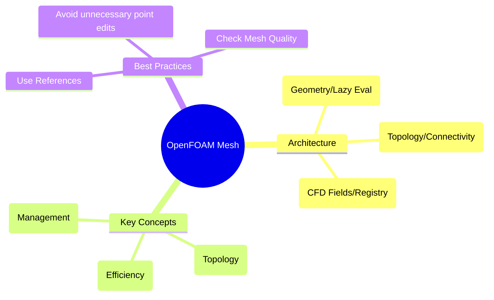

# สรุปและแบบฝึกหัด (Summary & Exercises)



## สรุปเนื้อหาสำคัญ

สถาปัตยกรรมเมชของ OpenFOAM ถูกออกแบบมาเพื่อความเร็วและความยืดหยุ่น:

1.  **3-Layer Architecture**: แยกความรับผิดชอบออกเป็น `primitiveMesh` (เรขาคณิต), `polyMesh` (โทโพโลยี), และ `fvMesh` (ฟิสิกส์)
2.  **Lazy Evaluation**: คำนวณปริมาตรและพื้นที่เมื่อจำเป็นเท่านั้น ช่วยลดเวลาเริ่มต้นโปรแกรม
3.  **Ownership Model**: ใช้ระบบ `owner` และ `neighbour` เพื่อระบุความสัมพันธ์ระหว่างเซลล์และหน้าได้อย่างรัดกุม
4.  **Integration**: เมชทำหน้าที่เป็นจุดศูนย์กลางของการจัดการข้อมูล (Object Registry) และประวัติเวลา (Time)

---

## 🎯 **ความสำคัญสำหรับ CFD**

### **ประโยชน์ทางวิศวกรรม 1: การจัดการหน่วยความจำแบบปรับตัว**

ในการจำลอง CFD ในระดับอุตสาหกรรมจริง ประสิทธิภาพหน่วยความจำไม่เพียงแค่การเพิ่มประสิทธิภาพเท่านั้น แต่มักเป็นความแตกต่างระหว่างการทำงานหรือล้มเหลวของการจำลอง

| ผลกระทบ | คำอธิบาย |
|---------|----------|
| **การลดต้นทุน** | ต้องการโหนดคำนวณน้อยลงสำหรับการจำลองขนาดใหญ่ |
| **การขยายความสามารถ** | สามารถแก้ปัญหาที่ใหญ่ขึ้น 20% บนฮาร์ดแวร์ที่มีอยู่ |
| **การปรับปรุงประสิทธิภาพ** | ลดความต้องการแบนด์วิดท์หน่วยความจำ |

**ตัวอย่างการประหยัดหน่วยความจำ:**

```cpp
class LargeMeshSimulation
{
private:
    // ความต้องการหน่วยความจำสำหรับ mesh 10 ล้านเซลล์:
    // - พิกัดจุดดิบ: 10M × 3 × 8 bytes = 240 MB (ต้องการเสมอ)
    // - พิกัดจุดศูนย์กลางเซลล์: 240 MB (คำนวณเมื่อจำเป็น)
    // - ปริมาตรเซลล์: 80 MB (คำนวณเมื่อจำเป็น)
    // - เวกเตอร์พื้นที่ผิว: ~500 MB (คำนวณเมื่อจำเป็น)

    // เปรียบเทียบกลยุทธ์หน่วยความจำ:
    // ไม่มี lazy evaluation: ~1 GB จองเสมอ
    // มี lazy evaluation: ~240 MB พื้นฐาน + คำนวณเมื่อจำเป็น

public:
    void solveTransientProblem()
    {
        // ระยะที่ 1: ระยะการตั้งค่าเริ่มต้น
        const auto& centres = mesh_.cellCentres();  // +240 MB ชั่วคราว

        // ระยะที่ 2: การแก้สมการโมเมนตัม
        const auto& Sf = mesh_.faceAreas();        // +500 MB ชั่วคราว

        // ระยะที่ 3: การตรวจสอบและวินิจฉัยผลเฉลย
        const auto& vols = mesh_.cellVolumes();    // +80 MB ชั่วคราว

        // โปรไฟล์การใช้หน่วยความจำ:
        // หน่วยความจำสูงสุด: 240 + 500 + 80 = 820 MB
        // หน่วยความจำพื้นฐาน: 240 MB
        // การประหยัดหน่วยความจำ: 18% เมื่อเทียบกับการจอง 1 GB คงที่
    }
};
```

### **ประโยชน์ทางวิศวกรรม 2: ความแข็งแกร่งต่อการเปลี่ยนแปลง Mesh**

การจำลอง CFD สมัยใหม่มักเกี่ยวข้องกับ mesh แบบไดนามิก ตั้งแต่ขอบเขตที่เคลื่อนที่ใน fluid-structure interaction ไปจนถึงการเปลี่ยนแปลงโทโพโลยีในการจำลอง additive manufacturing

```cpp
class MovingMeshSolver
{
private:
    fvMesh& mesh_;

public:
    void solveTimeStep()
    {
        // ขั้นที่ 1: อัปเดตรูปทรงเรขาคณิต mesh สำหรับ time step ปัจจุบัน
        mesh_.movePoints(newPoints);

        // ✅ การยกเลิก cache รูปทรงเรขาคณิตอัตโนมัติ
        // เมื่อเรียก movePoints() primitiveMesh::movePoints()
        // จะทำให้ clearGeom() ทำงานอัตโนมัติ ยกเลิกข้อมูล cache ทั้งหมด:
        // - cache cellCentres_ ถูกลบ
        // - cache cellVolumes_ ถูกลบ
        // - cache faceAreas_ ถูกลบ
        // - ข้อมูลรูปทรงเรขาคณิตที่ได้จากการคำนวณทั้งหมดถูกทำเครื่องหมายว่า "ต้องการการอัปเดต"

        // ขั้นที่ 2: การเข้าถึงรูปทรงเรขาคณิตถัดไปจะทำให้เกิดการคำนวณใหม่
        const auto& newCentres = mesh_.cellCentres();  // คำนวณใหม่ด้วยรูปทรงเรขาคณิตใหม่
        const auto& newVolumes = mesh_.cellVolumes();  // คำนวณใหม่ด้วยรูปทรงเรขาคณิตใหม่

        // ขั้นที่ 3: Solver ใช้รูปทรงเรขาคณิตที่อัปเดตแล้วโดยอัตโนมัติ
        solveWithUpdatedGeometry(newCentres, newVolumes);

        // ประโยชน์:
        // - กำจัดข้อผิดพลาดจากการใช้รูปทรงเรขาคณิตเก่า
        // - รับประกันการอนุรักษ์มวลและโมเมนตัม
        // - จัดการการเปลี่ยนรูป mesh โดยพลการโดยอัตโนมัติ
    }
};
```

### **ประโยชน์ทางวิศวกรรม 3: การ Discretization ที่ขับเคลื่อนด้วยคุณภาพ**

คุณภาพของ mesh ส่งผลโดยตรงต่อความแม่นยำของการจำลอง แต่บริเวณต่างๆ ของ mesh มีคุณภาพที่แตกต่างกันโดยไม่สามารถหลีกเลี่ยงได้ Solver CFD ขั้นสูงปรับเปลี่ยน schemes ตัวเลขตามลักษณะของ mesh ในพื้นที่

```cpp
class QualityAwareSolver
{
private:
    const fvMesh& mesh_;

public:
    void discretizeFlux(const volScalarField& phi, label faceI)
    {
        // ขั้นที่ 1: วิเคราะห์ตัวชี้วัดคุณภาพ mesh ในพื้นที่
        scalar orthogonality = mesh_.nonOrthogonality(faceI);    // ความเบี่ยงเบนมุมผิว
        scalar skewness = mesh_.skewness(faceI);                 // คุณภาพการแทรกสอด
        scalar aspectRatio = mesh_.aspectRatio(faceI);           // ความยาวของเซลล์

        // ขั้นที่ 2: เลือกกลยุทธ์ discretization ที่เหมาะสมที่สุด
        if (orthogonality < 20.0 && skewness < 0.5 && aspectRatio < 5.0)
        {
            // ✅ บริเวณคุณภาพสูง: ใช้ schemes ที่มีความแม่นยำลำดับที่สอง
            return centralDifferenceScheme(phi, faceI);
        }
        else if (orthogonality < 70.0 && skewness < 1.0)
        {
            // ✅ บริเวณคุณภาพปานกลาง: ใช้ schemes ลำดับสูงที่มีการแก้ไข
            return correctedScheme(phi, faceI);
        }
        else
        {
            // ✅ บริเวณคุณภาพต่ำ: ใช้ schemes ลำดับที่หนึ่งที่แข็งแกร่ง
            return upwindScheme(phi, faceI);
        }
    }
};
```

| เมตริก | ค่าที่ยอมรับได้ | ผลกระทบ |
|---------|----------------|----------|
| **Non-orthogonality** | < 70° | ความแม่นยำของการกระจาย |
| **Skewness** | < 0.5 | เสถียรภาพการคำนวณ |
| **Aspect Ratio** | < 1000 | ความเร็วในการลู่เข้า |

---

## 🎓 **รายการตรวจสอบความสำเร็จ**

- [x] **เข้าใจสถาปัตยกรรมสามชั้น**: `primitiveMesh` → `polyMesh` → `fvMesh`
- [x] **เชี่ยวชาญ Lazy Evaluation**: รู้เมื่อเรขาคณิตถูกคำนวณ/ล้างข้อมูล
- [x] **จัดการขอบเขตอย่างถูกต้อง**: Patches, Zones, และ Processor Boundaries
- [x] **ใช้มิติที่เหมาะสม**: จับข้อผิดพลาดหน่วยได้ที่เวลาคอมไพล์
- [x] **เลือกรูปแบบที่เหมาะสม**: จับคู่ Discretization กับฟิสิกส์/Mesh
- [x] **คิดแบบขนาน**: สมมติการดำเนินการ mesh แบบกระจาย
- [x] **ตรวจสอบคุณภาพ Mesh**: ตรวจสอบความไม่ตั้งฉาก, ความเบ้, เป็นต้น
- [x] **จัดการวงจรชีวิตฟิลด์**: การสร้าง, การแก้, การอัปเดตขอบเขต

---

## สถาปัตยกรรมสามชั้นอย่างละเอียด

### **ชั้นที่ 1: primitiveMesh - เครื่องมือคำนวณเรขาคณิต**

```cpp
class primitiveMesh
{
private:
    // Storage for computed properties (initially empty)
    mutable autoPtr<vectorField> cellCentresPtr_;
    mutable autoPtr<scalarField> cellVolumesPtr_;
    mutable autoPtr<vectorField> faceCentresPtr_;
    mutable autoPtr<vectorField> faceAreasPtr_;

public:
    // ✅ GETTER: Compute only when needed, cache result
    const vectorField& cellCentres() const
    {
        if (!cellCentresPtr_.valid())
        {
            cellCentresPtr_.reset(calcCellCentres());
        }
        return cellCentresPtr_();
    }

    // ✅ INVALIDATOR: Clear cache when mesh changes
    void clearGeom()
    {
        cellCentresPtr_.clear();
        cellVolumesPtr_.clear();
        faceCentresPtr_.clear();
        faceAreasPtr_.clear();
    }
};
```

**สมการพื้นฐาน:**

จุดศูนย์กลางเซลล์ถ่วงน้ำหนักตามพื้นที่หน้า:

$$\mathbf{c}_{cell} = \frac{\sum_{f \in \partial cell} A_f \mathbf{c}_f}{\sum_{f \in \partial cell} A_f}$$

ปริมาตรเซลล์โดยใช้ทฤษฎีบท divergence:

$$V = \frac{1}{3} \sum_{f \in \partial cell} \mathbf{c}_f \cdot \mathbf{S}_f$$

### **ชั้นที่ 2: polyMesh - กรอบงานโทโพโลยี**

```cpp
class polyMesh
{
private:
    // การจัดเก็บโทโพโลยีดั้งเดิม (ไม่เปลี่ยนแปลงหลังการสร้าง mesh)
    const pointField& points_;           // พิกัด 3D ของจุด mesh ทั้งหมด
    const faceList& faces_;              // รายการดัชนีจุดที่กำหนดแต่ละผิว
    const cellList& cells_;              // รายการดัชนีผิวที่กำหนดแต่ละเซลล์
    const labelList& owner_;             // ดัชนีเซลล์เจ้าของสำหรับแต่ละผิว
    const labelList& neighbour_;         // ดัชนีเซลล์ข้างเคียงสำหรับแต่ละผิว (ผิวขอบเขต = -1)

    // การจัดการขอบเขต
    const polyBoundaryMesh& boundary_;   // คอลเลกชันของ patch ขอบเขต

public:
    // วิธีการเข้าถึงโดยตรง
    const pointField& points() const { return points_; }
    const faceList& faces() const { return faces_; }
    const cellList& cells() const { return cells_; }

    // การตรวจสอบความสอดคล้องของ mesh
    bool checkMesh(const bool report) const {
        // ตรวจสอบการเชื่อมต่อของ face
        // ตรวจสอบการปิดของ cell
        // ตรวจสอบความสอดคล้องของ boundary
        return isTopologicallyCorrect();
    }
};
```

**กฎ Owner-Neighbor:**

ทุก face ใน mesh ต้องมี **owner cell** พอดีหนึ่งชุด และ **internal faces** มี **neighbor cell** อีกหนึ่งชุด:

```cpp
const labelList& owner = mesh.faceOwner();
const labelList& neighbour = mesh.faceNeighbour();

// Face normal ชี้จาก owner ไปยัง neighbor เสมอ
// สำหรับ internal face ระหว่าง cell 5 และ 10:
//   owner_[faceI] = 5
//   neighbour_[faceI] = 10
//   Face normal vector ชี้จาก cell 5 ไปยัง cell 10
```

### **ชั้นที่ 3: fvMesh - ชั้นการแบ่งพื้นที่ปริมาตรจำกัด**

```cpp
class fvMesh
    : public polyMesh          // สืบทอด topology/geometry ทั้งหมด
    , public lduMesh          // อินเทอร์เฟซ linear algebra
{
private:
    // ข้อมูลเฉพาะของ finite volume
    fvBoundaryMesh boundary_;  // เงื่อนไขขอบเขตเฉพาะ FV

    // Discretization schemes
    surfaceInterpolation interpolation_;  // น้ำหนักการ interpolate ของ face
    fvSchemes schemes_;                   // Schemes ตัวเลข
    fvSolution solution_;                 // การตั้งค่า solver

    // Finite volume geometry ที่คำนวณตามความต้องการ
    mutable autoPtr<volScalarField> Vptr_;      // ปริมาตร cell
    mutable autoPtr<surfaceScalarField> magSfPtr_; // พื้นที่ face
    mutable autoPtr<surfaceVectorField> SfPtr_;   // เวกเตอร์พื้นที่ face
    mutable autoPtr<surfaceVectorField> CfPtr_;   // จุดศูนย์กลาง face

public:
    // ✅ FV-SPECIFIC ACCESS: ปริมาตรเซลล์เป็น field
    const volScalarField& V() const
    {
        if (!Vptr_.valid())
        {
            Vptr_.reset(new volScalarField("V", *this, dimVolume));
            Vptr_() = primitiveMesh::cellVolumes();  // คำนวณจากฐาน
        }
        return Vptr_();
    }

    // ✅ FACE GEOMETRY: เวกเตอร์พื้นที่เป็น surface field
    const surfaceVectorField& Sf() const
    {
        if (!SfPtr_.valid())
        {
            SfPtr_.reset(new surfaceVectorField("Sf", *this, dimArea));
            SfPtr_() = primitiveMesh::faceAreas();  // คำนวณจากฐาน
        }
        return SfPtr_();
    }
};
```

**พื้นฐาน Finite Volume:**

ทฤษฎีบท divergence (Gauss theorem):

$$\int_V \nabla \cdot \mathbf{F} \, \mathrm{d}V = \oint_{\partial V} \mathbf{F} \cdot \mathrm{d}\mathbf{S}$$

รูปแบบ discretized สำหรับเซลล์ $i$:

$$(\nabla \cdot \mathbf{F})_i = \frac{1}{V_i} \sum_{f \in \partial V_i} \mathbf{F}_f \cdot \mathbf{S}_f$$

---

## แบบฝึกหัด (Exercises)

### ส่วนที่ 1: ความเข้าใจสถาปัตยกรรม

1.  อธิบายหน้าที่ความรับผิดชอบที่แตกต่างกันระหว่าง `polyMesh` และ `fvMesh`
2.  **Lazy Evaluation** คืออะไร และมันช่วยเพิ่มประสิทธิภาพของ OpenFOAM ได้อย่างไร?
3.  ในชั้น `polyMesh` อะไรคือความแตกต่างระหว่างหน้าภายใน (Internal Face) และหน้าขอบเขต (Boundary Face) ในแง่ของ `owner` และ `neighbour`?

### ส่วนที่ 2: การวิเคราะห์โค้ด

จงเขียนบรรทัดโค้ด OpenFOAM เพื่อดึงข้อมูลต่อไปนี้จากออบเจกต์ `mesh`:

1.  ปริมาตรของเซลล์ทั้งหมด (เป็นฟิลด์)
2.  รายการชื่อของ Boundary Patches ทั้งหมด
3.  เวกเตอร์พื้นที่หน้า (Surface Area Vectors)

### ส่วนที่ 3: การแก้ไขปัญหา (Scenario)

หากโซลเวอร์ของคุณรันช้ามาก และคุณพบว่าในโค้ดมีการเรียกฟังก์ชัน `mesh.points().setSize(...)` ในทุกๆ Iteration:
- ปัญหานี้เกี่ยวข้องกับกลไกใดของ `primitiveMesh`?
- คุณควรแก้ไขเบื้องต้นอย่างไรเพื่อเพิ่มความเร็ว?

### ส่วนที่ 4: การวิเคราะห์คุณภาพ Mesh

จงเขียนฟังก์ชัน OpenFOAM เพื่อตรวจสอบคุณภาพ mesh โดยคำนวณ:

1. ค่า Non-orthogonality สูงสุดของ mesh
2. ค่า Skewness สูงสุดของ mesh
3. อัตราส่วน Aspect Ratio สูงสุดของ mesh

**คำใบ้:** ใช้สมการต่อไปนี้:

$$\text{Non-orthogonality} = \arccos\left(\frac{\mathbf{S}_f \cdot \mathbf{d}}{|\mathbf{S}_f||\mathbf{d}|}\right)$$

$$\text{Skewness} = \frac{|\mathbf{c}_f - \mathbf{c}_{proj}|}{|\mathbf{d}|}$$

โดยที่:
- $\mathbf{S}_f$ คือเวกเตอร์พื้นที่หน้า
- $\mathbf{d}$ คือเวกเตอร์ที่เชื่อมต่อจุดศูนย์กลางเซลล์ข้างเคียง
- $\mathbf{c}_f$ คือจุดศูนย์ถ่วงของหน้า
- $\mathbf{c}_{proj}$ คือจุดศูนย์ถ่วงของหน้าที่ฉายบนเส้นเชื่อมต่อจุดศูนย์กลางเซลล์

---

## 💡 แนวคำตอบ

### **ส่วนที่ 1**:
1. `polyMesh` จัดการโครงสร้างจุด/หน้า/ขอบเขต ส่วน `fvMesh` จัดการข้อมูลสำหรับการแก้สมการ CFD
2. คือการรอคำนวณจนกว่าจะมีการเรียกใช้ ช่วยลดการคำนวณที่ไม่จำเป็น
3. หน้าภายในมีทั้ง `owner` และ `neighbour` ส่วนหน้าขอบเขตมีเพียง `owner` เท่านั้น

### **ส่วนที่ 2**:
1. `mesh.V()`
2. `mesh.boundaryMesh().names()`
3. `mesh.Sf()`

### **ส่วนที่ 3**:
- เกี่ยวข้องกับการล้าง Cache (Cache Flushing) ทุกครั้งที่จุดเปลี่ยนพิกัดหรือจำนวน
- ควรหลีกเลี่ยงการเปลี่ยนโครงสร้างเมชในลูปการคำนวณฟิสิกส์หากไม่จำเป็นจริงๆ

### **ส่วนที่ 4**:

```cpp
void analyzeMeshQuality(const fvMesh& mesh)
{
    scalar maxNonOrtho = 0.0;
    scalar maxSkewness = 0.0;

    const vectorField& Cf = mesh.faceCentres();
    const vectorField& Sf = mesh.faceAreas();
    const vectorField& C = mesh.cellCentres();
    const labelList& owner = mesh.owner();
    const labelList& neighbour = mesh.neighbour();

    // ตรวจสอบ non-orthogonality และ skewness
    forAll(owner, faceI)
    {
        if (mesh.isInternalFace(faceI))
        {
            label own = owner[faceI];
            label nei = neighbour[faceI];

            vector d = C[nei] - C[own];
            scalar magD = mag(d);
            scalar magSf = mag(Sf[faceI]);

            if (magD > SMALL && magSf > SMALL)
            {
                // Non-orthogonality
                scalar cosAngle = (Sf[faceI] & d) / (magSf * magD);
                cosAngle = max(min(cosAngle, 1.0), -1.0);
                scalar nonOrtho = radToDeg(acos(cosAngle));
                maxNonOrtho = max(maxNonOrtho, nonOrtho);

                // Skewness
                vector proj = C[own] + ((Cf[faceI] - C[own]) & d) * d / (magD * magD);
                scalar skewness = mag(Cf[faceI] - proj) / (magD + VSMALL);
                maxSkewness = max(maxSkewness, skewness);
            }
        }
    }

    Info << "Maximum non-orthogonality: " << maxNonOrtho << "°" << endl;
    Info << "Maximum skewness: " << maxSkewness << endl;
}
```

---

## แหล่งอ้างอิงเพิ่มเติม

สำหรับการเรียนรู้เพิ่มเติมเกี่ยวกับคลาส Mesh ใน OpenFOAM:

1. **OpenFOAM Source Code**: `$FOAM_SRC/meshes/`
2. **Programmer's Guide**: [OpenFOAM Wiki](https://openfoamwiki.net/)
3. **Finite Volume Method**: บทที่ 3 - การ discretize สมการอนุพันธ์ย่อย
4. **Mesh Quality**: บทที่ 6 - การวิเคราะห์และปรับปรุงคุณภาพ Mesh
5. **Advanced Topics**:
   - Dynamic Mesh (บทที่ 8)
   - Parallel Processing (บทที่ 9)
   - Custom Boundary Conditions (บทที่ 10)

**การประยุกต์ใช้งานจริง:**
- การพัฒนา Custom Solver
- การสร้าง Utilities สำหรับ Mesh Manipulation
- การ Optimize Performance สำหรับ Large-Scale Simulation

> [!TIP] **ข้อแนะนำ**: ความเข้าใจอย่างลึกซึ้งเกี่ยวกับคลาส Mesh เป็นพื้นฐานสำคัญสำหรับการพัฒนา OpenFOAM ขั้นสูง แนะนำให้ฝึกปฏิบัติเขียนโค้ดและทดลองกับ Mesh หลากประเภทเพื่อให้เข้าใจการทำงานอย่างแท้จริง
