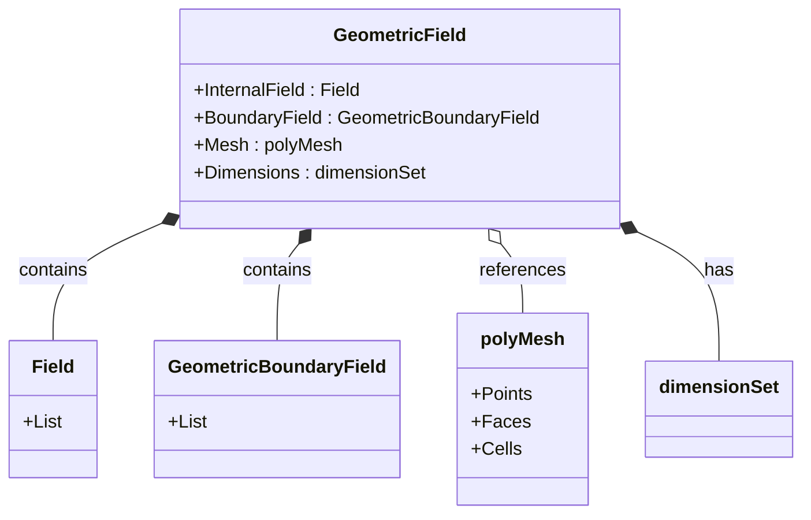

# GeometricFields - Overview

ภาพรวม GeometricField ใน OpenFOAM — หัวใจของ CFD Data

> **ทำไม GeometricField สำคัญที่สุด?**
> - **ทุก variable (p, U, T) คือ GeometricField**
> - รวม Values + Mesh + Dimensions + BCs ในที่เดียว
> - เข้าใจ GeometricField = เข้าใจ OpenFOAM data model

---

## Overview

> **💡 GeometricField = Field + Mesh + Dimensions + Boundary Conditions**
>
> ไม่ใช่แค่ตัวเลข แต่คือ "physical quantity บน mesh"



---

## 1. Template Structure

```cpp
template<class Type, template<class> class PatchField, class GeoMesh>
class GeometricField : public DimensionedField<Type, GeoMesh>
```

| Parameter | Purpose |
|-----------|---------|
| `Type` | scalar, vector, tensor |
| `PatchField` | Boundary handling |
| `GeoMesh` | volMesh, surfaceMesh |

---

## 2. Common Types

### Volume Fields

| Alias | Full Type |
|-------|-----------|
| `volScalarField` | `GeometricField<scalar, fvPatchField, volMesh>` |
| `volVectorField` | `GeometricField<vector, fvPatchField, volMesh>` |
| `volTensorField` | `GeometricField<tensor, fvPatchField, volMesh>` |

### Surface Fields

| Alias | Full Type |
|-------|-----------|
| `surfaceScalarField` | `GeometricField<scalar, fvsPatchField, surfaceMesh>` |
| `surfaceVectorField` | `GeometricField<vector, fvsPatchField, surfaceMesh>` |

---

## 3. Creating Fields

### From File

```cpp
volScalarField p
(
    IOobject("p", runTime.timeName(), mesh, IOobject::MUST_READ),
    mesh
);
```

### With Initial Value

```cpp
volVectorField U
(
    IOobject("U", runTime.timeName(), mesh, IOobject::NO_READ),
    mesh,
    dimensionedVector("U", dimVelocity, vector::zero)
);
```

---

## 4. Field Access

### Internal

```cpp
// Access cell values
forAll(T, cellI)
{
    T[cellI] = computeT(cellI);
}
```

### Boundary

```cpp
// Access patch values
forAll(T.boundaryField(), patchI)
{
    T.boundaryFieldRef()[patchI] = patchValue;
}
```

---

## 5. Module Contents

| File | Topic |
|------|-------|
| 01_Introduction | Basics |
| 02_Design_Philosophy | Architecture |
| 03_Inheritance | Class hierarchy |
| 04_Field_Lifecycle | Creation/destruction |
| 05_Mathematical | Type theory |
| 06_Pitfalls | Common errors |
| 07_Summary | Exercises |

---

## Quick Reference

| Type | Location |
|------|----------|
| `vol*Field` | Cell centers |
| `surface*Field` | Face centers |
| `point*Field` | Vertices |

---

## 🧠 Concept Check

<details>
<summary><b>1. volScalarField vs surfaceScalarField?</b></summary>

- **vol**: Cell-centered (p, T)
- **surface**: Face-centered (phi)
</details>

<details>
<summary><b>2. ทำไมต้องแยก internal/boundary?</b></summary>

- **Internal**: Contiguous → cache efficient
- **Boundary**: Per-patch → flexible BC
</details>

<details>
<summary><b>3. dimensionSet ทำอะไร?</b></summary>

**Track units** → ป้องกัน dimension mismatch
</details>

---

## 📖 เอกสารที่เกี่ยวข้อง

- **Introduction:** [01_Introduction.md](01_Introduction.md)
- **Design:** [02_Design_Philosophy.md](02_Design_Philosophy.md)