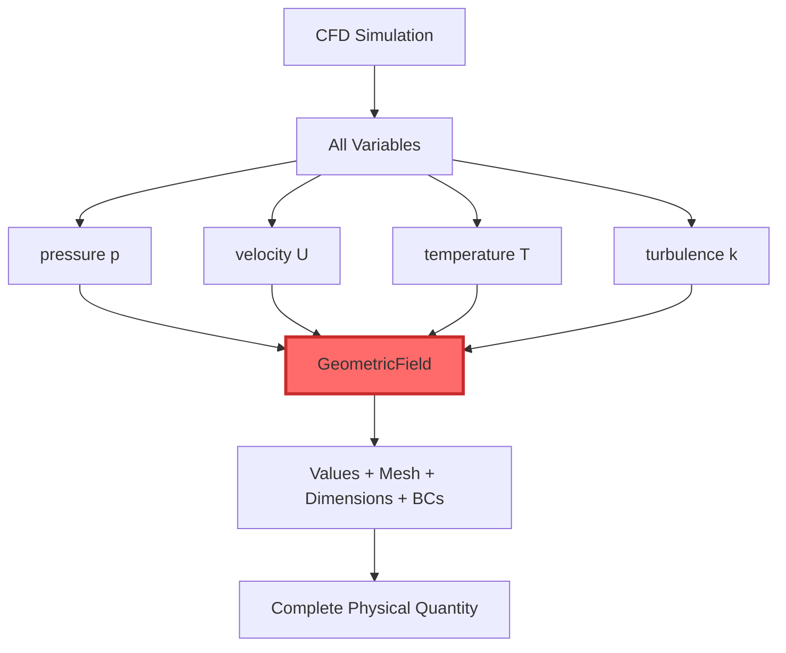
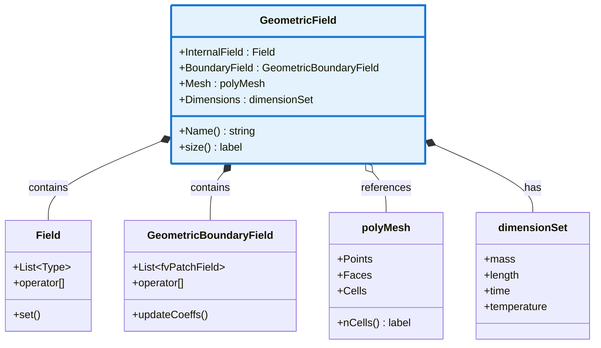
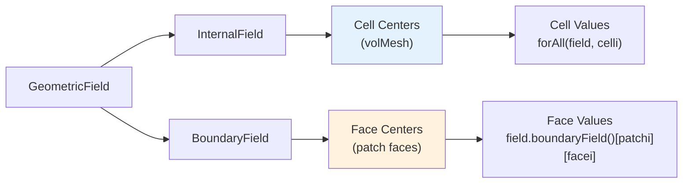
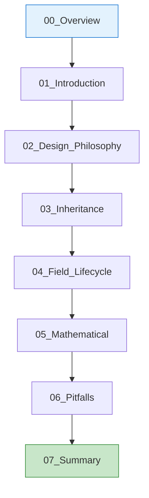

# GeometricFields - Overview

ภาพรวม GeometricField ใน OpenFOAM — หัวใจของ CFD Data

---

## 🎯 Learning Objectives | วัตถุประสงค์การเรียนรู้

**หลังจากอ่านบทนี้ ผู้อ่านจะสามารถ:**
After completing this chapter, readers will be able to:

1. **อธิบาย** ความสำคัญของ GeometricField ใน OpenFOAM data model
   **Explain** the importance of GeometricField in OpenFOAM data model

2. **ระบุ** ส่วนประกอบหลักของ GeometricField (Values + Mesh + Dimensions + BCs)
   **Identify** the main components of GeometricField

3. **แยกแยะ** ความแตกต่างระหว่าง volume fields และ surface fields
   **Distinguish** between volume fields and surface fields

4. **เขียน** โค้ดสำหรับสร้างและเข้าถึง GeometricField พื้นฐาน
   **Write** code to create and access basic GeometricField

5. **ตีความ** template parameter ของ GeometricField
   **Interpret** template parameters of GeometricField

---

## ทำไมสำคัญ? | Why Important?

### 💡 Why GeometricField is the Most Critical Concept in OpenFOAM



**ทำไมต้องเข้าใจ GeometricField?**

1. **ทุก CFD variable คือ GeometricField**
   - pressure, velocity, temperature, turbulence quantities
   - ถ้าไม่เข้าใจ GeometricField = ไม่เข้าใจ OpenFOAM

2. **รวมทุกอย่างที่จำเป็นใน object เดียว**
   ```
   GeometricField = Physical Quantity + Mesh Location + Dimensions + Boundary Conditions
   ```

3. **ความเข้าใจ GeometricField = ความสามารถในการ custom OpenFOAM**
   - เขียน boundary conditions ใหม่
   - สร้าง custom solvers
   - extend OpenFOAM functionality

### CFD Consequences ของการไม่เข้าใจ GeometricField

| ❌ ไม่เข้าใจ | ✅ เข้าใจ | ผลกระทบ |
|------------|---------|----------|
| สร้าง field ผิด mesh type | เลือก vol/surface ถูกต้อง | **Simulation crash หรือ ผลลัพธ์ผิด** |
| ไม่ set dimensions | dimensionSet ถูกต้อง | **Dimension mismatch ไม่ถูก detect** |
| ไม่เข้าใจ boundary field | handle BCs ถูกต้อง | **Boundary conditions ไม่ทำงาน** |

---

## Overview

### 📐 What is GeometricField?



**GeometricField** ไม่ใช่แค่ array ของตัวเลข แต่คือ **"physical quantity บน mesh"** ที่มีทุกสิ่งที่จำเป็น:

```cpp
// ตัวอย่าง: volScalarField p (pressure at cell centers)
GeometricField<scalar, fvPatchField, volMesh> p
```

ประกอบด้วย:
- **Values**: scalar values ที่ cell centers
- **Mesh**: reference ไปยัง volMesh (cell locations)
- **Dimensions**: [M⁻¹ L⁻¹ T⁻²] (pressure units)
- **Boundary Conditions**: วิธีการ handle ที่แต่ละ patch

---

## 1. Template Structure

### 🔧 Template Parameters

```cpp
template<class Type, template<class> class PatchField, class GeoMesh>
class GeometricField : public DimensionedField<Type, GeoMesh>
```

### ตาราง Template Parameters

| Parameter | Type | ตัวอย่าง | คำอธิบาย | Example |
|-----------|------|---------|----------|---------|
| `Type` | template parameter | `scalar`, `vector`, `tensor`, `symmTensor` | **ชนิดข้อมูล** ที่เก็บ | **Data type** stored |
| `PatchField` | template template parameter | `fvPatchField`, `fvsPatchField` | **Boundary field behavior** | **How boundary is handled** |
| `GeoMesh` | class | `volMesh`, `surfaceMesh` | **Mesh location** type | **Where on mesh** (cell/face) |

### 💡 Why Three Parameters?

| Parameter | Purpose | ถ้าผิด = | If Wrong = |
|-----------|---------|----------|------------|
| `Type` | Physical quantity type | ไม่ match กับ physics | Wrong physics |
| `PatchField` | Boundary behavior | BCs ไม่ work | BCs fail |
| `GeoMesh` | Mesh location | ผิด position บน mesh | Wrong mesh position |

**Example combinations:**

```cpp
// Volume field (cell-centered) - สำหรับ conservation laws
GeometricField<scalar, fvPatchField, volMesh>  // volScalarField

// Surface field (face-centered) - สำหรับ fluxes
GeometricField<scalar, fvsPatchField, surfaceMesh>  // surfaceScalarField

// Point field (vertex-centered) - สำหรับ visualization
GeometricField<vector, pointPatchField, pointMesh>  // pointVectorField
```

---

## 2. Common Types

### 📊 Type Aliases ที่ใช้บ่อยใน OpenFOAM

### Volume Fields (Cell-Centered)

```cpp
// Full definitions
using volScalarField = GeometricField<scalar, fvPatchField, volMesh>;
using volVectorField = GeometricField<vector, fvPatchField, volMesh>;
using volTensorField = GeometricField<tensor, fvPatchField, volMesh>;
using volSymmTensorField = GeometricField<symmTensor, fvPatchField, volMesh>;
```

| Alias | Full Type | ใช้สำหรับ | Used For |
|-------|-----------|-----------|----------|
| `volScalarField` | `GeometricField<scalar, fvPatchField, volMesh>` | p, T, k, epsilon, alpha | pressure, temperature, turbulence |
| `volVectorField` | `GeometricField<vector, fvPatchField, volMesh>` | U, DU, UMean | velocity, displacement |
| `volTensorField` | `GeometricField<tensor, fvPatchField, volMesh>` | gradU, tau | velocity gradient, stress tensor |

### Surface Fields (Face-Centered)

```cpp
// Full definitions
using surfaceScalarField = GeometricField<scalar, fvsPatchField, surfaceMesh>;
using surfaceVectorField = GeometricField<vector, fvsPatchField, surfaceMesh>;
```

| Alias | Full Type | ใช้สำหรับ | Used For |
|-------|-----------|-----------|----------|
| `surfaceScalarField` | `GeometricField<scalar, fvsPatchField, surfaceMesh>` | phi, meshPhi | volumetric flux, mesh motion flux |
| `surfaceVectorField` | `GeometricField<vector, fvsPatchField, surfaceMesh>` | face fluxes | face flux vectors |

### Point Fields (Vertex-Centered)

```cpp
using pointScalarField = GeometricField<scalar, pointPatchField, pointMesh>;
using pointVectorField = GeometricField<vector, pointPatchField, pointMesh>;
```

| ใช้สำหรับ | Used For |
|-----------|----------|
| Visualization (ParaView) | Visualization |
| Mesh motion | Mesh deformation |
| Particle tracking | Lagrangian particles |

---

## 3. Creating Fields

### 📝 Field Creation Methods

### Method 1: Read from File (MUST_READ)

```cpp
// อ่านจาก file ที่ time directory (0/, 1.5/, 2.0/, ...)
volScalarField p
(
    IOobject
    (
        "p",                      // field name
        runTime.timeName(),       // time directory
        mesh,                     // database (mesh)
        IOobject::MUST_READ,      // ต้องอ่านจาก file
        IOobject::AUTO_WRITE      // auto write เมื่อ time changes
    ),
    mesh
);

// อ่านจาก file: 0/p
dimensions      [0 2 -2 0 0 0 0];
internalField   uniform 0;
boundaryField
{
    inlet
    {
        type            fixedValue;
        value           uniform 0;
    }
    outlet
    {
        type            zeroGradient;
    }
}
```

### Method 2: Create with Initial Value (NO_READ)

```cpp
// สร้างใหม่พร้อมค่าเริ่มต้น
volVectorField U
(
    IOobject
    (
        "U",                      // field name
        runTime.timeName(),
        mesh,
        IOobject::NO_READ,        // ไม่อ่านจาก file
        IOobject::AUTO_WRITE
    ),
    mesh,
    dimensionedVector("U", dimVelocity, vector::zero)  // initial value: (0 0 0)
);
```

### Method 3: Copy from Existing Field

```cpp
// Copy constructor
volScalarField T2(T1);  // T2 เป็น copy ของ T1

// หรือใช้ operator=
volScalarField T3
(
    IOobject("T3", runTime.timeName(), mesh),
    T1  // copy values from T1
);
```

### Method 4: Create from Components (Advanced)

```cpp
// สร้างจาก internal field + boundary fields
volScalarField T
(
    IOobject("T", runTime.timeName(), mesh, IOobject::NO_READ),
    mesh,
    dimensionedScalar("T", dimTemperature, 300),  // internal value
    fvPatchField<scalar>::calculatedType()        // boundary types
);

// Set boundary values แยก
T.boundaryFieldRef()[inletPatchID] = 350;
T.boundaryFieldRef()[outletPatchID] = 300;
```

### 📋 IOobject Options Comparison

| Option | ความหมาย | Meaning | ใช้เมื่อ | Use When |
|--------|----------|---------|----------|----------|
| `MUST_READ` | ต้องมี file | File must exist | Reading initial/boundary conditions | Initial conditions |
| `READ_IF_PRESENT` | อ่านถ้ามี | Read if exists | Optional restart | Optional restart |
| `NO_READ` | ไม่อ่าน | Don't read | Creating new field | New fields |
| `AUTO_WRITE` | auto save | Auto save | Most fields | Standard fields |
| `NO_WRITE` | ไม่ save | Don't save | Temporary fields | Temporary/calculated |

---

## 4. Field Access

### 🔍 Accessing Field Data

### Internal Field Access (Cell Values)

```cpp
// Method 1: Direct indexing (fast)
forAll(T, cellI)
{
    T[cellI] = computeT(cellI);  // T[cellI] คือ cell value
}

// Method 2: Iterator (STL-style)
for (auto& val : T)
{
    val = someCalculation(val);
}

// Method 3: Raw pointer (fastest, ใช้ด้วยความระมัดระวัง)
scalar* TPtr = T.begin();
for (label cellI = 0; cellI < T.size(); ++cellI)
{
    TPtr[cellI] = computeT(cellI);
}
```

### Boundary Field Access (Patch Values)

```cpp
// Access ทั้ง patch ทีเดียว
forAll(T.boundaryField(), patchI)
{
    // Get reference to patch (for modification)
    fvPatchScalarField& patchField = T.boundaryFieldRef()[patchI];
    
    // Loop over faces in this patch
    forAll(patchField, faceI)
    {
        patchField[faceI] = boundaryValue;
    }
}

// Access patch โดยระบุชื่อ
label inletPatchID = mesh.boundaryMesh().findPatchID("inlet");
T.boundaryFieldRef()[inletPatchID] = 350;  // set all faces to 350
```

### Face Values (Internal + Boundary)

```cpp
// Surface field: face values
surfaceScalarField phi(...);

// Internal faces
forAll(phi, faceI)
{
    phi[faceI] = fluxValue;
}

// Boundary faces
forAll(phi.boundaryField(), patchI)
{
    forAll(phi.boundaryField()[patchI], faceI)
    {
        phi.boundaryFieldRef()[patchI][faceI] = boundaryFlux;
    }
}
```

### 📐 Mesh Position Reference



| Field Type | Location | Access Pattern | Size |
|------------|----------|----------------|------|
| `vol*Field` | Cell centers | `field[cellI]` | `mesh.nCells()` |
| `surface*Field` | Face centers | `field[faceI]` | `mesh.nFaces()` |
| `point*Field` | Vertices | `field[pointI]` | `mesh.nPoints()` |

---

## 5. Module Contents

### 📚 Learning Path สำหรับ GeometricFields

| ไฟล์ File | หัวข้อ Topic | คำอธิบาย Description | ความสำคัญ Importance |
|-----------|-------------|---------------------|-------------------|
| **01_Introduction** | Basics | พื้นฐาน GeometricField | ⭐⭐⭐⭐⭐ |
| **02_Design_Philosophy** | Architecture | Design decisions และ trade-offs | ⭐⭐⭐⭐ |
| **03_Inheritance** | Class hierarchy | Parent classes และ inheritance | ⭐⭐⭐⭐ |
| **04_Field_Lifecycle** | Creation/destruction | Memory management | ⭐⭐⭐ |
| **05_Mathematical** | Type theory | Template metaprogramming | ⭐⭐⭐ |
| **06_Pitfalls** | Common errors | Bugs ที่เจอบ่อย | ⭐⭐⭐⭐⭐ |
| **07_Summary** | Exercises | แบบฝึกหัด | ⭐⭐⭐⭐ |



---

## Quick Reference

### 📋 Field Location Quick Reference

| Type | Mesh Location | Mathematical Position | Common Uses |
|------|--------------|----------------------|-------------|
| `vol*Field` | Cell centers | Ωᶜ (cell centers) | p, U, T, k, ε, α |
| `surface*Field` | Face centers | Ωᶠ (face centers) | φ (flux), ϕ |
| `point*Field` | Vertices | Ωᵖ (points) | Visualization, mesh motion |

### 🔗 Related Modules

- **Previous:** [04_Mesh Classes](../04_MESH_CLASSES/00_Overview.md) - Mesh hierarchy
- **Next:** [01_Introduction](01_Introduction.md) - GeometricField basics
- **See also:** [Dimensioned Types](../02_DIMENSIONED_TYPES/00_Overview.md) - dimensionSet ใน GeometricField

---

## 🧠 Concept Check

<details>
<summary><b>1. volScalarField vs surfaceScalarField - อะไรต่างกัน?</b></summary>

### ✅ คำตอบ Answer:

| ประเด็น Point | volScalarField | surfaceScalarField |
|---------------|----------------|--------------------|
| **Location** | Cell centers | Face centers |
| **Mesh** | volMesh | surfaceMesh |
| **PatchField** | fvPatchField | fvsPatchField |
| **Common use** | p, T, U, k | φ (flux), meshΦ |
| **Size** | nCells | nFaces |

**CFD implications:**
- `volScalarField` → สำหรับ **conservation variables** (mass, momentum, energy)
- `surfaceScalarField` → สำหรับ **fluxes** ที่ผ่าน faces (φ = U·S)

</details>

<details>
<summary><b>2. ทำไมต้องแยก internal field กับ boundary field?</b></summary>

### ✅ คำตอบ Answer:

| Internal Field | Boundary Field |
|----------------|----------------|
| **Contiguous memory** → cache efficient | **Per-patch storage** → flexible BCs |
| **All cells together** → single array | **Each patch separate** → different BC types |
| **Physics: conservation laws** | **Physics: boundary conditions** |

```cpp
// Internal: 1D array
internalField: [cell0, cell1, cell2, ..., cellN]

// Boundary: List of patches
boundaryField: [patch0_faces, patch1_faces, ..., patchM_faces]
```

**ทำไมสำคัญ?**
- **Performance**: Internal field access → O(1) with cache locality
- **Flexibility**: Boundary fields → support different BC types per patch
- **Mathematics**: Separate treatment in finite volume method

</details>

<details>
<summary><b>3. dimensionSet ทำอะไรใน GeometricField?</b></summary>

### ✅ คำตอบ Answer:

**dimensionSet** = unit tracking system ของ OpenFOAM

```cpp
dimensionSet(1, -1, -2, 0, 0, 0, 0)
//           Mass Length Time Temperature Current Amount Luminous
//           [M]   [L]    [T]   [Θ]       [I]     [N]    [J]
//           ↑    ↑      ↑
//           kg   m/s    s²   = Force (Newtons)
```

**ทำไมสำคัญ?**

| Benefit | ตัวอย่าง Example |
|---------|------------------|
| **Prevent bugs** | `p + U` → compile error (pressure ≠ velocity) |
| **Auto scaling** | Convert units automatically |
| **Documentation** | Self-documenting code |

```cpp
// ❌ Dimension mismatch - compile error
volScalarField wrong = p + U;  // [M⁻¹L⁻¹T⁻²] + [LT⁻¹] = error!

// ✅ Correct - dimensions match
volScalarField rho = p / (R * T);  // Check: [M⁻¹L⁻¹T⁻²] / ([J/kg/K]·[K]) = [ML⁻³]
```

</details>

<details>
<summary><b>4. Template parameters: ทำไมต้อง 3 parameters?</b></summary>

### ✅ คำตอบ Answer:

```cpp
template<class Type, template<class> class PatchField, class GeoMesh>
class GeometricField
```

| Parameter | หน้าที่ Role | ถ้าผิด Wrong Result |
|-----------|---------------|---------------------|
| `Type` | Data type (scalar/vector) | Wrong physics |
| `PatchField` | Boundary behavior | BCs don't work |
| `GeoMesh` | Mesh location | Wrong mesh position |

**ตัวอย่าง:**

```cpp
// Pressure: scalar data, cell-centered, finite volume BC
GeometricField<scalar, fvPatchField, volMesh>  // ✅ Correct

// ❌ Wrong: vector pressure (ไม่มีนัย!)
GeometricField<vector, fvPatchField, volMesh>  

// ❌ Wrong: pressure on faces (ไม่สมดุล mass!)
GeometricField<scalar, fvsPatchField, surfaceMesh>
```

**Why 3 parameters?** → **Maximum flexibility + type safety**
- Change `Type` → different physics
- Change `PatchField` → different boundary behavior
- Change `GeoMesh` → different mesh discretization

</details>

---

## 🔑 Key Takeaways | สรุปสำคัญ

### 🎯 Core Concepts

1. **GeometricField = Everything** 
   - Physical quantity + Mesh location + Dimensions + Boundary conditions
   - เข้าใจ GeometricField = เข้าใจ OpenFOAM data model

2. **Three Template Parameters** คือ Core Design:
   ```
   GeometricField<Type, PatchField, GeoMesh>
                   ↓      ↓           ↓
                Data   Boundary    Location
   ```

3. **Internal vs Boundary Fields**:
   - Internal = contiguous (cache efficient)
   - Boundary = per-patch (flexible BCs)

4. **Field Types ตาม Mesh Location**:
   - `vol*Field` → cell centers (p, U, T)
   - `surface*Field` → face centers (φ, flux)
   - `point*Field` → vertices (visualization)

### 💻 Practical Tips

| Tip | Description |
|-----|-------------|
| **Read from file** | Use `MUST_READ` for initial conditions |
| **Create new** | Use `NO_READ` with initial value |
| **Access cells** | `forAll(field, cellI)` or iterators |
| **Access patches** | `field.boundaryFieldRef()[patchID]` |
| **Check dimensions** | `field.dimensions()` returns dimensionSet |

### ⚠️ Common Pitfalls

1. **Wrong mesh type** → `volScalarField` vs `surfaceScalarField`
2. **Forgot dimensions** → dimension mismatch bugs
3. **Boundary access** → use `boundaryFieldRef()` for modification
4. **IOobject flags** → `MUST_READ` vs `READ_IF_PRESENT` vs `NO_READ`

### 🔗 Continue Learning

- **Next**: [01_Introduction](01_Introduction.md) - Deep dive into GeometricField basics
- **See also**: [Dimensioned Types](../02_DIMENSIONED_TYPES/00_Overview.md) - Unit system
- **Related**: [Mesh Classes](../04_MESH_CLASSES/00_Overview.md) - Mesh hierarchy

---

## 📖 เอกสารที่เกี่ยวข้อง | Related Documents

### ใน Module เดียวกัน (Same Module)
- **01_Introduction.md** → พื้นฐาน GeometricField แบบละเอียด
- **02_Design_Philosophy.md** → Design decisions และ architecture
- **03_Inheritance.md** → Class hierarchy และ parent classes
- **06_Pitfalls.md** → Common bugs และวิธีแก้

### จาก Modules อื่น (Other Modules)
- **[Dimensioned Types](../02_DIMENSIONED_TYPES/00_Overview.md)** → dimensionSet ใน GeometricField
- **[Mesh Classes](../04_MESH_CLASSES/00_Overview.md)** → polyMesh, fvMesh hierarchy
- **[Containers & Memory](../03_CONTAINERS_MEMORY/00_Overview.md)** → Memory management

### Cross-Reference Links
- GeometricField inheritance → `02_Inheritance.md:15`
- dimensionSet usage → `../02_DIMENSIONED_TYPES/00_Overview.md:120`
- Field lifecycle → `04_Field_Lifecycle.md:45`
- Common pitfalls → `06_Pitfalls.md:10`