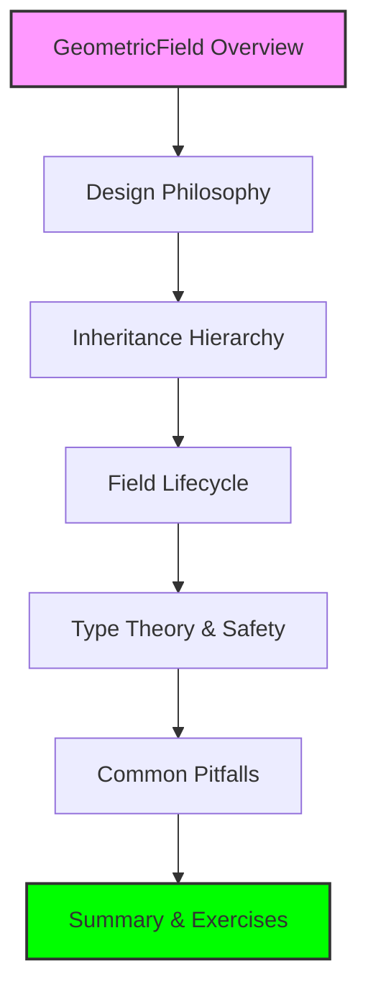

# โมดูล 05.05: Fields และ GeometricFields ใน OpenFOAM

> [!INFO] **ภาพรวมโมดูล**
> โมดูลนี้ศึกษา **GeometricField** ซึ่งเป็นหัวใจของการประมวลผลข้อมูลใน OpenFOAM — ออบเจกต์ที่รวมเอาข้อมูลเชิงตัวเลข เรขาคณิตของเมช และมิติทางฟิสิกส์เข้าด้วยกันอย่างสมบูรณ์

---

## แผนภาพโดยรวม



> **Figure 1:** แผนผังลำดับการเรียนรู้ในโมดูลเรื่องฟิลด์และฟิลด์เรขาคณิต (GeometricField) ครอบคลุมตั้งแต่สถาปัตยกรรมพื้นฐานไปจนถึงทฤษฎีประเภททางคณิตศาสตร์และการแก้ปัญหาขั้นสูง

---

## วัตถุประสงค์การเรียนรู้

- เข้าใจความแตกต่างระหว่าง `DimensionedField` และ `GeometricField`
- สามารถวิเคราะห์ลำดับชั้นการสืบทอดที่ซับซ้อนของคลาสฟิลด์ได้
- เข้าใจกลไกการทำงานของเงื่อนไขขอบเขต (Boundary Conditions) ที่ฝังอยู่ในฟิลด์
- สามารถเขียนโค้ดเพื่อจัดการฟิลด์ได้อย่างมีประสิทธิภาพและปลอดภัย
- รู้วิธีการดีบักปัญหาความไม่สอดคล้องของมิติในระดับสูง

---

## หัวข้อหลัก

1. **ลำดับชั้นคลาส Field (Inheritance Hierarchy)**: การสืบทอดจาก `List` → `Field` → `GeometricField`
2. **กรอบงานคณิตศาสตม์ (Mathematical Framework)**: การดำเนินการ Gradient, Divergence และ Laplacian บนฟิลด์
3. **Interpolation Schemes**: การประมาณค่าระหว่างจุดศูนย์กลางเซลล์และหน้า
4. **Boundary Conditions**: การจัดการเงื่อนไขขอบเขตที่ฝังตัวในฟิลด์
5. **Field Algebra**: พีชคณิตของฟิลด์และการประกอบเมทริกซ์
6. **ประสิทธิภาพและการจัดการหน่วยความำ**: การใช้ `tmp` และระบบ Reference Counting
7. **สรุปและแบบฝึกหัด (Summary & Exercises)**

---

## 1. ประเภท Field และลำดับชั้น

**ระบบการจัดการ field ของ OpenFOAM** เป็นพื้นฐานของการคำนวณ CFD โดยให้โครงสร้างลำดับชั้นสำหรับการจัดการข้อมูลการคำนวณข้ามแบบจำลองการกระจายต่างๆ และประเภท entity ฟิลด์

### 1.1 Fundamental Field Classes

**ลำดับชั้น field หลัก** ใน OpenFOAM ทำตามสถาปัตยกรรมแบบเลเยอร์:

```cpp
// Base field template classes
template<class Type>
class Field : public List<Type>
{
    // Stores field data as a list of values
    // Provides basic field operations and access
};

template<class Type, class GeoMesh>
class GeometricField : public DimensionedField<Type, GeoMesh>
{
    // Geometric field with spatial discretization information
    // Contains boundary conditions and interpolation functions
};
```

> **คำอธิบาย:**
> - `Field<Type>`: คลาสพื้นฐานที่สืบทอดจาก `List<Type>` ใช้เก็บข้อมูลฟิลด์เป็นลิสต์ของค่า
> - `GeometricField<Type, GeoMesh>`: คลาสที่เพิ่มข้อมูลเรขาคณิตและเงื่อนไขขอบเขต
>
> **แนวคิดสำคัญ:**
> - Layered Architecture: การออกแบบแบบเลเยอร์ช่วยแยกความรับผิดชอบ
> - Template-based Design: ใช้เทมเพลตเพื่อความยืดหยุ่นในประเภทข้อมูล

**ความแตกต่างที่สำคัญ** ระหว่าง `Field<Type>` และ `GeometricField<Type, GeoMesh>` อยู่ในบริบทการคำนวณ:

- **`Field<Type>`**: เป็นคอนเทนเนอร์ข้อมูลบริสุทธิ์โดยไม่มีบริบททางเรขาคณิต
- **`GeometricField<Type, GeoMesh>`**: คอนเทนเนอร์ข้อมูลที่มีข้อมูลการกระจายทางเรขาคณิต

### 1.2 Volume Fields

**Volume fields** แทนปริมาณที่นิยามที่จุดศูนย์กลางของเซลล์:

```cpp
// Volume field specializations
typedef GeometricField<scalar, fvPatchField, volMesh> volScalarField;
typedef GeometricField<vector, fvPatchField, volMesh> volVectorField;
typedef GeometricField<tensor, fvPatchField, volMesh> volTensorField;
typedef GeometricField<symmTensor, fvPatchField, volMesh> volSymmTensorField;
```

> **คำอธิบาย:**
> - `volScalarField`: ฟิลด์สเกลาร์บนจุดศูนย์กลางเซลล์ (เช่น ความดัน, อุณหภูมิ)
> - `volVectorField`: ฟิลด์เวกเตอร์บนจุดศูนย์กลางเซลล์ (เช่น ความเร็ว)
> - `volTensorField`: ฟิลด์เทนเซอร์บนจุดศูนย์กลางเซลล์
>
> **แนวคิดสำคัญ:**
> - Finite Volume Method: ข้อมูลถูกจัดเก็บที่จุดศูนย์กลางเซลล์
> - Type Specialization: การกำหนดประเภทเฉพาะเพื่อความสะดวกในการใช้งาน

### 1.3 Surface Fields

**Surface fields** แทนปริมาณที่นิยามบนพื้นผิวของเซลล์:

```cpp
// Surface field specializations
typedef GeometricField<scalar, fvsPatchField, surfaceMesh> surfaceScalarField;
typedef GeometricField<vector, fvsPatchField, surfaceMesh> surfaceVectorField;
```

> **คำอธิบาย:**
> - `surfaceScalarField`: ฟิลด์สเกลาร์บนหน้าเซลล์ (เช่น flux)
> - `surfaceVectorField`: ฟิลด์เวกเตอร์บนหน้าเซลล์
>
> **แนวคิดสำคัญ:**
> - Face-centered Values: ข้อมูลบนหน้าเซลล์ใช้สำหรับการคำนวณ flux
> - Interpolation: ค่าบนหน้าเซลล์ได้จากการประมาณค่าจากจุดศูนย์กลาง

---

## 2. Field Operations และกรอบงานคณิตศาสตม์

**OpenFOAM fields** รองรับชุดของการดำเนินการทางคณิตศาสตม์อย่างครบถ้วน

### 2.1 Gradient Operations

**Gradient operator** แปลง volume fields เป็น surface fields:

$$\nabla \phi = \frac{\partial \phi}{\partial x_i} \mathbf{e}_i$$

ใน OpenFOAM:

```cpp
// Gradient of a scalar field
volVectorField gradPhi = fvc::grad(phi);

// For general tensor fields
template<class Type>
GeometricField<typename outerProduct<vector, Type>::type, fvPatchField, volMesh>
grad(const GeometricField<Type, fvPatchField, volMesh>& vf);
```

> **คำอธิบาย:**
> - `fvc::grad(phi)`: คำนวณ gradient ของฟิลด์สเกลาร์
> - `fvc`: Finite Volume Calculus - การดำเนินการ explicit
> - Template function: ฟังก์ชันเทมเพลตรองรับหลายประเภทข้อมูล
>
> **แนวคิดสำคัญ:**
> - Gauss Theorem: ใช้ทฤษฎีบทของเกาส์ในการคำนวณ
> - Type Traits: `outerProduct<vector, Type>::type` กำหนดประเภทผลลัพธ์

**การดำเนินการ gradient** ใช้ทฤษฎีบทของ Gauss:

$$\int_V \nabla \phi \, \mathrm{d}V = \oint_S \phi \mathbf{n} \, \mathrm{d}S$$

ซึ่งกระจายเป็น:

$$\nabla \phi|_P = \frac{1}{V_P} \sum_f \phi_f \mathbf{S}_f$$

### 2.2 Divergence Operations

**Divergence operator** แปลง surface fields เป็น volume fields:

$$\nabla \cdot \mathbf{F} = \frac{\partial F_i}{\partial x_i}$$

```cpp
// Divergence of a vector field (surfaceScalarField flux)
volScalarField divF = fvc::div(F);
```

> **คำอธิบาย:**
> - `fvc::div(F)`: คำนวณ divergence ของฟิลด์เวกเตอร์
> - Flux Integration: การรวมค่า flux เข้า/ออกของเซลล์
>
> **แนวคิดสำคัญ:**
> - Conservation Law: Divergence แสดงถึงกฎการอนุรักษ์มวล/โมเมนตัม
> - Surface to Volume: แปลงจากค่าบนหน้าเซลล์ไปยังจุดศูนย์กลาง

### 2.3 Laplacian Operations

**Laplacian operator** เป็นพื้นฐานสำหรับเทอร์มการแพร่:

$$\nabla^2 \phi = \nabla \cdot (\nabla \phi)$$

```cpp
// Laplacian with constant diffusivity
volScalarField lapPhi = fvc::laplacian(D, phi);
```

> **คำอธิบาย:**
> - `fvc::laplacian(D, phi)`: คำนวณ Laplacian ด้วยสัมประสิทธิ์การแพร่ D
> - Diffusion Term: ใช้ในสมการการแพร่และสมการนาเวียร์-สโตกส์
>
> **แนวคิดสำคัญ:**
> - Second Derivative: ลาปลาซียันเป็นอนุพันธ์อันดับสอง
> - Diffusion Coefficient: D คือสัมประสิทธิ์การแพร่

---

## 3. Interpolation Schemes และ Field Transformations

### 3.1 Linear Interpolation

**Linear interpolation** สมมติว่ามีการเปลี่ยนแปลงเชิงเส้นระหว่างจุดศูนย์กลางของเซลล์:

$$\phi_f = f_P \phi_P + f_N \phi_N$$

โดยที่ $f_P = \frac{d_{fN}}{d_{PN}}$ และ $f_N = \frac{d_{fP}}{d_{PN}}$

### 3.2 Interpolation Scheme Comparison

| Scheme | Order | Stability | Accuracy | Use Case |
|--------|-------|-----------|----------|----------|
| Linear | 1st | Stable | Moderate | General purpose |
| Quadratic | 2nd | Moderate | High | Smooth flows |
| QUICK | 3rd | Conditional | Very High | Convection-dominated |
| MUSCL | 2nd | High | High | Shock-capturing |

---

## 4. Boundary Conditions และ Field Coupling

### 4.1 Boundary Condition Architecture

**แต่ละ geometric field** รักษาข้อมูลเงื่อนไขขอบเขต:

```cpp
template<class Type, class PatchField, class GeoMesh>
class GeometricField : public DimensionedField<Type, GeoMesh>
{
    // Boundary field container
    GeometricBoundaryField<PatchField, GeoMesh> boundaryField_;

    // Individual boundary patches
    const Field<Type>& boundaryField(const label patchi) const;
    Field<Type>& boundaryField(const label patchi);
};
```

> **คำอธิบาย:**
> - `boundaryField_`: คอนเทนเนอร์ที่เก็บข้อมูลเงื่อนไขขอบเขตทั้งหมด
> - `boundaryField(patchi)`: เข้าถึงข้อมูลขอบเขตของ patch ที่ระบุ
>
> **แนวคิดสำคัญ:**
> - Embedded BCs: เงื่อนไขขอบเขตเป็นส่วนหนึ่งของฟิลด์
> - Patch-based: แต่ละ patch มีเงื่อนไขขอบเขต独立

### 4.2 Common Boundary Condition Types

| Type | Formula | Parameters | Use Case |
|------|---------|------------|----------|
| fixedValue | $\phi = \phi_{specified}$ | Value | Inlet, specified temperature |
| fixedGradient | $\nabla \phi \cdot \mathbf{n} = g_{specified}$ | Gradient | Wall heat flux |
| zeroGradient | $\nabla \phi \cdot \mathbf{n} = 0$ | None | Outlet, symmetry |
| mixed | $\phi = \alpha \phi_{value} + (1-\alpha) \phi_{gradient}$ | valueFraction | Robin conditions |

---

## 5. Field Algebra และ Matrix Assembly

**Fields** รองรับการดำเนินการทางพีชคณิตอย่างครบถ้วน

### 5.1 Implicit vs Explicit Operations

**Explicit Operations:** ค่าถูกคำนวณโดยตรงโดยใช้ค่า field ปัจจุบัน

```cpp
// Explicit convection term
surfaceScalarField phi_f = linearInterpolate<vector>(U) & mesh.Sf();
volScalarField convection = fvc::div(phi_f);
```

> **คำอธิบาย:**
> - `linearInterpolate(U)`: ประมาณค่าความเร็วไปยังหน้าเซลล์
> - `mesh.Sf()`: เวกเตอร์พื้นที่หน้าเซลล์
> - `&`: การคูณดอทโปรดักต์
>
> **แนวคิดสำคัญ:**
> - Explicit Treatment: คำนวณโดยตรงจากค่าใน time step ปัจจุบัน
> - Flux Calculation: คำนวณ flux ผ่านหน้าเซลล์

**Implicit Operations:** เทอร์มที่ส่งผลต่อเมทริกซ์สัมประสิทธิ์

```cpp
// Implicit diffusion term
fvScalarMatrix TEqn
(
    fvm::laplacian(DT, T)  // Implicit treatment
  - fvc::ddt(T)           // Explicit source term
);
```

> **คำอธิบาย:**
> - `fvm::laplacian(DT, T)`: การปฏิบัติ implicit ของเทอร์มการแพร่
> - `fvc::ddt(T)`: การปฏิบัติ explicit ของเทอร์มอนุพันธ์เวลา
> - `fvScalarMatrix`: เมทริกซ์สัมประสิทธิ์สำหรับสมการสเกลาร์
>
> **แนวคิดสำคัญ:**
> - fvm vs fvc: fvm = finite volume method (implicit), fvc = finite volume calculus (explicit)
> - Matrix Assembly: เทอร์ม implicit ถูกแทรกลงในเมทริกซ์

---

## 6. Performance Optimization และ Memory Management

### 6.1 Reference Counting และ Memory Efficiency

**OpenFOAM** ใช้การจัดการหน่วยความำที่ซับซ้อน:

```cpp
// Reference-counted field types
typedef tmp<GeometricField<Type, PatchField, GeoMesh>> tmpGeometricField;

// Automatic memory management
tmp<volScalarField> divU = fvc::div(U);
// tmp object automatically deleted when scope ends
```

> **คำอธิบาย:**
> - `tmp<T>`: เทมเพลตสำหรับการจัดการหน่วยความำอัตโนมัติ
> - Reference Counting: นับจำนวนการอ้างอิงเพื่อลบวัตถุอัตโนมัติ
> - RAII: Resource Acquisition Is Initialization - จัดการทรัพยากรผ่าน lifecycle ของวัตถุ
>
> **แนวคิดสำคัญ:**
> - Memory Efficiency: หลีกเลี่ยงการคัดลอกข้อมูลโดยไม่จำเป็น
> - Automatic Cleanup: ลบวัตถุอัตโนมัติเมื่อไม่มีการอ้างอิง

### 6.2 Field Caching และ Reuse

**การคำนวณ field ทั่วไป** จะถูก cached:

```cpp
// Gradient caching mechanism
const volVectorField& gradU = gradCache.lookup(U);
if (!gradU.valid())
{
    gradU = new volVectorField(fvc::grad(U));
    gradCache.store(U, gradU);
}
```

> **คำอธิบาย:**
> - `gradCache.lookup(U)`: ค้นหา gradient ที่ถูก cached
> - `gradU.valid()`: ตรวจสอบว่ามีค่าที่ถูกต้องหรือไม่
> - `gradCache.store()`: เก็บค่า gradient ไว้ใน cache
>
> **แนวคิดสำคัญ:**
> - Cache Hit: หลีกเลี่ยงการคำนวณซ้ำ
> - Memory vs Speed Trade-off: แลกหน่วยความำเพื่อความเร็ว

---

## 7. Advanced Field Operations

### 7.1 Tensor Field Operations

**Tensor fields** รองรับการดำเนินการเฉพาะ:

```cpp
// Tensor deformation rate
volTensorField D = symm(fvc::grad(U));

// Vorticity tensor
volTensorField W = skew(fvc::grad(U));

// Stress tensor for Newtonian fluid
volSymmTensorField tau = 2 * nu * D;
```

> **คำอธิบาย:**
> - `symm()`: ส่วนสมมาตรของเทนเซอร์
> - `skew()`: ส่วนไม่สมมาตรของเทนเซอร์
> - `nu`: ความหมาน (kinematic viscosity)
>
> **แนวคิดสำคัญ:**
> - Tensor Decomposition: แยกเทนเซอร์เป็นส่วนสมมาตรและไม่สมมาตร
> - Constitutive Relations: ความสัมพันธ์เชิงโครงสร้างของไหล

**Tensor Operation Equations:**
- **Deformation rate**: $\mathbf{D} = \frac{1}{2}(\nabla \mathbf{u} + \nabla \mathbf{u}^T)$
- **Vorticity tensor**: $\mathbf{W} = \frac{1}{2}(\nabla \mathbf{u} - \nabla \mathbf{u}^T)$
- **Stress tensor**: $\boldsymbol{\tau} = 2\mu \mathbf{D}$

---

## 8. Field I/O และ Data Persistence

### 8.1 Field Serialization

**Fields** สามารถเขียนและอ่านจากดิสก์:

```cpp
// Write field to disk
phi.write();

// Read field from disk
volScalarField phi
(
    IOobject
    (
        "phi",
        runTime.timeName(),
        mesh,
        IOobject::MUST_READ,
        IOobject::AUTO_WRITE
    ),
    mesh
);
```

> **คำอธิบาย:**
> - `phi.write()`: เขียนฟิลด์ลงดิสก์
> - `IOobject`: คลาสสำหรับจัดการ input/output
> - `MUST_READ`: ต้องอ่านไฟล์
> - `AUTO_WRITE`: เขียนอัตโนมัติเมื่อจำเป็น
>
> **แนวคิดสำคัญ:**
> - Serialization: แปลงวัตถุเป็นรูปแบบที่เก็บได้
> - Time Directories: แต่ละ time step มี directory ของตัวเอง

---

## 9. Debugging และ Field Diagnostics

### 9.1 Field Validation

**เครื่องมือตรวจสอบ field**:

```cpp
// Check field bounds
scalar minVal = min(phi);
scalar maxVal = max(phi);

// Check for NaN or inf values
if (hasNaN(phi))
{
    FatalErrorIn("field computation") << "NaN detected" << exit(FatalError);
}
```

> **คำอธิบาย:**
> - `min()`/`max()`: หาค่าน้อย/มากสุดในฟิลด์
> - `hasNaN()`: ตรวจสอบค่า NaN
> - `FatalErrorIn`: ระบบจัดการข้อผิดพลาด
>
> **แนวคิดสำคัญ:**
> - Numerical Stability: ตรวจสอบความมั่นคงทางตัวเลข
> - Debugging Tools: เครื่องมือช่วยค้นหาข้อผิดพลาด

### 9.2 Field Statistics และ Analysis

**ความสามารถในการวิเคราะห์ทางสถิติ**:

```cpp
// Field statistics
scalar meanVal = average(phi);
scalar rmsVal = sqrt(sum(phi*phi)/phi.size());
```

> **คำอธิบาย:**
> - `average()`: ค่าเฉลี่ยของฟิลด์
> - `sum()`: ผลรวมของค่าทั้งหมด
> - `phi.size()`: จำนวน element ในฟิลด์
>
> **แนวคิดสำคัญ:**
> - Statistical Analysis: การวิเคราะห์สถิติของฟิลด์
> - RMS: Root Mean Square - ค่าเฉลี่ยกำลังสอง

---

## สรุป

**ระบบ field ของ OpenFOAM** ให้กรอบงานที่ครอบคลุมสำหรับการคำนวณ CFD โดยผสานผสาน:

- **ความเข้มงวดทางคณิตศาสตม์** ผ่านระบบประเภทและการวิเคราะห์มิติ
- **ประสิทธิภาพการคำนวณ** ผ่าน expression templates และ reference counting
- **ความสอดคล้องทางกายภาพ** ผ่านการจัดการ boundary conditions และ mesh-aware operations

**สถาปัตยกรรมที่ใช้เทมเพลต** ทำให้การดำเนินการประเภทที่ปลอดภัยได้ในขณะที่รักษาประสิทธิภาพผ่านการจัดการหน่วยความำที่เพิ่มประสิทธิภาพและการ assembly สัมประสิทธิ์อัตโนมัติ