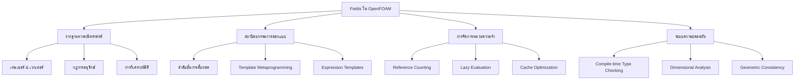
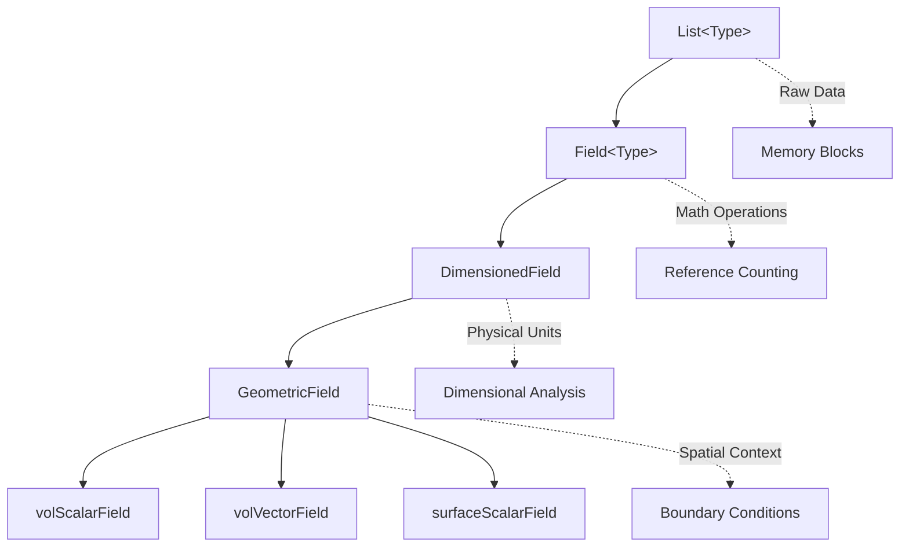
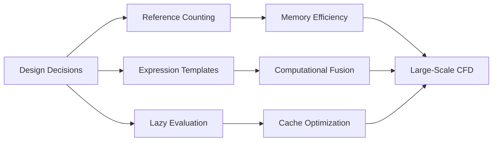

# ฟิลด์ใน OpenFOAM: รากฐานทางคณิตศาสตร์และสถาปัตยกรรม

## บทนำ

**ฟิลด์ (Fields)** คือออบเจ็กต์ทางคณิตศาสตร์พื้นฐานในพลศาสตร์ของไหลเชิงคำนวณ (CFD) ซึ่งแทนปริมาณทางกายภาพเช่น ความเร็ว ความดัน อุณหภูมิ และความเครียด

ระบบฟิลด์ของ OpenFOAM ไม่ใช่เพียงแค่การรวบรวมตัวเลข แต่เป็น **ระบบความปลอดภัยทางคณิตศาสตร์** ที่:
- บังคับใช้กฎฟิสิกส์ในขั้นตอนคอมไพล์
- ป้องกันความไม่สอดคล้องของมิติ
- จัดการความสัมพันธ์ทางหน่วยความจำที่ซับซ้อนระหว่างเซลล์เมชและเงื่อนไขขอบเขต

บทนี้จะอธิบายสถาปัตยกรรมฟิลด์ของ OpenFOAM ผ่านมุมมองของ **"โบราณคดีโค้ด"** — ทำความเข้าใจไม่เพียงแค่ว่าโค้ดทำอะไร แต่ว่าทำไมถึงถูกออกแบบมาลักษณะนี้



---

## รากฐานทางคณิตศาสต์: ฟิลด์เป็นออบเจ็กต์เทนเซอร์

ใน CFD ทุกปริมาณทางกายภาพนั้นเป็นพื้นฐานของ **เทนเซอร์** ในบางอันดับ:

| ประเภท | อันดับเทนเซอร์ | ตัวอย่าง | สัญลักษณ์คณิตศาสตร์ | มิติ SI |
|---------|--------------|---------|-------------------|----------|
| **สเกลาร์** | 0 | ความดัน, อุณหภูมิ, ความหนาแน่น | $p$, $T$, $\rho$ | ขึ้นกับปริมาณ |
| **เวกเตอร์** | 1 | ความเร็ว, โมเมนตัม, แรง | $\mathbf{u}$, $\rho\mathbf{u}$, $\mathbf{f}$ | [L T⁻¹] |
| **เทนเซอร์** | 2 | ความเครียด, อัตราการเสียรูป, เกรเดียนต์ความเร็ว | $\boldsymbol{\tau}$, $\mathbf{D}$, $\nabla\mathbf{u}$ | [L⁻¹ T⁻¹] |
| **เทนเซอร์สูง** | >2 | เทนเซอร์ความหนืด, สภาพนำความร้อนแบบไม่เท่ากัน | - | ซับซ้อน |

**ระบบฟิลด์ของ OpenFOAM** แสดงถึงสิ่งเหล่านี้เป็นออบเจ็กต์ทางเรขาคณิตพร้อมด้วย:
- การดำเนินการทางคณิตศาสตร์ในตัวที่เคารพกฎพีชคณิตเทนเซอร์
- ความจำเป็นสำหรับการรักษาความสอดคล้องทางกายภาพในการดำเนินการเชิงคำนวณหลายล้านครั้ง

> [!INFO] **ทฤษฎีเทนเซอร์ใน OpenFOAM**
> ระบบฟิลด์ใช้ **tensor fields ที่ตระหนักถึงพื้นที่ความโค้ง (manifold-aware)** โดยใช้ template metaprogramming ขั้นสูงใน C++ เพื่อบังคับใช้ **ความสอดคล้องทางเรขาคณิต** และ **ความถูกต้องทางโทโพโลยี** ในระหว่างการคอมไพล์
>
> สำหรับ field $\phi: M \rightarrow \mathbb{R}^n$ บน manifold $M$ (mesh) OpenFOAM บังคับให้:
> $$\text{operation}(\phi_1, \phi_2) \text{ เป็นที่ถูกต้อง } \iff M_1 \cong M_2 \text{ (manifolds เป็น homeomorphic)}$$

---

## ข้อจำกัดทางกายภาพ: กฎการอนุรักษ์

ทุกฟิลด์ใน OpenFOAM ต้องเป็นไปตาม **กฎการอนุรักษ์**:

### การอนุรักษ์มวล

$$\frac{\partial \rho}{\partial t} + \nabla \cdot (\rho\mathbf{u}) = 0$$

**ตัวแปร:**
- $\rho$ = ความหนาแน่น (kg/m³) [M L⁻³]
- $\mathbf{u}$ = เวกเตอร์ความเร็ว (m/s) [L T⁻¹]
- $t$ = เวลา (s) [T]

### การอนุรักษ์โมเมนตัม

$$\rho\frac{\partial \mathbf{u}}{\partial t} + \rho(\mathbf{u} \cdot \nabla)\mathbf{u} = -\nabla p + \mu\nabla^2\mathbf{u} + \mathbf{f}$$

**ตัวแปร:**
- $p$ = ความดัน (Pa) [M L⁻¹ T⁻²]
- $\mu$ = ความหนืดพลศาสตร์ (Pa·s) [M L⁻¹ T⁻¹]
- $\mathbf{f}$ = เวกเตอร์แรงภายนอก (N/m³) [M L⁻² T⁻²]

### การอนุรักษ์พลังงาน

$$\rho c_p\frac{\partial T}{\partial t} + \rho c_p\mathbf{u} \cdot \nabla T = k\nabla^2 T + Q$$

**ตัวแปร:**
- $T$ = อุณหภูมิ (K) [Θ]
- $c_p$ = ความจุความร้อนที่ความดันคงที่ (J/kg·K) [L² T⁻² Θ⁻¹]
- $k$ = ความนำความร้อน (W/m·K) [M L T⁻³ Θ⁻¹]
- $Q$ = แหล่งกำเนิดความร้อน (W/m³) [M L⁻¹ T⁻³]

**สถาปัตยกรรมฟิลด์บังคับใช้ข้อจำกัดเหล่านี้ผ่าน:**

1. **ความสอดคล้องของมิติ**: หน่วยถูกตรวจสอบในขั้นตอนคอมไพล์
2. **ความสอดคล้องทางเรขาคณิต**: การดำเนินการเคารพการแปลงพิกัด
3. **การแบ่งส่วนการอนุรักษ์**: ตัวดำเนินการปริมาตต์จำกัดรักษาการอนุรักษ์ทั่วโลก

> [!TIP] **การดำเนินการเชิงปริพันธ์ใน OpenFOAM**
>
> ระบบฟิลด์รักษาเอกลักษณ์ทางคณิตศาสตร์พื้นฐาน:
>
> **ทฤษฎีบทไล่ระดับ:**
> $$\int_\Omega \nabla\phi\,dV = \oint_{\partial\Omega} \phi\,d\mathbf{S}$$
>
> **ทฤษฎีบทไดเวอร์เจนซ์:**
> $$\int_\Omega \nabla\cdot\mathbf{U}\,dV = \oint_{\partial\Omega} \mathbf{U}\cdot d\mathbf{S}$$
>
> เอกลักษณ์เหล่านี้ถูกบังคับใช้อย่างแม่นยำใน discretization

---

## ความท้าทายทางวิศวกรรม: การจัดการหน่วยความจำ

การจำลอง CFD ทั่วไปประกอบด้วยส่วนประกอบหลายอย่าง:

| ส่วนประกอบ | คำอธิบาย | ความท้าทาย |
|------------|----------|------------|
| **เซลล์เมชหลายล้านเซลล์** | แต่ละเซลล์เก็บค่าฟิลด์ | การใช้หน่วยความจำขนาดใหญ่ |
| **เงื่อนไขขอบเขต** | แต่ละแพตช์ขอบเขตต้องการการจัดการพิเศษ | การจัดการเงื่อนไขที่ซับซ้อน |
| **การวิวัฒนาการตามเวลา** | ฟิลด์เปลี่ยนแปลงตามช่วงเวลา | การจัดเก็บข้อมูลช่วงเวลา |
| **การกระจายแบบขนาน** | ฟิลด์ถูกแบ่งข้ามโปรเซสเซอร์ | การสื่อสารระหว่างโปรเซสเซอร์ |

**OpenFOAM แก้ปัญหานี้ผ่านระบบหน่วยความจำตามลำดับชั้น:**

- **ฟิลด์ทางเรขาคณิต**: เก็บค่าที่จุดศูนย์กลางเซลล์ หน้า และจุด
- **ฟิลด์ขอบเขต**: จัดการเงื่อนไขเฉพาะแพตช์
- **การนับการอ้างอิง**: การจัดการหน่วยความจำอัตโนมัติป้องกันการรั่วไหล
- **การประเมินแบบเกียจคร้าว**: การคำนวณถูกเลื่อนออกไปจนกว่าจำเป็น



---

## ระบบความปลอดภัย: การรับประกันในขั้นตอนคอมไพล์

การเขียนโปรแกรมเทมเพลตของ OpenFOAM สร้าง **ภาษาคณิตศาสตร์ที่ปลอดภัยจากประเภท**

### OpenFOAM Code Implementation

```cpp
// นี่จะไม่คอมไพล์ - มิติที่ไม่เข้ากัน
volScalarField pressure("p", mesh);
volVectorField velocity("U", mesh);
volTensorField result = pressure * velocity; // ข้อผิดพลาด: สเกลาร์ × เวกเตอร์ ≠ เทนเซอร์

// ตัวอย่างที่ถูกต้อง
volVectorField momentum("rhoU", rho * U); // สเกลาร์ × เวกเตอร์ = เวกเตอร์
volScalarField kineticEnergy("kE", 0.5 * magSqr(U)); // เวกเตอร์² = สเกลาร์
```

**สิ่งนี้ป้องกันคลาสของบั๊กทั้งหมด:**

- **ข้อผิดพลาดมิติ**: การบวกความดันเข้ากับความเร็ว
- **ข้อผิดพลาดอันดับเทนเซอร์**: การคำนวณ curl ของฟิลด์สเกลาร์
- **ข้อผิดพลาดทางเรขาคณิต**: การใช้ตัวดำเนินการพื้นผิวกับฟิลด์ปริมาตร

> [!WARNING] **ข้อผิดพลาดที่ถูกป้องกันโดยระบบ Type**
>
> ระบบ field ของ OpenFOAM ป้องกันข้อผิดพลาดรันไทม์ทั้งหมดเหล่านี้:
>
> ```cpp
> // ❌ Dimensional inconsistency
> volScalarField p("p", mesh, dimensionedScalar("p", dimPressure, 0));
> volVectorField U("U", mesh, dimensionedVector("U", dimVelocity, vector::zero));
> auto invalid = p + U;  // Compile error!
>
> // ❌ Tensor rank mismatch
> volScalarField T("T", mesh);
> auto curlT = fvc::curl(T);  // Compile error: curl requires vector field!
>
> // ❌ Geometric inconsistency
> volScalarField cellField("T", mesh);
> surfaceScalarField faceField("phi", mesh);
> auto invalid = cellField + faceField;  // Compile error!
> ```

---

## แนวทางโบราณคดีโค้ด

เพื่อเข้าใจฟิลด์ของ OpenFOAM อย่างแท้จริง เราต้องตรวจสอบ:

1. **การตัดสินใจในการออกแบบ**: ทำไมต้องใช้พอยน์เตอร์ที่นับการอ้างอิง?
2. **รากฐานทางคณิตศาสตร์**: ตัวดำเนินการรักษาการอนุรักษ์อย่างไร?
3. **ผลกระทบด้านประสิทธิภาพ**: การเพิ่มประสิทธิภาพใดเปิดใช้การจำลองในระดับขนาดใหญ่?
4. **วิวัฒนาการทางประวัติศาสตร์**: สถาปัตยกรรมพัฒนาอย่างไร?



บทนี้จะแนะนำคุณผ่านชั้นของการแยกส่วน จากการประกาศฟิลด์ระดับสูงไปจนถึงการจัดการหน่วยความจำระดับต่ำ เผยให้เห็นว่า OpenFOAM แปลง PDEs เชิงนามธรรมเป็นโค้ด C++ ที่มีประสิทธิภาพและขนานได้ซึ่งเคารพกฎพื้นฐานของฟิสิกส์

---

## การวิเคราะห์มิติ: รากฐานความปลอดภัย

### มิติพื้นฐานใน OpenFOAM

OpenFOAM ใช้ระบบการวิเคราะห์มิติอย่างเข้มงวดโดยยึดตามมิติพื้นฐานเจ็ดประการ:

| มิติ | สัญลักษณ์ | หน่วย SI | คำอธิบาย |
|------|------------|-----------|-----------|
| **มวล** | [M] | กิโลกรัม (kg) | หน่วยพื้นฐานสำหรับคุณสมบัติเฉื่อย |
| **ความยาว** | [L] | เมตร (m) | หน่วยวัดเชิงพื้นที่ |
| **เวลา** | [T] | วินาที (s) | หน่วยวัดเชิงเวลา |
| **อุณหภูมิ** | [Θ] | เคลวิน (K) | อุณหภูมิทางอุณหพลศาสตร์ |
| **ปริมาณ** | [N] | โมล (mol) | ปริมาณของสาร |
| **กระแส** | [I] | แอมแปร์ (A) | กระแสไฟฟ้า |
| **ความเข้มแสง** | [J] | แคนเดลา (cd) | ความเข้มแสง |

### การใช้งานใน OpenFOAM

```cpp
// การประกาศมิติใน OpenFOAM
dimensionSet(1, -3, -2, 0, 0, 0, 0)  // [M L⁻³ T⁻²] = ความดัน
dimensionSet(0, 1, -1, 0, 0, 0, 0)    // [L T⁻¹] = ความเร็ว
dimensionSet(1, -1, -2, 0, 0, 0, 0)  // [M L⁻¹ T⁻²] = ความดัน (Pa)
```

### กฎการคำนวณมิติ

#### 1. การบวกและการลบ
$$[A] + [B] = [C] \quad \text{ต้องการ} \quad [A] = [B] = [C]$$

**ตัวอย่าง**:
$$p_1 + p_2 = p_3 \quad \text{ถูกต้องถ้า} \quad [p_1] = [p_2] = [p_3] = [M L^{-1} T^{-2}]$$

#### 2. การคูณ
$$[A] \times [B] = [A + B]$$

**ตัวอย่าง**:
$$F = ma: \quad [M L T^{-2}] = [M] \times [L T^{-2}]$$

#### 3. การหาร
$$[A] / [B] = [A - B]$$

**ตัวอย่าง**:
$$\text{จำนวนเรย์โนลด์: } Re = \frac{\rho V L}{\mu}: \quad [1] = \frac{[M L^{-3}][L T^{-1}][L]}{[M L^{-1} T^{-1}]}$$

#### 4. การยกกำลัง
$$[A]^n = [nA]$$

**ตัวอย่าง**:
$$\text{พื้นที่: } A = L^2: \quad [L^2] = 2[L]$$

> [!INFO] **การตรวจสอบความสอดคล้องของมิติ**
>
> ```cpp
> // ❌ การใช้งานที่ไม่ถูกต้อง
> dimensionedScalar wrongPressure("p", dimVelocity, 101325);  // ข้อผิดพลาด!
>
> // ✅ การใช้งานที่ถูกต้อง
> dimensionedVector velocity("U", dimVelocity, vector(1, 0, 0));
>
> // ✅ เทอมแหล่งความร้อน: [M L⁻¹ T⁻³] = W/m³
> volScalarField heatSource("Q", dimEnergy/(dimVolume*dimTime), mesh);
> ```

---

## สรุป: ฟิลด์เป็นรากฐานของ CFD ใน OpenFOAM

ระบบฟิลด์ของ OpenFOAM แสดงถึงการผสานรวมที่ยอดเยี่ยมระหว่าง:

### ความเข้มงวดทางคณิตศาสตร์
- **เทนเซอร์ types** ที่เข้มงวด: scalar, vector, tensor, symmTensor
- **Dimensional analysis** ในขั้นตอนคอมไพล์
- **การอนุรักษ์** ที่รักษาโดย discretization

### ประสิทธิภาพการคำนวณ
- **Expression templates** สำหรับ zero-cost abstractions
- **Reference counting** สำหรับการจัดการหน่วยความจำอัตโนมัติ
- **Cache optimization** ผ่าน Structure of Arrays layout

### ความปลอดภัยในการทำงาน
- **Compile-time type checking** ป้องกันข้อผิดพลาด
- **Runtime boundary condition enforcement**
- **Automatic dimensional consistency**

บทนี้จะเจาะลึกถึงกลไกเหล่านี้ทั้งหมด เริ่มต้นจากระดับสูงสุดของการประกาศฟิลด์ ไปจนถึงรายละเอียดระดับต่ำของการจัดการหน่วยความจำและการดำเนินการเชิงคณิตศาสตร์

---

## ดำเนินการต่อไป

เพื่อเข้าใจระบบฟิลด์ของ OpenFOAM อย่างลึกซึ้ง แนะนำให้อ่านบทความต่อไปนี้:

- **[[02_🔗_Advanced_Design_Philosophy_Deep_Dive]]** - การวิเคราะห์ปรัชญาการออกแบบขั้นสูงเชิงลึก
- **[[03_🔍_High-Level_Concept_The_Mathematical_Safety_System_Analogy]]** - แนวคิดระดับสูง: ระบบความปลอดภัยทางคณิตศาสตร์
- **[[04_⚙️_Key_Mechanisms_The_Inheritance_Chain]]** - กลไกหลัก: ห่วงโซ่การสืบทอด

แหล่งข้อมูลเพิ่มเติม:
- **[[07_🎯_Why_This_Matters_for_CFD]]** - ความสำคัญต่อ CFD
- **[[12_📐_Mathematical_Formulation_Reference]]** - คู่มือสูตรคณิตศาสตร์
