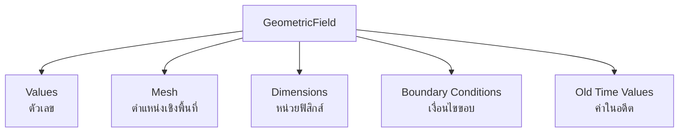
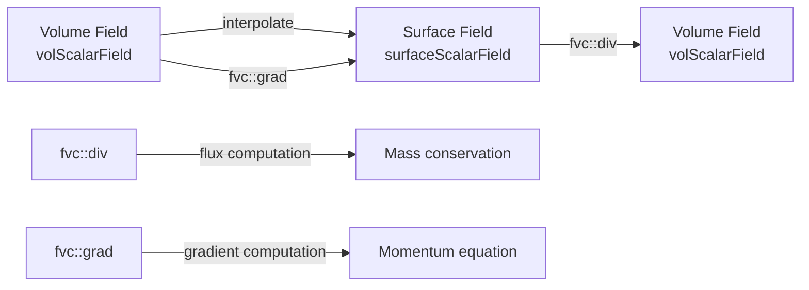

# GeometricFields - Introduction

บทนำ GeometricField — Core Data Structure สำหรับ CFD

---

## 🎯 Learning Objectives | วัตถุประสงค์การเรียนรู้

**After completing this section, you will be able to:**
| หลังจากจบบทนี้ คุณจะสามารถ: |
|:---|
| **✅ Explain** what GeometricField is and how it differs from plain arrays |
| **✅ Understand** the relationship between volume fields (cell-centered) and surface fields (face-centered) |
| **✅ Apply** template parameters to create different field types (scalar, vector, tensor) |
| **✅ Demonstrate** basic field operations including creation, access, and manipulation |
| **✅ Recognize** why GeometricField is essential for CFD programming in OpenFOAM |

---

## Overview

> **💡 GeometricField = Smart Array สำหรับ CFD**
>
> ไม่ใช่แค่ตัวเลข แต่มี mesh, dimensions, BCs, old time ติดมาด้วย

---

## 1. What is GeometricField? | GeometricField คืออะไร?

**GeometricField** is OpenFOAM's fundamental data structure that combines numerical values with geometric and physical context:

### Core Components



| Component | Purpose | หน้าที่ |
|-----------|---------|:---|
| **Values** | Numerical data | ข้อมูลตัวเลข |
| **Mesh** | Spatial location | ตำแหน่งเชิงพื้นที่ |
| **Dimensions** | Physical units | หน่วยฟิสิกส์ |
| **Boundaries** | Patch conditions | เงื่อนไขชายขอบ |
| **Old Time** | Time history | ค่าย้อนหลังสำหรับ implicit schemes |

---

## 2. Why Use GeometricField? | ทำไมต้องใช้ GeometricField?

### 2.1 The Problem with Plain Arrays | ปัญหาของ Array ธรรมดา

> **"Using raw arrays for CFD is like driving without dashboard — you'll crash eventually"**

### 2.2 Feature Comparison | การเปรียบเทียบคุณสมบัติ

| Feature | Raw Array | GeometricField | CFD Impact |
|:---|:---:|:---:|:---|
| **Dimension Check** | ❌ | ✅ | Prevents unit errors (e.g., velocity = pressure) |
| **Mesh Awareness** | ❌ | ✅ | Automatic gradient/divergence computation |
| **Boundary Handling** | ❌ | ✅ | BC enforcement at every timestep |
| **I/O Integration** | ❌ | ✅ | Auto read/write with time directories |
| **Time History** | ❌ | ✅ | Old time for implicit schemes |
| **Parallel Support** | Manual | ✅ | Processor boundary handling |
| **Automatic Sizing** | Manual | ✅ | Resizes with mesh changes |

### 2.3 Real-World CFD Consequences | ผลกระทบในการจำลอง CFD จริง

| Scenario | Using Arrays | Using GeometricField |
|:---|:---|:---|
| **Mesh refinement** | Manual resize + remap | Automatic |
| **Boundary condition change** | Modify loops manually | Update dict only |
| **Implicit time stepping** | Store separate arrays | Built-in oldTime |
| **Restart simulation** | Custom I/O format | `runTime.write()` |
| **Parallel computation** | Manual halo exchange | `decomposePar` handles it |

### 2.4 Mathematical Consequences | ผลทางคณิตศาสตร์

Using raw arrays instead of GeometricField leads to serious CFD implementation problems:

```cpp
// ❌ DANGEROUS: Raw arrays - no dimensional checking
scalar* p = new scalar[nCells];  // Pressure [Pa]
scalar* U = new scalar[nCells];  // Velocity [m/s]
p[0] = U[0];  // COMPILER SILENT - Physics error!

// ✅ SAFE: GeometricField - dimensional enforcement
volScalarField p(IOobject("p", ...), mesh, dimPressure);
volVectorField U(IOobject("U", ...), mesh, dimVelocity);
p[0] = U[0];  // COMPILATION ERROR - dimension mismatch
```

**CFD Consequences:**
- **Without dimensions**: Can accidentally add pressure to velocity → non-physical results
- **Without mesh context**: Cannot compute `fvc::grad(p)` or `fvc::div(U)` automatically
- **Without BC handling**: Must manually enforce boundary conditions after every operation
- **Without time history**: Cannot implement implicit schemes like backward Euler

---

## 3. How to Use GeometricField? | วิธีการใช้งาน GeometricField

### 3.1 Template Parameters | พารามิเตอร์เทมเพลต

#### Class Declaration

```cpp
template<class Type, template<class> class PatchField, class GeoMesh>
class GeometricField
```

#### Parameter Breakdown

| Parameter | Description | ตัวอย่าง | คำอธิบาย |
|-----------|:---|----------|:---|
| `Type` | Data type stored | `scalar`, `vector`, `tensor`, `symmTensor` | ชนิดข้อมูล |
| `PatchField` | Boundary condition type | `fvPatchField`, `fvsPatchField` | ชนิด BC |
| `GeoMesh` | Mesh type | `volMesh`, `surfaceMesh` | ประเภท mesh |

### 3.2 Common Field Types | ประเภท Field ที่พบบ่อย

#### Volume Fields (Cell-centered) | Field ปริมาตร (ตรงกลางเซลล์)

**Stored at cell centers** — used for most transport variables

```cpp
volScalarField p;    // Pressure (สกุล)
volVectorField U;    // Velocity (เวกเตอร์)
volTensorField tau;  // Stress tensor (เทนเซอร์)
volSymmTensorField sigma;  // Symmetric tensor
```

#### Surface Fields (Face-centered) | Field ผิว (ตรงกลางหน้า)

**Stored at face centers** — used for fluxes and gradients

```cpp
surfaceScalarField phi;   // Mass flux (flux มวล)
surfaceVectorField Sf;    // Face area vectors (เวกเตอร์พื้นที่หน้า)
surfaceScalarField magSf; // Face magnitudes (ขนาดหน้า)
```

#### Field Relationship Diagram



### 3.3 Create and Initialize | สร้างและกำหนดค่าเริ่มต้น

```cpp
// Method 1: Read from file
volScalarField T
(
    IOobject(
        "T",                      // Field name
        runTime.timeName(),       // Time directory
        mesh,                     // Mesh reference
        IOobject::MUST_READ,      // Read mode
        IOobject::AUTO_WRITE      // Write mode
    ),
    mesh
);

// Method 2: Initialize with expression
volVectorField U
(
    IOobject("U", runTime.timeName(), mesh, 
             IOobject::NO_READ, IOobject::AUTO_WRITE),
    mesh,
    dimensionedVector("U", dimVelocity, vector::zero)
);

// Method 3: Set initial values
T = 300.0;                          // Uniform value
U = vector(1.0, 0.0, 0.0);          // Vector field
```

### 3.4 Access Values | การเข้าถึงค่า

```cpp
// Single cell access
scalar T0 = T[0];                   // Cell 0 temperature
vector U0 = U[100];                 // Cell 100 velocity

// Boundary access (first patch, first face)
scalar T_boundary = T.boundaryField()[0][0];

// Internal field only
scalarField& T_internal = T.ref();  // Reference to internal field
```

### 3.5 Field Operations | การดำเนินการกับ Field

```cpp
// Mathematical operations
volScalarField T2 = sqr(T);         // T²
volScalarField magU = mag(U);       // |U|
volScalarField divU = fvc::div(U);  // ∇·U

// Reduction operations
scalar maxT = max(T).value();       // Maximum value
scalar avgP = gAverage(p).value();  // Average value

// Component access
volScalarField Ux = U.component(0); // x-velocity
volScalarField Uy = U.component(1); // y-velocity
```

---

## 4. Field Type Reference Table | ตารางอ้างอิงประเภท Field

### Complete Type Alias Mapping

| Alias | Full Type | Data Loc | Usage |
|:---|:---|:---|:---|
| `volScalarField` | `GeometricField<scalar, fvPatchField, volMesh>` | Cell centers | p, T, k, epsilon |
| `volVectorField` | `GeometricField<vector, fvPatchField, volMesh>` | Cell centers | U, UD |
| `volTensorField` | `GeometricField<tensor, fvPatchField, volMesh>` | Cell centers | tau, gradU |
| `surfaceScalarField` | `GeometricField<scalar, fvsPatchField, surfaceMesh>` | Face centers | phi, meshPhi |
| `surfaceVectorField` | `GeometricField<vector, fvsPatchField, surfaceMesh>` | Face centers | Sf, Cf |

### CFD Variable Mapping

| CFD Variable | Field Type | Physical Meaning | Equation Context |
|:---|:---|:---|:---|
| **p** | `volScalarField` | Pressure | Momentum equation source |
| **U** | `volVectorField` | Velocity | Momentum transport |
| **T** | `volScalarField` | Temperature | Energy equation |
| **phi** | `surfaceScalarField` | Mass flux | Continuity equation |
| **k** | `volScalarField` | Turbulent kinetic energy | k-ε turbulence model |
| **epsilon** | `volScalarField` | Dissipation rate | k-ε turbulence model |

---

## 5. Memory Layout | โครงสร้างหน่วยความจำ

```
GeometricField Structure:
┌─────────────────────────────────────────────────────────┐
│  Internal Field (N cells)                               │
│  ┌─────┬─────┬─────┬─────┬─────┬─────┬─────┬─────┐    │
│  │  0  │  1  │  2  │ ... │N-2 │N-1 │     │     │    │
│  └─────┴─────┴─────┴─────┴─────┴─────┴─────┴─────┘    │
├─────────────────────────────────────────────────────────┤
│  Boundary Field (P patches)                             │
│  ┌───────────┬───────────┬───────────┬───────────┐    │
│  │ Patch 0   │ Patch 1   │ Patch 2   │ ...       │    │
│  │(faces)    │(faces)    │(faces)    │           │    │
│  └───────────┴───────────┴───────────┴───────────┘    │
├─────────────────────────────────────────────────────────┤
│  Old Time Field (for time schemes)                      │
│  ┌─────┬─────┬─────┬─────┬─────┬─────┐                 │
│  │  0  │  1  │  2  │ ... │N-2 │N-1 │                 │
│  └─────┴─────┴─────┴─────┴─────┴─────┘                 │
└─────────────────────────────────────────────────────────┘
```

---

## 🧠 Concept Check | ทบทวนความเข้าใจ

<details>
<summary><b>❓ 1. GeometricField มีอะไรมากกว่า array ธรรมดา?</b></summary>

**คำตอบ:** Mesh (ตำแหน่งเชิงพื้นที่) + Dimensions (หน่วยฟิสิกส์) + BC (เงื่อนไขขอบ) + I/O (การอ่าน/เขียน) + Old time (ค่าย้อนหลัง)

**Why it matters:** ทำให้การเขียน CFD code ปลอดภัยจากข้อผิดพลาด (safe) และยืดหยุ่น (flexible)

</details>

<details>
<summary><b>❓ 2. vol field กับ surface field ต่างกันอย่างไร?</b></summary>

**คำตอบ:**
- **vol (volume)**: เก็บค่าที่ **cell centers** — ใช้สำหรับ conserved variables (p, U, T)
- **surface**: เก็บค่าที่ **face centers** — ใช้สำหรับ fluxes (phi) และ gradients

**Why it matters:** Finite Volume method ใช้ face fluxes เพื่อ transport quantities ระหว่าง cells

</details>

<details>
<summary><b>❓ 3. ทำไม GeometricField ต้องเป็น template?</b></summary>

**คำตอบ:** **Code reuse** — โครงสร้างเดียวกันใช้ได้กับทุกชนิดข้อมูล (scalar, vector, tensor)

**Why it matters:** ลดการเขียนโค้ดซ้ำ และ maintain consistency ข้างชนิดข้อมูล

</details>

<details>
<summary><b>❓ 4. ถ้าใช้ array ธรรมดาแทน GeometricField จะเกิดอะไรขึ้นใน CFD simulation?</b></summary>

**คำตอบ:**
1. ❌ ไม่มี dimensional consistency check → อาจบวก pressure กับ velocity ได้
2. ❌ ต้องเขียน BC loop เอง → error-prone
3. ❌ ต้องจัดการ old time values เอง → implicit schemes ยาก
4. ❌ ต้องเขียน parallel communication เอง → distributed memory ยาก
5. ❌ ต้องเขียน file I/O parser เอง → restart ไม่สะดวก

**Bottom line:** ใช้ array ธรรมดาได้ แต่ productivity ลดลงมาก และ risk สูง

</details>

---

## 🔑 Key Takeaways | สรุปสิ่งสำคัญ

### ✅ What is GeometricField?
- **Core OpenFOAM data structure** combining numerical values with geometric and physical context
- Template class supporting `scalar`, `vector`, `tensor` data types
- Two main categories: **vol fields** (cell-centered) and **surface fields** (face-centered)

### ✅ Why Use It?
- **Safety**: Dimensional checking prevents physics errors
- **Automation**: Mesh-aware operations, BC handling, I/O, time history
- **Productivity**: Write CFD code at higher abstraction level than raw arrays
- **Scalability**: Built-in parallel communication support

### ✅ How to Use It?
```cpp
// Create → Read from file or initialize
volScalarField p(IOobject("p", ...), mesh);

// Access → Cell or boundary values
scalar p0 = p[0];

// Operate → Field operations with built-in math
volScalarField magU = mag(U);
```

### ✅ Best Practices
| ✅ Do | ❌ Don't |
|:---|:---|
| Use appropriate field type (vol/surface) | Mix dimensions without conversion |
| Initialize with proper dimensions | Assume uniform sizing across meshes |
| Use built-in field operations | Write manual cell loops for simple ops |
| Leverage boundary conditions | Ignore patch types |

---

## 📖 Cross-References | เอกสารที่เกี่ยวข้อง

### Within This Module
| Topic | File | Section |
|:---|:---|:---|
| Design Philosophy | `02_Design_Philosophy.md` | Why OpenFOAM uses this architecture |
| Dimensioned Types | `../02_DIMENSIONED_TYPES/01_Introduction.md` | Type system |
| Field Operations | `04_Fields_MathematicalOperations.md` | `fvc::`, `fvm::` operators |
| Boundary Conditions | `04_Fields_BoundaryConditions.md` | PatchField system |

### Prerequisites
| Topic | Module | File |
|:---|:---|:---|
| Mesh Classes | `04_MESH_CLASSES` | `05_fvMesh.md` |
| Template Metaprogramming | `02_DIMENSIONED_TYPES` | `04_Template_Metaprogramming.md` |
| Containers | `03_CONTAINERS_MEMORY` | `03_Container_System.md` |

---

## 🚀 Next Steps | ขั้นตอนต่อไป

1. **Study** the design philosophy in `02_Design_Philosophy.md`
2. **Practice** creating fields in the exercises section
3. **Explore** mathematical operations on fields
4. **Understand** boundary condition implementation details

---

*Last Updated: 2024-12-30* | *OpenFOAM v2312*