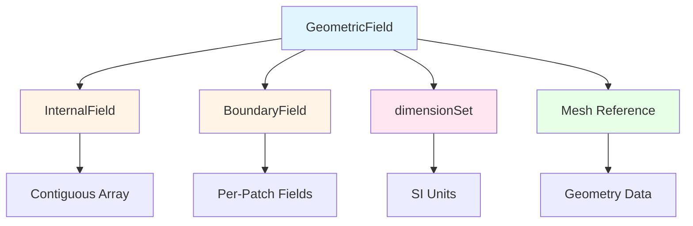
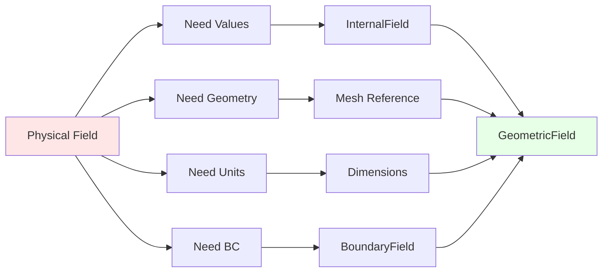
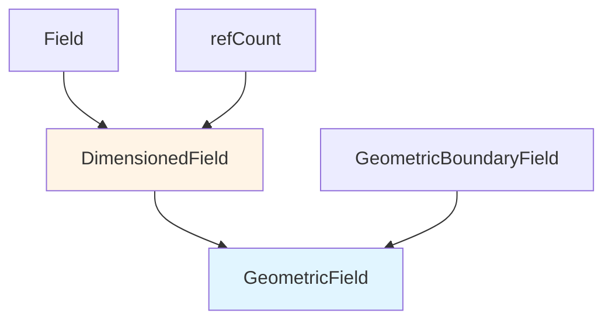
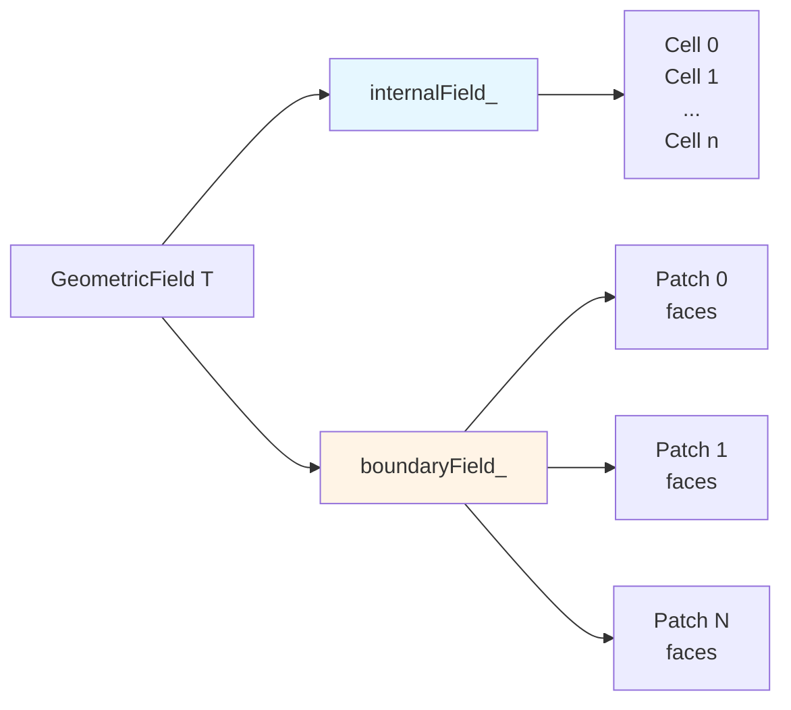
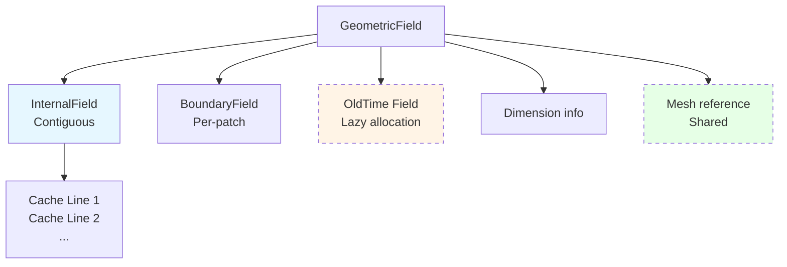

# GeometricField Design Philosophy

ปรัชญาการออกแบบ GeometricField

---

## 🎯 Learning Objectives | เป้าหมายการเรียนรู้

After completing this section, you should be able to:
- **อธิบาย (Explain)** หลักการออกแบบของ GeometricField และความสำคัญของแต่ละ component
- **วิเคราะห์ (Analyze)** ความสัมพันธ์ระหว่าง field, mesh, dimensions และ boundary conditions
- **ประเมิน (Evaluate)** การเลือกใช้ type parameters ที่เหมาะสมกับปัญหา CFD ที่ต้องแก้
- **นำไปใช้ (Apply)** หลักการ dimension checking และ memory management ในการเขียนโค้ด OpenFOAM
- **เขียนโค้ด (Write)** geometric fields ที่ถูกต้องพร้อม boundary conditions และ dimensions

---

## Overview

> **GeometricField** = Field + Mesh + Dimensions + Boundary Conditions



---

## 1. Core Design Goals

### Table: Design Goals and Implementation

| Goal | How Achieved | CFD Benefit |
|------|--------------|-------------|
| **Type Safety** | Template parameters | ป้องกันการรวม field types ที่ไม่สอดคล้องกัน (เช่น vector + tensor) |
| **Performance** | Contiguous memory | Cache efficiency สำหรับ large-scale CFD simulations |
| **Flexibility** | Polymorphic BC | รองรับ boundary conditions หลากหลายประเภทแบบ runtime |
| **Physical Correctness** | Dimension checking | ตรวจสอบความสอดคล้องของหน่วยทางฟิสิกส์ เช่น ความดัน ≠ ความเร็ว |

---

## 2. ทำไม (Why This Design Philosophy)

### Why GeometricField Combines These Components



**Physical Field Reality:** ใน CFD, field ใดๆ ไม่มีอยู่เดี่ยวๆ มันต้องมี:
- **ค่า (Values)** — internal field values
- **ตำแหน่ง (Location)** — mesh geometry
- **หน่วย (Units)** — physical dimensions
- **เงื่อนไขขอบ (Boundaries)** — boundary conditions

> **ทำมา (Why):** การออกแบบ GeometricField ให้เป็น single entity ที่รวมทั้ง 4 components นี้ช่วย:
> 1. **Prevent inconsistencies** — ไม่สามารถลืมกำหนด BC หรือ dimensions
> 2. **Ensure physical correctness** — dimensional analysis automatic
> 3. **Simplify API** — single object handles all field aspects
> 4. **Enable optimization** — compiler can optimize whole entity

---

## 3. Template Structure and Inheritance Hierarchy

### Class Definition

```cpp
template<class Type, template<class> class PatchField, class GeoMesh>
class GeometricField : public DimensionedField<Type, GeoMesh>
{
    // Type: scalar, vector, tensor
    // PatchField: fvPatchField, fvsPatchField  
    // GeoMesh: volMesh, surfaceMesh
};
```

### Inheritance Diagram



### Type Parameter Selection

| Type | Rank | Components | Typical Use |
|------|------|------------|-------------|
| `scalar` | 0 | 1 | Pressure, temperature, volume fraction |
| `vector` | 1 | 3 | Velocity, displacement |
| `tensor` | 2 | 9 | Stress tensor, velocity gradient |
| `symmTensor` | 2 | 6 | Symmetric stress, strain rate |

### PatchField Template Parameter

| PatchField | Mesh Type | Application |
|------------|-----------|-------------|
| `fvPatchField` | volMesh | Finite volume cell-centered fields |
| `fvsPatchField` | surfaceMesh | Finite volume face-centered fields |

### GeoMesh Template Parameter

| GeoMesh | Field Type | Example |
|---------|-----------|---------|
| `volMesh` | Cell-centered | `volScalarField p` |
| `surfaceMesh` | Face-centered | `surfaceScalarField phi` |

---

## 4. Internal Field vs Boundary Field Architecture

### Internal Field Structure

```cpp
// Contiguous array for cache efficiency
Field<Type> internalField_;

// Access methods
T[cellI]                    // Direct indexing
T.internalField()           // Get const reference
T.internalFieldRef()        // Get mutable reference
```

**Design Rationale:** Contiguous memory layout ensures:
- **Cache efficiency** — sequential access patterns
- **Vectorization** — SIMD operations possible
- **Parallel communication** — easy scatter/gather

### Boundary Field Structure

```cpp
// Collection of patch fields
GeometricBoundaryField boundaryField_;

// Access per patch
T.boundaryField()[patchI]            // Const access
T.boundaryFieldRef()[patchI]         // Mutable access

// Access by patch name
T.boundaryField()["inlet"]
```

### Architecture Comparison

| Aspect | Internal Field | Boundary Field |
|--------|---------------|----------------|
| **Memory** | Single contiguous array | Per-patch arrays |
| **Access** | Direct indexing | Patch-based indexing |
| **BC Type** | N/A | Polymorphic per patch |
| **Size** | nCells | Σ nFacesPerPatch |

### Access Pattern Visualization



---

## 5. Dimension System and Automatic Checking

### SI Base Dimensions

```cpp
// 7 SI base dimensions
dimensionSet(M, L, T, Θ, I, N, J)
//          Mass Length Time Temperature Current Amount Luminous
```

### Common Dimension Sets

| Quantity | Exponents | Meaning |
|----------|-----------|---------|
| `dimPressure` | [1, -1, -2, 0, 0, 0, 0] | kg/(m·s²) = M L⁻¹ T⁻² |
| `dimVelocity` | [0, 1, -1, 0, 0, 0, 0] | m/s = L T⁻¹ |
| `dimDensity` | [1, -3, 0, 0, 0, 0, 0] | kg/m³ = M L⁻³ |
| `dimless` | [0, 0, 0, 0, 0, 0, 0] | - |

### Automatic Dimension Checking

```cpp
volScalarField p;  // [M L^-1 T^-2] - pressure
volVectorField U;  // [L T^-1] - velocity  
volScalarField rho; // [M L^-3] - density

// ✓ Valid: dimensionally consistent
volScalarField rhoU2 = rho * magSqr(U);  
// [M L^-3] * [L^2 T^-2] = [M L^-1 T^-2] ✓

// ✗ Invalid: dimension mismatch  
// volScalarField bad = p + U;  // Compiler error!
// [M L^-1 T^-2] + [L T^-1] ✗
```

### Dimension Arithmetic Table

| Operation | Result | Example |
|-----------|--------|---------|
| Addition | Same dimensions | `p + p` ✓ |
| Subtraction | Same dimensions | `T2 - T1` ✓ |
| Multiplication | Add exponents | `ρ × U → [M L^-2 T^-1]` |
| Division | Subtract exponents | `p / ρ → [L^2 T^-2]` |
| Gradient | Add L⁻¹ | `grad(p) → [M L^-2 T^-2]` |
| Divergence | Add L⁻¹ | `div(U) → [T^-1]` |

---

## 6. Mesh Coupling and Field Operations

### Mesh Reference Architecture

```cpp
class GeometricField
{
    const GeoMesh& mesh_;  // Reference to mesh
    
    // Mesh provides:
    // - Cell volumes: V()
    // - Face areas: Sf()  
    // - Cell centers: C()
    // - Face normals: Sf()/mag(Sf())
};
```

### Why Field-Mesh Coupling Matters

> **ทำมา (Why):** Field ไม่สามารถดำเนินการได้ถ้าไม่รู้ geometry:
> - **Integration** — ต้องการ cell volumes: ∫f dV ≈ Σ fᵢ Vᵢ
> - **Gradient** — ต้องการ face areas and distances: ∇f ≈ Δf/Δx  
> - **Interpolation** — ต้องการ neighbor cell info: f_face = αf_owner + (1-α)f_neighbor

### Field-Mesh Operations

```cpp
// Volume-weighted average
scalar avgT = (T * mesh.V()).sum() / mesh.V().sum();

// Mass-weighted average  
scalar avgRhoT = (rho * T * mesh.V()).sum() / (rho * mesh.V()).sum();

// Face interpolation (cell to face)
surfaceScalarField Tf = fvc::interpolate(T);

// Gradient computation
volVectorField gradT = fvc::grad(T);

// Divergence computation  
volScalarField divU = fvc::div(U);
```

### Operation-Mesh Dependency Table

| Operation | Mesh Data Required | Formula |
|-----------|-------------------|---------|
| `sum(T)` | None | Σ Tᵢ |
| `average(T)` | Cell volumes V | Σ TᵢVᵢ / Σ Vᵢ |
| `interpolate(T)` | Face weights α | Tf = αT_owner + (1-α)T_neighbor |
| `grad(T)` | Face areas Sf, distances Δ | ∇T ≈ Σ (Tf Sf) / V |
| `div(U)` | Face areas Sf | ∇·U ≈ Σ (Uf · Sf) / V |

---

## 7. Time Management and Temporal Discretization

### Time-Level Architecture

```cpp
class GeometricField
{
    mutable label timeIndex_;              // Current time index
    mutable GeometricField* field0Ptr_;           // Old time (t-Δt)
    mutable GeometricField* fieldPrevIterPtr_;   // Previous iteration
};
```

### Time-Level Access

```cpp
// Get old time field (t - Δt)
const volScalarField& T0 = T.oldTime();

// Get old-old time field (t - 2Δt) if available
const volScalarField& T00 = T.oldTime().oldTime();

// Time derivative using stored old time
fvm::ddt(T)  // (T - T.oldTime()) / Δt

// Second-order backward differentiation
fvm::ddt0(T)  // Uses T, T.oldTime(), T.oldTime().oldTime()
```

### Temporal Discretization Schemes

| Scheme | Time Levels | Formula | Accuracy |
|--------|-------------|---------|----------|
| **Euler** | t, t-Δt | (Tⁿ - Tⁿ⁻¹)/Δt | First-order |
| **Backward** | t, t-Δt, t-2Δt | (3Tⁿ - 4Tⁿ⁻¹ + Tⁿ⁻²)/(2Δt) | Second-order |
| **CrankNicolson** | t, t-Δt | (Tⁿ - Tⁿ⁻¹)/Δt + ½∇·(UⁿTⁿ + Uⁿ⁻¹Tⁿ⁻¹) | Second-order |

### Lazy Allocation Strategy

```cpp
// Old time field NOT allocated until requested
T.oldTime();  // Allocates field0Ptr_ on first call

// Saves memory for steady-state simulations
// where oldTime() is never called
```

**Memory Efficiency:** Only allocate old time fields when explicitly needed for transient simulations.

---

## 8. Memory Management and Performance Optimization

### tmp Pattern for Temporary Fields

```cpp
// Create temporary field (reference counted)
tmp<volScalarField> tGradP = fvc::grad(p);

// Use result (const reference)
const volVectorField& gradP = tGradP();

// OR convert to owned field
volVectorField gradP = tGradP();

// Memory automatically freed when tmp goes out of scope
```

### tmp Usage Guidelines

| Scenario | Recommended Approach | Reason |
|----------|---------------------|--------|
| **Return from function** | `return tmp<...>` | Avoid copy, enable chaining |
| **Intermediate calculation** | `auto tResult = ...` | Automatic cleanup |
| **Need to store** | `Field stored = tResult()` | Explicit copy |
| **Pass to function** | `function(tResult())` | Ref-counted sharing |

### Memory Optimization Techniques

```cpp
// 1. Avoid unnecessary copies
// Bad: creates copy
volVectorField gradP1 = fvc::grad(p);  

// Good: uses tmp
tmp<volVectorField> tGradP = fvc::grad(p);

// 2. Reference counting for shared data
const volVectorField& gradPRef = tGradP();  // No copy

// 3. Move semantics (C++11)
volVectorField gradP3 = std::move(tGradP());  // Transfer ownership
```

### Memory Layout Visualization



---

## 9. Common Field Operations Reference

### Field Creation

```cpp
// Create from mesh and dimensions
volScalarField T
(
    IOobject("T", runTime.timeName(), mesh),
    mesh,
    dimensionSet(0, 0, 0, 1, 0, 0, 0),  // [Θ] - Temperature
    autoPtr<fvScalarField>::New(mesh, 300.0)  // Initial value 300K
);

// Create as copy
volScalarField T2(T);

// Create with different dimensions
volScalarField p
(
    IOobject("p", runTime.timeName(), mesh),
    mesh,
    dimensionSet(1, -1, -2, 0, 0, 0, 0)  // [M L^-1 T^-2] - Pressure
);
```

### Field Assignment and Manipulation

```cpp
// Element-wise operations
T = 2 * T;           // Scale
T = T + 273.15;      // Shift
T = max(T, 273.15);  // Clamp minimum

// Field-field operations
volScalarField T_avg = 0.5 * (T + T.oldTime());

// Component-wise for vectors
U.component(0) = 1.0;  // Set x-component
```

### Boundary Manipulation

```cpp
// Fix boundary value
T.boundaryFieldRef()[patchI] = 300.0;

// Reset boundary condition type  
T.boundaryFieldRef().set
(
    patchI,
    fvPatchField<scalar>::New("fixedValue", mesh.boundary()[patchI], T)
);
```

---

## 10. Best Practices and Common Pitfalls

### Best Practices

| Practice | Benefit | Example |
|----------|---------|---------|
| **Use tmp for returns** | Avoid copies | `tmp<volScalarField> fvc::grad(...)` |
| **Check dimensions** | Catch errors early | `dimensionSet(1, -1, -2, ...)` |
| **Const correctness** | Prevent modification | `const volScalarField& T` |
| **Reference for access** | Avoid copying | `T.internalField()[cellI]` |
| **Lazy time storage** | Save memory | Don't call `oldTime()` unless needed |

### Common Pitfalls

```cpp
// PITFALL 1: Dimension mismatch
// volScalarField bad = p + U;  // Error!

// CORRECT:
volScalarField kineticEnergy = 0.5 * magSqr(U);  // [L^2 T^-2]

// PITFALL 2: Unnecessary copy
// volVectorField gradP = fvc::grad(p);  // Copy

// CORRECT:
tmp<volVectorField> tGradP = fvc::grad(p);  // No copy

// PITFALL 3: Modifying const reference
// const volScalarField& T = mesh.lookupObject<volScalarField>("T");
// T = 300;  // Error!

// CORRECT:
volScalarField& T = const_cast<volScalarField&>(
    mesh.lookupObject<volScalarField>("T")
);

// PITFALL 4: Forgetting boundary conditions
T.internalField() = 300;  // Only internal cells!
T = 300;  // Includes boundaries
```

---

## 11. Quick Reference Tables

### Component Summary

| Component | Type | Purpose | Access Method |
|-----------|------|---------|---------------|
| `internalField_` | `Field<Type>` | Cell values | `T.internalField()` |
| `boundaryField_` | `GeometricBoundaryField` | Patch values + BC | `T.boundaryField()[patchI]` |
| `dimensions_` | `dimensionSet` | Physical units | `T.dimensions()` |
| `mesh_` | `const GeoMesh&` | Geometry reference | `T.mesh()` |
| `timeIndex_` | `label` | Time management | `T.timeIndex()` |

### Common Field Types

| Type | Template Definition | Example |
|------|---------------------|---------|
| `volScalarField` | `GeometricField<scalar, fvPatchField, volMesh>` | Pressure, temperature |
| `volVectorField` | `GeometricField<vector, fvPatchField, volMesh>` | Velocity |
| `surfaceScalarField` | `GeometricField<scalar, fvsPatchField, surfaceMesh>` | Flux φ |

### Operator Reference

| Operation | Syntax | Result Type | Dimensions |
|-----------|--------|-------------|------------|
| Addition | `T1 + T2` | Same as operands | Same |
| Subtraction | `T1 - T2` | Same as operands | Same |
| Multiplication | `T1 * T2` | Promoted | Sum of exponents |
| Division | `T1 / T2` | Promoted | Difference of exponents |
| Gradient | `fvc::grad(T)` | Vector rank + 1 | Add [L⁻¹] |
| Divergence | `fvc::div(U)` | Scalar rank - 1 | Add [L⁻¹] |

---

## 🔑 Key Takeaways | สรุปสิ่งสำคัญ

1. **Unified Design** — GeometricField รวม field values, geometry, dimensions, และ boundary conditions เป็น single entity เพื่อ physical correctness และ API consistency

2. **Template Flexibility** — 3 template parameters (Type, PatchField, GeoMesh) ให้ type safety พร้อม flexibility สำหรับ field types และ mesh types ต่างๆ

3. **Memory Efficiency** — Contiguous internal field + lazy old time allocation + tmp pattern เพื่อ optimal performance ใน large-scale simulations

4. **Dimensional Safety** — Automatic dimension checking ป้องกัน physical errors และ catch bugs ใน compile-time

5. **Mesh Coupling** — Field-mesh integration ช่วยให้ operations (gradient, divergence, interpolation) ใช้ geometric information อย่างถูกต้อง

6. **Time Management** — Multi-level time storage support ทั้ง first-order และ second-order temporal schemes ด้วย lazy allocation

7. **Boundary Flexibility** — Per-patch polymorphic BCs enable การรองรับ boundary conditions หลากหลายประเภทใน single simulation

---

## 🧠 Concept Check | ทดสอบความเข้าใจ

<details>
<summary><b>1. ทำไม internal field ต้องเป็น contiguous memory?</b></summary>

**เพื่อ cache efficiency** — การเข้าถึงข้อมูลแบบต่อเนื่อง (contiguous access) เร็วกว่า scattered access เพราะ:
- CPU cache load ข้อมูลเป็น blocks (cache lines)
- Spatial locality — ข้อมูลใกล้เคียงถูก load พร้อมกัน
- Vectorization — SIMD operations ทำงานได้ดีกับ contiguous data
- Parallel communication — scatter/gather operations มีประสิทธิภาพมากขึ้น

**CFD Impact:** ใน large simulations การเข้าถึง cell values เป็นล้านครั้งต่อ time step, cache efficiency สามารถเพิ่ม performance ได้ 2-5x
</details>

<details>
<summary><b>2. tmp pattern ช่วยอะไร? ทำไมต้องใช้?</b></summary>

**Automatic memory management** — ไม่ต้อง delete เอง, ลด memory leaks และ enable expression templates:

**Benefits:**
1. **Reference counting** — shared ownership โดยอัตโนมัติ
2. **No copies** — chaining operations โดยไม่สร้าง intermediate copies
3. **RAII** — memory freed เมื่อ tmp ออกจาก scope
4. **Expression optimization** — compiler สามารถ optimize chains

**Example:**
```cpp
// Without tmp: creates 3 copies
volVectorField r1 = fvc::grad(p);
volVectorField r2 = fvc::div(r1);
volScalarField r3 = mag(r2);

// With tmp: zero copies
tmp<volVectorField> t1 = fvc::grad(p);
tmp<volVectorField> t2 = fvc::div(t1());
tmp<volScalarField> t3 = mag(t2());
```
</details>

<details>
<summary><b>3. oldTime() ใช้เมื่อไหร่? ทำไมต้อง lazy allocation?</b></summary>

**ใช้เมื่อต้อง previous time step value** สำหรับ temporal discretization:

**Use Cases:**
- **First-order Euler:** `fvm::ddt(T)` ใช้ `T` และ `T.oldTime()`
- **Second-order Backward:** `fvm::ddt0(T)` ใช้ถึง `T.oldTime().oldTime()`
- **Crank-Nicolson:** blend ระหว่าง current และ old time

**Lazy Allocation Rationale:**
```cpp
// Steady-state simulation
fvm::div(phi, U) + fvm::laplacian(nu, U) == fvc::grad(p)
// ไม่เคยเรียก oldTime() → ไม่ allocate memory → save 50%

// Transient simulation  
fvm::ddt(T) + fvm::div(phi, T) - fvm::laplacian(alpha, T) == 0
// เรียก oldTime() → allocate เฉพาะตอนนี้
```

**Memory Savings:** สำหรับ large case ที่มี 10+ fields, lazy allocation ประหยัด memory ได้หลาย GB
</details>

<details>
<summary><b>4. Dimension checking ทำงานอย่างไร? ทำมาต้องมี?</b></summary>

**Automatic dimensional consistency checking** ใน compile-time โดย tracking SI base dimensions:

**Mechanism:**
```cpp
dimensionSet(M, L, T, Θ, I, N, J)
//          1  1  1  1  1  1  1  (exponents)

// Pressure: [M^1 L^-1 T^-2]
// Velocity: [L^1 T^-1]

// p + U → [M^1 L^-1 T^-2] + [L^1 T^-1] ✗
// Compiler error: dimension mismatch!
```

**ทำมา (Why Important):**
1. **Physics correctness** — catch errors เช่น บวก pressure กับ velocity
2. **Unit consistency** — ป้องกันการใช้ units ที่ไม่ตรงกัน
3. **Documentation** — dimensions บอก physical meaning ของ field
4. **Refactoring safety** — compiler ช่วยตรวจสอบเมื่อเปลี่ยนสูตร

**Real Example:**
```cpp
// Bug: ลืม divide by density
volVectorField a = fvc::grad(p);  // ✗ [M L^-2 T^-2] wrong!

// Correct:
volVectorField a = fvc::grad(p) / rho;  // ✓ [L T^-2]
```
</details>

<details>
<summary><b>5. Polymorphic boundary conditions ทำงานอย่างไร?</b></summary>

**Runtime polymorphism ผ่าน base class pointers** enable การเปลี่ยน BC types แบบ dynamic:

**Architecture:**
```cpp
GeometricBoundaryField boundaryField_;  
// → PtrList<fvPatchField<Type>>
//    → abstract base class
//       → concrete classes: fixedValueFvPatchField,
//                         zeroGradientFvPatchField,
//                         fixedGradientFvPatchField, etc.

// Each patch can have DIFFERENT BC type
boundaryField_[patchI].evaluate()  // Virtual call
```

**Benefits:**
1. **Flexibility** — แต่ละ patch มี BC type ต่างกันได้
2. **Extensibility** — add new BC types โดยไม่แก้ core code
3. **Runtime configuration** — read BC types from dictionary
4. **Polymorphic behavior** — unified interface ทุก BC type

**Example:**
```cpp
// Patch 0: fixedValue
T.boundaryField()[0] = fixedValueFvPatchField::New(...);

// Patch 1: zeroGradient  
T.boundaryField()[1] = zeroGradientFvPatchField::New(...);

// Patch 2: custom BC
T.boundaryField()[2] = MyCustomFvPatchField::New(...);

// All evaluate polymorphically
T.boundaryField().evaluate();  // Calls correct evaluate() per patch
```
</details>

---

## 📖 Cross-References | เอกสารที่เกี่ยวข้อง

### Within This Module

- **Overview:** [00_Overview.md](00_Overview.md) — Introduction to geometric fields
- **Field Creation:** [03_Field_Creation.md](03_Field_Creation.md) — How to create and initialize fields
- **Boundary Conditions:** [06_Boundary_Conditions.md](06_Boundary_Conditions.md) — BC types and implementation
- **Field Operations:** [07_Field_Operations.md](07_Field_Operations.md) — Mathematical operations on fields

### Related Modules

- **Dimensioned Types:** [../../02_DIMENSIONED_TYPES/00_Overview.md](../../02_DIMENSIONED_TYPES/00_Overview.md) — Deep dive into dimension system
- **Mesh Classes:** [../../04_MESH_CLASSES/00_Overview.md](../../04_MESH_CLASSES/00_Overview.md) — Mesh architecture and data structures
- **Field Types:** [../08_FIELD_TYPES/00_Overview.md](../08_FIELD_TYPES/00_Overview.md) — Specific field type implementations
- **Linear Algebra:** [../../06_MATRICES_LINEARALGEBRA/00_Overview.md](../../06_MATRICES_LINEARALGEBRA/00_Overview.md) — Matrix operations with fields

### OpenFOAM Source Code

- `src/OpenFOAM/fields/GeometricFields/GeometricField/GeometricField.H` — Main class definition
- `src/OpenFOAM/fields/GeometricFields/GeometricBoundaryField/GeometricBoundaryField.H` — Boundary field implementation
- `src/OpenFOAM/fields/DimensionedFields/DimensionedField/DimensionedField.H` — Base class with dimensions