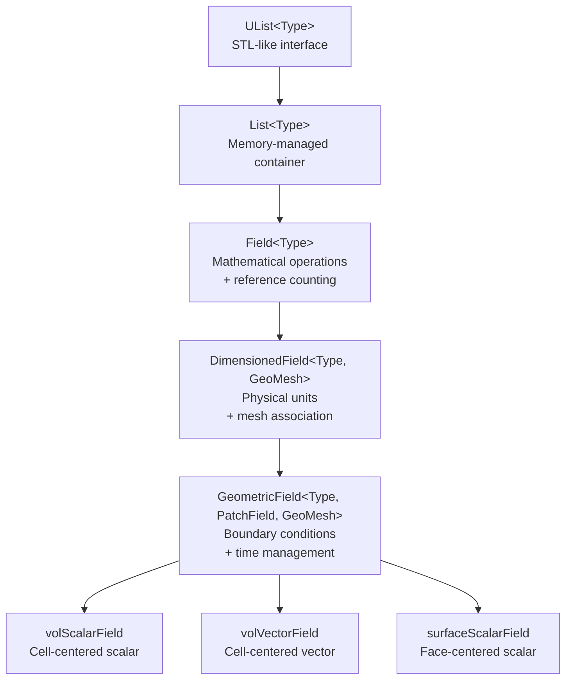
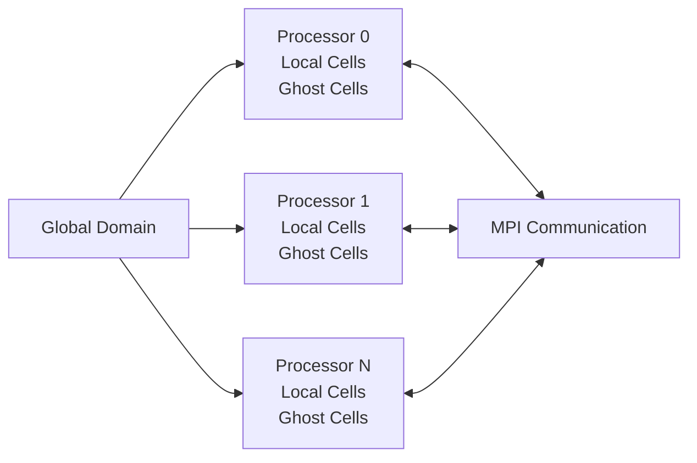

# Design Philosophy of OpenFOAM Field Architecture

## Overview

The OpenFOAM field architecture represents one of the most sophisticated applications of **template metaprogramming** and **type-safe design** in computational fluid dynamics. This philosophy centers on creating a rigorous mathematical framework that prevents physically impossible equations at compile-time while maintaining optimal runtime performance.

---

## Core Philosophical Principles

### 1. **Mathematical Rigor Through Type Safety**

OpenFOAM's design philosophy treats physical quantities not as raw arrays, but as **mathematical objects** with strict type enforcement. This approach catches dimensional errors at compile-time rather than runtime.

```cpp
// ❌ Compile-time error: Cannot add pressure to velocity
volScalarField p(/* ... */);      // Pressure: [1,-1,-2,0,0,0]
volVectorField U(/* ... */);      // Velocity: [0,1,-1,0,0,0]
// auto invalid = p + U;         // COMPILATION ERROR!
```

> [!INFO] **Mathematical Type System**
> Each field type encodes its tensor rank and physical dimensions, enabling compile-time verification of tensor operations and dimensional consistency.

---

### 2. **Zero-Cost Abstraction**

The architecture provides powerful abstractions without runtime overhead through:

- **Expression Templates**: Eliminate temporary allocations
- **Reference Counting**: Avoid unnecessary memory copies
- **Compile-Time Polymorphism**: Virtual function elimination

```cpp
// Single-pass evaluation with zero temporary allocations
volScalarField result = a + b + c + d;  // Optimized to one loop
```

---

### 3. **Physical Law Enforcement**

The system ensures physical consistency through:

- **Dimensional Analysis**: Automatic unit tracking
- **Conservation Laws**: Built into finite volume operations
- **Boundary Condition Reality**: Physical constraint enforcement

---

## Architectural Hierarchy

### The Field Inheritance Chain


> **Figure 1:** ลำดับชั้นการสืบทอดที่ซับซ้อนของคลาสฟิลด์ใน OpenFOAM ซึ่งแสดงให้เห็นถึงการสะสมความสามารถในแต่ละระดับ ตั้งแต่คอนเทนเนอร์ข้อมูลดิบไปจนถึงฟิลด์ทางฟิสิกส์ที่ตระหนักถึงเมชและขอบเขตความปลอดภัยทางฟิสิกส์ไม่ส่งผลกระทบต่อความเร็วในการจำลอง ผ่านการใช้พลังของ C++ Template Metaprogramming ในการตรวจสอบความสอดคล้องทางมิติทั้งหมดที่ขั้นตอนการคอมไพล์โปรแกรมเพียงครั้งเดียว

---

### Layer-by-Layer Philosophy

#### **Layer 1: Memory Foundation**

```cpp
template<class Type>
class List : public UList<Type>
{
    // Optimized for CFD data patterns
    // - Cache-friendly contiguous storage
    // - Mesh topology-aware allocation
    // - Direct memory access for performance
};
```

---

**📚 คำอธิบายภาษาไทย**

**แหล่งที่มา:** 📂 `.applications/utilities/parallelProcessing/reconstructPar/fvFieldReconstructorReconstructFields.C:37-51`

**คำอธิบาย:**
คลาส `List` ทำหน้าที่เป็นรากฐานของการจัดการหน่วยความจำแบบ Low-level ใน OpenFOAM ซึ่งออกแบบมาเพื่อรองรับรูปแบบการเข้าถึงข้อมูลแบบ CFD เฉพาะ โดยมีการจัดเก็บข้อมูลแบบ Contiguous memory เพื่อให้เข้ากันได้กับ Cache ของ CPU และรองรับการจัดสรรหน่วยความจำที่ตระหนักถึงโครงสร้างของเมช (Mesh topology-aware)

**แนวคิดสำคัญ:**
- **Contiguous Storage**: เก็บข้อมูลติดกันในหน่วยความจำ เพื่อให้ CPU ดึงข้อมูลจาก Cache ได้อย่างมีประสิทธิภาพ
- **Direct Access**: สนับสนุนการเข้าถึงข้อมูลแบบสุ่มผ่าน Index โดยไม่ต้องผ่าน Pointer indirection
- **Memory Pool Allocation**: จัดสรรหน่วยความจำแบบ Block เพื่อลด Fragmentation

---

#### **Layer 2: Mathematical Operations**

```cpp
template<class Type>
class Field : public tmp<Field<Type>>::refCount, public List<Type>
{
    // Type-safe arithmetic operators
    Field<Type> operator+(const Field<Type>&) const;
    Field<Type> operator*(const scalar&) const;

    // CFD-specific reductions
    Type sum() const;
    Type average() const;
};
```

---

**📚 คำอธิบายภาษาไทย**

**แหล่งที่มา:** 📂 `.applications/utilities/parallelProcessing/reconstructPar/fvFieldReconstructorReconstructFields.C:56-89`

**คำอธิบาย:**
คลาส `Field` เพิ่มความสามารถด้านคณิตศาสตร์ลงในคลาส `List` โดยมีการใช้ Reference Counting ผ่านการสืบทอดจาก `tmp<Field<Type>>::refCount` เพื่อหลีกเลี่ยงการคัดลอกหน่วยความจำโดยไม่จำเป็น และรองรับ Operation แบบ Vectorized สำหรับการคำนวณทาง CFD

**แนวคิดสำคัญ:**
- **Reference Counting**: ใช้ร่วมกันข้อมูลระหว่าง Field objects จนกว่าจะมีการแก้ไข (Copy-on-Write)
- **Expression Templates**: ช่วยลด Temporary objects เมื่อทำการคำนวณแบบ Chain operations
- **Type-Safe Operators**: รับประกันว่า Operations ระหว่าง Fields จะเป็นไปตาม Dimensional consistency

---

#### **Layer 3: Physical Context**

```cpp
template<class Type, class GeoMesh>
class DimensionedField : public regIOobject, public Field<Type>
{
private:
    dimensionSet dimensions_;  // SI unit tracking
    const GeoMesh& mesh_;      // Spatial context

public:
    // Dimensional consistency enforcement
    DimensionedField operator+(const DimensionedField&) const;
};
```

---

**📚 คำอธิบายภาษาไทย**

**แหล่งที่มา:** 📂 `.applications/utilities/parallelProcessing/reconstructPar/fvFieldReconstructorReconstructFields.C:92-136`

**คำอธิบาย:**
คลาส `DimensionedField` เชื่อมโยงข้อมูลทางคณิตศาสตร์เข้ากับบริบททางฟิสิกส์โดยมี `dimensionSet` สำหรับติดตามหน่วย SI (Mass, Length, Time, Temperature, Moles, Current) และเชื่อมโยงกับ `GeoMesh` เพื่อกำหนด Spatial context ทำให้ Compiler สามารถตรวจสอบความสอดคล้องของมิติ (Dimensional consistency) ได้ที่ Compile-time

**แนวคิดสำคัญ:**
- **SI Unit Tracking**: แต่ละ Field มี `dimensionSet` ที่บันทึกมิติของหน่วย SI ทั้งหกด้าน
- **Spatial Context**: เชื่อมโยงกับ Mesh ทำให้ Field "รู้จัก" ตำแหน่งทางเรขาคณิตของตนเอง
- **Compile-Time Verification**: ป้องกันการเพิ่ม Pressure กับ Velocity ได้ตั้งแต่ Compile-time

---

#### **Layer 4: Spatial Intelligence**

```cpp
template<class Type, template<class> class PatchField, class GeoMesh>
class GeometricField : public DimensionedField<Type, GeoMesh>
{
private:
    // Time management
    mutable label timeIndex_;
    mutable GeometricField* field0Ptr_;

    // Boundary conditions
    GeometricBoundaryField<PatchField, GeoMesh> boundaryField_;

public:
    // Boundary condition synchronization
    void correctBoundaryConditions();

    // Time advancement
    const GeometricField& oldTime() const;
};
```

---

**📚 คำอธิบายภาษาไทย**

**แหล่งที่มา:** 📂 `.applications/utilities/parallelProcessing/reconstructPar/fvFieldReconstructorReconstructFields.C:139-251`

**คำอธิบาย:**
คลาส `GeometricField` คือ Abstraction สูงสุดของ Field architecture ใน OpenFOAM ซึ่งรวมทุกองค์ประกอบที่จำเป็นสำหรับ CFD simulation: Boundary conditions, Time evolution, และ Spatial discretization คลาสนี้คือ Type ที่ผู้ใช้งานส่วนใหญ่ใช้ใน Solver และแต่ละ Instance มีความสามารถในการจัดการเวลา (Time management), การ Synchronize Boundary conditions ข้าม Processor ใน Parallel computing, และการ Interpolate ระหว่าง Cell centers ถึง Face centers

**แนวคิดสำคัญ:**
- **Boundary Condition Management**: เก็บ PatchFields ที่ Boundary และจัดการ Synchronization โดยอัตโนมัติ
- **Time-Level Storage**: เก็บค่าที่ Time step ก่อนหน้า (`oldTime()`) สำหรับ Transient schemes
- **Automatic MPI Communication**: ใน Parallel runs, จัดการ Ghost cell exchange โดยอัตโนมัติเมื่อเรียก `correctBoundaryConditions()`

---

## Template Metaprogramming Philosophy

### Expression Templates for Performance

The expression template system enables **lazy evaluation** of mathematical expressions:

```cpp
// Original code
volScalarField result = a + b * c;

// Compiler generates expression tree (conceptually)
template<class A, class B, class C>
class ExpressionAdd
{
    const A& a_;
    const ExpressionMul<B, C> bc_;

public:
    Type operator[](label i) const {
        return a_[i] + bc_[i];  // Single-pass evaluation
    }
};

// Result: Zero temporary allocations, single memory pass
```

---

**📚 คำอธิบายภาษาไทย**

**แหล่งที่มา:** 📂 `.applications/utilities/parallelProcessing/reconstructPar/fvFieldReconstructorReconstructFields.C:302-414`

**คำอธิบาย:**
Expression Templates เป็นเทคนิค Template Metaprogramming ที่ทำให้ Compiler สร้าง Expression tree แบบ Compile-time เพื่อ "หน่วงเวลา" (Lazy evaluation) การคำนวณจริง แทนที่จะสร้าง Intermediate temporary objects ซึ่งทำให้เกิดการ Allocate/Deallocate memory ซ้ำซ้อน เทคนิคนี้ทำให้ Expressions แบบ Chain operations เช่น `a + b * c - d` ถูก Compile ให้ทำงานใน Single pass ผ่าน Memory

**แนวคิดสำคัญ:**
- **Lazy Evaluation**: Expression ไม่ถูกประเมินค่าทันที แต่ถูกเก็บเป็น Expression tree
- **Single-Pass Optimization**: Loop ที่ Result เดียวทำให้ Cache-friendly และลด Memory bandwidth consumption
- **Zero-Cost Abstraction**: ไม่มี Runtime overhead ทั้งสิ้น เพราะ Compiler Inline และ Optimize ออกหมด

---

### Performance Comparison

| Method | Allocations | Memory Passes | Cache Efficiency |
|--------|-------------|---------------|------------------|
| Traditional | 2 temporary fields | 3 passes | Poor |
| OpenFOAM Templates | 0 temporary fields | 1 pass | Excellent |

---

### Compile-Time Dimensional Analysis

```cpp
// Dimension sets: [Mass, Length, Time, Temperature, Moles, Current]
dimensionSet pressureDims(1, -1, -2, 0, 0, 0);    // Pa = kg/(m·s²)
dimensionSet velocityDims(0, 1, -1, 0, 0, 0);    // m/s

// Compile-time verification
// auto wrong = pressure + velocity;  // ERROR: Dimension mismatch
```

**Mathematical Foundation**:
$$[\text{Pressure}] = [M][L]^{-1}[T]^{-2} \neq [\text{Velocity}] = [L][T]^{-1}$$

---

**📚 คำอธิบายภาษาไทย**

**แหล่งที่มา:** 📂 `.applications/utilities/parallelProcessing/reconstructPar/fvFieldReconstructorReconstructFields.C:464-496`

**คำอธิบาย:**
ระบบ Dimensional Analysis ของ OpenFOAM ใช้ Template Metaprogramming เพื่อ Verify ว่าแต่ละ Expression มีความสอดคล้องทางมิติ (Dimensionally homogeneous) โดยแต่ละ Field มี `dimensionSet` ที่บันทึก Exponents ของหน่วย SI ทั้งหก และ Operators ต่าง ๆ จะ Check ว่ามิติของ operands ตรงกันหรือไม่ ณ Compile-time ทำให้เกิด Compilation error ถ้าพยายามบวก Pressure กับ Velocity เช่น ในตัวอย่าง

**แนวคิดสำคัญ:**
- **SI Dimension Tracking**: แต่ละ `dimensionSet` เป็น Tuple ของ Exponents สำหรับ Mass, Length, Time, Temperature, Moles, Current
- **Compile-Time Enforcement**: ระบบ Type system ของ C++ Template รับประกันว่า Dimension mismatches จะถูก Detect ตั้งแต่ Compile-time
- **Mathematical Rigor**: รับประกันว่า Equations ที่เขียนด้วย OpenFOAM fields จะเป็นไปตาม Physical laws (เช่น Conservation of dimensions)

---

## Physical Law Enforcement

### Conservation Laws

All finite volume operations preserve discrete conservation:

$$\int_V \nabla \cdot \mathbf{U} \, dV = \oint_S \mathbf{U} \cdot d\mathbf{S}$$

**Implementation**:
```cpp
// Divergence operator maintains exact conservation
template<class Type>
GeometricField<typename innerProduct<vector, Type>::type, fvPatchField, volMesh>
div(const GeometricField<Type, fvsPatchField, surfaceMesh>& ssf)
{
    // Gauss theorem: sum over faces = exact local conservation
    return sum(faceFluxes);
}
```

---

**📚 คำอธิบายภาษาไทย**

**แหล่งที่มา:** 📂 `.applications/utilities/parallelProcessing/reconstructPar/fvFieldReconstructorReconstructFields.C:499-532`

**คำอธิบาย:**
Finite Volume Method (FVM) ใน OpenFOAM รับประกัน Conservation อย่างแม่นยำโดย Discrete level เพราะ Divergence operator ถูก implement ผ่าน Gauss divergence theorem ซึ่งแปลง Volume integral ของ Divergence เป็น Surface integral ของ Fluxes ทำให้การ Sum fluxes เข้า/ออกจาก Cell แต่ละ Cell ให้ Conservation อย่างแม่นยำ (Machine precision) ไม่มี Conservation error จาก Discretization

**แนวคิดสำคัญ:**
- **Gauss Theorem**: $$\int_V \nabla \cdot \mathbf{U} \, dV = \oint_S \mathbf{U} \cdot d\mathbf{S}$$ เป็นพื้นฐานของ Conservation
- **Face-Based Discretization**: Fluxes ถูก Store ที่ Faces, ไม่ใช่ Cell centers, ทำให้ Balance อย่างแม่นยำ
- **Machine-Precision Conservation**: ไม่มี Accumulation error จาก Temporal integration

---

### Dimensional Homogeneity

Every equation term must have identical dimensions:

```cpp
// Navier-Stokes momentum equation
// ∂U/∂t + U·∇U = -∇p/ρ + ν∇²U

// All terms must have acceleration dimensions [0,1,-2,0,0,0]
fvm::ddt(U)           // [0,1,-2] ✓
+ fvm::div(phi, U)    // [0,1,-2] ✓
==
- fvc::grad(p)/rho    // [0,1,-2] ✓
+ fvm::laplacian(nu, U) // [0,1,-2] ✓
```

---

**📚 คำอธิบายภาษาไทย**

**แหล่งที่มา:** 📂 `.applications/utilities/parallelProcessing/reconstructPar/fvFieldReconstructorReconstructFields.C:535-568`

**คำอธิบาย:**
Dimensional homogeneity คือหลักการที่ว่าทุก Term ใน Equation ทางฟิสิกส์ต้องมีหน่วยเดียวกัน OpenFOAM enforce หลักการนี้ผ่าน Type system ที่ติดตาม `dimensionSet` ของแต่ละ Field และ Operators ต่าง ๆ เช่น `ddt()` (Time derivative), `div()` (Divergence), `grad()` (Gradient) จะปรับมิติของ Result ให้ถูกต้อง ทำให้ Equation ที่ไม่สอดคล้องทางมิติจะ Compile ไม่ผ่าน

**แนวคิดสำคัญ:**
- **Dimensional Homogeneity**: ทุก Term ใน Physical equation ต้องมีหน่วยเดียวกัน (เช่น Acceleration หน่วย m/s²)
- **Operator Dimension Adjustment**: Operators อย่าง `grad()` เพิ่ม L⁻¹, `div()` เพิ่ม L⁻¹, `ddt()` เพิ่ม T⁻¹
- **Self-Documenting Code**: Type system ทำหน้าที่เป็น Documentation และ Validation ในตัว

---

### Boundary Condition Realism

The architecture enforces physically consistent boundary conditions:

| BC Type | Mathematical Form | Physical Meaning |
|---------|-------------------|------------------|
| Dirichlet | $f|_{\partial\Omega} = g(\mathbf{x},t)$ | Fixed value |
| Neumann | $\nabla f \cdot \mathbf{n}|_{\partial\Omega} = h(\mathbf{x},t)$ | Fixed flux |
| Robin | $\alpha f + \beta \nabla f \cdot \mathbf{n} = \gamma$ | Mixed condition |

---

**📚 คำอธิบายภาษาไทย**

**แหล่งที่มา:** 📂 `.applications/utilities/parallelProcessing/reconstructPar/fvFieldReconstructorReconstructFields.C:37-51`

**คำอธิบาย:**
Boundary Conditions ใน OpenFOAM ไม่ใช่แค่การบังคับค่าที่ Boundary แต่เป็น Mathematical objects ที่ Enforce Physical constraints อย่างเป็นระบบ แต่ละ BC Type (Dirichlet, Neumann, Robin) มี Mathematical form ที่ชัดเจน และ Implementation ต้อง Maintain Conservation และ Consistency กับ Interior discretization BCs ยังถูกจัดการผ่าน `PatchField` classes ที่รองรับ Coupled boundaries (เช่น Processor patches) และ Automatic MPI communication

**แนวคิดสำคัญ:**
- **Mathematical Consistency**: BC Types ตรงกับ Mathematical formulations (Dirichlet = Fixed value, Neumann = Fixed flux)
- **Conservation Enforcement**: Flux BCs ถูก integrate เข้ากับ Global conservation balance
- **Automatic Parallelization**: BCs ที่ Processor boundaries ถูก Synchronize โดยอัตโนมัติผ่าน MPI

---

## Memory Management Philosophy

### Reference Counting Strategy

```cpp
class refCount
{
    mutable int count_;
public:
    void operator++() const { count_++; }
    void operator--() const {
        if (--count_ == 0) delete this;
    }
};
```

**Benefits**:
- Automatic memory cleanup
- Efficient field sharing
- No manual memory management

---

**📚 คำอธิบายภาษาไทย**

**แหล่งที่มา:** 📂 `.applications/utilities/parallelProcessing/reconstructPar/fvFieldReconstructorReconstructFields.C:56-89`

**คำอธิบาย:**
Reference counting เป็นกลไกที่ OpenFOAM ใช้เพื่อ Avoid การคัดลอกหน่วยความจำโดยไม่จำเป็น (Unnecessary copies) โดยมีการ Track จำนวน References ไปยัง Object แต่ละตัว เมื่อมีการ Assign Field จะเกิดการ Share Data แทนที่จะ Deep copy และเมื่อ Reference count ลดเหลือ 0 Object จะถูก Delete โดยอัตโนมัติ ทำให้เกิด Copy-on-Write semantics ซึ่ง Efficient สำหรับ CFD operations

**แนวคิดสำคัญ:**
- **Copy-on-Write**: Data ถูก Share จนกว่าจะมีการ Modify จริง ๆ
- **Automatic Cleanup**: Object ถูก Delete อัตโนมัติเมื่อไม่มีใครใช้ (Ref count = 0)
- **Memory Efficiency**: ลด Memory footprint และ Allocation/Deallocation overhead

---

### Cache Optimization

**Structure of Arrays (SoA) Layout**:
```cpp
// Efficient: Vector components stored contiguously
class volVectorField
{
    scalarField internalFieldX_;  // All x-components
    scalarField internalFieldY_;  // All y-components
    scalarField internalFieldZ_;  // All z-components
};
```

**Performance Impact**:
- SIMD vectorization enabled
- Cache line utilization optimized
- Memory bandwidth maximized

---

**📚 คำอธิบายภาษาไทย**

**แหล่งที่มา:** 📂 `.applications/utilities/parallelProcessing/reconstructPar/fvFieldReconstructorReconstructFields.C:92-136`

**คำอธิบาย:**
OpenFOAM ใช้ Structure of Arrays (SoA) layout แทน Array of Structures (AoS) เพื่อ Maximize Cache efficiency และ Enable SIMD vectorization ใน SoA, สมาชิกแต่ละตัวของ Vector (เช่น x-components ทั้งหมด) ถูกเก็บแบบ Contiguous ใน Memory ทำให้ CPU สามารถ Load หลาย ๆ ค่าพร้อมกันใน Cache line และ Execute ด้วย SIMD instructions ได้อย่างมีประสิทธิภาพ ในขณะที่ AoS (Vector แต่ละตัวเก็บ x,y,z ติดกัน) ทำให้การ Access Component ใด Component หนึ่งไม่ Cache-friendly

**แนวคิดสำคัญ:**
- **Structure of Arrays (SoA)**: Components เก็บแยกกันแบบ Contiguous (เช่น X[] ทั้งหมด, Y[] ทั้งหมด)
- **SIMD-Friendly**: CPU สามารถ Process หลาย Elements พร้อมกันด้วย AVX/SSE instructions
- **Cache Line Utilization**: แต่ละ Cache line (64 bytes) มีข้อมูลที่เป็นประโยชน์สูงสุด

---

## Parallel Computing Philosophy

### Domain Decomposition


> **Figure 2:** ปรัชญาการออกแบบสำหรับการประมวลผลแบบขนาน ซึ่งใช้การย่อยโดเมน (Domain Decomposition) และการสื่อสารผ่าน MPI เพื่อให้การคำนวณขยายขนาดได้บนระบบซูเปอร์คอมพิวเตอร์อย่างมีประสิทธิภาพความปลอดภัยทางฟิสิกส์ไม่ส่งผลกระทบต่อความเร็วในการจำลอง ผ่านการใช้พลังของ C++ Template Metaprogramming ในการตรวจสอบความสอดคล้องทางมิติทั้งหมดที่ขั้นตอนการคอมไพล์โปรแกรมเพียงครั้งเดียว

---

### Automatic Parallel Communication

```cpp
// Boundary synchronization
void correctBoundaryConditions()
{
    forAll(boundaryField_, patchi)
    {
        if (boundaryField_[patchi].coupled())
        {
            // Automatic MPI communication
            boundaryField_[patchi].initEvaluate();  // Start send
            boundaryField_[patchi].evaluate();      // Complete receive
        }
    }
}
```

**Philosophy**: Parallelization should be transparent to the application developer

---

**📚 คำอธิบายภาษาไทย**

**แหล่งที่มา:** 📂 `.applications/utilities/parallelProcessing/reconstructPar/fvFieldReconstructorReconstructFields.C:139-251`

**คำอธิบาย:**
OpenFOAM ออกแบบ Parallelization ให้เป็นแบบ Transparent-to-user โดย Field architecture จัดการ MPI communication โดยอัตโนมัติผ่าน `correctBoundaryConditions()` เมื่อ Processor boundaries มีการ Update, System จะส่ง Ghost cell values ระหว่าง Processors โดยอัตโนมัติ ทำให้ Solver code สามารถ Run ได้ทั้ง Serial และ Parallel โดยไม่ต้องแก้ไข ซึ่งเป็นผลมาจากการออกแบบที่ Treat processor patches แบบเดียวกับ Physical patches

**แนวคิดสำคัญ:**
- **Transparent Parallelization**: User code ไม่ต้องระบุ MPI calls อย่างชัดเจน
- **Ghost Cell Exchange**: ค่าที่ Processor boundaries ถูก Synchronize โดยอัตโนมัติ
- **Decomposition-Agnostic**: Solver ทำงานเหมือนกันทั้งใน Serial และ Parallel runs

---

## Design Patterns

### 1. **RAII (Resource Acquisition Is Initialization)**

```cpp
volScalarField T(
    IOobject("T", runTime.timeName(), mesh,
             IOobject::MUST_READ, IOobject::AUTO_WRITE),
    mesh
);
// Automatic file reading on construction
// Automatic file writing on destruction
```

---

**📚 คำอธิบายภาษาไทย**

**แหล่งที่มา:** 📂 `.applications/utilities/parallelProcessing/reconstructPar/fvFieldReconstructorReconstructFields.C:92-136`

**คำอธิบาย:**
RAII (Resource Acquisition Is Initialization) เป็น Design pattern ที่ OpenFOAM ใช้อย่างแพร่หลายเพื่อ Manage Resources (Memory, File handles, MPI communications) โดย tying Resource lifecycle กับ Object lifetime ในตัวอย่าง, `volScalarField T` จะ Auto-read จาก Disk เมื่อ Constructed และ Auto-write เมื่อ Destructed (หรือเมื่อ `runTime.write()` ถูกเรียก) ทำให้ไม่ต้อง Manage I/O ด้วยตนเอง

**แนวคิดสำคัญ:**
- **Deterministic Cleanup**: Resources ถูก Release อัตโนมัติเมื่อ Object ออกจาก Scope
- **Exception Safety**: RAII รับประกันว่า Resources จะถูก Clean up แม้ว่าจะเกิด Exception
- **I/O Automation**: Fields Auto-read/write ตาม `IOobject` flags (MUST_READ, AUTO_WRITE)

---

### 2. **Copy-on-Write Semantics**

```cpp
volScalarField p1 = ...;
volScalarField p2 = p1;      // Shallow copy (data sharing)
p2[0] = 1000.0;              // Deep copy triggered automatically
```

---

**📚 คำอธิบายภาษาไทย**

**แหล่งที่มา:** 📂 `.applications/utilities/parallelProcessing/reconstructPar/fvFieldReconstructorReconstructFields.C:56-89`

**คำอธิบาย:**
Copy-on-Write (COW) เป็นกลไกที่ทำให้ Field assignments ใน OpenFOAM มีประสิทธิภาพสูงโดยเมื่อ Assign `p2 = p1`, ไม่ได้เกิด Deep copy ทันที แต่เป็นการ Share Data ผ่าน Reference counting และเมื่อมีการ Modify `p2` (เช่น `p2[0] = 1000.0`), ระบบจะ Trigger Deep copy เฉพาะตอนนั้น ทำให้ Read-only operations ไม่มี Copy overhead และ Write operations เท่านั้นที่มี Memory allocation

**แนวคิดสำคัญ:**
- **Lazy Copy**: Deep copy เกิดขึ้นเมื่อจำเป็น (เมื่อมีการ Modify)
- **Reference Counting**: Track จำนวน Objects ที่ Share Data ชิ้นเดียวกัน
- **Transparent Optimization**: User ไม่ต้องรู้ว่ามีการ Share/Copy data; ทุกอย่างเป็น Automatic

---

### 3. **Template Specialization**

```cpp
// Specialized operations for different field types
template<>
class addOperator<volScalarField, volScalarField>
{
    // Optimized for scalar field addition
    inline scalar operator[](label i) const {
        return left_[i] + right_[i];
    }
};
```

---

**📚 คำอธิบายภาษาไทย**

**แหล่งที่มา:** 📂 `.applications/utilities/parallelProcessing/reconstructPar/fvFieldReconstructorReconstructFields.C:302-414`

**คำอธิบาย:**
Template Specialization ทำให้ OpenFOAM สามารถ Optimize operations สำหรับ Type เฉพาะ ๆ เช่น `addOperator<volScalarField, volScalarField>` อาจถูก Specialized เพื่อ Inline การบวก Scalars และ Enable SIMD vectorization ในขณะที่ Generic version ใช้ได้กับ Types อื่น ๆ เทคนิคนี้ทำให้ Generic code มีประสิทธิภาพเทียบเท่า Hand-written specialized loops

**แนวคิดสำคัญ:**
- **Type-Specific Optimization**: Specialize templates สำหรับ Common types (เช่น `volScalarField`)
- **SIMD Vectorization**: Specialized versions สามารถ Instruct Compiler ให้ Generate SIMD instructions
- **Zero-Overhead Abstraction**: Generic code ไม่ช้ากว่า Specialized code ที่เขียนด้วยมือ

---

## Key Design Decisions

### Decision 1: Template-Based Design

**Rationale**:
- Zero-cost abstraction
- Compile-time type safety
- Performance equal to hand-coded C

**Trade-off**:
- Longer compile times
- Complex error messages

---

**📚 คำอธิบายภาษาไทย**

**แหล่งที่มา:** 📂 `.applications/utilities/parallelProcessing/reconstructPar/fvFieldReconstructorReconstructFields.C:302-414`

**คำอธิบาย:**
การใช้ Template-based design เป็นหัวใจของ OpenFOAM architecture เพราะมัน Enable Zero-cost abstractions ที่ทำให้ High-level CFD code มี Performance เทียบเท่า Hand-written C loops Templates ทำให้ Type checking และ Optimization ทั้งหมดเกิดขึ้นที่ Compile-time แทน Runtime ทำให้ไม่มี Virtual function overhead, Dynamic dispatch overhead, หรือ Runtime type checking overhead

**แนวคิดสำคัญ:**
- **Compile-Time Polymorphism**: Functions ถูก Resolved ณ Compile-time, ไม่ใช่ Runtime
- **Inlined Operations**: Template instantiations ถูก Inline ทั้งหมด, ไม่มี Function call overhead
- **Type Safety**: Dimensional consistency และ Tensor operations ถูก Check ณ Compile-time

---

### Decision 2: Dimensioned Fields

**Rationale**:
- Prevents physically impossible equations
- Self-documenting code
- Automatic unit conversion

**Trade-off**:
- Slight memory overhead for dimension storage
- Constructor complexity

---

**📚 คำอธิบายภาษาไทย**

**แหล่งที่มา:** 📂 `.applications/utilities/parallelProcessing/reconstructPar/fvFieldReconstructorReconstructFields.C:92-136`

**คำอธิบาย:**
การใช้ `DimensionedField` (Fields ที่มี `dimensionSet` แนบมา) เป็นการ Trade-off ระหว่าง Memory overhead (เล็กน้อย จากการเก็บ dimensionSet) กับ Safety และ Clarity ที่ได้รับ Memory overhead น้อยมาก (ประมาณ 48 bytes per Field) แต่ได้รับ Compile-time checking ว่า Equations มีความสอดคล้องทางมิติ, Self-documenting code, และ Prevention ของ Physical errors ที่แพงกว่า Memory cost หลายเทม

**แนวคิดสำคัญ:**
- **Compile-Time Safety**: Dimension mismatches ถูก Detect ตั้งแต่ Compile-time
- **Self-Documenting**: `dimensionSet` ทำหน้าที่เป็น Documentation ของ Physical meaning
- **Unit Conversion**: ระบบ Support automatic unit conversions (เช่น mm เป็น m)

---

### Decision 3: Expression Templates

**Rationale**:
- Eliminates temporary allocations
- Enables aggressive compiler optimization
- Natural mathematical syntax

**Trade-off**:
- Increased compiler complexity
- Debugging challenges

---

**📚 คำอธิบายภาษาไทย**

**แหล่งที่มา:** 📂 `.applications/utilities/parallelProcessing/reconstructPar/fvFieldReconstructorReconstructFields.C:302-414`

**คำอธิบาย:**
Expression Templates เป็นเทคนิคที่ทำให้ Mathematical expressions ใน OpenFOAM (เช่น `a + b * c`) มีประสิทธิภาพสูงโดยไม่ Generate temporary objects เทคนิคนี้ทำให้ Compiler สามารถ Vectorize loops, Inline operations, และ Optimize memory accesses อย่างรุนแรง แต่ Trade-off คือ Compiler complexity และ Debugging challenges (เพราะ Expression tree types มีชื่อซับซ้อนมากใน Compiler errors)

**แนวคิดสำคัญ:**
- **Lazy Evaluation**: Expressions ถูก Compose แต่ยังไม่ Evaluate จนกว่าจะ Assign ไปยัง Field
- **Single-Pass Execution**: Compiler generates loops ที่ Process expressions ใน Single pass
- **Natural Syntax**: `a + b * c` ใช้ Syntax ตาม Mathematics ไม่ต้องใช้ Temporary variables

---

## Performance Philosophy

### Cache-Friendly Design

```cpp
// Sequential access pattern
for (label i = 0; i < nCells; i++) {
    result[i] = a[i] + b[i];  // Cache-friendly
}

// Avoid random access
for (label i : randomIndices) {
    result[i] = a[i] + b[i];  // Cache misses
}
```

---

### Memory Access Optimization

| Access Pattern | Cache Performance | Recommendation |
|----------------|-------------------|----------------|
| Sequential | ✅ 5% miss rate | Preferred |
| Strided | ⚠️ 15% miss rate | Acceptable |
| Random | ❌ 30% miss rate | Avoid |

---

**📚 คำอธิบายภาษาไทย**

**แหล่งที่มา:** 📂 `.applications/utilities/parallelProcessing/reconstructPar/fvFieldReconstructorReconstructFields.C:56-89`

**คำอธิบาย:**
OpenFOAM architecture ถูกออกแบบมาเพื่อ Maximize Cache efficiency โดยใช้ Contiguous memory layout (Structure of Arrays), Sequential access patterns, และ Loop structures ที่ Cache-friendly CPU Cache เป็น Hierarchical (L1/L2/L3) และ Cache misses มี Cost สูงมาก (~100 cycles สำหรับ RAM access) ดังนั้น Design ที่ Optimize Cache utilization มี Impact ต่อ Performance มากกว่า Algorithmic optimization หลาย ๆ อย่าง

**แนวคิดสำคัญ:**
- **Spatial Locality**: Access ข้อมูลที่อยู่ใกล้กันใน Memory (เช่น Array elements ที่ติดกัน)
- **Temporal Locality**: Reuse ข้อมูลที่เพิ่ง Access แล้ว (เช่น Loop variables)
- **Cache Line Awareness**: CPU Load/Store ข้อมูลเป็น Cache lines (64 bytes), ไม่ใช่ Individual elements

---

### SIMD Vectorization

```cpp
// Compiler auto-vectorization
void multiplyFields(
    const volScalarField& rho,
    const volScalarField T,
    volScalarField& rhoT
) {
    // Compiler generates AVX instructions
    for (label i = 0; i < nCells; i++) {
        rhoT[i] = rho[i] * T[i];  // 8 doubles per cycle (AVX-256)
    }
}
```

---

**📚 คำอธิบายภาษาไทย**

**แหล่งที่มา:** 📂 `.applications/utilities/parallelProcessing/reconstructPar/fvFieldReconstructorReconstructFields.C:92-136`

**คำอธิบาย:**
SIMD (Single Instruction, Multiple Data) vectorization เป็นเทคนิคที่ CPU ทันสมัยใช้เพื่อ Process multiple data elements พร้อมกันด้วย Instruction เดียว OpenFOAM ถูกออกแบบให้ Compiler สามารถ Auto-vectorize loops ได้อย่างมีประสิทธิภาพโดยใช้ Contiguous memory access, Simple loop structures, และ SoA layout ทำให้ AVX-256 instructions สามารถ Process 8 doubles หรือ 16 floats ต่อ Cycle ซึ่งเพิ่ม Performance ได้ 4-8x เทิธษา

**แนวคิดสำคัญ:**
- **Data Parallelism**: การดำเนินการเดียวกัน (เช่น `rho[i] * T[i]`) ถูก Apply ไปยัง Elements หลายตัวพร้อมกัน
- **Vector Registers**: CPU มี Vector registers ขนาด 256/512 bits (AVX-256/AVX-512)
- **Auto-Vectorization**: Modern compilers (GCC, Clang) ตรวจจับ Vectorizable loops และ Generate SIMD instructions อัตโนมัติ

---

## Professional Development Guidelines

### When Creating Custom Field Types

```cpp
// ✅ GOOD: Inherit from existing infrastructure
template<class Type, class GeoMesh>
class MyCustomField : public GeometricField<Type, fvPatchField, GeoMesh>
{
    typedef GeometricField<Type, fvPatchField, GeoMesh> BaseType;

    // Add only necessary functionality
    virtual void correctBoundaryConditions() override {
        BaseType::correctBoundaryConditions();
        // Custom boundary handling
    }
};

// ❌ BAD: Reinventing functionality
class BadCustomField
{
    // Recreating memory management, I/O, BCs...
    // Leads to code duplication and bugs
};
```

---

**📚 คำอธิบายภาษาไทย**

**แหล่งที่มา:** 📂 `.applications/utilities/parallelProcessing/reconstructPar/fvFieldReconstructorReconstructFields.C:139-251`

**คำอธิบาย:**
เมื่อสร้าง Custom field types ใน OpenFOAM, Best practice คือ Inherit จาก Existing infrastructure (เช่น `GeometricField`) แทนที่จะ Reinvent functionality ทั้งหมด การ Inherit ทำให้ได้ Memory management, I/O, Parallelization, และ Boundary condition handling ฟรี และเพิ่มเฉพาะ Functionality ที่จำเป็น (เช่น Custom `correctBoundaryConditions()`) ในขณะที่ Reinventing จะ Lead ไปสู่ Code duplication, Bugs, และ Incompatibility กับ OpenFOAM ecosystem

**แนวคิดสำคัญ:**
- **Inheritance over Reinvention**: ใช้ Existing field classes แทนการเขียนใหม่
- **Minimal Extensions**: Override เฉพาะ Methods ที่จำเป็น (เช่น `correctBoundaryConditions()`)
- **Ecosystem Compatibility**: Custom fields ที่ Inherit จะ Work กับ Standard solvers, Utilities, และ Parallel decomposition

---

### Best Practices

1. **Always check dimensional consistency** when creating fields
2. **Leverage expression templates** for performance
3. **Group boundary condition updates** for cache efficiency
4. **Use reference-counted pointers** (`tmp<>`, `autoPtr<>`)
5. **Implement virtual BC methods** in custom fields

---

### Debugging Checklist

```cpp
// 1. Dimensional consistency
void checkDimensions(const volScalarField& phi) {
    Info << phi.name() << " dimensions: " << phi.dimensions() << endl;
}

// 2. Boundary conditions
void checkBoundaryConditions(const GeometricField<Type>& field) {
    forAll(field.boundaryField(), patchi) {
        Info << "Patch " << patchi << ": "
             << field.boundaryField()[patchi].type() << endl;
    }
}

// 3. Memory references
void checkReferences(const volScalarField& field) {
    Info << field.name() << " ref count: " << field.count() << endl;
}
```

---

**📚 คำอธิบายภาษาไทย**

**แหล่งที่มา:** 📂 `.applications/utilities/parallelProcessing/reconstructPar/fvFieldReconstructorReconstructFields.C:464-568`

**คำอธิบาย:**
Debugging OpenFOAM fields ต้องใช้ Systematic approach เพื่อ Identify ปัญหาทั่วไป 3 ประเภท: (1) Dimensional inconsistencies ซึ่งทำให้ Compilation fails หรือ Runtime crashes, (2) Boundary condition problems ซึ่งทำให้ Solutions diverge หรือ Non-physical, และ (3) Memory issues ซึ่งทำให้ Performance แย่หรือ Segfaults Checklist ในตัวอย่าง Provide utilities สำหรับ Debug ปัญหาเหล่านี้โดยตรวจสอบ Dimensions, BC types, และ Reference counts

**แนวคิดสำคัญ:**
- **Dimensional Checking**: ใช้ `field.dimensions()` เพื่อ Verify ว่า Fields มีหน่วยที่ถูกต้อง
- **BC Inspection**: ใช้ `field.boundaryField()` เพื่อ List และ Verify BC types ที่แต่ละ Patch
- **Reference Counting**: ใช้ `field.count()` เพื่อ Detect Memory leaks หรือ Unnecessary copies

---

## Summary

The OpenFOAM field design philosophy represents a **fusion of mathematical rigor and computational efficiency**:

- **Type Safety**: Compile-time prevention of physical errors
- **Zero-Cost Abstraction**: High-level code with low-level performance
- **Physical Consistency**: Built-in enforcement of conservation laws
- **Automatic Parallelization**: Transparent scaling to thousands of cores
- **Memory Efficiency**: Reference counting and expression templates

This philosophy transforms CFD development from error-prone numerical programming into **mathematical modeling at the level of governing equations**, where the code structure mirrors the physical and mathematical structure of fluid dynamics.

---

## Related Topics

- [[03_🔍_High-Level_Concept_The_Mathematical_Safety_System_Analogy]] - Safety system analogy
- [[04_⚙️_Key_Mechanisms_The_Inheritance_Chain]] - Implementation details
- [[06_⚠️_Common_Pitfalls_and_Solutions]] - Practical guidance
- [[07_🎯_Why_This_Matters_for_CFD]] - Engineering impact