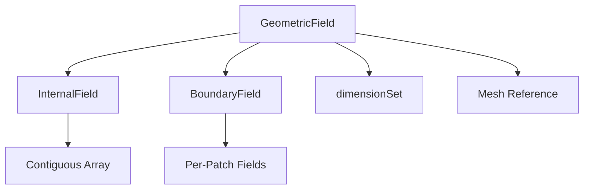

# GeometricField Design Philosophy

ปรัชญาการออกแบบ GeometricField

---

## Overview

> **GeometricField** = Field + Mesh + Dimensions + Boundary Conditions



---

## 1. Core Design Goals

| Goal | How Achieved |
|------|--------------|
| **Type Safety** | Template parameters |
| **Performance** | Contiguous memory |
| **Flexibility** | Polymorphic BC |
| **Physical Correctness** | Dimension checking |

---

## 2. Template Structure

```cpp
template<class Type, template<class> class PatchField, class GeoMesh>
class GeometricField : public DimensionedField<Type, GeoMesh>
{
    // Type: scalar, vector, tensor
    // PatchField: fvPatchField, fvsPatchField
    // GeoMesh: volMesh, surfaceMesh
};
```

### Type Parameter

| Type | Rank | Components |
|------|------|------------|
| `scalar` | 0 | 1 |
| `vector` | 1 | 3 |
| `tensor` | 2 | 9 |
| `symmTensor` | 2 | 6 |

---

## 3. Internal vs Boundary

### Internal Field

```cpp
// Contiguous array for cache efficiency
Field<Type> internalField_;

// Access
T[cellI]                    // Direct access
T.internalField()           // Get reference
```

### Boundary Field

```cpp
// Collection of patch fields
GeometricBoundaryField boundaryField_;

// Access per patch
T.boundaryField()[patchI]
T.boundaryFieldRef()[patchI]  // Mutable
```

---

## 4. Dimension System

```cpp
// 7 SI base dimensions
dimensionSet(M, L, T, Θ, I, N, J)

// Examples
dimPressure   = [1, -1, -2, 0, 0, 0, 0]  // kg/(m·s²)
dimVelocity   = [0, 1, -1, 0, 0, 0, 0]   // m/s
dimless       = [0, 0, 0, 0, 0, 0, 0]    // -
```

### Automatic Checking

```cpp
volScalarField p;  // [M L^-1 T^-2]
volVectorField U;  // [L T^-1]

// Valid
volScalarField rhoU2 = rho * magSqr(U);  // ✓

// Invalid (dimension mismatch)
// volScalarField bad = p + U;  // Error!
```

---

## 5. Mesh Coupling

```cpp
class GeometricField
{
    const GeoMesh& mesh_;  // Reference to mesh

    // Mesh provides:
    // - Cell volumes: V()
    // - Face areas: Sf()
    // - Cell centers: C()
    // - etc.
};
```

### Field-Mesh Operations

```cpp
// Volume-weighted average
scalar avgT = (T * mesh.V()).sum() / mesh.V().sum();

// Face interpolation
surfaceScalarField Tf = fvc::interpolate(T);
```

---

## 6. Time Management

```cpp
class GeometricField
{
    mutable label timeIndex_;
    mutable GeometricField* field0Ptr_;      // Old time
    mutable GeometricField* fieldPrevIterPtr_; // Prev iteration
};
```

### Old Time Access

```cpp
// Get old time field
const volScalarField& T0 = T.oldTime();

// Time derivative
fvm::ddt(T)  // Uses T and T.oldTime()
```

---

## 7. Memory Efficiency

### tmp Pattern

```cpp
// Temporary field (reference counted)
tmp<volScalarField> tResult = fvc::grad(p);

// Use result
volVectorField gradP = tResult();

// Memory freed when tmp goes out of scope
```

### Lazy Allocation

- Old time fields created only when needed
- Boundary fields allocated per-patch

---

## Quick Reference

| Component | Purpose |
|-----------|---------|
| `internalField_` | Cell values |
| `boundaryField_` | Patch values + BC |
| `dimensions_` | Physical units |
| `mesh_` | Geometry reference |
| `timeIndex_` | Time management |

---

## Concept Check

<details>
<summary><b>1. ทำไม internal field ต้อง contiguous?</b></summary>

เพื่อ **cache efficiency** — การเข้าถึงข้อมูลต่อเนื่องเร็วกว่า scattered access
</details>

<details>
<summary><b>2. tmp pattern ช่วยอะไร?</b></summary>

**Automatic memory management** — ไม่ต้อง delete เอง, ลด memory leaks
</details>

<details>
<summary><b>3. oldTime() ใช้เมื่อไหร่?</b></summary>

เมื่อต้องการ **previous time step value** สำหรับ time derivatives (`fvm::ddt`)
</details>

---

## Related Documents

- **ภาพรวม:** [00_Overview.md](00_Overview.md)
- **Field Types:** [../08_FIELD_TYPES/00_Overview.md](../08_FIELD_TYPES/00_Overview.md)