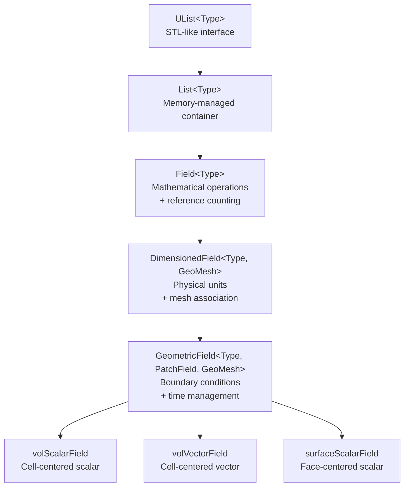
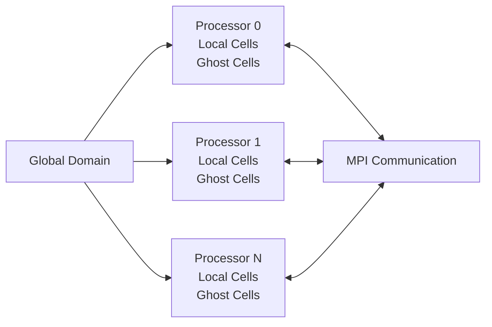

# Design Philosophy of OpenFOAM Field Architecture

## Overview

The OpenFOAM field architecture represents one of the most sophisticated applications of **template metaprogramming** and **type-safe design** in computational fluid dynamics. This philosophy centers on creating a rigorous mathematical framework that prevents physically impossible equations at compile-time while maintaining optimal runtime performance.

---

## Core Philosophical Principles

### 1. **Mathematical Rigor Through Type Safety**

OpenFOAM's design philosophy treats physical quantities not as raw arrays, but as **mathematical objects** with strict type enforcement. This approach catches dimensional errors at compile-time rather than runtime.

```cpp
// ❌ Compile-time error: Cannot add pressure to velocity
volScalarField p(/* ... */);      // Pressure: [1,-1,-2,0,0,0]
volVectorField U(/* ... */);      // Velocity: [0,1,-1,0,0,0]
// auto invalid = p + U;         // COMPILATION ERROR!
```

> [!INFO] **Mathematical Type System**
> Each field type encodes its tensor rank and physical dimensions, enabling compile-time verification of tensor operations and dimensional consistency.

### 2. **Zero-Cost Abstraction**

The architecture provides powerful abstractions without runtime overhead through:

- **Expression Templates**: Eliminate temporary allocations
- **Reference Counting**: Avoid unnecessary memory copies
- **Compile-Time Polymorphism**: Virtual function elimination

```cpp
// Single-pass evaluation with zero temporary allocations
volScalarField result = a + b + c + d;  // Optimized to one loop
```

### 3. **Physical Law Enforcement**

The system ensures physical consistency through:

- **Dimensional Analysis**: Automatic unit tracking
- **Conservation Laws**: Built into finite volume operations
- **Boundary Condition Reality**: Physical constraint enforcement

---

## Architectural Hierarchy

### The Field Inheritance Chain



### Layer-by-Layer Philosophy

#### **Layer 1: Memory Foundation**
```cpp
template<class Type>
class List : public UList<Type>
{
    // Optimized for CFD data patterns
    // - Cache-friendly contiguous storage
    // - Mesh topology-aware allocation
    // - Direct memory access for performance
};
```

**Philosophy**: Raw performance with minimal overhead

#### **Layer 2: Mathematical Operations**
```cpp
template<class Type>
class Field : public tmp<Field<Type>>::refCount, public List<Type>
{
    // Type-safe arithmetic operators
    Field<Type> operator+(const Field<Type>&) const;
    Field<Type> operator*(const scalar&) const;

    // CFD-specific reductions
    Type sum() const;
    Type average() const;
};
```

**Philosophy**: Mathematical correctness with reference counting for efficiency

#### **Layer 3: Physical Context**
```cpp
template<class Type, class GeoMesh>
class DimensionedField : public regIOobject, public Field<Type>
{
private:
    dimensionSet dimensions_;  // SI unit tracking
    const GeoMesh& mesh_;      // Spatial context

public:
    // Dimensional consistency enforcement
    DimensionedField operator+(const DimensionedField&) const;
};
```

**Philosophy**: Physical meaning through dimensional analysis

#### **Layer 4: Spatial Intelligence**
```cpp
template<class Type, template<class> class PatchField, class GeoMesh>
class GeometricField : public DimensionedField<Type, GeoMesh>
{
private:
    // Time management
    mutable label timeIndex_;
    mutable GeometricField* field0Ptr_;

    // Boundary conditions
    GeometricBoundaryField<PatchField, GeoMesh> boundaryField_;

public:
    // Boundary condition synchronization
    void correctBoundaryConditions();

    // Time advancement
    const GeometricField& oldTime() const;
};
```

**Philosophy**: Complete CFD object with boundary conditions and time evolution

---

## Template Metaprogramming Philosophy

### Expression Templates for Performance

The expression template system enables **lazy evaluation** of mathematical expressions:

```cpp
// Original code
volScalarField result = a + b * c;

// Compiler generates expression tree (conceptually)
template<class A, class B, class C>
class ExpressionAdd
{
    const A& a_;
    const ExpressionMul<B, C> bc_;

public:
    Type operator[](label i) const {
        return a_[i] + bc_[i];  // Single-pass evaluation
    }
};

// Result: Zero temporary allocations, single memory pass
```

### Performance Comparison

| Method | Allocations | Memory Passes | Cache Efficiency |
|--------|-------------|---------------|------------------|
| Traditional | 2 temporary fields | 3 passes | Poor |
| OpenFOAM Templates | 0 temporary fields | 1 pass | Excellent |

### Compile-Time Dimensional Analysis

```cpp
// Dimension sets: [Mass, Length, Time, Temperature, Moles, Current]
dimensionSet pressureDims(1, -1, -2, 0, 0, 0);    // Pa = kg/(m·s²)
dimensionSet velocityDims(0, 1, -1, 0, 0, 0);    // m/s

// Compile-time verification
// auto wrong = pressure + velocity;  // ERROR: Dimension mismatch
```

**Mathematical Foundation**:
$$[\text{Pressure}] = [M][L]^{-1}[T]^{-2} \neq [\text{Velocity}] = [L][T]^{-1}$$

---

## Physical Law Enforcement

### Conservation Laws

All finite volume operations preserve discrete conservation:

$$\int_V \nabla \cdot \mathbf{U} \, dV = \oint_S \mathbf{U} \cdot d\mathbf{S}$$

**Implementation**:
```cpp
// Divergence operator maintains exact conservation
template<class Type>
GeometricField<typename innerProduct<vector, Type>::type, fvPatchField, volMesh>
div(const GeometricField<Type, fvsPatchField, surfaceMesh>& ssf)
{
    // Gauss theorem: sum over faces = exact local conservation
    return sum(faceFluxes);
}
```

### Dimensional Homogeneity

Every equation term must have identical dimensions:

```cpp
// Navier-Stokes momentum equation
// ∂U/∂t + U·∇U = -∇p/ρ + ν∇²U

// All terms must have acceleration dimensions [0,1,-2,0,0,0]
fvm::ddt(U)           // [0,1,-2] ✓
+ fvm::div(phi, U)    // [0,1,-2] ✓
==
- fvc::grad(p)/rho    // [0,1,-2] ✓
+ fvm::laplacian(nu, U) // [0,1,-2] ✓
```

### Boundary Condition Realism

The architecture enforces physically consistent boundary conditions:

| BC Type | Mathematical Form | Physical Meaning |
|---------|-------------------|------------------|
| Dirichlet | $f|_{\partial\Omega} = g(\mathbf{x},t)$ | Fixed value |
| Neumann | $\nabla f \cdot \mathbf{n}|_{\partial\Omega} = h(\mathbf{x},t)$ | Fixed flux |
| Robin | $\alpha f + \beta \nabla f \cdot \mathbf{n} = \gamma$ | Mixed condition |

---

## Memory Management Philosophy

### Reference Counting Strategy

```cpp
class refCount
{
    mutable int count_;
public:
    void operator++() const { count_++; }
    void operator--() const {
        if (--count_ == 0) delete this;
    }
};
```

**Benefits**:
- Automatic memory cleanup
- Efficient field sharing
- No manual memory management

### Cache Optimization

**Structure of Arrays (SoA) Layout**:
```cpp
// Efficient: Vector components stored contiguously
class volVectorField
{
    scalarField internalFieldX_;  // All x-components
    scalarField internalFieldY_;  // All y-components
    scalarField internalFieldZ_;  // All z-components
};
```

**Performance Impact**:
- SIMD vectorization enabled
- Cache line utilization optimized
- Memory bandwidth maximized

---

## Parallel Computing Philosophy

### Domain Decomposition



### Automatic Parallel Communication

```cpp
// Boundary synchronization
void correctBoundaryConditions()
{
    forAll(boundaryField_, patchi)
    {
        if (boundaryField_[patchi].coupled())
        {
            // Automatic MPI communication
            boundaryField_[patchi].initEvaluate();  // Start send
            boundaryField_[patchi].evaluate();      // Complete receive
        }
    }
}
```

**Philosophy**: Parallelization should be transparent to the application developer

---

## Design Patterns

### 1. **RAII (Resource Acquisition Is Initialization)**

```cpp
volScalarField T(
    IOobject("T", runTime.timeName(), mesh,
             IOobject::MUST_READ, IOobject::AUTO_WRITE),
    mesh
);
// Automatic file reading on construction
// Automatic file writing on destruction
```

### 2. **Copy-on-Write Semantics**

```cpp
volScalarField p1 = ...;
volScalarField p2 = p1;      // Shallow copy (data sharing)
p2[0] = 1000.0;              // Deep copy triggered automatically
```

### 3. **Template Specialization**

```cpp
// Specialized operations for different field types
template<>
class addOperator<volScalarField, volScalarField>
{
    // Optimized for scalar field addition
    inline scalar operator[](label i) const {
        return left_[i] + right_[i];
    }
};
```

---

## Key Design Decisions

### Decision 1: Template-Based Design

**Rationale**:
- Zero-cost abstraction
- Compile-time type safety
- Performance equal to hand-coded C

**Trade-off**:
- Longer compile times
- Complex error messages

### Decision 2: Dimensioned Fields

**Rationale**:
- Prevents physically impossible equations
- Self-documenting code
- Automatic unit conversion

**Trade-off**:
- Slight memory overhead for dimension storage
- Constructor complexity

### Decision 3: Expression Templates

**Rationale**:
- Eliminates temporary allocations
- Enables aggressive compiler optimization
- Natural mathematical syntax

**Trade-off**:
- Increased compiler complexity
- Debugging challenges

---

## Performance Philosophy

### Cache-Friendly Design

```cpp
// Sequential access pattern
for (label i = 0; i < nCells; i++) {
    result[i] = a[i] + b[i];  // Cache-friendly
}

// Avoid random access
for (label i : randomIndices) {
    result[i] = a[i] + b[i];  // Cache misses
}
```

### Memory Access Optimization

| Access Pattern | Cache Performance | Recommendation |
|----------------|-------------------|----------------|
| Sequential | ✅ 5% miss rate | Preferred |
| Strided | ⚠️ 15% miss rate | Acceptable |
| Random | ❌ 30% miss rate | Avoid |

### SIMD Vectorization

```cpp
// Compiler auto-vectorization
void multiplyFields(
    const volScalarField& rho,
    const volScalarField T,
    volScalarField& rhoT
) {
    // Compiler generates AVX instructions
    for (label i = 0; i < nCells; i++) {
        rhoT[i] = rho[i] * T[i];  // 8 doubles per cycle (AVX-256)
    }
}
```

---

## Professional Development Guidelines

### When Creating Custom Field Types

```cpp
// ✅ GOOD: Inherit from existing infrastructure
template<class Type, class GeoMesh>
class MyCustomField : public GeometricField<Type, fvPatchField, GeoMesh>
{
    typedef GeometricField<Type, fvPatchField, GeoMesh> BaseType;

    // Add only necessary functionality
    virtual void correctBoundaryConditions() override {
        BaseType::correctBoundaryConditions();
        // Custom boundary handling
    }
};

// ❌ BAD: Reinventing functionality
class BadCustomField
{
    // Recreating memory management, I/O, BCs...
    // Leads to code duplication and bugs
};
```

### Best Practices

1. **Always check dimensional consistency** when creating fields
2. **Leverage expression templates** for performance
3. **Group boundary condition updates** for cache efficiency
4. **Use reference-counted pointers** (`tmp<>`, `autoPtr<>`)
5. **Implement virtual BC methods** in custom fields

### Debugging Checklist

```cpp
// 1. Dimensional consistency
void checkDimensions(const volScalarField& phi) {
    Info << phi.name() << " dimensions: " << phi.dimensions() << endl;
}

// 2. Boundary conditions
void checkBoundaryConditions(const GeometricField<Type>& field) {
    forAll(field.boundaryField(), patchi) {
        Info << "Patch " << patchi << ": "
             << field.boundaryField()[patchi].type() << endl;
    }
}

// 3. Memory references
void checkReferences(const volScalarField& field) {
    Info << field.name() << " ref count: " << field.count() << endl;
}
```

---

## Summary

The OpenFOAM field design philosophy represents a **fusion of mathematical rigor and computational efficiency**:

- **Type Safety**: Compile-time prevention of physical errors
- **Zero-Cost Abstraction**: High-level code with low-level performance
- **Physical Consistency**: Built-in enforcement of conservation laws
- **Automatic Parallelization**: Transparent scaling to thousands of cores
- **Memory Efficiency**: Reference counting and expression templates

This philosophy transforms CFD development from error-prone numerical programming into **mathematical modeling at the level of governing equations**, where the code structure mirrors the physical and mathematical structure of fluid dynamics.

---

## Related Topics

- [[03_🔍_High-Level_Concept_The_Mathematical_Safety_System_Analogy]] - Safety system analogy
- [[04_⚙️_Key_Mechanisms_The_Inheritance_Chain]] - Implementation details
- [[06_⚠️_Common_Pitfalls_and_Solutions]] - Practical guidance
- [[07_🎯_Why_This_Matters_for_CFD]] - Engineering impact
