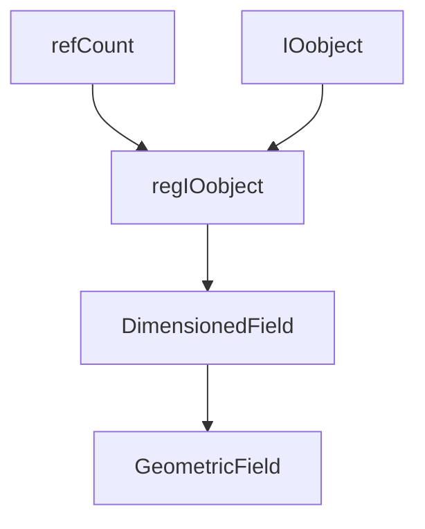

# Inheritance Hierarchy

ลำดับการสืบทอดของ GeometricField — เข้าใจ Class Structure

> **ทำไมบทนี้สำคัญ?**
> - เข้าใจว่า **GeometricField มาจากไหน**
> - รู้ว่า features แต่ละอย่างอยู่ที่ class ไหน
> - Debug ได้เร็วขึ้นเมื่อเข้าใจ hierarchy

---

## Overview

> **💡 GeometricField = IOobject + DimensionedField + Boundaries**
>
> แต่ละ layer เพิ่ม features ต่างกัน



---

## 1. Class Hierarchy

| Class | Purpose |
|-------|---------|
| `IOobject` | Name, path, I/O options |
| `regIOobject` | Registry, auto I/O |
| `DimensionedField` | Values + dimensions |
| `GeometricField` | + Boundary conditions |

---

## 2. IOobject

```cpp
IOobject header
(
    "fieldName",           // Name
    runTime.timeName(),    // Time instance
    mesh,                  // Registry
    IOobject::MUST_READ,   // Read option
    IOobject::AUTO_WRITE   // Write option
);
```

### Key Methods

| Method | Returns |
|--------|---------|
| `name()` | Field name |
| `path()` | File path |
| `instance()` | Time directory |
| `db()` | Registry reference |

---

## 3. regIOobject

```cpp
// Automatic registration with objectRegistry
regIOobject::store();

// Check if registered
bool isReg = T.registered();

// Write to disk
T.write();
```

---

## 4. DimensionedField

```cpp
template<class Type, class GeoMesh>
class DimensionedField : public regIOobject
{
    dimensionSet dimensions_;
    Field<Type> field_;
    const GeoMesh::Mesh& mesh_;
};
```

### Access

```cpp
const dimensionSet& dims = field.dimensions();
const Field<Type>& values = field.primitiveField();
```

---

## 5. GeometricField

```cpp
template<class Type, template<class> class PatchField, class GeoMesh>
class GeometricField : public DimensionedField<Type, GeoMesh>
{
    GeometricBoundaryField<Type, PatchField, GeoMesh> boundaryField_;
    mutable Field<Type>* field0Ptr_;      // Old time
    mutable Field<Type>* fieldPrevIterPtr_;
};
```

### Additional Features

| Feature | Method |
|---------|--------|
| Boundary | `boundaryField()` |
| Old time | `oldTime()` |
| Prev iteration | `prevIter()` |
| Correct BC | `correctBoundaryConditions()` |

---

## 6. Memory Management

```cpp
// Reference counting via refCount
// Automatic cleanup when count reaches 0

// Safe access
if (fieldPtr_.valid())
{
    const Field<Type>& f = fieldPtr_();
}
```

---

## Quick Reference

| Base Class | Adds |
|------------|------|
| IOobject | Name, path, I/O |
| regIOobject | Registry, write |
| DimensionedField | Values, dimensions |
| GeometricField | Boundary, old time |

---

## 🧠 Concept Check

<details>
<summary><b>1. IOobject ทำอะไร?</b></summary>

**Manage file I/O**: name, path, read/write options
</details>

<details>
<summary><b>2. DimensionedField vs GeometricField?</b></summary>

**GeometricField** adds boundary conditions
</details>

<details>
<summary><b>3. regIOobject ทำอะไร?</b></summary>

**Auto registration** กับ objectRegistry + auto write
</details>

---

## 📖 เอกสารที่เกี่ยวข้อง

- **ภาพรวม:** [00_Overview.md](00_Overview.md)
- **Field Lifecycle:** [04_Field_Lifecycle.md](04_Field_Lifecycle.md)