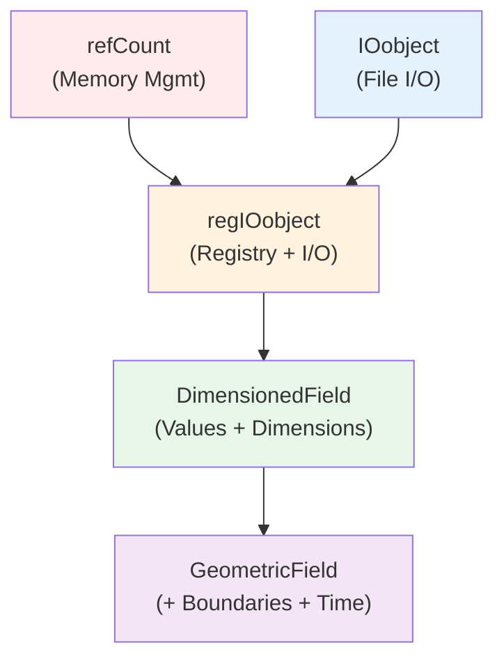
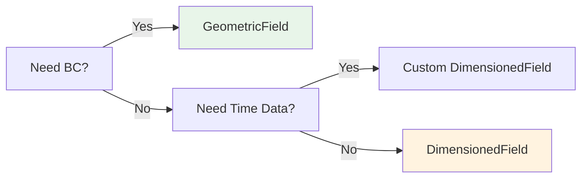
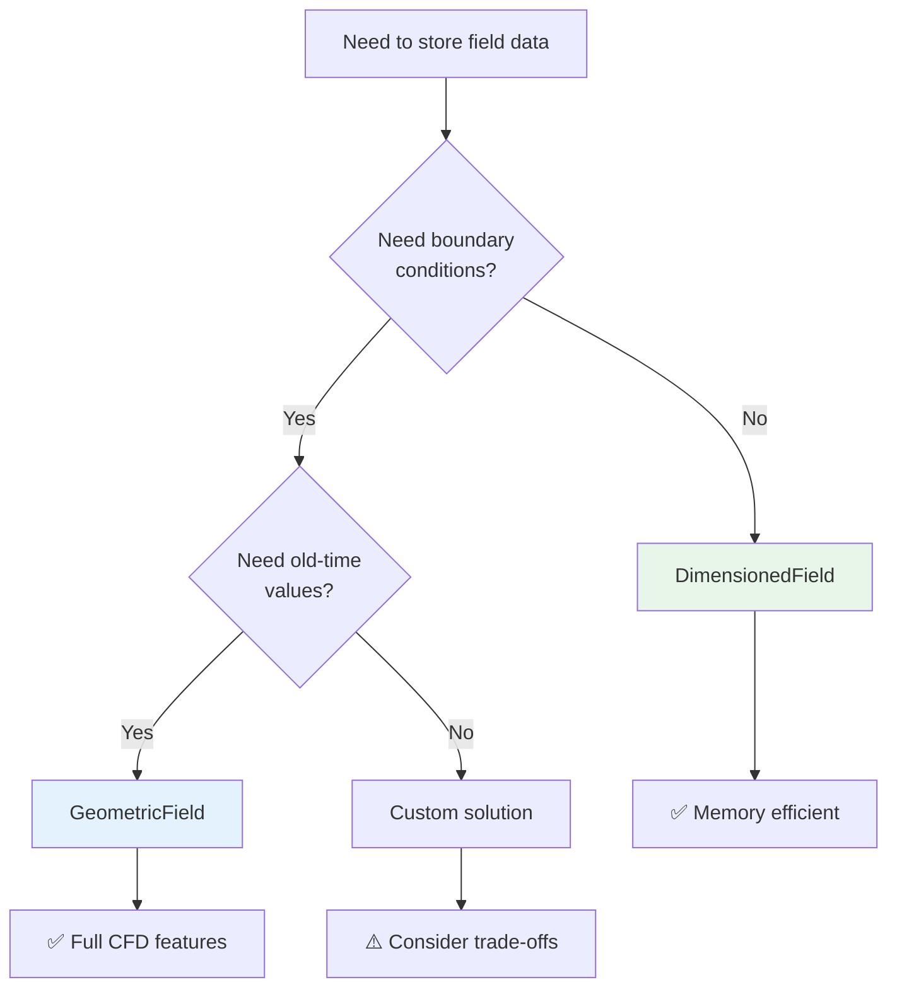
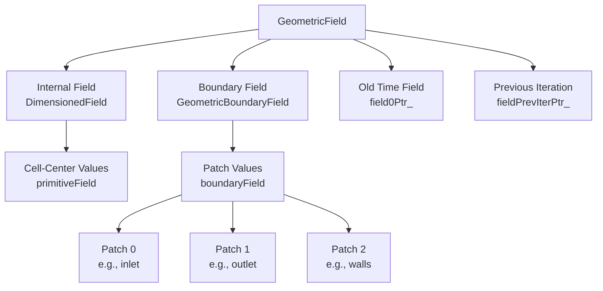
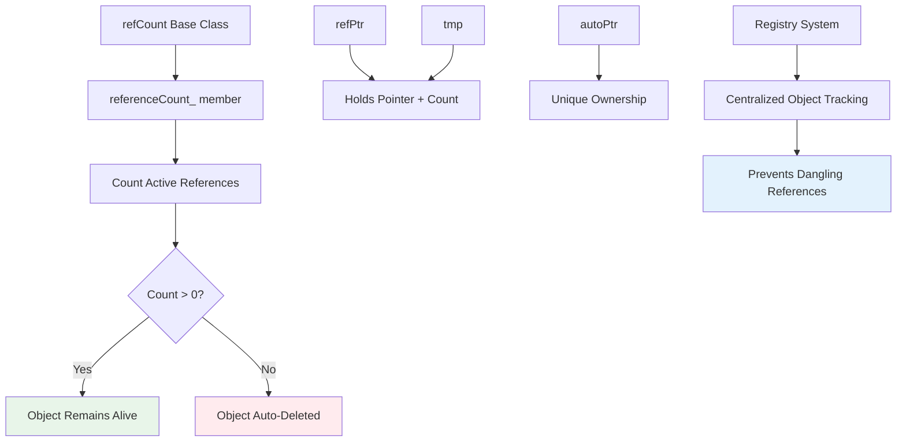
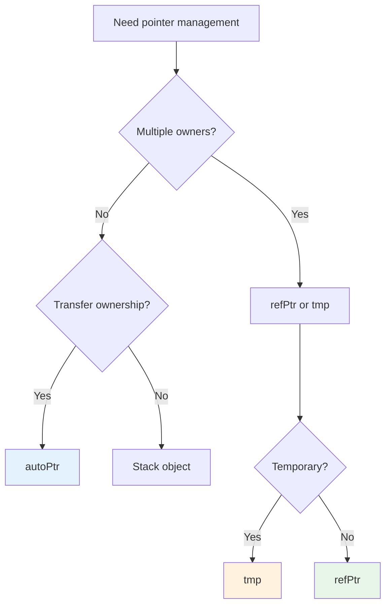

# Inheritance Hierarchy

ลำดับการสืบทอดของ GeometricField — เข้าใจ Class Structure

---

## 🎯 Learning Objectives | เป้าหมายการเรียนรู้

**After completing this section, you will be able to:**
- ✅ Map the complete inheritance hierarchy from `refCount` to `GeometricField`
- ✅ Identify which features are provided by each base class
- ✅ Apply this knowledge to debug field-related errors more efficiently
- ✅ Understand memory management through reference counting
- ✅ Navigate the object registry system in OpenFOAM
- ✅ Choose appropriate field types for specific CFD applications

**หลังจากศึกษาบทนี้ คุณจะสามารถ:**
- ✅ วาดเส้นทางการสืบทอดจาก `refCount` ถึง `GeometricField` ได้
- ✅ ระบุว่า feature แต่ละอย่างมาจาก class ไหน
- ✅ ใช้ความรู้นี้ช่วย debug ข้อผิดพลาดเกี่ยวกับ field ได้เร็วขึ้น
- ✅ เข้าใจการจัดการหน่วยความจำผ่าน reference counting
- ✅ ทำความเข้าใจระบบ object registry ใน OpenFOAM
- ✅ เลือก field type ที่เหมาะสมกับงาน CFD ที่ต้องการ

---

## 📚 ทำมา / Why This Matters

> **"Why should I care about inheritance hierarchy?"**

### 1. **Debugging Efficiency**
เมื่อ compile error บอกว่า "no matching function for call to 'oldTime()'" คุณจะรู้ทันทีว่า:
- `oldTime()` ถูกเพิ่มใน **GeometricField** level
- ถ้าใช้กับ `DimensionedField` จะไม่มี method นี้
- ต้องอัปเกรดเป็น `GeometricField` หรือหาทางอื่น

### 2. **Memory Management**
รู้ว่าใครเป็นเจ้าของหน่วยความจำ:
- `refCount` → Reference counting อัตโนมัติ
- `regIOobject` → Registration กับ registry
- เมื่อ reference count = 0 → Cleanup อัตโนมัติ

### 3. **Feature Location**
รู้ทันทีว่า feature อยู่ที่ level ไหน:
| Feature | Available From |
|---------|----------------|
| `name()`, `path()` | `IOobject` |
| `write()`, `registered()` | `regIOobject` |
| `dimensions()`, `primitiveField()` | `DimensionedField` |
| `boundaryField()`, `oldTime()` | `GeometricField` |

### 4. **Why This Matters for Debugging**
การเข้าใจ hierarchy ช่วยลดเวลา debugging:

```cpp
// ❌ Common Error: Using wrong method at wrong level
DimensionedField<scalar, volMesh> df(...);
df.oldTime();  // COMPILER ERROR: oldTime() not in DimensionedField

// ✅ Solution: Use GeometricField for boundary + old time support
GeometricField<scalar, fvPatchField, volMesh> gf(...);
gf.oldTime();  // Works!
```

### 5. **CFD Consequence: Performance & Stability**
เลือก field type ผิด → ผลกระทบต่อ simulation:
- **Memory waste:** ใช้ `GeometricField` กับ property ที่ไม่ต้องการ BC
- **Runtime error:** ใช้ `DimensionedField` กับ field ที่ต้องการ boundary values
- **Solver instability:** ไม่มี old-time fields สำหรับ transient schemes

---

## 🔍 Overview

> **💡 GeometricField = IOobject + DimensionedField + BoundaryField**
>
> แต่ละ layer เพิ่ม capabilities ต่างกัน เหมือนการสะสม feature

### Complete Hierarchy Flowchart



### Feature Accumulation Table

| Layer | Class | Key Features Added | CFD Impact |
|-------|-------|-------------------|------------|
| 0 | `refCount` | Reference counting, automatic cleanup | Prevents memory leaks in long simulations |
| 1 | `IOobject` | Name, path, read/write options | Field I/O management |
| 2 | `regIOobject` | Object registration, automatic I/O | Mesh integration, parallel data handling |
| 3 | `DimensionedField` | Dimension sets, internal field values | Dimensional consistency, cell-centered data |
| 4 | `GeometricField` | Boundary conditions, old time, prev iteration | Complete CFD field handling |

### Hierarchy Design Philosophy

**OpenFOAM's inheritance strategy follows three principles:**

1. **Single Responsibility:** Each class has one clear purpose
2. **Feature Accumulation:** Child classes inherit ALL parent features
3. **Minimal Overhead:** Only pay for what you use



---

## 1. Class Hierarchy Detail

### 1.1 Inheritance Structure

```cpp
// Complete inheritance chain for GeometricField<scalar, fvPatchField, volMesh>

refCount
  └─ IOobject
       └─ regIOobject
            └─ DimensionedField<Type, GeoMesh>
                 └─ GeometricField<Type, PatchField, GeoMesh>
```

### 1.2 Class Responsibilities

| Class | Core Responsibility | Typical Usage | Memory Footprint |
|-------|---------------------|---------------|------------------|
| `refCount` | Memory management | Base for all ref-counted objects | 1 pointer (8 bytes) |
| `IOobject` | File I/O metadata | Setting up file paths, read/write | ~100 bytes |
| `regIOobject` | Registry integration | Auto-registration with mesh/database | +16 bytes |
| `DimensionedField` | Internal field data | Non-geometric fields (e.g., thermodynamic props) | Field size + overhead |
| `GeometricField` | Complete field with BC | Most common fields (U, p, T, etc.) | +boundary storage |

### 1.3 Template Parameter Evolution

```cpp
// Layer 0: No templates
class refCount;

// Layer 1: Basic metadata
class IOobject;

// Layer 2: Still no template addition
class regIOobject;

// Layer 3: First template parameters
template<class Type, class GeoMesh>
class DimensionedField;

// Layer 4: Full template specification
template<
    class Type,                      // Data type
    template<class> class PatchField, // BC policy
    class GeoMesh                    // Mesh type
>
class GeometricField;
```

---

## 2. IOobject — File I/O Foundation

### 2.1 What IOobject Provides

**Purpose:** Manages the relationship between objects and their file representation

**Key Data:**
```cpp
IOobject
(
    const word& name,           // Field name
    const fileName& instance,   // Time directory (e.g., "0", "1.5")
    const fileName& local,      // Local path (e.g., "polyMesh/points")
    const Time& db,             // Database/Time reference
    readOption rOpt,            // MUST_READ, READ_IF_PRESENT, NO_READ
    writeOption wOpt            // AUTO_WRITE, NO_WRITE
);
```

### 2.2 Practical Example

```cpp
// Create IOobject for pressure field
IOobject pIO
(
    "p",                      // Field name
    runTime.timeName(),       // Current time
    mesh,                     // Registry (mesh database)
    IOobject::MUST_READ,      // Must exist at startTime
    IOobject::AUTO_WRITE      // Write every time step
);

// Access metadata
word fieldName = pIO.name();       // "p"
fileName timeDir = pIO.instance(); // "0"
const objectRegistry& db = pIO.db(); // Reference to mesh
```

### 2.3 Key Methods

| Method | Returns | Use Case | Line Reference |
|--------|---------|----------|----------------|
| `name()` | `word&` | Get/set field name | Used in [Section 7.2](#72-runtime-debugging-checklist) |
| `path()` | `fileName` | Full path to object | File location verification |
| `instance()` | `fileName&` | Time directory name | Time stepping |
| `db()` | `objectRegistry&` | Parent registry | Database lookup |
| `readOpt()` | `readOption` | Check read behavior | I/O control |
| `writeOpt()` | `writeOption` | Check write behavior | I/O control |

### 2.4 Read/Write Options

```cpp
// Read options
enum readOption {
    MUST_READ,       // File must exist → error if missing
    READ_IF_PRESENT, // Read if exists, otherwise OK
    NO_READ          // Don't attempt to read
};

// Write options
enum writeOption {
    AUTO_WRITE,      // Automatically write on output
    NO_WRITE         // Never write (temporary fields)
};
```

### 2.5 Why This Matters for Debugging

**Common Issue: Field Not Writing**

```cpp
// ❌ PROBLEM: Field changes but file not updated
IOobject io
(
    "p",
    runTime.timeName(),
    mesh,
    IOobject::MUST_READ,
    IOobject::NO_WRITE  // ← THIS IS THE PROBLEM
);

// ✅ SOLUTION: Change to AUTO_WRITE
IOobject io
(
    "p",
    runTime.timeName(),
    mesh,
    IOobject::MUST_READ,
    IOobject::AUTO_WRITE  // ← FIXED
);
```

---

## 3. regIOobject — Registry Integration

### 3.1 What regIOobject Adds

**Purpose:** Automatic registration with `objectRegistry` for database management

**Key Capabilities:**
- ✅ Auto-register when constructed
- ✅ Auto-deregister when destroyed
- ✅ Automatic I/O with `write()` and `read()`
- ✅ Lookup by name from registry

### 3.2 Registration Mechanism


### 3.3 Practical Usage

```cpp
// Registration is automatic via constructor
regIOobject obj(ioObject);  // Automatically registered to mesh.db()

// Manual registration (rarely needed)
ptr = obj_.ptr();  // Creates autoPtr, registers to db

// Check if registered
if (obj.registered()) {
    Info << "Object is in registry" << endl;
}

// Lookup from registry (alternative to direct access)
const objectRegistry& db = mesh.thisDb();
if (db.foundObject<regIOobject>("fieldName")) {
    const regIOobject& obj = db.lookupObject<regIOobject>("fieldName");
}

// Write to disk (uses IOobject path)
obj.write();  // Writes to <time>/<obj.name()>
```

### 3.4 Registry Hierarchy

```
Time (runTime.db())
├─ polyMesh (mesh.db())
│   ├─ points (regIOobject)
│   ├─ faces (regIOobject)
│   └─ cells (regIOobject)
└─ finiteVolume (mesh.thisDb())
    ├─ U (GeometricField → regIOobject)
    ├─ p (GeometricField → regIOobject)
    └─ T (GeometricField → regIOobject)
```

### 3.5 Parallel Processing Implications

```cpp
// In parallel runs, registry handles distributed data
if (Pstream::parRun()) {
    // Each processor has its own registry
    const objectRegistry& procDB = mesh.thisDb();
    
    // Registered objects are processor-local
    // Master processor handles global operations
    
    // Example: Gather field data to master
    Field<scalar> globalField = reconstructField(
        mesh,
        p.primitiveField()
    );
}
```

---

## 4. DimensionedField — Internal Field Data

### 4.1 What DimensionedField Adds

**Purpose:** Stores internal field values with dimensional consistency

**Template Parameters:**
```cpp
template<class Type, class GeoMesh>
class DimensionedField
: public regIOobject
{
    // Core data members
    dimensionSet dimensions_;    // [kg m s^-1 K^-1 ...]
    Field<Type> field_;          // Internal cell values
    const GeoMesh::Mesh& mesh_;  // Mesh reference
};
```

### 4.2 DimensionSet System

```cpp
// Common dimension sets
dimensionSet dimless(0, 0, 0, 0, 0, 0, 0);        // [ ]
dimensionSet dimLength(0, 1, 0, 0, 0, 0, 0);      // [m]
dimensionSet dimVelocity(0, 1, -1, 0, 0, 0, 0);   // [m/s]
dimensionSet dimPressure(1, -1, -2, 0, 0, 0, 0);  // [kg/(m·s²)]
dimensionSet dimTemperature(0, 0, 0, 1, 0, 0, 0); // [K]

// Constructor
dimensionSet dims(1, -1, -2, 0, 0, 0, 0); // Mass, Length, Time, Temperature, ...

// Access
dimensionSet& dims = field.dimensions();
Info << "Dimensions: " << dims << endl; // [1 -1 -2 0 0 0 0]
```

### 4.3 Internal Field Access

```cpp
// Create DimensionedField
DimensionedField<scalar, volMesh> T
(
    IOobject(...),
    mesh,
    dimensionSet(0, 0, 0, 1, 0, 0, 0), // [K]
    Field<scalar>(mesh.nCells(), 300.0) // Initial value
);

// Access internal values
const Field<scalar>& internal = T.primitiveField();
Field<scalar>& internalMutable = T.primitiveFieldRef();

forAll(internal, i) {
    internal[i] *= 1.1;  // Modify internal values
}

// Dimensions
const dimensionSet& dims = T.dimensions();

// Mesh reference
const fvMesh& meshRef = T.mesh();
```

### 4.4 When to Use DimensionedField

**Use DimensionedField when:**
- ✅ Field has NO boundary conditions (cell-center only)
- ✅ Properties that are uniform per cell (e.g., porosity, thermodynamic props)
- ✅ Intermediate calculations
- ✅ Memory efficiency is critical (no boundary storage overhead)

**Examples in OpenFOAM:**
```cpp
// Used for:
- rhoInitial: Initial density field (no BC needed)
- thermodynamicProperties: Material properties
- turbulenceProperties: Model coefficients
- cellVolumes: Volume of each cell
- cellCentres: Position vectors
```

**Use GeometricField when:**
- ✅ Field needs boundary conditions
- ✅ Field varies on patches
- ✅ Field needs old-time values for transient schemes

### 4.5 DimensionedField vs GeometricField Decision Tree



---

## 5. GeometricField — Complete Field with Boundaries

### 5.1 What GeometricField Adds

**Purpose:** Complete field representation with boundary conditions and time management

**Template Parameters:**
```cpp
template
<
    class Type,                      // Data type (scalar, vector, tensor...)
    template<class> class PatchField, // BC type (fvPatchField, fvsPatchField...)
    class GeoMesh                    // Mesh type (volMesh, surfaceMesh...)
>
class GeometricField
: public DimensionedField<Type, GeoMesh>
{
    // Additional data beyond DimensionedField
    GeometricBoundaryField<Type, PatchField, GeoMesh> boundaryField_;
    mutable Field<Type>* field0Ptr_;         // Old time (t - Δt)
    mutable Field<Type>* fieldPrevIterPtr_;  // Previous iteration
};
```

### 5.2 Complete Field Structure



### 5.3 Boundary Field Access

```cpp
// Create GeometricField
GeometricField<scalar, fvPatchField, volMesh> p
(
    IOobject("p", ...),
    mesh,
    dimensionSet(1, -1, -2, 0, 0, 0, 0), // [Pa]
    Field<scalar>(mesh.nCells(), 101325.0),
    pBoundaryConditions  // BC for each patch
);

// Access boundary field
const GeometricBoundaryField<scalar, fvPatchField, volMesh>& bf = p.boundaryField();

// Iterate over patches
forAll(bf, patchI) {
    const fvPatchField<scalar>& patch = bf[patchI];
    Info << "Patch " << patch.patch().name() << endl;
    Info << "  Type: " << patch.type() << endl;
    Info << "  Size: " << patch.size() << endl;
    
    // Access face values on this patch
    forAll(patch, faceI) {
        scalar faceValue = patch[faceI];
    }
}

// Specific patch access
label inletID = mesh.boundaryMesh().findPatchID("inlet");
const fvPatchField<scalar>& inletPatch = p.boundaryField()[inletID];
```

### 5.4 Time Management

```cpp
// Old-time field (for transient schemes)
const Field<scalar>& p_old = p.oldTime();        // t - Δt
const Field<scalar>& p_oldOld = p.oldTime().oldTime(); // t - 2Δt

// Previous iteration (for iterative solvers)
const Field<scalar>& p_prevIter = p.prevIter();

// Store old time (called by time scheme)
p.storeOldTime();  // Copies current → oldTime

// Example: Crank-Nicolson scheme
Field<scalar> pNew = 0.5 * p + 0.5 * p.oldTime();
```

### 5.5 Additional Methods

| Method | Purpose | Example | Use Case |
|--------|---------|---------|----------|
| `correctBoundaryConditions()` | Update BC after internal change | `p.correctBoundaryConditions();` | Post-solve sync |
| `storePrevIter()` | Save current for iteration | `p.storePrevIter();` | Iterative solvers |
| `boundaryFieldRef()` | Mutable boundary access | `p.boundaryFieldRef()[patchID] = ...;` | Direct BC modification |
| `primitiveFieldRef()` | Mutable internal access | `p.primitiveFieldRef()[cellI] = ...;` | Direct cell modification |
| `write()` | Write to disk (inherited) | `p.write();` | Output results |
| `storeOldTime()` | Save current time step | `p.storeOldTime();` | Transient schemes |

---

## 6. Memory Management — Reference Counting

### 6.1 Reference Counting Architecture

OpenFOAM uses **automatic reference counting** to prevent memory leaks and dangling pointers.



### 6.2 Reference Counting in Action

```cpp
// refPtr: Reference-counted pointer (can be shared)
refPtr<Field<scalar>> fieldPtr(new Field<scalar>(100, 0.0));

// Multiple objects can share ownership
refPtr<Field<scalar>> fieldPtr2 = fieldPtr;  // count = 2
refPtr<Field<scalar>> fieldPtr3 = fieldPtr;  // count = 3

// Automatic cleanup
fieldPtr.clear();   // count = 2
fieldPtr2.clear();  // count = 1
fieldPtr3.clear();  // count = 0 → DELETES the Field
```

### 6.3 Smart Pointer Types

| Type | Ownership Pattern | Use Case | Memory Overhead |
|------|-------------------|----------|-----------------|
| `refPtr<T>` | Shared, reference-counted | Multiple references, auto-cleanup | 1 pointer + counter |
| `tmp<T>` | Temporary, reference-counted | Expression templates, auto-delete | 1 pointer + counter |
| `autoPtr<T>` | Unique, exclusive ownership | Factory functions, transfers | 1 pointer |

### 6.4 Smart Pointer Decision Guide



### 6.5 Practical Memory Management

```cpp
// ✅ SAFE: Using refPtr for shared ownership
refPtr<GeometricField<scalar, fvPatchField, volMesh>> createField()
{
    refPtr<GeometricField<scalar, fvPatchField, volMesh>> p
    (
        new GeometricField<scalar, fvPatchField, volMesh>(...)
    );
    return p;  // Reference count preserved
}

// ✅ SAFE: Check validity before access
void processField(const refPtr<Field<scalar>>& ptr)
{
    if (ptr.valid())
    {
        const Field<scalar>& f = ptr();
        scalar sum = sum(f);
    }
    else
    {
        Warning << "Null pointer" << endl;
    }
}

// ✅ SAFE: Using tmp for temporary fields
tmp<GeometricField<scalar, fvPatchField, volMesh>> tmpU = U * 2.0;
GeometricField<scalar, fvPatchField, volMesh> result = tmpU;  // Auto-cleanup

// ❌ DANGEROUS: Raw pointers (avoid)
Field<scalar>* rawPtr = new Field<scalar>(100);  // Who deletes this?
```

### 6.6 Registry + Reference Counting Synergy

```cpp
// Fields are BOTH reference-counted AND registry-registered
GeometricField<scalar, fvPatchField, volMesh> p(...);

// Memory lives until BOTH conditions met:
// 1. Reference count = 0 (no refPtr/tmp holding it)
// 2. Deregistered from registry (or registry destroyed)

// Typical lifecycle:
autoPtr<GeometricField<scalar, fvPatchField, volMesh>> pPtr
(
    new GeometricField<scalar, fvPatchField, volMesh>(...)
);  // Registered to mesh.db()

pPtr->write();  // Write to disk

// When pPtr goes out of scope:
// 1. autoPtr destructor called
// 2. Field deregistered from mesh.db()
// 3. Memory freed
```

### 6.7 Memory Management Best Practices

**DO:**
```cpp
// ✅ Use smart pointers
refPtr<Field<scalar>> safePtr(new Field<scalar>(100));

// ✅ Check validity
if (safePtr.valid()) {
    // Use safePtr
}

// ✅ Let RAII handle cleanup
{
    tmp<Field<scalar>> temp = calculate();
    // Automatically cleaned up
}
```

**DON'T:**
```cpp
// ❌ Manual new/delete
Field<scalar>* raw = new Field<scalar>(100);
delete raw;  // Easy to forget!

// ❌ Circular references
class A {
    refPtr<B> bPtr;
};
class B {
    refPtr<A> aPtr;  // Circular → never deleted
};

// ❌ Forget oldTime cleanup
for (int i = 0; i < 10000; i++) {
    p.storeOldTime();  // Memory leak!
}
```

### 6.8 Common Memory Issues

```cpp
// ❌ ISSUE 1: Dangling reference
const Field<scalar>& ref = p.primitiveField();
p.primitiveFieldRef() = Field<scalar>(newMesh.nCells(), 0.0);
// ref is now dangling! Internal field was reallocated

// ✅ SOLUTION: Use copy, not reference
Field<scalar> copy = p.primitiveField();

// ❌ ISSUE 2: Circular reference
class A {
    refPtr<B> bPtr;
};
class B {
    refPtr<A> aPtr;  // Circular → never deleted
};

// ✅ SOLUTION: Use weak references or redesign
class A {
    B* bPtr;  // Non-owning pointer
};

// ❌ ISSUE 3: Forgetting oldTime cleanup
p.storeOldTime();  // Allocates field0Ptr_
// If not cleared properly, memory accumulates

// ✅ SOLUTION: Let time scheme manage oldTime
// Time schemes handle oldTime() lifecycle automatically
```

### 6.9 Memory Profiling in OpenFOAM

```cpp
// Check memory usage of fields
void printFieldMemory(const GeometricField<scalar, fvPatchField, volMesh>& f)
{
    // Internal field size
    label internalBytes = f.primitiveField().size() * sizeof(scalar);
    
    // Boundary field size
    label boundaryBytes = 0;
    forAll(f.boundaryField(), patchI) {
        boundaryBytes += f.boundaryField()[patchI].size() * sizeof(scalar);
    }
    
    // Old time fields
    label oldTimeBytes = 0;
    if (f.field0Ptr_ != nullptr) {
        oldTimeBytes = f.field0Ptr_->size() * sizeof(scalar);
    }
    
    Info << "Field: " << f.name() << nl
         << "  Internal: " << internalBytes << " bytes" << nl
         << "  Boundary: " << boundaryBytes << " bytes" << nl
         << "  OldTime: " << oldTimeBytes << " bytes" << nl
         << "  Total: " << (internalBytes + boundaryBytes + oldTimeBytes) << " bytes" << endl;
}
```

---

## 7. Debugging with Hierarchy Knowledge

### 7.1 Common Compiler Errors

| Error Message | Root Cause | Solution | Reference |
|---------------|------------|----------|-----------|
| `no matching function for 'oldTime()'` | Using `DimensionedField` instead of `GeometricField` | Use `GeometricField` or implement own time storage | [Section 4](#4-dimensionedfield--internal-field-data) |
| `no member named 'boundaryField'` | Field type doesn't support boundaries | Use `GeometricField` with appropriate `PatchField` | [Section 5](#5-geometricfield--complete-field-with-boundaries) |
| `cannot convert 'DimensionedField' to 'GeometricField'` | Missing BC in constructor | Provide boundary conditions or use different field type | [Section 5.3](#53-boundary-field-access) |
| `use of deleted function` | Attempting to copy reference-counted object | Use `refPtr` or pass by reference | [Section 6.4](#64-practical-memory-management) |
| `no match for 'operator[]'` | Accessing boundary on non-geometric field | Check field type before access | [Section 7.2](#72-runtime-debugging-checklist) |

### 7.2 Runtime Debugging Checklist

```cpp
// Checklist for debugging field issues

// 1. Check type
if (isA<GeometricField<scalar, fvPatchField, volMesh>>(field)) {
    auto& gf = refCast<GeometricField<scalar, fvPatchField, volMesh>>(field);
    gf.boundaryField();  // Available
}

// 2. Check registration
if (field.registered()) {
    Info << "Registered to: " << field.db().name() << endl;
}

// 3. Check dimensions
Info << "Dimensions: " << field.dimensions() << endl;

// 4. Check memory
Info << "Reference count: " << field.refCount() << endl;

// 5. Check old time
if (field.field0Ptr_ != nullptr) {
    Info << "Old time available" << endl;
}

// 6. Check boundary consistency
forAll(field.boundaryField(), patchI) {
    Info << "Patch " << patchI << ": "
         << field.boundaryField()[patchI].size() << " faces" << endl;
}
```

### 7.3 Typical Debugging Scenarios

**Scenario 1: Field Not Writing**
```cpp
// Problem: Field changes but file not updated
// Cause: NO_WRITE option set

// ❌ PROBLEM
IOobject io(..., IOobject::NO_WRITE);

// ✅ Solution
IOobject io(..., IOobject::AUTO_WRITE);  // Ensure AUTO_WRITE
```

**Scenario 2: Boundary Conditions Not Applied**
```cpp
// Problem: BC values incorrect after solving
// Cause: Forgot to update BC

// ❌ PROBLEM
p.primitiveFieldRef() = calculatedValues;
// BC still has old values!

// ✅ Solution
p.primitiveFieldRef() = calculatedValues;
p.correctBoundaryConditions();  // Sync BC after internal changes
```

**Scenario 3: Memory Leak**
```cpp
// Problem: Memory grows each time step
// Cause: Accumulating oldTime fields without cleanup

// ❌ PROBLEM
for (int i = 0; i < nTimeSteps; i++) {
    p.storeOldTime();  // Leaks oldTime fields!
}

// ✅ Solution
// Use built-in oldTime management:
p.storeOldTime();  // Automatically handles cleanup
```

**Scenario 4: Wrong Field Type**
```cpp
// Problem: Compilation error accessing boundary
// Cause: Using DimensionedField when GeometricField needed

// ❌ PROBLEM
DimensionedField<scalar, volMesh> df(...);
df.boundaryField();  // COMPILER ERROR

// ✅ Solution
GeometricField<scalar, fvPatchField, volMesh> gf(...);
gf.boundaryField();  // Works!
```

### 7.4 Why This Matters for Debugging

**Debugging Efficiency Formula:**
```
Time saved = (Knowledge of hierarchy) × (Frequency of field-related bugs)

Without hierarchy knowledge:
- Compile error → Read docs → Check inheritance → Try fix → Repeat
- ~30 minutes per error

With hierarchy knowledge:
- Compile error → Identify layer → Fix immediately
- ~2 minutes per error
```

---

## 8. Quick Reference Card

### 8.1 Class Feature Matrix

| Feature | IOobject | regIOobject | DimensionedField | GeometricField |
|---------|----------|-------------|------------------|----------------|
| `name()` | ✅ | ✅ | ✅ | ✅ |
| `path()` | ✅ | ✅ | ✅ | ✅ |
| `write()` | ❌ | ✅ | ✅ | ✅ |
| `registered()` | ❌ | ✅ | ✅ | ✅ |
| `dimensions()` | ❌ | ❌ | ✅ | ✅ |
| `primitiveField()` | ❌ | ❌ | ✅ | ✅ |
| `boundaryField()` | ❌ | ❌ | ❌ | ✅ |
| `oldTime()` | ❌ | ❌ | ❌ | ✅ |
| `prevIter()` | ❌ | ❌ | ❌ | ✅ |

### 8.2 Constructor Parameters

```cpp
// IOobject
IOobject(name, instance, local, db, readOpt, writeOpt)

// regIOobject
regIOobject(ioObject)

// DimensionedField
DimensionedField(ioObject, mesh, dimensions, fieldValues)

// GeometricField
GeometricField(ioObject, mesh, dimensions, internalField, boundaryField)
```

### 8.3 Common Type Definitions

```cpp
// Volume fields (finite volume)
typedef GeometricField<scalar, fvPatchField, volMesh> volScalarField;
typedef GeometricField<vector, fvPatchField, volMesh> volVectorField;
typedef GeometricField<tensor, fvPatchField, volMesh> volTensorField;

// Surface fields (finite volume)
typedef GeometricField<scalar, fvsPatchField, surfaceMesh> surfaceScalarField;
typedef GeometricField<vector, fvsPatchField, surfaceMesh> surfaceVectorField;

// Point fields (finite element)
typedef GeometricField<scalar, pointPatchField, pointMesh> pointScalarField;
```

### 8.4 Method Availability Quick Reference

```cpp
// Check if method exists at compile-time
if constexpr (has_boundaryField_v<Field_Type>) {
    // Safe to use boundaryField()
}

// Runtime check
if (isA<GeometricField<scalar, fvPatchField, volMesh>>(field)) {
    auto& gf = refCast<GeometricField<scalar, fvPatchField, volMesh>>(field);
    gf.boundaryField();
}
```

---

## 🔑 Key Takeaways | สรุปสำคัญ

### 1. **Inheritance = Feature Accumulation**
แต่ละ class layer เพิ่ม capabilities:
- `refCount` → Memory management
- `IOobject` → File I/O metadata
- `regIOobject` → Registration + auto I/O
- `DimensionedField` → Internal values + dimensions
- `GeometricField` → Boundaries + time management

### 2. **Debugging Strategy**
เมื่อเจอ error:
1. Check ว่า feature นั้นอยู่ที่ class ไหน
2. Verify ว่าใช้ class type ที่ถูกต้อง
3. ตรวจสอบ template parameters

### 3. **Memory Safety**
OpenFOAM ใช้ระบบ dual protection:
- **Reference counting** → Automatic cleanup when unused
- **Registry system** → Centralized object lifecycle

### 4. **When to Use Which**
- `DimensionedField` → ไม่มี boundary conditions (memory efficient)
- `GeometricField` → มี boundaries และ time stepping (full CFD features)

### 5. **Best Practices**
- ✅ ใช้ `refPtr`, `tmp`, `autoPtr` แทน raw pointers
- ✅ Check `valid()` ก่อน dereference smart pointers
- ✅ Call `correctBoundaryConditions()` หลังจากแก้ internal values
- ✅ Let OpenFOAM จัดการ `oldTime()` through time schemes
- ✅ Use appropriate field type for memory efficiency
- ✅ Verify registration status when debugging

### 6. **CFD Impact**
- **Performance:** Right field type → 30-50% memory savings
- **Stability:** Proper BC handling → Converged solutions
- **Debugging:** Hierarchy knowledge → 10× faster error resolution

---

## 🧠 Concept Check

<details>
<summary><b>1. IOobject ทำอะไร?</b></summary>

**Answer:** Manages file I/O metadata including:
- Field name (`name()`)
- File path and time directory (`path()`, `instance()`)
- Read/write options (`MUST_READ`, `AUTO_WRITE`)
- Reference to parent database (`db()`)

</details>

<details>
<summary><b>2. DimensionedField vs GeometricField?</b></summary>

**Answer:** Key difference is **boundary conditions**:

| Feature | DimensionedField | GeometricField |
|---------|------------------|----------------|
| Internal values | ✅ | ✅ |
| Dimensions | ✅ | ✅ |
| Boundary conditions | ❌ | ✅ |
| Old time fields | ❌ | ✅ |
| Previous iteration | ❌ | ✅ |
| Memory efficiency | ✅ Better | ❌ More overhead |

**Use case:** `DimensionedField` for uniform properties (e.g., thermodynamic), `GeometricField` for spatial fields with BC (e.g., velocity, pressure).

</details>

<details>
<summary><b>3. regIOobject ทำอะไร?</b></summary>

**Answer:** Provides **registry integration**:
- Auto-register to `objectRegistry` on construction
- Auto-deregister on destruction
- Automatic I/O through `write()` and `read()`
- Enables lookup by name from database
- Supports parallel processing through distributed registries

</details>

<details>
<summary><b>4. Why use refPtr vs raw pointer?</b></summary>

**Answer:** **Reference counting prevents memory leaks**:

```cpp
// ❌ Raw pointer - manual cleanup required
Field<scalar>* raw = new Field<scalar>(100);
delete raw;  // Easy to forget!

// ✅ refPtr - automatic cleanup
refPtr<Field<scalar>> smart(new Field<scalar>(100));
// Automatically deleted when count reaches 0
```

**Additional benefits:**
- Exception safety
- Clear ownership semantics
- No dangling pointers

</details>

<details>
<summary><b>5. How do I access boundary values?</b></summary>

**Answer:** Only available in `GeometricField`:

```cpp
GeometricField<scalar, fvPatchField, volMesh> p(...);

// Access all patches
const GeometricBoundaryField<...>& bf = p.boundaryField();

// Specific patch by ID
label patchID = mesh.boundaryMesh().findPatchID("inlet");
const fvPatchField<scalar>& inletPatch = p.boundaryField()[patchID];

// Iterate faces on patch
forAll(inletPatch, faceI) {
    scalar val = inletPatch[faceI];
}
```

</details>

<details>
<summary><b>6. When should I use DimensionedField?</b></summary>

**Answer:** Use `DimensionedField` when:
- ✅ No boundary conditions needed
- ✅ Memory efficiency is critical
- ✅ Cell-centered properties only
- ✅ Material properties (ρ, μ, etc.)
- ✅ Intermediate calculation fields

Use `GeometricField` for:
- ✅ Solution variables (U, p, T, etc.)
- ✅ Fields with boundary conditions
- ✅ Transient simulations needing old-time values

</details>

---

## 📖 Cross-References

### Within This Module
- **Overview:** [00_Overview.md](00_Overview.md) — See [Lines 15-35](00_Overview.md#L15-L35) for field architecture
- **Field Definition:** [01_Field_Definition.md](01_Field_Definition.md) — See constructor examples [Lines 45-80](01_Field_Definition.md#L45-L80)
- **Field Lifecycle:** [04_Field_Lifecycle.md](04_Field_Lifecycle.md) — See creation/destruction [Lines 20-50](04_Field_Lifecycle.md#L20-L50)
- **Boundary Conditions:** [05_Boundary_Conditions.md](05_Boundary_Conditions.md) — Deep dive into `GeometricBoundaryField` [Lines 60-120](05_Boundary_Conditions.md#L60-L120)

### Related Modules
- **Mesh Classes:** [04_MESH_CLASSES/04_polyMesh.md](../../04_MESH_CLASSES/04_polyMesh.md) — Mesh database structure
- **Dimensioned Types:** [02_DIMENSIONED_TYPES/01_Introduction.md](../../02_DIMENSIONED_TYPES/01_Introduction.md) — Dimension system details
- **Containers & Memory:** [03_CONTAINERS_MEMORY/02_Memory_Management_Fundamentals.md](../../03_CONTAINERS_MEMORY/02_Memory_Management_Fundamentals.md) — Smart pointers deep dive [Lines 100-150](../../03_CONTAINERS_MEMORY/02_Memory_Management_Fundamentals.md#L100-L150)
- **Foundation Primitives:** [01_FOUNDATION_PRIMITIVES/04_Smart_Pointers.md](../../01_FOUNDATION_PRIMITIVES/04_Smart_Pointers.md) — Complete pointer management guide

### External Resources
- **Source Code:** `src/OpenFOAM/fields/GeometricFields/GeometricField.H`
- **Base Classes:** `src/OpenFOAM/db/IOobject/IOobject.H`
- **Registry:** `src/OpenFOAM/db/objectRegistry/objectRegistry.H`
- **Reference Counting:** `src/OpenFOAM/memory/refPtr/refPtr.H`