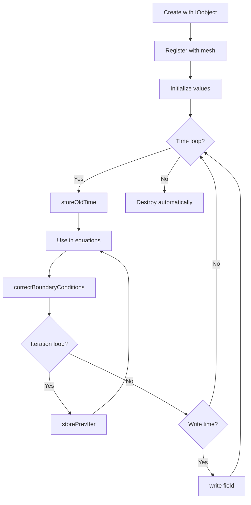
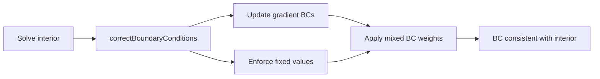

# Field Lifecycle

วงจรชีวิตของ Field — Creation → Usage → Destruction

---

## 🎯 Learning Objectives / วัตถุประสงค์การเรียนรู้

**After completing this section, you will be able to:**
- ✅ **สร้าง field** จาก file หรือ code อย่างถูกต้อง (Create fields from files or code correctly)
- ✅ **จัดการ old time values** สำหรับ time derivatives (Manage old time values for time derivatives)
- ✅ **เขียน field** ให้ถูกต้องตาม OpenFOAM conventions (Write fields correctly following OpenFOAM conventions)
- ✅ **ใช้ objectRegistry** ในการ lookup fields (Use objectRegistry for field lookup)
- ✅ **จำแนกความแตกต่าง** ระหว่าง oldTime และ prevIter (Distinguish between oldTime and prevIter)

---

## 📋 Why Lifecycle Management Matters / ทำไมต้องเข้าใจวงจรชีวิตของ Field?

### 🔴 Consequences of Getting It Wrong / ผลกระทบเมื่อใช้งานผิดพลาด

| Issue | CFD Consequence | Real Impact |
|-------|----------------|-------------|
| **Missing `storeOldTime()`** | Time derivatives use garbage values | **Divergence** or wrong transient results |
| **Incorrect IOobject flags** | Fields not written/read properly | **Lost simulation data** or restart failures |
| **Uninitialized oldTime** | First time step uses zeros/nans | **Immediate solver blow-up** at t=0 |
| **Forgotten `correctBoundaryConditions()`** | BC values inconsistent with interior | **Mass/momentum leakage** across boundaries |
| **Memory leak (no destruction)** | RAM usage grows each time step | **Job killed** by cluster scheduler |

### 💡 The Golden Rules / หลักการสำคัญ

1. **Always initialize oldTime** before first time step
2. **Write fields you need** for post-processing or restart
3. **Correct BCs** after any field modification
4. **Use appropriate read/write flags** for your use case
5. **Let objectRegistry manage lifecycle** when possible

---

## Overview

> **💡 Field Lifecycle = Create → Initialize → Use → (Store Old) → Write → Destroy**
>
> ทุกขั้นตอนมี methods เฉพาะใน GeometricField class



---

## 1. Creation Methods

### 1.1 From File / สร้างจากไฟล์

```cpp
volScalarField p
(
    IOobject
    (
        "p",                    // Field name
        runTime.timeName(),     // Time directory (e.g., "0", "1.5")
        mesh,                   // Registry (objectRegistry)
        IOobject::MUST_READ,    // Must exist on disk
        IOobject::AUTO_WRITE    // Auto-write at output times
    ),
    mesh                        // Reference to mesh
);
```

**What happens:**
1. IOobject specifies name, location, and I/O behavior
2. Field constructor reads from file (e.g., `0/p`)
3. Field registers itself with `mesh.objectRegistry`
4. Boundary conditions read from `boundaryField` entries

### 1.2 With Initial Value / สร้างพร้อมค่าเริ่มต้น

```cpp
volScalarField T
(
    IOobject
    (
        "T",
        runTime.timeName(),
        mesh,
        IOobject::NO_READ,      // Skip file reading
        IOobject::AUTO_WRITE
    ),
    mesh,
    dimensionedScalar("T", dimTemperature, 300)  // Initial value: 300 K
);
```

**Use case:** Creating intermediate fields or calculated fields that don't need file input.

### 1.3 From Expression / สร้างจากนิพจน์

```cpp
// Temporary field (not registered)
volScalarField rhoU2 = rho * magSqr(U);

// Permanent field with registration
volScalarField kineticEnergy
(
    IOobject("ke", runTime.timeName(), mesh, IOobject::NO_WRITE),
    mesh,
    dimensionedScalar("ke", dimVelocitySquared, 0)
);
kineticEnergy = 0.5 * magSqr(U);
```

---

## 2. IOobject Options / ตัวเลือก IOobject

### 2.1 Read Options / ตัวเลือกการอ่าน

| Option | Meaning | Use Case | Missing File Behavior |
|--------|---------|----------|----------------------|
| `MUST_READ` | File **must exist** | Primary simulation fields | **Fatal error** |
| `READ_IF_PRESENT` | Read if exists | Optional restart capability | Uses initial value |
| `NO_READ` | Skip file reading | Calculated/intermediate fields | No error |

### 2.2 Write Options / ตัวเลือกการเขียน

| Option | Meaning | Use Case |
|--------|---------|----------|
| `AUTO_WRITE` | Write at output times | Fields for post-processing/restart |
| `NO_WRITE` | Never write automatically | Temporary/intermediate fields |

**When to use which:**

```cpp
// Primary field - always read/write
volScalarField p(..., IOobject::MUST_READ, IOobject::AUTO_WRITE);

// Optional restart field
volScalarField TurbKineticEnergy(..., IOobject::READ_IF_PRESENT, IOobject::AUTO_WRITE);

// Intermediate calculation - no I/O
volScalarField tmpField(..., IOobject::NO_READ, IOobject::NO_WRITE);
```

---

## 3. Field Registration / การลงทะเบียน Field

### 3.1 Automatic Registration / ลงทะเบียนอัตโนมัติ

```cpp
// Field automatically registered with mesh (objectRegistry)
volScalarField T
(
    IOobject("T", runTime.timeName(), mesh, IOobject::NO_READ),
    mesh,
    dimensionedScalar("T", dimTemperature, 300)
);
// Now accessible via mesh.lookupObject("T")
```

### 3.2 Lookup Operations / การค้นหา Field

```cpp
// Method 1: lookupObject (throws if not found)
const volScalarField& T = mesh.lookupObject<volScalarField>("T");

// Method 2: foundObject (safe check)
if (mesh.foundObject<volScalarField>("T")) {
    const volScalarField& T = mesh.lookupObject<volScalarField>("T");
}

// Method 3: Lookup with type casting
const GeometricField<scalar, fvPatchField, volMesh>& field = 
    mesh.lookupObject<GeometricField<scalar, fvPatchField, volMesh>>("T");
```

### 3.3 Registration Hierarchy / ลำดับชั้นการลงทะเบียน

```
Time (runTime)
  └── objectRegistry
       └── mesh (fvMesh)
            └── objectRegistry
                 ├── volScalarField "T"
                 ├── volVectorField "U"
                 └── surfaceScalarField "phi"
```

---

## 4. Old Time Management / การจัดการค่าเวลาก่อนหน้า

### 4.1 Why Old Time Matters / ทำไมต้องมี Old Time

Time derivatives require values from previous time step:

```
∂T/∂t ≈ (Tⁿ - Tⁿ⁻¹) / Δt
        ↑    ↑
      now  oldTime
```

### 4.2 Accessing Old Time Values / การเข้าถึงค่า Old Time

```cpp
// Previous time step (n-1)
const volScalarField& T0 = T.oldTime();

// Old-old time (n-2) - for second-order schemes
const volScalarField& T00 = T.oldTime().oldTime();

// Check if old time exists
if (T.nOldTimes() >= 2) {
    const volScalarField& T00 = T.oldTime().oldTime();
}
```

### 4.3 Storing Old Time / การบันทึกค่า Old Time

```cpp
// Manual storage (before time loop)
T.storeOldTime();

// Automatic storage (done by Time class at end of step)
// Happens in: runTime++;
```

### 4.4 Critical: First Time Step / ขั้นตอนแรกที่สำคัญ

```cpp
// ❌ WRONG - oldTime not initialized
solve(fvm::ddt(T) == fvm::laplacian(DT, T));

// ✅ CORRECT - initialize before first solve
T.storeOldTime();  // Sets oldTime = current (assumes T⁰ = T⁻¹)
solve(fvm::ddt(T) == fvm::laplacian(DT, T));

// ✅ ALSO CORRECT - read from file with oldTime
// File "0/T" contains current value
// Solver automatically handles first step
```

### 4.5 Old Time Storage Mechanism / กลไกการจัดเก็บ

```cpp
// Internally, GeometricField maintains:
Field<scalar>     // Current values
Field<scalar>*    // Pointer to oldTime (nullptr until stored)
Field<scalar>*    // Pointer to oldOldTime (for higher order)

// Memory management:
// - Old time fields share internal storage
// - Created on-demand with storeOldTime()
// - Destroyed when no longer referenced
```

---

## 5. Previous Iteration / การจัดการค่ารอบก่อนหน้า

### 5.1 Old Time vs Previous Iteration / ความแตกต่างระหว่าง Old Time และ Previous Iteration

| Aspect | oldTime() | prevIter() |
|--------|-----------|------------|
| **Purpose** | Time derivative terms | Under-relaxation in iterations |
| **Update frequency** | Once per time step | Every solver iteration |
| **Scheme** | Transient simulation | Steady-state (SIMPLE/PIMPLE) |
| **Storage** | `storeOldTime()` | `storePrevIter()` |
| **Use in** | `fvm::ddt()` | `.relax()` |

### 5.2 Using Previous Iteration / การใช้งาน Previous Iteration

```cpp
// Store current values before iteration
T.storePrevIter();

// Access previous iteration values
const volScalarField& Tprev = T.prevIter();

// Manual relaxation (equivalent to T.relax(0.7))
scalar alpha = 0.7;
T = alpha*T + (1.0-alpha)*T.prevIter();
```

### 5.3 Automatic Relaxation / การผ่อนคลายอัตโนมัติ

```cpp
// Standard relaxation
T.relax(0.7);  // 70% new, 30% previous

// Uses relaxation factor from fvSolution
T.relax();

// Internally:
// T = alpha*T + (1-alpha)*T.prevIter()
```

### 5.4 Iteration Workflow / ขั้นตอนการทำงานแบบ Iteration

```cpp
// PIMPLE algorithm snippet
while (pimple.loop())
{
    // Store at start of iteration
    T.storePrevIter();
    
    // Solve equations
    solve(fvm::ddt(T) + fvm::div(phi, T) - fvm::laplacian(DT, T));
    
    // Relax under-relaxed fields
    T.relax();
}
```

### 5.3 When to Use Which / ควรใช้อะไรเมื่อไร

```cpp
// Transient simulation - use oldTime
while (runTime.loop()) {
    T.storeOldTime();  // At start of time step
    solve(fvm::ddt(T) == laplacian(DT, T));
}

// Steady-state with iterations - use prevIter
for (int iter=0; iter<nCorr; iter++) {
    T.storePrevIter();  // At start of iteration
    solve(fvm::laplacian(DT, T) == source);
    T.relax();
}
```

---

## 6. Boundary Conditions / เงื่อนไขขอบเขต

### 6.1 Correcting Boundary Conditions / การอัปเดตเงื่อนไขขอบเขต

```cpp
// After solving interior, update boundary values
T.correctBoundaryConditions();

// This calls:
// - fvPatchField::updateCoeffs() for each patch
// - Updates gradient/normal calculation for gradient BCs
// - Enforces fixedValue constraints
```

### 6.2 Accessing Boundary Data / การเข้าถึงข้อมูลขอบเขต

```cpp
// Get reference to specific patch
label patchI = mesh.boundaryMesh().findPatchID("inlet");
const fvPatchScalarField& Tpatch = T.boundaryField()[patchI];

// Read-only access
scalar value = Tpatch[faceI];

// Read-write access
fvPatchScalarField& TpatchRef = T.boundaryFieldRef()[patchI];
TpatchRef[faceI] = 300.0;
```

### 6.3 Modifying Boundaries / การแก้ไขเงื่อนไขขอบเขต

```cpp
// Set fixed value (in code)
T.boundaryFieldRef()[patchI] == fixedValue;

// Apply time-varying condition
T.boundaryFieldRef()[patchI] == 
    300 + 50*sin(omega*runTime.value());

// Zero gradient (Neumann)
T.boundaryFieldRef()[patchI] == zeroGradient;
```

### 6.4 BC Update Workflow / ขั้นตอนการอัปเดต BC



### 6.5 Common BC Mistakes / ข้อผิดพลาดที่พบบ่อย

| Mistake | Consequence | Fix |
|---------|-------------|-----|
| **Forgot `correctBoundaryConditions()`** | BCs inconsistent with solution | Call after every solve |
| **Modifying `boundaryField` directly** | Bypasses BC update logic | Use `boundaryFieldRef()` |
| **Setting wrong patch type** | Runtime error | Match BC type to field dimension |

---

## 7. Writing / การเขียนข้อมูล

### 7.1 Write Methods / วิธีการเขียน

```cpp
// Method 1: Auto-write (triggered by runTime)
runTime.write();  // Writes all fields with AUTO_WRITE flag

// Method 2: Force immediate write
T.write();

// Method 3: Write with options
T.writeObject(IOstreamOption(), true);  // binary=true

// Method 4: Write at specific time
// (requires manual time object manipulation)
```

### 7.2 Write Timing / การจัดการเวลาในการเขียน

```cpp
// Controlled by writeControl in controlDict
// writeControl options:
// - timeStep:       Write every n time steps
// - runTime:        Write every n seconds of simulation
// - adjustableTime: Write at solver-determined times
// - clockTime:      Write every n seconds of real time
// - cpuTime:        Write every n seconds of CPU time
```

### 7.3 Output Format / รูปแบบข้อมูลที่เขียน

```
time_directory/
├── T              # Internal field values
├── T/boundaryField # Boundary field values
├── T/boundaryField/
│   ├── inlet      # Patch fields
│   └── outlet
└── T/nUniform    # Non-uniform data (if present)
```

### 7.4 Write Optimization / การปรับปรุงประสิทธิภาพการเขียน

```cpp
// Reduce I/O for large cases
// In controlDict:
writeCompression on;     // Compress output files
writeFormat binary;      // Binary (smaller, faster)
writePrecision 8;        // Reduce precision (if acceptable)

// Selective writing
volScalarField debugField(..., IOobject::NO_READ, IOobject::NO_WRITE);
// Writes manually with debugField.write() when needed
```

---

## 8. Destruction and Memory Management / การทำลายและจัดการหน่วยความจำ

### 8.1 Automatic Destruction / การทำลายอัตโนมัติ

```cpp
// Fields destroyed when:
// 1. Going out of scope (local variables)
// 2. Registry destroyed (mesh/time destruction)
// 3. Explicit delete (rare - use smart pointers instead)

{
    volScalarField localT(...);  // Created
    // ... use localT ...
}  // Automatically destroyed here

// Registered fields destroyed when mesh destroyed
```

### 8.2 Memory Considerations / การพิจารณาหน่วยความจำ

```cpp
// Large fields consume significant memory
// For 1M cells:
// - volScalarField:  ~8 MB  (double precision)
// - volVectorField:  ~24 MB (3 components)
// - symmTensorField: ~36 MB (6 components)

// Old time fields double memory usage
T.storeOldTime();  // Now ~16 MB for scalars

// Best practice: only store oldTimes when needed
```

### 8.3 Smart Pointer Usage / การใช้ Smart Pointer

```cpp
// For non-registered fields
autoPtr<volScalarField> tmpFieldPtr
(
    new volScalarField(...)
);

// Transfer ownership
volScalarField field = tmpFieldPtr();

// Or use tmp<> template (OpenFOAM style)
tmp<volScalarField> tT
(
    new volScalarField(...)
);
volScalarField& T = tT.ref();  // Use reference
```

---

## 9. Complete Lifecycle Example / ตัวอย่างวงจรชีวิตที่สมบูรณ์

```cpp
// === CREATION ===
volScalarField T
(
    IOobject
    (
        "T",
        runTime.timeName(),
        mesh,
        IOobject::MUST_READ,
        IOobject::AUTO_WRITE
    ),
    mesh
);

// === INITIALIZATION ===
// Already done by reading from file

// === TIME LOOP ===
while (runTime.loop())
{
    // Store old time for time derivatives
    T.storeOldTime();
    
    // ITERATION LOOP
    for (int iter=0; iter<nCorr; iter++)
    {
        // Store previous iteration
        T.storePrevIter();
        
        // === USAGE ===
        // Solve equation
        solve
        (
            fvm::ddt(T)
          + fvm::div(phi, T)
          - fvm::laplacian(DT, T)
          == source
        );
        
        // Update boundary conditions
        T.correctBoundaryConditions();
        
        // Relaxation
        T.relax(alpha);
    }
    
    // === WRITE ===
    // Handled by runTime.write() if output time
    runTime.write();
}

// === DESTRUCTION ===
// Automatic when runTime/mesh goes out of scope
```

---

## Quick Reference / คู่มืออ้างอิงด่วน

| Stage | Method | Code Example |
|-------|--------|--------------|
| **Create from file** | Constructor + IOobject | `volScalarField p(IOobject("p", ...), mesh)` |
| **Create with value** | Constructor + dimensionedScalar | `volScalarField T(..., dimensionedScalar("T", dimTemperature, 300))` |
| **Read flag** | `IOobject::MUST_READ` | Enforces file existence |
| **Initialize oldTime** | `.storeOldTime()` | `T.storeOldTime()` |
| **Access oldTime** | `.oldTime()` | `const volScalarField& T0 = T.oldTime()` |
| **Store iteration** | `.storePrevIter()` | `T.storePrevIter()` |
| **Access iteration** | `.prevIter()` | `const volScalarField& Tprev = T.prevIter()` |
| **Relaxation** | `.relax(alpha)` | `T.relax(0.7)` |
| **Correct BC** | `.correctBoundaryConditions()` | `T.correctBoundaryConditions()` |
| **Force write** | `.write()` | `T.write()` |
| **Auto-write** | `IOobject::AUTO_WRITE` | Write at output times |
| **Lookup field** | `mesh.lookupObject<Type>` | `mesh.lookupObject<volScalarField>("T")` |
| **Check exists** | `mesh.foundObject<Type>` | `if (mesh.foundObject<volScalarField>("T"))` |

---

## 🧠 Concept Check / ทดสอบความเข้าใจ

<details>
<summary><b>1. MUST_READ vs READ_IF_PRESENT? What's the practical difference?</b></summary>

**MUST_READ:**
- **Purpose:** Essential fields that must exist (p, U, T)
- **Behavior:** Fatal error if file missing
- **Use case:** Primary simulation fields

**READ_IF_PRESENT:**
- **Purpose:** Optional fields (e.g., turbulence fields for restart)
- **Behavior:** Uses initial value if missing
- **Use case:** Fields that can be computed if absent

**Example:**
```cpp
// Primary field
volScalarField p(..., IOobject::MUST_READ, ...);

// Optional - can be computed by solver if missing
volScalarField k(..., IOobject::READ_IF_PRESENT, ...);
```
</details>

<details>
<summary><b>2. oldTime() ใช้เมื่อไหร่ vs prevIter()?</b></summary>

**oldTime():**
- **ใช้เมื่อ:** ต้องการ **previous time step** สำหรับ `fvm::ddt(...)`
- **Update:** ครั้งเดียวต่อ time step
- **Transient:** ใช้ใน transient simulation

**prevIter():**
- **ใช้เมื่อ:** ต้องการ **previous iteration** สำหรับ under-relaxation
- **Update:** ทุก iteration ภายใน time step
- **Steady-state:** ใช้ใน SIMPLE/PIMPLE iterations

**ตัวอย่าง:**
```cpp
// Transient - oldTime
while (runTime.loop()) {
    T.storeOldTime();
    solve(fvm::ddt(T) == ...);
}

// Steady - prevIter
while (simple.loop()) {
    T.storePrevIter();
    solve(fvm::laplacian(T) == ...);
    T.relax();
}
```
</details>

<details>
<summary><b>3. correctBoundaryConditions() ทำอะไร? ทำไมต้องเรียก?</b></summary>

**What it does:**
- **Update boundary values** ตาม BC type หลังจาก solve
- Recalculate gradient BCs (zeroGradient, fixedGradient)
- Enforce fixedValue constraints
- Update mixed BC weights

**Why it's necessary:**
1. Solver only updates **internal field values**
2. BC values may become **inconsistent** with interior
3. Next solve uses outdated BC values if not updated

**ตัวอย่าง:**
```cpp
solve(fvm::laplacian(T));
// T.internalField() updated
// T.boundaryField() still has old values

T.correctBoundaryConditions();
// Now BCs consistent with new solution
```

**When to call:**
- ✅ After every `solve()`
- ✅ After manually modifying field
- ❌ Before solve (solver doesn't read BCs)
</details>

<details>
<summary><b>4. ทำไม field ถูกสร้างแล้วไม่ต้อง delete?</b></summary>

**Automatic memory management:**

1. **Registered fields:** Stored in `objectRegistry`
   - Destroyed when registry (mesh/time) destroyed
   - Reference counting prevents premature deletion

2. **Local fields:** Stack-based
   - Destroyed when going out of scope
   - RAII (Resource Acquisition Is Initialization)

3. **Smart pointers:** `autoPtr`, `tmp<>`
   - Automatic ownership management
   - No manual `delete` needed

**Example:**
```cpp
void createTemporaryField() {
    volScalarField tmp(...);  // Created
    // ... use tmp ...
}  // Automatically destroyed here

void createRegisteredField() {
    // Registered with mesh
    volScalarField T(..., mesh, ...);
    // Destroyed when mesh destroyed (end of run)
}
```
</details>

<details>
<summary><b>5. ถ้าลืม storeOldTime() จะเกิดอะไรขึ้น?</b></summary>

**Consequences:**

1. **First time step:** Uses uninitialized oldTime
   - `ddt(T) = (T - oldTime) / dt`
   - `oldTime` = garbage → garbage result
   - Often leads to **immediate divergence**

2. **Later time steps:** Uses wrong oldTime
   - Previous time step not stored
   - Time derivative uses incorrect values
   - Solution drifts from reality

**Example of disaster:**
```cpp
// ❌ WRONG
while (runTime.loop()) {
    solve(fvm::ddt(T) == source);  // oldTime not set!
    // ddt uses garbage at first step
}

// ✅ CORRECT
while (runTime.loop()) {
    T.storeOldTime();  // Sets oldTime = current
    solve(fvm::ddt(T) == source);  // Uses correct oldTime
}
```

**Note:** Many solvers call `storeOldTime()` automatically, but check your solver's code!
</details>

---

## 🔑 Key Takeaways / สรุปสิ่งสำคัญ

### 📌 Core Concepts / หัวใจของเนื้อหา

1. **Field Lifecycle = Create → Register → Initialize → Use → Write → Destroy**
   - OpenFOAM manages most lifecycle steps automatically
   - Understand when manual intervention is needed

2. **IOobject Controls I/O Behavior**
   - `MUST_READ` / `READ_IF_PRESENT` / `NO_READ`
   - `AUTO_WRITE` / `NO_WRITE`
   - Choose based on field purpose

3. **Old Time vs Previous Iteration**
   - `oldTime()`: Previous **time step** (transient)
   - `prevIter()`: Previous **iteration** (relaxation)
   - Don't confuse them!

4. **Boundary Conditions Need Updates**
   - Solver only updates internal field
   - Call `correctBoundaryConditions()` after solve
   - Essential for consistent solution

5. **ObjectRegistry Provides Lookup**
   - All registered fields accessible via `mesh.lookupObject`
   - Enables inter-field communication
   - Essential for custom boundary conditions

### ⚠️ Common Pitfalls / ข้อผิดพลาดที่พบบาย

1. **Missing `storeOldTime()`** → Divergence at first time step
2. **Wrong IOobject flags** → Lost data or restart failures
3. **Forgot `correctBoundaryConditions()`** → BC inconsistency
4. **Confusing oldTime/prevIter** → Wrong derivative/relaxation
5. **Not understanding scope** → Premature field destruction

### ✅ Best Practices / แนวทางปฏิบัติที่ดี

```cpp
// ✅ Standard field creation pattern
volScalarField T
(
    IOobject("T", runTime.timeName(), mesh, 
             IOobject::MUST_READ, IOobject::AUTO_WRITE),
    mesh
);

// ✅ Time loop pattern
while (runTime.loop()) {
    T.storeOldTime();  // Critical!
    for (int iter=0; iter<nCorr; iter++) {
        T.storePrevIter();
        solve(fvm::ddt(T) == ...);
        T.correctBoundaryConditions();  // Critical!
        T.relax();
    }
    runTime.write();  // Or auto-write
}

// ✅ Field lookup pattern
if (mesh.foundObject<volScalarField>("T")) {
    const volScalarField& T = mesh.lookupObject<volScalarField>("T");
}
```

---

## 📖 Related Documents / เอกสารที่เกี่ยวข้อง

### Within This Module
- **Overview:** [00_Overview.md](00_Overview.md) - Field system architecture
- **Common Pitfalls:** [06_Common_Pitfalls.md](06_Common_Pitfalls.md) - Mistakes to avoid
- **Exercises:** [07_Exercises.md](07_Exercises.md) - Practice problems

### Cross-Module References
- **Boundary Conditions:** See [Boundary Conditions](../../MODULE_02_MESHING_AND_CASE_SETUP/CONTENT/04_BOUNDARY_CONDITIONS/) for BC setup
- **Time Integration:** See [Temporal Discretization](../../../MODULE_01_CFD_FUNDAMENTALS/CONTENT/03_TEMPORAL_DISCRETIZATION/) for ddt schemes
- **Registry System:** See [01_Foundation_Primitives](../01_FOUNDATION_PRIMITIVES/) for objectRegistry details

### OpenFOAM Documentation
- **Source Code:** `src/OpenFOAM/fields/GeometricFields/GeometricField.C`
- **IOobject Guide:** [OpenFOAM Programmer's Guide - IOobject](https://www.openfoam.com/documentation/programmers-guide/)
- **Field Operations:** [OpenFOAM User Guide - Field and Matrix Manipulation](https://www.openfoam.com/documentation/user-guide/)