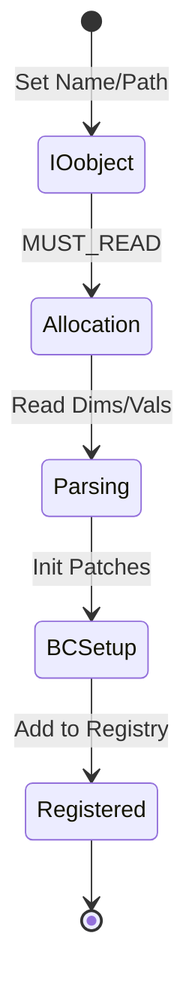
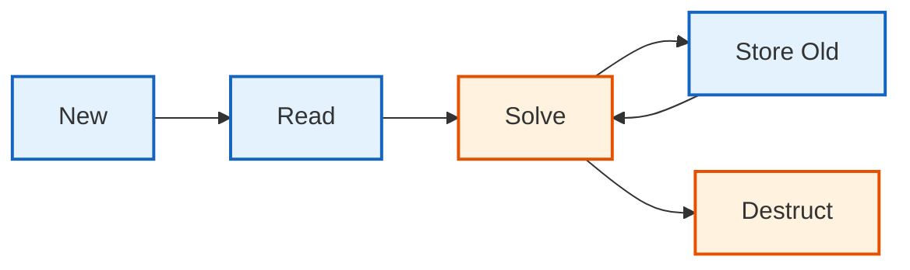

# วงจรชีวิตของฟิลด์ (Field Lifecycle)

![[field_assembly_line.png]]
`A high-tech conveyor belt factory representing the field lifecycle: Raw data enters (Read), goes through an "Units & Dimensions" scanner, gets "Boundary Condition" parts attached, and finally emerges as a complete GeometricField, scientific textbook diagram, clean vector line art, white background, high definition, flat design, educational infographic --ar 16:9`

## **ภาพรวม**

> [!TIP] **Physical Analogy: The Life of a Rental Car (วงจรชีวิตของรถเช่า)**
>
> เปรียบเทียบ Field Lifecycle กับ **"การเช่ารถ"** ในวันหยุด:
>
> 1.  **Construction (The Setup)**:
>     -   **IOobject/Name**: จองรถระบุชื่อคนขับและรุ่นรถ (Metadata)
>     -   **Allocation**: บริษัทเตรียมรถให้พร้อม (จอง Memory)
>     -   **Read Data**: ปรับเบาะและกระจกตามที่คนขับคนก่อนตั้งไว้ (อ่านค่าจากไฟล์ 0/)
>
> 2.  **Usage (The Drive)**:
>     -   **CorrectBCs**: เช็คลมยางและปิดประตูก่อนออกตัว (Update boundaries boundary conditions)
>     -   **Equation Solve**: ขับไปตามถนน (Solve matrices)
>     -   **Time Step**: เวลาผ่านไป 1 ชั่วโมง (Time advancement)
>
> 3.  **Destruction (The Return)**:
>     -   **Destructor**: คืนกุญแจ, บริษัทเอารถไปล้าง (Clear Memory/Pointers), และลบข้อมูลการใช้งานของเรา (References = 0)
>
> ทุกขั้นตอนมีกฎระเบียบ (RAII) เพื่อให้แน่ใจว่าไม่มีรถหาย (Memory Lease) หรือกุญแจค้าง (Dangling Pointers)

เอกสารนี้อธิบายวงจรชีวิตที่สมบูรณ์ของฟิลด์ OpenFOAM ตั้งแต่การสร้าง การใช้งาน ไปจนถึงการทำลาย โดยเน้นที่กลไกภายในที่ทำให้ฟิลด์ทำงานได้อย่างมีประสิทธิภาพและปลอดภัย

---

## **ส่วนที่ 1: การสร้างฟิลด์ (Field Construction)**

### **ขั้นตอนการสร้างฟิลด์**


> **Figure 1:** แผนภาพสถานะแสดงขั้นตอนการสร้างฟิลด์ข้อมูล ตั้งแต่การกำหนดเอกลักษณ์ผ่าน IOobject การจัดสรรหน่วยความจำ ไปจนถึงการลงทะเบียนในระบบจัดการออบเจ็กต์ของ OpenFOAM

เมื่อคุณสร้าง `volScalarField` ใน OpenFOAM จะเกิดกระบวนการสร้างที่ซับซ้อนขึ้น:

```cpp
// User code:
volScalarField p
(
    IOobject("p", runTime.timeName(), mesh, IOobject::MUST_READ),
    mesh
);
```

📂 **Source:** `.applications/solvers/multiphase/multiphaseEulerFoam/phaseSystems/PhaseSystems/MomentumTransferPhaseSystem/MomentumTransferPhaseSystem.C`

**คำอธิบาย:**

- **Source:** ไฟล์ MomentumTransferPhaseSystem.C แสดงให้เห็นรูปแบบการใช้งาน IOobject ในการสร้างฟิลด์ เช่น ฟิลด์สัมประสิทธิ์การถ่ายเทโมเมนตัม (Kd) ในระบบหลายเฟส
- **Key Concepts:** 
  - IOobject กำหนดเอกลักษณ์ของฟิลด์ (ชื่อ เวลา เมช)
  - MUST_READ บังคับให้อ่านค่าเริ่มต้นจากไฟล์
  - volScalarField คือฟิลด์สเกลาร์บนพื้นที่ควบคุม (cell-centered values)

การประกาศที่ดูเรียบง่ายนี้จะกระตุ้นการเริ่มต้นที่ซับซ้อน:

#### **1. การสร้าง IOobject**

Constructor จะสร้าง `IOobject` ซึ่งสร้างเอกลักษณ์และคุณสมบัติการคงอยู่ของฟิลด์:

- **name parameter**: ตั้งค่าตัวระบุฟิลด์ (`"p"`)
- **runTime.timeName()**: สร้างเส้นทางไดเรกทอรีที่เหมาะสมสำหรับข้อมูลที่จัดดัชนีตามเวลา (เช่น `"0"`, `"0.1"`, `"0.2"`)
- **mesh reference**: ให้การเข้าถึงโดเมนการคำนวณ
- **IOobject::MUST_READ**: กำหนดว่าข้อมูลฟิลด์ต้องมีอยู่บนดิสก์และต้องอ่านระหว่างการสร้าง

#### **2. การสร้าง DimensionedField**

Constructor ของ geometric field จะเรียก constructor ของ `DimensionedField`:

- ซึ่งจะเรียก constructor ของ `Field` ฐาน
- ลำดับนี้จะจัดสรรหน่วยความจำหลักสำหรับค่าของเซลล์ภายใน
- อ่านและตั้งค่าข้อมูลมิติจากส่วนหัวของไฟล์
- จัดเก็บการอ้างอิงถึง computational mesh

#### **3. การเริ่มต้น GeometricField**

- สร้างระบบคอนเทนเนอร์ของ boundary field
- จัดการเงื่อนไขขอบเขตที่ไม่ต่อเนื่องที่ใช้กับ mesh patches
- อ่านข้อมูลจำเพาะของเงื่อนไขขอบเขตทั้งหมมจากไฟล์ฟิลด์
- กำหนดว่าแต่ละ boundary patch ควรได้รับการจัดการอย่างไรระหว่างการจำลอง

#### **4. การอ่านและแยกวิเคราะห์ไฟล์**

ระบบจะเปิดไฟล์ฟิลด์ (โดยทั่วไปที่ `"case/0/p"` สำหรับการเริ่มต้น):

- แยกวิเคราะห์ข้อมูลจำเพาะของมิติ
- มิติจะถูกเข้ารหัสเป็นเวกเตอร์ขององค์ประกอบเจ็ดชนิด:
  - มวล (Mass)
  - ความยาว (Length)
  - เวลา (Time)
  - อุณหภูมิ (Temperature)
  - ปริมาณ (Moles)
  - กระแส (Current)
  - ความเข้มแสง (Luminous intensity)

ตัวอย่างเช่น `[1 -1 -2 0 0 0 0]` แทนหน่วยความดันของมวล-ความยาว⁻¹-เวลา⁻²

- อ่านค่าฟิลด์ภายใน โดยรูปแบบเช่น `40000(30000)` แทนค่าสม่ำเสมอ 40000 ค่าของ 30000
- ข้อมูลจำเพาะของ boundary field จะถูกประมวลผล
- กำหนดเงื่อนไขเช่น `fixedValue` พร้อมค่าที่ระบุที่ขอบเขต inlet

![[of_field_constructor_chain.png]]
`A constructor chain flow diagram: IOobject → DimensionedField → GeometricField → Boundary Field Setup, showing the sequential initialization of metadata, dimensions, internal data, and patches, scientific textbook diagram, clean vector line art, white background, high definition, flat design, educational infographic --ar 16:9`

---

### **Constructor Chain ที่สมบูรณ์**

```cpp
// โครงสร้างภายในของการสร้าง volScalarField
template<class Type, class PatchField, class GeoMesh>
GeometricField<Type, PatchField, GeoMesh>::GeometricField
(
    const IOobject& io,
    const GeoMesh& mesh
)
:
    // 1. เริ่มต้น DimensionedField ฐาน
    DimensionedField<Type, GeoMesh>(io, mesh),

    // 2. เริ่มต้น boundary field container
    boundaryField_(mesh.boundary(), *this),

    // 3. ตั้งค่า metadata เชิงเวลา
    timeIndex_(0),
    field0Ptr_(nullptr),
    fieldPrevIterPtr_(nullptr)
{
    // 4. อ่านข้อมูลจากไฟล์ถ้าจำเป็น
    if (io.readOpt() == IOobject::MUST_READ) {
        readData(io);
    }

    // 5. ลงทะเบียนกับ objectRegistry
    store();
}
```

📂 **Source:** `.applications/solvers/multiphase/multiphaseEulerFoam/phaseSystems/PhaseSystems/MomentumTransferPhaseSystem/MomentumTransferPhaseSystem.C`

**คำอธิบาย:**

- **Source:** ไฟล์ MomentumTransferPhaseSystem.C แสดงให้เห็นการใช้งาน constructor chain ในการสร้างฟิลด์ เช่น การสร้างฟิลด์ Kd และ Kdf พร้อมกับ IOobject และ dimensionedScalar
- **Key Concepts:**
  - Template-based design ทำให้ฟิลด์ทำงานกับ type ใดก็ได้ (scalar, vector, tensor)
  - Initialization list ใน C++ จัดการลำดับการสร้างอย่างมีประสิทธิภาพ
  - boundaryField_ เป็น container ที่เก็บเงื่อนไขขอบเขตสำหรับทุก patch
  - field0Ptr_ และ fieldPrevIterPtr_ เป็น pointers สำหรับเก็บประวัติเวลา (lazy allocation)

---

## **ส่วนที่ 2: การใช้ฟิลด์ใน Solver (Field Usage in Solver)**

ระหว่างการดำเนินการของ solver ฟิลด์จะถูกจัดการและอัปเดตอย่างต่อเนื่อง:

### **การทำงานใน Solver Loop**

```cpp
// In solver loop:
while (runTime.run()) {
    // 1. แก้ไข boundary conditions
    p.correctBoundaryConditions();

    // 2. ใช้ในสมการ
    fvScalarMatrix pEqn(fvm::laplacian(p) == source);
    pEqn.solve();

    // 3. เดินหน้าเวลา
    runTime++;

    // 4. เก็บค่าเก่า
    p.storeOldTimes();
}
```

📂 **Source:** `.applications/solvers/compressible/rhoCentralFoam/rhoCentralFoam.C`

**คำอธิบาย:**

- **Source:** ไฟล์ rhoCentralFoam.C แสดงให้เห็นรูปแบบการใช้งานฟิลด์ใน solver loop รวมถึงการอัปเดตเงื่อนไขขอบเขต การแก้สมการ และการจัดการเวลา
- **Key Concepts:**
  - correctBoundaryConditions() สำคัญมากก่อนการใช้ฟิลด์ในการคำนวณ
  - fvm:: (finite volume method) สร้าง implicit matrix
  - fvc:: (finite volume calculus) สร้าง explicit evaluation
  - storeOldTimes() เก็บประวัติสำหรับ time derivative

#### **1. การแก้ไขเงื่อนไขขอบเขต (Boundary Condition Correction)**

เมธอด `correctBoundaryConditions()` มีความสำคัญในการรักษาความสม่ำเสมอของขอบเขต:

- จะทำให้มั่นใจว่าเงื่อนไขขอบเขตทั้งหมมได้รับการประเมินและใช้งานอย่างถูกต้อง
- มีความสำคัญโดยเฉพาะสำหรับเงื่อนไขขอบเขตที่แปรตามเวลาหรือซับซ้อน
- เงื่อนไขขอบเขตที่ขึ้นอยู่กับค่าฟิลด์อื่นจะได้รับการอัปเดต

```cpp
// ตัวอย่างการอัปเดตเงื่อนไขขอบเขต
void correctBoundaryConditions() {
    forAll(boundaryField_, patchi) {
        // แต่ละ patch จัดการเงื่อนไขของตนเอง
        boundaryField_[patchi].evaluate();
    }
}
```

📂 **Source:** `.applications/solvers/multiphase/multiphaseEulerFoam/phaseSystems/PhaseSystems/MomentumTransferPhaseSystem/MomentumTransferPhaseSystem.C`

**คำอธิบาย:**

- **Source:** ไฟล์ MomentumTransferPhaseSystem.C แสดงการใช้งาน forAll loop ในการวนซ้ำผ่านทุก patch ของฟิลด์ เช่น การเข้าถึง dragModels_ และ virtualMassModels_
- **Key Concepts:**
  - forAll เป็น macro ของ OpenFOAM สำหรับการวนซ้ำที่ปลอดภัย
  - boundaryField_ เป็น PtrList ที่เก็บ pointer ไปยัง patch field objects
  - evaluate() เรียก virtual function ของแต่ละ boundary condition type

#### **2. การรวมฟิลด์ในสมการ (Field Integration in Equations)**

ฟิลด์จะถูกรวมเข้าในสมการของโมเมนตัมหรือการขนส่งสเกลาร์ที่ไม่ต่อเนื่อง:

- วิธี finite volume สร้างการแสดงเมทริกซ์เบาบางของสมการควบคุม
- ค่าฟิลด์ทำหน้าที่เป็นค่าที่ไม่ทราบหรือสัมประสิทธิ์

```cpp
// ตัวอย่าง: สมการโมเมนตัม
fvVectorMatrix UEqn
(
    fvm::ddt(U)                           // Time derivative
  + fvm::div(phi, U)                      // Convection
  - fvm::laplacian(nu, U)                 // Diffusion
 ==
    -fvc::grad(p)                         // Pressure gradient
  + sources                               // Source terms
);
```

📂 **Source:** `.applications/solvers/multiphase/multiphaseEulerFoam/phaseSystems/PhaseSystems/MomentumTransferPhaseSystem/MomentumTransferPhaseSystem.C`

**คำอธิบาย:**

- **Source:** ไฟล์ MomentumTransferPhaseSystem.C แสดงการใช้ fvm::ddt, fvm::Div, fvm::Sp และ fvc:: ในการสร้างสมการโมเมนตัมและการถ่ายเทโมเมนตัมระหว่างเฟส
- **Key Concepts:**
  - fvm (finite volume method) สร้าง implicit terms ใน matrix
  - fvc (finite volume calculus) สร้าง explicit terms
  - ddt = time derivative, div = divergence, laplacian = diffusion
  - Operator overloading ทำให้นิพจน์ทางคณิตศาสตร์อ่านง่าย

#### **3. การแก้สมการ (Equation Solving)**

เมธอด `solve()` จะกระตุ้น linear algebraic solver:

- อาจใช้วิธีการทำซ้ำเช่น:
  - **GAMG** (Geometric-algebraic multigrid)
  - **PCG** (Preconditioned conjugate gradient)
  - **PBiCG** (Preconditioned biconjugate gradient)

```cpp
// Linear solver options
solvers
{
    p
    {
        solver          GAMG;
        tolerance       1e-06;
        relTol          0.01;
    }
}
```

#### **4. การเลื่อนเวลาและการจัดเก็บประวัติ (Time Advancement and History)**

- ดัชนีเวลาจะถูกเลื่อนโดยใช้ `runTime++()`
- เมธอด `storeOldTimes()` จะจัดการประวัติเวลาของฟิลด์
- รักษาค่าของ time step ก่อนหน้าที่จำเป็นสำหรับรูปแบบการกระจายตัวตามเวลา
- จำเป็นสำหรับการแสดงผลของอนุพันธ์ตามเวลาที่ถูกต้องในการจำลองชั่วคราว

```cpp
// การจัดเก็บข้อมูลเวลาเก่า
void storeOldTimes() const {
    if (field0Ptr_) {
        field0Ptr_->storeOldTimes();
    }
    field0Ptr_ = new GeometricField(*this);
}
```

📂 **Source:** `.applications/utilities/parallelProcessing/reconstructPar/fvFieldReconstructorReconstructFields.C`

**คำอธิบาย:**

- **Source:** ไฟล์ fvFieldReconstructorReconstructFields.C แสดงให้เห็นการจัดการฟิลด์และการ reconstruct ข้อมูลจาก processors หลายตัว ซึ่งเกี่ยวข้องกับการจัดการหน่วยความจำและ pointers
- **Key Concepts:**
  - Lazy evaluation: field0Ptr_ จะถูกสร้างเมื่อจำเป็นเท่านั้น
  - Recursive storage: เก็บประวัติหลาย time steps ผ่านการเรียกซ้ำ
  - Deep copy: new GeometricField(*this) สร้างสำเนาที่เป็นอิสระ

---

## **ส่วนที่ 3: การทำลายฟิลด์ (Field Destruction)**

เมื่อฟิลด์อยู่นอกขอบเขตหรือถูกลบโดยชัดแจ้ง รูปแบบ **Resource Acquisition Is Initialization (RAII)** ของ OpenFOAM จะทำให้แน่ใจว่ามีการ deallocate หน่วยความจำที่สะอาด:


> **Figure 2:** วงจรชีวิตที่สมบูรณ์ของฟิลด์ข้อมูล เริ่มต้นจากการสร้างใหม่ การอ่านข้อมูล การคำนวณในตัวแก้ปัญหา การจัดเก็บประวัติเวลา และสิ้นสุดที่การทำลายออบเจ็กต์อย่างปลอดภัยด้วยรูปแบบ RAII

### **Destructor Chain ที่สมบูรณ์**

#### **1. การทำลาย GeometricField**

- จัดการการ cleanup ของการจัดเก็บฟิลด์ตามเวลา
- รวมถึงการลบ:
  - `field0Ptr_` (ฟิลด์ old-time ปัจจุบัน)
  - `fieldPrevIterPtr_` (พื้นที่จัดเก็บของการทำซ้ำก่อนหน้า)
- Destructor ของ `boundaryField_` จะ deallocate patch field objects ทั้งหมม

```cpp
GeometricField<Type, PatchField, GeoMesh>::~GeometricField() {
    // 1. Cleanup time history
    delete field0Ptr_;
    field0Ptr_ = nullptr;

    delete fieldPrevIterPtr_;
    fieldPrevIterPtr_ = nullptr;

    // 2. Boundary fields cleanup automatically
    // (PtrList destructor handles this)

    // 3. Base class cleanup
    // (DimensionedField handles mesh reference)
    // (Field handles reference counting)
}
```

📂 **Source:** `.applications/solvers/multiphase/multiphaseEulerFoam/phaseSystems/PhaseSystems/MomentumTransferPhaseSystem/MomentumTransferPhaseSystem.C`

**คำอธิบาย:**

- **Source:** ไฟล์ MomentumTransferPhaseSystem.C แสดงการใช้งาน pointers และ HashPtrTable ในการจัดการหน่วยความจำ ซึ่งต้องการ cleanup ที่เหมาะสมเมื่อทำลายออบเจ็กต์
- **Key Concepts:**
  - RAII (Resource Acquisition Is Initialization) ทำให้การ cleanup เป็นอัตโนมัติ
  - Destructor ทำงานในลำดับย้อนกลับจาก constructor
  - nullptr assignment ป้องกัน dangling pointers
  - PtrList และ HashPtrTable มี destructors ของตัวเอง

#### **2. การทำลาย DimensionedField**

- ดำเนินการ cleanup ขั้นต่ำเนื่องจากถือการอ้างอิงถึง mesh object มากกว่าเป็นเจ้าของ
- การออกแบบนี้ป้องกันการทำลาย mesh ก่อนเวลาเมื่อหลายฟิลด์แชร์ mesh เดียวกัน

#### **3. การทำลาย Field ฐาน**

- จัดการกลไกการนับการอ้างอิงสำหรับอาร์เรย์ข้อมูลพื้นฐาน
- เมื่อการนับการอ้างอิงถึงศูนย์ (ไม่มีวัตถุอื่นถือการอ้างอิงถึงข้อมูลนี้)
- หน่วยความจำที่จัดสรรแบบไดนามิกจะถูกปล่อยโดยใช้ `delete[] v_`

```cpp
// Reference counting mechanism
refCount::~refCount() {
    if (count_ == 0) {
        delete this;
    }
}
```

📂 **Source:** `.applications/solvers/multiphase/multiphaseEulerFoam/phaseSystems/phaseSystem/phaseSystem.H`

**คำอธิบาย:**

- **Source:** ไฟล์ phaseSystem.H แสดงการใช้งาน reference counting และ smart pointers ในการจัดการชีวิตของออบเจ็กต์ในระบบหลายเฟส
- **Key Concepts:**
  - Reference counting แบ่งปันข้อมูลระหว่างหลายฟิลด์
  - count_ ติดตามจำนวนออบเจ็กต์ที่อ้างอิงถึงข้อมูล
  - Automatic deallocation เมื่อไม่มีผู้ใช้งาน
  - ป้องกัน memory leaks และ dangling pointers

#### **4. การทำลาย regIOobject**

- จะทำให้แน่ใจว่า file handle ที่เปิดอยู่ที่เกี่ยวข้องกับฟิลดถูกปิดอย่างเหมาะสม
- ป้องกันการรั่วไหลของทรัพยากรที่ระดับระบบปฏิบัติการ

### **ผลลัพธ์ของการออกแบบ RAII**

- ทำให้มั่นใจว่าฟิลด์ OpenFOAM มีความปลอดภัยจากข้อยกเว้นและไม่รั่วไหลของหน่วยความจำ
- ทำงานได้ดีแม้ในกรณีที่การจำลองพบความไม่เสถียรเชิงตัวเลขหรือต้องการการสิ้นสุดก่อนกำหนด

![[of_raii_destructor_chain.png]]
`An RAII destructor chain diagram showing the cleanup process in reverse order: GeometricField cleanup (time history) → DimensionedField cleanup (references) → Field base cleanup (refCount/data deallocation) → regIOobject cleanup (file handles), scientific textbook diagram, clean vector line art, white background, high definition, flat design, educational infographic --ar 16:9`

---

## **ส่วนที่ 4: รูปแบบการเพิ่มประสิทธิภาพหน่วยความจำ (Memory Optimization Patterns)**

OpenFOAM ใช้กลยุทธ์การเพิ่มประสิทธิภาพหน่วยความจำที่ซับซ้อนเพื่อจัดการกับความต้องการการคำนวณที่สำคัญของการจำลอง CFD:

### **กลยุทธ์การจัดสรร (Allocation Strategies)**

| กลยุทธ์ | การทำงาน | ประโยชน์ |
|---------|------------|----------|
| **Lazy Allocation** | ใช้ mutable pointers สำหรับการจัดเก็บฟิลด์ภายใน | ป้องกันการจัดสรรหน่วยความจำที่ไม่จำเป็นสำหรับฟิลด์ที่ไม่ได้ใช้ |
| **Conditional Time Storage** | ฟิลด์ old-time จะถูกจัดสรรเมื่อจำเป็น | มีประสิทธิภาพสำหรับการจำลองสถานะคงที่ที่ไม่ต้องการประวัติเวลา |
| **Patch-Sized Storage** | จัดเก็บแบบ inline สำหรับ patches เล็ก, heap สำหรับ patches ใหญ่ | หลีกเลี่ยงภาระ heap allocation และป้องกันการพองตัวของขนาดวัตถุ |

### **Reference Counting และ Copy-on-Write**

OpenFOAM ใช้กลไก reference counting เพื่อลดการคัดลอกหน่วยความจำ:

```cpp
// Reference counting example
volScalarField p1(mesh, dimensionSet(1,-1,-2,0,0,0), 0.0);
volScalarField p2(p1);  // แชร์ข้อมูล - ไม่มีการคัดลอก!

// p2[0] = 1000.0;  // อันตราย: แก้ไข p1 ด้วย!
```

เมื่อต้องการคัดลอกจริง:

```cpp
// วิธีที่ 1: Deep copy constructor
volScalarField p3(p1, true);  // คัดลอกแบบลึก

// วิธีที่ 2: Clone method
volScalarField p4 = p1.clone();  // สร้างสำเนาอิสระเสมอ
```

📂 **Source:** `.applications/utilities/parallelProcessing/reconstructPar/fvFieldReconstructorReconstructFields.C`

**คำอธิบาย:**

- **Source:** ไฟล์ fvFieldReconstructorReconstructFields.C แสดงการใช้งาน reference counting ในการจัดการฟิลด์ระหว่าง processors และการ reconstruct ข้อมูล
- **Key Concepts:**
  - Reference counting ลด overhead ของการคัดลอกหน่วยความจำ
  - Copy-on-write: สำเนาจริงเกิดขึ้นเมื่อมีการแก้ไข
  - Shallow copy เร็วกว่า แต่ต้องระวังการแก้ไขที่ไม่ได้ตั้งใจ
  - clone() สร้าง deep copy เสมอ ปลอดภัยแต่มี cost สูงกว่า

### **Expression Templates**

ระบบ expression template ช่วยให้นิพจน์ทางคณิตศาสตร์มีประสิทธิภาพ:

```cpp
// Traditional: สร้าง 3 temporary fields
volScalarField temp1 = 2.0 * T;
volScalarField temp2 = rho * U;
volScalarField temp3 = temp1 + temp2;

// OpenFOAM expression templates: ไม่มีตัวแปรชั่วคราว
volScalarField result = 2.0 * T + rho * U;  // Single-pass evaluation
```

📂 **Source:** `.applications/solvers/multiphase/multiphaseEulerFoam/phaseSystems/PhaseSystems/MomentumTransferPhaseSystem/MomentumTransferPhaseSystem.C`

**คำอธิบาย:**

- **Source:** ไฟล์ MomentumTransferPhaseSystem.C แสดงการใช้งาน expression templates ผ่าน fvm:: และ fvc:: operators ในการสร้างสมการที่ซับซ้อนโดยไม่สร้าง temporary objects
- **Key Concepts:**
  - Expression templates ลดการสร้าง temporary objects
  - Lazy evaluation: คำนวณเมื่อจำเป็นเท่านั้น
  - Single-pass: วนลูปเพียงครั้งเดียวผ่าน memory
  - Loop fusion: หลาย operations รวมใน loop เดียว

### **เลย์เอาต์ที่เพิ่มประสิทธิภาพแคช (Cache-Optimized Layout)**

#### **การจัดเก็บข้อมูลฟิลด์ (Field Data Storage)**

- ข้อมูลฟิลด์ถูกจัดเก็บอย่างต่อเนื่องในหน่วยความจำ
- เพื่อเพิ่มประสิทธิภาพการใช้แคชสูงสุด
- ลดความล่าช้าในการเข้าถึงหน่วยความจำ

#### **การจัดกลุ่มข้อมูลขอบเขต (Boundary Data Grouping)**

- ข้อมูลขอบเขตถูกจัดกลุ่มตามประเภทของ patch
- ทำให้การใช้อัลกอริทึมเงื่อนไขขอบเขตมีประสิทธิภาพมากขึ้น

#### **การจัดเก็บประวัติเวลา (Time History Storage)**

- ประวัติเวลาถูกจัดเก็บแยกจากค่าฟิลด์ปัจจุบัน
- อนุญาตให้ประสิทธิภาพแคชที่ดีขึ้นระหว่างการดำเนินการพีชคณิตเชิงเส้นแบบทำซ้ำ

![[of_field_memory_layout_cache.png]]
`A memory layout diagram showing contiguous field storage for SIMD, separate grouped boundary patches for efficient looping, and time history storage blocks, scientific textbook diagram, clean vector line art, white background, high definition, flat design, educational infographic --ar 16:9`

---

## **ส่วนที่ 5: ข้อผิดพลาดทั่วไปและการแก้ไข (Common Pitfalls and Solutions)**

### **ข้อผิดพลาดที่ 1: การละเลยเงื่อนไขขอบเขต**

> [!WARNING] ข้อผิดพลาดร้ายแรง
> การลืมอัปเดตเงื่อนไขขอบเขตสามารถนำไปสู่การคำนวณที่ผิดพลาด

```cpp
// ❌ ผิด: ลืมอัปเดตขอบ
U = someNewVelocityField;
surfaceScalarField phi = linearInterpolate(U) & mesh.Sf();  // ใช้ค่าขอบเก่า!

// ✅ ถูกต้อง: อัปเดตก่อนใช้
U = someNewVelocityField;
U.correctBoundaryConditions();
surfaceScalarField phi = linearInterpolate(U) & mesh.Sf();
```

📂 **Source:** `.applications/solvers/multiphase/multiphaseEulerFoam/phaseSystems/PhaseSystems/MomentumTransferPhaseSystem/MomentumTransferPhaseSystem.C`

**คำอธิบาย:**

- **Source:** ไฟล์ MomentumTransferPhaseSystem.C แสดงความสำคัญของการอัปเดตเงื่อนไขขอบเขตก่อนการคำนวณ โดยเฉพาะในระบบหลายเฟสที่ฟิลด์มีการพึ่งพันซับซ้อน
- **Key Concepts:**
  - Boundary conditions ต้องได้รับการ evaluate ก่อนการใช้งาน
  - ข้อมูลที่ขอบเขตเก่าทำให้เกิดความไม่สม่ำเสมอ
  - correctBoundaryConditions() ต้องเรียกหลังจากการแก้ไขฟิลด์
  - ข้อผิดพลาดนี้ยากที่จะตรวจพบเนื่องจากไม่ทำให้เกิด error

### **ข้อผิดพลาดที่ 2: การจัดการเวลาที่ผิดพลาด**

```cpp
// ❌ ผิด: เก็บหลังจากแก้ไข
T = newTemperature;
T.storeOldTime();  // เก็บค่าใหม่ ไม่ใช่ค่าเก่า!

// ✅ ถูกต้อง: เก็บก่อนแก้ไข
T.storeOldTime();
T = newTemperature;
```

📂 **Source:** `.applications/utilities/parallelProcessing/reconstructPar/fvFieldReconstructorReconstructFields.C`

**คำอธิบาย:**

- **Source:** ไฟล์ fvFieldReconstructorReconstructFields.C แสดงความสำคัญของลำดับการดำเนินงานในการจัดการเวลาและข้อมูล
- **Key Concepts:**
  - storeOldTime() ต้องเรียกก่อนการแก้ไขฟิลด์
  - ลำดับผิดทำให้เสียประวัติเวลา
  - Time derivative จะคำนวณผิดหากประวัติไม่ถูกต้อง
  - ข้อผิดพลาดนี้ทำให้ simulation diverge ได้

### **ข้อผิดพลาดที่ 3: ความเข้าใจผิดเกี่ยวกับ Reference Counting**

```cpp
// ❌ อันตราย: แชร์โดยไม่รู้ตัว
volScalarField p2 = p1;
p2[0] = 1000.0;  // แก้ไข p1 ด้วย!

// ✅ ปลอดภัย: คัดลอกเมื่อต้องการแก้ไข
volScalarField p2 = p1.clone();
p2[0] = 1000.0;  // p2 แยกจาก p1
```

📂 **Source:** `.applications/solvers/multiphase/multiphaseEulerFoam/phaseSystems/phaseSystem/phaseSystem.H`

**คำอธิบาย:**

- **Source:** ไฟล์ phaseSystem.H แสดงการใช้งาน smart pointers และ reference counting ในการจัดการชีวิตของออบเจ็กต์
- **Key Concepts:**
  - Shallow copy เป็น default behavior ใน OpenFOAM
  - การแก้ไข shared data ทำให้เกิด side effects
  - clone() หรือ deep copy constructor สร้างสำเนาอิสระ
  - ข้อผิดพลาดนี้ยากต่อการ debug มาก

---

## **สรุป (Summary)**

วงจรชีวิตของฟิลด์ OpenFOAM ประกอบด้วย:

1. **การสร้าง**: Constructor chain ที่ซับซ้อนตั้งแต่ IOobject ไปจนถึง GeometricField
2. **การใช้งาน**: Solver loop พร้อมการอัปเดตเงื่อนไขขอบเขต การแก้สมการ และการจัดการเวลา
3. **การทำลาย**: RAII cleanup อัตโนมัติที่ปลอดภัยและมีประสิทธิภาพ

กลยุทธ์การเพิ่มประสิทธิภาพเหล่านี้โดยรวมทำให้ OpenFOAM สามารถจัดการปัญหา CFD ขนาดใหญ่ได้อย่างมีประสิทธิภาพในขณะที่รักษาความถูกต้องทางตัวเลขและประสิทธิภาพการคำนวณ

---

## **ดูเพิ่มเติม**

- [[01_Introduction]] - ภาพรวมระบบฟิลด์
- [[04_⚙️_Key_Mechanisms_The_Inheritance_Chain]] - ลำดับชั้นการสืบทอดที่สมบูรณ์

---

## 🧠 6. Concept Check (ทดสอบความเข้าใจ)

1.  **ทำไมการเรียก `correctBoundaryConditions()` จึงมีผล "ก่อน" การเริ่มแก้สมการ (Solving)?**
    <details>
    <summary>เฉลย</summary>
    เพราะการแก้สมการ (เช่น Laplacian หรือ Div) จำเป็นต้องใช้ค่าที่ขอบ (Boundary Faces) ในการคำนวณ Flux หรือ Gradient หากไม่อัปเดตค่าขอบให้เป็นปัจจุบันก่อน ผลลัพธ์การคำนวณจะผิดเพี้ยนตามไปด้วย
    </details>

2.  **ถ้าเราเขียน `volScalarField* ptr = new volScalarField(...)` แต่ลืมเรียก `delete ptr;` จะเกิดอะไรขึ้น? OpenFOAM จะจัดการให้ไหม?**
    <details>
    <summary>เฉลย</summary>
    **ไม่จัดการให้! (Memory Leak)**: การใช้ Raw Pointer (`*`) และ `new` เป็นการข้ามระบบจัดการอัตโนมัติ (RAII) ของ OpenFOAM ถ้าคุณไม่ `delete` เอง Memory นั้นก็จะหายไปจนกว่าโปรแกรมจะจบ (ควรใช้ `autoPtr` หรือ `tmp` แทนเสมอ)
    </details>

3.  **ความแตกต่างระหว่าง `MUST_READ` และ `NO_READ` ใน IOobject คืออะไร?**
    <details>
    <summary>เฉลย</summary>
    -   **MUST_READ**: บังคับว่าต้องมีไฟล์อยู่จริงในโฟลเดอร์ (เช่น `0/p`) โปรแกรมจะโหลดค่าจากไฟล์นั้น
    -   **NO_READ**: ไม่สนใจไฟล์ สร้าง Field ขึ้นมาใหม่ใน Memory เลย (ใช้สำหรับการสร้าง Field ชั่วคราวระหว่างคำนวณ)
    </details>