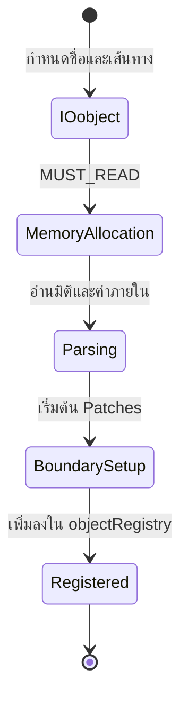
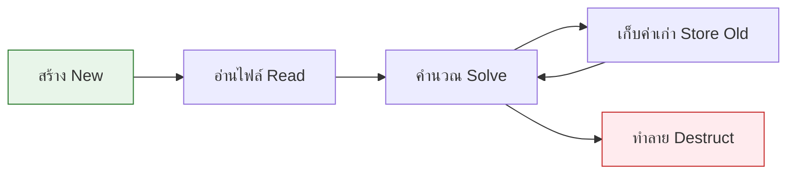

# วงจรชีวิตของฟิลด์ (Field Lifecycle)

![[field_assembly_line.png]]
`A high-tech conveyor belt factory representing the field lifecycle: Raw data enters (Read), goes through an "Units & Dimensions" scanner, gets "Boundary Condition" parts attached, and finally emerges as a complete GeometricField, scientific textbook diagram, clean vector line art, white background, high definition, flat design, educational infographic --ar 16:9`

## **ภาพรวม**

เอกสารนี้อธิบายวงจรชีวิตที่สมบูรณ์ของฟิลด์ OpenFOAM ตั้งแต่การสร้าง การใช้งาน ไปจนถึงการทำลาย โดยเน้นที่กลไกภายในที่ทำให้ฟิลด์ทำงานได้อย่างมีประสิทธิภาพและปลอดภัย

---

## **ส่วนที่ 1: การสร้างฟิลด์ (Field Construction)**

### **ขั้นตอนการสร้างฟิลด์**


> **Figure 1:** แผนภาพสถานะแสดงขั้นตอนการสร้างฟิลด์ข้อมูล ตั้งแต่การกำหนดเอกลักษณ์ผ่าน IOobject การจัดสรรหน่วยความจำ ไปจนถึงการลงทะเบียนในระบบจัดการออบเจ็กต์ของ OpenFOAMความปลอดภัยทางฟิสิกส์ไม่ส่งผลกระทบต่อความเร็วในการจำลอง ผ่านการใช้พลังของ C++ Template Metaprogramming ในการตรวจสอบความสอดคล้องทางมิติทั้งหมดที่ขั้นตอนการคอมไพล์โปรแกรมเพียงครั้งเดียว

เมื่อคุณสร้าง `volScalarField` ใน OpenFOAM จะเกิดกระบวนการสร้างที่ซับซ้อนขึ้น:

```cpp
// User code:
volScalarField p
(
    IOobject("p", runTime.timeName(), mesh, IOobject::MUST_READ),
    mesh
);
```

การประกาศที่ดูเรียบง่ายนี้จะกระตุ้นการเริ่มต้นที่ซับซ้อน:

#### **1. การสร้าง IOobject**

Constructor จะสร้าง `IOobject` ซึ่งสร้างเอกลักษณ์และคุณสมบัติการคงอยู่ของฟิลด์:

- **name parameter**: ตั้งค่าตัวระบุฟิลด์ (`"p"`)
- **runTime.timeName()**: สร้างเส้นทางไดเรกทอรีที่เหมาะสมสำหรับข้อมูลที่จัดดัชนีตามเวลา (เช่น `"0"`, `"0.1"`, `"0.2"`)
- **mesh reference**: ให้การเข้าถึงโดเมนการคำนวณ
- **IOobject::MUST_READ**: กำหนดว่าข้อมูลฟิลด์ต้องมีอยู่บนดิสก์และต้องอ่านระหว่างการสร้าง

#### **2. การสร้าง DimensionedField**

Constructor ของ geometric field จะเรียก constructor ของ `DimensionedField`:

- ซึ่งจะเรียก constructor ของ `Field` ฐาน
- ลำดับนี้จะจัดสรรหน่วยความจำหลักสำหรับค่าของเซลล์ภายใน
- อ่านและตั้งค่าข้อมูลมิติจากส่วนหัวของไฟล์
- จัดเก็บการอ้างอิงถึง computational mesh

#### **3. การเริ่มต้น GeometricField**

- สร้างระบบคอนเทนเนอร์ของ boundary field
- จัดการเงื่อนไขขอบเขตที่ไม่ต่อเนื่องที่ใช้กับ mesh patches
- อ่านข้อมูลจำเพาะของเงื่อนไขขอบเขตทั้งหมดจากไฟล์ฟิลด์
- กำหนดว่าแต่ละ boundary patch ควรได้รับการจัดการอย่างไรระหว่างการจำลอง

#### **4. การอ่านและแยกวิเคราะห์ไฟล์**

ระบบจะเปิดไฟล์ฟิลด์ (โดยทั่วไปที่ `"case/0/p"` สำหรับการเริ่มต้น):

- แยกวิเคราะห์ข้อมูลจำเพาะของมิติ
- มิติจะถูกเข้ารหัสเป็นเวกเตอร์ขององค์ประกอบเจ็ดชนิด:
  - มวล (Mass)
  - ความยาว (Length)
  - เวลา (Time)
  - อุณหภูมิ (Temperature)
  - ปริมาณ (Moles)
  - กระแส (Current)
  - ความเข้มแสง (Luminous intensity)

ตัวอย่างเช่น `[1 -1 -2 0 0 0 0]` แทนหน่วยความดันของมวล-ความยาว⁻¹-เวลา⁻²

- อ่านค่าฟิลด์ภายใน โดยรูปแบบเช่น `40000(30000)` แทนค่าสม่ำเสมอ 40000 ค่าของ 30000
- ข้อมูลจำเพาะของ boundary field จะถูกประมวลผล
- กำหนดเงื่อนไขเช่น `fixedValue` พร้อมค่าที่ระบุที่ขอบเขต inlet

![[of_field_constructor_chain.png]]
`A constructor chain flow diagram: IOobject → DimensionedField → GeometricField → Boundary Field Setup, showing the sequential initialization of metadata, dimensions, internal data, and patches, scientific textbook diagram, clean vector line art, white background, high definition, flat design, educational infographic --ar 16:9`

---

### **Constructor Chain ที่สมบูรณ์**

```cpp
// โครงสร้างภายในของการสร้าง volScalarField
template<class Type, class PatchField, class GeoMesh>
GeometricField<Type, PatchField, GeoMesh>::GeometricField
(
    const IOobject& io,
    const GeoMesh& mesh
)
:
    // 1. เริ่มต้น DimensionedField ฐาน
    DimensionedField<Type, GeoMesh>(io, mesh),

    // 2. เริ่มต้น boundary field container
    boundaryField_(mesh.boundary(), *this),

    // 3. ตั้งค่า metadata เชิงเวลา
    timeIndex_(0),
    field0Ptr_(nullptr),
    fieldPrevIterPtr_(nullptr)
{
    // 4. อ่านข้อมูลจากไฟล์ถ้าจำเป็น
    if (io.readOpt() == IOobject::MUST_READ) {
        readData(io);
    }

    // 5. ลงทะเบียนกับ objectRegistry
    store();
}
```

---

## **ส่วนที่ 2: การใช้ฟิลด์ใน Solver (Field Usage in Solver)**

ระหว่างการดำเนินการของ solver ฟิลด์จะถูกจัดการและอัปเดตอย่างต่อเนื่อง:

### **การทำงานใน Solver Loop**

```cpp
// In solver loop:
while (runTime.run()) {
    // 1. แก้ไข boundary conditions
    p.correctBoundaryConditions();

    // 2. ใช้ในสมการ
    fvScalarMatrix pEqn(fvm::laplacian(p) == source);
    pEqn.solve();

    // 3. เดินหน้าเวลา
    runTime++;

    // 4. เก็บค่าเก่า
    p.storeOldTimes();
}
```

#### **1. การแก้ไขเงื่อนไขขอบเขต (Boundary Condition Correction)**

เมธอด `correctBoundaryConditions()` มีความสำคัญในการรักษาความสม่ำเสมอของขอบเขต:

- จะทำให้มั่นใจว่าเงื่อนไขขอบเขตทั้งหมดได้รับการประเมินและใช้งานอย่างถูกต้อง
- มีความสำคัญโดยเฉพาะสำหรับเงื่อนไขขอบเขตที่แปรตามเวลาหรือซับซ้อน
- เงื่อนไขขอบเขตที่ขึ้นอยู่กับค่าฟิลด์อื่นจะได้รับการอัปเดต

```cpp
// ตัวอย่างการอัปเดตเงื่อนไขขอบเขต
void correctBoundaryConditions() {
    forAll(boundaryField_, patchi) {
        // แต่ละ patch จัดการเงื่อนไขของตนเอง
        boundaryField_[patchi].evaluate();
    }
}
```

#### **2. การรวมฟิลด์ในสมการ (Field Integration in Equations)**

ฟิลด์จะถูกรวมเข้าในสมการของโมเมนตัมหรือการขนส่งสเกลาร์ที่ไม่ต่อเนื่อง:

- วิธี finite volume สร้างการแสดงเมทริกซ์เบาบางของสมการควบคุม
- ค่าฟิลด์ทำหน้าที่เป็นค่าที่ไม่ทราบหรือสัมประสิทธิ์

```cpp
// ตัวอย่าง: สมการโมเมนตัม
fvVectorMatrix UEqn
(
    fvm::ddt(U)                           // Time derivative
  + fvm::div(phi, U)                      // Convection
  - fvm::laplacian(nu, U)                 // Diffusion
 ==
    -fvc::grad(p)                         // Pressure gradient
  + sources                               // Source terms
);
```

#### **3. การแก้สมการ (Equation Solving)**

เมธอด `solve()` จะกระตุ้น linear algebraic solver:

- อาจใช้วิธีการทำซ้ำเช่น:
  - **GAMG** (Geometric-algebraic multigrid)
  - **PCG** (Preconditioned conjugate gradient)
  - **PBiCG** (Preconditioned biconjugate gradient)

```cpp
// Linear solver options
solvers
{
    p
    {
        solver          GAMG;
        tolerance       1e-06;
        relTol          0.01;
    }
}
```

#### **4. การเลื่อนเวลาและการจัดเก็บประวัติ (Time Advancement and History)**

- ดัชนีเวลาจะถูกเลื่อนโดยใช้ `runTime++()`
- เมธอด `storeOldTimes()` จะจัดการประวัติเวลาของฟิลด์
- รักษาค่าของ time step ก่อนหน้าที่จำเป็นสำหรับรูปแบบการกระจายตัวตามเวลา
- จำเป็นสำหรับการแสดงผลของอนุพันธ์ตามเวลาที่ถูกต้องในการจำลองชั่วคราว

```cpp
// การจัดเก็บข้อมูลเวลาเก่า
void storeOldTimes() const {
    if (field0Ptr_) {
        field0Ptr_->storeOldTimes();
    }
    field0Ptr_ = new GeometricField(*this);
}
```

---

## **ส่วนที่ 3: การทำลายฟิลด์ (Field Destruction)**

เมื่อฟิลด์อยู่นอกขอบเขตหรือถูกลบโดยชัดแจ้ง รูปแบบ **Resource Acquisition Is Initialization (RAII)** ของ OpenFOAM จะทำให้แน่ใจว่ามีการ deallocate หน่วยความจำที่สะอาด:


> **Figure 2:** วงจรชีวิตที่สมบูรณ์ของฟิลด์ข้อมูล เริ่มต้นจากการสร้างใหม่ การอ่านข้อมูล การคำนวณในตัวแก้ปัญหา การจัดเก็บประวัติเวลา และสิ้นสุดที่การทำลายออบเจ็กต์อย่างปลอดภัยด้วยรูปแบบ RAIIความปลอดภัยทางฟิสิกส์ไม่ส่งผลกระทบต่อความเร็วในการจำลอง ผ่านการใช้พลังของ C++ Template Metaprogramming ในการตรวจสอบความสอดคล้องทางมิติทั้งหมดที่ขั้นตอนการคอมไพล์โปรแกรมเพียงครั้งเดียว

### **Destructor Chain ที่สมบูรณ์**

#### **1. การทำลาย GeometricField**

- จัดการการ cleanup ของการจัดเก็บฟิลด์ตามเวลา
- รวมถึงการลบ:
  - `field0Ptr_` (ฟิลด์ old-time ปัจจุบัน)
  - `fieldPrevIterPtr_` (พื้นที่จัดเก็บของการทำซ้ำก่อนหน้า)
- Destructor ของ `boundaryField_` จะ deallocate patch field objects ทั้งหมด

```cpp
GeometricField<Type, PatchField, GeoMesh>::~GeometricField() {
    // 1. Cleanup time history
    delete field0Ptr_;
    field0Ptr_ = nullptr;

    delete fieldPrevIterPtr_;
    fieldPrevIterPtr_ = nullptr;

    // 2. Boundary fields cleanup automatically
    // (PtrList destructor handles this)

    // 3. Base class cleanup
    // (DimensionedField handles mesh reference)
    // (Field handles reference counting)
}
```

#### **2. การทำลาย DimensionedField**

- ดำเนินการ cleanup ขั้นต่ำเนื่องจากถือการอ้างอิงถึง mesh object มากกว่าเป็นเจ้าของ
- การออกแบบนี้ป้องกันการทำลาย mesh ก่อนเวลาเมื่อหลายฟิลด์แชร์ mesh เดียวกัน

#### **3. การทำลาย Field ฐาน**

- จัดการกลไกการนับการอ้างอิงสำหรับอาร์เรย์ข้อมูลพื้นฐาน
- เมื่อการนับการอ้างอิงถึงศูนย์ (ไม่มีวัตถุอื่นถือการอ้างอิงถึงข้อมูลนี้)
- หน่วยความจำที่จัดสรรแบบไดนามิกจะถูกปล่อยโดยใช้ `delete[] v_`

```cpp
// Reference counting mechanism
refCount::~refCount() {
    if (count_ == 0) {
        delete this;
    }
}
```

#### **4. การทำลาย regIOobject**

- จะทำให้แน่ใจว่า file handle ที่เปิดอยู่ที่เกี่ยวข้องกับฟิลดถูกปิดอย่างเหมาะสม
- ป้องกันการรั่วไหลของทรัพยากรที่ระดับระบบปฏิบัติการ

### **ผลลัพธ์ของการออกแบบ RAII**

- ทำให้มั่นใจว่าฟิลด์ OpenFOAM มีความปลอดภัยจากข้อยกเว้นและไม่รั่วไหลของหน่วยควาจำ
- ทำงานได้ดีแม้ในกรณีที่การจำลองพบความไม่เสถียรเชิงตัวเลขหรือต้องการการสิ้นสุดก่อนกำหนด

![[of_raii_destructor_chain.png]]
`An RAII destructor chain diagram showing the cleanup process in reverse order: GeometricField cleanup (time history) → DimensionedField cleanup (references) → Field base cleanup (refCount/data deallocation) → regIOobject cleanup (file handles), scientific textbook diagram, clean vector line art, white background, high definition, flat design, educational infographic --ar 16:9`

---

## **ส่วนที่ 4: รูปแบบการเพิ่มประสิทธิภาพหน่วยความจำ (Memory Optimization Patterns)**

OpenFOAM ใช้กลยุทธ์การเพิ่มประสิทธิภาพหน่วยความจำที่ซับซ้อนเพื่อจัดการกับความต้องการการคำนวณที่สำคัญของการจำลอง CFD:

### **กลยุทธ์การจัดสรร (Allocation Strategies)**

| กลยุทธ์ | การทำงาน | ประโยชน์ |
|---------|------------|----------|
| **Lazy Allocation** | ใช้ mutable pointers สำหรับการจัดเก็บฟิลด์ภายใน | ป้องกันการจัดสรรหน่วยความจำที่ไม่จำเป็นสำหรับฟิลด์ที่ไม่ได้ใช้ |
| **Conditional Time Storage** | ฟิลด์ old-time จะถูกจัดสรับเมื่อจำเป็น | มีประสิทธิภาพสำหรับการจำลองสถานะคงที่ที่ไม่ต้องการประวัติเวลา |
| **Patch-Sized Storage** | จัดเก็นแบบ inline สำหรับ patches เล็ก, heap สำหรับ patches ใหญ่ | หลีกเลี่ยงภาระ heap allocation และป้องกันการพองตัวของขนาดวัตถุ |

### **Reference Counting และ Copy-on-Write**

OpenFOAM ใช้กลไก reference counting เพื่อลดการคัดลอกหน่วยความจำ:

```cpp
// Reference counting example
volScalarField p1(mesh, dimensionSet(1,-1,-2,0,0,0), 0.0);
volScalarField p2(p1);  // แชร์ข้อมูล - ไม่มีการคัดลอก!

// p2[0] = 1000.0;  // อันตราย: แก้ไข p1 ด้วย!
```

เมื่อต้องการคัดลอกจริง:

```cpp
// วิธีที่ 1: Deep copy constructor
volScalarField p3(p1, true);  // คัดลอกแบบลึก

// วิธีที่ 2: Clone method
volScalarField p4 = p1.clone();  // สร้างสำเนาอิสระเสมอ
```

### **Expression Templates**

ระบบ expression template ช่วยให้นิพจน์ทางคณิตศาสตร์มีประสิทธิภาพ:

```cpp
// Traditional: สร้าง 3 temporary fields
volScalarField temp1 = 2.0 * T;
volScalarField temp2 = rho * U;
volScalarField temp3 = temp1 + temp2;

// OpenFOAM expression templates: ไม่มีตัวแปรชั่วคราว
volScalarField result = 2.0 * T + rho * U;  // Single-pass evaluation
```

### **เลย์เอาต์ที่เพิ่มประสิทธิภาพแคช (Cache-Optimized Layout)**

#### **การจัดเก็บข้อมูลฟิลด์ (Field Data Storage)**

- ข้อมูลฟิลด์ถูกจัดเก็บอย่างต่อเนื่องในหน่วยความจำ
- เพื่อเพิ่มประสิทธิภาพการใช้แคชสูงสุด
- ลดความล่าช้าในการเข้าถึงหน่วยความจำ

#### **การจัดกลุ่มข้อมูลขอบเขต (Boundary Data Grouping)**

- ข้อมูลขอบเขตถูกจัดกลุ่มตามประเภทของ patch
- ทำให้การใช้อัลกอริทึมเงื่อนไขขอบเขตมีประสิทธิภาพมากขึ้น

#### **การจัดเก็บประวัติเวลา (Time History Storage)**

- ประวัติเวลาถูกจัดเก็บแยกจากค่าฟิลด์ปัจจุบัน
- อนุญาตให้ประสิทธิภาพแคชที่ดีขึ้นระหว่างการดำเนินการพีชคณิตเชิงเส้นแบบทำซ้ำ

![[of_field_memory_layout_cache.png]]
`A memory layout diagram showing contiguous field storage for SIMD, separate grouped boundary patches for efficient looping, and time history storage blocks, scientific textbook diagram, clean vector line art, white background, high definition, flat design, educational infographic --ar 16:9`

---

## **ส่วนที่ 5: ข้อผิดพลาดทั่วไปและการแก้ไข (Common Pitfalls and Solutions)**

### **ข้อผิดพลาดที่ 1: การละเลยเงื่อนไขขอบเขต**

> [!WARNING] ข้อผิดพลาดร้ายแรง
> การลืมอัปเดตเงื่อนไขขอบเขตสามารถนำไปสู่การคำนวณที่ผิดพลาด

```cpp
// ❌ ผิด: ลืมอัปเดตขอบ
U = someNewVelocityField;
surfaceScalarField phi = linearInterpolate(U) & mesh.Sf();  // ใช้ค่าขอบเก่า!

// ✅ ถูกต้อง: อัปเดตก่อนใช้
U = someNewVelocityField;
U.correctBoundaryConditions();
surfaceScalarField phi = linearInterpolate(U) & mesh.Sf();
```

### **ข้อผิดพลาดที่ 2: การจัดการเวลาที่ผิดพลาด**

```cpp
// ❌ ผิด: เก็บหลังจากแก้ไข
T = newTemperature;
T.storeOldTime();  // เก็บค่าใหม่ ไม่ใช่ค่าเก่า!

// ✅ ถูกต้อง: เก็บก่อนแก้ไข
T.storeOldTime();
T = newTemperature;
```

### **ข้อผิดพลาดที่ 3: ความเข้าใจผิดเกี่ยวกับ Reference Counting**

```cpp
// ❌ อันตราย: แชร์โดยไม่รู้ตัว
volScalarField p2 = p1;
p2[0] = 1000.0;  // แก้ไข p1 ด้วย!

// ✅ ปลอดภัย: คัดลอกเมื่อต้องการแก้ไข
volScalarField p2 = p1.clone();
p2[0] = 1000.0;  // p2 แยกจาก p1
```

---

## **สรุป (Summary)**

วงจรชีวิตของฟิลด์ OpenFOAM ประกอบด้วย:

1. **การสร้าง**: Constructor chain ที่ซับซ้อนตั้งแต่ IOobject ไปจนถึง GeometricField
2. **การใช้งาน**: Solver loop พร้อมการอัปเดตเงื่อนไขขอบเขต การแก้สมการ และการจัดการเวลา
3. **การทำลาย**: RAII cleanup อัตโนมัติที่ปลอดภัยและมีประสิทธิภาพ

กลยุทธ์การเพิ่มประสิทธิภาพเหล่านี้โดยรวมทำให้ OpenFOAM สามารถจัดการปัญหา CFD ขนาดใหญ่ได้อย่างมีประสิทธิภาพในขณะที่รักษาความถูกต้องทางตัวเลขและประสิทธิภาพการคำนวณ

---

## **ดูเพิ่มเติม**

- [[01_Introduction]] - ภาพรวมระบบฟิลด์
- [[04_⚙️_Key_Mechanisms_The_Inheritance_Chain]] - ลำดับชั้นการสืบทอดที่สมบูรณ์
- [[09_🧠_Under_the_Hood_Complete_CFD_Field_Lifecycle]] - รายละเอียดเชิงลึกเกี่ยวกับวงจรชีวิต
- [[06_⚠️_Common_Pitfalls_and_Solutions]] - ข้อผิดพลาดเพิ่มเติมและวิธีแก้ไข
