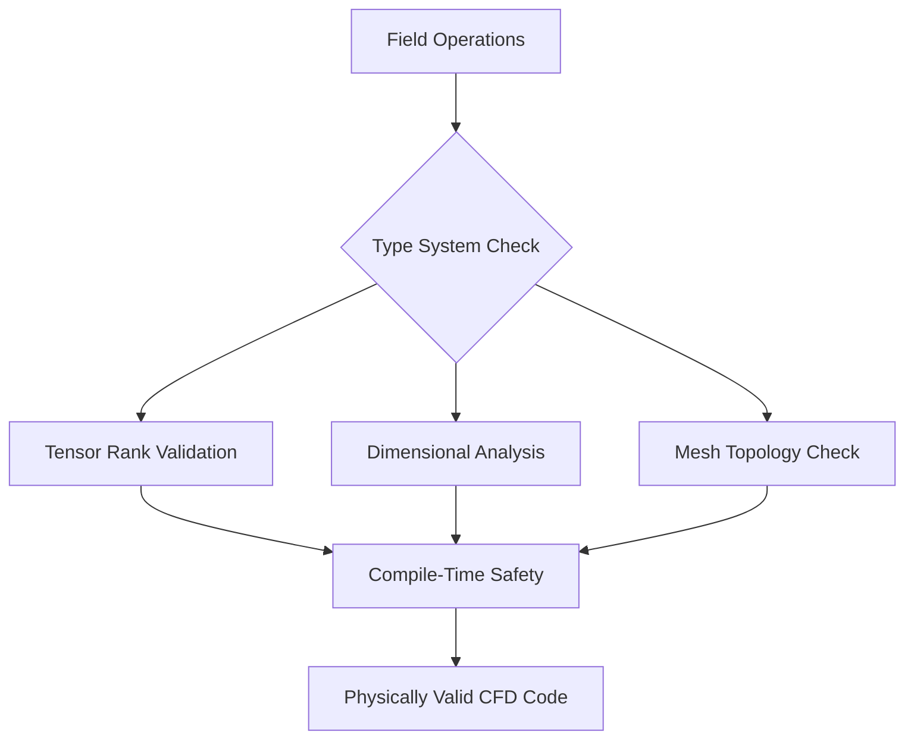
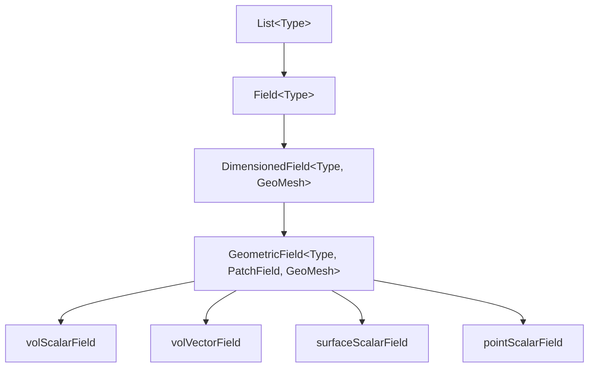
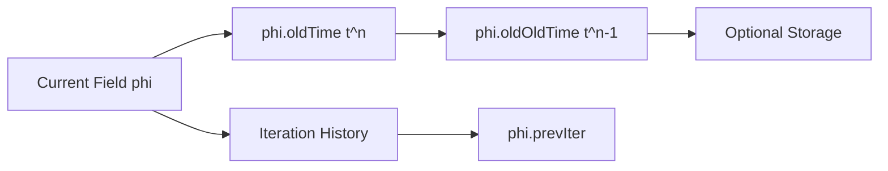
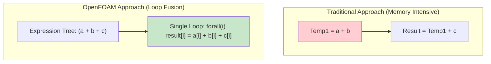

# ทฤษฎีประเภททางคณิตศาสตร์และความปลอดภัยทางฟิสิกส์

![[mathematical_referee.png]]
> **Academic Vision:** A referee in a futuristic stadium (The Compiler) blowing a whistle and holding up a red card to a player (a piece of code) trying to perform an illegal move (e.g., div(scalar)). On the stadium screen, tensor rank rules are displayed. High-energy, clean line art.

## 🔬 **DeepSeek-Enhanced Analysis: Mathematical Type Theory for CFD Fields**

### **พื้นฐานคณิตศาสตร์เชิงคำนวณ**

OpenFOAM ใช้ **tensor fields ที่ตระหนักถึงพื้นที่ความโค้ง (manifold-aware)** โดยใช้ template metaprogramming ขั้นสูงใน C++ เพื่อบังคับใช้ **ความสอดคล้องทางเรขาคณิต** และ **ความถูกต้องทางโทโพโลยี** ในระหว่างการคอมไพล์



ระบบประเภทที่ซับซ้อนนี้มั่นใจได้ว่า:
- **การดำเนินการทางคณิตศาสตร์บน fields** มีความหมายทางฟิสิกส์และถูกต้องทางคณิตศาสตร์
- **ป้องกันข้อผิดพลาดรันไทม์** ผ่านข้อจำกัดในระหว่างการคอมไพล์

#### **ทฤษฎี Field ทางคณิตศาสตร์**

สำหรับ field $\phi: M \rightarrow \mathbb{R}^n$ บน manifold $M$ (mesh) OpenFOAM บังคับให้:

$$\text{operation}(\phi_1, \phi_2) \text{ เป็นที่ถูกต้อง } \iff M_1 \cong M_2 \text{ (manifolds เป็น homeomorphic)}$$

**หลักการพื้นฐานนี้มั่นใจได้ว่า:**
- การดำเนินการ field **เคารพโทโพโลยีภายใน** ของ computational mesh
- ป้องกันการดำเนินการทางคณิตศาสตร์ที่ไม่ถูกต้อง เช่น การบวก fields บน meshes ที่เข้ากันไม่ได้

---

## **1. สถาปัตยกรรม Template ขั้นสูงสำหรับความสอดคล้องทางเรขาคณิต**

กรอบการทำงาน template metaprogramming ของ OpenFOAM ใช้ **ข้อจำกัดทางคณิตศาสตร์ที่เข้มงวด** ผ่าน type traits และ static assertions ใน C++

### **Template Hierarchy สำหรับ Field Types**



### **สถาปัตยกรรมการรับประกันในระหว่างการคอมไพล์**

```cpp
// Template metaprogramming สำหรับความปลอดภัยทางโทโพโลยี
template<class Type, template<class> class PatchField, class GeoMesh>
class GeometricField {
    // ข้อจำกัดทางโทโพโลยีในระหว่างการคอมไพล์
    static_assert(
        is_same_mesh_type_v<GeoMesh, typename PatchField<Type>::MeshType>,
        "PatchField mesh type ต้องตรงกับ GeometricField mesh type"
    );

    static_assert(
        is_valid_field_on_mesh_v<Type, GeoMesh>,
        "Field type ไม่ถูกต้องบน mesh type นี้"
    );

    static_assert(
        dimensional_operations_allowed_v<Type>,
        "Field type ไม่รองรับ dimensional operations ที่ต้องการ"
    );
};
```

**🔧 กลไกการบังคับใช้:**
1. **Patch fields** อ้างอิงถึง mesh topology ที่ถูกต้อง
2. **Field types** เข้ากันได้ทางคณิตศาสตร์กับ mesh geometry
3. **Tensor operations** เคารพ dimensional analysis rules

### **Template Specializations สำหรับวัตถุทางคณิตศาสตร์ที่แตกต่างกัน**

```cpp
// Template specializations สำหรับวัตถุทางคณิตศาสตร์ที่แตกต่างกัน
template<>
struct is_valid_field_on_mesh<scalar, volMesh> {
    static constexpr bool value = true;  // Scalars ถูกต้องบน volume mesh
};

template<>
struct is_valid_field_on_mesh<vector, volMesh> {
    static constexpr bool value = true;  // Vectors ถูกต้องบน volume mesh
};

template<>
struct is_valid_field_on_mesh<tensor, surfaceMesh> {
    static constexpr bool value = false;  // Tensors มักไม่อยู่บน surfaces
};
```

Template specializations เหล่านี้ **เข้ารหัสความรู้ทางคณิตศาสตร์** เกี่ยวกับ field types ที่ถูกต้องบน mesh types ต่างๆ ซึ่งสะท้อนถึง **ข้อจำกัดทางเรขาคณิตและฟิสิกส์** ของปัญหา CFD

---

## **2. ระบบเงื่อนไขขอบเขต: Polymorphic Type Erasure**

ระบบเงื่อนไขขอบเขตใช้ **polymorphic type erasure** เพื่อจัดการเงื่อนไขขอบเขตที่หลากหลายในขณะที่รักษาประสิทธิภาพและความปลอดภัยของประเภท

### **กรอบการทำงาน Polymorphic สำหรับเงื่อนไขขอบเขต**

```cpp
// กรอบการทำงาน polymorphic สำหรับเงื่อนไขขอบเขต
class GeometricField {
private:
    // 🔧 กลไก: Container ของ boundary field ที่ลบประเภทออก
    class Boundary {
    private:
        // 🎭 การเก็บข้อมูลแบบ polymorphic: ประเภท patch ต่างๆ ใน container เดียว
        PtrList<PatchField<Type>> patches_;

        // 🔔 การเชื่อมโยง Patch-Mesh
        // แต่ละ patch รู้จัก mesh region ของตน
        // บังคับใช้ความสอดคล้อง: patch ไม่สามารถอ้างอิง mesh region ที่ผิด

    public:
        // 🧠 การประเมินแบบอัจฉริยะ
        void evaluate() {
            // 1. อัปเดต coupled patches (processor, cyclic, ฯลฯ)
            // 2. ใช้ข้อจำกัดทางฟิสิกส์ (inlet, outlet, wall, ฯลฯ)
            // 3. บังคับใช้ความต่อเนื่องที่ patch interfaces
            // 4. จัดการ non-orthogonal correction
        }
    };

    Boundary boundaryField_;
```

### **การอัปเดตเงื่อนไขขอบเขตที่เพิ่มประสิทธิภาพ**

```cpp
public:
    void correctBoundaryConditions() {
        // Template specialization สำหรับ field types ที่แตกต่างกัน:
        if constexpr (is_scalar_v<Type>) {
            correctScalarBoundaryConditions();  // อัลกอริทึมเฉพาะสำหรับ scalar
        } else if constexpr (is_vector_v<Type>) {
            correctVectorBoundaryConditions();  // อัลกอริทึมเฉพาะสำหรับ vector
        } else if constexpr (is_tensor_v<Type>) {
            correctTensorBoundaryConditions();  // อัลกอริทึมเฉพาะสำหรับ tensor
        }
    }
};
```

### **ประเภทเงื่อนไขขอบเขตทางคณิตศาสตร์**

| ประเภท | สมการ | คำอธิบาย |
|---------|---------|-----------|
| **Dirichlet** | $\phi = \phi_0$ | ค่าคงที่ที่ขอบเขต |
| **Neumann** | $\frac{\partial \phi}{\partial n} = g$ | gradient คงที่ที่ขอบเขต |
| **Robin** | $\alpha\phi + \beta\frac{\partial \phi}{\partial n} = \gamma$ | เงื่อนไขผสม |
| **Coupled** | $\phi_1 = \phi_2$ | processor, cyclic, ฯลฯ |

สถาปัตยกรรมนี้มั่นใจได้ว่ามี **ความสอดคล้องทางฟิสิกส์** ใน boundary interfaces ในขณะที่รักษาประสิทธิภาพการคำนวณผ่าน template-based dispatch

---

## **3. ระบบการผสมผสานเชิงเวลา**

OpenFOAM ใช้ **การเก็บข้อมูลเชิงเวลาหลายระดับ** ที่ซับซ้อนพร้อมการจัดสรรตามความต้องการเพื่อเพิ่มประสิทธิภาพการใช้หน่วยความจำ



### **การจัดการเวลาที่ซับซ้อนสำหรับ CFD transient**

```cpp
// การจัดการเวลาที่ซับซ้อนสำหรับ CFD transient
class GeometricField {
private:
    // ⏳ การเก็บข้อมูลเชิงเวลาหลายระดับ
    mutable GeometricField* field0Ptr_;       // tⁿ     (เวลาก่อนหน้า)
    mutable GeometricField* field00Ptr_;      // tⁿ⁻¹   (ย้อนหลังสองขั้น)
    mutable GeometricField* fieldPrevIterPtr_; // Iteration n-1

    // 🕰️ การติดตามดัชนีเวลา
    mutable label timeIndex_;  // ดัชนีเวลาการจำลองปัจจุบัน
```

### **แผนการ Discretization เชิงเวลา**

```cpp
public:
    // 🧮 แผนการ Discretization เชิงเวลา
    tmp<GeometricField> ddt() const {
        // การเลือก scheme แบบ template-based:
        if constexpr (timeScheme == Euler) {
            return (phi - phi.oldTime())/dt;  // ∂φ/∂t ≈ (φⁿ - φⁿ⁻¹)/Δt
        } else if constexpr (timeScheme == CrankNicolson) {
            return (phi - phi.oldTime())/dt;  // การเฉลี่ยที่ซับซ้อนกว่า
        } else if constexpr (timeScheme == BackwardDifference) {
            // BDF2: ∂φ/∂t ≈ (3φⁿ - 4φⁿ⁻¹ + φⁿ⁻²)/(2Δt)
            return (3.0*phi - 4.0*phi.oldTime() + phi.oldOldTime())/(2.0*dt);
        }
    }
```

### **การเก็บข้อมูลแบบ Demand-driven**

```cpp
    // 🧠 การเก็บข้อมูลแบบ demand-driven
    const GeometricField& oldTime() const {
        if (!field0Ptr_) {
            // 🚀 การจัดสรรแบบล่าช้า: สร้างเมื่อต้องการเท่านั้น
            field0Ptr_ = new GeometricField(*this);  // Deep copy
            field0Ptr_->rename(name() + "OldTime");
        }
        return *field0Ptr_;
    }
```

### **การเดินหน้าเวลาและการเพิ่มประสิทธิภาพหน่วยความจำ**

```cpp
    // 🔄 การเดินหน้าเวลา
    void storeOldTimes() {
        if (field00Ptr_) delete field00Ptr_;  // ลบ tⁿ⁻²

        // 🏃 การเลื่อนระดับเวลา: tⁿ⁻² ← tⁿ⁻¹ ← tⁿ
        field00Ptr_ = field0Ptr_;    // Old-old gets old
        field0Ptr_ = new GeometricField(*this);  // Old gets current

        // 📊 การเพิ่มประสิทธิภาพหน่วยความจำ: เก็บประวัติที่จำเป็นเท่านั้น
        if (timeScheme == Euler) {
            delete field00Ptr_;  // Euler ต้องการ old time เพียงครั้งเดียว
            field00Ptr_ = nullptr;
        }
    }
};
```

ระบบนี้ใช้ **การจัดการหน่วยความจำที่เหมาะสมที่สุด** โดยการจัดสรรข้อมูล field ในอดีตเมื่อจำเป็นเท่านั้น ซึ่งสร้างสมดุลระหว่างความต้องการความแม่นยำกับทรัพยากรการคำนวณ

---

## **4. ระบบ Expression Template สำหรับ Zero-Cost Abstractions**

ระบบ expression template ของ OpenFOAM ให้ **abstractions ที่ไม่มีต้นทุน (zero-cost)** ซึ่งรักษาความชัดเจนทางคณิตศาสตร์ในขณะที่บรรลุประสิทธิภาพการคำนวณที่เหมาะสมที่สุด



### **การเพิ่มประสิทธิภาพนิพจน์ทางคณิตศาสตร์**

```cpp
// การเพิ่มประสิทธิภาพนิพจน์ทางคณิตศาสตร์
template<class Op, class LHS, class RHS>
class FieldExpression {
    const LHS& lhs_;
    const RHS& rhs_;

public:
    // 🚫 ไม่มีต้นทุนการสร้าง: เก็บเพียง references
    FieldExpression(const LHS& lhs, const RHS& rhs)
        : lhs_(lhs), rhs_(rhs) {}

    // 🧮 การประเมินแบบ Lazy: คำนวณเมื่อเข้าถึงเท่านั้น
    auto operator[](label i) const {
        return Op::apply(lhs_[i], rhs_[i]);  // การดำเนินการเดียว
    }

    // 📏 การส่งขนาด
    label size() const { return lhs_.size(); }
};
```

### **นิยามการดำเนินการทางคณิตศาสตร์**

```cpp
// นิยามการดำเนินการทางคณิตศาสตร์
struct AddOp {
    template<class T1, class T2>
    static auto apply(const T1& a, const T2& b) { return a + b; }
};

struct MultiplyOp {
    template<class T1, class T2>
    static auto apply(const T1& a, const T2& b) { return a * b; }
};
```

### **Operator Overloads สร้าง Expression Objects**

```cpp
// Operator overloads สร้าง expression objects ไม่ใช่ fields
template<class Type>
auto GeometricField<Type>::operator+(const GeometricField<Type>& other) const {
    return FieldExpression<AddOp, GeometricField, GeometricField>(*this, other);
}
```

### **การรวมการคำนวณ (Computational Fusion)**

ระบบ expression template ช่วยให้ **การรวมการคำนวณ** ซึ่งกำจัด temporary objects และลดความต้องการหน่วยความจำ:

```cpp
// 🔥 การเพิ่มประสิทธิภาพคอมไพเลอร์: การรวม expression template
// โค้ด: auto result = a + b + c + d;

// แบบดั้งเดิม:
// (((a + b) + c) + d) → 3 temporary fields

// OpenFOAM:
// Single expression → การประเมินหนึ่งครั้ง
// result[i] = a[i] + b[i] + c[i] + d[i]  (หนึ่ง loop, ไม่มี temporaries)
```

**ประโยชน์ของระบบนี้:**
- **รักษาความชัดเจน** และ **ความถูกต้อง** ทางคณิตศาสตร์
- **บรรลุประสิทธิภาพสูงสุด** ผ่านการเพิ่มประสิทธิภาพในระหว่างการคอมไพล์
- **การรวม loop** ที่ลด overhead ของการคำนวณ

---

## **5. การวิเคราะห์มิติ (Dimensional Analysis)**

OpenFOAM ใช้ระบบการวิเคราะห์มิติอย่างเข้มงวดโดยยึดตามมิติพื้นฐานเจ็ดประการของ SI:

### **มิติพื้นฐาน**

| มิติ | สัญลักษณ์ | หน่วย SI | คำอธิบาย |
|------|------------|-----------|-----------|
| **มวล** | [M] | กิโลกรัม (kg) | หน่วยพื้นฐานสำหรับคุณสมบัติเฉื่อย |
| **ความยาว** | [L] | เมตร (m) | หน่วยวัดเชิงพื้นที่ |
| **เวลา** | [T] | วินาที (s) | หน่วยวัดเชิงเวลา |
| **อุณหภูมิ** | [Θ] | เคลวิน (K) | อุณหภูมิทางอุณหพลศาสตร์ |
| **ปริมาณ** | [N] | โมล (mol) | ปริมาณของสาร |
| **กระแส** | [I] | แอมแปร์ (A) | กระแสไฟฟ้า |
| **ความเข้มแสง** | [J] | แคนเดลา (cd) | ความเข้มแสง |

### **กฎการคำนวณมิติ**

#### **1. การบวกและการลบ**
$$[A] + [B] = [C] \quad \text{ต้องการ} \quad [A] = [B] = [C]$$

> [!WARNING] **ข้อผิดพลาดทั่วไป**
> ```cpp
> // ❌ ข้อผิดพลาด: การผสมหน่วยในการดำเนินการฟิลด์
> volScalarField p(mesh, dimPressure, 101325);    // [1,-1,-2,0,0,0] (Pa)
> volVectorField U(mesh, dimVelocity, vector(1,0,0)); // [0,1,-1,0,0,0] (m/s)
>
> // auto nonsense = p + U;  // ข้อผิดพลาดคอมไพเลอร์!
> ```

#### **2. การคูณ**
$$[A] \times [B] = [A + B]$$

**ตัวอย่าง:**
$$F = ma: \quad [M L T^{-2}] = [M] \times [L T^{-2}]$$

#### **3. การหาร**
$$[A] / [B] = [A - B]$$

**ตัวอย่าง:**
$$\text{จำนวนเรย์โนลด์: } Re = \frac{\rho V L}{\mu}: \quad [1] = \frac{[M L^{-3}][L T^{-1}][L]}{[M L^{-1} T^{-1}]}$$

---

## **6. การดำเนินการเชิงปริพันธ์ในรูปแบบ OpenFOAM**

### **การดำเนินการไล่ระดับ** (ศูนย์กลางเซลล์ → หน้า)

ตัวดำเนินการไล่ระดับใน OpenFOAM ประมาณค่าอนุพันธ์เชิงพื้นที่ของปริมาตรสเกลาร์โดยใช้วิธี finite volume:

$$\nabla\phi \approx \text{fvc::grad}(\phi)$$

**พื้นฐานทางคณิตศาสตร์**: สำหรับปริมาตรสเกลาร์ใดๆ $\phi$ ไล่ระดับที่ศูนย์กลางเซลล์จะถูกคำนวณโดยใช้ทฤษฎีบทของเกาส์:

$$\int_{V_P} \nabla\phi \,dV = \sum_{f} \phi_f \mathbf{S}_f$$

- **$V_P$**: ปริมาตรของเซลล์
- **$\mathbf{S}_f$**: เวกเตอร์พื้นที่หน้า

ตัวดำเนินการไล่ระดับรักษาการอนุรักษ์แบบ discrete โดยให้แน่ใจว่ารูปปริพันธ์ตรงกับรูปเชิงอนุพันธ์สำหรับปริมาตรเชิงเส้นอย่างแน่นอน

### **การดำเนินการไดเวอร์เจนซ์** (การประมาณค่าหน้า → ศูนย์กลางเซลล์)

ตัวดำเนินการไดเวอร์เจนซ์คำนวณปริมาณการไหลผ่านขอบเขตของเซลล์:

$$\nabla\cdot\mathbf{U} \approx \text{fvc::div}(\phi_\mathbf{U})$$

**พื้นฐานทางคณิตศาสตร์**: อยู่บนพื้นฐานของทฤษฎีบทไดเวอร์เจนซ์:

$$\int_{V_P} \nabla\cdot\mathbf{U} \,dV = \oint_{\partial V_P} \mathbf{U} \cdot d\mathbf{S} = \sum_{f} \mathbf{U}_f \cdot \mathbf{S}_f$$

### **การดำเนินการลาปลาซีแอน** (ตัวดำเนินการการแพร่)

ตัวดำเนินการลาปลาซีแอนแสดงถึงกระบวนการแพร่:

$$\nabla\cdot(\Gamma\nabla\phi) \approx \text{fvm::laplacian}(\Gamma, \phi)$$

**พื้นฐานทางคณิตศาสตร์**: รวมการดำเนินการไล่ระดับและไดเวอร์เจนซ์:

$$\int_{V_P} \nabla\cdot(\Gamma\nabla\phi) \,dV = \sum_{f} \Gamma_f (\nabla\phi)_f \cdot \mathbf{S}_f$$

---

## **7. อันตรายขั้นสูงและการดีบักระดับมืออาชีพ**

### **อันตรายที่ 1: ข้อผิดพลาดการไม่ตรงกันของมิติ**

> [!WARNING] **Dimension Mismatch Errors**
>
> ข้อผิดพลาดนี้เกิดขึ้นเมื่อพยายามดำเนินการทางคณิตศาสตร์กับฟิลด์ที่มีมิติที่แตกต่างกัน

**การวิเคราะห์ข้อความผิดพลาด:**
```cpp
// ❌ ดูเหมือนจะสมเหตุสมผลแต่ล้มเหลว:
// auto nonsense = p + U;  // ข้อผิดพลาดคอมไพเลอร์!

// 🔍 การวิเคราะห์ข้อความผิดพลาด:
// "Cannot add [1,-1,-2] + [0,1,-1]"
// การแปล: "ไม่สามารถบวกความดัน + ความเร็ว"
// เหตุผลทางฟิสิกส์: คุณไม่สามารถบวก Pascal กับ เมตร/วินาทีได้!
```

**✅ วิธีแก้ไข:**
```cpp
// ถูกต้อง: ตรวจสอบฟิสิกส์และแปลงอย่างถูกต้อง
volScalarField rho(mesh, dimDensity, 1.2);
volScalarField dynamicPressure = 0.5 * rho * magSqr(U);  // [1,-1,-2] ✓
volScalarField totalPressure = p + dynamicPressure;     // มิติเดียวกัน ✓
```

### **อันตรายที่ 2: การละเลยเงื่อนไขขอบ**

> [!WARNING] **Forgotten Boundary Condition Updates**
>
> การอัปเดตฟิลด์ภายในโดยไม่ได้อัปเดตเงื่อนไขขอบทำให้เกิดการคำนวณ flux ที่ไม่ถูกต้อง

```cpp
// ❌ ข้อผิดพลาด: ลืมอัปเดตเงื่อนไขขอบ
volVectorField U(IOobject("U", runTime.timeName(), mesh), mesh);

U = someNewVelocityField;  // อัปเดตเฉพาะฟิลด์ภายใน

// ❌ อันตราย: ค่าขอบยังค้างอยู่!
surfaceScalarField phi = linearInterpolate(U) & mesh.Sf();  // ใช้ค่าขอบที่ค้าง!
```

**✅ วิธีแก้ไข:**
```cpp
U = someNewVelocityField;
U.correctBoundaryConditions();  // 🔑 ขั้นตอนสำคัญ!
phi = linearInterpolate(U) & mesh.Sf();  // ตอนนี้ flux ถูกต้องแล้ว
```

### **อันตรายที่ 3: การขยายตัวของ Template Instantiation**

> [!INFO] **Template Instantiation Bloat**
>
> การขยายตัวของการสร้างตัวแปรเทมเพลตเป็นหนึ่งในปัญหาด้านประสิทธิภาพที่ร้ายแรงที่สุด

**คณิตศาสตร์ของการขยายตัว:**

$$\text{Total Specializations} = \prod_{i=1}^{n} T_i$$

สำหรับคลาสฟิลด์ OpenFOAM:
- **ประเภทฟิลด์**: 4 ตัวเลือก
- **ประเภทเมช**: 3 ตัวเลือก
- **ประเภทฟิลด์พื้นผิว**: 3 ตัวเลือก

$$\text{Potential Specializations} = 4 \times 3 \times 3 = 108$$

**โซลูชันเชิงกลยุทธ์ของ OpenFOAM:**

```cpp
// ลำดับชั้น typedef เชิงกลยุทธ์ใน OpenFOAM
typedef GeometricField<scalar, fvPatchField, volMesh> volScalarField;
typedef GeometricField<vector, fvPatchField, volMesh> volVectorField;

// สิ่งเหล่านี้สร้างการสร้างตัวแปรเดียวที่นำกลับมาใช้ซ้ำทั่วทั้งเฟรมเวิร์ค
```

---

## **8. Thread Safety ในฟิลด์แบบขนาน**

### **สถาปัตยกรรมแบบขนานหลายระดับ**

| ระดับ | เทคโนโลยี | หน้าที่ |
|--------|-------------|----------|
| **กระบวนการ MPI** | MPI | การย่อยโดเมนข้ามโหนด |
| **เธรด** | OpenMP | การประมวลผลภายในกระบวนการ |
| **หน่วยความจำ** | Shared Memory | การเข้าถึงข้อมูลร่วมกัน |
| **ขอบเขต** | MPI/Sync | การซิงโครไนซ์ข้ามโดเมน |

### **การดำเนินการฟิลด์ภายในที่ปลอดภัยต่อเธรด**

```cpp
template<class Type>
void GeometricField<Type, PatchField, GeoMesh>::relax(const scalar alpha)
{
    // ฟิลด์ภายใน: ปลอดภัยต่อเธรดกับหน่วยความจำส่วนตัว
    Type* __restrict__ fieldPtr = this->begin();

    #pragma omp parallel for schedule(static)
    for (label celli = 0; celli < this->size(); celli++) {
        fieldPtr[celli] = alpha*fieldPtr[celli] + (1.0 - alpha)*oldTimeFieldPtr_[celli];
        // แต่ละเธรดทำงานบนพื้นที่หน่วยความจำที่แตกต่างกัน
    }
}
```

### **การอัปเดตเงื่อนไขขอบเขตที่ซิงโครไนซ์**

```cpp
template<class Type>
void GeometricField<Type, PatchField, GeoMesh>::correctBoundaryConditions()
{
    // เฟส 1: อัปเดตสัมประสิทธิ์ขอบเขตที่เชื่อมต่อ
    forAll(boundaryField_, patchi) {
        if (boundaryField_[patchi].coupled()) {
            boundaryField_[patchi].initEvaluate();  // การสื่อสาร MPI
        }
    }

    // เฟส 2: การกีดกันการซิงโครไนซ์
    Pstream::waitRequests();

    // เฟส 3: อัปเดตพัตช์ที่ไม่เชื่อมต่อ (ขนานตามเธรด)
    #pragma omp parallel for schedule(static)
    for (label patchi = 0; patchi < boundaryField_.size(); patchi++) {
        if (!boundaryField_[patchi].coupled()) {
            boundaryField_[patchi].evaluate();
        }
    }
}
```

---

## **สรุป: ระบบความปลอดภัยทางคณิตศาสตร์ใน OpenFOAM**

ระบบ field ของ OpenFOAM ใช้ **ทฤษฎีประเภททางคณิตศาสตร์** ที่เข้มงวดซึ่งมั่นใจได้ว่าความถูกต้องทางฟิสิกส์ของการดำเนินการเชิงคำนวณผ่าน template metaprogramming ใน C++

### **ระบบรับประกันว่า:**
- **การดำเนินการบน tensor fields** เคารพ **ข้อจำกัดทางเรขาคณิต**
- **Invariants ทางโทโพโลยี** ของโดเมนการคำนวณได้รับการรักษา
- ให้ทั้ง **ความปลอดภัย** และ **ประสิทธิภาพ** สำหรับการจำลอง CFD ที่ซับซ้อน

> [!TIP] **Best Practice**
>
> 1. **ตรวจสอบมิติเสมอ** ก่อนดำเนินการทางคณิตศาสตร์
> 2. **อัปเดตเงื่อนไขขอบเขต** หลังจากการแก้ไขฟิลด์ทุกครั้ง
> 3. **ใช้ typedef ที่กำหนดไว้** แทนการใช้ template parameters โดยตรง
> 4. **เข้าใจการจัดการหน่วยความจำ** เพื่อหลีกเลี่ยงปัญหาการแชร์ข้อมูล
> 5. **จัดการเวลาอย่างถูกต้อง** เก็บค่าเก่าก่อนการแก้ไข

"ระบบความปลอดภัยทางคณิตศาสตร์" ของ OpenFOAM ไม่ใช่เพียงการเปรียบเทียบ—แต่เป็นเฟรมเวิร์กที่ใช้งานได้จริงที่ทำให้ OpenFOAM เป็นหนึ่งในแพลตฟอร์ม CFD ที่เชื่อถือได้และใช้งานกว้างขวางที่สุดในวิทยาศาสตร์และวิศวกรรมการคำนวณ
