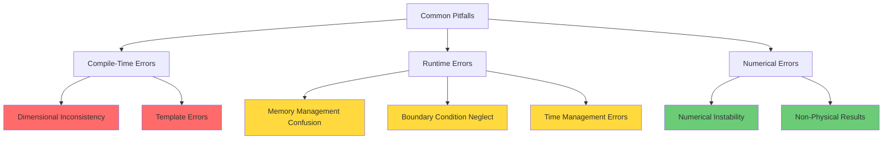
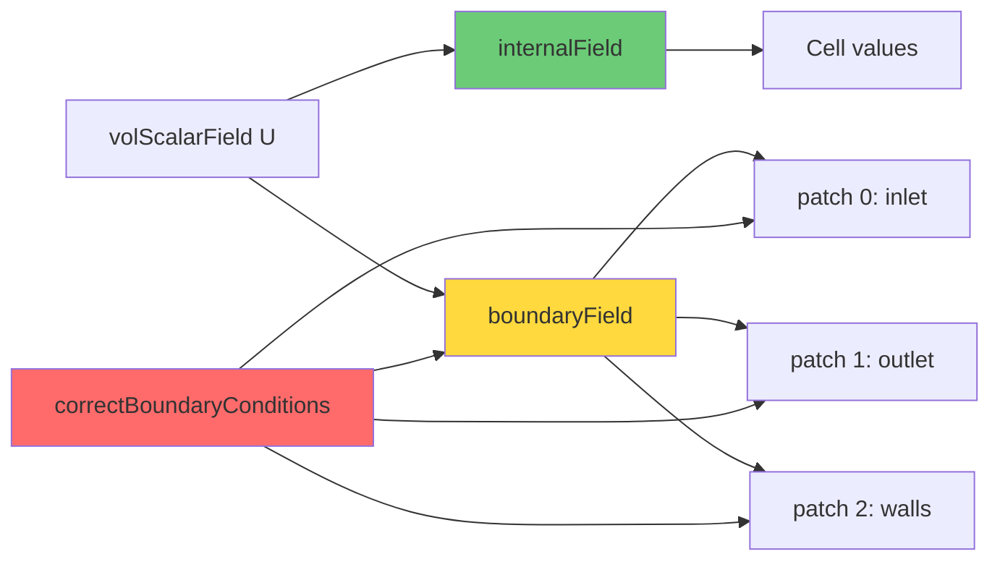
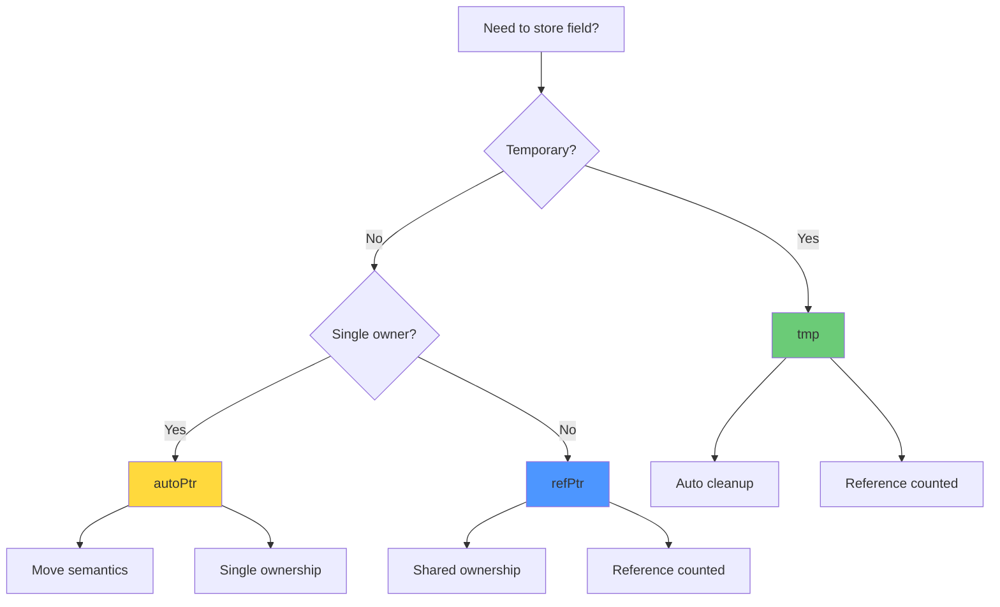
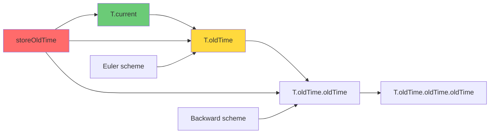
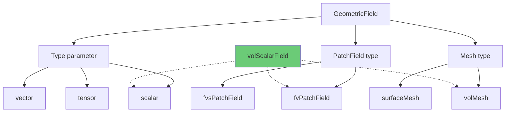
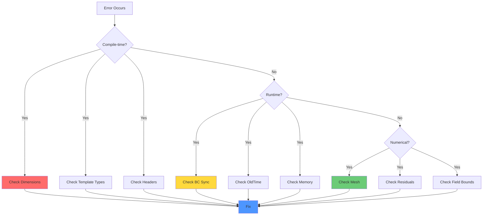

# Common Pitfalls and Debugging

ข้อผิดพลาดที่พบบ่อยในการเขียนโค้ด OpenFOAM และวิธีแก้ไข

---

## 🎯 Learning Objectives | เป้าหมายการเรียนรู้

**Thai:**
- เข้าใจข้อผิดพลาดทั่วไป 5 ประเภทในการเขียนโค้ด OpenFOAM
- สามารถป้องกันและแก้ไขปัญหา Dimensional Inconsistency, Boundary Condition Neglect, Memory Management Confusion, Time Management Errors และ Template Errors
- ใช้ Debugging Checklist เพื่อวินิจฉัยปัญหาอย่างเป็นระบบ
- เขียนโค้ดที่ robust, efficient และ maintainable

**English:**
- Understand the 5 common pitfall categories in OpenFOAM programming
- Prevent and resolve Dimensional Inconsistency, Boundary Condition Neglect, Memory Management Confusion, Time Management Errors, and Template Errors
- Apply systematic Debugging Checklist for problem diagnosis
- Write robust, efficient, and maintainable code

---

## ทำมาครับ/Why: ทำไมต้องเข้าใจ Common Pitfalls?

### 🎯 ความสำคัญ (Importance)

ข้อผิดพลาดเหล่านี้ทำให้เกิดปัญหาตั้งแต่ **Compilation error** (โค้ดไม่ผ่าน) ไปจนถึง **Numerical instability** (การคำนวณแตก) การเข้าใจ root cause จะช่วยให้ debug เร็วขึ้น 10 เท่า และเขียนโค้ดที่ **robust** และ **efficient**

### 🔥 ผลกระทบทาง CFD (CFD Consequences)

| ข้อผิดพลาด | ผลกระทบต่อ CFD | ตัวอย่าง |
|------------|-----------------|---------|
| Dimensional Inconsistency | Compilation fail → ไม่สามารถ build solver ได้ | `p + U` error: บวก pressure (Pa) กับ velocity (m/s) |
| Neglecting BCs | Mass conservation error → Simulation diverge | Flux คำนวณด้วย BC เก่า → mass imbalance |
| Memory Confusion | Unpredictable results → Physical nonsense | Shallow copy ทำให้ p1 เปลี่ยนเมื่อ p2 เปลี่ยน |
| Time Errors | Time derivative ผิด → Non-physical solution | `dT/dt` ผิด → temperature history ผิดเพี้ยน |
| Template Errors | Compilation fail → Development block | Type mismatch ทำให้ไม่สามารถ compile ได้ |

### ✅ ประโยชน์ (Benefits)

- **Stability:** ป้องกัน simulation ดับกลางคัน (divergence)
- **Correctness:** มั่นใจว่าผลลัพธ์ถูกต้องตามฟิสิกส์
- **Performance:** หลีกเลี่ยง memory leak และ unnecessary copies
- **Maintainability:** โค้ดอ่านง่าย แก้ไขได้ง่าย
- **Development Speed:** Debug เร็วขึ้น 10 เท่า

---

## 📊 Overview: Pitfall Categories



---

## 1. Dimensional Inconsistency

> [!NOTE] **📂 OpenFOAM Context - Domain E (Coding)**
> **บริบท:** Section นี้เกี่ยวกับ **Dimensioned Type System** ในการเขียนโค้ด OpenFOAM ซึ่งเป็น **Compile-time Safety Mechanism**
> - **Files:** โค้ดของคุณเอง (custom solver, boundary condition, function object) ใน `src/` หรือ `solver/`
> - **Keywords:** `dimensionSet`, `dimLength`, `dimTime`, `dimensionedScalar`, `volScalarField`
> - **Error Messages:** `"Cannot add [1,-1,-2,0,0,0,0] + [0,1,-1,0,0,0,0]"` หมายถึง **Dimension mismatch** ระหว่าง pressure และ velocity
> - **ตำแหน่ง:** เกิดขึ้นตอน **compile-time** (เวลา `wmake`) ไม่ใช่ runtime

### 🚨 ปัญหา (Problem)

```cpp
// ❌ การบวก field ต่างหน่วย
volScalarField p;  // [1,-1,-2,0,0,0] Pa
volVectorField U;  // [0,1,-1,0,0,0]  m/s

auto result = p + U;  // Compiler error!
// Error: "Cannot add [1,-1,-2] + [0,1,-1]"
```

**Root Cause:** OpenFOAM enforce dimensional consistency ที่ compile-time → บวก pressure กับ velocity ไม่ได้เพราะหน่วยไม่ตรงกัน

### ✅ วิธีแก้ (Solution)

```cpp
// ✅ ใช้สูตรที่ถูกต้องทางฟิสิกส์
volScalarField rho = ...;  // [1,-3,0,0,0,0] kg/m³

// Dynamic pressure: 0.5 * rho * |U|²
volScalarField dynamicP = 0.5 * rho * magSqr(U);  // [1,-1,-2] Pa

// Total pressure = static + dynamic
volScalarField totalP = p + dynamicP;  // OK! Same dimension
```

### 🛡️ การป้องกัน (Prevention)

1. **ตรวจหน่วยก่อนเขียนสมการ:** เขียนหน่วยข้างๆ สมการ
   ```
   p [Pa] + 0.5 * rho [kg/m³] * U² [m²/s²] = [Pa] ✓
   ```

2. **ใช้ `dimensionSet` ช่วยตรวจ:**
   ```cpp
   dimensionSetPressure([1,-1,-2,0,0,0]);
   ```

3. **ใช้ `dimensioned<>` สำหรับ constant:**
   ```cpp
   dimensionedScalar rho("rho", dimDensity, 1.2);  // มีหน่วย kg/m³
   ```

### 📐 Dimension Reference Table

| Field | Dimension | SI Unit | Common Symbol |
|-------|-----------|---------|---------------|
| Pressure | `[1,-1,-2,0,0,0]` | Pa | `p` |
| Velocity | `[0,1,-1,0,0,0]` | m/s | `U` |
| Density | `[1,-3,0,0,0,0]` | kg/m³ | `rho` |
| Temperature | `[0,0,0,1,0,0]` | K | `T` |
| Viscosity (ν) | `[0,2,-1,0,0,0]` | m²/s | `nu` |
| Dynamic Viscosity (μ) | `[1,-1,-1,0,0,0]` | Pa·s | `mu` |
| Thermal Diffusivity | `[0,2,-1,0,0,0]` | m²/s | `alpha` |

### 🔗 Cross-References

- **Dimensioned Types:** [02_Dimensioned_Types/02_Physics_Aware_Type_System.md](../../02_DIMENSIONED_TYPES/02_Physics_Aware_Type_System.md):85
- **dimensionSet:** [02_Dimensioned_Types/07_Mathematical_Formulations.md](../../02_DIMENSIONED_TYPES/07_Mathematical_Formulations.md):120

---

## 2. Neglecting Boundary Conditions

> [!NOTE] **📂 OpenFOAM Context - Domain A (Physics & Fields) + Domain E (Coding)**
> **บริบท:** Section นี้เกี่ยวกับ **Field-Boundary Synchronization** ซึ่งเป็นความสัมพันธ์ระหว่าง **Internal Field** และ **Boundary Field**
> - **Files:**
>   - `0/p`, `0/U`, `0/T` — Boundary condition definitions
>   - โค้ดของคุณใน `src/` หรือ custom solver
> - **Keywords:** `correctBoundaryConditions()`, `fixedValue`, `zeroGradient`, `patch`, `internalField`
> - **สถานการณ์:** เกิดขึ้นเมื่อคุณ **modify field** ด้วยโค้ด (เช่น `U = newVelocity;`) แล้วใช้ค่านั้นคำนวณต่อโดยไม่ sync BC
> - **ผลกระทบ:** Flux (`phi`) จะถูกคำนวณด้วย BC เก่า → Mass conservation error → Simulation diverge

### 🚨 ปัญหา (Problem)

```cpp
// ❌ ลืม update boundary หลังแก้ไข field
U = someNewVelocity;  // Internal field เปลี่ยน
phi = linearInterpolate(U) & mesh.Sf();  // ⚠️ Boundary field ยังเป็นค่าเก่า!
```

**Root Cause:** OpenFOAM เก็บ internal field และ boundary field แยกกัน → แก้ internal ไม่ได้ sync กับ boundary อัตโนมัติ

**CFD Consequence:** Flux คำนวณจาก boundary ที่ล้าสมัย → Mass flux ≠ Velocity field → Mass conservation error → Divergence

### ✅ วิธีแก้ (Solution)

```cpp
// ✅ เรียก correctBoundaryConditions() เสมอ
U = someNewVelocity;
U.correctBoundaryConditions();  // 🔑 Sync boundary values!
phi = linearInterpolate(U) & mesh.Sf();  // ตอนนี้ flux ถูกต้อง
```

### 🛡️ การป้องกัน (Prevention)

#### 1. Standard Solver Pattern

```cpp
while (residual > tolerance)
{
    // Solve momentum
    UEqn.solve();
    
    // 🔑 CRITICAL: Update BCs after solve
    U.correctBoundaryConditions();
    
    // Recalculate flux with updated BCs
    phi = linearInterpolate(U) & mesh.Sf();
    
    // Solve pressure
    pEqn.solve();
    p.correctBoundaryConditions();
}
```

#### 2. When to Call `correctBoundaryConditions()`

| Operation | Need BC Update? | Reason |
|-----------|----------------|---------|
| `field = newValue` | ✅ Yes | Direct assignment |
| `field += ...` | ✅ Yes | Compound assignment |
| `solve(fvm::ddt(field))` | ✅ Yes | After solving |
| `fvc::grad(field)` | ❌ No | Read-only operation |
| `mag(field)` | ❌ No | Read-only operation |

#### 3. Prevention Checklist

```cpp
// ❌ BAD: No BC update
for (int i=0; i<10; i++)
{
    U = calculateNewU();
    // ลืม correctBoundaryConditions()!
    phi = fvc::flux(U);  // ผิด!
}

// ✅ GOOD: Always update BCs
for (int i=0; i<10; i++)
{
    U = calculateNewU();
    U.correctBoundaryConditions();  // 🔑
    phi = fvc::flux(U);  // ถูก!
}
```

### 📊 Field-Boundary Structure



### 🔗 Cross-References

- **Boundary Conditions:** [03_Boundary_Conditions/05_Common_Boundary_Conditions_in_OpenFOAM.md](../../../MODULE_01_CFD_FUNDAMENTALS/CONTENT/03_BOUNDARY_CONDITIONS/05_Common_Boundary_Conditions_in_OpenFOAM.md):45
- **Field Management:** [05_Fields/04_Field_Lifecycle.md](../../05_FIELDS_GEOMETRICFIELDS/04_Field_Lifecycle.md):200

---

## 3. Memory Management Confusion

> [!NOTE] **📂 OpenFOAM Context - Domain E (Coding)**
> **บริบท:** Section นี้เกี่ยวกับ **Reference Counting & Memory Ownership** ใน OpenFOAM ซึ่งใช้ **Smart Pointers** หลีกเลี่ยง manual memory management
> - **Files:** โค้ดของคุณใน `src/finiteVolume/`, `src/transportModels/`, หรือ custom solver
> - **Keywords:**
>   - `tmp<T>` — Temporary field (auto cleanup, reference counted)
>   - `autoPtr<T>` — Single ownership (move semantics)
>   - `refPtr<T>` — Reference counted pointer
>   - `clone()` — Deep copy method
> - **สถานการณ์:** เกิดขึ้นเมื่อ assign field (`p2 = p1`) และ modify ตัวใดตัวหนึ่ง → ตัวอื่นเปลี่ยนตาม (shallow copy)
> - **ผลกระทบ:** การคำนวณผิดพลาดเพราะ field ที่ควรเป็นอิสระแชร์ memory กัน → ผลลัพธ์ unpredictable
> - **การ debug:** ใช้ `gdb` หรือ `info()` เพื่อตรวจ address: `&p2[0]` vs `&p1[0]`

### 🚨 ปัญหา (Problem)

```cpp
// ❌ Shallow copy = shared data
volScalarField p1 = ...;
volScalarField p2 = p1;  // ⚠️ p2 ชี้ไป memory เดียวกับ p1!

p2[0] = 1000;  // Modify p2
Info << "p1[0] = " << p1[0] << endl;  // ❌ p1[0] ก็เปลี่ยนเป็น 1000!
```

**Root Cause:** Default assignment operator ทำ shallow copy → ทั้ง p1 และ p2 แชร์ memory เดียวกัน

**CFD Consequence:** Field ที่ควรเป็นอิสระแชร์ค่ากัน → ผลลัพธ์แก้สมการผิด → Non-physical solution

### ✅ วิธีแก้ (Solution)

```cpp
// ✅ Deep copy methods (3 ways)

// Method 1: clone() - ชัดเจนที่สุด
volScalarField p2 = p1.clone();  // p2 เป็น independent copy

// Method 2: Constructor with deep copy flag
volScalarField p3(p1, true);  // true = deep copy

// Method 3: New IOobject + copy
volScalarField p4
(
    IOobject("p4", runTime.timeName(), mesh),
    p1  // Copy data
);

p2[0] = 1000;  // ตอนนี้ p1 ไม่เปลี่ยน!
```

### 🛡️ การป้องกัน (Prevention)

#### 1. Smart Pointers Decision Tree



#### 2. Smart Pointer Usage Guide

| Type | Use Case | Lifetime | Performance | Example |
|------|----------|----------|-------------|---------|
| `tmp<T>` | Return from functions | Automatic | Best (ref count) | `fvc::grad(p)` |
| `autoPtr<T>` | Factory methods | Transfer ownership | Good (move) | `New(model)` |
| `refPtr<T>` | Shared ownership | Manual control | Good (ref count) | `mesh.lookupObjectRef()` |

#### 3. Best Practices

```cpp
// ✅ GOOD: Use tmp for temporary returns
tmp<volScalarField> gradP() const
{
    return fvc::grad(p);  // Efficient: no copy
}

// ✅ GOOD: Detach tmp when needed
tmp<volScalarField> tGradP = fvc::grad(p);
volScalarField& gradP = tGradP();  // Detach reference
tGradP.clear();  // Optional: clear tmp

// ✅ GOOD: Use autoPtr for ownership transfer
autoPtr<transportModel> ptr
(
    transportModel::New(mesh)
);
transportModel& model = ptr();  // Access
```

#### 4. Prevention Checklist

- [ ] ใช้ `clone()` เมื่อต้องการ independent copy
- [ ] ใช้ `tmp<T>` สำหรับ temporary objects
- [ ] ตรวจสอบ pointer equality: `&p1[0] == &p2[0]`
- [ ] ใช้ `const&` เมื่อไม่ต้องการ modify
- [ ] Clear `tmp` objects เมื่อไม่ใช้แล้ว

### 🔗 Cross-References

- **Smart Pointers:** [01_Foundation_Primitives/04_Smart_Pointers.md](../../01_FOUNDATION_PRIMITIVES/04_Smart_Pointers.md):50
- **Memory Management:** [03_Containers/02_Memory_Management_Fundamentals.md](../../03_CONTAINERS_MEMORY/02_Memory_Management_Fundamentals.md):80

---

## 4. Time Management Errors

> [!NOTE] **📂 OpenFOAM Context - Domain C (Simulation Control) + Domain E (Coding)**
> **บริบท:** Section นี้เกี่ยวกับ **Temporal Field Management** ซึ่งเป็นการจัดการ **Time History** สำหรับ implicit time-stepping schemes
> - **Files:**
>   - `system/controlDict` — Time stepping control (`deltaT`, `writeInterval`)
>   - โค้ดของคุณใน custom solver
> - **Keywords:**
>   - `storeOldTime()` — เก็บค่าปัจจุบันเป็น `oldTime()`
>   - `oldTime()` — Access ค่า time step ก่อนหน้า
>   - `runTime.deltaT()` — ดึงค่า time step ปัจจุบัน
>   - `runTime.value()` — Current simulation time
> - **สถานการณ์:** เกิดขึ้นเมื่อใช้ transient term (เช่น `ddt(T)`) แต่ลืม store oldTime → ค่า `T.oldTime()` ผิดหรือ uninitialized
> - **ผลกระทบ:** Time derivative (`dT/dt`) ผิด → การคำนวณ unstable → ผลลัพธ์ non-physical
> - **Time Schemes:** ใช้กับ `Euler`, `backward`, `CrankNicolson` ใน `ddtSchemes` (system/fvSchemes)

### 🚨 ปัญหา (Problem)

```cpp
// ❌ ลืม store old time ก่อนแก้ไข
T = newTemperature;  // เขียนทับค่าเก่า
T.storeOldTime();  // ⚠️ สายเกินไป! ค่าเก่าหายไปแล้ว

auto dTdt = (T - T.oldTime()) / runTime.deltaT();  // ❌ oldTime() ผิด!
```

**Root Cause:** `storeOldTime()` ต้องเรียก **ก่อน** modify field → เรียกหลังสายเกินไป ค่าเก่าหายแล้ว

**CFD Consequence:** Time derivative คำนวณผิด → Temporal evolution ผิด → Transient solution non-physical

### ✅ วิธีแก้ (Solution)

```cpp
// ✅ Store ก่อน modify
T.storeOldTime();     // 🔑 เก็บค่าเก่าก่อน
T = newTemperature;   // แล้วค่อยแก้ไข

// ตอนนี้ oldTime() ถูกต้อง
auto dTdt = (T - T.oldTime()) / runTime.deltaT();
```

### 🛡️ การป้องกัน (Prevention)

#### 1. Standard Time Loop Pattern

```cpp
while (!runTime.end())
{
    runTime++;  // Increment time
    
    // 🔑 CRITICAL: Store old values FIRST
    U.storeOldTime();
    p.storeOldTime();
    T.storeOldTime();
    
    // Then solve (which modifies fields)
    solve(fvm::ddt(U) + fvm::div(phi, U) == -fvc::grad(p));
    solve(fvm::ddt(T) + fvm::div(phi, T) == fvm::laplacian(alpha, T));
    
    // Update BCs
    U.correctBoundaryConditions();
    T.correctBoundaryConditions();
    
    // Write results
    runTime.write();
}
```

#### 2. When to Use Old-Time Fields

| Scheme | Need oldTime? | Order | Accuracy |
|--------|--------------|-------|----------|
| Euler | ✅ Yes | 1st | O(Δt) |
| Backward | ✅ Yes | 2nd | O(Δt²) |
| Crank-Nicolson | ✅ Yes | 2nd | O(Δt²) |
| Steady-state | ❌ No | - | - |

```cpp
// ✅ Implicit schemes need oldTime
// system/fvSchemes:
ddtSchemes
{
    default backward;  // 2nd order, needs oldTime()
}

// ต้องเรียก storeOldTime() ทุก time step
```

#### 3. Field Time History



#### 4. Prevention Checklist

```cpp
// ❌ BAD: Wrong order
T = newT;
T.storeOldTime();  // สายเกินไป

// ❌ BAD: Forgot to store
T = newT;
auto dTdt = fvm::ddt(T);  // oldTime ผิด!

// ✅ GOOD: Correct order
T.storeOldTime();
T = newT;

// ✅ GOOD: Check if oldTime exists
if (!T.oldTime().valid())
{
    T.storeOldTime();  // First step
}
```

### 🔗 Cross-References

- **Temporal Discretization:** [02_Numerical_Methods/03_Time_Discretization.md](../../02_NUMERICAL_METHODS/03_Time_Discretization.md):150
- **Time Control:** [04_Simulation/01_Time_Control.md](../../04_SIMULATION/01_Time_Control.md):90

---

## 5. Template Errors

> [!NOTE] **📂 OpenFOAM Context - Domain E (Coding)**
> **บริบท:** Section นี้เกี่ยวกับ **Template Metaprogramming** ใน OpenFOAM ซึ่งใช้ Template สร้าง **Type-safe Code** ที่ flexible
> - **Files:** โค้ดของคุณใน `src/` (ทุก custom code)
> - **Keywords:**
>   - `GeometricField<scalar, fvPatchField, volMesh>` — Full template type
>   - `volScalarField` — Typedef ของ template ด้านบน
>   - `const_cast<T>()` — Cast away constness
>   - `tmp<volScalarField>` — Template instantiation กับ smart pointer
> - **สถานการณ์:** เกิดขึ้นเมื่อ compiler ไม่สามารถ **deduce template type** โดยอัตโนมัติ หรือ มี **template specialization** ไม่ตรงกัน
> - **Error Messages:** `"no matching function for call to 'volScalarField::...'"` หรือ `"candidate template ignored: deduced conflicting types"`
> - **การ debug:**
>   1. อ่าน error message อย่างละเอียด (compiler จะบอก expected type vs actual type)
>   2. ใช้ `typedef` เพื่อลดความซับซ้อนของ template syntax
>   3. Explicit template instantiation: `object.method<type>(args)`
> - **ผลกระทบ:** Compilation fail → ไม่สามารถสร้าง executable ได้

### 🚨 ปัญหา (Problem)

```cpp
// ❌ Template type mismatch
tmp<volScalarField> tgradP = fvc::grad(p);
volScalarField gradP = tgradP;  // ❌ Compilation error!
// Error: no viable conversion from 'tmp<volScalarField>' to 'volScalarField'
```

**Common Error Messages:**
```
error: no matching function for call to 'volScalarField::volScalarField(tmp<volScalarField>&)'
note: candidate template ignored: deduced conflicting types for parameter 'T'
```

**Root Cause:** Template types ไม่ match → Compiler ไม่สามารถ deduce type ได้

### ✅ วิธีแก้ (Solution)

#### 1. Detach tmp Objects

```cpp
// ✅ Correct: Detach tmp
tmp<volScalarField> tgradP = fvc::grad(p);
volScalarField gradP = tgradP();  // () = dereference/detach

// หรือใช้ refPtr
volScalarField& gradP = tgradP.ref();
```

#### 2. Const Casting

```cpp
// ❌ Wrong: Cannot modify const
const volScalarField& p = mesh.lookupObject<volScalarField>("p");
p[0] = 1000;  // ❌ Error: cannot assign to const

// ✅ Correct: Remove const (use carefully!)
volScalarField& p = const_cast<volScalarField&>(
    mesh.lookupObject<volScalarField>("p")
);
p[0] = 1000;  // OK
```

#### 3. Explicit Template Instantiation

```cpp
// ❌ Ambiguous template call
auto result = someFunction(value);  // Compiler ไม่รู้ type

// ✅ Explicit type
volScalarField result = someFunction<volScalarField>(value);
```

#### 4. Using Typedefs

```cpp
// ❌ Hard to read
GeometricField<scalar, fvPatchField, volMesh>& p = ...

// ✅ Use typedef (already defined in OpenFOAM)
volScalarField& p = ...

// ✅ Or create your own
typedef GeometricField<scalar, fvPatchField, volMesh> vsField;
vsField& p = ...
```

### 🛡️ การป้องกัน (Prevention)

#### 1. Common Template Pitfalls

| Pitfall | Error | Solution |
|---------|-------|----------|
| Forgetting `()` on tmp | No conversion | `tField()` not `tField` |
| Wrong template args | Type mismatch | Check full template definition |
| Missing `const` | Cannot modify const | Use `const_cast` carefully |
| Implicit conversion fails | No viable conversion | Explicit type cast |

#### 2. Template Type Hierarchy



#### 3. Prevention Checklist

```cpp
// ✅ GOOD: Always detach tmp
tmp<volScalarField> tP = someFunction();
volScalarField P = tP();  // 🔑

// ✅ GOOD: Use const ref when possible
const volScalarField& P = mesh.lookupObject<volScalarField>("p");

// ✅ GOOD: Check template args match
typedef GeometricField<scalar, fvPatchField, volMesh> Type1;
typedef GeometricField<scalar, fvPatchField, volMesh> Type2;
// Type1 and Type2 are the same

// ❌ BAD: Different types
typedef GeometricField<vector, fvPatchField, volMesh> Type3;
// Type1 != Type3 (scalar vs vector)
```

#### 4. Debugging Template Errors

```bash
# 1. Read full error message
wmake 2>&1 | tee compile.log

# 2. Look for "deduced conflicting types"
grep -A 5 "deduced conflicting types" compile.log

# 3. Check expected vs actual type
grep -E "expected|actual|candidate" compile.log
```

### 🔗 Cross-References

- **Template Metaprogramming:** [02_Dimensioned_Types/04_Template_Metaprogramming.md](../../02_DIMENSIONED_TYPES/04_Template_Metaprogramming.md):100
- **Type System:** [02_Dimensioned_Types/02_Physics_Aware_Type_System.md](../../02_DIMENSIONED_TYPES/02_Physics_Aware_Type_System.md):60

---

## 📋 Debugging Checklist

> [!NOTE] **📂 OpenFOAM Context - Domain E (Coding) + Domain B (Numerics)**
> **บริบท:** Section นี้เป็น **Practical Debugging Workflow** ที่รวมทุก domain เข้าด้วยกัน
> - **Files:** โค้ดของคุณ + ไฟล์ case setup (`system/`, `0/`, `constant/`)
> - **Keywords:**
>   - Compilation: `dimensions`, `template types`, `#include headers`
>   - Runtime: `correctBoundaryConditions()`, `storeOldTime()`, field initialization
>   - Numerics: `checkMesh`, `residuals`, `min()`, `max()`
> - **Tools:**
>   - `wmake` → Compilation errors
>   - `gdb` → Runtime debugging
>   - `foamListTimes` → Check time directories
>   - `foamInfoExec` → Solver info
> - **Domain Mapping:**
>   - Compilation Errors → **Domain E** (Coding issues)
>   - Runtime Errors → **Domain A/E** (Field handling + Code)
>   - Numerical Issues → **Domain B** (Numerics + Mesh)

### 🔍 Phase 1: Compilation Errors

**Domain:** E (Coding) | **Tools:** `wmake`, compiler messages

```cpp
// ✅ Pre-compile checklist
- [ ] ตรวจ dimensions ว่าตรงกันไหม
  → dimensionSet[7] elements match
  
- [ ] ตรวจ template types
  → Full template args: GeometricField<Type, PatchField, Mesh>
  
- [ ] Include headers ครบไหม
  → #include "fvCFD.H" for fields
  
- [ ] ใช้ tmp objects ถูกต้องไหม
  → tField() not tField
  
- [ ] Const correctness
  → const_cast only when necessary
```

**Common Fixes:**
```cpp
// 1. Dimension mismatch: Add dimensional consistency
auto result = p + 0.5 * rho * magSqr(U);  // Same dimension

// 2. Template error: Use explicit types
tmp<volScalarField> tP = fvc::grad(p);
volScalarField P = tP();  // Detach

// 3. Missing header: Add includes
#include "fvCFD.H"
#include "fvc.H"
```

### 🔍 Phase 2: Runtime Errors

**Domain:** A (Fields) + E (Coding) | **Tools:** `gdb`, `Info` statements

```cpp
// ✅ Pre-run checklist
- [ ] เรียก `correctBoundaryConditions()` หลัง modify
  → Every time field is modified
  
- [ ] เรียก `storeOldTime()` ก่อน modify (transient)
  → First thing in time loop
  
- [ ] ตรวจ field initialization
  → Not NaN, not zero when shouldn't be
  
- [ ] ตรวจ shallow vs deep copy
  → Use clone() for independent copies
  
- [ ] ตรวจ pointer validity
  → Check nullptr before dereference
```

**Runtime Debugging Pattern:**
```cpp
// ✅ Add debug output
Info << "U.min() = " << min(U).value() << endl;
Info << "U.max() = " << max(U).value() << endl;
Info << "phi sum = " << sum(phi).value() << endl;

// ✅ Check field validity
if (mag(U).value() > GREAT)
{
    FatalError << "U exploded!" << abort(FatalError);
}
```

### 🔍 Phase 3: Numerical Issues

**Domain:** B (Numerics) + Mesh | **Tools:** `checkMesh`, residuals, field bounds

```bash
# ✅ Pre-simulation checklist
- [ ] Check mesh quality
   → checkMesh > meshCheck.log
   
- [ ] Monitor residuals
   → log file shows convergence
   
- [ ] Check field bounds
   → min(T) > 0, max(p) reasonable
   
- [ ] Verify mass conservation
   → sum(phi) ≈ 0 (for closed system)
   
- [ ] Check time step
   → Co number < 1 for explicit schemes
```

**Numerical Debugging Commands:**
```bash
# Mesh quality
checkMesh -allGeometry -allTopology

# Field statistics
foamListTimes
foamInfoExec -help

# Check specific field
postProcess -func "mag(U)" -latestTime
```

### 📊 Debugging Workflow



### 🛠️ Useful Debugging Tools

| Tool | Purpose | Usage |
|------|---------|-------|
| `wmake` | Compile | Detects errors early |
| `gdb` | Runtime debug | `gdb --args solver` |
| `valgrind` | Memory leaks | `valgrind --leak-check=yes` |
| `checkMesh` | Mesh quality | `checkMesh -all` |
| `foamCalc` | Field stats | `foamCalc mag U` |
| `pyFoamPlotRunner` | Monitor convergence | `pyFoamPlotRunner.py solver` |

---

## 🧠 Concept Check | ทดสอบความเข้าใจ

<details>
<summary><b>1. ทำไมต้องเรียก correctBoundaryConditions()?</b></summary>

**Thai:** เพราะ OpenFOAM เก็บ internal field และ boundary field แยกกัน — เมื่อ modify internal field ค่า boundary ยังเป็นค่าเก่า ต้อง sync ก่อนคำนวณ flux

**English:** Because OpenFOAM stores internal and boundary fields separately — when modifying the internal field, boundary values remain outdated and must be synchronized before flux calculation

**Key Point:** Field structure = internal + boundary (separate memory) → sync required after modification

**Cross-Reference:** [Section 2: Neglecting Boundary Conditions](#2-neglecting-boundary-conditions)
</details>

<details>
<summary><b>2. p2 = p1 เป็น shallow หรือ deep copy?</b></summary>

**Thai:** **Shallow copy** — p2 ชี้ไปที่ memory เดียวกับ p1 ใช้ `clone()` หรือ constructor ที่มี `true` สำหรับ deep copy

**English:** **Shallow copy** — p2 points to the same memory as p1. Use `clone()` or constructor with `true` flag for deep copy

**Code Example:**
```cpp
volScalarField p2 = p1;          // Shallow (shared)
volScalarField p3 = p1.clone();  // Deep (independent)
volScalarField p4(p1, true);     // Deep (independent)
```

**Key Point:** Default assignment = shallow copy → modify p2 affects p1!

**Cross-Reference:** [Section 3: Memory Management Confusion](#3-memory-management-confusion)
</details>

<details>
<summary><b>3. storeOldTime() ต้องเรียกเมื่อไหร่?</b></summary>

**Thai:** **ก่อน** modify field — เพื่อเก็บค่าปัจจุบันไว้เป็น oldTime() ก่อนที่จะถูกเขียนทับ

**English:** **Before** modifying the field — to preserve the current value as oldTime() before it gets overwritten

**Correct Pattern:**
```cpp
while (!runTime.end())
{
    runTime++;
    
    // 🔑 Store FIRST
    T.storeOldTime();
    
    // Then modify
    T = newT;
    
    // Now T.oldTime() is correct
    solve(fvm::ddt(T) == ...);
}
```

**Key Point:** Order matters! Store → Modify → Solve (not Modify → Store)

**Cross-Reference:** [Section 4: Time Management Errors](#4-time-management-errors)
</details>

<details>
<summary><b>4. Template error "no matching function" แก้ไขยังไง?</b></summary>

**Thai:** ตรวจ 3 อย่าง: (1) Detach tmp ด้วย `()`, (2) Explicit template types, (3) Const casting

**English:** Check 3 things: (1) Detach tmp with `()`, (2) Explicit template types, (3) Const casting

**Common Fixes:**
```cpp
// 1. Detach tmp
tmp<volScalarField> tP = fvc::grad(p);
volScalarField P = tP();  // 🔑 Add ()

// 2. Explicit type
auto P = someFunction<volScalarField>(args);

// 3. Const cast
volScalarField& p = const_cast<volScalarField&>(
    mesh.lookupObject<volScalarField>("p")
);
```

**Key Point:** Template errors = type mismatch → check full template definition

**Cross-Reference:** [Section 5: Template Errors](#5-template-errors)
</details>

---

## 🔑 Key Takeaways | สรุปสำคัญ

### 📌 Core Principles

1. **Dimensional Consistency:** OpenFOAM enforces unit correctness at compile-time → prevents physics errors
2. **Boundary Synchronization:** Internal and boundary fields are separate → always sync after modification
3. **Memory Awareness:** Default assignment = shallow copy → use `clone()` for independence
4. **Time Management:** Store old-time values **before** modifying → order matters!
5. **Template Care:** C++ templates require exact type matching → explicit instantiation when needed

### 🎯 Prevention Strategies

| Pitfall | Prevention | How to Detect |
|---------|------------|---------------|
| Dimensional Inconsistency | Check units before coding | Compile-time error |
| BC Neglect | Call `correctBoundaryConditions()` | Flux imbalance |
| Memory Confusion | Use `clone()` | Unpredictable results |
| Time Errors | Store first, modify second | Wrong derivatives |
| Template Errors | Explicit types | Compile errors |

### 🔧 Debugging Philosophy

```
Systematic Approach:
1. Compile-time → Check types, dimensions, templates
2. Runtime → Check BCs, memory, time
3. Numerical → Check mesh, residuals, bounds

Tools:
- wmake (compile)
- gdb (runtime)
- checkMesh (mesh)
- Info statements (debug)
```

### 💡 Best Practices

- **Always** sync BCs after field modification
- **Always** store old-time before modification (transient)
- **Always** use `clone()` for independent copies
- **Always** detach tmp objects with `()`
- **Always** check dimensions before operations

---

## 📖 เอกสารที่เกี่ยวข้อง | Related Documents

### บทก่อนหน้า | Previous Chapters

- **[01_Introduction.md](01_Introduction.md)** — Introduction to OpenFOAM Programming
- **[02_Basic_Primitives.md](02_Basic_Primitives.md)** — Basic Types and Primitives
- **[03_Dimensioned_Types_Intro.md](03_Dimensioned_Types_Intro.md)** — Dimensioned Types Overview
- **[04_Smart_Pointers.md](04_Smart_Pointers.md)** — Memory Management
- **[05_Containers.md](05_Containers.md)` — Container System

### บทถัดไป | Next Chapter

- **[07_Summary_and_Exercises.md](07_Summary_and_Exercises.md)** — Summary and Practical Exercises

### Cross-Module References

- **Dimensioned Types:** `../02_DIMENSIONED_TYPES/02_Physics_Aware_Type_System.md`:85
- **Boundary Conditions:** `../../../MODULE_01_CFD_FUNDAMENTALS/CONTENT/03_BOUNDARY_CONDITIONS/05_Common_Boundary_Conditions_in_OpenFOAM.md`:45
- **Field Lifecycle:** `../05_FIELDS_GEOMETRICFIELDS/04_Field_Lifecycle.md`:200

---

**Version:** 1.0  
**Last Updated:** 2025-12-30  
**Status:** ✅ Refactored with 3W Framework