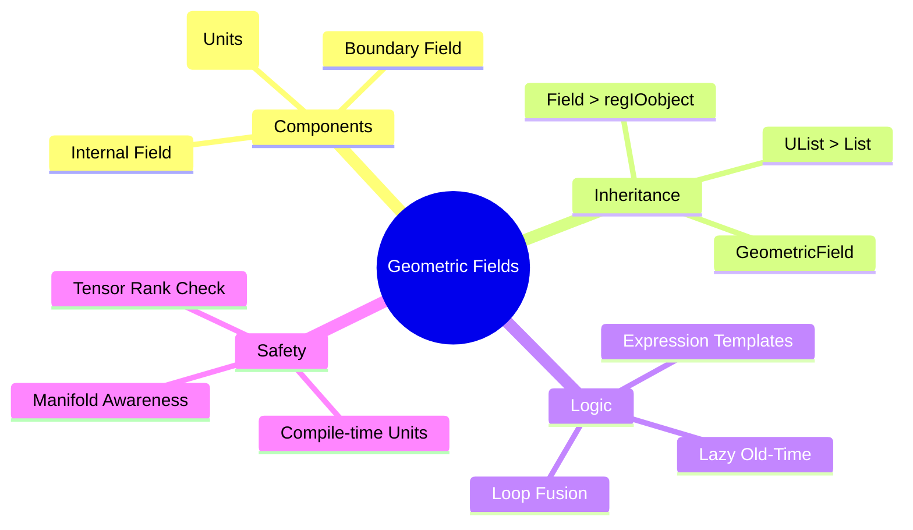

# สรุปและแบบฝึกหัด (Summary & Exercises)


> **Figure 1:** แผนผังความคิดสรุปองค์ประกอบหลักของระบบฟิลด์ใน OpenFOAM ซึ่งแสดงให้เห็นความเชื่อมโยงระหว่างข้อมูลภายใน เงื่อนไขขอบเขต มิติทางฟิสิกส์ และกลไกการเพิ่มประสิทธิภาพหน่วยความจำความปลอดภัยทางฟิสิกส์ไม่ส่งผลกระทบต่อความเร็วในการจำลอง ผ่านการใช้พลังของ C++ Template Metaprogramming ในการตรวจสอบความสอดคล้องทางมิติทั้งหมดที่ขั้นตอนการคอมไพล์โปรแกรมเพียงครั้งเดียว

---

## **หลักการทางสถาปัตยกรรม**

### **1. พหุสัณฑ์แบบเทมเพลต (Template-Based Polymorphism)**

**การใช้งานเดียวสนับสนุนทุกประเภท field** (scalar, vector, tensor) และประเภท mesh (vol, surface, point) การออกแบบแบบ polymorphic นี้ช่วยกำจัดการทำซ้ำของโค้ด ขณะเดียวกันก็รักษาความปลอดภัยของประเภท

```cpp
// การใช้งานเทมเพลตเดียวสำหรับทุกประเภท field
template<class Type, class GeoMesh>
class GeometricField : public Field<Type> {
    // การใช้งานแบบรวมสำหรับ volScalarField, volVectorField, surfaceScalarField, ฯลฯ
};

// Type aliases ที่ใช้งานได้จริง
typedef GeometricField<scalar, fvPatchField, volMesh> volScalarField;
typedef GeometricField<vector, fvPatchField, volMesh> volVectorField;
typedef GeometricField<tensor, fvPatchField, volMesh> volTensorField;
```

ไม่ว่าจะทำงานกับ `volScalarField` (อุณหภูมิ), `volVectorField` (ความเร็ว), หรือ `volTensorField` (ความเค้น) การดำเนินการทางคณิตศาสตร์พื้นฐานจะยังคงสอดคล้องกันและปรับให้เข้ากับประเภท field โดยอัตโนมัติ

> [!INFO] **ข้อดีของ Template-Based Polymorphism**
> - กำจัด code duplication สำหรับแต่ละประเภท field
> - รักษา type safety ผ่าน compile-time checking
> - รองรับการขยายประเภท field ใหม่ๆ โดยไม่ต้องแก้ไข core logic

---

### **2. ความปลอดภัยตามมิติ (Dimensional Safety)**

**การตรวจสอบหน่วยภายในป้องกันการดำเนินการที่ไม่มีความหมายทางฟิสิกส์ในระหว่างการคอมไพล์**

OpenFOAM นำเข้าการวิเคราะห์ตามมิติโดยตรงเข้าสู่ระบบประเภทของตน:

```cpp
// ระบบมิติ: [Mass, Length, Time, Temperature, Moles, Current]
dimensionedScalar rho("rho", dimensionSet(1, -3, 0, 0, 0, 0), 1.2); // kg/m³ [1,-3,0,0,0,0]
dimensionedVector U("U", dimensionSet(0, 1, -1, 0, 0, 0), vector(1, 0, 0)); // m/s [0,1,-1,0,0,0]

// ✅ การดำเนินการที่ถูกต้อง: ความดันไดนามิก
volScalarField p_dynamic = 0.5 * rho * magSqr(U); // [1,-1,-2,0,0,0] = Pa

// ❌ ข้อผิดพลาดการคอมไพล์: ไม่สามารถบวกความดันกับความเร็ว
// auto invalid = p + U; // Error: Cannot add [1,-1,-2,0,0,0] + [0,1,-1,0,0,0]
```

**ตารางมิติของปริมาณทางฟิสิกส์ทั่วไป:**

| ปริมาณ | มิติ | หน่วย SI | สมการตัวอย่าง |
|---------|--------|-----------|------------------|
| ความดัน (Pressure) | `[1,-1,-2,0,0,0]` | Pa = kg/(m·s²) | $p = \rho R T$ |
| ความเร็ว (Velocity) | `[0,1,-1,0,0,0]` | m/s | $\mathbf{u} = d\mathbf{x}/dt$ |
| ความหนาแน่น (Density) | `[1,-3,0,0,0,0]` | kg/m³ | $\rho = m/V$ |
| ความหนืดพลศาสตร์ | `[1,-1,-1,0,0,0]` | Pa·s | $\tau = \mu \dot{\gamma}$ |
| พลังงาน (Energy) | `[1,2,-2,0,0,0]` | J = kg·m²/s² | $E = \frac{1}{2}mv^2$ |

> [!WARNING] **ความสำคัญของ Dimensional Consistency**
> การตรวจสอบมิติใน compile time ป้องกันข้อผิดพลาดทางฟิสิกส์ทั่วไป (การบวกหน่วยที่ไม่เข้ากัน) ก่อนการจำลอง ป้องกันการคำนวณที่ไม่มีความหมายทางฟิสิกส์จากทำงาน

---

### **3. ประสิทธิภาพหน่วยความจำ (Memory Efficiency)**

**การนับรายการอ้างอิง, การจัดสรรแบบล่าช้า, และ expression templates ลดการใช้หน่วยความจำและการจัดสรร**

OpenFOAM ใช้กลยุทธ์การจัดการหน่วยความจำขั้นสูง:

#### **Reference Counting**

Fields แชร์ข้อมูลผ่านกลไก `refCount`:

```cpp
volScalarField T1(mesh); // จัดสรรหน่วยความจำ
volScalarField T2(T1);   // แชร์หน่วยความจำ, ไม่มีการคัดลอก

// T1 และ T2 ชี้ไปยังข้อมูลเดียวกัน
// เมื่อ T2 ถูกแก้ไข: copy-on-write เกิดขึ้น
T2[0] = 300.0; // ตอนนี้ T2 มีข้อมูลส่วนตัว
```

#### **Lazy Evaluation**

Old-time fields จัดสรรเฉพาะเมื่อเข้าถึงเท่านั้น:

```cpp
volScalarField::OldTimeField& Told = T.oldTime(); // จัดสรรเมื่อใช้ครั้งแรก

// หน่วยความจำไม่ถูกจัดสรรจนกว่าเข้าถึงจริง
if (runTime.timeIndex() > 0) {
    const auto& T_previous = T.oldTime(); // การจัดสรรเกิดขึ้นที่นี่
}
```

#### **Expression Templates**

นิพจน์ที่ซับซ้อนประเมินโดยไม่มีตัวแปรชั่วคราว:

```cpp
// ❌ แบบดั้งเดิม: สร้าง 3 temporary fields
volScalarField temp1 = 2.0 * T;        // การจัดสรรชั่วคราว
volScalarField temp2 = rho * U;        // การจัดสรรชั่วคราว
volScalarField temp3 = temp1 + temp2;  // การจัดสรรชั่วคราว

// ✅ OpenFOAM expression templates: ไม่มีตัวแปรชั่วคราว
volScalarField result = 2.0 * T + rho * magSqr(U);  // การประเมินแบบ single-pass
```

**ตารางเปรียบเทียบประสิทธิภาพ:**

| วิธีการ | การจัดสรร | จำนวนรอบข้อมูล | ประสิทธิภาพ |
|----------|------------|-----------------|------------|
| Traditional C++ | 3 fields | 3 passes | ต่ำ |
| OpenFOAM Templates | 1 field | 1 pass | สูง |

---

### **4. การรับรู้ Mesh (Mesh Awareness)**

**Fields รู้ถึงการ discretization ในปริภูมิของตน ทำให้สามารถดำเนินการทางคณิตศาสตร์ที่เหมาะสมโดยอัตโนมัติ**

Fields เข้าใจบริบท mesh โดยธรรมชาติ เลือกการดำเนินการทางคณิตศาสตร์ที่ถูกต้องโดยอัตโนมัติ:

```cpp
volScalarField p(mesh);           // Volume field ที่จุดศูนย์กลางเซลล์
surfaceScalarField phi(mesh);     // Surface field ที่จุดศูนย์กลางหน้า

// การคำนวณ gradient อัตโนมัติโดยใช้ทฤษฎีบทของ Gauss
volVectorField gradP = fvc::grad(p);

// สมการพื้นฐาน:
// ∫_V ∇p dV = ∮_∂V p dS
// ∇p|_P = (1/V_P) Σ_f p_f S_f
```

**ประเภท Field ตามตำแหน่งเชิงพื้นที่:**

| ประเภท Field | ตำแหน่ง | การใช้งาน | ตัวอย่าง |
|--------------|----------|------------|-----------|
| `volScalarField` | จุดศูนย์กลางเซลล์ | ปริมาณที่อนุรักษ์ | Pressure, Temperature |
| `surfaceScalarField` | จุดศูนย์กลางหน้า | Flux calculations | Mass flux, Heat flux |
| `pointScalarField` | จุดยอด | Interpolation | Mesh motion values |

---

### **5. การผสานรวมเงื่อนไขขอบเขต (Boundary Condition Integration)**

**การปฏิบัติที่สม่ำเสมอของค่าภายในและค่าขอบเขตกับ patch fields แบบ polymorphic**

OpenFOAM ปฏิบัติต่อขอบเขตและภายในอย่างสม่ำเสมอผ่าน patch fields แบบ polymorphic:

```cpp
// เงื่อนไขขอบเขตจัดการโดยอัตโนมัติ
volScalarField T
(
    IOobject("T", runTime.timeName(), mesh, IOobject::MUST_READ),
    mesh
);

// ค่าขอบเขตอัปเดตโดยอัตโนมัติ
T.correctBoundaryConditions();
```

**ประเภทเงื่อนไขขอบเขตทางคณิตศาสตร์:**

| เงื่อนไขขอบเขต | นิพจน์ทางคณิตศาสตร์ | คำอธิบาย | การใช้งาน |
|----------------|----------------------|--------------|-------------|
| **Dirichlet** | $\phi|_{\partial\Omega} = \phi_0$ | ค่าคงที่ที่ขอบเขต | Inlet temperature |
| **Neumann** | $\mathbf{n} \cdot \nabla \phi|_{\partial\Omega} = q_0$ | การไหลคงที่ที่ขอบเขต | Wall heat flux |
| **Robin** | $\alpha \phi|_{\partial\Omega} + \beta \mathbf{n} \cdot \nabla \phi|_{\partial\Omega} = \gamma$ | เงื่อนไขผสม | Convective boundaries |

---

### **6. การจัดการเวลา (Time Management)**

**การจัดเก็บ old-time field อัตโนมัติพร้อมการจัดสรรตามความต้องการ**

การ discretization ตามเวลาผสานรวมเข้ากับสถาปัตยกรรม field อย่างราบรื่น:

```cpp
// การจัดเก็บระดับเวลาก่อนหน้าอัตโนมัติ
volScalarField T(mesh);
dimensionedScalar dt(runTime.deltaT());

// Backward Euler discretization พร้อมการเข้าถึง old-time อัตโนมัติ
fvScalarMatrix TEqn
(
    fvm::ddt(T) == fvm::laplacian(kappa, T)
);

// สมการ: ∂T/∂t = κ∇²T
// Discretization: (T^(n+1) - T^n)/Δt = κ∇²T^(n+1)
```

**Temporal Discretization Schemes:**

| Scheme | สมการ | ความแม่นยำ | เสถียรภาพ |
|--------|---------|-------------|-------------|
| Euler Explicit | $(\phi^{n+1} - \phi^n)/\Delta t$ | 1st order | Conditional |
| Euler Implicit | $(\phi^{n+1} - \phi^n)/\Delta t$ | 1st order | Unconditional |
| Crank-Nicolson | $(3\phi^{n+1} - 4\phi^n + \phi^{n-1})/(2\Delta t)$ | 2nd order | Unconditional |

---

## **เครือข่ายการสืบทอดฉบับสมบูรณ์**

```
                            UList<Type> (STL-like interface)
                                    ↑
                            List<Type> (Memory-managed container)
                                    ↑
tmp<Field<Type>>::refCount  ←  Field<Type> (Mathematical operations + reference counting)
                                    ↑
                            regIOobject (I/O capabilities)
                                    ↑
                    DimensionedField<Type, GeoMesh> (Physical units + mesh)
                                    ↑
            GeometricField<Type, PatchField, GeoMesh> (Boundary conditions + time)
                                    ↑
        ┌─────────────────┬──────────────────┬──────────────────┐
        │                 │                  │                  │
volScalarField   volVectorField   surfaceScalarField   pointScalarField
(cell-centered)  (cell-centered)  (face-centered)      (vertex-centered)
```

### **การวิเคราะห์โครงสร้างหน่วยความจำ**

```cpp
// 🔍 สิ่งที่มีอยู่จริงในหน่วยความจำสำหรับ volScalarField:
class volScalarField_MemoryLayout {
    // จาก List<scalar>:
    scalar* v_;           // → Heap: [p0, p1, p2, ..., pN] (ความดันในเซลล์)
    label size_;          // จำนวนเซลล์ = mesh.nCells()
    label capacity_;      // ความจุที่จองไว้ (≥ size_)

    // จาก DimensionedField<scalar, volMesh>:
    dimensionSet dimensions_;  // [1,-1,-2,0,0,0] (Pa = kg/(m·s²))
    const volMesh& mesh_;      // Reference ไปยัง mesh object

    // จาก GeometricField<scalar, fvPatchField, volMesh>:
    label timeIndex_;          // Current time index
    volScalarField* field0Ptr_; // → Heap: Old-time field (หรือ nullptr)
    Boundary boundaryField_;   // → Heap: Array ของ fvPatchField objects
};
```

---

## **แบบฝึกหัด (Exercises)**

### **ส่วนที่ 1: ความเข้าใจพื้นฐาน**

**คำถาม 1:** จงอธิบายความแตกต่างระหว่าง `DimensionedField` และ `GeometricField` (ใบ้: ส่วนประกอบใดที่หายไป?)

**คำตอบ:**
- `DimensionedField`: มีค่าภายใน (internal field), หน่วยมิติ (dimensions), และการอ้างอิงถึง mesh
- `GeometricField`: เพิ่มเงื่อนไขขอบเขต (boundary conditions) และการจัดการเวลา (time management)
- **ส่วนประกอบที่หายไปจาก DimensionedField**: Boundary Field และ Old-time field storage

---

**คำถาม 2:** ทำไม OpenFOAM ถึงเลือกใช้การจัดวางหน่วยความจำแบบ SoA (Structure of Arrays) แทนที่จะเป็นอาร์เรย์ของออบเจกต์เวกเตอร์?

**คำตอบ:**
- **SoA (Structure of Arrays)**: เก็บส่วนประกอบทั้งหมดของเวกเตอร์ไว้ด้วยกันในหน่วยความจำต่อเนื่อง
  ```cpp
  // SoA Layout
  scalar* Ux; // [Ux_0, Ux_1, Ux_2, ..., Ux_N]
  scalar* Uy; // [Uy_0, Uy_1, Uy_2, ..., Uy_N]
  scalar* Uz; // [Uz_0, Uz_1, Uz_2, ..., Uz_N]
  ```
- **ข้อดี**:
  - CPU สามารถประมวลผลแบบ SIMD (Single Instruction, Multiple Data) ได้รวดเร็วขึ้น
  - Cache performance ดีขึ้นเนื่องจากการเข้าถึงหน่วยความจำแบบต่อเนื่อง
  - ลด cache miss ในการดำเนินการทางคณิตศาสตร์เวกเตอร์

---

**คำถาม 3:** เมธอด `correctBoundaryConditions()` มีหน้าที่สำคัญอย่างไรในวงจรชีวิตของฟิลด์?

**คำตอบ:**
- **หน้าที่**: อัปเดตค่าขอบเขตให้สอดคล้องกับค่าภายในปัจจุบัน
- **ความสำคัญ**:
  - หลังจากแก้สมการ (solve) ค่าภายในเปลี่ยน แต่ค่าขอบยังไม่อัปเดต
  - การคำนวณ flux ใช้ค่าขอบ ดังนั้นต้องอัปเดตก่อนคำนวณ flux
  - รับประกันความสอดคล้องระหว่างค่าภายในและค่าขอบ
- **ตัวอย่าง**:
  ```cpp
  UEqn.solve();                    // อัปเดตค่าภายใน
  U.correctBoundaryConditions();  // อัปเดตค่าขอบ (สำคัญ!)
  phi = fvc::interpolate(U) & mesh.Sf(); // ใช้ค่าขอบที่อัปเดตแล้ว
  ```

---

### **ส่วนที่ 2: การวิเคราะห์โค้ด**

**คำถาม:** พิจารณาโค้ดต่อไปนี้:

```cpp
volScalarField T = ...; // อุณหภูมิ [K] -> [0,0,0,1,0,0]
volVectorField U = ...; // ความเร็ว [m/s] -> [0,1,-1,0,0,0]
auto result = fvc::grad(T) + U; // (X)
```

**คำถาม**: บรรทัด (X) ถูกต้องตามหลักฟิสิกส์และคณิตศาสตร์หรือไม่? และหน่วยของ `result` จะเป็นอะไร?

**คำตอบ:**

**การวิเคราะห์ทางคณิตศาสตร์:**

1. **`fvc::grad(T)`**:
   - $T$ เป็น scalar field (อุณหภูมิ)
   - Gradient ของ scalar คือ vector: $\nabla T$
   - หน่วย: $[T]/[L] = [0,0,0,1,0,0] - [0,1,0,0,0,0] = [0,-1,0,1,0,0]$ (K/m)

2. **`U`**:
   - เป็น vector field (ความเร็ว)
   - หน่วย: $[0,1,-1,0,0,0]$ (m/s)

3. **การบวก (`grad(T) + U`)**:
   - ❌ **ไม่ถูกต้อง**: ไม่สามารถบวก K/m กับ m/s ได้
   - หน่วยไม่สอดคล้องกัน: $[0,-1,0,1,0,0] \neq [0,1,-1,0,0,0]$

**ข้อผิดพลาดการคอมไพล์:**
```cpp
// Error: Cannot add fields with different dimensions
// [0,-1,0,1,0,0] + [0,1,-1,0,0,0]
```

**วิธีแก้ไขที่เป็นไปได้:**

1. **ถ้าต้องการหน่วยความเร็ว (m/s)**:
   ```cpp
   // ใช้ thermal diffusivity: α [m²/s]
   volScalarField alpha(...); // [0,2,-1,0,0,0]
   auto result = alpha * fvc::grad(T) + U; // [0,1,-1,0,0,0] ✓
   ```

2. **ถ้าต้องการ gradient ของ T เท่านั้น**:
   ```cpp
   auto gradT = fvc::grad(T); // K/m
   // ไม่บวกกับ U
   ```

---

### **ส่วนที่ 3: การประยุกต์ใช้งาน (Scenario)**

**สถานการณ์:** คุณต้องการสร้างฟิลด์ใหม่ชื่อ `phi_custom` เพื่อเก็บผลลัพธ์ของ `fvc::div(U)` โดยที่ต้องการให้เขียนลงดิสก์โดยอัตโนมัติทุกๆ ครั้งที่เซฟผลลัพธ์

**คำถาม:**
1. คุณควรใช้ `IOobject::MUST_READ` หรือ `IOobject::NO_READ`?
2. คุณควรใช้ `IOobject::AUTO_WRITE` หรือ `IOobject::NO_WRITE`?

**คำตอบ:**

**การวิเคราะห์:**

1. **`IOobject::MUST_READ` vs `IOobject::NO_READ`**:
   - `MUST_READ`: ต้องมีไฟล์ข้อมูลเริ่มต้น (เช่น `0/phi_custom`)
   - `NO_READ`: ไม่ต้องอ่านจากไฟล์, สร้างค่าเริ่มต้นด้วยโปรแกรม
   - **เลือก `NO_READ`**: เพราะเราคำนวณ `fvc::div(U)` ไม่ได้อ่านจากไฟล์

2. **`IOobject::AUTO_WRITE` vs `IOobject::NO_WRITE`**:
   - `AUTO_WRITE`: เขียนลงดิสก์อัตโนมัติทุกครั้งที่ `runTime.write()` ถูกเรียก
   - `NO_WRITE`: ไม่เขียนอัตโนมัติ (ต้องเรียก `.write()` ด้วยตนเอง)
   - **เลือก `AUTO_WRITE`**: เพราะต้องการเขียนลงดิสก์อัตโนมัติ

**โค้ดที่ถูกต้อง:**

```cpp
// สร้างฟิลด์ใหม่สำหรับเก็บ divergence ของความเร็ว
volScalarField phi_custom
(
    IOobject
    (
        "phi_custom",              // ชื่อฟิลด์
        runTime.timeName(),        // ไดเรกทอรีเวลา
        mesh,                      // Mesh reference
        IOobject::NO_READ,         // ✓ ไม่อ่านจากไฟล์
        IOobject::AUTO_WRITE       // ✓ เขียนอัตโนมัติ
    ),
    mesh,
    dimensionedScalar
    (
        "phi_custom",
        dimensionSet(0, 0, -1, 0, 0, 0), // 1/s ([0,0,-1,0,0,0])
        0.0                               // ค่าเริ่มต้น
    )
);

// คำนวณ divergence
phi_custom = fvc::div(U);

// จะถูกเขียนอัตโนมัติเมื่อ:
runTime.write(); // เขียน phi_custom ลงดิสก์
```

---

### **ส่วนที่ 4: การวิเคราะห์สมการ (Advanced)**

**คำถาม:** จงเขียนโค้ด OpenFOAM สำหรับสมการการแพร่ความร้อนต่อไปนี้:

$$\frac{\partial T}{\partial t} + \mathbf{u} \cdot \nabla T = \alpha \nabla^2 T + Q$$

โดยที่:
- $T$ = อุณหภูมิ [K]
- $\mathbf{u}$ = ความเร็ว [m/s]
- $\alpha$ = ค่าสัมประสิทธิ์การแพร่ความร้อน [m²/s]
- $Q$ = แหล่งความร้อน [K/s]

**คำตอบ:**

```cpp
// สมการ: ∂T/∂t + u·∇T = α∇²T + Q

// 1. กำหนดฟิลด์
volScalarField T
(
    IOobject("T", runTime.timeName(), mesh, IOobject::MUST_READ, IOobject::AUTO_WRITE),
    mesh
);

volVectorField U
(
    IOobject("U", runTime.timeName(), mesh, IOobject::MUST_READ, IOobject::AUTO_WRITE),
    mesh
);

dimensionedScalar alpha("alpha", dimArea/dimTime, 1e-5); // m²/s
volScalarField Q
(
    IOobject("Q", runTime.timeName(), mesh, IOobject::MUST_READ, IOobject::AUTO_WRITE),
    mesh
);

// 2. สร้างสมการ (Implicit treatment)
fvScalarMatrix TEqn
(
    // ∂T/∂t: เทอมเวลา (implicit)
    fvm::ddt(T)

    // + u·∇T: เทอม convection (implicit)
  + fvm::div(phi, T)

    // - α∇²T: เทอมการแพร่ (implicit)
  - fvm::laplacian(alpha, T)

    // == Q: เทอมแหล่ง (explicit)
 ==
    Q
);

// 3. แก้สมการ
TEqn.solve();

// 4. อัปเดตเงื่อนไขขอบเขต
T.correctBoundaryConditions();
```

**คำอธิบายเพิ่มเติม:**

| เทอม | OpenFOAM | Discretization | หมายเหตุ |
|-----|----------|----------------|----------|
| $\frac{\partial T}{\partial t}$ | `fvm::ddt(T)` | Euler Implicit/Backward/Crank-Nicolson | Implicit = เสถียรกว่า |
| $\mathbf{u} \cdot \nabla T$ | `fvm::div(phi, T)` | Upwind/Central/QUICK | `phi = U·Sf` (face flux) |
| $\alpha \nabla^2 T$ | `fvm::laplacian(alpha, T)` | Gauss linear/corrected | Implicit = แก้ได้เร็วขึ้น |
| $Q$ | `Q` | - | Explicit (ค่าที่รู้แล้ว) |

---

## 💡 **แนวทางการพัฒนาที่ดีปฏิบัติ**

### **1. ใช้ Type Aliases**

ชอบ type aliases ที่อ่านง่ายมากกว่า template syntax:

```cpp
// ✅ ที่ชื่นชอบ: ชัดเจนและบำรุงรักษาง่าย
volScalarField p(mesh);
surfaceVectorField Uf(mesh);

// ❌ หลีกเลี่ยง: การสร้างเทมเพลตที่ละเอียด
GeometricField<scalar, fvPatchField, volMesh> p(mesh);
GeometricField<vector, fvsPatchField, surfaceMesh> Uf(mesh);
```

---

### **2. เคารพการวิเคราะห์ตามมิติ**

**ใช้ `dimensioned` types เสมอสำหรับปริมาณทางฟิสิกส์**

```cpp
// ✅ ถูกต้อง: ปริมาณทางฟิสิกส์พร้อมหน่วย
dimensionedScalar rho
(
    "rho",
    dimensionSet(1, -3, 0, 0, 0, 0),  // M¹L⁻³
    1.225                             // kg/m³
);

// ✅ การดำเนินการที่ถูกต้อง: แรงลอยตัวพร้อมมิติที่เหมาะสม
dimensionedVector g("g", dimensionSet(0, 1, -2, 0, 0, 0), vector(0, 0, -9.81));
dimensionedVector buoyancy = rho * g; // [1,-2,-2,0,0,0] (แรง/ปริมาตร)
```

---

### **3. อัปเดตเงื่อนไขขอบเขต**

**เรียก `correctBoundaryConditions()` หลังจากการแก้ไข field**

```cpp
// แก้ไขค่า field ภายใน
forAll(T, cellI) {
    T[cellI] = T[cellI] + source[cellI] * dt;
}

// ✅ สำคัญมาก: อัปเดตเงื่อนไขขอบเขต
T.correctBoundaryConditions();

// ตอนนี้ field สอดคล้องกันภายใน
volVectorField gradT = fvc::grad(T); // ใช้ค่าขอบเขตที่อัปเดตแล้ว
```

---

### **4. เข้าใจการนับรายการอ้างอิง**

**รู้ว่าเมื่อใดที่ fields แชร์ข้อมูลกับเมื่อใดที่คัดลอก**

```cpp
volScalarField T1(mesh);
volScalarField T2(T1);        // T2 แชร์ข้อมูลกับ T1 (reference count = 2)

T2[cellI] = 293.15;          // หยุดการแชร์: T2 ได้รับสำเนาส่วนตัว

volScalarField T3 = T1;       // T3 แชร์ข้อมูลกับ T1 (reference count = 2)
T1 = 2.0 * T3;               // สร้าง field ใหม่, หยุดการแชร์
```

---

### **5. ใช้ประโยชน์จาก Expression Templates**

**เขียนนิพจน์ทางคณิตศาสตร์ตามธรรมชาติ; คอมไพเลอร์จะปรับให้เหมาะสม**

```cpp
// ✅ นิพจน์ทางคณิตศาสตร์ตามธรรมชาติ
volScalarField source = rho * U & gradT + kappa * fvc::laplacian(T);

// คอมไพเลอร์ปรับให้เหมาะสมโดยอัตโนมัติเป็นการประเมินแบบ single-pass
// ไม่ต้องแยกเป็นตัวแปรชั่วคราวด้วยตนเอง
```

---

### **6. ทำตามรูปแบบ RAII**

**ปล่อยให้ destructors จัดการการทำความสะอาด; หลีกเลี่ยงการจัดการหน่วยความจำด้วยตนเอง**

```cpp
// ✅ การจัดการทรัพยากรอัตโนมัติ
{
    volScalarField T
    (
        IOobject("T", runTime.timeName(), mesh, IOobject::MUST_READ),
        mesh
    );

    // ใช้ T จัดการหน่วยความจำโดยอัตโนมัติ
    // Destructor เรียกโดยอัตโนมัติเมื่อสิ้นสุดขอบเขต
} // T และทรัพยากรทั้งหมดถูกทำความสะอาดที่นี่

// ไม่ต้องการการลบหรือการจัดการหน่วยความจำด้วยตนเอง
```

---

## **สูตรคณิตศาสตร์สำคัญ**

### **การดำเนินการเชิงปริพันธ์ใน Finite Volume Method**

#### **1. Gradient Operator**

$$\nabla \phi \bigg|_P = \frac{1}{V_P} \sum_{f} \phi_f \mathbf{S}_f$$

**OpenFOAM Implementation:**
```cpp
volVectorField gradP = fvc::grad(p);
```

---

#### **2. Divergence Operator**

$$\nabla \cdot \mathbf{U} \bigg|_P = \frac{1}{V_P} \sum_{f} \mathbf{U}_f \cdot \mathbf{S}_f$$

**OpenFOAM Implementation:**
```cpp
volScalarField divU = fvc::div(U);
```

---

#### **3. Laplacian Operator**

$$\nabla \cdot (\Gamma \nabla \phi) \bigg|_P = \sum_{f} \Gamma_f \frac{\phi_N - \phi_P}{d_{PN}} \frac{S_f}{d_{PN}}$$

**OpenFOAM Implementation:**
```cpp
volScalarField lapPhi = fvc::laplacian(Gamma, phi);
```

---

#### **4. Temporal Derivative**

$$\frac{\partial \phi}{\partial t} \approx \frac{\phi^{n+1} - \phi^n}{\Delta t}$$

**OpenFOAM Implementation:**
```cpp
// Implicit
fvScalarMatrix TEqn = fvm::ddt(T);

// Explicit
volScalarField dTdt = fvc::ddt(T);
```

---

### **กฎการอนุรักษ์**

**สมการการขนส่งทั่วไป:**

$$\frac{\partial}{\partial t} \int_{V} \rho \phi \, dV + \oint_{\partial V} \rho \phi \mathbf{U} \cdot d\mathbf{S} = \oint_{\partial V} \Gamma \nabla \phi \cdot d\mathbf{S} + \int_{V} S_\phi \, dV$$

**การตีความทางฟิสิกส์:**
- **เทอมการสะสม**: $\frac{\partial}{\partial t} \int_{V} \rho \phi \, dV$ (อัตราการเปลี่ยนแปลง)
- **เทอม convection**: $\oint_{\partial V} \rho \phi \mathbf{U} \cdot d\mathbf{S}$ (การขนส่งโดยการไหล)
- **เทอมการแพร่**: $\oint_{\partial V} \Gamma \nabla \phi \cdot d\mathbf{S}$ (การขนส่งโมเลกุล)
- **เทอมแหล่ง**: $\int_{V} S_\phi \, dV$ (การสร้าง/การทำลาย)

**OpenFOAM Implementation:**
```cpp
fvScalarMatrix phiEqn
(
    fvm::ddt(rho, phi)           // เทอมการสะสม
  + fvm::div(phi, rho, phi)      // เทอม convection
  - fvm::laplacian(Gamma, phi)   // เทอมการแพร่
 ==
    S                            // เทอมแหล่ง
);
```

---

## **แนวทางการแก้จุดบกพร่อง**

### **ตรวจสอบ Dimensional Consistency**

```cpp
// ✅ ตรวจสอบมิติก่อนการคำนวณ
void checkDimensions(const GeometricField<scalar, fvPatchField, volMesh>& field) {
    Info << "Field: " << field.name() << endl;
    Info << "Dimensions: " << field.dimensions() << endl;

    // ตรวจสอบค่าขอบเขต
    forAll(field.boundaryField(), patchi) {
        const fvPatchScalarField& patch = field.boundaryField()[patchi];
        Info << "  Patch " << patchi << ": " << patch.name() << endl;
    }
}
```

---

### **ตรวจสอบ Boundary Condition Consistency**

```cpp
// ✅ ตรวจสอบความสอดคล้องของขอบเขต
void validateBoundaryConsistency(const volScalarField& field) {
    scalar maxInternal = max(field).value();

    forAll(field.boundaryField(), patchi) {
        const fvPatchScalarField& patch = field.boundaryField()[patchi];
        scalar maxPatch = max(patch).value();

        if (mag(maxPatch - maxInternal) > 10.0) {
            WarningIn("validateBoundaryConsistency")
                << "Patch " << patch.name() << " has very different values from internal field"
                << endl;
        }
    }
}
```

---

### **ตรวจสอบ Field Validity**

```cpp
// ✅ ตรวจสอบความถูกต้องของฟิลด์
void validateField(const volScalarField& field) {
    // ตรวจสอบ NaN
    if (hasNaN(field)) {
        FatalErrorIn("validateField")
            << "Field " << field.name() << " contains NaN values"
            << abort(FatalError);
    }

    // ตรวจสอบ Inf
    if (hasInf(field)) {
        FatalErrorIn("validateField")
            << "Field " << field.name() << " contains Inf values"
            << abort(FatalError);
    }

    // ตรวจสอบค่าลบสำหรับบางฟิลด์
    if (field.name() == "T" && min(field).value() < 0) {
        WarningIn("validateField")
            << "Temperature field has negative values"
            << endl;
    }
}
```

---

## **สรุป**

ระบบ field ของ OpenFOAM เป็นตัวแทนของ ==ความสมดุลที่ลึกซึ้ง== ระหว่าง:

1. **ความปลอดภัยทางคณิตศาสตร์** → Dimensional analysis และ type checking
2. **ประสิทธิภาพการคำนวณ** → Expression templates และ reference counting
3. **ความถูกต้องทางฟิสิกส์** → Mesh awareness และ conservation laws
4. **ความยืดหยุ่น** → Template-based polymorphism

สถาปัตยกรรมนี้ทำให้นักพัฒนาสามารถ:
- ✅ เขียน CFD code ที่อ่านง่ายเหมือนกับ governing equations
- ✅ ได้รับการตรวจสอบความถูกต้องใน compile-time
- ✅ บรรลุประสิทธิภาพสูงสุดด้วย zero-cost abstractions
- ✅ ขยายขนาดจาก desktop ไปจนถึง supercomputing ได้อย่างราบรื่น

> [!TIP] **แนวทางการเรียนรู้**
> - เริ่มต้นด้วยการเข้าใจ inheritance hierarchy
> - ฝึกใช้ dimensional analysis ในโค้ดของคุณเสมอ
> - ใช้ correctBoundaryConditions() อย่างเป็นระบบ
> - เรียนรู้ expression templates เพื่อประสิทธิภาพสูงสุด

---

**[← กลับไปหน้าก่อนหน้า](06_Common_Pitfalls.md) | [หน้าถัดไป →](15_Next_Steps.md)**
