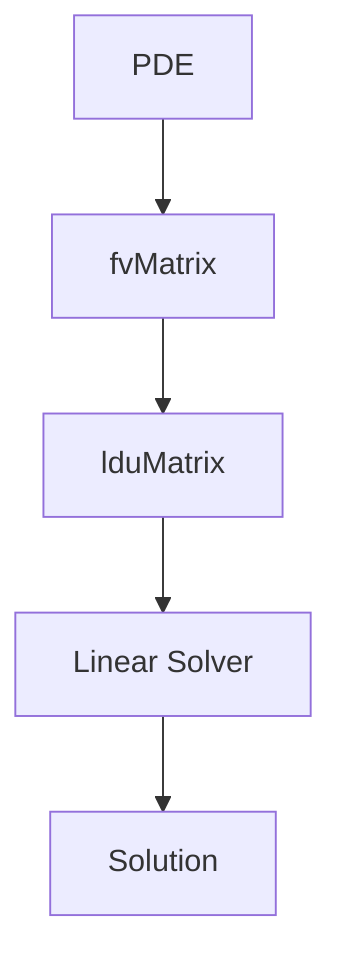

# Matrices & Linear Algebra - Overview

ภาพรวม Matrices และ Linear Algebra — หัวใจของ CFD Solver

> **ทำไม Linear Algebra สำคัญที่สุด?**
> - **ทุก PDE กลายเป็น Ax = b** ที่ต้องแก้
> - 90% ของ compute time อยู่ใน linear solver
> - เลือก solver/preconditioner ผิด = ช้า หรือ diverge

---

## Overview

> **💡 CFD = แก้ linear systems ซ้ำๆ**
>
> PDE → Discretize (fvm::) → fvMatrix → lduMatrix → Solver → Solution

<!-- IMAGE: IMG_05_005 -->
<!-- 
Purpose: เพื่ออธิบายว่า OpenFOAM ไม่ได้เก็บ Matrix แบบเต็ม (Full Dense Matrix) แต่เก็บเฉพาะส่วนที่มีค่าจริงแบบ "LDU Addressing" (Lower - Diagonal - Upper). ภาพนี้ต้องเชื่อมโยงจาก Topology ของ Mesh (Cell P ต่อกับ Neighbors) ไปสู่โครงสร้าง Matrix ที่ Sparse มากๆ
Prompt: "Data Structure Diagram of LDU Matrix Storage. **Components:** 1. A small 5x5 Matrix grid with only diagonal and a few off-diagonal cells filled (others blank). 2. Three 1D Arrays labeled 'Diagonal', 'Lower', 'Upper'. 3. Arrows connecting the non-zero matrix cells to their corresponding slots in the arrays. **Labeling:** Show that 'Lower' stores lower-triangle neighbors, 'Upper' stores upper-triangle neighbors. **Style:** Computer Science infographic, flat 2D, white background, distinct array blocks."
-->
![[IMG_05_005.jpg]]



---

## 1. Core Classes

| Class | Purpose |
|-------|---------|
| `lduMatrix` | Sparse matrix storage |
| `fvMatrix` | Discretized equations |
| `fvScalarMatrix` | Scalar equations |
| `fvVectorMatrix` | Vector equations |

---

## 2. Matrix Assembly

```cpp
fvScalarMatrix TEqn
(
    fvm::ddt(T)
  + fvm::div(phi, T)
  ==
    fvm::laplacian(alpha, T)
  + source
);
```

---

## 3. Matrix Operations

```cpp
// Solve
TEqn.solve();

// Relaxation
TEqn.relax();

// Access components
const scalarField& diag = TEqn.diag();
const scalarField& source = TEqn.source();
```

---

## 4. Linear Solvers

| Solver | Best For |
|--------|----------|
| `PCG` | Symmetric (pressure) |
| `PBiCGStab` | Non-symmetric (velocity) |
| `GAMG` | Large problems |
| `smoothSolver` | Simple cases |

---

## 5. Configuration

```cpp
// system/fvSolution
solvers
{
    p
    {
        solver      PCG;
        preconditioner DIC;
        tolerance   1e-6;
        relTol      0.01;
    }
    U
    {
        solver      PBiCGStab;
        preconditioner DILU;
        tolerance   1e-6;
        relTol      0.1;
    }
}
```

---

## 6. Module Contents

| File | Topic |
|------|-------|
| 01_Introduction | Basics |
| 02_Dense_vs_Sparse | Matrix types |
| 03_fvMatrix | Architecture |
| 04_Linear_Solvers | Solver hierarchy |
| 05_Parallel | Parallel LA |
| 06_Pitfalls | Common errors |
| 07_Summary | Exercises |

---

## Quick Reference

| Task | Method |
|------|--------|
| Create equation | `fvScalarMatrix TEqn(...)` |
| Solve | `TEqn.solve()` |
| Relax | `TEqn.relax()` |
| Get diagonal | `TEqn.diag()` |
| Get source | `TEqn.source()` |
| Get residual | `solve().initialResidual()` |

---

## 🧠 Concept Check

<details>
<summary><b>1. lduMatrix คืออะไร?</b></summary>

**Lower-Diagonal-Upper** — sparse storage สำหรับ FV matrix
</details>

<details>
<summary><b>2. PCG vs PBiCGStab?</b></summary>

- **PCG**: Symmetric matrices (pressure)
- **PBiCGStab**: Non-symmetric (velocity)
</details>

<details>
<summary><b>3. GAMG ดีอย่างไร?</b></summary>

**O(N) complexity** — เร็วสำหรับ large problems
</details>

---

## 📖 เอกสารที่เกี่ยวข้อง

- **Introduction:** [01_Introduction.md](01_Introduction.md)
- **Linear Solvers:** [04_Linear_Solvers_Hierarchy.md](04_Linear_Solvers_Hierarchy.md)