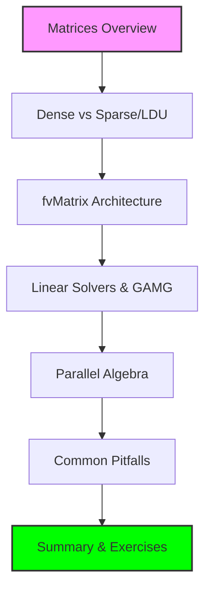

# โมดูล 05.06: เมทริกซ์และพีชคณิตเชิงเส้น (Matrices & Linear Algebra)

> **พื้นฐานคณิตศาสตร์ของการคำนวณ CFD ระดับอุตสาหกรรม**

ในบทนี้ เราจะศึกษาเบื้องหลังของขั้นตอนที่ใช้ทรัพยากรคำนวณมากที่สุดใน CFD นั่นคือการสร้างและแก้ระบบสมการเชิงเส้นขนาดใหญ่ ($Ax=b$) โดยใช้สถาปัตยกรรมเมทริกซ์ที่ปรับแต่งมาเพื่อเมชแบบ Unstructured



![[of_matrix_algebra_architecture.png]]
`A high-level architectural diagram of OpenFOAM's linear algebra system, showing the transition from Govering Equations to Matrix Assembly (LDU) and final Parallel Solving, scientific textbook diagram, clean vector line art, white background, high definition, flat design, educational infographic --ar 16:9`

---

## 📚 วัตถุประสงค์การเรียนรู้

หลังจากจบบทนี้ คุณจะสามารถ:

- ✅ **เข้าใจรูปแบบการจัดเก็บเมทริกซ์แบบ LDU** (Lower Diagonal Upper) และความสำคัญต่อประสิทธิภาพ Cache
- ✅ **วิเคราะห์โครงสร้างของ `fvMatrix`** และการเชื่อมโยงกับฟิลด์
- ✅ **เลือกตัวแก้ปัญหา (Solver)** และตัวช่วยปรับสภาพ (Preconditioner) ให้เหมาะสมกับฟิสิกส์ของงาน
- ✅ **เข้าใจกลไกการทำงานของ Multigrid (GAMG)** ในเบื้องต้น
- ✅ **แก้ไขปัญหาเมทริกซ์ไม่ลู่เข้า (Divergence)** ในระดับโปรแกรมมิ่ง

---

## 🏗️ สถาปัตยกรรม LDU Matrix

ระบบพีชคณิตเชิงเส้นของ OpenFOAM มีศูนย์กลางอยู่ที่คลาส **`LduMatrix`** (Lower Diagonal Upper Matrix) ซึ่งให้การเป็นตัวแทนของเมทริกซ์แบบเบาบางที่ใช้หน่วยความจำอย่างมีประสิทธิภาพ

### ส่วนประกอบหลักของ LDU Matrix

**สัมประสิทธิ์เส้นทแยง (`diag_`)**: แทนอิทธิพลของเซลล์ต่อตัวเอง

**สัมประสิทธิ์นอกเส้นทแยง (`upper_` และ `lower_`)**: แทนการ coupling ระหว่างเซลล์ข้างเคียง

![[ldu_matrix_structure_concept.png]]
`A visualization of the LDU matrix structure: a central Diagonal, with Lower and Upper triangles representing neighbor cell connections across mesh faces, scientific textbook diagram, clean vector line art, white background, high definition, flat design, educational infographic --ar 16:9`

### โครงสร้างคลาส LduMatrix

```cpp
template<class Type, class DType, class LUType>
class LduMatrix
    :
    public refCount
{
    // Field references
    const lduAddressing& lduAddr_;
    const lduInterfaceFieldPtrsList& interfaces_;

    // Matrix coefficients
    Field<DType> diag_;
    Field<LUType> upper_;
    Field<LUType> lower_;

    // Source term
    Field<Type> source_;
};
```

### การเชื่อมต่อระหว่างเซลล์

สำหรับการ discretization แบบปริมาตรจำกัด สัมประสิทธิ์ off-diagonal ถูกคำนวณจาก:

$$a_{P,F} = -\mu_F \frac{S_F}{\delta_{PF}}$$

**นิยามตัวแปร:**
- $\mu_F$ = ค่าสภาพการ diffusive ที่พื้นผิว $F$
- $S_F$ = พื้นที่พื้นผิว
- $\delta_{PF}$ = ระยะห่างระหว่างจุดศูนย์กลางเซลล์ $P$ และ $F$

> [!TIP] **LduMatrix vs Dense Matrix**
> LduMatrix เก็บเฉพาะ non-zero entries ซึ่งช่วยลดหน่วยความจำจาก $\mathcal{O}(n^2)$ เหลือเพียง $\mathcal{O}(n)$ สำหรับเมทริกซ์แบบเบาบางที่เกิดจาก finite volume discretization

---

## 🔍 หัวข้อหลักในบทนี้

### 1. บทนำ (Introduction)
ทำไมระบบสมการเชิงเส้นถึงเป็นหัวใจของโซลเวอร์ CFD

### 2. เมทริกซ์หนาแน่น vs เมทริกซ์เบาบาง (Dense vs Sparse Matrices)
การจัดเก็บข้อมูลแบบ LDU เพื่อประสิทธิภาพสูงสุด

**การเปรียบเทียบ:**

| ลักษณะเฉพาะ | Dense Matrices | Sparse Matrices (LDU) |
|---|---|---|
| **การใช้หน่วยความจำ** | $\mathcal{O}(n^2)$ เสมอ | $\mathcal{O}(\text{nnz})$ โดยที่ $\text{nnz}$ = จำนวนค่าที่ไม่เป็นศูนย์ |
| **รูปแบบการเข้าถึง** | โดยตรง $\mathcal{O}(1)$ | ทางอ้อม $\mathcal{O}(\log n)$ หรือ $\mathcal{O}(1)$ พร้อมดัชนี |
| **เหมาะสำหรับ** | ระบบขนาดเล็กที่มีความหนาแน่น ($n < 100$) | ระบบขนาดใหญ่ที่มีความหนาแน่นต่ำ ($n > 1000$, $\text{nnz} \ll n^2$) |
| **การดำเนินการ** | ปรับให้เหมาะกับ BLAS | อัลกอริทึมแบบกระจัดกระจายเฉพาะทาง |

> [!INFO] **Social Network Analogy**
> จินตนาการถึงเครือข่ายสังคมที่มีคนล้านคนโดยที่แต่ละคนมีปฏิสัมพันธ์เฉพาะกับเพื่อนสนิทเพียงไม่กี่คน เช่นเดียวกันใน CFD แต่ละ cell โต้ตอบเฉพาะกับ neighbors ที่อยู่ติดกัน (โดยทั่วไป 5-15 การเชื่อมต่อ) ซึ่งส่งผลให้เมทริกซ์มีค่าศูนย์ **99.9%**

### 3. สถาปัตยกรรม fvMatrix
การประกอบเมทริกซ์จากเทอมต่างๆ ในสมการ Navier-Stokes

**คลาส `fvMatrix`** แสดงถึงรูปแบบสถาปัตยกรรมพื้นฐานที่ระบบเชิงเส้นเบาบางนั้นมีความสัมพันธ์แน่นแน่นกับสนามที่กำลังแก้ปัญหา

```cpp
template<class Type>
class fvMatrix
    :
    public tmp<fvMatrix<Type>>::refCount,
    public lduMatrix
{
private:
    const GeometricField<Type, fvPatchField, volMesh>& psi_;
    dimensionSet dimensions_;
    Field<Type> source_;
    FieldField<Field, Type> internalCoeffs_;
    FieldField<Field, Type> boundaryCoeffs_;
};
```

### 4. ลำดับชั้นของตัวแก้ปัญหา (Linear Solvers Hierarchy)
การเลือกใช้ PCG, PBiCG และ GAMG

```
LduSolver
├── Direct Solvers
│   ├── LU (LUP decomposition)
│   └── Cholesky (for symmetric positive definite)
├── Iterative Solvers
│   ├── Stationary Methods
│   │   ├── Jacobi
│   │   ├── Gauss-Seidel
│   │   └── SOR (Successive Over-Relaxation)
│   ├── Krylov Subspace Methods
│   │   ├── CG (Conjugate Gradient)
│   │   ├── BiCGStab (BiConjugate Gradient Stabilized)
│   │   ├── GMRES (Generalized Minimal Residual)
│   │   └── BiCG (BiConjugate Gradient)
│   └── Multigrid Methods
│       ├── GAMG (Geometric-Algebraic Multigrid)
│       └── AMG (Algebraic Multigrid)
└── Specialized Solvers
    ├── SmoothSolver (combines pre- and post-smoothing)
    └── DiagonalSolver (for diagonal matrices)
```

**กลยุทธ์การเลือก Solver:**

| คุณสมบัติเมทริกซ์ | Solver ที่เหมาะสม | เหตุผล |
|------------------|-------------------|---------|
| Symmetric Positive Definite (SPD) | CG | การ convergence รวดเร็วสำหรับเมทริกซ์สมมาตร |
| เมทริกซ์ที่ไม่สมมาตร | BiCGStab, GMRES | จัดการกับเมทริกซ์ไม่สมมาตรได้ |
| ระบบ ill-conditioned สูง | Multigrid methods | การ convergence ที่แข็งแกร่งสำหรับปัญหาที่ยาก |
| ระบบ diagonal dominance | Jacobi, Gauss-Seidel | เรียบง่ายและมีประสิทธิภาพสำหรับปัญหาง่าย |

### 5. พีชคณิตเชิงเส้นแบบขนาน
การสื่อสารเมทริกซ์ข้ามโปรเซสเซอร์

### 6. ข้อควรระวัง (Common Pitfalls)
ปัญหาเรื่องการลู่เข้า (Convergence) และการจัดการหน่วยความจำ

### 7. สรุปและแบบฝึกหัด (Summary & Exercises)

---

## 🎯 ความสำคัญต่อ CFD

### ประโยชน์ทางวิศวกรรม

**1. สมการพลังงานกับการแผ่รังสี**

ในการประยุกต์ใช้ในอุตสาหกรรม เช่น การออกแบบเตาเผา ห้องเผาไหม้ และระบบระบายความร้อนอิเล็กทรอนิกส์:

$$\rho c_p \frac{\partial T}{\partial t} + \rho c_p \mathbf{U} \cdot \nabla T = \nabla \cdot (k \nabla T) + Q_{\text{rad}}$$

```cpp
fvMatrix<scalar> TEqn = fvm::ddt(rhoCp, T)
                      + fvm::div(rhoCp*phi, T)
                      - fvm::laplacian(k, T)
                      == Qrad;
```

**2. การขนส่งสารเคมีกับปฏิกิริยา**

สำหรับการจำลองการเผาไหม้และการประมวลผลทางเคมี:

$$\frac{\partial(\rho Y_i)}{\partial t} + \nabla \cdot (\rho \mathbf{U} Y_i) = \nabla \cdot (\rho D_i \nabla Y_i) + R_i$$

**3. การไหลแบบหลายเฟสกับการติดตามอินเทอร์เฟซ**

สำหรับระบบหลายเฟสที่มีอินเทอร์เฟซที่แตกต่างกัน:

$$\frac{\partial \alpha}{\partial t} + \nabla \cdot (\mathbf{U} \alpha) + \nabla \cdot (\mathbf{U}_c \alpha(1-\alpha)) = 0$$

```cpp
fvMatrix<scalar> alphaEqn
(
    fvm::ddt(alpha)
  + fvm::div(phi, alpha)
  + fvm::div(phic, alpha, "div(phic,alpha)")
);
```

---

## 📖 เนื้อหาที่ครอบคลุมในบทนี้

### Section 1: Dense Matrix Fundamentals
- การแสดงผลเมทริกซ์แบบ Dense ใน OpenFOAM
- การดำเนินการทางคณิตศาสตร์และการ Implement
- การประยุกต์ใช้เมทริกซ์แบบ Dense ใน CFD

### Section 2: Sparse Matrix Storage (LDU)
- แนวคิด "Social Network Analogy"
- โครงสร้าง `lduMatrix`
- Matrix-Vector Multiplication สำหรับ Sparse Matrices

### Section 3: fvMatrix Architecture
- การออกแบบเมทริกซ์ที่เชื่อมโยงกับสนาม
- การดำเนินการที่ตระหนักถึงมิติ
- การผสานระบบเงื่อนไขขอบเขต

### Section 4: Linear Solvers Hierarchy
- Solver Base Class และ Runtime Selection
- Conjugate Gradient Solver (PCG)
- Preconditioners (DIC, DILU, GAMG)

### Section 5: Geometric-Algebraic Multigrid (GAMG)
- หลักการของ Multigrid Methods
- V-Cycle และ Full Multigrid
- การใช้งาน GAMG ใน OpenFOAM

### Section 6: Parallel Matrix Operations
- การกระจายเมทริกซ์
- การดำเนินการเมทริกซ์แบบขนาน
- กลยุทธ์การสลายตัวโดเมน

### Section 7: Common Pitfalls and Solutions
- ปัญหาเรื่องการลู่เข้า
- การจัดการหน่วยความจำ
- การแก้ไขปัญหาเมทริกซ์ไม่ลู่เข้า

---

## 🔗 ลิงก์ไปยังหัวข้อย่อย

- [[01_Introduction|บทนำ]] - เหตุผลที่ระบบสมการเชิงเส้นเป็นหัวใจของ CFD
- [[02_🔍_High-Level_Concept_The_Spreadsheet_of_Numbers_Analogy|Dense Matrix Analogy]] - การเปรียบเทียบสเปรดชีตของตัวเลข
- [[07_🔍_High-Level_Concept_The_Social_Network_Analogy|Sparse Matrix Analogy]] - การเปรียบเทียบเครือข่ายสังคม
- [[13_⚙️_Key_Mechanisms_fvMatrix_Architecture|fvMatrix Architecture]] - สถาปัตยกรรมของ fvMatrix
- [[18_⚙️_Key_Mechanisms_Solver_Hierarchy_and_Runtime_Selection|Solver Hierarchy]] - ลำดับชั้นของ Solver
- [[27_Summary|สรุป]] - สรุปและแบบฝึกหัด

---

**หมายเหตุ:** เนื้อหาในบทนี้อ้างอิงจาก OpenFOAM Programming Documentation และตำราเรียนด้านพีชคณิตเชิงเส้นเชิงคำนวณ
