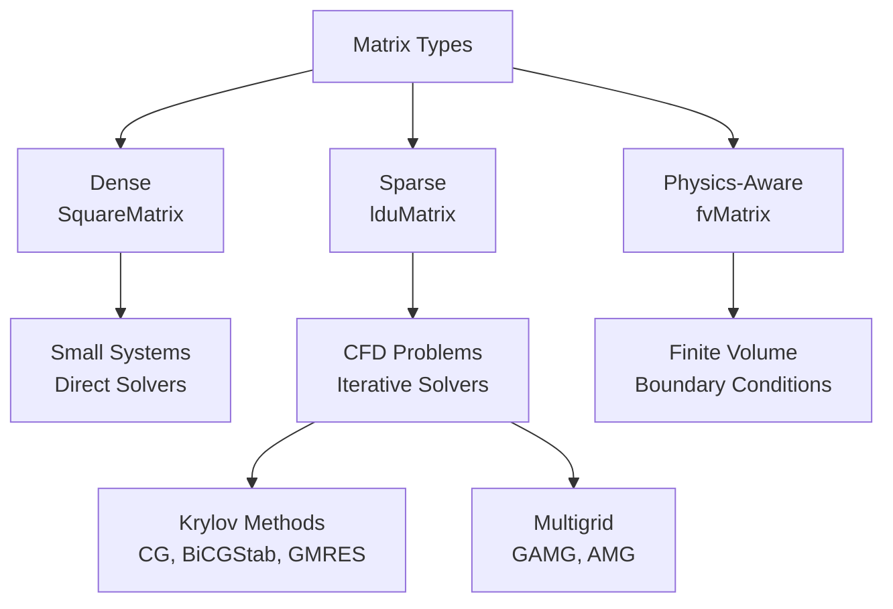

# Introduction to Matrices and Linear Algebra in OpenFOAM

## Overview

Linear algebra is the mathematical foundation of computational fluid dynamics (CFD), and OpenFOAM provides a comprehensive framework for matrix operations and linear system solving. This section explores the advanced linear algebraic structures that enable OpenFOAM to efficiently solve the discrete partial differential equations governing fluid flow.

> [!INFO] **Why This Matters**
> OpenFOAM's linear algebra system is the computational engine that transforms discretized PDEs into solvable algebraic systems. Understanding this framework is essential for:
> - **Developing custom solvers** for specialized physics
> - **Optimizing computational performance** in large-scale simulations
> - **Implementing robust boundary conditions** and source terms
> - **Debugging convergence issues** in complex simulations

---

## Core Architecture

### Hierarchical Matrix Design

OpenFOAM employs a **carefully designed hierarchical structure** where different matrix types serve specific computational roles:

**1. Dense Matrices (`SquareMatrix`)**
- Optimized for small systems (< 1000 elements)
- Uses direct solvers (LU decomposition)
- Applied in thermodynamic property calculations and local coordinate transformations
- Best when direct solution is feasible

**2. Sparse Matrices (`lduMatrix`)**
- The workhorse for CFD-scale problems
- Features matrix-free operations and diagonal-only storage
- Optimized for the sparsity pattern of CFD discretizations
- Each cell connects only to neighboring cells

**3. Physics-Aware Matrices (`fvMatrix`)**
- Extends `lduMatrix` with dimensional analysis and boundary condition integration
- Automatically manages dimensional consistency: $\nabla \cdot (\rho \mathbf{u}) = 0$ has dimension $[T^{-1}]$
- Maintains dimensions throughout the solution process

**4. Runtime-Selectable Solver Hierarchy**
- Enables computational scientists to experiment with algorithms without recompilation
- Base class provides consistent interface while specific implementations exploit matrix properties


> **Figure 1:** สถาปัตยกรรมลำดับชั้นของประเภทเมทริกซ์ใน OpenFOAM ซึ่งถูกออกแบบมาให้เหมาะสมกับการใช้งานแต่ละระดับ ตั้งแต่ระบบขนาดเล็กที่ใช้เมทริกซ์แบบหนาแน่น ไปจนถึงระบบขนาดใหญ่ที่ใช้เมทริกซ์แบบเบาบางความปลอดภัยทางฟิสิกส์ไม่ส่งผลกระทบต่อความเร็วในการจำลอง ผ่านการใช้พลังของ C++ Template Metaprogramming ในการตรวจสอบความสอดคล้องทางมิติทั้งหมดที่ขั้นตอนการคอมไพล์โปรแกรมเพียงครั้งเดียว

---

## Dense Matrix Fundamentals

### Mathematical Foundation

Dense matrices store **all** $m \times n$ elements in contiguous memory:

$$\mathbf{A} = \begin{bmatrix}
a_{11} & a_{12} & \cdots & a_{1n} \\
a_{21} & a_{22} & \cdots & a_{2n} \\
\vdots & \vdots & \ddots & \vdots \\
a_{m1} & a_{m2} & \cdots & a_{mn}
\end{bmatrix}$$

**Key characteristics:**
- $a_{ij}$: Element at row $i$, column $j$
- $m$: Number of rows
- $n$: Number of columns
- **Memory complexity**: $\mathcal{O}(n^2)$ for $n \times n$ matrix
- **Access complexity**: $\mathcal{O}(1)$ for direct element access

### OpenFOAM Implementation

OpenFOAM uses **row-major order** storage for cache efficiency:

```cpp
// Dense matrix implementation in OpenFOAM
template<class Type>
class SquareMatrix
{
private:
    List<Type> data_;  // Contiguous storage
    label n_;          // Matrix dimension

public:
    // Direct element access
    inline Type& operator()(const label i, const label j)
    {
        #ifdef FULLDEBUG
        checkIndex(i, j);  // Bounds checking in debug mode
        #endif
        return data_[i*n_ + j];  // Row-major indexing
    }

    // Matrix operations
    SquareMatrix<Type> inv() const;        // Inversion
    Type det() const;                      // Determinant
    SquareMatrix<Type> transpose() const;  // Transpose
};
```

### Core Operations

**Matrix Addition:**
$$\mathbf{C} = \mathbf{A} + \mathbf{B}, \quad c_{ij} = a_{ij} + b_{ij}$$

**Matrix Multiplication:**
$$\mathbf{C} = \mathbf{A} \cdot \mathbf{B}, \quad c_{ij} = \sum_{k=1}^{n} a_{ik} b_{kj}$$

**Determinant (for $3 \times 3$):**
$$\det(\mathbf{A}) = a_{11}(a_{22}a_{33} - a_{23}a_{32}) - a_{12}(a_{21}a_{33} - a_{23}a_{31}) + a_{13}(a_{21}a_{32} - a_{22}a_{31})$$

```cpp
// OpenFOAM matrix operations
SquareMatrix<scalar> C = A + B;  // Element-wise addition
SquareMatrix<scalar> D = A & B;  // Matrix multiplication (& operator)
scalar detA = det(A);             // Compute determinant
SquareMatrix<scalar> Ainv = inv(A);  // Matrix inversion
```

---

## Sparse Matrix Architecture (LduMatrix)

### The LDU Structure

OpenFOAM's linear algebra system centers on the **LduMatrix** class (Lower Diagonal Upper Matrix), which provides memory-efficient sparse matrix representation characteristic of finite volume discretization.

The LDU format exploits the **sparsity pattern** arising from the finite volume method, where only neighboring cells are connected through face flux computations.

**Structural Components:**

```cpp
template<class Type, class DType, class LUType>
class LduMatrix
{
    // Field references
    const lduAddressing& lduAddr_;
    const lduInterfaceFieldPtrsList& interfaces_;

    // Matrix coefficients
    Field<DType> diag_;    // Diagonal coefficients
    Field<LUType> upper_;  // Upper triangular
    Field<LUType> lower_;  // Lower triangular

    // Source term
    Field<Type> source_;
};
```

### Diagonal Coefficients (`diag_`)

Represents the **influence of the cell on itself**, calculated from discretizing the governing equation.

For momentum equations, diagonal terms typically include:
- **Temporal discretization**: $\frac{\rho V}{\Delta t}$
- **Diffusive terms**: $\sum_f \mu_f \frac{S_f}{\delta_f}$
- **Under-relaxation factors** for stability

### Off-Diagonal Coefficients (`upper_` and `lower_`)

Represent **coupling between neighboring cells** in LDU format:
- `upper_[face]` connects `owner[face]` to `neighbor[face]`
- `lower_[face]` connects `neighbor[face]` to `owner[face]`

**For finite volume discretization:**
$$a_{P,F} = -\mu_F \frac{S_F}{\delta_{PF}}$$

Where:
- $\mu_F$: Diffusive coefficient at face $F$
- $S_F$: Face area
- $\delta_{PF}$: Distance between cell centers $P$ and $F$

---

## The fvMatrix: Physics-Aware Linear Systems

### Design Philosophy

The `fvMatrix` class represents a **fundamental architectural pattern** where sparse linear systems are intimately coupled with the field being solved, ensuring mathematical consistency and automatic error checking throughout assembly.

```cpp
template<class Type>
class fvMatrix
:
    public tmp<fvMatrix<Type>>::refCount,  // Reference counting
    public lduMatrix                       // Sparse matrix operations
{
private:
    // Strong coupling to solution field
    const GeometricField<Type, fvPatchField, volMesh>& psi_;

    // Dimensional consistency tracking
    dimensionSet dimensions_;

    // Right-hand side vector
    Field<Type> source_;

    // Boundary condition storage
    FieldField<Field, Type> internalCoeffs_;
    FieldField<Field, Type> boundaryCoeffs_;
};
```

### Dimensional Awareness

OpenFOAM's dimensional analysis system extends to matrix operations, providing **physical consistency checking** at both compile-time and runtime:

```cpp
template<class Type>
void fvMatrix<Type>::operator+=(const fvMatrix<Type>& fm)
{
    // Runtime dimension checking
    if (dimensions_ != fm.dimensions_)
    {
        FatalErrorInFunction
            << "Dimension mismatch in fvMatrix addition: "
            << dimensions_ << " vs " << fm.dimensions_
            << abort(FatalError);
    }

    // Add matrix coefficients via lduMatrix interface
    lduMatrix::operator+=(fm);

    // Add source term vectors
    source_ += fm.source_;
}
```

This mechanism prevents fundamental physics errors such as attempting to add:
- Momentum equation (dimension: $kg \cdot m \cdot s^{-2}$)
- Energy equation (dimension: $kg \cdot m^2 \cdot s^{-3}$)

---

## Solver Hierarchy and Runtime Selection

### Abstract Base Class Architecture

OpenFOAM's linear solver architecture is built on an **elegant abstract base class** system that enables runtime solver selection:

```cpp
class lduMatrix::solver
{
protected:
    word fieldName_;           // Field being solved
    const lduMatrix& matrix_;  // Matrix (sparse data)

    // Boundary data
    const FieldField<Field, scalar>& interfaceBouCoeffs_;
    const FieldField<Field, scalar>& interfaceIntCoeffs_;
    const lduInterfaceFieldPtrsList& interfaces_;

    // Solver controls
    dictionary controlDict_;
    label maxIter_;      // Maximum iterations
    scalar tolerance_;   // Tolerance requirement
    scalar relTol_;      // Relative tolerance

public:
    // Pure virtual solve method
    virtual solverPerformance solve
    (
        scalarField& psi,        // Unknown solution
        const scalarField& source, // RHS
        const direction cmpt = 0   // Component for vector equations
    ) const = 0;
};
```

### Conjugate Gradient (CG) Method

**Optimal for symmetric positive definite systems**, CG is the workhorse for pressure equations in incompressible flow simulations:

**Mathematical Principle:**
$$\|\mathbf{x} - \mathbf{x}^*\|_{\mathbf{A}} = \sqrt{(\mathbf{x} - \mathbf{x}^*)^T \mathbf{A} (\mathbf{x} - \mathbf{x}^*)}$$

**Algorithm Steps:**

1. **Initialization**: Compute initial residual $\mathbf{r}_0 = \mathbf{b} - \mathbf{A}\mathbf{x}_0$
2. **Preconditioning**: Improve residual with preconditioner
3. **Direction Update**: Compute new search direction
4. **Step Length**: Find optimal step size $\alpha$
5. **Solution Update**: $\mathbf{x}_{k+1} = \mathbf{x}_k + \alpha \mathbf{p}_k$
6. **Convergence Check**: Verify accuracy

```cpp
class PCG : public lduMatrix::solver
{
public:
    TypeName("PCG");

    solverPerformance solve
    (
        scalarField& psi,
        const scalarField& source,
        const direction cmpt
    ) const;
};
```

### Preconditioners

Preconditioners transform the original linear system into one with **better convergence properties**:

**Types:**

| Type | Matrix Type | Algorithm | Use Case |
|------|-------------|-----------|----------|
| **DIC** | Symmetric | Diagonal Incomplete Cholesky | Pressure Poisson |
| **DILU** | Asymmetric | Diagonal Incomplete LU | Momentum equations |
| **GAMG** | General | Geometric-Algebraic Multigrid | Large systems |
| **Diagonal** | General | Simple diagonal scaling | Quick preconditioning |

**DIC Preconditioner** for symmetric matrices:

```cpp
class DICPreconditioner : public lduMatrix::preconditioner
{
private:
    scalarField rD_;  // Reciprocal diagonal

public:
    void precondition
    (
        scalarField& wA,        // Output: M⁻¹·r
        const scalarField& rA,  // Input residual
        const direction cmpt
    ) const;
};
```

---

## Matrix Assembly Patterns

### Implicit Operators (fvm namespace)

The `fvm` (finite volume matrix) namespace provides fundamental building blocks for assembling implicit operators:

**Laplacian Operator:**

For the diffusion term $\nabla \cdot (\gamma \nabla \phi)$, discretization via Gauss's theorem gives:

$$\int_V \nabla \cdot (\gamma \nabla \phi) \, \mathrm{d}V = \oint_{\partial V} \gamma \nabla \phi \cdot \mathbf{n} \, \mathrm{d}S$$

The discrete form becomes:

$$\sum_f \gamma_f (\nabla \phi)_f \cdot \mathbf{S}_f \approx \sum_f \gamma_f \frac{\phi_N - \phi_P}{\delta_{PN}} S_f$$

**Matrix Contributions:**

| **Matrix Component** | **Operation** | **OpenFOAM Code** |
|-------------------|------------------|------------------|
| Diagonal term | Owner cell contribution | `fvm.diag()[own] += coeff` |
| Diagonal term | Neighbor cell contribution | `fvm.diag()[nei] += coeff` |
| Off-diagonal term | Upper triangular | `fvm.upper()[facei] = -coeff` |
| Off-diagonal term | Lower triangular | `fvm.lower()[facei] = -coeff` |

### Explicit Operators (fvc namespace)

The `fvc` (finite volume calculus) namespace provides explicit operations that return field values rather than matrix contributions:

**Gradient Calculation:**

$$\nabla \phi|_P = \frac{1}{V_P} \sum_f \phi_f \mathbf{S}_f$$

```cpp
template<class Type>
tmp<GeometricField<typename outerProduct<vector, Type>::type, fvPatchField, volMesh>>
grad(const GeometricField<Type, fvPatchField, volMesh>& vf);
```

**Divergence Calculation:**

$$\nabla \cdot \mathbf{U}|_P = \frac{1}{V_P} \sum_f \mathbf{U}_f \cdot \mathbf{S}_f$$

---

## Applications in CFD

### 1. Tensor Operations in Material Properties

**Stress-Strain Relationship** in solids:

$$\boldsymbol{\sigma} = \mathbf{C} : \boldsymbol{\varepsilon}$$

Where:
- $\boldsymbol{\sigma}$ = Cauchy stress tensor (second-order)
- $\mathbf{C}$ = Elasticity tensor (fourth-order, represented as $6 \times 6$ matrix)
- $\boldsymbol{\varepsilon}$ = Strain tensor (second-order)

```cpp
// Stress-strain relationship in OpenFOAM
SymmetricSquareMatrix<scalar> C(6);  // Stiffness matrix
// Define material properties (21 independent components)
C(0,0) = E*(1-nu)/((1+nu)*(1-2*nu));  // Young's modulus, Poisson's ratio

// Strain vector (6 components: ε_xx, ε_yy, ε_zz, γ_xy, γ_yz, γ_zx)
Field<scalar> epsilon(6);

// Compute stress: σ = C * ε
Field<scalar> sigma = C * epsilon;
```

### 2. Coordinate Transformations

**Rotation matrices** for rotating machinery and MRF systems:

$$\mathbf{R}(\theta) = \begin{bmatrix}
\cos\theta & -\sin\theta & 0 \\
\sin\theta & \cos\theta & 0 \\
0 & 0 & 1
\end{bmatrix}$$

```cpp
// Rotating reference frame in turbomachinery
SquareMatrix<scalar> R(3);  // Rotation matrix
scalar theta = 30*M_PI/180;  // 30-degree rotation about z-axis
R(0,0) = cos(theta); R(0,1) = -sin(theta); R(0,2) = 0;
R(1,0) = sin(theta); R(1,1) = cos(theta);  R(1,2) = 0;
R(2,0) = 0;         R(2,1) = 0;          R(2,2) = 1;

vector v_local(10, 0, 0);     // Velocity in local coordinates
vector v_global = R & v_local; // Matrix-vector multiplication
```

### 3. Least-Squares Gradient Reconstruction

**Least-squares gradient method** provides higher accuracy than Green-Gauss on unstructured meshes:

$$\phi_i - \phi_c \approx \nabla\phi \cdot (\mathbf{x}_i - \mathbf{x}_c)$$

**System Construction:**
- **Equations**: $\mathbf{W}\nabla\phi = \mathbf{b}$
- **Moment matrix**: $\mathbf{W} = \sum_{i} w_i (\mathbf{x}_i - \mathbf{x}_c) \otimes (\mathbf{x}_i - \mathbf{x}_c)$
- **Right-hand side**: $\mathbf{b} = \sum_{i} w_i (\phi_i - \phi_c)(\mathbf{x}_i - \mathbf{x}_c)$
- **Weights**: $w_i = 1/|\mathbf{x}_i - \mathbf{x}_c|^2$

```cpp
// Cell-centered gradient calculation
SquareMatrix<scalar> M(3);  // Moment matrix
vector b(0,0,0);

// Accumulate contributions from neighbors
forAll(mesh.cellCells(celli), ni)
{
    label neighbor = mesh.cellCells(celli)[ni];
    vector d = mesh.C()[neighbor] - mesh.C()[celli];
    scalar weight = 1.0/magSqr(d);

    M += weight * (d * d);  // Outer product
    b += weight * (phi[neighbor] - phi[celli]) * d;
}

// Solve 3×3 linear system
SquareMatrix<scalar> Minv = M.inv();
vector gradPhi = Minv & b;  // Gradient ∇φ at cell center
```

---

## Performance Considerations

### Memory Efficiency

**Comparison of Matrix Types:**

| Matrix Type | Memory Usage | Matrix-Vector Multiplication Complexity |
|-------------|--------------|-------------------------------------|
| Square Matrix | O(n²) | O(n²) |
| Symmetric Matrix | O(n²/2) | O(n²) |
| Diagonal Matrix | O(n) | O(n) |

### Cache Optimization

Dense matrices benefit from **cache continuity**:
- **Spatial locality**: Sequential memory access patterns
- **Temporal locality**: Matrix element reuse in operations
- **Vectorization**: SIMD instructions for element-wise operations

```cpp
// Vectorized matrix multiplication
for (label i = 0; i < n; i++)
{
    for (label j = 0; j < n; j++)
    {
        Type sum = 0;
        for (label k = 0; k < n; k++)
        {
            sum += A(i,k) * B(k,j);  // Compiler can vectorize this loop
        }
        C(i,j) = sum;
    }
}
```

---

## Practical Guidelines

### When to Use Dense Matrices

**✅ Use dense matrices when:**
- Matrix size is small ($n \lesssim 50$)
- Most elements are non-zero (> 25-30% fill ratio)
- Frequent random access is required
- Matrix operations are performance-critical and small

**❌ Avoid dense matrices when:**
- Matrix size is large ($n \gtrsim 100$)
- Fill ratio is low (< 5% non-zeros)
- Memory is constrained
- Only sparse matrix operations are needed

### Solver Selection Strategy

| Matrix Property | Recommended Solver | Preconditioner |
|----------------|-------------------|----------------|
| Symmetric Positive Definite | PCG | DIC |
| Non-symmetric | PBiCGStab | DILU |
| Highly ill-conditioned | GMRES | ILU or GAMG |
| Diagonally dominant | GAMG | Diagonal |

---

## Summary

OpenFOAM's linear algebra system represents a **sophisticated integration** of:

1. **Mathematical Algorithms** – Krylov methods, multigrid, direct solvers
2. **Computational Efficiency** – Cache-aware data structures, vectorization
3. **Physical Modeling** – Dimensional consistency, boundary condition integration
4. **Numerical Robustness** – Preconditioning, convergence monitoring

This comprehensive framework enables **industrial-scale CFD simulations** with billions of cells while maintaining mathematical rigor and computational efficiency required for next-generation scientific computing.

> [!TIP] **Learning Path**
> 1. **Level 1**: Basic linear algebra – dense matrices and direct solvers
> 2. **Level 2**: Sparse matrix theory – storage formats and basic iterative methods
> 3. **Level 3**: Krylov subspace methods – CG, GMRES, BiCGStab implementation
> 4. **Level 4**: Multigrid methods – geometric and algebraic multigrid algorithms
> 5. **Level 5**: Parallel algorithms – domain decomposition and communication patterns

---

**Next:** Explore the [[02_🔍_High-Level_Concept_The_Spreadsheet_of_Numbers_Analogy]] for an intuitive understanding of dense matrix operations.
