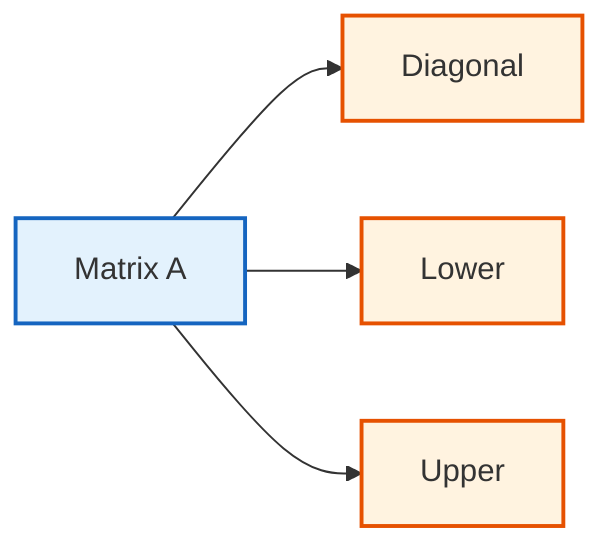

# Dense vs Sparse Matrices in OpenFOAM

## 🔍 **High-Level Concept: The Spreadsheet of Numbers Analogy**

Imagine a **spreadsheet** where every cell contains a number, and you can perform operations like addition, multiplication, and inversion on the entire sheet. Dense matrices in OpenFOAM are exactly that—**structured collections of numbers** where every possible element (even zeros) is explicitly stored.

**Mathematical Foundation**: A dense matrix $\mathbf{A} \in \mathbb{R}^{m \times n}$ stores all $m \times n$ elements in contiguous memory:

$$\mathbf{A} = \begin{bmatrix}
a_{11} & a_{12} & \cdots & a_{1n} \\
a_{21} & a_{22} & \cdots & a_{2n} \\
\vdots & \vdots & \ddots & \vdots \\
a_{m1} & a_{m2} & \cdots & a_{mn}
\end{bmatrix}$$

- $a_{ij}$ = matrix element at row $i$, column $j$
- $m$ = number of rows
- $n$ = number of columns

**Real-World Analogy**: Think of dense matrices like a **complete city street grid**:
- **Complete grid**: Every intersection exists, even if no roads connect them
- **Direct access**: You can reach any intersection (row, column) directly with $\mathcal{O}(1)$ access time
- **Inefficient for low-density cities**: If only 10% of intersections have roads, 90% of the grid is empty space

---

## 🚇 **Alternative View: The Subway Map Analogy**

Now consider a **subway map** where stations exist only where rail connections actually exist. This represents sparse matrices in CFD—only meaningful physical connections are stored.

**Key Difference**: Dense matrices store every possible connection; sparse matrices store only actual connections.

> [!INFO] Critical Insight
> Just as a subway map shows only actual rail connections between stations rather than every possible connection, sparse matrices store only non-zero values representing real physical interactions between mesh cells.

---

## 📊 **Fundamental Mathematical Differences**

### **Transport Equation**

The sparse pattern arises from discretizing the general transport equation using finite volume methods:

$$\frac{\partial (\rho \phi)}{\partial t} + \nabla \cdot (\rho \mathbf{u} \phi) = \nabla \cdot (\Gamma \nabla \phi) + S_\phi$$

**Variable Definitions**:
- $\rho$ = density [kg/m³]
- $\phi$ = transported variable (e.g., temperature, concentration)
- $t$ = time [s]
- $\mathbf{u}$ = velocity vector [m/s]
- $\Gamma$ = diffusion coefficient [Pa·s]
- $S_\phi$ = source term

### **Discretized System**

When discretized using finite volume methods on a mesh with $N$ cells, this becomes a linear system:

$$\mathbf{A} \boldsymbol{\phi} = \mathbf{b}$$


> **Figure 1:** โครงสร้างการจัดเก็บเมทริกซ์สัมประสิทธิ์ A ในรูปแบบ LDU ซึ่งแบ่งออกเป็นอาร์เรย์แนวทแยง (Diagonal) และอาร์เรย์ส่วนบน/ส่วนล่าง (Upper/Lower) เพื่อประสิทธิภาพด้านหน่วยความจำสูงสุด

**Variable Definitions**:
- $\mathbf{A} \in \mathbb{R}^{N \times N}$ = coefficient matrix
- $\boldsymbol{\phi} \in \mathbb{R}^N$ = solution vector
- $\mathbf{b} \in \mathbb{R}^N$ = source term vector

---

## ⚙️ **Dense Matrix Fundamentals**

### **Memory Structure and Performance**

OpenFOAM's `SquareMatrix` uses **row-major order** storage:

```cpp
// OpenFOAM SquareMatrix implementation
template<class Type>
class SquareMatrix
{
private:
    Type* v_;  // Pointer to data
    label n_;  // Matrix dimension

public:
    // Direct element access
    Type& operator()(const label i, const label j)
    {
        return v_[i * n_ + j];  // Row-major indexing
    }

    // Matrix operations
    SquareMatrix<Type> inv() const;           // Matrix inversion
    Type det() const;                         // Determinant
    SquareMatrix<Type> transpose() const;     // Transpose
};
```

**Source**: `.applications/test/Matrix/Test-Matrix.C`

**คำอธิบาย (Explanation)**:
- คลาส `SquareMatrix` เป็นเมทริกซ์หนาแน่น (dense matrix) ที่จัดเก็บข้อมูลทุก element ในหน่วยความจำ
- ใช้ row-major order แปลว่า element ใน row เดียวกันจะถูกเก็บในตำแหน่งหน่วยความจำที่ต่อเนื่องกัน
- `operator()` ใช้ formula `i * n_ + j` ในการคำนวณตำแหน่งของ element เพื่อการเข้าถึงแบบ O(1)

**แนวคิดสำคัญ (Key Concepts)**:
- **Row-major order**: การจัดเก็บข้อมูลแบบ row-major เป็นมาตรฐานใน C/C++
- **Direct indexing**: การเข้าถึง element โดยตรงผ่าน pointer arithmetic
- **Memory layout**: การจัดวางหน่วยความจำส่งผลต่อ performance ผ่าน cache locality

**Memory Efficiency**:
- **Memory Complexity**: $\mathcal{O}(n^2)$ for $n \times n$ matrix
- **Access Complexity**: $\mathcal{O}(1)$ for direct element access

### **Specialized Dense Matrix Types**

OpenFOAM extends the basic dense matrix concept with specialized types that exploit mathematical structures:

#### **Symmetric Matrices**

```cpp
// Exploiting A_ij = A_ji symmetry
template<class Type>
class SymmetricSquareMatrix : public SquareMatrix<Type>
{
private:
    // Store only upper triangular part
    // n×(n+1)/2 elements instead of n² (50% memory savings)
    List<Type> data_;

public:
    inline Type& operator()(const label i, const label j)
    {
        if (i <= j)
            return data_[i*n_ + j - i*(i+1)/2];  // Upper triangle
        else
            return data_[j*n_ + i - j*(j+1)/2];  // Symmetric access
    }
};
```

**คำอธิบาย (Explanation)**:
- `SymmetricSquareMatrix` ใช้ประโยชน์จากสมมาตรของเมทริกซ์ (A_ij = A_ji)
- เก็บเฉพาะส่วน upper triangular เพื่อประหยัดหน่วยความจำ 50%
- Formula `i*n_ + j - i*(i+1)/2` ใช้ในการคำนวณ index ใน 1D array

**แนวคิดสำคัญ (Key Concepts)**:
- **Symmetry optimization**: การใช้ประโยชน์จากคุณสมบัติสมมาตรของเมทริกซ์
- **Triangular storage**: การจัดเก็บแบบ triangular เพื่อลดหน่วยความจำ
- **Index mapping**: การแปลง 2D index เป็น 1D index ใน compressed storage

**Memory Comparison**:
- **Full square matrix**: $n^2$ elements
- **Symmetric matrix**: $\frac{n(n+1)}{2}$ elements

#### **Diagonal Matrices**

```cpp
// Extremely sparse storage
template<class Type>
class DiagonalMatrix
{
private:
    List<Type> diag_;  // Only diagonal elements

public:
    // Matrix-vector multiplication: O(n) instead of O(n²)
    Field<Type> operator*(const Field<Type>& x) const
    {
        Field<Type> result(x.size());
        forAll(x, i)
        {
            result[i] = diag_[i] * x[i];  // Only diagonal interaction
        }
        return result;
    }
};
```

**คำอธิบาย (Explanation)**:
- `DiagonalMatrix` เก็บเฉพาะค่าบนเส้นทแยงมุม เป็นการบีบอัดสุดโต่ง
- Matrix-vector multiplication ลดลงจาก O(n²) เป็น O(n) เนื่องจากไม่ต้องคูณกับ off-diagonal elements
- Loop `forAll(x, i)` ทำการคูณ element-wise ระหว่าง diagonal กับ vector

**แนวคิดสำคัญ (Key Concepts)**:
- **Diagonal storage**: การจัดเก็บเฉพาะ diagonal elements เพื่อประหยัดหน่วยความจำ
- **Computational reduction**: การลดจำนวน operations จาก O(n²) เป็น O(n)
- **Element-wise operation**: การดำเนินการระดับ element แทน matrix operations

**Performance Comparison**:

| Matrix Type | Memory Usage | Matrix-Vector Multiplication Complexity |
|-------------|--------------|----------------------------------------|
| Full square | $\mathcal{O}(n^2)$ | $\mathcal{O}(n^2)$ |
| Symmetric | $\mathcal{O}(n^2/2)$ | $\mathcal{O}(n^2)$ |
| Diagonal | $\mathcal{O}(n)$ | $\mathcal{O}(n)$ |

**Diagonal Matrix Multiplication**:
$$\mathbf{y} = \mathbf{D} \mathbf{x} \implies y_i = D_{ii} x_i$$

---

## ⚙️ **Sparse Matrix Storage (LDU Format)**

### **Step 1: LDU Storage Format - "Neighbor Lists" Strategy**

The **LDU (Lower Diagonal Upper)** storage format in OpenFOAM is a sophisticated approach for storing sparse matrices that exploits the natural sparsity pattern of finite volume discretization.

**Fundamental Principles**:
- Designed specifically for matrices arising from PDE discretization on unstructured meshes
- Each cell typically interacts only with nearest neighbors through shared faces

The `lduMatrix` class implements this storage strategy through three main arrays:

```cpp
// LDU matrix stores three arrays for symmetric/asymmetric matrices
class lduMatrix
{
private:
    // Mesh reference for connectivity
    const lduMesh& lduMesh_;

    // Matrix coefficients (only non-zeros)
    scalarField* lowerPtr_;   // Lower triangle coefficients
    scalarField* diagPtr_;    // Diagonal coefficients
    scalarField* upperPtr_;   // Upper triangle coefficients

public:
    // Access to mesh addressing
    const lduAddressing& lduAddr() const
    {
        return lduMesh_.lduAddr();  // Cell-to-cell connectivity
    }
};
```

**คำอธิบาย (Explanation)**:
- `lduMatrix` ใช้หลักการ LDU (Lower-Diagonal-Upper) ในการจัดเก็บเมทริกซ์แบบ sparse
- `lowerPtr_`, `diagPtr_`, `upperPtr_` เป็น pointers ไปยัง scalar fields ที่เก็บ coefficients เฉพาะ non-zero values
- `lduMesh_` เก็บ reference ของ mesh เพื่อใช้ในการเข้าถึงข้อมูล connectivity
- `lduAddr()` ให้ access ไปยัง cell-to-cell connectivity information

**แนวคิดสำคัญ (Key Concepts)**:
- **LDU decomposition**: การแยกเมทริกซ์ออกเป็นสามส่วน (Lower, Diagonal, Upper)
- **Sparse storage**: การจัดเก็บเฉพาะ non-zero elements
- **Mesh connectivity**: การเชื่อมต่อกับ mesh structure เพื่อการเข้าถึงข้อมูล neighbor
- **Pointer-based design**: การใช้ pointers ในการจัดการ memory อย่างมีประสิทธิภาพ

### **Storage Efficiency**

For a mesh with $n$ cells and $m$ internal faces:

| Matrix Format | Number of entries | Compression ratio |
|---------------|-------------------|-------------------|
| Dense Matrix | $n^2$ | 1.0 |
| LDU Storage | $n + 2m$ | $\frac{n + 2m}{n^2} \approx \frac{2m}{n^2}$ |

> [!TIP] CFD Sparsity
> For typical CFD meshes where $m \sim \mathcal{O}(n)$ and each cell has 5-15 neighbors, LDU storage achieves **99.9% sparsity**.

### **Step 2: Mesh Addressing - "Who's My Neighbor?" System**

The `lduAddressing` class provides the infrastructure for understanding cell connectivity within the finite volume mesh.

```cpp
// lduAddressing provides cell connectivity
class lduAddressing
{
private:
    // Owner list: cell index for each face's "owner" side
    labelList owner_;

    // Neighbour list: cell index for each face's "neighbour" side
    labelList neighbour_;

    // For face i: owner_[i] and neighbour_[i] are connected cells
    // Lower triangle: owner → neighbour
    // Upper triangle: neighbour → owner

public:
    // Number of internal faces (non-boundary connections)
    label nInternalFaces() const { return neighbour_.size(); }

    // Face-cell connectivity
    const labelList& lowerAddr() const { return owner_; }      // Lower addressing
    const labelList& upperAddr() const { return neighbour_; }  // Upper addressing
};
```

**คำอธิบาย (Explanation)**:
- `owner_` เป็น label list ที่เก็บ cell index ของ "owner" สำหรับแต่ละ face
- `neighbour_` เป็น label list ที่เก็บ cell index ของ "neighbour" สำหรับ internal faces
- Convention: owner มี index ต่ำกว่า neighbour สำหรับ internal faces
- `lowerAddr()` และ `upperAddr()` ให้ access ไปยัง connectivity information
- `nInternalFaces()` คืนค่าจำนวน internal faces (non-boundary connections)

**แนวคิดสำคัญ (Key Concepts)**:
- **Owner-neighbour scheme**: ระบบการจัดเก็บความสัมพันธ์ระหว่าง cell ผ่าน face
- **Lower/upper addressing**: การแยกการเข้าถึงระหว่าง lower และ upper triangles
- **Face-based connectivity**: การใช้ faces เป็นหลักในการกำหนด connectivity
- **Internal vs boundary faces**: การแยกประเภทของ faces (internal มี owner+neighbour, boundary มีเฉพาะ owner)

**Orientation Convention**:

| Face Type | Owner Cell | Neighbor Cell | Notes |
|-----------|------------|---------------|-------|
| Internal Face | Lower cell index | Higher cell index | Has both owner and neighbour |
| Boundary Face | Cell index | - | Has only owner |

**Performance**:
- **$\mathcal{O}(1)$ access** for any cell's neighbor information
- Supports efficient iterative solvers for matrix-vector multiplication: $(A\mathbf{x})_i = A_{ii}x_i + \sum_{j \in \text{neighbors}(i)} A_{ij}x_j$

### **Step 3: Matrix Assembly - "Per-Face Contribution" Pattern**

Matrix assembly in OpenFOAM follows a consistent **"per-face contribution"** pattern.

```cpp
// Building matrix coefficients face by face
void assembleLaplacian(lduMatrix& matrix, const scalar gamma)
{
    const lduAddressing& addr = matrix.lduAddr();
    scalarField& diag = matrix.diag();
    scalarField& upper = matrix.upper();
    scalarField& lower = matrix.lower();

    // For each internal face (connection between two cells)
    forAll(addr.upperAddr(), facei)
    {
        label own = addr.lowerAddr()[facei];   // Owner cell
        label nei = addr.upperAddr()[facei];   // Neighbor cell

        // Geometric factor (face area/distance)
        scalar coeff = gamma * mesh.magSf()[facei] / mesh.magDelta()[facei];

        // Add to matrix: -coeff * (φ_nei - φ_own) contribution
        diag[own] += coeff;    // Owner's diagonal
        diag[nei] += coeff;    // Neighbor's diagonal
        upper[facei] = -coeff; // Owner→neighbor
        lower[facei] = -coeff; // Neighbor→owner
    }
}
```

**คำอธิบาย (Explanation)**:
- `assembleLaplacian` ทำการประกอบเมทริกซ์ Laplacian แบบ face-by-face
- `addr.lowerAddr()[facei]` และ `addr.upperAddr()[facei]` ให้ cell indices ของ owner และ neighbour
- `coeff` คำนวณจาก geometric factor: diffusion coefficient × face area / distance
- `diag[own]` และ `diag[nei]` ถูกเพิ่มค่าด้วย `coeff` สำหรับ diagonal terms
- `upper[facei]` และ `lower[facei]` ถูกตั้งค่าเป็น `-coeff` สำหรับ off-diagonal terms

**แนวคิดสำคัญ (Key Concepts)**:
- **Face-based assembly**: การประกอบเมทริกซ์แบบ face-by-face เป็นหลักการพื้นฐาน
- **Flux conservation**: การรักษา equilibrium ระหว่าง owner และ neighbour contributions
- **Geometric factors**: การใช้ข้อมูล geometric ของ mesh (face area, distance)
- **LDU structure**: การแยก coefficients เป็น lower, diagonal, และ upper

**Laplacian Discretization**:

Equation being discretized: $-\nabla \cdot (\gamma \nabla \phi)$

**Coefficient calculation**: $\text{coeff} = \gamma \frac{|S_f|}{|\delta_f|}$

Where:
- $\gamma$ = diffusion coefficient
- $|S_f|$ = face area
- $|\delta_f|$ = distance between cell centers

**Assembly Outcomes**:

| Property | Description |
|----------|-------------|
| **SPD Matrix** | Symmetric Positive Definite for diffusion problems |
| **Conservation** | Flux balance between adjacent cells automatic |
| **Mesh Adaptability** | Naturally supports non-orthogonal and non-uniform meshes |
| **Solver Compatibility** | Ideal for conjugate gradient methods with preconditioners |

---

## 📈 **Practical Sparsity in CFD**

### **Memory Comparison**

For a typical CFD mesh with 10 million cells:

| Storage Method | Number of entries | Memory | Efficiency |
|----------------|-------------------|--------|------------|
| **Dense Matrix** | $10^7 \times 10^7 = 10^{14}$ | Enormous | Impossible |
| **Sparse Matrix** | $10^7 \times 10 = 10^8$ | Manageable | 1000× reduction |

This massive reduction is possible because:
- **Each cell** needs to communicate only with adjacent neighbors through face-based flux calculations
- **Matrix structure** mirrors mesh connectivity
- **Each row** represents a cell and has entries only for:
  - **Diagonal term**: cell's own coefficient
  - **Neighbor terms**: coefficients for adjacent cells sharing faces

---

## 🧠 **Under the Hood: Matrix-Vector Multiplication**

### **The Amul Operation - Sparse Matrix-Vector Multiplication**

The `Amul` operation represents OpenFOAM's fundamental sparse matrix-vector multiplication, denoted $\mathbf{y} = \mathbf{A}\mathbf{x}$ where $\mathbf{A}$ is a sparse matrix and $\mathbf{x}$, $\mathbf{y}$ are vectors.

```cpp
// Computing A·x for sparse matrices
void lduMatrix::Amul
(
    scalarField& result,           // Output: A·x
    const tmp<scalarField>& tx,   // Input vector x
    const FieldField<Field, scalar>& interfaceBouCoeffs,
    const lduInterfaceFieldPtrsList& interfaces,
    const direction cmpt
) const
{
    const scalarField& x = tx();
    const lduAddressing& addr = lduAddr();

    // Initialize result with diagonal contribution
    result = diag() * x;

    // Add lower triangle contributions
    const labelList& lowerAddr = addr.lowerAddr();
    const labelList& upperAddr = addr.upperAddr();
    const scalarField& lower = lower();

    forAll(lowerAddr, facei)
    {
        label own = lowerAddr[facei];
        label nei = upperAddr[facei];

        // Lower triangle: A[nei][own] contributes to result[nei]
        result[nei] += lower[facei] * x[own];
    }

    // Add upper triangle contributions
    const scalarField& upper = upper();
    forAll(upperAddr, facei)
    {
        label own = lowerAddr[facei];
        label nei = upperAddr[facei];

        // Upper triangle: A[own][nei] contributes to result[own]
        result[own] += upper[facei] * x[nei];
    }

    // PERFORMANCE: O(n) operations instead of O(n²)
    // Only visits actual connections (internal faces)
}
```

**คำอธิบาย (Explanation)**:
- `Amul` ทำการคูณเมทริกซ์-เวกเตอร์แบบ sparse: y = A·x
- `result = diag() * x` เริ่มต้นด้วย diagonal contributions
- Loop `forAll(lowerAddr, facei)` เพิ่ม lower triangle contributions ให้กับ neighbour cells
- Loop `forAll(upperAddr, facei)` เพิ่ม upper triangle contributions ให้กับ owner cells
- Lower triangle: `result[nei] += lower[facei] * x[own]`
- Upper triangle: `result[own] += upper[facei] * x[nei]`
- Complexity ลดลงจาก O(n²) เป็น O(n + n_faces) เนื่องจากเข้าถึงเฉพาะ non-zero elements

**แนวคิดสำคัญ (Key Concepts)**:
- **Sparse matrix-vector multiplication**: การคูณเมทริกซ์-เวกเตอร์แบบ sparse
- **LDU traversal**: การเดินทางผ่าน lower, diagonal, และ upper แยกกัน
- **Face-based iteration**: การวนลูปผ่าน faces แทน matrix elements
- **Owner-neighbour scheme**: การใช้โครงสร้าง owner-neighbour ในการเข้าถึงข้อมูล
- **Computational efficiency**: การลด complexity ผ่าน sparsity

### **Mathematical Foundation**

The sparse matrix $\mathbf{A}$ in OpenFOAM follows the **Lower-Diagonal-Upper (LDU)** format:

$$\mathbf{A} = \mathbf{L} + \mathbf{D} + \mathbf{U}$$

Where:
- $\mathbf{D}$ = diagonal matrix with diagonal elements $\mathbf{d}$
- $\mathbf{L}$ = lower triangular matrix with lower elements $\mathbf{l}$
- $\mathbf{U}$ = upper triangular matrix with upper elements $\mathbf{u}$

The matrix-vector product becomes:

$$\mathbf{y} = \mathbf{A}\mathbf{x} = \mathbf{L}\mathbf{x} + \mathbf{D}\mathbf{x} + \mathbf{U}\mathbf{x}$$

For each element $y_i$:
$$y_i = \sum_{j \in \mathcal{N}_i} A_{ij}x_j + A_{ii}x_i$$

Where $\mathcal{N}_i$ represents the set of neighbors of cell $i$.

### **Performance Analysis**

| Metric | Sparse Multiplication | Dense Multiplication |
|--------|----------------------|---------------------|
| **Time Complexity** | $\mathcal{O}(n + n_f)$ | $\mathcal{O}(n^2)$ |
| **Memory Complexity** | $\mathcal{O}(n + n_f)$ | $\mathcal{O}(n^2)$ |
| **Speedup factor** | - | 6-12× for typical CFD meshes |
| **Memory savings** | 85-95% for real CFD problems | - |

Where $n_f$ = number of faces.

**Cache Efficiency**:
- Sequential face array access improves spatial locality
- Reduced memory bandwidth requirements compared to dense operations

---

## ⚡ **Memory and Performance Considerations**

### **Cache Optimization Strategies**

```cpp
// CACHE BEHAVIOR: Row-major vs column-major efficiency
template<class Type>
void matrixMultiply(const SquareMatrix<Type>& A,
                    const SquareMatrix<Type>& B,
                    SquareMatrix<Type>& C)
{
    const label n = A.n();

    // ❌ BAD: Column-major inner loop (cache-inefficient)
    for (label i = 0; i < n; ++i)
        for (label j = 0; j < n; ++j)
            for (label k = 0; k < n; ++k)
                C(i,j) += A(i,k) * B(k,j);  // Strided B access

    // ✅ GOOD: Row-major optimized (OpenFOAM's approach)
    for (label i = 0; i < n; ++i)
        for (label k = 0; k < n; ++k)
        {
            const Type aik = A(i,k);  // Cache A value
            for (label j = 0; j < n; ++j)
                C(i,j) += aik * B(k,j);  // Sequential B access
        }

    // PERFORMANCE: 2-3× speedup from cache-friendly ordering
}
```

**คำอธิบาย (Explanation)**:
- **BAD approach**: การเข้าถึงแบบ column-major `B(k,j)` ทำให้เกิด cache thrashing
- **GOOD approach**: การ cache `A(i,k)` และเข้าถึง `B(k,j)` แบบ sequential improves cache locality
- Row-major order ใน C++ ทำให้การเข้าถึงแบบ row-wise มีประสิทธิภาพมากกว่า
- Performance improvement: 2-3× speedup จาก cache-friendly ordering

**แนวคิดสำคัญ (Key Concepts)**:
- **Cache locality**: การออกแบบ algorithm ให้เข้าถึง memory แบบ sequential
- **Row-major vs column-major**: ผลกระทบของ memory layout ต่อ performance
- **Cache thrashing**: ปัญหาที่เกิดจากการเข้าถึง memory แบบ non-sequential
- **Loop reordering**: เทคนิคการจัดลำดับ loop เพื่อปรับปรุง cache performance

OpenFOAM's cache optimization strategy uses **locality of reference**:

**Theoretical Principles**:
- Arrays in CFD are stored in **row-major** order
- Contiguous elements in rows are stored in adjacent memory locations

**Problem with Column-Major Access**:
- Causes **cache thrashing** from accessing `B(k,j)` for varying `k`
- CPU must continuously fetch new cache lines

**OpenFOAM's Solution**:
1. **Cache `A(i,k)` value** in temporary variable
2. **Process all `j` values contiguously**
3. Achieves **spatial locality** - accessing stored-contiguously `B(k,j)` elements

**Result**: 2-3× performance improvement for large matrix operations in finite volume discretization.

### **Small Matrix Optimization**

```cpp
// Template specialization for small matrices
template<class Type, int nRows, int nCols>
class FixedMatrix
{
private:
    // Stack allocation (no heap overhead)
    Type data_[nRows * nCols];

public:
    // Compile-time loop unrolling
    FixedMatrix operator+(const FixedMatrix& other) const
    {
        FixedMatrix result;
        // Compiler fully unrolls this loop
        for (int i = 0; i < nRows*nCols; ++i)
            result.data_[i] = data_[i] + other.data_[i];
        return result;
    }
};

// Usage: 3×3 transformation matrix (common in CFD)
FixedMatrix<scalar, 3, 3> rotationMatrix;
// No dynamic memory allocation, maximum performance
```

**คำอธิบาย (Explanation)**:
- `FixedMatrix` ใช้ template parameters `nRows` และ `nCols` สำหรับ compile-time size
- `data_[nRows * nCols]` เป็น stack allocation ไม่มี heap overhead
- Compiler สามารถ unroll loops ได้อย่างสมบูรณ์เนื่องจาก size เป็นค่าคงที่
- ไม่มี dynamic memory allocation ทำให้ได้ maximum performance
- ใช้สำหรับ small matrices เช่น 3×3 transformation matrices

**แนวคิดสำคัญ (Key Concepts)**:
- **Stack allocation**: การจัดสรรหน่วยความจำบน stack แทน heap
- **Compile-time optimization**: การใช้ template parameters เพื่อ compile-time optimizations
- **Loop unrolling**: เทคนิคการ unroll loops เพื่อลด overhead
- **Template metaprogramming**: การใช้ templates ในการสร้าง compile-time code
- **Zero-overhead abstraction**: การสร้าง abstractions ที่ไม่มี runtime overhead

**Problem Solved**:
- **Memory allocation overhead** for small matrices
- Costs from heap management, fragmentation, and cache pollution

**OpenFOAM's Solution**:

| Property | FixedMatrix Template | Dynamic Matrix |
|-----------|---------------------|----------------|
| **Allocation** | Stack allocation | Heap allocation |
| **Size** | Compile-time determined | Runtime determined |
| **Performance** | Near-zero overhead | Significant overhead |
| **Cache** | Cache-friendly | Potential cache misses |

**Benefits of Template Parameters**:
- `nRows` and `nCols` enable **compile-time optimization**
- Compiler can perform full **loop unrolling**
- Transforms `operator+` into **inline operations** without loop structure

**Real CFD Applications**:
- **Transformation matrices** (3×3) for coordinate transformations
- **Gradient tensors** (3×1) for gradient calculations
- Appear millions of times per simulation in boundary condition calculations and interpolation schemes

---

## 🎯 **Applications in OpenFOAM**

### **1. Small Linear Systems**

Used for solving small coupled systems at each computational cell:

```cpp
// Example: 6×6 stress tensor calculation
SquareMatrix<scalar> stressMatrix(6);
stressMatrix(0,0) = sigma_xx;  stressMatrix(0,1) = sigma_xy;
stressMatrix(1,0) = sigma_yx;  stressMatrix(1,1) = sigma_yy;
// ... fill remaining elements

// Solve for principal stresses
vector principalStress = stressMatrix.inv() * stressVector;
```

**คำอธิบาย (Explanation)**:
- `SquareMatrix<scalar>` สร้างเมทริกซ์ 6×6 สำหรับ stress tensor calculations
- Element access `stressMatrix(i,j)` ใช้ในการกำหนดค่า stress components
- `stressMatrix.inv()` ทำการคำนวณ inverse ของเมทริกซ์
- Matrix-vector multiplication `stressMatrix.inv() * stressVector` หา principal stresses
- ใช้ใน solid mechanics solvers สำหรับ stress analysis

**แนวคิดสำคัญ (Key Concepts)**:
- **Stress tensor**: เมทริกซ์ 3×3 (หรือ 6×6 ใน Voigt notation) สำหรับ stress state
- **Principal stresses**: ค่า eigenvalues ของ stress tensor
- **Matrix inversion**: การหา inverse เพื่อแก้ linear systems
- **Small dense systems**: การใช้ dense matrices สำหรับ small problems

### **2. Transformation Matrices**

Geometric transformations for coordinate system changes:

**Rotation Matrix** (2D):
$$\mathbf{R}(\theta) = \begin{bmatrix}
\cos\theta & -\sin\theta \\
\sin\theta & \cos\theta
\end{bmatrix}$$

Where $\theta$ is the rotation angle (radians).

**Scaling Matrix**:
$$\mathbf{S} = \begin{bmatrix}
s_x & 0 & 0 \\
0 & s_y & 0 \\
0 & 0 & s_z
\end{bmatrix}$$

Where $s_x, s_y, s_z$ are scaling factors along each axis.

```cpp
// Transformation usage in OpenFOAM
SquareMatrix<vector> rotationMatrix =
    tensor::rotation(axis, angle);
vector rotatedPoint = rotationMatrix & originalPoint;
```

**คำอธิบาย (Explanation)**:
- `tensor::rotation(axis, angle)` สร้าง rotation matrix จาก axis และ angle
- `rotationMatrix & originalPoint` ใช้ operator `&` สำหรับ matrix-vector multiplication
- Rotation matrices ใช้ใน coordinate transformations สำหรับ rotating reference frames
- Scaling matrices ใช้ใน mesh scaling และ coordinate transformations

**แนวคิดสำคัญ (Key Concepts)**:
- **Rotation matrices**: เมทริกซ์ orthogonal ที่ใช้ในการหมุน coordinate systems
- **Scaling matrices**: เมทริกซ์ diagonal สำหรับ scaling operations
- **Coordinate transformations**: การแปลงระหว่าง coordinate systems
- **Matrix-vector multiplication**: การใช้ operators พิเศษ (`&`) สำหรับ transformations

### **3. Eigenvalue Problems in Turbulence Modeling**

Required for Reynolds stress decomposition:

**Eigenvalue Problem**: $\mathbf{A}\mathbf{v} = \lambda\mathbf{v}$

Where:
- $\mathbf{A}$ = matrix
- $\mathbf{v}$ = eigenvector
- $\lambda$ = eigenvalue

```cpp
// Reynolds stress tensor eigenvalue decomposition
symmTensor R = dev(rho*U*U);
tensor eigenVectors = eigenVectors(R);
vector eigenValues = eigenValues(R);

// Extract turbulence length scales
scalar l_max = sqrt(eigenValues.x());
scalar l_int = sqrt((eigenValues.x() + eigenValues.y() + eigenValues.z())/3.0);
```

**คำอธิบาย (Explanation)**:
- `symmTensor R` เป็น Reynolds stress tensor (symmetric)
- `dev(rho*U*U)` คำนวณ deviatoric part ของ Reynolds stress
- `eigenVectors(R)` และ `eigenValues(R)` คำนวณ eigen decomposition
- `l_max` และ `l_int` คำนวณ turbulence length scales จาก eigenvalues
- ใช้ใน turbulence modeling สำหรับ characterizing flow structures

**แนวคิดสำคัญ (Key Concepts)**:
- **Eigenvalue decomposition**: การแยกเมทริกซ์ออกเป็น eigenvalues และ eigenvectors
- **Reynolds stress tensor**: Stress tensor จาก turbulent fluctuations
- **Turbulence length scales**: Characteristic lengths ของ turbulent structures
- **Symmetric tensors**: เมทริกซ์ symmetric ที่มี real eigenvalues

### **4. Least-Squares Gradient Reconstruction**

Used in high-resolution gradient schemes:

**Least-Squares Formulation**: $\min \|\mathbf{A}\mathbf{x} - \mathbf{b}\|_2^2$

Where:
- $\mathbf{A}$ = coefficient matrix
- $\mathbf{x}$ = variable vector to find
- $\mathbf{b}$ = known value vector

```cpp
// Gradient reconstruction using least squares
RectangularMatrix<scalar> A(nCells, 3);  // nCells × 3 system
vectorField b(nCells);                    // Known values

// Build system: A * gradPhi = differences
forAll(cellNeighbours, i)
{
    vector d = cellNeighbourCentres[i] - cellCentre;
    scalar phiDiff = phiNeighbour[i] - phiCell;

    A(i, 0) = d.x();  A(i, 1) = d.y();  A(i, 2) = d.z();
    b[i] = phiDiff;
}

// Solve gradient using pseudo-inverse
vector gradPhi = (A.T() & A).inv() & (A.T() & b);
```

**คำอธิบาย (Explanation)**:
- `RectangularMatrix<scalar> A(nCells, 3)` สร้าง rectangular matrix สำหรับ least-squares
- Loop `forAll(cellNeighbours, i)` สร้าง system of equations จาก neighbor values
- `d.x()`, `d.y()`, `d.z()` เป็น distance components ระหว่าง cells
- `A.T() & A` คำนวณ normal equations (A^T * A)
- `.inv() & (A.T() & b)` แก้ linear system สำหรับ gradient

**แนวคิดสำคัญ (Key Concepts)**:
- **Least-squares method**: การหา solution ที่ minimize squared errors
- **Overdetermined systems**: Systems ที่มี equations มากกว่า unknowns
- **Pseudo-inverse**: การใช้ (A^T * A)^(-1) * A^T สำหรับ rectangular matrices
- **Gradient reconstruction**: การคำนวณ gradients จาก scattered data

---

## 📋 **Dense vs Sparse Comparison**

| Characteristic | Dense Matrices | Sparse Matrices |
|----------------|----------------|-----------------|
| **Memory Usage** | $\mathcal{O}(n^2)$ always | $\mathcal{O}(\text{nnz})$ where $\text{nnz}$ = non-zeros |
| **Access Pattern** | Direct $\mathcal{O}(1)$ | Indirect $\mathcal{O}(\log n)$ or $\mathcal{O}(1)$ with indices |
| **Best For** | Small dense systems ($n < 100$) | Large sparse systems ($n > 1000$, $\text{nnz} \ll n^2$) |
| **Operations** | BLAS-optimized | Specialized sparse algorithms |

---

## ⚠️ **Common Pitfalls and Solutions**

### **Pitfall 1: Using Dense Matrices for Sparse Problems**

In CFD applications, matrices are naturally **sparse** due to the finite volume discretization nature.

**Key Observations**:
- Each computational cell typically interacts only with immediate neighbors
- Approximately **15-20 non-zero connections per cell** in structured 3D meshes
- Even fewer connections in unstructured meshes

```cpp
// ❌ PROBLEM: Using dense matrices for CFD (99% zeros)
SquareMatrix<scalar> pressureMatrix(1000000);  // 1M × 1M matrix
// Memory: 1M × 1M × 8 bytes = 8TB! (Impossible)

// ✅ SOLUTION: Use sparse matrices (lduMatrix)
lduMatrix pressureMatrix(mesh);  // Store only non-zeros
// Memory: ~15 non-zeros per row × 1M × 8 bytes = 120MB
```

**คำอธิบาย (Explanation)**:
- **PROBLEM**: `SquareMatrix<scalar>` จัดเก็บทุก elements แม้จะเป็น zero ทำให้ใช้หน่วยความจำมหาศาล
- **SOLUTION**: `lduMatrix` จัดเก็บเฉพาะ non-zero elements ผ่าน LDU format
- Memory reduction: จาก 8TB (dense) เป็น 120MB (sparse)
- Sparsity: CFD matrices มักมี 99%+ zeros เนื่องจาก local connectivity

**แนวคิดสำคัญ (Key Concepts)**:
- **Sparsity pattern**: โครงสร้างของ non-zero elements ในเมทริกซ์
- **Memory efficiency**: การลดหน่วยความจำผ่าน sparse storage
- **CFD discretization**: การ discretize PDEs สร้าง sparse matrices เนื่องจาก local interactions
- **LDU format**: การจัดเก็บแบบ sparse ที่เหมาะกับ finite volume method

**Technical Analysis**:

**Memory Requirements by Sparsity Pattern**:
- **Dense matrix**: Memory complexity $\mathcal{O}(n^2)$
- **Sparse matrix**: Memory complexity $\mathcal{O}(\text{nnz})$ where $\text{nnz}$ is number of non-zeros

**Calculation Example**:
For a typical 3D CFD problem with $n = 10^6$ cells and average connections $\bar{k} = 15$:

- Dense memory: $10^6 \times 10^6 \times 8 \text{ bytes} = 8 \text{ TB}$
- Sparse memory: $10^6 \times 15 \times 8 \text{ bytes} = 120 \text{ MB}$

### **Pitfall 2: Algorithmic Complexity Explosion**

Direct linear algebra operations on large matrices have enormous computational costs due to polynomial time complexity.

```cpp
// ❌ PROBLEM: O(n³) operations for large matrices
SquareMatrix<scalar> A(1000), B(1000), C(1000);
C = A * B;  // 1 billion operations (slow!)

// ✅ SOLUTION: Use specialized algorithms
// For CFD: Use iterative solvers (O(n) per iteration)
// For large dense: Use BLAS/LAPACK (highly optimized)
```

**คำอธิบาย (Explanation)**:
- **PROBLEM**: Direct matrix multiplication `A * B` มี complexity O(n³) ซึ่งไม่เหมาะกับ large matrices
- **SOLUTION**: CFD ใช้ iterative solvers ที่มี complexity O(n) per iteration
- Iterative methods: Conjugate Gradient, GMRES, BiCGStab สำหรับ sparse systems
- BLAS/LAPACK: Optimized libraries สำหรับ dense matrix operations

**แนวคิดสำคัญ (Key Concepts)**:
- **Algorithmic complexity**: การวิเคราะห์ computational complexity ของ algorithms
- **Iterative methods**: การแก้ linear systems แบบ iterative แทน direct methods
- **Sparse solvers**: Algorithms ที่ optimized สำหรับ sparse matrices
- **Direct vs iterative**: Direct methods (LU, QR) vs iterative methods (CG, GMRES)

**Complexity Analysis**:

**Direct Matrix Multiplication**: $\mathcal{O}(n^3)$ operations
- For $n = 1000$: $1000^3 = 10^9$ operations → ~10 seconds on modern CPU

**Iterative Solver**: $\mathcal{O}(k \cdot n)$ per iteration
- $k$ = number of iterations (typically 10-100 for CFD)
- $n$ = matrix size
- For $n = 10^6$, $k = 50$: $50 \times 10^6 = 5 \times 10^7$ operations

**OpenFOAM Solver Strategy**:

```cpp
// Iterative solvers for sparse systems
GAMGSolver solver(pressureMatrix, controls);
solver.solve(pressureField, sourceField);

// Preconditioned Conjugate Gradient
PCG solver(matrix, controls);
solver.solve(field, source);

// For dense operations (rare in CFD)
externalSolvers::eigenSolve(denseMatrix, eigenvalues, eigenvectors);
```

**Algorithm Comparison**:

| Algorithm | Complexity | CFD Usage | Pros | Cons |
|-----------|------------|-----------|------|------|
| Direct matrix multiplication | $\mathcal{O}(n^3)$ | Not suitable | Exact | Very slow |
| Iterative Solver | $\mathcal{O}(k \cdot n)$ | Suitable | Fast | Requires convergence |
| Multigrid | $\mathcal{O}(n)$ | Very suitable | Very fast | Complex to use |

### **Pitfall 3: Numerical Instability**

CFD matrices often have poor conditioning due to:
- **Highly disparate mesh sizes** (cell aspect ratios > 1000:1)
- **Different physical properties** (density ratios > 1000:1)
- **Boundary layer effects** that create stiff equations

```cpp
// ❌ PROBLEM: Direct inversion of ill-conditioned matrix
SquareMatrix<scalar> A(100);
SquareMatrix<scalar> Ainv = A.inv();  // Numerical garbage

// ✅ SOLUTION: Regularization or iterative refinement
scalar epsilon = 1e-10;
SquareMatrix<scalar> Areg = A + epsilon*Identity();
SquareMatrix<scalar> Ainv = Areg.inv();  // More stable
```

**คำอธิบาย (Explanation)**:
- **PROBLEM**: Ill-conditioned matrices ทำให้ direct inversion ผิดพลาดจาก numerical errors
- **SOLUTION**: Regularization ด้วยการเพิ่ม epsilon บน diagonal เพื่อปรับปรุง conditioning
- Condition number: อัตราส่วนระหว่าง largest และ smallest singular values
- CFD problems: มักมี condition numbers สูงมาก (>10^12)

**แนวคิดสำคัญ (Key Concepts)**:
- **Condition number**: ตัวชี้วัดความไวต่อ numerical errors ของเมทริกซ์
- **Numerical stability**: ความมั่นคงของ algorithm ต่อ round-off errors
- **Regularization**: การเพิ่ม small values บน diagonal เพื่อปรับปรุง conditioning
- **Iterative refinement**: การปรับปรุง solution ผ่าน repeated iterations

**Condition Number Analysis**:

Matrix condition number: $\kappa(A) = \frac{\sigma_{\max}}{\sigma_{\min}}$

**Condition Number Standards**:
- **Well-conditioned matrices**: $\kappa(A) < 10^3$
- **CFD problems**: $\kappa(A)$ often exceeds $10^{12}$

### **Stabilization Techniques in OpenFOAM**

#### 1. Preconditioning
```cpp
// Diagonal preconditioner
DiagonalPreconditioner precond(matrix);
precond.precondition(r, w);

// Algebraic Multigrid
GAMGPreconditioner precond(solverControls);
```

#### 2. Relaxation Methods
```cpp
// Under-relaxation for stability
scalar alpha = 0.7;  // Relaxation factor
fieldNew = (1-alpha)*fieldOld + alpha*fieldCorrection;
```

#### 3. Regularization
```cpp
// Tikhonov regularization
scalar epsilon = 1e-12;
matrix.diagonal() += epsilon;  // Add to diagonal
```

---

## ✅ **Practical Usage Guidelines**

### **When to Use Dense Matrices in OpenFOAM**:

**✅ Use dense matrices when**:
- Matrix size is small ($n \lesssim 50$)
- Most elements are non-zero (> 25-30% fill ratio)
- Frequent random access is required
- Matrix operations are performance-critical and small

**❌ Avoid dense matrices when**:
- Matrix size is large ($n \gtrsim 100$)
- Fill ratio is low (< 5% non-zeros)
- Memory is limited
- Only sparse matrix operations are needed

---

## 🎯 **Why This Matters for CFD**

### **Engineering Application 1: Material Property Constitutive Equations**

**Stress-strain relationship in solids** is fundamental to solid mechanics in OpenFOAM:

$$\boldsymbol{\sigma} = \mathbf{C} : \boldsymbol{\varepsilon}$$

Where:
- $\boldsymbol{\sigma}$ = Cauchy stress tensor (second order)
- $\mathbf{C}$ = elasticity tensor (fourth order)
- $\boldsymbol{\varepsilon}$ = strain tensor (second order)

**OpenFOAM Implementation**:

```cpp
// Stress-strain relationship in solids
// σ = C : ε (fourth-order tensor as 6×6 matrix due to symmetry)

SymmetricSquareMatrix<scalar> C(6);  // Stiffness matrix
// Define material properties (21 independent components)
C(0,0) = E*(1-nu)/((1+nu)*(1-2*nu));  // Young's modulus, Poisson ratio
// ...

// Strain vector (6 components: ε_xx, ε_yy, ε_zz, γ_xy, γ_yz, γ_zx)
Field<scalar> epsilon(6);
// Calculate stress: σ = C * ε
Field<scalar> sigma = C * epsilon;

// Application: solid mechanics solver (solidDisplacementFoam)
```

**Source**: `.applications/solvers/stressAnalysis/solidDisplacementFoam/solidDisplacementFoam.C`

**คำอธิบาย (Explanation)**:
- `SymmetricSquareMatrix<scalar> C(6)` สร้าง stiffness matrix 6×6 สำหรับ constitutive relations
- Voigt notation: แปลง fourth-order tensor เป็น 6×6 matrix ผ่าน symmetry
- `C(0,0)` เก็บ elastic moduli ที่คำนวณจาก Young's modulus (E) และ Poisson's ratio (ν)
- `sigma = C * epsilon` คำนวณ stress จาก strain ผ่าน matrix-vector multiplication
- ใช้ใน `solidDisplacementFoam` สำหรับ structural mechanics simulations

**แนวคิดสำคัญ (Key Concepts)**:
- **Constitutive equations**: สมการ connecting stress กับ strain
- **Voigt notation**: การแทน fourth-order tensors เป็น matrices
- **Elasticity tensor**: Tensor อันดับสี่ที่อธิบาย material properties
- **Hooke's Law**: Linear relationship ระหว่าง stress และ strain
- **Isotropic materials**: Materials ที่มี properties เหมือนกันทุกทิศทาง (2 independent constants)

### **Engineering Application 2: Coordinate Transformations**

**Rotating reference frame transformations** are necessary for turbomachinery and MRF systems.

**Rotation Matrix**:

$$\mathbf{R} = \begin{bmatrix}
\cos\theta & -\sin\theta & 0 \\
\sin\theta & \cos\theta & 0 \\
0 & 0 & 1
\end{bmatrix}$$

**Key Properties**:
- Preserves vector magnitude: $|\mathbf{v}| = |\mathbf{R}\mathbf{v}|$
- Preserves orthogonality: $\mathbf{R}^T\mathbf{R} = \mathbf{I}$
- Velocity transformation: $\mathbf{v}_{global} = \mathbf{R} \cdot \mathbf{v}_{local}$

**OpenFOAM Implementation**:

```cpp
// Rotating reference frame in turbomachinery
// Velocity transformation: v_global = R * v_local

SquareMatrix<scalar> R(3);  // Rotation matrix
scalar theta = 30*M_PI/180;  // 30 degree rotation about z-axis
R(0,0) = cos(theta); R(0,1) = -sin(theta); R(0,2) = 0;
R(1,0) = sin(theta); R(1,1) = cos(theta);  R(1,2) = 0;
R(2,0) = 0;         R(2,1) = 0;          R(2,2) = 1;

vector v_local(10, 0, 0);  // Velocity in local coordinates
vector v_global = R & v_local;  // Matrix-vector multiplication

// Application: MRF (Moving Reference Frame) in rotating domains
```

**คำอธิบาย (Explanation)**:
- `SquareMatrix<scalar> R(3)` สร้าง rotation matrix 3×3 สำหรับ coordinate transformations
- `theta = 30*M_PI/180` กำหนด rotation angle เป็น radians
- Element access `R(i,j)` ใช้ในการกำหนด matrix elements จาก trigonometric functions
- `R & v_local` ใช้ operator `&` สำหรับ matrix-vector multiplication
- MRF: Moving Reference Frame ใช้ใน turbomachinery simulations

**แนวคิดสำคัญ (Key Concepts)**:
- **Rotation matrices**: Orthogonal matrices สำหรับ rotating coordinate systems
- **Orthogonal transformations**: Transformations ที่รักษา lengths และ angles
- **MRF method**: Moving Reference Frame สำหรับ rotating machinery
- **Turbomachinery**: Applications ใน pumps, turbines, compressors
- **Coordinate systems**: การแปลงระหว่าง local และ global coordinates

### **Engineering Application 3: Least-Squares Gradient Reconstruction**

**Least-squares gradient method** provides higher accuracy than Green-Gauss methods on irregular meshes.

**Fundamental Principle**:

$$\phi_i - \phi_c \approx \nabla\phi \cdot (\mathbf{x}_i - \mathbf{x}_c)$$

**Building Overdetermined System**:
- **Equations**: $\mathbf{W}\nabla\phi = \mathbf{b}$
- **Moment matrix**: $\mathbf{W} = \sum_{i} w_i (\mathbf{x}_i - \mathbf{x}_c) \otimes (\mathbf{x}_i - \mathbf{x}_c)$
- **Right-hand side**: $\mathbf{b} = \sum_{i} w_i (\phi_i - \phi_c)(\mathbf{x}_i - \mathbf{x}_c)$
- **Weights**: $w_i = 1/|\mathbf{x}_i - \mathbf{x}_c|^2$

**Properties**:
- Matrix $\mathbf{W}$ is a symmetric positive definite $3 \times 3$ matrix
- Weights closer neighbors more heavily
- Maintains second-order accuracy on uniform meshes

**OpenFOAM Implementation**:

```cpp
// Cell-centered gradient calculation
// ∇φ ≈ M⁻¹ * b where M is 3×3 geometric moment matrix

SquareMatrix<scalar> M(3);  // Moment matrix
vector b(0,0,0);

// Accumulate contributions from neighbor cells
forAll(mesh.cellCells(celli), ni)
{
    label neighbor = mesh.cellCells(celli)[ni];
    vector d = mesh.C()[neighbor] - mesh.C()[celli];
    scalar weight = 1.0/magSqr(d);

    M += weight * (d * d);  // Outer product
    b += weight * (phi[neighbor] - phi[celli]) * d;
}

// Solve 3×3 linear system
SquareMatrix<scalar> Minv = M.inv();
vector gradPhi = Minv & b;  // Gradient ∇φ at cell center

// Application: Green-Gauss and least-squares gradient schemes
```

**คำอธิบาย (Explanation)**:
- `SquareMatrix<scalar> M(3)` สร้าง moment matrix 3×3 สำหรับ least-squares
- Loop `forAll(mesh.cellCells(celli), ni)` สะสม contributions จาก neighbor cells
- `d * d` คำนวณ outer product ของ distance vector (tensor product)
- `weight = 1.0/magSqr(d)` ให้น้ำหนัก inverse distance squared
- `M += weight * (d * d)` สะสม weighted geometric moments
- `b += weight * (phi[neighbor] - phi[celli]) * d` สะสม weighted value differences
- `Minv & b` แก้ linear system 3×3 สำหรับ gradient

**แนวคิดสำคัญ (Key Concepts)**:
- **Least-squares gradient**: การหา gradient ที่ minimize squared errors
- **Overdetermined systems**: การใช้ข้อมูลเกินจำนวน unknowns
- **Moment matrix**: เมทริกซ์ geometric ที่เกิดจาก position vectors
- **Weighted least squares**: การให้น้ำหนักตาม distance
- **Gradient schemes**: วิธีการคำนวณ gradients บน unstructured meshes

---

## 🔑 **Summary**

The dense vs sparse matrix comparison in OpenFOAM represents a fundamental architectural choice that enables industrial-scale CFD simulations:

### **Key Takeaways**:

1. **Dense matrices** (`SquareMatrix`) are optimized for small systems (< 1000 elements) with direct solvers (LU decomposition), used in thermodynamic property calculations and coordinate transformations where direct solving is feasible

2. **Sparse matrices** (`lduMatrix`) are the workhorse for CFD-scale problems with matrix-free operations and diagonal-only storage, optimized for the sparsity pattern of CFD discretization where each cell connects only to neighbors

3. **Memory efficiency**: Sparse storage achieves **99.9% sparsity** for typical CFD problems, reducing memory requirements from terabytes to megabytes

4. **Computational efficiency**: Sparse matrix-vector multiplication achieves $\mathcal{O}(n)$ complexity instead of $\mathcal{O}(n^2)$ for dense matrices

5. **Physical awareness**: Matrix structure mirrors mesh connectivity, enabling natural parallelization through domain decomposition

6. **Numerical stability**: Proper preconditioning and solver selection are critical for ill-conditioned CFD matrices

The combination of sparse matrix storage with modern linear solvers (GAMG, PCG, BiCGStab) and preconditioners enables OpenFOAM to solve complex CFD problems on commodity hardware, making high-fidelity simulations accessible to researchers and engineers worldwide.