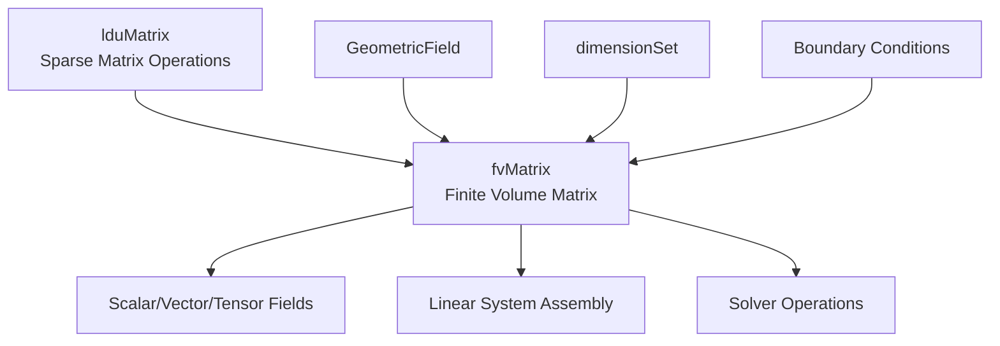
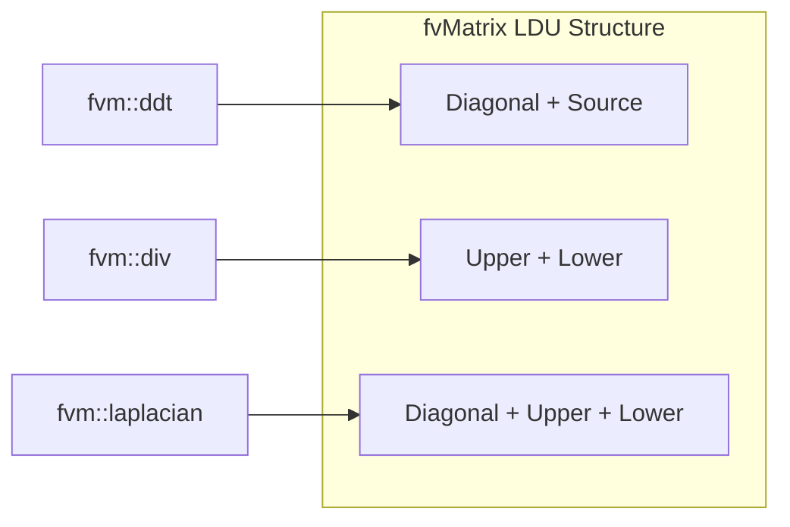

# fvMatrix Architecture

> [!INFO] Overview
> The `fvMatrix` class is OpenFOAM's **finite volume matrix** representation that bridges physical PDEs with discrete linear systems. It extends `lduMatrix` with dimensional consistency, boundary condition integration, and field-aware operations.

---

## 🏗️ Architecture Overview

### Class Hierarchy


> **Figure 1:** ลำดับชั้นความสัมพันธ์ของคลาส `fvMatrix` ที่ขยายความสามารถจากเมทริกซ์เบาบางพื้นฐานไปสู่การเป็นออบเจ็กต์ที่รับรู้ถึงฟิลด์ข้อมูลและมิติทางฟิสิกส์ความปลอดภัยทางฟิสิกส์ไม่ส่งผลกระทบต่อความเร็วในการจำลอง ผ่านการใช้พลังของ C++ Template Metaprogramming ในการตรวจสอบความสอดคล้องทางมิติทั้งหมดที่ขั้นตอนการคอมไพล์โปรแกรมเพียงครั้งเดียว

### Core Design Philosophy

The `fvMatrix` implements a **dimension-aware sparse matrix** system that:

1. **Maintains dimensional consistency** throughout matrix assembly
2. **Integrates boundary conditions** via coefficient separation
3. **Provides field-aware operations** through `psi` reference
4. **Supports automatic differentiation** through implicit/explicit operators

---

## ⚙️ Internal Structure

### Template Definition

```cpp
template<class Type>
class fvMatrix
:
    public tmp<fvMatrix<Type>>::refCount,  // Reference counting for RAII
    public lduMatrix                       // Sparse matrix operations
{
private:
    // Strong reference to solution field
    const GeometricField<Type, fvPatchField, volMesh>& psi_;

    // Dimensional consistency tracking
    dimensionSet dimensions_;

    // Right-hand side vector
    Field<Type> source_;

    // Boundary condition storage
    FieldField<Field, Type> internalCoeffs_;
    FieldField<Field, Type> boundaryCoeffs_;

    // Face flux data for convection
    surfaceScalarField faceFlux_;
};
```

### Key Components

| **Component** | **Type** | **Purpose** |
|---------------|----------|-------------|
| **`psi_`** | `GeometricField` | Field being solved (e.g., pressure, velocity) |
| **`source_`** | `Field<Type>` | Right-hand side vector $\mathbf{b}$ in $\mathbf{Ax} = \mathbf{b}$ |
| **`diag_`** | `Field<scalar>` | Diagonal coefficients from `lduMatrix` |
| **`upper_`** | `Field<scalar>` | Upper triangular coefficients |
| **`lower_`** | `Field<scalar>` | Lower triangular coefficients |
| **`internalCoeffs_`** | `FieldField<Field>` | Internal boundary coefficients |
| **`boundaryCoeffs_`** | `FieldField<Field>` | Boundary coefficients |
| **`dimensions_`** | `dimensionSet` | Dimensional consistency tracking |

---

## 🔍 Matrix Assembly Process

### Equation Discretization

When you write a transport equation in OpenFOAM:

```cpp
fvScalarMatrix TEqn
(
    fvm::ddt(T)                    // Temporal term: ∂T/∂t
  + fvm::div(phi, T)               // Convection: ∇·(UT)
  - fvm::laplacian(DT, T)          // Diffusion: ∇·(k∇T)
 ==
    fvOptions(T)                   // Source terms
);
```

Each operator contributes to the LDU matrix components:


> **Figure 2:** แผนภาพแสดงการกระจายตัวของเทอมต่างๆ ในสมการ Navier-Stokes เข้าสู่โครงสร้าง LDU ของ `fvMatrix` ทั้งในส่วนแนวทแยง (Diagonal) และส่วนนอกแนวทแยง (Upper/Lower)ความปลอดภัยทางฟิสิกส์ไม่ส่งผลกระทบต่อความเร็วในการจำลอง ผ่านการใช้พลังของ C++ Template Metaprogramming ในการตรวจสอบความสอดคล้องทางมิติทั้งหมดที่ขั้นตอนการคอมไพล์โปรแกรมเพียงครั้งเดียว

### Term Contributions

| **Operator** | **Mathematical Form** | **Matrix Contribution** | **Physical Meaning** |
|--------------|----------------------|------------------------|---------------------|
| **`fvm::ddt(φ)`** | $\frac{\partial φ}{\partial t}$ | Diagonal + Source | Temporal derivative |
| **`fvm::div(φ, U)`** | $\nabla \cdot (\mathbf{U} φ)$ | Upper + Lower | Convection |
| **`fvm::laplacian(Γ, φ)`** | $\nabla \cdot (Γ \nabla φ)$ | Diagonal + Upper + Lower | Diffusion |
| **`fvm::Sp(S, φ)`** | $S φ$ | Diagonal | Source linearization |
| **`fvc::SuSp(S, φ)`** | $S(1-φ)$ | Source | Semi-implicit source |

---

## 🔬 Dimension-Aware Operations

### Dimensional Consistency Checking

OpenFOAM enforces dimensional consistency at **compile-time** and **runtime**:

```cpp
template<class Type>
void fvMatrix<Type>::operator+=(const fvMatrix<Type>& fm)
{
    // Runtime dimensional validation
    if (dimensions_ != fm.dimensions_)
    {
        FatalErrorInFunction
            << "Dimensional mismatch in fvMatrix addition: "
            << dimensions_ << " vs " << fm.dimensions_
            << abort(FatalError);
    }

    // Add matrix coefficients via lduMatrix interface
    lduMatrix::operator+=(fm);

    // Add source term
    source_ += fm.source_;
}
```

### Dimension Propagation

```cpp
template<class Type>
void fvMatrix<Type>::operator*=(const dimensioned<scalar>& ds)
{
    // Scale numerical coefficients
    lduMatrix::operator*=(ds.value());
    source_ *= ds.value();

    // Propose dimensional transformation
    dimensions_ *= ds.dimensions();
}
```

> [!TIP] Example: Multiplying Momentum Equation
> Multiplying momentum equation by dynamic viscosity $\mu$ with dimensions $[kg \cdot m^{-1} \cdot s^{-1}]$:
> $$ρ \mathbf{u} \rightarrow μ \nabla^2 \mathbf{u}$$
>
> This transforms the equation **dimensionally** and **physically**.

---

## 🧩 Boundary Condition Integration

### Coefficient Separation Strategy

`fvMatrix` uses **coefficient separation** for efficient boundary handling:

```cpp
template<class Type>
void fvMatrix<Type>::addBoundarySource
(
    Field<Type>& source,
    const bool couples
) const
{
    forAll(psi_.boundaryField(), patchi)
    {
        const fvPatchField<Type>& pf = psi_.boundaryField()[patchi];
        const Field<Type>& pInternalCoeffs = internalCoeffs_[patchi];
        const Field<Type>& pBoundaryCoeffs = boundaryCoeffs_[patchi];

        // Apply patch-specific contributions
        pf.addBoundarySource(source, pInternalCoeffs, pBoundaryCoeffs);
    }
}
```

### Boundary Condition Strategies

| **Type** | **Method** | **Mathematical Form** | **Application** |
|----------|-----------|----------------------|-----------------|
| **Dirichlet (fixedValue)** | Large penalty term | $A_{ii} \leftarrow A_{ii} + 10^{30}$<br>$b_i \leftarrow 10^{30} \cdot g_{BC}$ | Enforce boundary value |
| **Neumann (fixedGradient)** | Gradient contribution to source | $b_i \leftarrow b_i + \nabla g \cdot \mathbf{n} \cdot A_{face}$ | Does not modify diagonal |
| **Robin (mixed)** | Combined contributions | Both matrix and source modified | Combined Dirichlet/Neumann |

### Benefits of Architecture

1. **Assembly Efficiency**: Boundary contributions assembled efficiently while maintaining sparsity
2. **Parallel Processing**: Coefficient separation enables convenient parallelization
3. **Flexible Assembly**: Supports various BC types while maintaining matrix structure

---

## 🔧 Key Methods and Operations

### Matrix Operations

```cpp
// Solve the linear system
TEqn.solve();        // Uses solver specified in fvSolution

// Apply under-relaxation for stability
TEqn.relax();        // Improves convergence

// Access diagonal coefficients
scalarField diag = TEqn.A();  // Diagonal entries

// Compute H-term (off-diagonal contributions)
Field<Type> H = TEqn.H();      // Σ a_ij * φ_j for j ≠ i

// Matrix-vector multiplication
Field<Type> Ax = TEqn & phi;   // A * φ

// Access source term
Field<Type> b = TEqn.source(); // Right-hand side vector
```

### Operator Overloading

```cpp
// Matrix addition
fvMatrix<scalar> combinedEqn = TEqn1 + TEqn2;

// Matrix subtraction
fvMatrix<scalar> diffEqn = TEqn1 - TEqn2;

// Scalar multiplication
fvMatrix<scalar> scaledEqn = 2.0 * TEqn;

// Equation negation
fvMatrix<scalar> negatedEqn = -TEqn;

// Access residual
scalar residual = TEqn.residual();
```

---

## 🎯 Assembly Patterns

### Implicit vs Explicit Operators

| **Namespace** | **Purpose** | **Returns** | **Example** |
|---------------|-------------|-------------|-------------|
| **`fvm`** (finite volume matrix) | Implicit operators | `fvMatrix<Type>` | `fvm::ddt(T)`, `fvm::laplacian(k, T)` |
| **`fvc`** (finite volume calculus) | Explicit operators | `GeometricField` | `fvc::div(phi)`, `fvc::grad(T)` |

### Semi-Implicit Strategy

```cpp
// Semi-implicit energy equation
fvScalarMatrix TEqn =
    fvm::ddt(T) +              // Implicit temporal derivative
    fvc::div(phi, T) ==         // Explicit convection (stability-limited)
    fvm::laplacian(kappa, T);  // Implicit diffusion (unconditionally stable)

// Add source term
TEqn -= sources;

// Solve the linear system
TEqn.solve();
```

### Stability Considerations

- **CFL condition**: $\Delta t \leq \frac{\Delta x}{|\mathbf{U}|}$ (for explicit convection)
- **Diffusion limit**: $\Delta t \leq \frac{\Delta x^2}{2α}$ (for explicit diffusion)

---

## 🧠 Memory Layout and Performance

### LDU Storage Format

The `lduMatrix` base class provides efficient sparse storage:

```cpp
class lduMatrix
{
    // Diagonal coefficients
    scalarField diag_;          // Size: nCells

    // Off-diagonal coefficients
    scalarField upper_;         // Size: nInternalFaces
    scalarField lower_;         // Size: nInternalFaces

    // Addressing arrays
    labelList upperAddr_;       // Owner cell for each face
    labelList lowerAddr_;       // Neighbor cell for each face
};
```

### Memory Complexity

For a 3D CFD mesh with $n$ cells and average connectivity $\bar{k} \approx 15$:

$$
\text{Memory} = n \cdot \text{sizeof(scalar)} + 2 \cdot (\bar{k} \cdot n) \cdot \text{sizeof(scalar)} = 31 \cdot n \cdot 8 \text{ bytes}
$$

**Example**: For $n = 10^6$ cells:
- **Sparse memory**: $\approx 248 \text{ MB}$
- **Dense memory**: $10^6 \times 10^6 \times 8 \text{ bytes} = 8 \text{ TB}$

---

## ⚡ Performance Optimization

### Cache-Friendly Operations

```cpp
// Efficient matrix-vector multiplication
void lduMatrix::Amul
(
    scalarField& Ax,
    const scalarField& x
) const
{
    // Diagonal contribution (contiguous memory)
    forAll(diag_, i)
    {
        Ax[i] = diag_[i] * x[i];
    }

    // Off-diagonal contribution (strided access)
    forAll(upper_, facei)
    {
        label own = upperAddr_[facei];
        label nei = lowerAddr_[facei];

        Ax[own] += upper_[facei] * x[nei];
        Ax[nei] += lower_[facei] * x[own];
    }
}
```

### Loop Ordering for Vectorization

```cpp
// Vectorized operation (compiler-optimized)
#pragma omp simd
for (label i = 0; i < n; i++)
{
    Ax[i] = diag[i] * x[i];
}
```

---

## 🔗 Integration with Solvers

### Solver Performance Tracking

```cpp
class SolverPerformance
{
    scalar initialResidual_;    // Initial residual norm
    scalar finalResidual_;      // Final residual norm
    scalar convergenceTolerance_; // Target tolerance
    label nIterations_;         // Number of iterations
    bool converged_;            // Convergence status
    string solverName_;         // Solver identifier

    // Relative reduction factor
    scalar reduction() const
    {
        return finalResidual_ / initialResidual_;
    }

    // Check convergence criteria
    bool converged() const
    {
        return (finalResidual_ < convergenceTolerance_ ||
                reduction() < relativeTolerance_);
    }
};
```

### Convergence Monitoring

```cpp
SolverPerformance<scalar> solverPerf = TEqn.solve();

if (!solverPerf.converged())
{
    WarningIn("TEqn.solve")
        << "Solver failed to converge:" << nl
        << "  Initial residual: " << solverPerf.initialResidual() << nl
        << "  Final residual: " << solverPerf.finalResidual() << nl
        << "  No. iterations: " << solverPerf.nIterations() << endl;
}
```

---

## 📊 Common Applications

### 1. Heat Transfer

```cpp
// Energy equation with source
fvScalarMatrix TEqn
(
    fvm::ddt(T)
  + fvm::div(phi, T)
  - fvm::laplacian(alpha, T)
 ==
    fvOptions(T)
);
TEqn.relax();
TEqn.solve();
```

### 2. Fluid Flow (SIMPLE)

```cpp
// Momentum equation
fvVectorMatrix UEqn
(
    fvm::ddt(U)
  + fvm::div(phi, U)
  - fvm::laplacian(nu, U)
 ==
    fvOptions(U)
);
UEqn.relax();

// Pressure equation
fvScalarMatrix pEqn
(
    fvm::laplacian(rAU, p) == fvc::div(phi)
);
pEqn.setReference(pRefCell, pRefValue);
pEqn.solve();
```

### 3. Turbulence Modeling

```cpp
// k-omega SST turbulence model
fvScalarMatrix kEqn
(
    fvm::ddt(k)
  + fvm::div(phi, k)
  - fvm::laplacian(DkEff, k)
 ==
    Pk - fvm::Sp(betaStar*omega, k)
);
kEqn.relax();
kEqn.solve();
```

---

## ⚠️ Common Pitfalls and Solutions

### Pitfall 1: Dimensional Inconsistency

```cpp
// ❌ WRONG: Adding incompatible dimensions
fvScalarMatrix pEqn = fvm::laplacian(p);
fvVectorMatrix UEqn = fvm::ddt(U);
auto wrong = pEqn + UEqn;  // Dimensional mismatch!
```

```cpp
// ✅ CORRECT: Check dimensions before operations
if (pEqn.dimensions() == UEqn.dimensions())
{
    auto result = pEqn + UEqn;
}
```

### Pitfall 2: Inadequate Under-Relaxation

```cpp
// ❌ WRONG: No relaxation for unstable system
TEqn.solve();  // May diverge
```

```cpp
// ✅ CORRECT: Apply under-relaxation
TEqn.relax();  // Improves stability
TEqn.solve();
```

### Pitfall 3: Ignoring Boundary Conditions

```cpp
// ❌ WRONG: Not setting reference for pressure
fvScalarMatrix pEqn = fvm::laplacian(p);
pEqn.solve();  // Singular matrix!
```

```cpp
// ✅ CORRECT: Set reference cell
pEqn.setReference(pRefCell, pRefValue);
pEqn.solve();
```

---

## 🎯 Key Takeaways

> [!SUCCESS] Fundamental Concepts
> 1. **`fvMatrix` is a temporary object** created and destroyed each iteration
> 2. **Transforms physical intent** into numerical linear systems
> 3. **Maintains dimensional consistency** automatically
> 4. **Separates boundary coefficients** for efficient assembly
> 5. **Provides solver-agnostic interface** for runtime flexibility

### Design Principles

- **RAII memory management** through reference counting
- **Dimensional safety** enforced at compile and runtime
- **Operator overloading** for mathematical syntax
- **Template-based design** for type flexibility
- **Sparse matrix storage** for CFD-scale problems

### When to Use fvMatrix

✅ **Use** when solving discretized PDEs on finite volume meshes
✅ **Use** for implicit time integration
✅ **Use** when boundary conditions are complex
✅ **Use** for coupled physics problems

❌ **Avoid** for small dense systems (use `SquareMatrix`)
❌ **Avoid** for explicit field operations (use `fvc`)
❌ **Avoid** for purely algebraic operations (use tensors)

---

## 🔗 Related Topics

- [[Sparse Matrix Storage]] - LDU matrix format
- [[Linear Solvers]] - Krylov subspace methods
- [[Preconditioning]] - Diagonal, ILU, AMG
- [[Boundary Conditions]] - Patch field implementation
- [[Numerical Schemes]] - Discretization strategies
