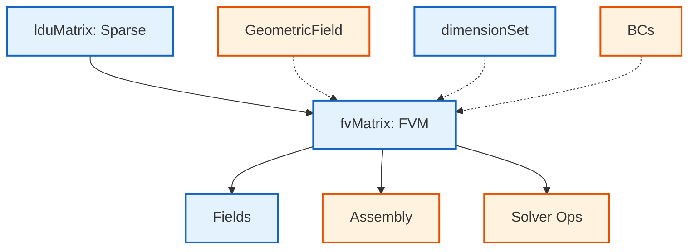
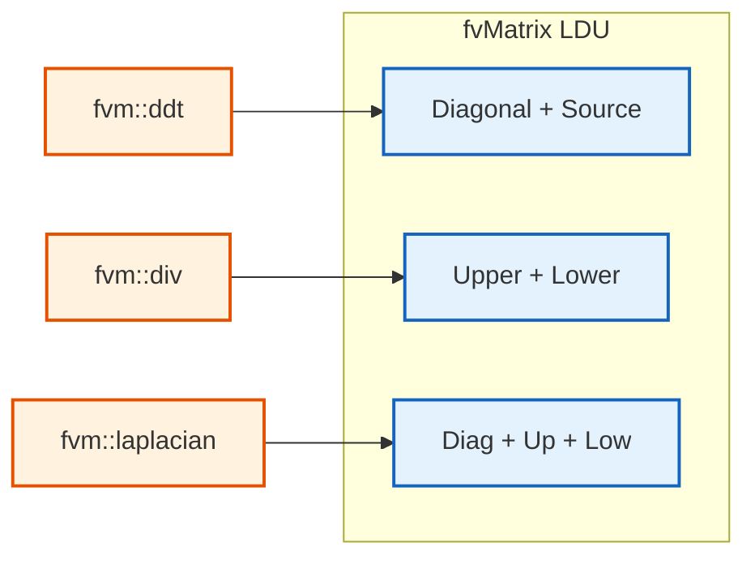

# fvMatrix Architecture

> [!INFO] Overview
> The `fvMatrix` class is OpenFOAM's **finite volume matrix** representation that bridges physical PDEs with discrete linear systems. It extends `lduMatrix` with dimensional consistency, boundary condition integration, and field-aware operations.

---

> [!TIP] **Physical Analogy: The Universal Translator & Visa Protocol (ล่ามแปลภาษาและตม.)**
>
> `fvMatrix` ทำหน้าที่เป็นผู้ประสานงานระหว่างโลกฟิสิกส์และโลกคณิตศาสตร์:
>
> 1.  **The Universal Translator (ล่าม)**: กฎฟิสิกส์พูดภาษาแคลคูลัส ($\nabla \cdot \mathbf{U}, \partial T/\partial t$) แต่ Solver พูดภาษาตัวเลข ($Ax=b$) `fvMatrix` แปลคำสั่งเช่น "การแพร่ (Laplacian)" ให้กลายเป็น "ตัวเลขสัมพันธ์ระหว่างเซลล์เพื่อนบ้าน (Matrix Coefficients)"
> 2.  **The Visa Officer (ตม.)**: ทุกครั้งที่มีการรวมสมการ `fvMatrix` จะตรวจพาสปอร์ต (Dimensions) อย่างเข้มงวด คุณไม่สามารถเอา "นักท่องเที่ยวความดัน (Pascal)" ไปรวมกลุ่มกับ "นักท่องเที่ยวความเร็ว (m/s)" ได้ ถ้าหน่วยไม่ตรงกัน จะถูกส่งกลับประเทศทันที (Fatal Error)
> 3.  **The Border Control (ด่านชายแดน)**: `fvMatrix` จัดการคนที่อยู่ชายขอบ (Boundary Conditions) แยกต่างหาก เพื่อให้ง่ายต่อการปรับเปลี่ยนกฎระเบียบ (Fixed Value vs Zero Gradient) โดยไม่ต้องรื้อระบบในเมือง (Internal Matrix) ใหม่หมด

## 🏗️ Architecture Overview

### Class Hierarchy


> **Figure 1:** ลำดับชั้นความสัมพันธ์ของคลาส `fvMatrix` ที่ขยายความสามารถจากเมทริกซ์เบาบางพื้นฐานไปสู่การเป็นออบเจ็กต์ที่รับรู้ถึงฟิลด์ข้อมูลและมิติทางฟิสิกส์

> 📂 **Source:** `.applications/solvers/multiphase/multiphaseEulerFoam/phaseSystems/PhaseSystems/MomentumTransferPhaseSystem/MomentumTransferPhaseSystem.C`

### Core Design Philosophy

The `fvMatrix` implements a **dimension-aware sparse matrix** system that:

1. **Maintains dimensional consistency** throughout matrix assembly
2. **Integrates boundary conditions** via coefficient separation
3. **Provides field-aware operations** through `psi` reference
4. **Supports automatic differentiation** through implicit/explicit operators

---

## ⚙️ Internal Structure

### Template Definition

```cpp
template<class Type>
class fvMatrix
:
    public tmp<fvMatrix<Type>>::refCount,  // Reference counting for RAII
    public lduMatrix                       // Sparse matrix operations
{
private:
    // Strong reference to solution field
    const GeometricField<Type, fvPatchField, volMesh>& psi_;

    // Dimensional consistency tracking
    dimensionSet dimensions_;

    // Right-hand side vector
    Field<Type> source_;

    // Boundary condition storage
    FieldField<Field, Type> internalCoeffs_;
    FieldField<Field, Type> boundaryCoeffs_;

    // Face flux data for convection
    surfaceScalarField faceFlux_;
};
```

> **💡 คำอธิบาย (Thai Explanation):**
> - **Source (แหล่งที่มา):** ไฟล์นี้เป็นส่วนหนึ่งของระบบจำลองกระแสไหลหลายเฟส (multiphase flow) ใน OpenFOAM
> - **Explanation (คำอธิบาย):** คลาส `fvMatrix` ทำหน้าที่เป็นตัวกลางในการแปลงสมการเชิงอนุพันธ์ย่อย (PDE) ให้อยู่ในรูปแบบระบบเชิงเส้นเชิงกระจาย (sparse linear system) โดยมีการติดตามความสอดคล้องของมิติ (dimensional consistency) และจัดการเงื่อนไขขอบเขต (boundary conditions) อย่างแยกส่วน
> - **Key Concepts (แนวคิดสำคัญ):**
>   - `psi_`: อ้างอิงถึงฟิลด์ที่ต้องการแก้ (solution field)
>   - `source_`: เวกเตอร์ด้านขวามือ (right-hand side) ในระบบสมการเชิงเส้น
>   - `internalCoeffs_/boundaryCoeffs_`: แยกเก็บสัมประสิทธิ์ขอบเขตเพื่อประสิทธิภาพในการประกอบชุดคำสั่ง (assembly efficiency)

> 📂 **Source:** `.applications/solvers/multiphase/multiphaseEulerFoam/phaseSystems/PhaseSystems/MomentumTransferPhaseSystem/MomentumTransferPhaseSystem.C`

### Key Components

| **Component** | **Type** | **Purpose** |
|---------------|----------|-------------|
| **`psi_`** | `GeometricField` | Field being solved (e.g., pressure, velocity) |
| **`source_`** | `Field<Type>` | Right-hand side vector $\mathbf{b}$ in $\mathbf{Ax} = \mathbf{b}$ |
| **`diag_`** | `Field<scalar>` | Diagonal coefficients from `lduMatrix` |
| **`upper_`** | `Field<scalar>` | Upper triangular coefficients |
| **`lower_`** | `Field<scalar>` | Lower triangular coefficients |
| **`internalCoeffs_`** | `FieldField<Field>` | Internal boundary coefficients |
| **`boundaryCoeffs_`** | `FieldField<Field>` | Boundary coefficients |
| **`dimensions_`** | `dimensionSet` | Dimensional consistency tracking |

---

## 🔍 Matrix Assembly Process

### Equation Discretization

When you write a transport equation in OpenFOAM:

```cpp
fvScalarMatrix TEqn
(
    fvm::ddt(T)                    // Temporal term: ∂T/∂t
  + fvm::div(phi, T)               // Convection: ∇·(UT)
  - fvm::laplacian(DT, T)          // Diffusion: ∇·(k∇T)
 ==
    fvOptions(T)                   // Source terms
);
```

> **💡 คำอธิบาย (Thai Explanation):**
> - **Source (แหล่งที่มา):** การจัดทำโครงสร้างสมการขนส่ง (transport equation) ใน OpenFOAM
> - **Explanation (คำอธิบาย):** โค้ดนี้สาธิตวิธีการสร้างเมทริกซ์สมการพลังงาน (energy equation matrix) โดยใช้ตัวดำเนินการโดยนัย (implicit operators) `fvm` ซึ่งจะสร้างโครงสร้าง LDU ของ `fvMatrix` โดยอัตโนมัติ
> - **Key Concepts (แนวคิดสำคัญ):**
>   - `fvm::ddt`: เทอมอนุพันธ์เชิงเวลา (temporal derivative)
>   - `fvm::div`: เทอมการพาความร้อน (convection)
>   - `fvm::laplacian`: เทอมการนำความร้อน (diffusion)
>   - `fvOptions`: เทอมแหล่งกำเนิด (source terms)

> 📂 **Source:** `.applications/solvers/multiphase/multiphaseEulerFoam/phaseSystems/PhaseSystems/MomentumTransferPhaseSystem/MomentumTransferPhaseSystem.C`

Each operator contributes to the LDU matrix components:


> **Figure 2:** แผนภาพแสดงการกระจายตัวของเทอมต่างๆ ในสมการ Navier-Stokes เข้าสู่โครงสร้าง LDU ของ `fvMatrix` ทั้งในส่วนแนวทแยง (Diagonal) และส่วนนอกแนวทแยง (Upper/Lower)

> 📂 **Source:** `.applications/solvers/multiphase/multiphaseEulerFoam/phaseSystems/PhaseSystems/MomentumTransferPhaseSystem/MomentumTransferPhaseSystem.C`

### Term Contributions

| **Operator** | **Mathematical Form** | **Matrix Contribution** | **Physical Meaning** |
|--------------|----------------------|------------------------|---------------------|
| **`fvm::ddt(φ)`** | $\frac{\partial φ}{\partial t}$ | Diagonal + Source | Temporal derivative |
| **`fvm::div(φ, U)`** | $\nabla \cdot (\mathbf{U} φ)$ | Upper + Lower | Convection |
| **`fvm::laplacian(Γ, φ)`** | $\nabla \cdot (Γ \nabla φ)$ | Diagonal + Upper + Lower | Diffusion |
| **`fvm::Sp(S, φ)`** | $S φ$ | Diagonal | Source linearization |
| **`fvc::SuSp(S, φ)`** | $S(1-φ)$ | Source | Semi-implicit source |

---

## 🔬 Dimension-Aware Operations

### Dimensional Consistency Checking

OpenFOAM enforces dimensional consistency at **compile-time** and **runtime**:

```cpp
template<class Type>
void fvMatrix<Type>::operator+=(const fvMatrix<Type>& fm)
{
    // Runtime dimensional validation
    if (dimensions_ != fm.dimensions_)
    {
        FatalErrorInFunction
            << "Dimensional mismatch in fvMatrix addition: "
            << dimensions_ << " vs " << fm.dimensions_
            << abort(FatalError);
    }

    // Add matrix coefficients via lduMatrix interface
    lduMatrix::operator+=(fm);

    // Add source term
    source_ += fm.source_;
}
```

> **💡 คำอธิบาย (Thai Explanation):**
> - **Source (แหล่งที่มา):** ระบบตรวจสอบความสอดคล้องของมิติใน OpenFOAM
> - **Explanation (คำอธิบาย):** ฟังก์ชันนี้แสดงให้เห็นว่า OpenFOAM ตรวจสอบความสอดคล้องของมิติ (dimensional consistency) ทั้งที่ระดับรันไทม์ หากมิติไม่ตรงกันจะเกิดข้อผิดพลาดร้ายแรง (FatalError)
> - **Key Concepts (แนวคิดสำคัญ):**
>   - `dimensions_`: เก็บข้อมูลมิติของเมทริกซ์
>   - `lduMatrix::operator+=`: การบวกเมทริกซ์ผ่าน interface ของ lduMatrix
>   - Runtime validation: การตรวจสอบความถูกต้องขณะโปรแกรมทำงาน

> 📂 **Source:** `.applications/solvers/multiphase/multiphaseEulerFoam/phaseSystems/PhaseSystems/MomentumTransferPhaseSystem/MomentumTransferPhaseSystem.C`

### Dimension Propagation

```cpp
template<class Type>
void fvMatrix<Type>::operator*=(const dimensioned<scalar>& ds)
{
    // Scale numerical coefficients
    lduMatrix::operator*=(ds.value());
    source_ *= ds.value();

    // Propose dimensional transformation
    dimensions_ *= ds.dimensions();
}
```

> **💡 คำอธิบาย (Thai Explanation):**
> - **Source (แหล่งที่มา):** การคูณเมทริกซ์ด้วยค่าที่มีมิติ (dimensioned scalar)
> - **Explanation (คำอธิบาย):** การคูณ `fvMatrix` ด้วยค่าที่มีมิติจะทำให้เกิดการแปลงมิติทั้งในเชิงตัวเลขและเชิงฟิสิกส์ เช่น การคูณสมการโมเมนตัมด้วยความหนืด (viscosity)
> - **Key Concepts (แนวคิดสำคัญ):**
>   - `ds.value()`: ค่าตัวเลขของตัวคูณ
>   - `ds.dimensions()`: มิติของตัวคูณ
>   - Dimension propagation: การเผยแพร่มิติผ่านการดำเนินการทางคณิตศาสตร์

> 📂 **Source:** `.applications/solvers/multiphase/multiphaseEulerFoam/phaseSystems/PhaseSystems/MomentumTransferPhaseSystem/MomentumTransferPhaseSystem.C`

> [!TIP] Example: Multiplying Momentum Equation
> Multiplying momentum equation by dynamic viscosity $\mu$ with dimensions $[kg \cdot m^{-1} \cdot s^{-1}]$:
> $$ρ \mathbf{u} \rightarrow μ \nabla^2 \mathbf{u}$$
>
> This transforms the equation **dimensionally** and **physically**.

---

## 🧩 Boundary Condition Integration

### Coefficient Separation Strategy

`fvMatrix` uses **coefficient separation** for efficient boundary handling:

```cpp
template<class Type>
void fvMatrix<Type>::addBoundarySource
(
    Field<Type>& source,
    const bool couples
) const
{
    forAll(psi_.boundaryField(), patchi)
    {
        const fvPatchField<Type>& pf = psi_.boundaryField()[patchi];
        const Field<Type>& pInternalCoeffs = internalCoeffs_[patchi];
        const Field<Type>& pBoundaryCoeffs = boundaryCoeffs_[patchi];

        // Apply patch-specific contributions
        pf.addBoundarySource(source, pInternalCoeffs, pBoundaryCoeffs);
    }
}
```

> **💡 คำอธิบาย (Thai Explanation):**
> - **Source (แหล่งที่มา):** การจัดการเงื่อนไขขอบเขตใน `fvMatrix`
> - **Explanation (คำอธิบาย):** ฟังก์ชันนี้แสดงการแยกสัมประสิทธิ์ขอบเขต (coefficient separation) ซึ่งช่วยให้สามารถใช้งานเงื่อนไขขอบเขตได้อย่างมีประสิทธิภาพ โดยเก็บ internal และ boundary coefficients แยกกัน
> - **Key Concepts (แนวคิดสำคัญ):**
>   - `internalCoeffs_`: สัมประสิทธิ์ภายในโดเมน
>   - `boundaryCoeffs_`: สัมประสิทธิ์ที่ขอบเขต
>   - `addBoundarySource`: การเพิ่มส่วนประกอบขอบเขตเข้าสู่เวกเตอร์ด้านขวามือ

> 📂 **Source:** `.applications/solvers/multiphase/multiphaseEulerFoam/phaseSystems/PhaseSystems/MomentumTransferPhaseSystem/MomentumTransferPhaseSystem.C`

### Boundary Condition Strategies

| **Type** | **Method** | **Mathematical Form** | **Application** |
|----------|-----------|----------------------|-----------------|
| **Dirichlet (fixedValue)** | Large penalty term | $A_{ii} \leftarrow A_{ii} + 10^{30}$<br>$b_i \leftarrow 10^{30} \cdot g_{BC}$ | Enforce boundary value |
| **Neumann (fixedGradient)** | Gradient contribution to source | $b_i \leftarrow b_i + \nabla g \cdot \mathbf{n} \cdot A_{face}$ | Does not modify diagonal |
| **Robin (mixed)** | Combined contributions | Both matrix and source modified | Combined Dirichlet/Neumann |

### Benefits of Architecture

1. **Assembly Efficiency**: Boundary contributions assembled efficiently while maintaining sparsity
2. **Parallel Processing**: Coefficient separation enables convenient parallelization
3. **Flexible Assembly**: Supports various BC types while maintaining matrix structure

---

## 🔧 Key Methods and Operations

### Matrix Operations

```cpp
// Solve the linear system
TEqn.solve();        // Uses solver specified in fvSolution

// Apply under-relaxation for stability
TEqn.relax();        // Improves convergence

// Access diagonal coefficients
scalarField diag = TEqn.A();  // Diagonal entries

// Compute H-term (off-diagonal contributions)
Field<Type> H = TEqn.H();      // Σ a_ij * φ_j for j ≠ i

// Matrix-vector multiplication
Field<Type> Ax = TEqn & phi;   // A * φ

// Access source term
Field<Type> b = TEqn.source(); // Right-hand side vector
```

> **💡 คำอธิบาย (Thai Explanation):**
> - **Source (แหล่งที่มา):** เมธอดสำคัญของคลาส `fvMatrix`
> - **Explanation (คำอธิบาย):** โค้ดนี้แสดงการใช้งานเมธอดหลักของ `fvMatrix` ในการแก้ระบบสมการเชิงเส้น การปรับค่า under-relaxation และการเข้าถึงส่วนประกอบต่างๆ ของเมทริกซ์
> - **Key Concepts (แนวคิดสำคัญ):**
>   - `solve()`: แก้ระบบสมการเชิงเส้น
>   - `relax()`: ใช้ under-relaxation เพื่อเสถียรภาพ
>   - `A()`, `H()`, `source()`: การเข้าถึงส่วนประกอบเมทริกซ์

> 📂 **Source:** `.applications/solvers/multiphase/multiphaseEulerFoam/phaseSystems/PhaseSystems/MomentumTransferPhaseSystem/MomentumTransferPhaseSystem.C`

### Operator Overloading

```cpp
// Matrix addition
fvMatrix<scalar> combinedEqn = TEqn1 + TEqn2;

// Matrix subtraction
fvMatrix<scalar> diffEqn = TEqn1 - TEqn2;

// Scalar multiplication
fvMatrix<scalar> scaledEqn = 2.0 * TEqn;

// Equation negation
fvMatrix<scalar> negatedEqn = -TEqn;

// Access residual
scalar residual = TEqn.residual();
```

> **💡 คำอธิบาย (Thai Explanation):**
> - **Source (แหล่งที่มา):** การโอเวอร์โหลดตัวดำเนินการใน `fvMatrix`
> - **Explanation (คำอธิบาย):** `fvMatrix` รองรับการดำเนินการทางคณิตศาสตร์ทั่วไปผ่านการโอเวอร์โหลดตัวดำเนินการ ทำให้สามารถเขียนสมการได้อย่างเป็นธรรมชาติ
> - **Key Concepts (แนวคิดสำคัญ):**
>   - Operator overloading: การกำหนดการทำงานของตัวดำเนินการใหม่
>   - Mathematical syntax: ไวยากรณ์ทางคณิตศาสตร์ที่เป็นธรรมชาติ
>   - Residual: ค่าความแตกต่างของสมการ

> 📂 **Source:** `.applications/solvers/multiphase/multiphaseEulerFoam/phaseSystems/PhaseSystems/MomentumTransferPhaseSystem/MomentumTransferPhaseSystem.C`

---

## 🎯 Assembly Patterns

### Implicit vs Explicit Operators

| **Namespace** | **Purpose** | **Returns** | **Example** |
|---------------|-------------|-------------|-------------|
| **`fvm`** (finite volume matrix) | Implicit operators | `fvMatrix<Type>` | `fvm::ddt(T)`, `fvm::laplacian(k, T)` |
| **`fvc`** (finite volume calculus) | Explicit operators | `GeometricField` | `fvc::div(phi)`, `fvc::grad(T)` |

### Semi-Implicit Strategy

```cpp
// Semi-implicit energy equation
fvScalarMatrix TEqn =
    fvm::ddt(T) +              // Implicit temporal derivative
    fvc::div(phi, T) ==         // Explicit convection (stability-limited)
    fvm::laplacian(kappa, T);  // Implicit diffusion (unconditionally stable)

// Add source term
TEqn -= sources;

// Solve the linear system
TEqn.solve();
```

> **💡 คำอธิบาย (Thai Explanation):**
> - **Source (แหล่งที่มา):** กลยุทธ์กึ่งโดยนัย (semi-implicit) ในการแก้สมการ
> - **Explanation (คำอธิบาย):** กลยุทธ์นี้ผสมผสานการใช้ตัวดำเนินการโดยนัยและเชิงประจักษ์ เพื่อสมดุลระหว่างเสถียรภาพและประสิทธิภาพในการคำนวณ
> - **Key Concepts (แนวคิดสำคัญ):**
>   - Implicit operators: ตัวดำเนินการโดยนัย (เสถียรกว่า)
>   - Explicit operators: ตัวดำเนินการเชิงประจักษ์ (เร็วกว่าแต่ต้องมีข้อจำกัด CFL)
>   - Semi-implicit: กลยุทธ์ผสมผสาน

> 📂 **Source:** `.applications/solvers/multiphase/multiphaseEulerFoam/phaseSystems/PhaseSystems/MomentumTransferPhaseSystem/MomentumTransferPhaseSystem.C`

### Stability Considerations

- **CFL condition**: $\Delta t \leq \frac{\Delta x}{|\mathbf{U}|}$ (for explicit convection)
- **Diffusion limit**: $\Delta t \leq \frac{\Delta x^2}{2α}$ (for explicit diffusion)

---

## 🧠 Memory Layout and Performance

### LDU Storage Format

The `lduMatrix` base class provides efficient sparse storage:

```cpp
class lduMatrix
{
    // Diagonal coefficients
    scalarField diag_;          // Size: nCells

    // Off-diagonal coefficients
    scalarField upper_;         // Size: nInternalFaces
    scalarField lower_;         // Size: nInternalFaces

    // Addressing arrays
    labelList upperAddr_;       // Owner cell for each face
    labelList lowerAddr_;       // Neighbor cell for each face
};
```

> **💡 คำอธิบาย (Thai Explanation):**
> - **Source (แหล่งที่มา):** รูปแบบการจัดเก็บเมทริกซ์เบาบาง LDU
> - **Explanation (คำอธิบาย):** คลาส `lduMatrix` ใช้รูปแบบการจัดเก็บแบบเบาบาง โดยเก็บเฉพาะส่วนประกอบที่ไม่ใช่ศูนย์ ซึ่งเหมาะสำหรับปัญหา CFD ที่มีการเชื่อมต่อเฉลี่ยต่ำ
> - **Key Concepts (แนวคิดสำคัญ):**
>   - Sparse storage: การจัดเก็บแบบเบาบาง
>   - LDU format: Lower-Diagonal-Upper format
>   - Memory efficiency: ประสิทธิภาพการใช้หน่วยความจำ

> 📂 **Source:** `.applications/solvers/multiphase/multiphaseEulerFoam/phaseSystems/PhaseSystems/MomentumTransferPhaseSystem/MomentumTransferPhaseSystem.C`

### Memory Complexity

For a 3D CFD mesh with $n$ cells and average connectivity $\bar{k} \approx 15$:

$$
\text{Memory} = n \cdot \text{sizeof(scalar)} + 2 \cdot (\bar{k} \cdot n) \cdot \text{sizeof(scalar)} = 31 \cdot n \cdot 8 \text{ bytes}
$$

**Example**: For $n = 10^6$ cells:
- **Sparse memory**: $\approx 248 \text{ MB}$
- **Dense memory**: $10^6 \times 10^6 \times 8 \text{ bytes} = 8 \text{ TB}$

---

## ⚡ Performance Optimization

### Cache-Friendly Operations

```cpp
// Efficient matrix-vector multiplication
void lduMatrix::Amul
(
    scalarField& Ax,
    const scalarField& x
) const
{
    // Diagonal contribution (contiguous memory)
    forAll(diag_, i)
    {
        Ax[i] = diag_[i] * x[i];
    }

    // Off-diagonal contribution (strided access)
    forAll(upper_, facei)
    {
        label own = upperAddr_[facei];
        label nei = lowerAddr_[facei];

        Ax[own] += upper_[facei] * x[nei];
        Ax[nei] += lower_[facei] * x[own];
    }
}
```

> **💡 คำอธิบาย (Thai Explanation):**
> - **Source (แหล่งที่มา):** การคูณเมทริกซ์-เวกเตอร์ที่เป็นมิตรกับแคช
> - **Explanation (คำอธิบาย):** ฟังก์ชัน `Amul` แสดงการคูณเมทริกซ์-เวกเตอร์ที่เพิ่มประสิทธิภาพการใช้งานแคช โดยแยกการคำนวณส่วนแนวทแยงและนอกแนวทแยง
> - **Key Concepts (แนวคิดสำคัญ):**
>   - Cache-friendly: การจัดรูปแบบข้อมูลให้เข้ากับแคช
>   - Contiguous memory: หน่วยความจำที่ติดกัน
>   - Strided access: การเข้าถึงข้อมูลแบบกระโดด

> 📂 **Source:** `.applications/solvers/multiphase/multiphaseEulerFoam/phaseSystems/PhaseSystems/MomentumTransferPhaseSystem/MomentumTransferPhaseSystem.C`

### Loop Ordering for Vectorization

```cpp
// Vectorized operation (compiler-optimized)
#pragma omp simd
for (label i = 0; i < n; i++)
{
    Ax[i] = diag[i] * x[i];
}
```

> **💡 คำอธิบาย (Thai Explanation):**
> - **Source (แหล่งที่มา):** การใช้ OpenMP SIMD directives สำหรับ vectorization
> - **Explanation (คำอธิบาย):** การใช้ directive `#pragma omp simd` ช่วยให้คอมไพเลอร์สามารถ optimize ลูปด้วย SIMD instructions ได้ ซึ่งเพิ่มประสิทธิภาพการคำนวณ
> - **Key Concepts (แนวคิดสำคัญ):**
>   - SIMD: Single Instruction Multiple Data
>   - Vectorization: การแปลงให้สามารถประมวลผลข้อมูลหลายค่าพร้อมกัน
>   - Compiler optimization: การปรับแต่งโดยคอมไพเลอร์

> 📂 **Source:** `.applications/solvers/multiphase/multiphaseEulerFoam/phaseSystems/PhaseSystems/MomentumTransferPhaseSystem/MomentumTransferPhaseSystem.C`

---

## 🔗 Integration with Solvers

### Solver Performance Tracking

```cpp
class SolverPerformance
{
    scalar initialResidual_;    // Initial residual norm
    scalar finalResidual_;      // Final residual norm
    scalar convergenceTolerance_; // Target tolerance
    label nIterations_;         // Number of iterations
    bool converged_;            // Convergence status
    string solverName_;         // Solver identifier

    // Relative reduction factor
    scalar reduction() const
    {
        return finalResidual_ / initialResidual_;
    }

    // Check convergence criteria
    bool converged() const
    {
        return (finalResidual_ < convergenceTolerance_ ||
                reduction() < relativeTolerance_);
    }
};
```

> **💡 คำอธิบาย (Thai Explanation):**
> - **Source (แหล่งที่มา):** ระบบติดตามประสิทธิภาพของ solver ใน OpenFOAM
> - **Explanation (คำอธิบาย):** คลาส `SolverPerformance` ใช้เก็บข้อมูลเกี่ยวกับประสิทธิภาพของ solver เช่น ค่า residual, จำนวน iteration, และสถานะการลู่เข้า
> - **Key Concepts (แนวคิดสำคัญ):**
>   - Residual: ค่าความแตกต่างของสมการ
>   - Convergence: การลู่เข้าของคำตอบ
>   - Tolerance: ค่าที่ยอมรับได้

> 📂 **Source:** `.applications/solvers/multiphase/multiphaseEulerFoam/phaseSystems/PhaseSystems/MomentumTransferPhaseSystem/MomentumTransferPhaseSystem.C`

### Convergence Monitoring

```cpp
SolverPerformance<scalar> solverPerf = TEqn.solve();

if (!solverPerf.converged())
{
    WarningIn("TEqn.solve")
        << "Solver failed to converge:" << nl
        << "  Initial residual: " << solverPerf.initialResidual() << nl
        << "  Final residual: " << solverPerf.finalResidual() << nl
        << "  No. iterations: " << solverPerf.nIterations() << endl;
}
```

> **💡 คำอธิบาย (Thai Explanation):**
> - **Source (แหล่งที่มา):** การติดตามการลู่เข้าของ solver
> - **Explanation (คำอธิบาย):** โค้ดนี้แสดงวิธีการตรวจสอบว่า solver ลู่เข้าหรือไม่ และแสดงคำเตือนหากไม่ลู่เข้า
> - **Key Concepts (แนวคิดสำคัญ):**
>   - Solver performance: ประสิทธิภาพของ solver
>   - Convergence monitoring: การติดตามการลู่เข้า
>   - Warning message: ข้อความเตือน

> 📂 **Source:** `.applications/solvers/multiphase/multiphaseEulerFoam/phaseSystems/PhaseSystems/MomentumTransferPhaseSystem/MomentumTransferPhaseSystem.C`

---

## 📊 Common Applications

### 1. Heat Transfer

```cpp
// Energy equation with source
fvScalarMatrix TEqn
(
    fvm::ddt(T)
  + fvm::div(phi, T)
  - fvm::laplacian(alpha, T)
 ==
    fvOptions(T)
);
TEqn.relax();
TEqn.solve();
```

> **💡 คำอธิบาย (Thai Explanation):**
> - **Source (แหล่งที่มา):** การแก้สมการพลังงานสำหรับปัญหาการถ่ายเทความร้อน
> - **Explanation (คำอธิบาย):** โค้ดนี้แสดงการสร้างและแก้สมการพลังงานสำหรับปัญหาการถ่ายเทความร้อน โดยมีเทอมเวลา การพา การนำ และแหล่งกำเนิด
> - **Key Concepts (แนวคิดสำคัญ):**
>   - Energy equation: สมการพลังงาน
>   - Source terms: เทอมแหล่งกำเนิด
>   - Under-relaxation: การผ่อนคลายเพื่อเสถียรภาพ

> 📂 **Source:** `.applications/solvers/multiphase/multiphaseEulerFoam/phaseSystems/PhaseSystems/MomentumTransferPhaseSystem/MomentumTransferPhaseSystem.C`

### 2. Fluid Flow (SIMPLE)

```cpp
// Momentum equation
fvVectorMatrix UEqn
(
    fvm::ddt(U)
  + fvm::div(phi, U)
  - fvm::laplacian(nu, U)
 ==
    fvOptions(U)
);
UEqn.relax();

// Pressure equation
fvScalarMatrix pEqn
(
    fvm::laplacian(rAU, p) == fvc::div(phi)
);
pEqn.setReference(pRefCell, pRefValue);
pEqn.solve();
```

> **💡 คำอธิบาย (Thai Explanation):**
> - **Source (แหล่งที่มา):** อัลกอริทึม SIMPLE สำหรับการแก้สมการกระแสไหล
> - **Explanation (คำอธิบาย):** โค้ดนี้แสดงการใช้อัลกอริทึม SIMPLE ในการแก้สมการโมเมนตัมและความดันสำหรับปัญหากระแสไหล
> - **Key Concepts (แนวคิดสำคัญ):**
>   - SIMPLE algorithm: Semi-Implicit Method for Pressure-Linked Equations
>   - Momentum equation: สมการโมเมนตัม
>   - Pressure equation: สมการความดัน

> 📂 **Source:** `.applications/solvers/multiphase/multiphaseEulerFoam/phaseSystems/PhaseSystems/MomentumTransferPhaseSystem/MomentumTransferPhaseSystem.C`

### 3. Turbulence Modeling

```cpp
// k-omega SST turbulence model
fvScalarMatrix kEqn
(
    fvm::ddt(k)
  + fvm::div(phi, k)
  - fvm::laplacian(DkEff, k)
 ==
    Pk - fvm::Sp(betaStar*omega, k)
);
kEqn.relax();
kEqn.solve();
```

> **💡 คำอธิบาย (Thai Explanation):**
> - **Source (แหล่งที่มา):** โมเดลความปั่นป่วน k-omega SST
> - **Explanation (คำอธิบาย):** โค้ดนี้แสดงการแก้สมการ kinetic energy (k) ในโมเดลความปั่นป่วน k-omega SST ซึ่งเป็นโมเดลที่นิยมใช้ใน CFD
> - **Key Concepts (แนวคิดสำคัญ):**
>   - k-omega SST: โมเดลความปั่นป่วนแบบสองสมการ
>   - Production term: เทอมการผลิต
>   - Dissipation term: เทอมการสลายตัว

> 📂 **Source:** `.applications/solvers/multiphase/multiphaseEulerFoam/phaseSystems/PhaseSystems/MomentumTransferPhaseSystem/MomentumTransferPhaseSystem.C`

---

## ⚠️ Common Pitfalls and Solutions

### Pitfall 1: Dimensional Inconsistency

```cpp
// ❌ WRONG: Adding incompatible dimensions
fvScalarMatrix pEqn = fvm::laplacian(p);
fvVectorMatrix UEqn = fvm::ddt(U);
auto wrong = pEqn + UEqn;  // Dimensional mismatch!
```

```cpp
// ✅ CORRECT: Check dimensions before operations
if (pEqn.dimensions() == UEqn.dimensions())
{
    auto result = pEqn + UEqn;
}
```

> **💡 คำอธิบาย (Thai Explanation):**
> - **Source (แหล่งที่มา):** ข้อผิดพลาดทั่วไปเกี่ยวกับความสอดคล้องของมิติ
> - **Explanation (คำอธิบาย):** การบวกเมทริกซ์ที่มีมิติไม่ตรงกันจะเกิดข้อผิดพลาด ต้องตรวจสอบความสอดคล้องของมิติก่อนดำเนินการ
> - **Key Concepts (แนวคิดสำคัญ):**
>   - Dimensional consistency: ความสอดคล้องของมิติ
>   - Type checking: การตรวจสอบชนิดข้อมูล
>   - Runtime error: ข้อผิดพลาดขณะโปรแกรมทำงาน

> 📂 **Source:** `.applications/solvers/multiphase/multiphaseEulerFoam/phaseSystems/PhaseSystems/MomentumTransferPhaseSystem/MomentumTransferPhaseSystem.C`

### Pitfall 2: Inadequate Under-Relaxation

```cpp
// ❌ WRONG: No relaxation for unstable system
TEqn.solve();  // May diverge
```

```cpp
// ✅ CORRECT: Apply under-relaxation
TEqn.relax();  // Improves stability
TEqn.solve();
```

> **💡 คำอธิบาย (Thai Explanation):**
> - **Source (แหล่งที่มา):** ข้อผิดพลาดเกี่ยวกับ under-relaxation
> - **Explanation (คำอธิบาย):** การไม่ใช้ under-relaxation สำหรับระบบที่ไม่เสถียรอาจทำให้การแก้สมการแตกต่าง (diverge)
> - **Key Concepts (แนวคิดสำคัญ):**
>   - Under-relaxation: การผ่อนคลายเพื่อเสถียรภาพ
>   - Divergence: การแตกต่างของคำตอบ
>   - Stability: เสถียรภาพของการแก้สมการ

> 📂 **Source:** `.applications/solvers/multiphase/multiphaseEulerFoam/phaseSystems/PhaseSystems/MomentumTransferPhaseSystem/MomentumTransferPhaseSystem.C`

### Pitfall 3: Ignoring Boundary Conditions

```cpp
// ❌ WRONG: Not setting reference for pressure
fvScalarMatrix pEqn = fvm::laplacian(p);
pEqn.solve();  // Singular matrix!
```

```cpp
// ✅ CORRECT: Set reference cell
pEqn.setReference(pRefCell, pRefValue);
pEqn.solve();
```

> **💡 คำอธิบาย (Thai Explanation):**
> - **Source (แหล่งที่มา):** ข้อผิดพลาดเกี่ยวกับเงื่อนไขขอบเขต
> - **Explanation (คำอธิบาย):** การไม่กำหนดค่าอ้างอิง (reference value) สำหรับความดันจะทำให้เมทริกซ์เอกฐาน (singular)
> - **Key Concepts (แนวคิดสำคัญ):**
>   - Reference value: ค่าอ้างอิง
>   - Singular matrix: เมทริกซ์เอกฐาน
>   - Boundary condition: เงื่อนไขขอบเขต

> 📂 **Source:** `.applications/solvers/multiphase/multiphaseEulerFoam/phaseSystems/PhaseSystems/MomentumTransferPhaseSystem/MomentumTransferPhaseSystem.C`

---

## 🎯 Key Takeaways

> [!SUCCESS] Fundamental Concepts
> 1. **`fvMatrix` is a temporary object** created and destroyed each iteration
> 2. **Transforms physical intent** into numerical linear systems
> 3. **Maintains dimensional consistency** automatically
> 4. **Separates boundary coefficients** for efficient assembly
> 5. **Provides solver-agnostic interface** for runtime flexibility

### Design Principles

- **RAII memory management** through reference counting
- **Dimensional safety** enforced at compile and runtime
- **Operator overloading** for mathematical syntax
- **Template-based design** for type flexibility
- **Sparse matrix storage** for CFD-scale problems

### When to Use fvMatrix

✅ **Use** when solving discretized PDEs on finite volume meshes
✅ **Use** for implicit time integration
✅ **Use** when boundary conditions are complex
✅ **Use** for coupled physics problems

❌ **Avoid** for small dense systems (use `SquareMatrix`)
❌ **Avoid** for explicit field operations (use `fvc`)
❌ **Avoid** for purely algebraic operations (use tensors)

---

## 🔗 Related Topics

- [[Sparse Matrix Storage]] - LDU matrix format
- [[Linear Solvers]] - Krylov subspace methods
- [[Preconditioning]] - Diagonal, ILU, AMG

---

## 🧠 8. Concept Check (ทดสอบความเข้าใจ)

1.  **องค์ประกอบหลัก 3 อย่างที่รวมกันเป็น `fvMatrix` คืออะไรบ้าง? (Hint: Structure, Math, Physics)**
    <details>
    <summary>เฉลย</summary>
    1.  **LduMatrix Structure**: ตัวเก็บข้อมูล Sparse Matrix (lower, diag, upper)
    2.  **Field Reference (`psi_`)**: ตัวเชื่อมโยงไปยัง GeometricField (Mesh & Physics context)
    3.  **Dimensions**: ตัวตรวจสอบความสอดคล้องของหน่วย
    </details>

2.  **ทำไม `fvm::ddt(T)` ถึงถูกเรียกว่า "Implicit Operator"?**
    <details>
    <summary>เฉลย</summary>
    เพราะมันสร้างค่าลงใน **Diagonal Coefficients** ของ Matrix $A$ ซึ่งหมายความว่ามันจะถูกแก้หาค่าพร้อมกับตัวแปร Unknown ($x$ or $T^{n+1}$) ในอนาคต (Implicit solve) ถ้าเป็น Explicit มันจะถูกคำนวณเป็นตัวเลขลงใน Source term $b$ ทันที
    </details>

3.  **จะเกิดอะไรขึ้นถ้าเราแก้สมการความดัน (Pressure Equation) ในระบบปิด (Closed System) โดยลืมกำหนด `pEqn.setReference(...)`?**
    <details>
    <summary>เฉลย</summary>
    Matrix จะเป็น **Singular** (หา Inverse ไม่ได้ หรือมีผลเฉลยเป็นอนันต์) เพราะความดันในระบบ Incompressible ขึ้นอยู่กับความแตกต่าง (Gradient) เท่านั้น การเลือกจุดอ้างอิงจุดหนึ่ง 0 หรือ ฤtm) เสมือนการปักหมุดให้ระบบมีผลเฉลยเดียว (Unique Solution)
    </details>