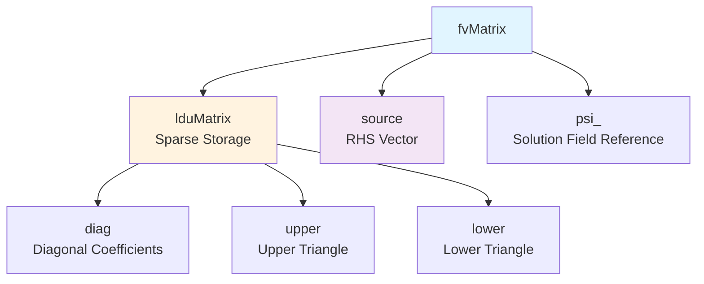
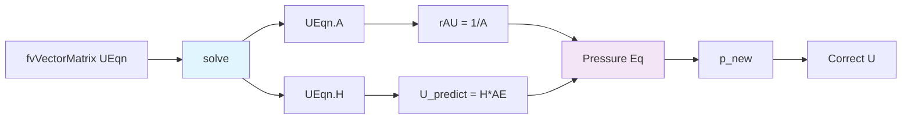

# fvMatrix Architecture

สถาปัตยกรรม fvMatrix

---

## Learning Objectives

หลังจากอ่านบทนี้ คุณควรจะสามารถ:

1. **อธิบายโครงสร้าง** ของ `fvMatrix` และความสัมพันธ์กับ `lduMatrix`
2. **แยกแยะ** การทำงานของ `fvm` (implicit) กับ `fvc` (explicit) operators
3. **เขียน** matrix assembly สำหรับสมการ PDE พื้นฐานได้อย่างถูกต้อง
4. **ประยุกต์ใช้** `.A()` และ `.H()` methods ในอัลกอริทึม SIMPLE/PIMPLE
5. **จัดการ** boundary contributions และ reference values อย่างเหมาะสม

**🔗 Prerequisites:** 
- ควรอ่าน [02_Dense_vs_Sparse_Matrices.md](02_Dense_vs_Sparse_Matrices.md) ก่อนเพื่อความเข้าใจ lduMatrix storage
- ควรเข้าใจ Finite Volume discretization จาก [00_Overview.md](00_Overview.md)

---

## Overview (What & Why)

> **Why it matters:** `fvMatrix` เป็น **หัวใจสำคัญ** ของการแก้สมการ PDE ใน OpenFOAM — ทุก solver ใช้มันเพื่อแปลงสมการเชิงอนุพันธ์ให้กลายเป็นระบบสมการเชิงเส้นที่คอมพิวเตอร์สามารถแก้ได้

### What is fvMatrix?



**OpenFOAM Context:** เมื่อคุณเขียน `fvm::div(phi, T)` ใน solver — OpenFOAM ไม่ได้คำนวณค่าทันที แต่สร้าง matrix coefficients แล้วเก็บไว้ใน `fvMatrix` จนกว่าจะถึงเวลา `.solve()`

---

## 1. Structure (How)

### 1.1 Class Definition

```cpp
template<class Type>
class fvMatrix : public lduMatrix
{
    // Reference to solution field (ที่ฟิลด์ตัวแปรที่ต้องการแก้)
    GeometricField<Type, fvPatchField, volMesh>& psi_;
    
    // Inherited from lduMatrix (sparse storage)
    scalarField& diag_;   // Diagonal coefficients [nCells]
    scalarField& upper_;  // Upper triangle [nInternalFaces]
    scalarField& lower_;  // Lower triangle [nInternalFaces]
    
    // RHS vector (source terms)
    Field<Type> source_;  // Source vector [nCells]
    
    // Dimensions for unit checking
    dimensionSet dimensions_;
};
```

### 1.2 Memory Layout Visual

```
Cell Mesh Example (4 cells, 4 internal faces):
    
    [0] ---1--- [1]
     |           |
     4           2
     |           |
    [2] ---3--- [3]

lduMatrix Storage (after assembly):
  diag = [a₀₀, a₁₁, a₂₂, a₃₃]        ← Diagonal coefficients
  upper = [a₀₁, a₁₃, a₂₃]            ← Owner→Neighbour
  lower = [a₁₀, a₃₁, a₃₂]            ← Neighbour→Owner
  source = [b₀, b₁, b₂, b₃]          ← RHS vector
  
System form: [A][x] = [b]
  ⎡a₀₀  a₀₁   0    0 ⎤ ⎡T₀⎤   ⎡b₀⎤
  ⎢a₁₀  a₁₁   0   a₁₃⎥ ⎢T₁⎥ = ⎢b₁⎥
  ⎢ 0    0   a₂₂  a₂₃⎥ ⎢T₂⎥   ⎢b₂⎥
  ⎣ 0    0   a₃₂  a₃₃⎦ ⎣T₃⎦   ⎣b₃⎦
```

**OpenFOAM Context:** นี่คือ **sparse format** เพราะ mesh จริงมีการเชื่อมต่อน้อยมากเทียบกับจำนวน cell ทั้งหมด — 1M cells อาจมีเพียง ~7M coefficients (เฉลี่ย 7 neighbours/cell) แทนที่จะเป็น 1T² elements

---

## 2. Matrix Assembly (When & What)

### 2.1 Implicit Terms → Matrix Coefficients (LHS)

```cpp
// สร้าง matrix สำหรับสมการพลังงาน
fvScalarMatrix TEqn
(
    fvm::ddt(T)              // → diag  (temporal term)
  + fvm::div(phi, T)         // → diag + upper/lower  (convection)
  - fvm::laplacian(k, T)     // → diag + upper/lower  (diffusion)
);
```

**What happens internally:**

```cpp
// fvm::ddt(T) for explicit Euler:
//   diag[i] += V[i] / dt
//   source[i] += V[i] * T.oldTime()[i] / dt

// fvm::div(phi, T) using upwind:
//   owner[f]   += max(phi[f], 0)   →  diag[owner]
//   neighbour[f] += max(-phi[f], 0) →  diag[neighbour]
//   upper[f]   += min(phi[f], 0)    →  upper
//   lower[f]   += max(phi[f], 0)    →  lower

// fvm::laplacian(k, T):
//   diag += Σ (Sf * gamma / delta) over faces
//   upper/lower -= (Sf * gamma / delta) for internal faces
```

### 2.2 Explicit Terms → Source Vector (RHS)

```cpp
// Explicit convection (ไม่ dependent on T ณ iteration ปัจจุบัน)
TEqn += fvc::div(phi, T.oldTime());  // → source เท่านั้น

// Source term จาก heat generation
TEqn += fvc::Sp(Q, T);  // → source (Sp = explicit source times field)
```

### 2.3 Combined Example

```cpp
// Full energy equation with buoyancy
fvScalarMatrix TEqn
(
    fvm::ddt(T)
  + fvm::div(phi, T)
  - fvm::laplacian(alpha, T)
 ==
    fvc::div(phi, T.oldTime())    // Explicit term (RHS)
  + fvc::Sp(Q_source, T)          // Heat generation
  + buoyancySource                 // Function returning Field<scalar>
);
```

**Key Insight:** ตัวดำเนินการ `==` แยก **LHS (matrix)** จาก **RHS (source)** อย่างชัดเจน

---

## 3. Operator Effects Reference

| Operator | Diagonal | Upper/Lower | Source | Typical Usage |
|----------|----------|--------------|--------|---------------|
| `fvm::ddt` | ✓ (ρV/Δt) | | ✓ (ρV/Δt × oldTime) | Transient terms |
| `fvm::div` | ✓ | ✓ | | Convection (implicit) |
| `fvm::laplacian` | ✓ | ✓ | | Diffusion |
| `fvm::Sp` (implicit) | ✓ | | | Linear source (diagonal) |
| `fvm::SuSp` | ✓ | | ✓ | Semi-implicit source |
| `fvc::div` | | | ✓ | Explicit convection |
| `fvc::laplacian` | | | ✓ | Explicit diffusion |
| `fvc::Sp` | | | ✓ | Explicit source |

---

## 4. Matrix Operations & Solving

### 4.1 Solve the System

```cpp
// Basic solve
TEqn.solve();

// With solver control from fvSolution
solverPerformance solverPerf = TEqn.solve();

// Check convergence
if (solverPerf.initialResidual() < 1e-6)
{
    Info << "Converged!" << endl;
}
```

**OpenFOAM Context:** `fvSolution` dictionary ควบคุมว่าจะใช้ solver ไหน (GAMG, PCG, etc.) และ tolerance กี่ตัว:

```cpp
// system/fvSolution
solvers
{
    T
    {
        solver          GAMG;
        tolerance       1e-06;
        relTol          0.1;
        smoother        GaussSeidel;
    }
}
```

### 4.2 Relaxation (Critical for SIMPLE)

```cpp
// Matrix relaxation (blend with previous iteration)
TEqn.relax(UEqn.relaxationFactor());  // Default from fvSolution

// Equivalent manual operation:
// A_new = (1-α)·A_old + α·A_current
// source_new = (1-α)·source_old + α·source_current
```

**Why it matters:** ใน SIMPLE algorithm — velocity และ pressure แก้ไขข้ามกัน หากไม่ relax จะเกิด oscillation ไม่ converge

```cpp
// system/fvSolution
relaxationFactors
{
    fields
    {
        p               0.3;    // High relaxation (conservative)
        U               0.7;    // Medium relaxation
        T               0.8;    // Lower relaxation (well-behaved)
    }
}
```

### 4.3 Access Matrix Components

```cpp
// Get diagonal (scalarField)
const scalarField& d = TEqn.diag();

// Get source (Field<Type>)
const Field<scalar>& s = TEqn.source();

// Get as GeometricField (for post-processing)
volScalarField A = TEqn.A();      // Diagonal as field
volScalarField H = TEqn.H();      // Off-diagonal contribution
```

---

## 5. Equation Manipulation (Practical Examples)

### 5.1 Build Complex Equations Step-by-Step

```cpp
// Momentum equation with turbulence (มาตรฐานใน simpleFoam)
fvVectorMatrix UEqn
(
    fvm::ddt(U)                        // 1. Transient term
  + fvm::div(phi, U)                   // 2. Convection
  + turbulence->divDevRhoReff(U)       // 3. Turbulent diffusion
 ==
    fvOptions(U)                       // 4. Source terms (porous, MRF, etc.)
);

// Optional: Add buoyancy (for buoyantSimpleFoam)
UEqn -= fvc::grad(p);                  // Pressure gradient (explicit)

// Relax before solving (CRITICAL for convergence)
UEqn.relax();

// Solve
solve(UEqn == -fvc::grad(p));
```

### 5.2 Multiple Equation Coupling (PIMPLE)

```cpp
// PIMPLE loop (semi-implicit method)
while (pimple.loop())
{
    // 1. Solve momentum with old pressure
    fvVectorMatrix UEqn
    (
        fvm::ddt(U) + fvm::div(phi, U)
      + turbulence->divDevReff(U)
    );
    UEqn.relax();
    solve(UEqn == -fvc::grad(p));
    
    // 2. Correct pressure with new velocity
    // (uses UEqn.A() and UEqn.H() internally)
    while (pimple.correct())
    {
        p = fvc::interpolate(rAU) * p;
        // ... pressure correction equation ...
    }
    
    // 3. Correct velocity
    U -= rAU * fvc::grad(p);
    U.correctBoundaryConditions();
}
```

### 5.3 Adding Constraints

```cpp
// Fix reference value (สำคัญสำหรับ pressure-only problems)
TEqn.setReference(pRefCell, pRefValue);

// Pin cell to specific value (ใช้ใฟ debugging)
TEqn.setReference(0, scalar(300));  // Cell 0 = 300 K

// Multiple references (rare)
TEqn.setReferences({0, 5}, {300, 350});
```

**OpenFOAM Context:** Pressure ใน incompressible flow มี **gauge pressure only** — ต้องมี reference cell ไม่งั้น matrix เป็น singular

### 5.4 Manipulate Existing Matrix

```cpp
// Add additional source after construction
TEqn += fvc::domainIntegrate(Q);  // Volume integral

// Scale matrix (หากต้องการ adjust coefficients)
TEqn *= scalingFactor;

// Combine two matrices (rare but possible)
fvScalarMatrix combined = TEqn1 + TEqn2;
```

---

## 6. Advanced: A() and H() in SIMPLE

### 6.1 Mathematical Foundation

ใน **SIMPLE algorithm** เราแยก velocity ออกจาก pressure:

```
∂U/∂t + ∇·(UU) = -∇p + ν∇²U

Discretized momentum:
[aₚ]Uₚ + Σ[aₙᵦUₙᵦ] = -∇p + b

Isolate Uₚ:
Uₚ = H/A - ∇p/A
```

โดยที่:
- **A = Diagonal coefficient** (aₚ)
- **H = Off-diagonal contributions** (Σ[aₙᵦUₙᵦ] + b)

### 6.2 Practical Usage in OpenFOAM

```cpp
// Solve momentum equation
fvVectorMatrix UEqn
(
    fvm::div(phi, U) - fvm::laplacian(nu, U)
);
UEqn.solve();

// Extract A() and H() for pressure correction
volScalarField rAU = 1.0/UEqn.A();          // Reciprocal of diagonal
volVectorField H = UEqn.H();                 // Off-diagonal + source

// Predict velocity without pressure gradient
U = H*UEqn.A();  // U = H/A (temporary)

// Pressure correction uses rAU
// ∇·(rAU∇p) = ∇·(U*) / Δt
```

### 6.3 Visual Explanation



**OpenFOAM Context:** นี่คือเหตุผลที่ใน `pEqn.H` คุณเห็น:
```cpp
volScalarField rAU = 1.0/UEqn.A();
```
— มันคือ **preconditioner** สำหรับ pressure Poisson equation

---

## 7. Boundary Contributions

### 7.1 How BCs Affect Matrix

```cpp
// Fixed Value (Dirichlet) BC at cell i:
//   - Adjust diag[i] to enforce T[i] = T_bc
//   - Move boundary contribution to source

// Fixed Gradient (Neumann) BC:
//   - Add to source[i] (flux = -k∇T)
//   - No change to matrix coefficients

// Zero Gradient (∂T/∂n = 0):
//   - Implicit: off-diagonal coefficient = 0 (no coupling)
```

### 7.2 Post-Solve Correction

```cpp
// Solve updates internal field only
TEqn.solve();

// Apply boundary conditions
T.correctBoundaryConditions();

// For derived fields (phi = U·Sf)
phi = fvc::interpolate(U) & mesh.Sf();
```

---

## 8. lduMatrix Storage Deep Dive

### 8.1 Owner-Neighbour Scheme

```
For internal face f connecting cells O and N:
  owner[f] = O      (lower index)
  neighbour[f] = N  (higher index)
  
Matrix coefficients:
  upper[f] = coefficient for O→N (owner contribution to neighbour)
  lower[f] = coefficient for N→O (neighbour contribution to owner)
  diag[O] += Σ upper[f] + lower[f] + boundary contributions
  diag[N] += Σ upper[f] + lower[f] + boundary contributions
```

### 8.2 Symmetric vs. Asymmetric

```cpp
// Pure diffusion: symmetric (upper = lower)
fvm::laplacian(D, T)  → upper[f] = lower[f] = -D·Sf/d

// Convection: asymmetric (upwind creates one-sided coupling)
fvm::div(phi, T)     → upper[f] ≠ lower[f] (depends on flow direction)

// Turbulence: highly asymmetric
divDevReff(U)        → Complex coupling from Reynolds stress
```

---

## 📋 Quick Reference

| Method | Description | Usage Context |
|--------|-------------|---------------|
| `.solve()` | Solve linear system | Every PDE solve |
| `.relax()` | Apply under-relaxation | SIMPLE/PIMPLE loops |
| `.diag()` | Get diagonal coefficients | Debugging, analysis |
| `.source()` | Get RHS vector | Residual calculation |
| `.A()` | Get diagonal as `volScalarField` | Pressure correction |
| `.H()` | Get off-diagonal as `volVectorField` | Velocity prediction |
| `.flux()` | Get face flux field | Conservative interpolation |
| `.setReference()` | Fix reference value | Pressure problems |

---

## 🎯 Key Takeaways

1. **fvMatrix = lduMatrix + source + psi** — ทั้งหมดรวมกันเป็น discretized PDE system
2. **fvm → matrix (LHS), fvc → source (RHS)** — จำความแตกต่างนี้ให้ขึ้นใจ
3. **lduMatrix ประหยัด memory** — เก็บเฉพาะ non-zero coefficients สำหรับ sparse mesh connectivity
4. **A() และ H() สำคัญใน SIMPLE** — ใช้แยก velocity-pressure coupling
5. **Relaxation = convergence stability** — ใช้ `.relax()` ทุก iteration ใน steady-state
6. **Boundary contributions = implicit** — BCs แก้ไข matrix โดยตรงไม่ใช่แค่ post-process
7. **Always correct BCs after solve** — `correctBoundaryConditions()` จำเป็นสำหรับ consistency

---

## 🧠 Concept Check

<details>
<summary><b>1. fvm vs fvc ต่างกันอย่างไรใน matrix terms?</b></summary>

- **fvm (implicit)**: Contributes to **matrix coefficients** (LHS) — ค่าณ iteration ปัจจุบัน
  ```cpp
  fvm::div(phi, T)  // → diag + upper/lower
  ```
- **fvc (explicit)**: Contributes to **source vector** (RHS) — ค่าจาก iteration ก่อนหน้า
  ```cpp
  fvc::div(phi, T.oldTime())  // → source เท่านั้น
  ```

**When to use:** fvm เมื่อ term นั้น strongly coupled (เช่น diffusion), fvc เมื่อ weakly coupled (เช่น source)
</details>

<details>
<summary><b>2. A() และ H() ใช้ทำอะไรใน SIMPLE algorithm?</b></summary>

สำหรับ **SIMPLE/PIMPLE** pressure-velocity coupling:

```cpp
U = H/A - ∇p/A
```

- **A()**: Diagonal coefficients → ความต้านทานของ cell ต่อการเปลี่ยนแปลง
- **H()**: Off-diagonal + source → อิทธิพลจาก neighbours + sources

**Practical code:**
```cpp
volScalarField rAU = 1.0/UEqn.A();  // Preconditioner
U = H*UEqn.A();                      // Velocity prediction
```
</details>

<details>
<summary><b>3. ทำไมต้อง relax()? เกิดอะไรขึ้นภายใน?</b></summary>

เพื่อ **improve convergence** ใน coupled problems:

1. **Problem:** Velocity และ pressure แก้ไขข้ามกัน — หาก U เปลี่ยนมาก → p เปลี่ยนมาก → U เปลี่ยนมากอีก (oscillation)
2. **Solution:** Blend ค่าใหม่กับค่าเดิม:
   ```
   U_new = (1-α)·U_old + α·U_calculated
   ```
3. **ใน OpenFOAM:**
   ```cpp
   UEqn.relax();  // ใช้ค่าจาก fvSolution
   ```

**Typical values:** α = 0.3 (pressure), 0.7 (velocity) — ยิ่งน้อยยิ่ง stable แต่ converge ช้า
</details>

<details>
<summary><b>4. lduMatrix vs dense matrix — ใช้กับเมื่อไหร่?</b></summary>

**lduMatrix (sparse):**
- ✅ **Default** สำหรับทุก CFD mesh
- ✅ Memory: ~7 coefficients/cell (ไม่ใช่ n²)
- ✅ Solver: GAMG, CG, BiCGStab (exploit sparsity)

**Dense matrix:**
- ❌ ใช้เฉพาะ **small 2D test cases** หรือ **dense linear systems** (เช่น full coupling)
- ❌ Memory: n² (เกิน memory overflow เมื่อ n > 10⁴)
- ❌ Solver: LU decomposition, Gaussian elimination

**Rule of thumb:** ถ้า mesh มีการเชื่อมต่อแบบ sparse (mesh ปกติ) → เสมอ
</details>

---

## 📖 เอกสารที่เกี่ยวข้อง

### เนื้อหาที่ควรอ่านต่อไป:

1. **Previous:** [02_Dense_vs_Sparse_Matrices.md](02_Dense_vs_Sparse_Matrices.md) — ฐานการเข้าใจ lduMatrix storage
2. **Next:** [04_Linear_Solvers_Hierarchy.md](04_Linear_Solvers_Hierarchy.md) — วิธีแก้ระบบสมการเชิงเส้น
3. **Related:** [00_Overview.md](00_Overview.md) — ภาพรวม linear algebra ใน OpenFOAM

### OpenFOAM Source Code:

- **`fvMatrix.H`** — Main class definition
- **`fvMatrix.C`** — Implementation of core methods
- **`lduMatrix.H`** — Sparse matrix base class
- **`fvm.H`**, **`fvc.H`** — Implicit/explicit operator declarations

### Recommended Reading:

- **OpenFOAM Programmer's Guide:** Chapter 3 (Discretization)
- **Jasak's PhD Thesis:** Section 3.4 (Finite Volume Discretization)