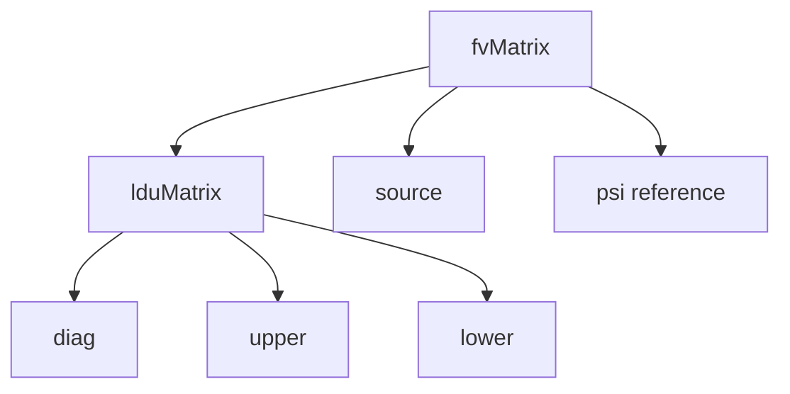

# fvMatrix Architecture

สถาปัตยกรรม fvMatrix

---

## Overview

> **fvMatrix** = Finite volume matrix representing discretized PDE



---

## 1. Structure

```cpp
template<class Type>
class fvMatrix : public lduMatrix
{
    GeometricField<Type, fvPatchField, volMesh>& psi_;  // Solution
    scalarField& diag_;   // Diagonal coefficients
    scalarField& upper_;  // Upper triangle
    scalarField& lower_;  // Lower triangle
    Field<Type> source_;  // RHS vector
};
```

---

## 2. Matrix Assembly

### Implicit Terms (fvm)

```cpp
fvScalarMatrix TEqn
(
    fvm::ddt(T)        // → Diagonal
  + fvm::div(phi, T)   // → Off-diagonal
  - fvm::laplacian(k, T)  // → Off-diagonal
);
```

### Explicit Terms (fvc)

```cpp
// Add to source (RHS)
TEqn += fvc::div(phi, T0);
```

---

## 3. Operator Effects

| Operator | Diagonal | Off-diagonal | Source |
|----------|----------|--------------|--------|
| `fvm::ddt` | ✓ | | |
| `fvm::div` | ✓ | ✓ | |
| `fvm::laplacian` | ✓ | ✓ | |
| `fvm::Sp` | ✓ | | |
| `fvc::*` | | | ✓ |

---

## 4. Matrix Operations

### Solve

```cpp
TEqn.solve();

// Or with relaxation
TEqn.relax();
TEqn.solve();
```

### Residual

```cpp
scalar residual = TEqn.solve().initialResidual();
```

### Access

```cpp
// Get diagonal
const scalarField& d = TEqn.diag();

// Get source
const Field<Type>& s = TEqn.source();
```

---

## 5. Equation Manipulation

### Combine Equations

```cpp
fvVectorMatrix UEqn = fvm::ddt(U) + fvm::div(phi, U);
UEqn += turbulence.divDevReff(U);
```

### Add Constraints

```cpp
UEqn.setReference(0, vector::zero);  // Fix reference
```

---

## 6. Relaxation

### Equation Relaxation

```cpp
UEqn.relax();  // Uses relaxationFactors from fvSolution
```

### Field Relaxation

```cpp
U.relax();  // Blend with previous iteration
```

---

## 7. Boundary Contributions

```cpp
// Boundary contributes to:
// - Diagonal (fixed value BC)
// - Source (gradient BC)

// Correct after solve
U.correctBoundaryConditions();
```

---

## 8. lduMatrix Storage

```
For internal face f connecting cells O and N:
- owner[f] = O
- neighbour[f] = N
- upper[f] = coefficient for O→N
- lower[f] = coefficient for N→O
- diag[O] += boundary/source contributions
```

---

## Quick Reference

| Method | Description |
|--------|-------------|
| `.solve()` | Solve the matrix equation |
| `.relax()` | Apply under-relaxation |
| `.diag()` | Get diagonal coefficients |
| `.source()` | Get RHS vector |
| `.A()` | Get diagonal as field |
| `.H()` | Get off-diagonal as field |
| `.flux()` | Get face flux |

---

## Concept Check

<details>
<summary><b>1. fvm vs fvc ต่างกันอย่างไรใน matrix terms?</b></summary>

- **fvm**: Contributes to **matrix coefficients** (LHS)
- **fvc**: Contributes to **source vector** (RHS)
</details>

<details>
<summary><b>2. A() และ H() ใช้ทำอะไร?</b></summary>

สำหรับ **SIMPLE/PIMPLE**: $U = H/A - \nabla p/A$
- **A()**: Diagonal coefficients
- **H()**: Off-diagonal contributions
</details>

<details>
<summary><b>3. ทำไมต้อง relax()?</b></summary>

เพื่อ **improve convergence** — ลด oscillation ระหว่าง iterations
</details>

---

## Related Documents

- **ภาพรวม:** [00_Overview.md](00_Overview.md)
- **Linear Solvers:** [04_Linear_Solvers_Hierarchy.md](04_Linear_Solvers_Hierarchy.md)