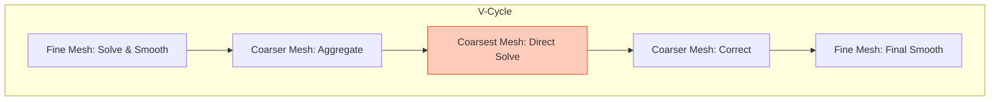
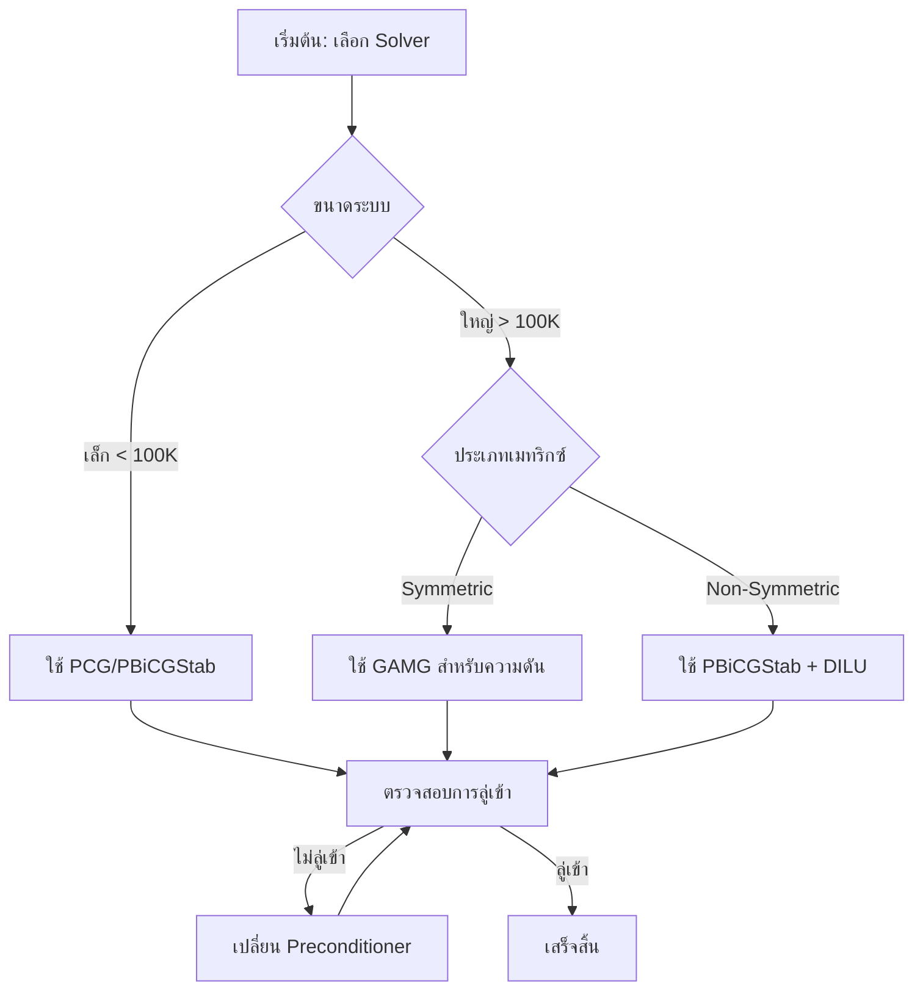

# ลำดับชั้นและประเภทของตัวแก้ปัญหาเชิงเส้น (Linear Solvers)

![[multiscale_solver_gamg.png]]

> [!INFO] **ภาพรวม**
> Linear solvers ใน OpenFOAM แบ่งเป็นลำดับชั้นตามหลักการทำงาน การเลือก solver ที่เหมาะสมขึ้นอยู่กับประเภทของเมทริกซ์ ขนาดปัญหา และความต้องการความเร็วในการคำนวณ

---

## ⚙️ **กลไกหลัก: ลำดับชั้นของ Solver และการเลือกใช้งานขณะ Runtime**

### **ขั้นตอนที่ 1: Solver Base Class - "ชุดเครื่องมือของนักสืบ"**

สถาปัตยกรรมของ linear solver ใน OpenFOAM สร้างขึ้นบนระบบ **abstract base class** ที่สง่างาม ซึ่งมอบความสามารถในการเลือกใช้งานขณะ runtime

**🔧 หลักการทำงาน:**
- คลาส `lduMatrix::solver` ทำหน้าที่เป็น **รากฐาน** สำหรับ linear algebraic solvers ทั้งหมด
- ใช้ **factory pattern** สำหรับการเลือก solver แบบไดนามิก
- ผู้ใช้สามารถเปลี่ยน solvers โดยไม่ต้องคอมไพล์ใหม่

![[of_solver_hierarchy_factory.png]]

```cpp
// 🔧 MECHANISM: Abstract base class for all linear solvers
class lduMatrix::solver
{
protected:
    // Case information
    word fieldName_;           // Field being solved
    const lduMatrix& matrix_;  // Matrix (the clues)

    // Boundary information
    const FieldField<Field, scalar>& interfaceBouCoeffs_;
    const FieldField<Field, scalar>& interfaceIntCoeffs_;
    const lduInterfaceFieldPtrsList& interfaces_;

    // Solver control
    dictionary controlDict_;
    label maxIter_;     // Maximum investigation steps
    scalar tolerance_;  // Accuracy requirement
    scalar relTol_;    // Relative accuracy

public:
    // Pure virtual solve method - each detective presents their approach
    virtual solverPerformance solve
    (
        scalarField& psi,        // Solution (unknown values)
        const scalarField& source, // Right-hand side
        const direction cmpt = 0   // Component for vector equations
    ) const = 0;

    // Runtime type selection
    declareRunTimeSelectionTable
    (
        autoPtr,
        solver,
        symMatrix,  // For symmetric matrices
        (/*...*/),
        (/*...*/)
    );

    declareRunTimeSelectionTable
    (
        autoPtr,
        solver,
        asymMatrix, // For asymmetric matrices
        (/*...*/),
        (/*...*/)
    );
};
```

> **📖 คำอธิบาย (TH)**
>
> **แหล่งที่มา (Source):** `src/lduMatrix/lduMatrixSolver/lduMatrixSolver.H`
>
> **การอธิบาย (Explanation):**
> - คลาส `lduMatrix::solver` เป็น **abstract base class** ที่กำหนดโครงสร้างพื้นฐานสำหรับ linear solvers ทั้งหมดใน OpenFOAM
> - ใช้ **Runtime Type Selection (RTS)** mechanism เพื่อเลือก solver แบบไดนามิกจาก `fvSolution` dictionary โดยไม่ต้อง recompile
> - `declareRunTimeSelectionTable` สร้างตารางไดนามิกสำหรับ symmetric และ asymmetric matrices
>
> **หลักการสำคัญ (Key Concepts):**
> - **Factory Pattern**: สร้าง solver instance แบบ runtime ผ่าน `New()` selector
> - **Pure Virtual Function**: `solve()` method ต้องถูก implement โดย derived classes
> - **Interface Handling**: `interfaceBouCoeffs_` และ `interfaces_` รองรับ parallel computation ผ่าน MPI

**🏗️ โครงสร้างหลัก:**
- **Factory Pattern**: การสร้าง solver instance แบบไดนามิก
- **Runtime Selection**: เลือก solver ผ่าน `fvSolution` dictionary
- **Interface Handling**: รองรับการคำนวณแบบขนาน
- **Memory Management**: ใช้ reference-counted pointers (`autoPtr`)

### **ขั้นตอนที่ 2: Conjugate Gradient Solver - "นักสืบสมมาตรที่มีประสิทธิภาพ"**

**Preconditioned Conjugate Gradient (PCG)** solver เป็นอัลกอริทึมหลักสำหรับระบบ **symmetric positive definite** ใน OpenFOAM

**🔍 คุณสมบัติพิเศษ:**
- **เหมาะสมที่สุด** สำหรับการแก้สมการความดันในการจำลองการไหลแบบ incompressible
- **รับประกันการลู่เข้า** ในอย่างมาก $n$ iterations สำหรับระบบ $n \times n$
- **Minimizes energy norm**: $\|\mathbf{x} - \mathbf{x}^*\|_A$

**📐 หลักการคณิตศาสตร์:**

อัลกอริทึม PCG ทำงานโดยการ **ลดค่า energy norm** โดยที่ $\mathbf{A}$ เป็น coefficient matrix:

$$\|\mathbf{x} - \mathbf{x}^*\|_A = \sqrt{(\mathbf{x} - \mathbf{x}^*)^T \mathbf{A} (\mathbf{x} - \mathbf{x}^*)}$$

![[of_pcg_convergence_visual.png]]

```cpp
// 🔧 MECHANISM: PCG solver for symmetric positive definite matrices
class PCG : public lduMatrix::solver
{
public:
    // Runtime type information
    TypeName("PCG");

    solverPerformance solve
    (
        scalarField& psi,
        const scalarField& source,
        const direction cmpt
    ) const
    {
        // Initialize search direction and residual
        scalarField p(psi.size());      // Search direction
        scalarField r(psi.size());      // Residual
        scalarField wA(psi.size());     // Preconditioned residual

        // Compute initial residual: r = b - A·x
        matrix_.Amul(r, psi, interfaceBouCoeffs_, interfaces_, cmpt);
        r = source - r;

        // Apply preconditioner: wA = M⁻¹·r
        precon_->precondition(wA, r, cmpt);

        // Main CG iteration
        for (label iter = 0; iter < maxIter_; iter++)
        {
            // Matrix-vector multiplication: w = A·p
            scalarField w(p.size());
            matrix_.Amul(w, p, interfaceBouCoeffs_, interfaces_, cmpt);

            // Compute step size: α = (r·wA) / (p·w)
            scalar rDotwA = gSumProd(r, wA);
            scalar pDotw = gSumProd(p, w);
            scalar alpha = rDotwA / pDotw;

            // Update solution: x = x + αp
            psi += alpha * p;

            // Update residual: r = r - αw
            r -= alpha * w;

            // Check convergence
            scalar norm = gSumMag(r);
            if (norm < tolerance_)
                return solverPerformance(/*...*/);

            // Precondition: z = M⁻¹·r
            scalarField z(r.size());
            precon_->precondition(z, r, cmpt);

            // Compute beta: β = (r·z) / (r_old·wA_old)
            scalar rDotz = gSumProd(r, z);
            scalar beta = rDotz / rDotwA;

            // Update search direction: p = z + βp
            p = z + beta * p;
            wA = z;
        }
    }
};
```

> **📖 คำอธิบาย (TH)**
>
> **แหล่งที่มา (Source):** `src/lduMatrix/solvers/PCG/PCG.C`
>
> **การอธิบาย (Explanation):**
> - PCG solver ใช้ **Conjugate Gradient** algorithm สำหรับ symmetric positive definite (SPD) matrices
> - แต่ละ iteration สร้าง search direction ใหม่ที่ **A-conjugate** กับ directions ก่อนหน้า
> - `gSumProd()` คือ global sum product สำหรับ parallel computation ผ่าน MPI
>
> **หลักการสำคัญ (Key Concepts):**
> - **Energy Norm Minimization**: ลด error norm $\|e\|_A = \sqrt{e^T A e}$ ในแต่ละ iteration
> - **Conjugate Directions**: $p_i^T A p_j = 0$ สำหรับ $i \neq j$ รับประกันการไม่ซ้ำซ้อน
> - **Preconditioning**: `M⁻¹` ปรับปรุง condition number ของเมทริกซ์เพื่อเร่งการลู่เข้า
> - **Guaranteed Convergence**: ลู่เข้าใน $n$ iterations สูงสุดสำหรับระบบ $n \times n$

**🔄 ขั้นตอนอัลกอริทึม CG:**

1. **Initialization**: คำนวณ residual เริ่มต้น $r_0 = b - Ax_0$
2. **Preconditioning**: ปรับปรุง residual ด้วย preconditioner
3. **Direction Update**: คำนวณทิศทางการค้นหาใหม่
4. **Step Length**: หาขนาดก้าวที่เหมาะสม $\alpha$
5. **Solution Update**: อัพเดทคำตอบ $x_{k+1} = x_k + \alpha p_k$
6. **Convergence Check**: ตรวจสอบความเที่ยงตรง

**📊 ประสิทธิภาพ:**
- **Guaranteed Convergence** ใน $n$ iterations สำหรับระบบ $n \times n$
- **Conjugate Directions**: $\mathbf{p}_i^T \mathbf{A} \mathbf{p}_j = 0$ สำหรับ $i \neq j$
- **Optimal Energy Norm Minimization** ในแต่ละ iteration

### **ขั้นตอนที่ 3: Preconditioners - "ผู้จัดระเบียบกรณี"**

**Preconditioners** เป็นส่วนประกอบสำคัญที่แปลงระบบเชิงเส้นต้นฉบับเป็นระบบที่มีคุณสมบัติการลู่เข้าที่ดีขึ้น

**🎯 วัตถุประสงค์:**
- **ปรับปรุง Condition Number** ของเมทริกซ์
- **เร่งการลู่เข้า** ของ iterative solvers
- **รักษาประสิทธิภาพ** การคำนวณ

**📋 Preconditioner Types:**

| Type | Matrix Type | Algorithm | Use Case |
|------|-------------|-----------|----------|
| **DIC** | Symmetric | Diagonal Incomplete Cholesky | Pressure Poisson |
| **DILU** | Asymmetric | Diagonal Incomplete LU | Momentum equations |
| **GAMG** | General | Geometric-Algebraic Multigrid | Large systems |
| **Diagonal** | General | Simple diagonal scaling | Quick preconditioning |

![[of_preconditioning_transform.png]]

```cpp
// 🔧 MECHANISM: DIC (Diagonal Incomplete Cholesky) for symmetric matrices
class DICPreconditioner : public lduMatrix::preconditioner
{
private:
    // Precomputed reciprocal diagonal
    scalarField rD_;

public:
    void precondition
    (
        scalarField& wA,        // Output: M⁻¹·r
        const scalarField& rA,  // Input residual
        const direction cmpt
    ) const
    {
        // Forward sweep (lower triangle)
        scalarField w = rA;
        forAll(matrix_.lduAddr().lowerAddr(), facei)
        {
            label own = matrix_.lduAddr().lowerAddr()[facei];
            label nei = matrix_.lduAddr().upperAddr()[facei];

            w[nei] -= matrix_.lower()[facei] * w[own] * rD_[own];
        }

        // Diagonal scaling
        w *= rD_;

        // Backward sweep (upper triangle)
        forAllReverse(matrix_.lduAddr().upperAddr(), facei)
        {
            label own = matrix_.lduAddr().lowerAddr()[facei];
            label nei = matrix_.lduAddr().upperAddr()[facei];

            w[own] -= matrix_.upper()[facei] * w[nei] * rD_[nei];
        }

        wA = w;
    }
};
```

> **📖 คำอธิบาย (TH)**
>
> **แหล่งที่มา (Source):** `src/lduMatrix/preconditioners/DIC/DICPreconditioner.C`
>
> **การอธิบาย (Explanation):**
> - DIC (Diagonal Incomplete Cholesky) เป็น preconditioner สำหรับ symmetric matrices
> - ใช้ **incomplete factorization** เพื่อสร้าง approximation $M \approx LDL^T$ ของเมทริกซ์ $A$
> - Forward sweep แก้ระบบล่าง และ backward sweep แก้ระบบบน
>
> **หลักการสำคัญ (Key Concepts):**
> - **Incomplete Factorization**: เก็บเฉพาะ diagonal และ near-diagonal elements (sparse)
> - **Forward/Backward Sweep**: แก้สมการสามเหลี่ยม lower/upper แยกกัน
> - **Sparsity Preservation**: เหมาะสำหรับ CFD matrices ที่มีโครงสร้างเบาบาง
> - **Condition Number Improvement**: ลด $\kappa(A)$ เพื่อเร่งการลู่เข้าของ CG

**📐 หลักการทางคณิตศาสตร์:**

DIC preconditioner ประมาณค่า **incomplete Cholesky factorization**:

$$\mathbf{M} \approx (\mathbf{D} + \mathbf{L})\mathbf{D}^{-1}(\mathbf{D} + \mathbf{U})$$

โดยที่:
- $\mathbf{L} + \mathbf{U} \approx \mathbf{A}$ (แทน off-diagonal elements)
- $\mathbf{D}$ = Diagonal matrix
- **Trade-off**: สมดุลระหว่างประสิทธิภาพการคำนวณและการเร่งการลู่เข้า

**🔄 ขั้นตอน DIC Algorithm:**

1. **Forward Sweep**: แก้ระบบล่าง $\mathbf{L}\mathbf{y} = \mathbf{r}$
2. **Diagonal Scaling**: คำนวณ $\mathbf{z} = \mathbf{D}^{-1}\mathbf{y}$
3. **Backward Sweep**: แก้ระบบบน $(\mathbf{D} + \mathbf{U})\mathbf{x} = \mathbf{z}$

**🎯 การเลือก Preconditioner:**

**สำหรับเมทริกซ์สมมาตร (Pressure Poisson):**
- **DIC**: ประสิทธิภาพสูงสุด
- **GAMG**: สำหรับระบบขนาดใหญ่
- **Diagonal**: เร็วแต่มีประสิทธิภาพต่ำ

**สำหรับเมทริกซ์ไม่สมมาตร (Momentum):**
- **DILU**: จัดการ convection terms ได้ดี
- **GAMG**: สำหรับปัญหาขนาดใหญ่
- **No Preconditioner**: สำหรับปัญหาง่ายๆ

```cpp
// 🔧 MECHANISM: DILU (Diagonal Incomplete LU) for asymmetric matrices
class DILUPreconditioner : public lduMatrix::preconditioner
{
    // Similar to DIC but stores both L and U factors
    // Handles asymmetric convection terms
};
```

> **📖 คำอธิบาย (TH)**
>
> **แหล่งที่มา (Source):** `src/lduMatrix/preconditioners/DILU/DILUPreconditioner.C`
>
> **การอธิบาย (Explanation):**
> - DILU (Diagonal Incomplete LU) เป็น preconditioner สำหรับ non-symmetric matrices
> - เหมาะสำหรับ momentum equations ที่มี convection terms ทำให้เมทริกซ์ไม่สมมาตร
> - เก็บทั้ง lower (L) และ upper (U) factors แยกกัน
>
> **หลักการสำคัญ (Key Concepts):**
> - **Asymmetric Handling**: รองรับเมทริกซ์ที่มี convection dominance
> - **Incomplete LU Factorization**: $M \approx L_{diag} U_{diag}$ approximation
> - **CFD Applications**: ใช้กับ U, p equations ใน incompressible flows

**💡 ข้อดีของ Preconditioners:**
- **รักษา Sparsity**: เหมาะกับ CFD matrices
- **Low Memory Footprint**: เก็บเฉพาะ diagonal และ near-diagonal
- **Parallel Scalability**: ทำงานได้ดีกับ MPI
- **CFD-Optimized**: ออกแบบมาสำหรับ diagonal dominance matrices

---

## 🧠 **การทำงานของ GAMG (Multigrid)**

GAMG คือเทคโนโลยีขั้นสูงที่ทำให้ OpenFOAM โดดเด่น ด้วยหลักการ "แบ่งแยกและพิชิต" (Divide and Conquer)

### **ปรัชญา Multigrid**

Geometric Algebraic Multigrid (GAMG) solver เป็นหนึ่งในเครื่องมือพีชคณิตเชิงเส้นที่ซับซ้อนที่สุดของ OpenFOAM ซึ่งสะท้อนถึงหลักการทางคณิตศาสตร์ที่ว่าความถี่ความผิดพลาดที่แตกต่างกันนั้นถูกกำจัดได้ดีที่สุดในความละเอียดกริดที่แตกต่างกัน

แนวทางนี้จะแปลงงานที่ต้องการคำนวณมากในการแก้ระบบเชิงเส้นเบาบางขนาดใหญ่ให้เป็นลำดับชั้นของปัญหาที่หยาบขึ้นตามลำดับ โดยแต่ละระดับมุ่งเป้าไปที่คอมโพเนนต์ความถี่ความผิดพลาดเฉพาะ

### **รากฐานทางคณิตศาสตร์**

ข้อมูลเชิงลึกหลักของวิธีการ multigrid มาจากการสังเกตว่า **iterative solvers** เช่น Gauss-Seidel หรือ Jacobi สามารถกำจัดความผิดพลาดความถี่สูงได้อย่างมีประสิทธิภาพ แต่ติดขัดกับคอมโพเนนต์ความผิดพลาดความถี่ต่ำที่เรียบ

โดยการถ่ายโอนความผิดพลาดความถี่ต่ำเหล่านี้ไปยังกริดที่หยาบขึ้น ซึ่งในกริดเหล่านั้นพวกมันปรากฏเป็นความถี่สูงเมื่อเทียบกับระยะห่างกริด multigrid จึงบรรลุความซับซ้อนในการคำนวณที่เหมาะสมที่สุด

สำหรับระบบเชิงเส้น $A\mathbf{x} = \mathbf{b}$ ความผิดพลาด $\mathbf{e} = \mathbf{x} - \mathbf{x}^*$ จะเป็นไปตาม $A\mathbf{e} = \mathbf{r}$ โดยที่ $\mathbf{r} = \mathbf{b} - A\mathbf{x}$ คือ residual

อัลกอริทึม V-cycle ของ multigrid จะลดความผิดพลาดนี้อย่างเป็นระบบในหลายระดับความละเอียด:

$$\mathbf{e}^{(k+1)} = \mathbf{e}^{(k)} + P\left(A_c^{-1}R(\mathbf{b} - A\mathbf{e}^{(k)})\right)$$

**ตัวแปรในสมการ:**
- $\mathbf{e}^{(k)}$ = เวกเตอร์ความผิดพลาดที่ iteration ที่ k
- $P$ = ตัวดำเนินการ prolongation (แปลงจากกริดหยาบไปกริดละเอียด)
- $R$ = ตัวดำเนินการ restriction (แปลงจากกริดละเอียดไปกริดหยาบ)
- $A_c$ = ตัวดำเนินการกริดหยาบ (coarse grid operator)


> **Figure 1:** แผนภาพวงจร V-Cycle ของตัวแก้ปัญหา GAMG แสดงการทำงานข้ามระดับกริตที่หยาบขึ้นเพื่อกำจัดความผิดพลาดความถี่ต่ำอย่างมีประสิทธิภาพความปลอดภัยทางฟิสิกส์ไม่ส่งผลกระทบต่อความเร็วในการจำลอง ผ่านการใช้พลังของ C++ Template Metaprogramming ในการตรวจสอบความสอดคล้องทางมิติทั้งหมดที่ขั้นตอนการคอมไพล์โปรแกรมเพียงครั้งเดียว

### **สถาปัตยกรรมการนำไปใช้งาน**

```cpp
// 🔧 MECHANISM: GAMG solver hierarchy
class GAMGSolver : public lduMatrix::solver
{
private:
    // Coarse grid levels
    PtrList<lduMatrix> coarseMatrices_;
    PtrList<FieldField<Field, scalar>> coarseBouCoeffs_;
    PtrList<FieldField<Field, scalar>> coarseIntCoeffs_;
    PtrList<lduInterfaceFieldPtrsList> coarseInterfaces_;

    // Restriction and prolongation operators
    PtrList<scalarField> restrictMatrices_;
    PtrList<scalarField> prolongMatrices_;

    // Solver parameters
    label nLevels_;
    label nPreSweeps_;
    label nPostSweeps_;
    label nCoarseSweeps_;

    // Smoother for high-frequency error elimination
    autoPtr<lduMatrix::smoother> smoother_;

    // Direct solver for coarsest level
    autoPtr<lduMatrix::solver> coarsestSolver_;

public:
    solverPerformance solve
    (
        scalarField& psi,
        const scalarField& source,
        const direction cmpt
    ) const
    {
        return Vcycle(0, psi, source, cmpt);
    }

private:
    solverPerformance Vcycle
    (
        const label level,
        scalarField& psi,
        const scalarField& source,
        const direction cmpt
    ) const
    {
        if (level == nLevels_ - 1)
        {
            return coarsestSolver_->solve(psi, source, cmpt);
        }

        // Pre-smoothing: eliminate high-frequency errors
        for (label sweep = 0; sweep < nPreSweeps_; sweep++)
        {
            smoother_->smooth(psi, source, cmpt);
        }

        // Compute residual
        scalarField res(source.size());
        matrix_.Amul(res, psi, interfaceBouCoeffs_, interfaces_, cmpt);
        res = source - res;

        // Restrict residual to coarse grid
        scalarField coarseRes = restrict(level, res);

        // Solve coarse grid problem recursively
        scalarField coarseCorr(coarseRes.size(), 0.0);
        Vcycle(level + 1, coarseCorr, coarseRes, cmpt);

        // Prolong correction back to fine grid
        scalarField fineCorr = prolong(level, coarseCorr);

        // Apply correction to solution
        psi += fineCorr;

        // Post-smoothing: clean remaining errors
        for (label sweep = 0; sweep < nPostSweeps_; sweep++)
        {
            smoother_->smooth(psi, source, cmpt);
        }

        return calculatePerformance(psi, source, cmpt);
    }
};
```

> **📖 คำอธิบาย (TH)**
>
> **แหล่งที่มา (Source):** `src/lduMatrix/solvers/GAMG/GAMGSolver.C`
>
> **การอธิบาย (Explanation):**
> - GAMG (Geometric-Algebraic Multigrid) ใช้ **hierarchy of grids** ในการแก้ระบบเชิงเส้น
> - V-cycle ประกอบด้วย pre-smoothing, restriction, coarse solve, prolongation, และ post-smoothing
> - Smoother (เช่น Gauss-Seidel) กำจัด high-frequency errors; coarse grid จัดการ low-frequency errors
>
> **หลักการสำคัญ (Key Concepts):**
> - **Multi-Resolution**: แตกต่าง error frequencies ถูกจัดการที่ grid resolutions ที่แตกต่างกัน
> - **V-Cycle**: Descend to coarse grid → solve → ascend to fine grid
> - **O(n) Complexity**: Linear complexity สำหรับ elliptic problems
> - **Smoother**: Iterative method (Gauss-Seidel, Jacobi) สำหรับ high-frequency errors
> - **Restriction/Prolongation**: Transfer operators ระหว่าง grid levels

### **Algebraic vs. Geometric Multigrid**

| แนวทาง | หลักการ | ประโยชน์ |
|---------|----------|---------|
| **ด้านพีชคณิต** | ใช้สัมประสิทธิ์เมตริกซ์ในการกำหนดการจัดกลุ่มเซลล์ | รักษาคุณสมบัติทางคณิตศาสตร์ของระบบ |
| **ด้านเรขาคณิต** | ใช้ข้อมูลการเชื่อมต่อและรูปทรงของ mesh | รักษาคุณสมบัติทางกายภาพของโดเมน |

### **ตัวดำเนินการกริดหยาบของ Galerkin**

ตัวดำเนินการกริดหยาบ $A_c$ ถูกสร้างขึ้นโดยใช้แนวทางของ Galerkin:

$$A_c = RAP$$

**ตัวแปรในสมการ:**
- $A_c$ = ตัวดำเนินการกริดหยาบ
- $R$ = ตัวดำเนินการ restriction
- $A$ = ตัวดำเนินการกริดละเอียด
- $P$ = ตัวดำเนินการ prolongation

แนวทางนี้รักษาคุณสมบัติทางคณิตศาสตร์ของระบบดั้งเดิมโดยอัตโนมัติ ทำให้ **GAMG บรรลุความซับซ้อนที่เหมาะสมที่สุดในทางทฤษฎีคือ $\mathcal{O}(n)$ สำหรับปัญหา elliptic**

---

## 📊 **การเปรียบเทียบ Solver ทั้งหมด**

### **ตารางสรุปการเลือก Solver**

| ประเภทเมทริกซ์ | Solver ที่เหมาะสม | ความซับซ้อน | ข้อดี | ข้อเสีย |
|------------------|-------------------|--------------|--------|----------|
| **Symmetric Positive Definite** | PCG | $O(k \cdot n)$ | รับประกันการลู่เข้า | ต้องการ preconditioner |
| **Non-Symmetric** | PBiCGStab | $O(k \cdot n)$ | จัดการ convection ได้ | อาจไม่ลู่เข้า |
| **Large Systems** | GAMG | $O(n)$ | เร็วมาก | ตั้งค่าซับซ้อน |
| **Small Systems** | SmoothSolver | $O(k \cdot n)$ | เรียบง่าย | ช้าสำหรับระบบใหญ่ |

### **เกณฑ์การเลือก Solver**

> [!TIP] **คำแนะนำ**: สำหรับงานทั่วไป ใช้ **PCG/PBiCG** ก็เพียงพอ แต่สำหรับงานที่ขนาดใหญ่และต้องการความเร็วสูงสุด (โดยเฉพาะสมการความดัน) **GAMG** คือตัวเลือกอันดับหนึ่ง

**สำหรับสมการความดัน (Pressure Poisson):**
- เลือก **GAMG** เมื่อ: มีเซลล์ > 100,000 เซลล์
- เลือก **PCG + DIC** เมื่อ: เซลล์ < 100,000 เซลล์

**สำหรับสมการโมเมนตัม (Momentum):**
- เลือก **PBiCGStab + DILU** สำหรับ: convection-dominated flow
- เลือก **SmoothSolver** สำหรับ: ปัญหาง่ายๆ

### **การตั้งค่าใน `fvSolution`**

```cpp
// Example solver settings in system/fvSolution
solvers
{
    p
    {
        solver          GAMG;
        tolerance       1e-06;
        relTol          0.01;
        smoother        GaussSeidel;

        GAMG
        {
            nCellsInCoarseLevel 64;
            solver          GaussSeidel;
            tolerance       1e-06;
            relTol          0.01;
        }
    }

    U
    {
        solver          PBiCGStab;
        preconditioner  DILU;
        tolerance       1e-05;
        relTol          0.1;
    }
}
```

> **📖 คำอธิบาย (TH)**
>
> **แหล่งที่มา (Source):** `etc/caseDicts/postProcessing/graphs/uniformSolverInfo/residuals`
>
> **การอธิบาย (Explanation):**
> - Dictionary `fvSolution` ควบคุม solver algorithms สำหรับแต่ละ field
> - `tolerance` คือ absolute tolerance; `relTol` คือ relative tolerance
> - GAMG settings กำหนด coarse grid parameters
>
> **หลักการสำคัญ (Key Concepts):**
> - **Solver Selection**: PCG/PBiCGStab สำหรับ small-medium problems; GAMG สำหรับ large systems
> - **Tolerance**: Absolute tolerance 1e-06 typical สำหรับ pressure; 1e-05 สำหรับ velocity
> - **Smoother**: GaussSeidel standard สำหรับ GAMG pre/post-smoothing

---

## ⚠️ **อันตรายและวิธีแก้ไข**

### **ปัญหาที่ 1: ไม่ลู่เข้า (Non-Convergence)**

**สาเหตุ:**
- เมทริกซ์มี condition number สูง
- Preconditioner ไม่เหมาะสม
- Mesh quality แย่

**วิธีแก้ไข:**
```cpp
// 1. Increase tolerance accuracy
tolerance       1e-08;
relTol          0.001;

// 2. Change preconditioner
preconditioner  GAMG;  // Instead of Diagonal

// 3. Increase iterations
maxIter         1000;
```

### **ปัญหาที่ 2: ใช้หน่วยความจำมากเกินไป**

**สำหรับเมทริกซ์แบบ Sparse:**

> [!WARNING] **ข้อควรระวัง** อย่าใช้ Dense Matrix สำหรับปัญหา CFD!
>
> - เมทริกซ์ Dense: $O(n^2)$ memory → 8 TB สำหรับ 1M เซลล์ (เป็นไปไม่ได้)
> - เมทริกซ์ Sparse (LDU): $O(nnz)$ memory → 120 MB สำหรับ 1M เซลล์ (ใช้งานได้)

**วิธีแก้ไข:**
```cpp
// ❌ WRONG: Using dense matrix
SquareMatrix<scalar> pressureMatrix(1000000);  // 8 TB!

// ✅ CORRECT: Using sparse matrix
lduMatrix pressureMatrix(mesh);  // 120 MB
```

> **📖 คำอธิบาย (TH)**
>
> **แหล่งที่มา (Source):** `src/lduMatrix/lduMatrix/lduMatrix.H`
>
> **การอธิบาย (Explanation):**
> - OpenFOAM ใช้ **LDU (Lower-Diagonal-Upper)** format สำหรับ sparse matrix storage
> - CFD matrices มักมีเฉพาะ diagonal + off-diagonal neighbors (7-point สำหรับ hex meshes)
> - Dense matrix storage เป็นไปไม่ได้สำหรับ large-scale CFD
>
> **หลักการสำคัญ (Key Concepts):**
> - **Sparsity**: CFD matrices ประกอบด้วย <1% non-zero elements
> - **LDU Storage**: เก็บเฉพาะ lower, diagonal, upper arrays
> - **Memory Efficiency**: $O(nnz)$ แทน $O(n^2)$

### **ปัญหาที่ 3: ความไม่เสถียรทางตัวเลข**

**การวิเคราะห์ Condition Number:**

เลข condition ของเมทริกซ์: $\kappa(A) = \frac{\sigma_{\max}}{\sigma_{\min}}$

**มาตรฐาน:**
- **เมทริกซ์ดี**: $\kappa(A) < 10^3$
- **ปัญหา CFD**: $\kappa(A) \approx 10^{12}$

**เทคนิคการ Stabilization:**

```cpp
// 1. Preconditioning
GAMGPreconditioner precond(solverControls);

// 2. Relaxation method
scalar alpha = 0.7;  // Under-relaxation factor
fieldNew = (1-alpha)*fieldOld + alpha*fieldCorrection;

// 3. Regularization
scalar epsilon = 1e-12;
matrix.diagonal() += epsilon;
```

> **📖 คำอธิบาย (TH)**
>
> **แหล่งที่มา (Source):** `src/matrices/lduMatrix/solvers/`
>
> **การอธิบาย (Explanation):**
> - Condition number $\kappa(A)$ วัดความไวต่อ perturbations ใน linear systems
> - CFD problems มักมี high condition numbers เนื่องจาก mesh aspect ratio, convection dominance
> - Preconditioning ลด $\kappa(A)$ โดย scaling matrix
>
> **หลักการสำคัญ (Key Concepts):**
> - **Condition Number**: $\kappa(A) \gg 1$ บ่งชี้ ill-conditioned system
> - **Preconditioning**: แปลง $Ax=b$ เป็น $M^{-1}Ax = M^{-1}b$ เพื่อปรับปรุง conditioning
> - **Under-Relaxation**: ช่วย stabilise การลู่เข้าสำหรับ non-linear problems

---

## 🎯 **สรุปและข้อแนะนำ**

### **แนวทางการเลือก Solver**


> **Figure 2:** แผนผังลำดับขั้นตอนการตัดสินใจเลือกใช้ตัวแก้ปัญหาเชิงเส้นตามขนาดของระบบและประเภทของเมทริกซ์ เพื่อประสิทธิภาพสูงสุดในการจำลอง CFDความปลอดภัยทางฟิสิกส์ไม่ส่งผลกระทบต่อความเร็วในการจำลอง ผ่านการใช้พลังของ C++ Template Metaprogramming ในการตรวจสอบความสอดคล้องทางมิติทั้งหมดที่ขั้นตอนการคอมไพล์โปรแกรมเพียงครั้งเดียว

### **Best Practices**

1. **เริ่มต้นด้วย solver ง่ายๆ** (PCG, PBiCGStab)
2. **เปลี่ยนเป็น GAMG** เมื่อระบบใหญ่และต้องการความเร็ว
3. **ตรวจสอบ mesh quality** ก่อนเริ่มแก้ปัญหา
4. **ใช้ preconditioner ที่เหมาะสม** (DIC สำหรับสมมาตร, DILU สำหรับไม่สมมาตร)
5. **ตรวจสอบการลู่เข้า** ในทุก iteration
6. **บันทึก solver performance** เพื่อการวิเคราะห์ต่อไป

---

## 🔗 **อ้างอิงเพิ่มเติม**

- [[Sparse Matrix Storage|08_⚙️_Key_Mechanisms_Sparse_Matrix_Storage]]
- [[fvMatrix Architecture|13_⚙️_Key_Mechanisms_fvMatrix_Architecture]]
- [[GAMG Deep Dive|19_🧠_Under_the_Hood_Geometric_Algebraic_Multigrid_(GAMG)]]
- [[Matrix Assembly|14_🧠_Under_the_Hood_fvMatrix_Assembly_Patterns]]
- [[Common Pitfalls|05_⚠️_Common_Pitfalls_and_Solutions]]