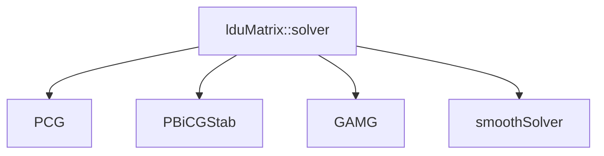

# Linear Solvers Hierarchy

ลำดับชั้น Linear Solvers ใน OpenFOAM

---

## Overview



---

## 1. Solver Selection

| Matrix Type | Recommended Solver |
|-------------|-------------------|
| Symmetric (SPD) | PCG, GAMG |
| Non-symmetric | PBiCGStab, GAMG |
| Simple elliptic | smoothSolver |

### When to Use

| Solver | Best For |
|--------|----------|
| **PCG** | Pressure (Poisson) |
| **PBiCGStab** | Velocity, scalars |
| **GAMG** | Large problems |
| **smoothSolver** | Simple cases |

---

## 2. PCG (Conjugate Gradient)

For **symmetric positive definite** matrices.

```cpp
p
{
    solver          PCG;
    preconditioner  DIC;
    tolerance       1e-6;
    relTol          0.01;
}
```

### Preconditioners for PCG

| Preconditioner | Description |
|----------------|-------------|
| `DIC` | Diagonal incomplete Cholesky |
| `FDIC` | Faster DIC |
| `GAMG` | Algebraic multigrid |

---

## 3. PBiCGStab

For **non-symmetric** matrices.

```cpp
U
{
    solver          PBiCGStab;
    preconditioner  DILU;
    tolerance       1e-6;
    relTol          0.1;
}
```

### Preconditioners for PBiCGStab

| Preconditioner | Description |
|----------------|-------------|
| `DILU` | Diagonal incomplete LU |
| `none` | No preconditioning |

---

## 4. GAMG (Multigrid)

**Geometric Algebraic MultiGrid** — best for large problems.

```cpp
p
{
    solver          GAMG;
    smoother        GaussSeidel;
    tolerance       1e-6;
    relTol          0.01;
    nPreSweeps      0;
    nPostSweeps     2;
    cacheAgglomeration true;
    nCellsInCoarsestLevel 100;
}
```

### GAMG Parameters

| Parameter | Default | Description |
|-----------|---------|-------------|
| `smoother` | GaussSeidel | Smoothing method |
| `nPreSweeps` | 0 | Pre-smoothing |
| `nPostSweeps` | 2 | Post-smoothing |
| `agglomerator` | faceAreaPair | Coarsening method |

---

## 5. smoothSolver

Simple iterative solver.

```cpp
k
{
    solver          smoothSolver;
    smoother        symGaussSeidel;
    tolerance       1e-6;
    relTol          0.1;
}
```

---

## 6. Convergence Criteria

| Parameter | Meaning |
|-----------|---------|
| `tolerance` | Absolute residual target |
| `relTol` | Relative reduction |
| `maxIter` | Maximum iterations |
| `minIter` | Minimum iterations |

### Logic

```
Converged if:
  residual < tolerance  OR
  residual < initial_residual * relTol
```

---

## 7. Typical Settings

### Steady SIMPLE

```cpp
p       { solver PCG; preconditioner DIC; tolerance 1e-6; relTol 0.01; }
U       { solver PBiCGStab; preconditioner DILU; tolerance 1e-6; relTol 0.1; }
```

### Transient PIMPLE

```cpp
p       { solver GAMG; smoother GaussSeidel; tolerance 1e-6; relTol 0.01; }
pFinal  { $p; relTol 0; }
U       { solver smoothSolver; smoother symGaussSeidel; tolerance 1e-6; relTol 0.1; }
```

---

## Quick Reference

| Equation | Solver | Preconditioner |
|----------|--------|----------------|
| Pressure | PCG/GAMG | DIC/GAMG |
| Velocity | PBiCGStab | DILU |
| Turbulence | smoothSolver | symGaussSeidel |

---

## Concept Check

<details>
<summary><b>1. ทำไม pressure ใช้ PCG?</b></summary>

เพราะ pressure equation สร้าง **symmetric positive definite** matrix → PCG converge เร็ว
</details>

<details>
<summary><b>2. GAMG ดีกว่า PCG อย่างไร?</b></summary>

**GAMG** มี O(N) complexity (vs O(N²) for PCG) → เร็วกว่ามากสำหรับ large problems
</details>

<details>
<summary><b>3. tolerance vs relTol ใช้อันไหนดี?</b></summary>

- **tolerance**: สำหรับ final accuracy requirement
- **relTol**: สำหรับ intermediate convergence (ลด iterations)
</details>

---

## Related Documents

- **ภาพรวม:** [00_Overview.md](00_Overview.md)
- **fvMatrix:** [03_fvMatrix_Architecture.md](03_fvMatrix_Architecture.md)