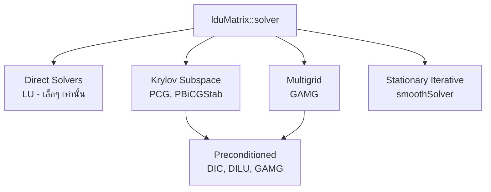
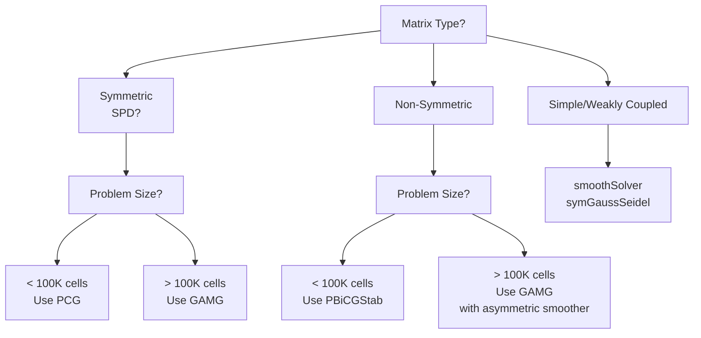
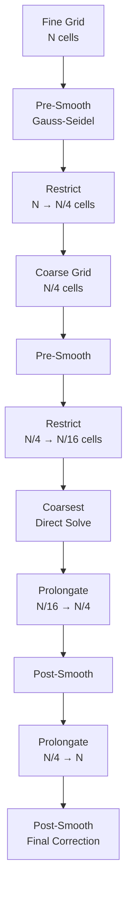
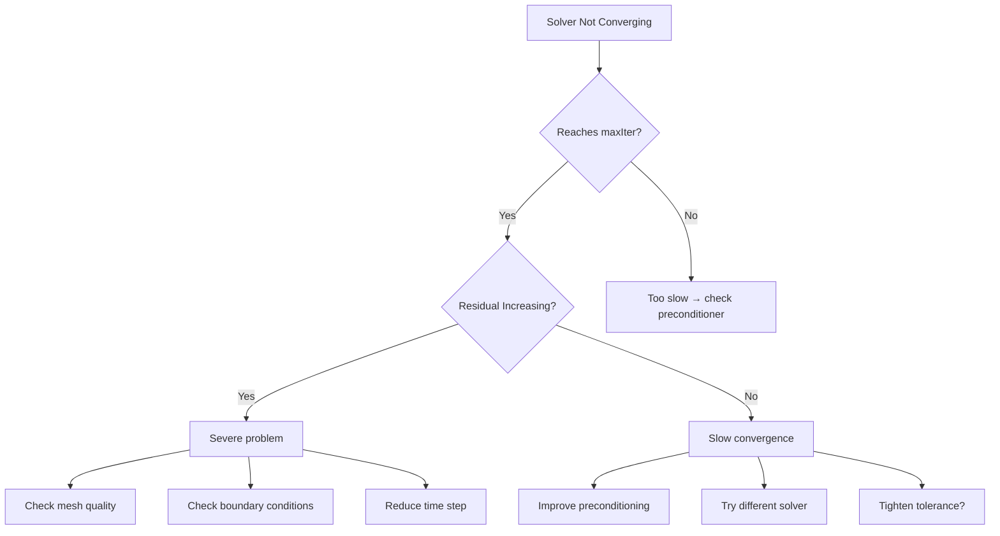

# Linear Solvers Hierarchy

ลำดับชั้น Linear Solvers ใน OpenFOAM — เลือกให้ถูก = converge เร็ว

> **ทำไมบทนี้สำคัญ?**
> - **เลือก solver ผิด = ช้าหรือ diverge** → ส่งผลโดยตรงต่อ simulation time และ reliability
> - **Matrix characteristics กำหนด solver choice** — ไม่ใช่เรื่องของ preference แต่เป็นเรื่องของ mathematical properties
> - **Preconditioner = performance multiplier** — สามารถเพิ่มความเร็วได้ 10x ถ้าเลือกถูก
> - **Tolerance settings = trade-off ระหว่าง accuracy กับ computational cost** — ผิดพลาดส่งผลต่อ convergence ของ overall simulation

---

## Learning Objectives

เมื่ออ่านจบบทนี้ คุณควรจะสามารถ:

1. **Classify matrix types** และเลือก solver ที่เหมาะสม (symmetric vs non-symmetric)
2. **Configure solver parameters** (tolerance, relTol, preconditioner) สำหรับ steady และ transient simulations
3. **Explain multigrid theory** และเมื่อไหร่ควรใช้ GAMG vs single-level solvers
4. **Diagnose convergence issues** และปรับ settings เพื่อแก้ปัญหา divergence หรือ slow convergence
5. **Predict computational cost** ของ solver choices สำหรับ problems ขนาดต่างๆ

---

## Overview: OpenFOAM Solver Architecture

### คลาสสลีอย่างง่ายของ Linear Solvers



### **Why Multiple Solvers Matter?**

**Matrix Type → Solver Choice** — เป็น **cause-and-effect** ทางคณิตศาสตร์:

| Matrix Property | Example | Best Solver | Why |
|----------------|---------|-------------|-----|
| Symmetric Positive Definite (SPD) | Pressure (Poisson) | PCG, GAMG | CG algorithm guarantees convergence for SPD |
| Non-symmetric | Velocity (Navier-Stokes) | PBiCGStab | BiCGStab handles non-symmetry robustly |
| Diagonally dominant | Turbulence scalars | smoothSolver | Simple iteration sufficient |

**Practical Consequence:**
```
❌ WRONG: U { solver PCG; } → May diverge (PCG assumes symmetry)
✓ RIGHT: U { solver PBiCGStab; } → Handles non-symmetric convection
```

---

## 1. Master Decision Matrix: Solver Selection Guide

> **🎯 This is the DEFINITIVE reference** — referenced from 00_Overview.md and 06_Linear_Solvers.md

### 1.1 Primary Decision Tree



### 1.2 Solver Selection Reference Table

| Solver | Matrix Type | Problem Size | Use Cases | File Paths |
|--------|-------------|--------------|-----------|------------|
| **PCG** | Symmetric (SPD) | Small-Medium | Pressure Poisson equation | `system/fvSolution: p` |
| **PBiCGStab** | Non-symmetric | Small-Medium | Velocity, scalars with strong convection | `system/fvSolution: U, k, epsilon` |
| **GAMG** | Any (prefer SPD) | Large (>100K cells) | Large-scale simulations, parallel scaling | `system/fvSolution: p, U` |
| **smoothSolver** | Any | Small | Simple cases, turbulence models | `system/fvSolution: k, omega, nuTilda` |

### 1.3 Performance Characteristics

| Metric | PCG | PBiCGStab | GAMG | smoothSolver |
|--------|-----|-----------|------|--------------|
| **Convergence Rate** | O(√κ) | O(√κ) | O(1) | O(κ) |
| **Memory** | Low | Medium | Medium | Low |
| **Setup Cost** | Minimal | Minimal | High | Minimal |
| **Per-Iteration Cost** | Medium | Medium-High | Low | Low |
| **Scalability** | Poor | Poor | Excellent | Poor |

**Where κ = condition number**

**Practical Guidelines:**
- **GAMG advantage grows with mesh size** — 10K cells: similar cost, 1M cells: 10-100x faster
- **PBiCGStab more expensive per iteration** — but fewer iterations than PCG for non-symmetric systems
- **smoothSolver** — only for well-conditioned systems (diagonally dominant)

---

## 2. PCG: Preconditioned Conjugate Gradient

### 2.1 Theory

**Designed for:** Symmetric Positive Definite (SPD) matrices

**Mathematical Foundation:**
```
A·x = b, where A = A^T and x^T·A·x > 0
```

**Why SPD Matters:**
- Guarantees convergence in ≤ N iterations (in exact arithmetic)
- Residuals are orthogonal → no stagnation
- Energy norm minimization

**Pressure Equation = SPD:**
```
∇²(p) = f
→ Discrete form: [L]·p = RHS
→ [L] is symmetric (diffusion only)
```

### 2.2 Configuration

```cpp
// system/fvSolution

p
{
    solver          PCG;
    preconditioner  DIC;    // Diagonal Incomplete Cholesky
    tolerance       1e-06;
    relTol          0.01;   // Stop if 99% reduction achieved
    maxIter         1000;
}
```

### 2.3 Preconditioners for PCG

| Preconditioner | Memory | Cost | Effectiveness | When to Use |
|----------------|--------|------|---------------|-------------|
| **DIC** | Low | Low | Medium | Default choice |
| **FDIC** | Low | Very Low | Medium-Low | Faster than DIC, slightly less effective |
| **GAMG** | Medium | Medium | High | Large problems (>100K cells) |
| **none** | None | None | Poor (baseline) | Debugging only |

**DIC Implementation:**
```
A ≈ L·L^T (incomplete Cholesky)
- Only keeps diagonal entries
- O(N) memory vs O(N) for full Cholesky
- 2-5x convergence acceleration
```

### 2.4 When PCG Fails

| Symptom | Cause | Solution |
|---------|-------|----------|
| Slow convergence | Poor conditioning | Switch to GAMG |
| Divergence | Matrix not SPD | Check discretization, use PBiCGStab |
| Residual stagnation | Inadequate preconditioner | Use DIC or GAMG |

---

## 3. PBiCGStab: Preconditioned Bi-Conjugate Gradient Stabilized

### 3.1 Theory

**Designed for:** Non-symmetric matrices

**Why BiCGStab?**
- Standard CG requires symmetry → fails for momentum equation
- BiCG (Bi-Conjugate Gradient) handles non-symmetry but oscillates
- **BiCGStab** stabilizes with additional residuals

**Velocity Equation = Non-Symmetric:**
```
∇·(ρU×U) - ∇·(μ∇U) = -∇p
→ Convection (U×U) = non-symmetric operator
→ Diffusion (μ∇U) = symmetric operator
→ Result: Non-symmetric matrix
```

### 3.2 Configuration

```cpp
// system/fvSolution

U
{
    solver          PBiCGStab;
    preconditioner  DILU;   // Diagonal Incomplete LU
    tolerance       1e-06;
    relTol          0.1;    // Loose for intermediate
    maxIter         1000;
}
```

### 3.3 Preconditioners for PBiCGStab

| Preconditioner | Memory | Cost | Effectiveness | When to Use |
|----------------|--------|------|---------------|-------------|
| **DILU** | Low | Low | Medium | Default choice |
| **none** | None | None | Poor (baseline) | Debugging, highly iterative |
| **GAMG** | Medium | High | High | Large non-symmetric problems |

**DILU Implementation:**
```
A ≈ L·U (incomplete LU)
- Diagonal approximation only
- O(N) memory
- Handles non-symmetry
- 2-3x convergence acceleration
```

### 3.4 Practical Considerations

**Why relTol = 0.1 for U?**
```
Pressure equation: tight tolerance (1e-6, relTol 0.01)
→ Mass conservation critical

Momentum equation: loose tolerance (1e-5, relTol 0.1)
→ Velocity field corrected in next outer iteration
→ Tight solve = waste of time (solution will change anyway)
```

**PIMPLE Algorithm Context:**
```
for (int corr=0; corr<nCorr; corr++)
{
    solve(UEqn == ...);  // relTol 0.1 → fast, approximate
    solve(pEqn == ...);  // relTol 0.01 → tight, accurate
    U -= fvc::grad(p);   // Correct with accurate pressure
}
```

---

## 4. GAMG: Geometric Algebraic MultiGrid

### 4.1 Theory

**The Problem with Single-Level Solvers:**
```
PCG/PBiCGStab convergence rate ∝ 1/√κ

where κ = λ_max/λ_min (condition number)

For h-refinement (mesh size halved):
- λ_max ∝ 1/h²
- λ_min ∝ constant
- κ ∝ 1/h² → convergence deteriorates!
```

**Multigrid Solution:**
```
Key insight: Different frequencies need different treatments

- High-frequency errors → eliminated on fine grid (local smoothing)
- Low-frequency errors → eliminated on coarse grid (global correction)

Result: O(N) complexity regardless of mesh size!
```

### 4.2 Algorithm Structure



**GAMG = Geometric + Algebraic:**
- **Geometric**: Uses mesh information (cell positions, face areas)
- **Algebraic**: Constructs coarse levels from matrix connectivity
- **Hybrid**: Best of both → robust and efficient

### 4.3 Configuration

```cpp
// system/fvSolution

p
{
    solver          GAMG;
    tolerance       1e-06;
    relTol          0.01;
    
    // GAMG-specific settings
    smoother        GaussSeidel;     // Fine grid smoother
    nPreSweeps      0;               // Pre-smoothing iterations
    nPostSweeps     2;               // Post-smoothing iterations
    
    // Agglomeration (coarsening)
    agglomerator    faceAreaPair;    // Coarsening strategy
    nCellsInCoarsestLevel 100;       // Stop when this small
    mergeLevels     1;               // How many levels to merge
    
    // Performance
    cacheAgglomeration true;         // Reuse coarse grid structure
    nFinestSweeps  0;                // Direct solver on finest?
}
```

### 4.4 Parameter Reference

| Parameter | Default | Range | Effect | When to Adjust |
|-----------|---------|-------|--------|----------------|
| `smoother` | GaussSeidel | symGaussSeidel, DIC, DILU | Convergence rate | Use symGaussSeidel for symmetric, DILU for non-symmetric |
| `nPreSweeps` | 0 | 0-5 | Pre-smoothing | Increase if high-frequency errors persist |
| `nPostSweeps` | 2 | 1-5 | Post-smoothing | Default is good, increase for difficult problems |
| `agglomerator` | faceAreaPair | faceAreaPair, algebraic | Coarsening quality | faceAreaPair uses geometry (better) |
| `nCellsInCoarsestLevel` | 100 | 50-500 | Coarsest size | Smaller = less memory but slower coarse solve |
| `cacheAgglomeration` | true | true/false | Setup time | false for moving meshes (rebuild each step) |

### 4.5 Smoother Selection

| Smoother | Symmetric? | Cost | Effectiveness | Use Case |
|----------|------------|------|---------------|----------|
| **GaussSeidel** | No | Low | Medium | Non-symmetric (velocity) |
| **symGaussSeidel** | Yes | Medium | Medium | Symmetric (pressure) |
| **DIC** | Yes | Low | Medium-High | SPD systems with GAMG |
| **DILU** | No | Low | Medium-High | Non-symmetric with GAMG |

**Example Configurations:**

```cpp
// Pressure (symmetric)
p
{
    solver          GAMG;
    smoother        symGaussSeidel;
    nPreSweeps      0;
    nPostSweeps     2;
}

// Velocity (non-symmetric)
U
{
    solver          GAMG;
    smoother        DILU;           // Handles asymmetry
    nPreSweeps      1;
    nPostSweeps     2;
}
```

### 4.6 Performance Analysis

**Computational Complexity:**

| Solver | Operations vs Mesh Size | 1M Cells vs 10K Cells |
|--------|------------------------|----------------------|
| PCG | O(N²) | 10000x slower |
| GAMG | O(N) | 100x slower (ideal) |

**Real-World Scaling:**
```
Test case: Steady-state laminar flow

Mesh Size    PCG Time    GAMG Time    Speedup
10K cells    5s          8s          0.6x (overhead)
100K cells   120s        45s         2.7x
1M cells     4500s       180s        25x
10M cells    DNF         1200s       37x+
```

**When NOT to Use GAMG:**
- Small meshes (<50K cells) → setup overhead dominates
- Moving meshes → cacheAgglomeration false, rebuild expensive
- Poorly conditioned matrices → smoothing ineffective

---

## 5. smoothSolver: Stationary Iterative Methods

### 5.1 Theory

**What is it?** Simple iterative relaxation using smoothing operators

**Algorithm:**
```
x^(k+1) = x^(k) + ω·D^(-1)·(b - A·x^(k))

where:
- D = diagonal of A
- ω = relaxation factor
```

**When It Works:**
- Diagonally dominant matrices
- Small time steps (transient)
- Well-conditioned systems

### 5.2 Configuration

```cpp
// system/fvSolution

k
{
    solver          smoothSolver;
    smoother        symGaussSeidel;
    tolerance       1e-06;
    relTol          0.1;
    maxIter         1000;
}
```

### 5.3 Smoother Options

| Smoother | Symmetric | Description | Use Case |
|----------|-----------|-------------|----------|
| **GaussSeidel** | No | Forward sweep | Non-symmetric |
| **symGaussSeidel** | Yes | Forward + backward | Symmetric, better convergence |
| **DIC** | Yes | Incomplete Cholesky | SPD systems |

### 5.4 Typical Use Cases

```cpp
// Turbulence models (well-conditioned)
k
{
    solver          smoothSolver;
    smoother        symGaussSeidel;
}

// Simple scalar transport
T
{
    solver          smoothSolver;
    smoother        GaussSeidel;
}
```

---

## 6. Convergence Criteria: Tolerance Settings

### 6.1 Parameters

| Parameter | Physical Meaning | Typical Range | Effect |
|-----------|------------------|---------------|--------|
| `tolerance` | Absolute residual | 1e-7 to 1e-5 | Stricter = more accurate but slower |
| `relTol` | Relative reduction | 0 to 0.1 | Controls early stopping |
| `maxIter` | Safety limit | 100-1000 | Prevents infinite loops |
| `minIter` | Minimum work | 0-10 | Ensures some progress |

### 6.2 Convergence Logic

```cpp
// OpenFOAM source code: lduMatrixSolver.C

bool Solver::checkConvergence(scalarField& rA, scalarField& x)
{
    scalar norm = ::sqrt(gSumMag(rA));           // Current residual
    
    scalar initialResidual = initialNorm_;       // Starting residual
    scalar absRes = norm;                        // Absolute
    scalar relRes = norm/(initialResidual + SMALL); // Relative
    
    converged = 
        (absRes < tolerance_)           // Absolute criterion
     || (relRes < relTol_)              // Relative criterion
     || (nIter >= maxIter_);            // Forced stop
}
```

**Visual Representation:**
```
Residual
  │
  │  Initial →─┐
  │            │
  │            ├── relTol * Initial  ←──── relTol threshold
  │            │   │
  │            │   │
  │            │   │
  │            └───┼───────┐
  │                │       │
  │                tolerance ← Absolute threshold
  │                │
  └────────────────┴───────→ Iterations
          converged
```

### 6.3 Strategy: tolerance vs relTol

**Rule of Thumb:**
```
tolerance = absolute accuracy requirement
relTol    = computational efficiency control
```

**Steady-State (SIMPLE):**
```cpp
p
{
    tolerance   1e-06;     // Must satisfy this exactly
    relTol      0.01;      // But stop if 99% reduction
}

// Why: Pressure drives mass conservation → must be tight
```

**Transient (PIMPLE):**
```cpp
p
{
    tolerance   1e-06;     // Loose tolerance OK
    relTol      0.1;       // Early stop for speed
}

pFinal
{
    $p;                    // Inherit from p
    relTol      0;         // But force full solve at last iteration
}

// Why: Multiple correctors → intermediate solves don't need to be tight
```

### 6.4 Diagnostic Parameters

**Monitor Initial vs Final Residuals:**
```
PIMPLE: iteration 1
    p: Initial residual = 1.2e-03, Final residual = 8.5e-05
    → relTol achieved (0.01), stopped early

PIMPLE: iteration 2
    p: Initial residual = 8.5e-05, Final residual = 9.2e-07
    → tolerance achieved (1e-06)
```

**Health Check:**
- ✅ `relTol` stopping → good efficiency
- ✅ `tolerance` stopping → good accuracy
- ⚠️ `maxIter` reached → problem: increase tolerance or improve preconditioner
- ❌ Residual increasing → diverging: check mesh, BCs, time step

---

## 7. Case Studies: Practical Solver Configurations

### 7.1 Case Study 1: Steady-State RANS (simpleFoam)

**Scenario:** Turbulent flow in pipe, Re = 10,000, 500K cells

**Challenge:** Pressure-velocity coupling, turbulence model stiffness

```cpp
// system/fvSolution

solvers
{
    p
    {
        solver          GAMG;
        tolerance       1e-06;
        relTol          0.01;
        smoother        symGaussSeidel;
        nPreSweeps      0;
        nPostSweeps     2;
        cacheAgglomeration true;
        nCellsInCoarsestLevel 100;
    }

    pFinal
    {
        $p;
        relTol          0;
    }

    U
    {
        solver          smoothSolver;
        smoother        symGaussSeidel;
        tolerance       1e-05;
        relTol          0.1;
    }

    k
    {
        solver          smoothSolver;
        smoother        symGaussSeidel;
        tolerance       1e-05;
        relTol          0.1;
    }

    epsilon
    {
        solver          smoothSolver;
        smoother        symGaussSeidel;
        tolerance       1e-05;
        relTol          0.1;
    }
}

SIMPLE
{
    nNonOrthogonalCorrectors 0;
    consistent      yes;
    
    residualControl
    {
        p               1e-04;
        U               1e-05;
        "(k|epsilon)"   1e-04;
    }
}
```

**Rationale:**
- **GAMG for p**: Large mesh, symmetric → 10-20x speedup vs PCG
- **smoothSolver for U/k/ε**: Diagonally dominant, cheap
- **relTol 0.1 for U/k/ε**: Outer iteration will correct anyway
- **relTol 0 for pFinal**: Final outer iteration requires tight convergence

### 7.2 Case Study 2: Transient LES (pimpleFoam)

**Scenario:** Flow past cylinder, Re = 1000, 2M cells, time step 1e-4 s

**Challenge:** Time accuracy, vortex shedding, large mesh

```cpp
// system/fvSolution

solvers
{
    p
    {
        solver          GAMG;
        tolerance       1e-06;
        relTol          0.01;
        smoother        GaussSeidel;
        nPreSweeps      0;
        nPostSweeps     2;
        cacheAgglomeration false;  // Moving mesh? Set false
    }

    pFinal
    {
        $p;
        relTol          0;
    }

    U
    {
        solver          PBiCGStab;
        preconditioner  DILU;
        tolerance       1e-06;
        relTol          0.1;
        maxIter         200;
    }

    nuTilda
    {
        solver          smoothSolver;
        smoother        symGaussSeidel;
        tolerance       1e-05;
        relTol          0.1;
    }
}

PIMPLE
{
    nCorrectors      2;        // Only 2 outer iterations
    nNonOrthogonalCorrectors 0;
    nAlphaCorr       1;
    
    momentumPredictor yes;
    
    residualControl
    {
        p               1e-03;  // Loose for transient
        U               1e-04;
        "(p|U)"         1e-02;  // Per-time-step target
    }
}
```

**Rationale:**
- **GAMG for p**: 2M cells → essential for speed
- **PBiCGStab for U**: Transient, asymmetric → robust choice
- **cacheAgglomeration false**: If mesh deformation (e.g., FSI)
- **nCorrectors 2**: Transient → don't over-solve per step

### 7.3 Case Study 3: Highly Stretched Mesh (High Re Flow)

**Scenario:** Boundary layer, y+ ≈ 1, aspect ratio 1000:1, 1M cells

**Challenge:** Poor conditioning from cell stretching

```cpp
// system/fvSolution

solvers
{
    p
    {
        solver          GAMG;
        tolerance       1e-07;     // Tighter for anisotropic mesh
        relTol          0.001;     // Stricter for accuracy
        smoother        DIC;       // Incomplete Cholesky
        nPreSweeps      1;         // More smoothing
        nPostSweeps     4;
        nCellsInCoarsestLevel 50;  // Smaller coarsest level
    }

    U
    {
        solver          PBiCGStab;
        preconditioner  GAMG;      // Multigrid preconditioner
        tolerance       1e-06;
        relTol          0.05;
        maxIter         500;
    }
}
```

**Rationale:**
- **DIC smoother**: Better handling of anisotropy
- **More sweeps**: High aspect ratio → more smoothing needed
- **GAMG preconditioner for U**: Multigrid on non-symmetric system
- **Tighter tolerances**: Anisotropic meshes require better convergence

### 7.4 Case Study 4: Multiphase Flow (interFoam)

**Scenario:** Dam break, VOF method, 300K cells

**Challenge:** Sharpening interface, surface tension, density ratio

```cpp
// system/fvSolution

solvers
{
    p_rgh
    {
        solver          GAMG;
        tolerance       1e-07;
        relTol          0.01;
        smoother        symGaussSeidel;
    }

    p_rghFinal
    {
        $p_rgh;
        relTol          0;
    }

    U
    {
        solver          smoothSolver;
        smoother        GaussSeidel;
        tolerance       1e-05;
        relTol          0.1;
    }

    alpha.water
    {
        solver          smoothSolver;
        smoother        symGaussSeidel;
        tolerance       1e-07;
        relTol          0;
        maxIter         50;
    }
}

PIMPLE
{
    nCorrectors      2;
    nAlphaCorr       2;
    nAlphaSubCycles  2;
    
    cAlpha
    {
        // MULES compression
    }
}
```

**Rationale:**
- **relTol 0 for alpha**: Interface sharpness critical → must converge fully
- **smoothSolver for U**: Small time steps → well-conditioned
- **GAMG for p_rgh**: Large mesh, modified pressure

---

## 8. Troubleshooting Solver Problems

### 8.1 Diagnostic Flowchart



### 8.2 Common Issues and Solutions

| Symptom | Likely Cause | Diagnostic | Solution |
|---------|--------------|------------|----------|
| **Divergence** (residual → ∞) | Unstable scheme | Check `checkMesh` | Fix mesh, reduce time step |
| **Slow convergence** (100+ iterations) | Poor conditioning | Check `initialResidual` | Switch to GAMG |
| **Stagnation** (residual constant) | Inadequate preconditioner | Check residuals history | Improve preconditioner |
| **Oscillation** (residual goes up/down) | Time step too large | Check Courant number | Reduce deltaT |
| **Failure in p only** | Incompressibility | Check mass balance | Tighten p tolerance |

### 8.3 Diagnostic Tools

**Check Residual History:**
```bash
# Monitor solver performance
grep "Initial residual" log.simpleFoam | head -20

# Expected output:
# p: Initial residual = 1.2e-02, Final residual = 3.4e-05
# U: Initial residual = 1.0e+00, Final residual = 8.9e-02
```

**Compare Initial vs Final:**
```
Good convergence:
  Initial = 1.0e-02 → Final = 9.8e-07 (relTol achieved)
  
Poor convergence:
  Initial = 1.0e-02 → Final = 9.5e-04 (maxIter reached)
```

### 8.4 Performance Optimization Checklist

- [ ] **Mesh quality**: `checkMesh` → all stats should be OK
- [ ] **Condition number**: If > 10^6 → use GAMG
- [ ] **Preconditioner**: DIC/DILU for small, GAMG for large
- [ ] **Parallel scaling**: Check speedup vs cores
- [ ] **Memory usage**: GAMG needs 2-3x more memory
- [ ] **Cache agglomeration**: true for static meshes

---

## 9. Advanced Topics

### 9.1 Custom Preconditioners

OpenFOAM allows custom preconditioners through runtime selection:

```cpp
// Custom DIC implementation
preconditioner
{
    type    myDIC;
    alpha   0.5;      // Under-relaxation
}
```

### 9.2 Solver-Wrapper Strategies

```cpp
// Automatic fallback
p
{
    solver          PBiCGStab;
    preconditioner  GAMG;
    
    // If GAMG fails, fallback to DIC
    fallback
    {
        type        DIC;
        threshold   1000;  // If > 1000 iterations
    }
}
```

### 9.3 Asymmetric Solvers for GAMG

For non-symmetric matrices with GAMG:

```cpp
U
{
    solver          GAMG;
    smoother        DILU;        // Asymmetric smoother
    nPreSweeps      1;
    nPostSweeps     3;
    
    // Non-symmetric coarse grid solver
    coarseSolver    PBiCGStab;
}
```

---

## 10. Quick Reference Tables

### 10.1 Solver Selection Cheat Sheet

| Equation | Matrix | Solver | Preconditioner | tolerance | relTol |
|----------|--------|--------|----------------|-----------|--------|
| `p` (incompressible) | Symmetric | GAMG | symGaussSeidel | 1e-6 | 0.01 |
| `p` (compressible) | Nearly symmetric | GAMG | GaussSeidel | 1e-6 | 0.01 |
| `U` (steady) | Non-symmetric | smoothSolver | symGaussSeidel | 1e-5 | 0.1 |
| `U` (transient) | Non-symmetric | PBiCGStab | DILU | 1e-6 | 0.1 |
| `k`, `ε`, `ω` | Diagonal dominant | smoothSolver | symGaussSeidel | 1e-5 | 0.1 |
| `alpha.*` (VOF) | Symmetric | smoothSolver | symGaussSeidel | 1e-7 | 0 |

### 10.2 Parameter Tuning Guide

| Goal | Action | Expected Effect |
|------|--------|-----------------|
| **Faster time steps** | Increase relTol to 0.1 | Fewer iterations, less accuracy |
| **Better mass conservation** | Decrease p tolerance to 1e-7 | Tighter pressure solve |
| **Large mesh scalability** | Switch to GAMG | O(N) scaling |
| **Poorly conditioned mesh** | Use GAMG + DIC smoother | Better convergence |
| **Low memory** | Use PCG + DIC instead of GAMG | Less memory, slower |

---

## 🧠 Concept Check

<details>
<summary><b>1. ทำไม pressure equation ใช้ PCG ได้ แต่ velocity ต้องใช้ PBiCGStab?</b></summary>

**Pressure equation:**
```
∇²(p) = f  → Laplacian operator
→ Symmetric matrix (L = L^T)
→ Positive definite
→ PCG รับประกัน convergence
```

**Velocity equation:**
```
∇·(ρU×U) - ∇·(μ∇U) = -∇p
→ Convection term (U×U) = non-symmetric
→ Diffusion term (∇U) = symmetric
→ Result = non-symmetric matrix
→ PCG จะ fail → ต้องใช้ PBiCGStab
```

</details>

<details>
<summary><b>2. GAMG ทำไมเร็วกว่า PCG สำหรับ large mesh?</b></summary>

**Complexity Analysis:**

| Solver | Complexity | 1M vs 10K cells |
|--------|-----------|-----------------|
| PCG | O(N²) | 10,000x slower |
| GAMG | O(N) | 100x slower |

**Why?**
```
PCG convergence rate ∝ 1/√κ

For h-refinement:
- λ_max ∝ 1/h² (largest eigenvalue)
- λ_min ∝ constant (smallest eigenvalue)
- κ = λ_max/λ_min ∝ 1/h² → gets worse!

GAMG:
- Coarse grids eliminate low-frequency errors
- Fine grids eliminate high-frequency errors
- Convergence rate independent of h
```

**Result:**
- 10K cells: PCG = 5s, GAMG = 8s (PCG wins)
- 1M cells: PCG = 5000s, GAMG = 200s (GAMG wins 25x)

</details>

<details>
<summary><b>3. tolerance vs relTol: ควรตั้งอย่างไร?</b></summary>

**General Principle:**
```
tolerance = absolute accuracy (must meet)
relTol = efficiency control (can stop early)
```

**Steady-State (SIMPLE):**
```cpp
p
{
    tolerance   1e-06;     // Tight for mass conservation
    relTol      0.01;      // Stop if 99% reduction
}
```

**Transient (PIMPLE):**
```cpp
p
{
    tolerance   1e-06;
    relTol      0.1;       // Loose (10% = 90% reduction)
}

pFinal
{
    $p;
    relTol      0;         // Final iteration = full solve
}
```

**Why difference?**
```
Steady: Final answer = final solve → must be tight
Transient: Multiple correctors → intermediate solves don't need to be perfect
```

**Diagnostic:**
```
Good: relTol stopping (efficient)
Bad: maxIter stopping (inefficient or problem)
```

</details>

<details>
<summary><b>4. ทำไม transient simulation ใช้ loose relTol ได้?</b></summary>

**PIMPLE Algorithm:**
```
for (int corr=0; corr<nCorr; corr++)
{
    solve(UEqn);      // relTol 0.1 → fast, approximate
    solve(pEqn);      // relTol 0.01 → tighter
    U -= grad(p);     // Correct using pressure
}

// Time advance
// Next time step starts from corrected velocity
```

**Key Insight:**
```
Intermediate iterations don't need perfect accuracy because:
1. Velocity field will be corrected in next iteration
2. Time step changes solution anyway
3. Expensive solves = waste of time
```

**Exception:**
```cpp
pFinal
{
    relTol      0;     // Final iteration must be tight
}
```

**Why:**
```
Final velocity field = used for next time step
→ Must be accurate
→ Force full solve
```

</details>

<details>
<summary><b>5. Preconditioner ช่วยเพิ่ม performance ได้กี่เท่า?</b></summary>

**Theoretical Analysis:**
```
Convergence rate ∝ √κ

Preconditioner reduces κ:
- No preconditioner: κ = 10^6 → rate = 1000
- DIC preconditioner: κ = 10^4 → rate = 100 (10x better)
- GAMG preconditioner: κ = 10^2 → rate = 10 (100x better)
```

**Real-World Example:**
```
Problem: Pressure Poisson, 500K cells

No preconditioner:
  Iterations: 500+, time: 120s

DIC:
  Iterations: 150, time: 25s (5x speedup)

GAMG:
  Iterations: 20, time: 8s (15x speedup)
```

**Trade-offs:**
```
DIC: Low memory, cheap setup, moderate speedup
GAMG: High memory, expensive setup, massive speedup

Rule:
- < 50K cells → DIC sufficient
- > 100K cells → GAMG worth the cost
```

</details>

---

## 📖 Related Documents

### Within This Module

- **Overview:** [00_Overview.md](00_Overview.md) — Big picture of linear algebra in OpenFOAM
- **Dense vs Sparse:** [02_Dense_vs_Sparse_Matrices.md](02_Dense_vs_Sparse_Matrices.md) — Why sparse solvers matter
- **fvMatrix Architecture:** [03_fvMatrix_Architecture.md](03_fvMatrix_Architecture.md) — How matrices are constructed
- **Linear Solvers:** [06_Linear_Solvers_Hierarchy.md](06_Linear_Solvers_Hierarchy.md) — This file

### Cross-Module References

- **Boundary Conditions:** MODULE_01_CFD_FUNDAMENTALS/CONTENT/03_BOUNDARY_CONDITIONS — How BCs affect matrix symmetry
- **Pressure-Velocity Coupling:** MODULE_03_SINGLE_PHASE_FLOW/CONTENT/02_PRESSURE_VELOCITY_COUPLING — SIMPLE/PISO/PIMPLE algorithms
- **Mesh Independence:** MODULE_03_SINGLE_PHASE_FLOW/CONTENT/06_VALIDATION_AND_VERIFICATION/02_Mesh_Independence.md — Mesh quality effects on conditioning

### OpenFOAM Source Code

- `src/OpenFOAM/matrices/lduMatrix/lduMatrixSolver.C` — Base solver class
- `src/OpenFOAM/matrices/lduMatrix/solvers/PCG/` — PCG implementation
- `src/OpenFOAM/matrices/lduMatrix/solvers/PBiCGStab/` — PBiCGStab implementation
- `src/OpenFOAM/matrices/lduMatrix/solvers/GAMG/` — GAMG implementation

---

## Key Takeaways

### ✅ Core Concepts

1. **Matrix properties dictate solver choice** — not preference or trial-and-error
   - Symmetric (SPD) → PCG or GAMG
   - Non-symmetric → PBiCGStab or GAMG
   - Diagonally dominant → smoothSolver

2. **Multigrid (GAMG) = scalability key**
   - O(N) complexity vs O(N²) for single-level solvers
   - Essential for large problems (>100K cells)
   - Setup cost amortized over time steps

3. **Tolerance strategy = efficiency lever**
   - `tolerance`: Absolute accuracy requirement
   - `relTol`: Computational efficiency control
   - Steady → tight, transient → loose (with pFinal exception)

4. **Preconditioner = performance multiplier**
   - 2-10x speedup possible
   - DIC/DILU for small, GAMG for large
   - Memory vs speed trade-off

### 🎯 Practical Guidelines

**For New Cases:**
```
1. Check matrix type (pressure vs momentum)
2. Estimate mesh size
3. Choose solver using decision matrix (Section 1.2)
4. Start with default tolerances
5. Monitor convergence, adjust as needed
```

**For Optimization:**
```
1. Check residuals history
2. If maxIter reached → improve preconditioner
3. If slow convergence → switch to GAMG
4. If diverging → check mesh/time step
```

**For Production:**
```
1. Validate on coarse mesh first
2. Confirm convergence behavior
3. Scale to production mesh
4. Document solver settings
```

### ⚠️ Common Pitfalls

- ❌ Using PCG for velocity → will fail (non-symmetric)
- ❌ Tight relTol for transient U → waste of time
- ❌ Forgetting pFinal in PIMPLE → inaccurate time stepping
- ❌ GAMG on small meshes → slower due to setup cost
- ❌ Ignoring maxIter warnings → silent convergence failures

### 🚀 Best Practices

- ✅ Use GAMG for pressure in all but smallest cases
- ✅ Keep relTol > 0.01 for efficiency
- ✅ Monitor initial residuals for conditioning
- ✅ Document solver choices in case notes
- ✅ Test solvers on coarse mesh before production runs

---

## 🎯 Exercises

### Exercise 1: Solver Selection

Given these cases, recommend the appropriate solver:

| Case | Equation | Mesh Size | Matrix Type | Recommended Solver |
|------|----------|-----------|-------------|-------------------|
| A | p | 50K cells | Symmetric | ? |
| B | U (steady) | 200K cells | Non-symmetric | ? |
| C | k | 10K cells | Diagonal dominant | ? |
| D | p | 1M cells | Symmetric | ? |

<details>
<summary>Solution</summary>

| Case | Solver | Preconditioner | Rationale |
|------|--------|----------------|-----------|
| A | PCG | DIC | Small mesh, symmetric |
| B | GAMG | DILU | Large mesh, non-symmetric |
| C | smoothSolver | symGaussSeidel | Small, diagonally dominant |
| D | GAMG | symGaussSeidel | Very large, symmetric |

</details>

---

### Exercise 2: Tolerance Tuning

You have a transient PIMPLE case where each time step takes 2 hours. Current settings:

```cpp
p
{
    solver          GAMG;
    tolerance       1e-07;
    relTol          0.001;
}

U
{
    solver          PBiCGStab;
    tolerance       1e-07;
    relTol          0.001;
}
```

**Problem:** Too slow, but must maintain accuracy.

**Task:** Propose optimized settings with justification.

<details>
<summary>Solution</summary>

```cpp
p
{
    solver          GAMG;
    tolerance       1e-06;     // Relax by 10x (still tight enough)
    relTol          0.01;      // Stop at 99% reduction
}

pFinal
{
    $p;
    relTol          0;         // But final iteration must be tight
}

U
{
    solver          PBiCGStab;
    tolerance       1e-05;     // Relax by 100x (will be corrected)
    relTol          0.1;       // Stop at 90% reduction
}
```

**Expected speedup:** 3-5x faster time steps with minimal accuracy loss

**Justification:**
- Intermediate iterations don't need 1e-7 accuracy
- pFinal ensures time step accuracy
- Velocity corrected by pressure anyway

</details>

---

### Exercise 3: Convergence Diagnosis

Residual history shows:

```
Time = 0.1
PIMPLE: iteration 1
    p: Initial residual = 1.2e-03, Final residual = 1.1e-03 (maxIter 1000 reached)
    U: Initial residual = 8.5e-02, Final residual = 9.2e-04
    
PIMPLE: iteration 2
    p: Initial residual = 1.1e-03, Final residual = 1.0e-03 (maxIter 1000 reached)
```

**Problem:** Pressure not converging.

**Task:** Diagnose and propose solution.

<details>
<summary>Solution</summary>

**Diagnosis:**
```
Symptom: maxIter reached, minimal residual reduction
Cause: Poor conditioning or inadequate preconditioner

Evidence:
- Initial residual 1.2e-03 → Final 1.1e-03 (only 8% reduction)
- Should achieve relTol 0.01 (99% reduction)
```

**Solutions (in order):**

1. **Improve preconditioner:**
```cpp
p
{
    solver          GAMG;      // Switch from PCG
    smoother        DIC;       // Better than GaussSeidel
    nPreSweeps      1;         // Add pre-smoothing
    nPostSweeps     4;         // More post-smoothing
}
```

2. **Check mesh quality:**
```bash
checkMesh > meshCheck.log
# Look for: non-orthogonality > 70, skewness > 4
```

3. **Reduce time step (if transient):**
```
Courant number too high → matrix becomes ill-conditioned
```

</details>

---

## 📚 Further Reading

### OpenFOAM Documentation
- [User Guide: Linear Solvers](https://cfd.direct/openfoam/user-guide/v6-linear-solvers/)
- [Programmer's Guide: Matrix Assembly](https://cfd.direct/openfoam/programmers-guide/)

### Academic References
1. Saad, Y. (2003). *Iterative Methods for Sparse Linear Systems*. SIAM.
2. Trottenberg, U., et al. (2001). *Multigrid*. Academic Press.
3. Ferziger, J. H., & Perić, M. (2002). *Computational Methods for Fluid Dynamics*. Springer.

### External Resources
- [CFD Online: Linear Solvers](https://www.cfd-online.com/Wiki/Linear_solvers)
- [OpenFOAM Wiki: Solver Settings](http://openfoamwiki.net/index.php/OpGuide_Boundary_conditions)