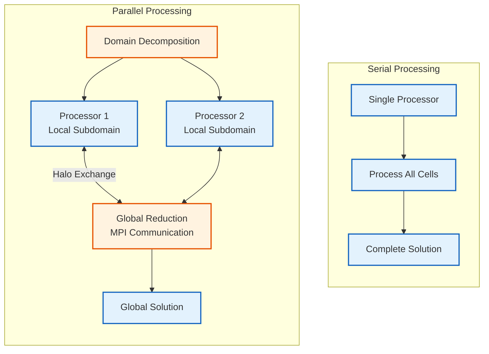
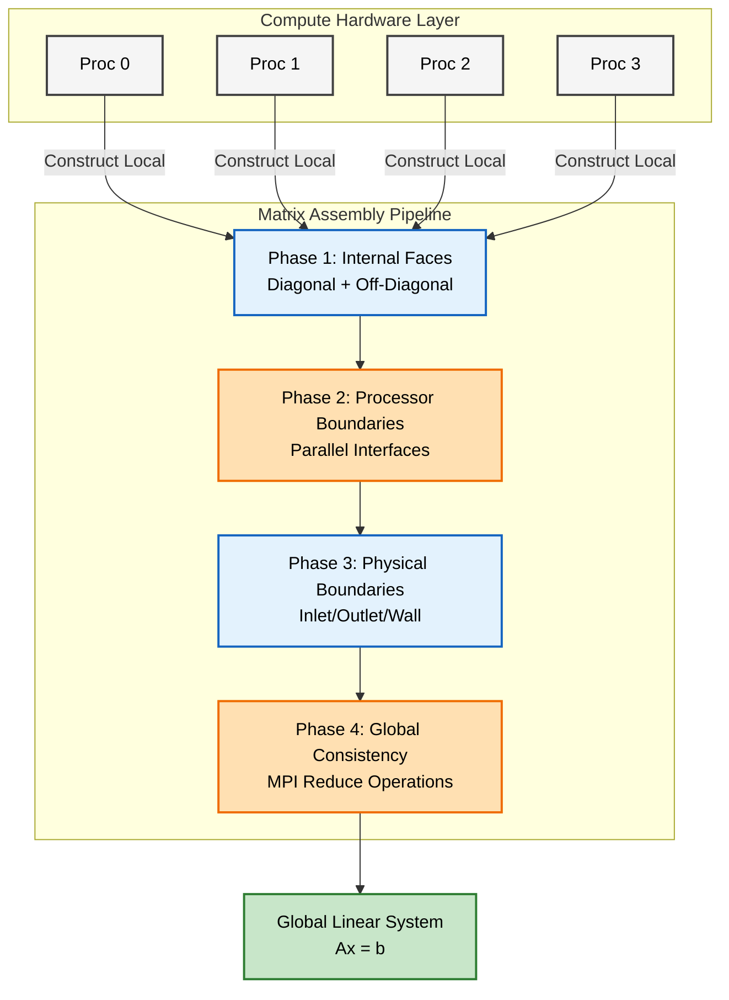
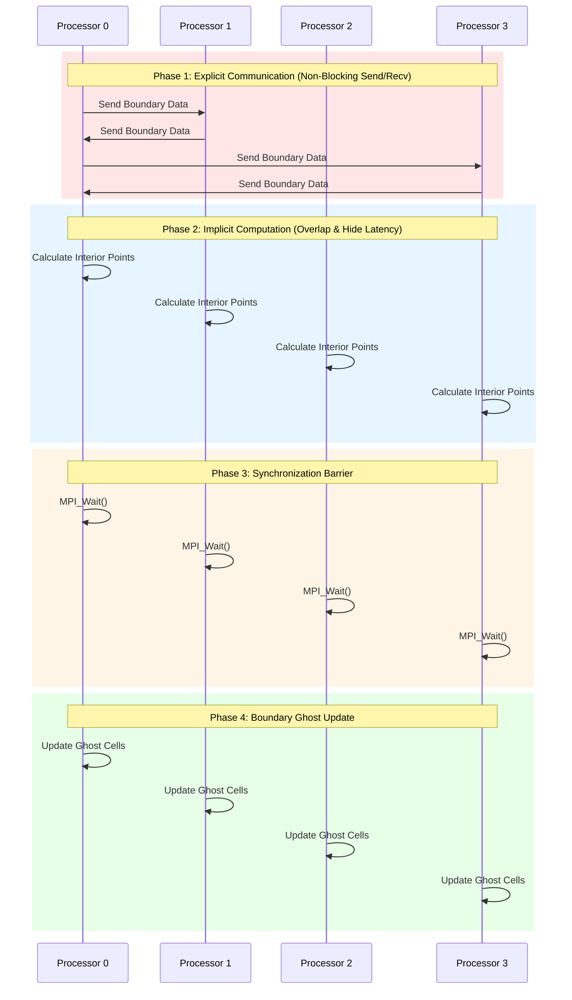
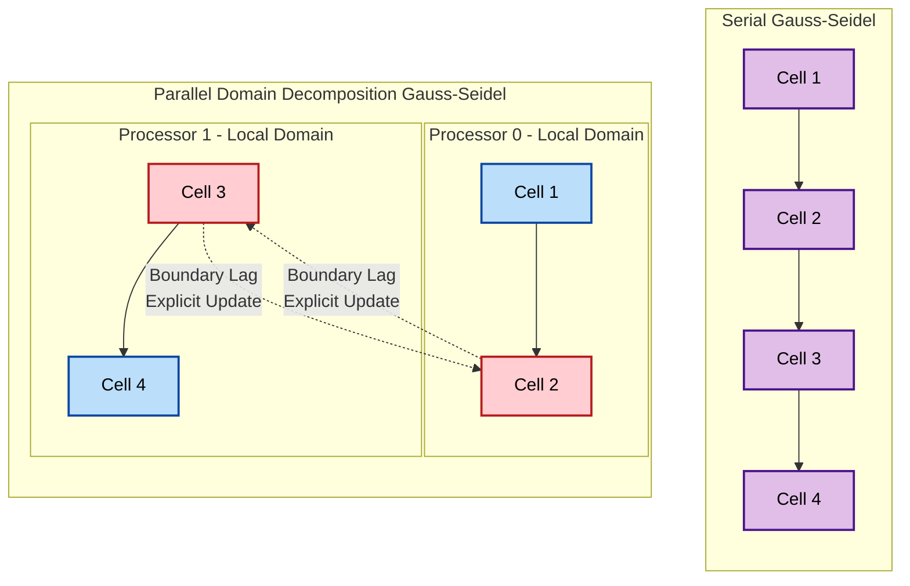

# พีชคณิตเชิงเส้นแบบขนาน (Parallel Linear Algebra)

> [!INFO] ภาพรวม
> ระบบพีชคณิตเชิงเส้นแบบขนานของ OpenFOAM ช่วยให้สามารถทำการจำลอง CFD ขนาดใหญ่ได้ผ่านการประมวลผลแบบหน่วยความจำกระจาย (distributed memory computing), การแบ่งโดเมน (domain decomposition) และรูปแบบการสื่อสารที่ซับซ้อน ส่วนนี้จะครอบคลุมรากฐานทางสถาปัตยกรรม กลไกการนำไปใช้ และข้อพิจารณาในทางปฏิบัติสำหรับการดำเนินการเมทริกซ์แบบขนาน

---

## 🔍 แนวคิดระดับสูง (High-Level Concepts)

### การเปรียบเทียบระหว่างวงออร์เคสตราและนักดนตรีเดี่ยว

**การประมวลผลแบบอนุกรม (Serial Computing)** ทำงานเหมือนนักดนตรีเดี่ยวที่ต่อจิ๊กซอว์เพียงคนเดียว:
- **การประมวลผลตามลำดับ**: ทำทีละชิ้น
- **ความซับซ้อนของเวลาเชิงเส้น**: $$T_{serial} \propto N$$
- **ข้อจำกัดของหน่วยความจำเดี่ยว**: ถูกจำกัดด้วยพื้นที่ทำงานของแต่ละบุคคล
- **ไม่มีค่าใช้จ่ายในการประสานงาน**: ไม่จำเป็นต้องมีการสื่อสาร

**การประมวลผลแบบขนาน (Parallel Computing)** ทำงานเหมือนวงออร์เคสตราของนักดนตรีที่ร่วมมือกัน:
- **การกระจายงาน**: ชิ้นส่วนจิ๊กซอว์ถูกแจกจ่ายให้กับนักดนตรีหลายคน
- **การประมวลผลพร้อมกัน**: วางชิ้นส่วนหลายชิ้นพร้อมกัน
- **ความพยายามที่ประสานกัน**: นักดนตรีสื่อสารกันเกี่ยวกับชิ้นส่วนขอบที่ใช้ร่วมกัน
- **ความต้องการในการซิงโครไนซ์**: นักดนตรีทุกคนต้องก้าวหน้าไปอย่างสอดคล้องประสานกัน

**การแสดงทางคณิตศาสตร์:**
$$T_{parallel} = \frac{T_{computation}}{p} + T_{communication} + T_{synchronization}$$

โดยที่:
- $p$ = จำนวนหน่วยประมวลผล (นักดนตรี)
- $T_{computation}$ = เวลาการคำนวณทั้งหมด
- $T_{communication}$ = เวลาสำหรับการแลกเปลี่ยนข้อมูลขอบ
- $T_{synchronization}$ = เวลาสำหรับการประสานกิจกรรม


> **รูปที่ 1:** การเปรียบเทียบระหว่างการประมวลผลแบบอนุกรมและแบบขนาน แสดงให้เห็นถึงความจำเป็นของการสื่อสารระหว่างหน่วยประมวลผลผ่านกลไก Halo Exchange

---

## ⚙️ กลไกสำคัญ (Key Mechanisms)

### 1. การแบ่งโดเมน (Domain Decomposition)

ยูทิลิตี้ `decomposePar` ของ OpenFOAM ใช้อัลกอริทึมการแบ่งกราฟที่ซับซ้อน โดยปฏิบัติต่อการเชื่อมต่อของเมชเหมือนกราฟทางคณิตศาสตร์:
- **เซลล์ (Cells)** แทน **จุดยอด (vertices)**
- **หน้า (Faces)** แทน **ขอบ (edges)**

**ปัญหาการเพิ่มประสิทธิภาพการแบ่งส่วน:**
$$\min_{P} \left[ \alpha \cdot \text{LoadImbalance}(P) + \beta \cdot \text{InterfaceArea}(P) \right]$$

โดยที่:
- $P$ = ฟังก์ชันการแบ่งส่วน
- $\alpha$, $\beta$ = ปัจจัยถ่วงน้ำหนัก

**วิธีการแบ่งส่วน:**

| วิธีการ | ลักษณะเฉพาะ | ข้อดี | ข้อเสีย |
|-----------|---------|--------|---------|
| **METIS** | การแบ่งกราฟหลายระดับ | ลดการตัดขอบให้น้อยที่สุดพร้อมสมดุลภาระงาน | ต้องการไลบรารีภายนอก |
| **SCOTCH** | การแบ่งสองส่วนแบบเรียกซ้ำ | มีความยืดหยุ่นสูง | ซับซ้อนกว่า METIS |
| **Simple** | การแบ่งทางเรขาคณิต | ง่ายและรวดเร็ว | ภาระงานไม่สมดุลสำหรับเรขาคณิตที่ซับซ้อน |

```cpp
// 🔧 Mechanism: decomposePar splits mesh among processors
class domainDecomposition
{
private:
    // Mesh connectivity graph for partitioning algorithms
    const lduAddressing& addressing_;

    // Partitioning method selection
    const word decompositionMethod_;

public:
    // Main partitioning methods using graph theory
    labelList decomposeMesh()
    {
        labelList partition(addressing_.size(), -1);

        if (decompositionMethod_ == "metis")
        {
            // METIS partitioning - minimize edge cuts with load balancing
            partition = decomposeMetis();
        }
        else if (decompositionMethod_ == "scotch")
        {
            // SCOTCH - recursive bipartitioning using graph
            partition = decomposeScotch();
        }
        else if (decompositionMethod_ == "simple")
        {
            // Geometric partitioning - split along coordinate axes
            partition = decomposeSimple();
        }

        // Post-processing to ensure numerical stability
        validatePartitioning(partition);

        return partition;
    }

    // Recursive bipartitioning using METIS
    labelList decomposeMetis()
    {
        // Convert mesh to METIS graph format
        idx_t nCells = addressing_.size();
        std::vector<idx_t> xadj(nCells + 1);  // Row pointers
        std::vector<idx_t> adjncy;            // Column indices

        // Build adjacency list from face connectivity
        buildAdjacencyList(xadj, adjncy);

        // Call METIS partitioning routine
        idx_t nConstr = 1;                    // Number of balancing constraints
        idx_t nParts = Pstream::nProcs();     // Number of partitions
        idx_t objval;                         // Objective function value of edge cut
        std::vector<idx_t> part(nCells);      // Partitioning result

        METIS_PartGraphRecursive(
            &nCells,           // Number of vertices
            &nConstr,          // Number of constraints
            xadj.data(),       // Row pointers
            adjncy.data(),     // Column indices
            nullptr,           // Vertex weights
            nullptr,           // Vertex sizes
            nullptr,           // Edge weights
            &nParts,           // Number of parts
            nullptr,           // Target partition weights
            nullptr,           // Allowed imbalance
            nullptr,           // Options
            &objval,           // Result: edge cut value
            part.data()        // Result: partitioning vector
        );

        // Convert METIS result to OpenFOAM format
        labelList result(nCells);
        for (label i = 0; i < nCells; i++)
        {
            result[i] = part[i];
        }

        return result;
    }

    // Quality metrics for evaluating partitioning
    void validatePartitioning(const labelList& partition)
    {
        // 1. Calculate load balance
        labelList cellsPerProc(Pstream::nProcs(), 0);
        forAll(partition, celli)
        {
            cellsPerProc[partition[celli]]++;
        }

        scalar avgCells = scalar(addressing_.size()) / Pstream::nProcs();
        scalar maxImbalance = 0;
        forAll(cellsPerProc, proci)
        {
            scalar imbalance = cellsPerProc[proci] / avgCells;
            maxImbalance = max(maxImbalance, imbalance);
        }

        if (maxImbalance > 1.15)  // 15% imbalance threshold
        {
            WarningInFunction << "Load imbalance detected: "
                              << "max/avg = " << maxImbalance << endl;
        }

        // 2. Calculate interface area
        label nInterfaceFaces = countInterfaceFaces(partition);
        scalar interfaceFraction = scalar(nInterfaceFaces) / addressing_.size();

        if (interfaceFraction > 0.05)  // 5% interface threshold
        {
            Info << "Interface area fraction: " << interfaceFraction << endl;
        }
    }
};
```

> **📂 แหล่งที่มา:** `src/decompositionMethods/decompositionMethods/decompositionMethod/decompositionMethod.C`
> 
> **💡 คำอธิบาย:** การแบ่งโดเมน (Domain decomposition) จะแปลงโทโพโลยีของเมชให้เป็นการแสดงผลแบบกราฟ โดยที่เซลล์กลายเป็นจุดยอดและหน้ากลายเป็นขอบ เมธอด `decomposeMesh()` จะเลือกอัลกอริทึมการแบ่งส่วนที่เหมาะสม (METIS, SCOTCH หรือ Simple) และตรวจสอบผลลัพธ์การแบ่งส่วนเพื่อให้แน่ใจว่าสมดุลภาระงานและมีพื้นที่รอยต่อ (Interface area) น้อยที่สุด
> 
> **🔑 แนวคิดสำคัญ:**
> - **Graph Partitioning:** การแปลงการเชื่อมต่อของเมชเป็นกราฟทางคณิตศาสตร์เพื่อการแบ่งส่วนที่เหมาะสมที่สุด
> - **Load Balance:** การรับประกันว่าหน่วยประมวลผลแต่ละตัวได้รับภาระงานการคำนวณที่ใกล้เคียงกัน
> - **Interface Minimization:** การลดพื้นที่ผิวการสื่อสารระหว่างหน่วยประมวลผล
> - **Quality Validation:** การตรวจสอบหลังการประมวลผลสำหรับความไม่สมดุลและอัตราส่วนรอยต่อ

**ตัววัดคุณภาพการแบ่งส่วน:**

1. **สมดุลภาระงาน (Load Balance)**:
   $$\text{Imbalance} = \frac{\max_i(n_i)}{\bar{n}}$$
   - $n_i$ = เซลล์ในพาร์ติชัน $i$
   - $\bar{n}$ = จำนวนเซลล์เฉลี่ยต่อพาร์ติชัน

2. **อัตราส่วนพื้นผิวต่อปริมาตร (Surface-to-Volume Ratio)**:
   $$\text{SVR} = \frac{A_{interface}}{V_{domain}}$$
   - พื้นที่รอยต่อแสดงถึงค่าใช้จ่ายในการสื่อสาร (Communication overhead)

3. **การตัดขอบกราฟ (Graph Edge Cuts)**:
   - จำนวนหน้าของเมชที่ข้ามพาร์ติชันที่แตกต่างกัน
   - เป็นสัดส่วนโดยตรงกับปริมาณการสื่อสาร

**ค่าเป้าหมายสำหรับการขยายขนาดแบบขนานที่ดี:**

| ตัววัด | เป้าหมาย | คำอธิบาย |
|--------|--------|-----------|
| **Load balance** | < 1.1 | ความไม่สมดุลสูงสุด 10% |
| **Interface faces** | < 5% | ของหน้าทั้งหมด |
| **Partition compactness** | ต่ำสุด | ลดอัตราส่วนพื้นผิวต่อปริมาตรให้น้อยที่สุด |

---

### 2. Ghost Cells (Halo Regions)

**Ghost cells** (หรือเซลล์เสมือน) ช่วยให้หน่วยประมวลผลแต่ละตัวสามารถดำเนินการเมทริกซ์ภายในได้อย่างอิสระโดยไม่ต้องรอการสื่อสาร โดยใช้กลยุทธ์การจำลองข้อมูลที่แยกการคำนวณออกจากการสื่อสาร

```mermaid
flowchart LR
classDef implicit fill:#e3f2fd,stroke:#1565c0,stroke-width:2px,color:#000
classDef explicit fill:#ffccbc,stroke:#bf360c,stroke-width:2px,color:#000
classDef context fill:#f5f5f5,stroke:#616161,stroke-width:1px,color:#000

subgraph Domain ["Parallel Domain Decomposition"]
    subgraph P1 ["Processor 1"]
        direction LR
        O1[Owned Cells<br/>(Internal)]:::implicit <-->|Local<br/>Coupling| G1[Ghost Cells<br/>(Halo Region)]:::explicit
    end

    subgraph P2 ["Processor 2"]
        direction LR
        G2[Ghost Cells<br/>(Halo Region)]:::explicit <-->|Local<br/>Coupling| O2[Owned Cells<br/>(Internal)]:::implicit
    end
end

G1 <==>|MPI Boundary<br/>Exchange| G2

style P1 fill:#fff,stroke:#333,stroke-width:2px
style P2 fill:#fff,stroke:#333,stroke-width:2px
```
> **รูปที่ 2:** กลไก Ghost cell ที่ช่วยให้หน่วยประมวลผลแต่ละตัวคำนวณโดเมนของตนได้อย่างอิสระก่อนที่จะแลกเปลี่ยนข้อมูลขอบเขตกับหน่วยประมวลผลข้างเคียง

**รากฐานทางคณิตศาสตร์** อาศัย **ทฤษฎีการแบ่งโดเมน (domain decomposition theory)** โดยที่:
- โดเมนการคำนวณท้องถิ่นของหน่วยประมวลผล $p$: $\Omega_p$
- โดเมนการคำนวณแบบขยาย: $\Omega_p^* = \Omega_p \cup \Gamma_p$
- $\Gamma_p$ แทนบริเวณ halo (halo region)

```cpp
// 🔧 Mechanism: processor boundaries with ghost cells
class processorLduInterface : public lduInterface
{
private:
    // Neighbor processor identification
    label neighbProcNo_;
    label myProcNo_;

    // Geometric and topological data
    labelList faceCells_;              // Local owner cells
    labelList neighbFaceCells_;        // Remote neighbor cells

    // Communication buffers for non-blocking operations
    mutable scalarField sendBuffer_;
    mutable scalarField recvBuffer_;

    // MPI communication handles
    mutable MPI_Request sendRequest_;
    mutable MPI_Request recvRequest_;

public:
    // Construct interface from mesh topology
    processorLduInterface
    (
        const lduAddressing& addr,
        const labelList& faceCells,
        const label neighbProcNo
    )
    :
        neighbProcNo_(neighbProcNo),
        myProcNo_(Pstream::myProcNo()),
        faceCells_(faceCells),
        neighbFaceCells_(faceCells.size())
    {
        // Build neighbor processor mapping from patch data
        buildNeighborMapping(addr);
    }

    // Asynchronous interface matrix update for better parallel efficiency
    virtual void initInterfaceMatrixUpdate
    (
        scalarField& result,
        const scalarField& psiInternal,
        const scalarField& coeffs,
        const direction cmpt,
        const Pstream::commsTypes commsType
    ) const
    {
        switch (commsType)
        {
            case Pstream::commsTypes::nonBlocking:
                initNonBlockingUpdate(result, psiInternal, coeffs, cmpt);
                break;

            case Pstream::commsTypes::scheduled:
                initScheduledUpdate(result, psiInternal, coeffs, cmpt);
                break;

            default:
                FatalErrorInFunction << "Unknown communication type" << endl;
        }
    }

    // Non-blocking communication for overlapping computation and communication
    void initNonBlockingUpdate
    (
        scalarField& result,
        const scalarField& psiInternal,
        const scalarField& coeffs,
        const direction cmpt
    ) const
    {
        // Prepare send data (pull values for interface faces)
        sendBuffer_.setSize(faceCells_.size());
        forAll(faceCells_, i)
        {
            sendBuffer_[i] = psiInternal[faceCells_[i]];
        }

        // Initiate non-blocking send
        MPI_Isend
        (
            sendBuffer_.data(),
            sendBuffer_.size(),
            MPI_SCALAR,
            neighbProcNo_,
            0,                    // Message tag
            Pstream::worldComm,
            &sendRequest_
        );

        // Initiate non-blocking receive
        recvBuffer_.setSize(neighbFaceCells_.size());
        MPI_Irecv
        (
            recvBuffer_.data(),
            recvBuffer_.size(),
            MPI_SCALAR,
            neighbProcNo_,
            0,                    // Message tag
            Pstream::worldComm,
            &recvRequest_
        );
    }

    // Complete non-blocking communication and apply contributions
    void updateInterfaceMatrix
    (
        scalarField& result,
        const scalarField& coeffs,
        const direction cmpt
    ) const
    {
        // Wait for communication to complete
        MPI_Wait(&sendRequest_, MPI_STATUS_IGNORE);
        MPI_Wait(&recvRequest_, MPI_STATUS_IGNORE);

        // Apply received contributions to interior matrix
        forAll(neighbFaceCells_, i)
        {
            result[faceCells_[i]] += coeffs[i] * recvBuffer_[i];
        }
    }

    // Build mapping between local and remote face cells
    void buildNeighborMapping(const lduAddressing& addr)
    {
        // Use mesh topology to establish relationships
        // between local face cells and remote neighbor cells
        const labelUList& lower = addr.lowerAddr();
        const labelUList& upper = addr.upperAddr();

        forAll(faceCells_, i)
        {
            label localCell = faceCells_[i];

            // Find corresponding interface face in addressing
            forAll(lower, facei)
            {
                if (lower[facei] == localCell)
                {
                    neighbFaceCells_[i] = upper[facei];
                    break;
                }
                else if (upper[facei] == localCell)
                {
                    neighbFaceCells_[i] = lower[facei];
                    break;
                }
            }
        }
    }
};

// Ghost cell management system
class haloManager
{
private:
    // List of all processor interfaces
    List<autoPtr<processorLduInterface>> interfaces_;

    // Ghost cell storage (organized by patch)
    List<scalarField> ghostCellValues_;

public:
    // Update all ghost cells with current processor boundary values
    void updateGhostCells(scalarField& field)
    {
        // Step 1: Initiate all non-blocking communications
        forAll(interfaces_, i)
        {
            interfaces_[i]->initInterfaceMatrixUpdate(
                ghostCellValues_[i],     // Result buffer
                field,                   // Local field values
                interfaceCoefficients_[i], // Interface coeffs
                0,                       // Scalar component
                Pstream::commsTypes::nonBlocking
            );
        }

        // Step 2: Perform interior computations while communication progresses
        // (this enables overlapping of computation and communication)

        // Step 3: Complete all communications and apply results
        forAll(interfaces_, i)
        {
            interfaces_[i]->updateInterfaceMatrix(
                field,                   // Update original field
                interfaceCoefficients_[i],
                0
            );
        }
    }
};
```

> **📂 แหล่งที่มา:** `src/lduMatrix/lduProcessorInterfaces/lduProcessorInterface/lduProcessorInterface.H`
> 
> **💡 คำอธิบาย:** คลาส `processorLduInterface` จัดการการสื่อสารระหว่างขอบเขตของหน่วยประมวลผลผ่าน Ghost cells การดำเนินการ MPI แบบไม่บล็อก (`MPI_Isend`/`MPI_Irecv`) ช่วยให้การคำนวณและการสื่อสารสามารถเหลื่อมซ้อนกันได้ (overlap) ซึ่งช่วยปรับปรุงประสิทธิภาพแบบขนานอย่างมีนัยสำคัญโดยการซ่อนความหน่วงเวลา
> 
> **🔑 แนวคิดสำคัญ:**
> - **Ghost Cells:** ข้อมูลที่จำลองมาจากหน่วยประมวลผลข้างเคียงที่ช่วยให้การคำนวณในท้องถิ่นเป็นอิสระ
> - **Non-blocking Communication:** การดำเนินการ MPI แบบอะซิงโครนัสที่ไม่ปิดกั้นการคำนวณ
> - **Halo Exchange:** กลไกการซิงโครไนซ์สำหรับการอัปเดตค่าขอบเขตระหว่างหน่วยประมวลผล
> - **Computation-Communication Overlap:** การซ่อนความหน่วงของการสื่อสารไว้เบื้องหลังงานที่มีประโยชน์

**การจัดการ Ghost Cell** ใช้ทฤษฎีการแบ่งโดเมนทางคณิตศาสตร์:

- **Owned cells (เซลล์ที่เป็นเจ้าของ)**: $\Omega_p^{\text{owned}} = \{i \in \Omega_p : i \text{ assigned to processor } p\}$
- **Ghost cells (เซลล์เสมือน)**: $\Omega_p^{\text{ghost}} = \{i \in \Omega_q : \exists j \in \Omega_p^{\text{owned}} : (i,j) \in \mathcal{E}\}$

โดยที่ $\mathcal{E}$ แทนชุดของหน้าเมชที่เชื่อมต่อเซลล์ต่างๆ

**อัลกอริทึม Halo Exchange:**
$$\phi_p^{\text{ghost}}(t+1) = \text{MPI\_Recv}(\phi_q^{\text{border}}(t), q \in \mathcal{N}(p))$$

โดยที่ $\mathcal{N}(p)$ แทนชุดของหน่วยประมวลผลข้างเคียง

---

### 3. การประกอบเมทริกซ์แบบขนาน (Parallel Matrix Assembly)

การประกอบเมทริกซ์แบบขนานใน OpenFOAM ใช้โมเดลการเขียนโปรแกรมแบบ **หน่วยความจำกระจาย (distributed memory)** ซึ่งหน่วยประมวลผลแต่ละตัวจะสร้างส่วนเมทริกซ์ท้องถิ่นของตนในขณะที่ยังคงรักษาความสอดคล้องระดับสากล (global consistency) ไว้


> **รูปที่ 3:** กระบวนการประกอบเมทริกซ์แบบขนาน ตั้งแต่การประกอบหน้าภายในหน่วยประมวลผลไปจนถึงการตรวจสอบความสอดคล้องระดับสากล

**กระบวนการประกอบเป็นไปตามแนวทางแบบทีละหน้า (face-by-face approach)** โดยที่แต่ละหน้าเมชจะส่งผลต่อเมทริกซ์ของหน่วยประมวลผลเพียงตัวเดียวเท่านั้น

**ขั้นตอนการประกอบ:**

1. **ระยะที่ 1**: ประกอบ **หน้าภายใน (internal faces)** ในท้องถิ่น
2. **ระยะที่ 2**: ประกอบ **ขอบเขตหน่วยประมวลผล (processor boundaries)**
3. **ระยะที่ 3**: เงื่อนไขขอบเขตทางกายภาพ
4. **ระยะที่ 4**: รับประกันความสอดคล้องระดับสากล

```cpp
// 🔧 Mechanism: Each processor constructs its portion of the global matrix
class parallelLduMatrixAssembler
{
private:
    // Local mesh and addressing data
    const fvMesh& mesh_;
    const lduAddressing& lduAddr_;

    // Processor decomposition data
    const labelList& cellProcAddressing_;    // Global to local cell mapping
    const labelList& faceProcAddressing_;    // Global to local face mapping

    // Local matrix storage
    scalarField diag_;
    scalarField upper_;
    scalarField lower_;

    // Interface coefficients for parallel connections
    List<scalarField> interfaceCoefficients_;

public:
    // Main assembly routine for parallel Laplacian operator
    void assembleParallelLaplacian(lduMatrix& matrix)
    {
        // Initialize matrix structure
        initializeMatrixStructure(matrix);

        // Phase 1: Assemble internal faces
        assembleInternalFaces();

        // Phase 2: Assemble processor boundaries
        assembleProcessorBoundaries();

        // Phase 3: Physical boundary conditions
        assemblePhysicalBoundaries();

        // Phase 4: Ensure global consistency
        validateGlobalAssembly();
    }

    // Assemble internal faces (completely local operation)
    void assembleInternalFaces()
    {
        const labelUList& own = lduAddr_.lowerAddr();
        const labelUList& nei = lduAddr_.upperAddr();
        const surfaceScalarField& gamma = mesh_.surfaceInterpolation::weights();

        forAll(own, facei)
        {
            // Only assemble faces belonging to this processor
            if (isLocalFace(facei))
            {
                label ownCell = own[facei];
                label neiCell = nei[facei];

                // Calculate face coefficient contribution
                scalar coeff = gamma[facei];

                // Add to local matrix structure
                diag_[ownCell] += coeff;
                diag_[neiCell] += coeff;
                upper_[facei] = -coeff;
                lower_[facei] = -coeff;
            }
        }
    }

    // Assemble processor boundary faces
    void assembleProcessorBoundaries()
    {
        const polyBoundaryMesh& patches = mesh_.boundary();

        forAll(patches, patchi)
        {
            if (isA<processorPolyPatch>(patches[patchi]))
            {
                const processorPolyPatch& procPatch =
                    refCast<const processorPolyPatch>(patches[patchi]);

                if (procPatch.owner())  // Only assemble owner side
                {
                    assembleProcessorPatch(procPatch, patchi);
                }
            }
        }
    }

    // Detailed assembly for single processor patch
    void assembleProcessorPatch
    (
        const processorPolyPatch& procPatch,
        const label patchi
    )
    {
        const labelUList& faceCells = procPatch.faceCells();
        const surfaceScalarField& gamma = mesh_.surfaceInterpolation::weights();

        // Size interface coefficient storage
        interfaceCoefficients_[patchi].setSize(faceCells.size());

        forAll(faceCells, i)
        {
            label globalFacei = procPatch.start() + i;
            label localFacei = faceProcAddressing_[globalFacei];
            label localCell = cellProcAddressing_[faceCells[i]];

            // Calculate interface coefficient
            scalar coeff = gamma[globalFacei];

            // Add to local diagonal
            diag_[localCell] += coeff;

            // Store interface coefficient for ghost cell communication
            interfaceCoefficients_[patchi][i] = -coeff;
        }

        // Set up processor interface for this patch
        setupProcessorInterface(procPatch, patchi);
    }

    // Consistency validation for parallel assembly
    void validateGlobalAssembly()
    {
        // Verify each global face is assembled exactly once
        labelList globalFaceCount(lduAddr_.size(), 0);

        // Count internal faces
        const labelUList& own = lduAddr_.lowerAddr();
        forAll(own, facei)
        {
            if (isLocalFace(facei))
            {
                globalFaceCount[facei]++;
            }
        }

        // Count processor boundary faces (owner side only)
        const polyBoundaryMesh& patches = mesh_.boundary();
        forAll(patches, patchi)
        {
            if (isA<processorPolyPatch>(patches[patchi]))
            {
                const processorPolyPatch& procPatch =
                    refCast<const processorPolyPatch>(patches[patchi]);

                if (procPatch.owner())
                {
                    for (label i = 0; i < procPatch.size(); i++)
                    {
                        label globalFacei = procPatch.start() + i;
                        globalFaceCount[globalFacei]++;
                    }
                }
            }
        }

        // Perform global reduction to verify assembly correctness
        scalar localSum = sum(globalFaceCount);
        scalar globalSum;

        MPI_Allreduce(
            &localSum, &globalSum, 1, MPI_SCALAR, MPI_SUM, Pstream::worldComm
        );

        // Global sum should equal total number of faces
        if (mag(globalSum - lduAddr_.size()) > 1e-6)
        {
            FatalErrorInFunction << "Parallel matrix assembly inconsistent: "
                                  << "globalSum = " << globalSum
                                  << ", expected = " << lduAddr_.size() << endl;
        }
    }

    // Helper functions
    bool isLocalFace(const label facei) const
    {
        return faceProcAddressing_[facei] >= 0;
    }

    void setupProcessorInterface
    (
        const processorPolyPatch& procPatch,
        const label patchi
    )
    {
        // Create processor interface for this boundary
        const labelUList& faceCells = procPatch.faceCells();
        labelList localFaceCells(faceCells.size());

        forAll(faceCells, i)
        {
            localFaceCells[i] = cellProcAddressing_[faceCells[i]];
        }

        interfaces_.set
        (
            patchi,
            new processorLduInterface
            (
                lduAddr_,
                localFaceCells,
                procPatch.neighbProcNo()
            )
        );
    }
};
```

> **📂 แหล่งที่มา:** `src/finiteVolume/fields/fvPatchFields/processor/processorFvPatchField.C`
> 
> **💡 คำอธิบาย:** การประกอบเมทริกซ์แบบขนานกระจายการสร้างระบบเชิงเส้นไปยังหน่วยประมวลผลต่างๆ หน่วยประมวลผลแต่ละตัวจะประกอบเฉพาะส่วนท้องถิ่นของตน (หน้าภายในและขอบเขตหน่วยประมวลผลฝั่งเจ้าของ) จากนั้นตรวจสอบความสอดคล้องระดับสากลผ่านการดำเนินการ reduction เพื่อให้แน่ใจว่าแต่ละหน้าถูกนับเพียงครั้งเดียว
> 
> **🔑 แนวคิดสำคัญ:**
> - **Face Ownership:** หน้าแต่ละหน้าเป็นของหน่วยประมวลผลเพียงตัวเดียวเท่านั้น (ตัวที่มีลำดับต่ำกว่า)
> - **Global Indexing:** การทำแผนที่ระหว่างดัชนีสากลและดัชนีท้องถิ่นเพื่อรักษาโครงสร้างทางคณิตศาสตร์
> - **Interface Coefficients:** การมีส่วนร่วมของขอบเขตที่เก็บไว้สำหรับการสื่อสาร Ghost cell
> - **Assembly Validation:** การลดรูปสากล (Global reduction) ตรวจสอบความสอดคล้องทั่วทั้งข้อมูลที่กระจายอยู่

**ความสอดคล้องแบบขนาน (Parallel Consistency)** ได้รับการรักษาผ่านกลไกหลายประการ:

1. **ความเป็นเจ้าของหน้า (Face Ownership)**:
   - แต่ละหน้าของหน่วยประมวลผลเป็นของหน่วยประมวลผลเพียงตัวเดียว (ตัวที่มีลำดับต่ำกว่า)
   - รับประกันว่าจะไม่มีการนับซ้ำ

2. **การทำดัชนีสากล (Global Indexing)**:
การทำแผนที่ระหว่างดัชนีสากลและดัชนีท้องถิ่นรักษาโครงสร้างทางคณิตศาสตร์:
   $$A_{global}[i,j] = \begin{cases}
   A_{local}^{(p)}[i_{local}, j_{local}] & \text{if } i,j \in \Omega_p^{\text{owned}} \\
   0 & \text{otherwise (handled by interfaces)}
   \end{cases}$$

3. **ความสอดคล้องของรอยต่อ (Interface Consistency)**:
   - การมีส่วนร่วมของขอบเขตมีความสมมาตร
   - รักษาคุณสมบัติเมทริกซ์สากลเช่นความสมมาตรและความเป็นบวกแน่นอน (positive definiteness)

4. **การกำจัดความซ้ำซ้อน (Redundancy Elimination)**:
   - กระบวนการประกอบป้องกันการมีส่วนร่วมที่ซ้ำซ้อน
   - การแยกอย่างระมัดระวังระหว่างเซลล์ที่เป็นเจ้าของและ Ghost cells

---

## 🧠 ภายใน: การทำงานเชิงลึก (Under the Hood)

### ผลคูณเมทริกซ์-เวกเตอร์แบบขนานพร้อมการสื่อสาร

ผลคูณเมทริกซ์-เวกเตอร์แบบขนานใน OpenFOAM ถูกนำไปใช้ผ่าน `lduMatrix::Amul` ซึ่งแสดงให้เห็นถึงการประสานงานที่ซับซ้อนระหว่างการคำนวณและการสื่อสาร


> **รูปที่ 4:** ลำดับการคูณเมทริกซ์-เวกเตอร์แบบขนาน แสดงให้เห็นถึงการเหลื่อมซ้อนระหว่างการสื่อสารข้อมูลขอบเขตและการคำนวณภายในหน่วยประมวลผลเพื่อลดค่าใช้จ่ายส่วนเกิน

**พารามิเตอร์ฟังก์ชัน:**
- `result field`: ฟิลด์ที่เก็บผลลัพธ์
- `input field tx`: ฟิลด์อินพุตสำหรับการคูณ
- `interface boundary coefficients`: ค่าสัมประสิทธิ์ขอบเขตรอยต่อ
- `interface field pointers`: ตัวชี้ไปยังฟิลด์ขอบเขต

**รูปแบบการสื่อสารและการคำนวณ:**

รูปแบบการสื่อสารเป็นไปตามลำดับที่จัดเตรียมไว้อย่างระมัดระวังเพื่อให้สามารถเหลื่อมซ้อนการคำนวณและการส่งข้อความ

**ขั้นตอนการดำเนินการ:**

1. **เริ่มการส่งแบบไม่บล็อก (Initiate non-blocking sends)**: ส่งค่าขอบไปยังหน่วยประมวลผลข้างเคียง
2. **รับค่าขอบ (Receive border values)**: รับค่าจากหน่วยประมวลผลข้างเคียง
3. **คำนวณการมีส่วนร่วมภายในท้องถิ่น (Compute local interior contributions)**: ทำการคำนวณในขณะที่ข้อความเดินทางผ่านเครือข่าย
4. **รอให้ข้อความเสร็จสมบูรณ์ (Wait for message completion)**: รอให้ข้อความเสร็จสิ้นและเพิ่มการมีส่วนร่วมของขอบเขต

**กลไกการประมวลผล:**

**ระยะที่ 1: การอัปเดต Ghost Cell**
```cpp
updateMatrixInterfaces(); // exchange border values between neighboring processors
```
- หน่วยประมวลผลแต่ละตัวตรวจสอบให้แน่ใจว่ามีค่าที่จำเป็นจากโดเมนที่อยู่ติดกัน
- เตรียมพร้อมสำหรับการคำนวณท้องถิ่น

**ระยะที่ 2: การคำนวณท้องถิ่น**
```cpp
result = diag() * x; // Diagonal multiplication
```
- วนซ้ำผ่านหน้าของหน่วยประมวลผลแต่ละตัว
- เพิ่มการมีส่วนร่วมจากองค์ประกอบเมทริกซ์สามเหลี่ยมบนและล่าง

**ข้อมูลเชิงลึกที่สำคัญ:** ในขณะที่ข้อความกำลังเดินทาง หน่วยประมวลผลสามารถคำนวณการมีส่วนร่วมจากเซลล์ภายในที่ไม่ขึ้นอยู่กับข้อมูลขอบเขต

การเหลื่อมซ้อนนี้ช่วยลดค่าใช้จ่ายในการสื่อสารได้อย่างมาก ซึ่งมีความสำคัญต่อประสิทธิภาพแบบขนานในการจำลอง CFD ที่การดำเนินการเมทริกซ์เป็นต้นทุนการคำนวณหลัก

---

### ผลคูณแบบดอทและนอร์มแบบขนาน (Parallel Dot Products and Norms)

ฟังก์ชัน `gSumProd` ใช้การลดรูปสากล (global reductions) ข้ามหน่วยประมวลผลทั้งหมด ซึ่งจำเป็นสำหรับการตรวจสอบการลู่เข้าของตัวแก้สมการแบบวนซ้ำ (iterative solver)

**รูปแบบการดำเนินการลดรูปสากล:**

**ระยะที่ 1: การคำนวณท้องถิ่น**
```cpp
localSum += a[i] * b[i]; // compute local dot product
```
- หน่วยประมวลผลแต่ละตัวคำนวณผลคูณแบบดอทท้องถิ่นโดยการวนซ้ำผ่านองค์ประกอบท้องถิ่น
- งานที่เป็นขนานอย่างสมบูรณ์ (Embarrassingly parallel) โดยไม่ต้องมีการสื่อสาร

**ระยะที่ 2: การลดรูปสากล**
```cpp
reduce(globalSum, sumOp<scalar>()); // MPI_Allreduce operation
```

| ขั้นตอน | การดำเนินการ | คำอธิบาย |
|---------|-------------|---------|
| **การคำนวณท้องถิ่น** | `localSum += a[i] * b[i]` | แต่ละหน่วยประมวลผลคำนวณผลคูณท้องถิ่น |
| **การลดรูปสากล** | `MPI_Allreduce` | รวมผลลัพธ์จากหน่วยประมวลผลทั้งหมดผ่านเครือข่าย |
| **การซิงโครไนซ์** | การดำเนินการแบบกลุ่ม (Collective Operation) | หน่วยประมวลผลทั้งหมดต้องไปถึงจุดเดียวกัน |

**ประสิทธิภาพและความท้าทาย:**

**ข้อดี:**
- การคำนวณท้องถิ่นเป็นแบบขนานอย่างสมบูรณ์
- ไม่ต้องมีการสื่อสารในระยะแรก

**ข้อจำกัด:**
- MPI_Allreduce สร้างอุปสรรคการซิงโครไนซ์ระดับสากล
- สามารถจำกัดความสามารถในการขยายขนาดหากไม่ได้รับการจัดการอย่างระมัดระวัง
- กลายเป็นคอขวดในการคำนวณแบบขนานขนาดใหญ่

ประสิทธิภาพของการลดรูปสากลมีความสำคัญต่อประสิทธิภาพของตัวแก้สมการแบบขนานในวิธีวนซ้ำเช่น **Conjugate Gradient** ซึ่งผลคูณแบบดอทและนอร์มเวกเตอร์จะถูกคำนวณในแต่ละรอบเพื่อตรวจสอบการลู่เข้า

---

### ตัวปรับสภาพล่วงหน้าแบบขนาน (Parallel Preconditioners)

คลาส `DICPreconditioner` แสดงให้เห็นถึงความท้าทายของการใช้การปรับสภาพล่วงหน้าแบบ incomplete Cholesky ในสภาพแวดล้อมแบบขนาน


> **รูปที่ 5:** ความท้าทายในการปรับสภาพล่วงหน้าแบบขนาน แสดงให้เห็นถึงความสมดุลระหว่างความแม่นยำทางคณิตศาสตร์ระดับสากลและประสิทธิภาพการคำนวณระดับหน่วยประมวลผล

**ความท้าทายในการกวาดไปข้างหน้า (Forward Sweep):**

Gauss-Seidel sweeps ต้องการการอัปเดตตามลำดับซึ่งไม่สามารถทำเป็นแบบขนานได้ตามธรรมชาติ สร้างความท้าทายพื้นฐาน:

**วิธีแก้ปัญหา:**
```cpp
if (!isProcessorFace[facei]) {
    // Update only non-processor boundary faces
}
```

**ข้อจำกัดนี้ส่งผลให้:**
- การรักษาการพึ่งพาการแก้สามเหลี่ยมภายในแต่ละโดเมนย่อยท้องถิ่น
- แต่ขอบเขตหน่วยประมวลผลทำลายการพึ่งพาเนื่องจากการอัปเดตเซลล์ขอบเขตขึ้นอยู่กับค่าจากหน่วยประมวลผลข้างเคียง

**แนวทางแบบผสมผสาน (Hybrid Approach):**

| วิธีการ | พื้นที่ที่ใช้ | คุณสมบัติ |
|-----------|------------|-----------|
| **Gauss-Seidel** | ภายในโดเมนย่อย | การลู่เข้าทางคณิตศาสตร์ที่เข้มงวด |
| **Jacobi-like** | ที่ขอบเขตหน่วยประมวลผล | ประสิทธิภาพแบบขนานที่ดีกว่า |

**รูปแบบการสื่อสาร:**
1. **การกวาดไปข้างหน้า**: อัปเดตรอยต่อระหว่างการคำนวณ
2. **การซิงโครไนซ์รอยต่อ**: แลกเปลี่ยนค่าระหว่างหน่วยประมวลผล
3. **การกวาดไปข้างหลัง**: ทำซ้ำการอัปเดตด้วยค่าใหม่

**การวิเคราะห์ข้อดีข้อเสีย (Trade-off Analysis):**

**ประสิทธิภาพ:**
- ตัวปรับสภาพล่วงหน้าที่ได้จะมีประสิทธิภาพน้อยกว่าแบบอนุกรม
- แต่ช่วยให้สามารถขยายขนาดไปยังจำนวนหน่วยประมวลผลจำนวนมากได้

**ข้อแลกเปลี่ยน:**
- **อัตราการลู่เข้า**: ลดลงเล็กน้อย
- **ประสิทธิภาพแบบขนาน**: ปรับปรุงอย่างมีนัยสำคัญ
- **ค่าใช้จ่ายในการซิงโครไนซ์**: ลดลง

**ความต้องการในการสื่อสาร:**

แต่ละการกวาดไปข้างหน้า/ข้างหลังมักต้องการการสื่อสารสองระยะ:

1. **การแลกเปลี่ยนรอยต่อ**: แลกเปลี่ยนค่าขอบเขตระหว่างหน่วยประมวลผล
2. **การตรวจสอบการลู่เข้า**: การลดรูปสากลเพื่อตรวจสอบความคืบหน้า

สิ่งนี้ทำให้ตัวปรับสภาพล่วงหน้าเป็นหนึ่งในองค์ประกอบที่ใช้การสื่อสารเข้มข้นที่สุดของตัวแก้สมการแบบขนาน

ข้อแลกเปลี่ยนระหว่างอัตราการลู่เข้าและประสิทธิภาพแบบขนานเป็นความท้าทายพื้นฐานในตัวแก้สมการวนซ้ำแบบขนาน ซึ่งต้องการการประสานงานอย่างระมัดระวังระหว่างหน่วยประมวลผลเพื่อรักษาเสถียรภาพในขณะที่ลดค่าใช้จ่ายในการซิงโครไนซ์

---

## ⚠️ ข้อผิดพลาดทั่วไปและวิธีแก้ไข

### ข้อผิดพลาดที่ 1: การจัดสมดุลภาระงานที่ไม่ดี (Poor Load Balancing)

**การจัดสมดุลภาระงาน (Load balancing)** ในการจำลอง CFD แบบขนานมีความสำคัญอย่างยิ่งต่อการบรรลุประสิทธิภาพสูงสุด ความท้าทายพื้นฐานในการแบ่งโดเมนคือการรับประกันว่าหน่วยประมวลผลแต่ละตัวได้รับภาระงานการคำนวณที่ใกล้เคียงกัน

**การวิเคราะห์ปัญหา:**

เมื่อภาระการคำนวณกระจายไม่สม่ำเสมอข้ามหน่วยประมวลผล ประสิทธิภาพแบบขนานโดยรวมจะถูกจำกัดโดยหน่วยประมวลผลที่ช้าที่สุด

**ปรากฏการณ์:** คอขวดของกฎ Amdahl หมายความว่าหากหน่วยประมวลผลหนึ่งมีเซลล์มากกว่าอีกตัวหนึ่งเป็นสองเท่า มันจะใช้เวลาประมาณสองเท่าในการทำงานคำนวณให้เสร็จสิ้น

**โมเดลทางคณิตศาสตร์:**

สำหรับหน่วยประมวลผล $n$ ตัวที่มีจำนวนเซลล์ $N_i$ ความเร็วสูงสุดทางทฤษฎี $S_{max}$ คือ:

$$S_{max} = \frac{\sum_{i=1}^{n} N_i}{\max(N_1, N_2, ..., N_n)}$$

ในทางปฏิบัติ ความเร็วที่แท้จริงจะลดลงเนื่องจากค่าใช้จ่ายในการสื่อสาร:

$$S_{actual} = \frac{S_{max}}{1 + \tau \cdot \frac{N_{interface}}{N_{cells}}}$$

**โดยที่:**
- $\tau$ = อัตราส่วนการสื่อสารต่อการคำนวณ
- $N_{interface}$ = จำนวนเซลล์ที่ขอบเขตหน่วยประมวลผล
- $N_{cells}$ = จำนวนเซลล์ทั้งหมด

**กลยุทธ์การแก้ไข:**

| วิธีการ | ประเภทโดเมน | ข้อดี | ข้อควรระวัง |
|------|---------------|--------|--------------|
| **Scotch** | เรขาคณิตที่ซับซ้อน | คุณภาพสูง, ปรับแต่งได้ | ใช้เวลาคำนวณนานกว่า |
| **Hierarchical** | เมชแบบมีโครงสร้าง | Cache locality ดี | ดีที่สุดสำหรับโดเมนสี่เหลี่ยม |
| **Simple** | โดเมนปกติ | เร็ว, ง่าย | ไม่ปรับตามรูปร่าง |

#### 1. วิธี Scotch (แนะนำสำหรับเรขาคณิตที่ซับซ้อน)

```cpp
decomposeParDict
{
    method          scotch;
    scotchCoeffs
    {
        // Quality-focused partitioning strategy
        strategy    "quality";
        // Target load imbalance < 10%
        tolerance   0.1;
        // Minimize communication cost
        minCommunicationCost   true;
    }
}
```

#### 2. วิธี Hierarchical (เมชแบบมีโครงสร้าง)

```cpp
decomposeParDict
{
    method          hierarchical;
    hierarchicalCoeffs
    {
        n               (4 2 2);  // Total 16 processors
        // Prefer decomposition in x direction for larger
        // for better cache locality
        direction   (1 1 0);
    }
}
```

#### 3. วิธี Simple Manual (โดเมนปกติ)

```cpp
decomposeParDict
{
    method          simple;
    simpleCoeffs
    {
        n           (4 4 4);  // 64 processors
        delta       0.001;     // Relative tolerance
        // Ensure even distribution
        preserveFaces true;
    }
}
```

**การตรวจสอบคุณภาพ:**

```bash
# Check decomposition quality
checkMesh -allGeometry -allTopology > meshQuality.log

# Look for these metrics in log:
# - Overall load imbalance (target: < 0.1)
# - Maximum/minimum cells per processor
# - Processor boundary surface area
```

**สคริปต์วิเคราะห์สมดุลภาระงาน:**

```bash
#!/bin/bash
# analyzeDecomposition.sh
echo "=== Load Balance Analysis ==="
grep "cells" processor*/*/polyMesh/points | \
awk '{print $2}' | sort -n | \
awk 'BEGIN{min=1e9; max=0; sum=0; n=0}
     {n++; sum+=$1; if($1<min) min=$1; if($1>max) max=$1}
     END{avg=sum/n;
         printf "Load imbalance: %.2f%%\n", (max-min)/avg*100;
         printf "Cells per processor: %d (min), %d (avg), %d (max)\n", min, avg, max}'
```

---

### ข้อผิดพลาดที่ 2: การสื่อสารที่มากเกินไป (Excessive Communication)

ค่าใช้จ่ายในการสื่อสารในการจำลอง CFD แบบขนานเกิดจากการแลกเปลี่ยนข้อมูลข้ามขอบเขตหน่วยประมวลผล รวมถึง:
- **การแลกเปลี่ยน Ghost cell** สำหรับการดำเนินการไฟไนต์วอลุ่ม
- **การซิงโครไนซ์สัมประสิทธิ์** สำหรับตัวแก้สมการเชิงเส้น
- **การรวบรวมผลลัพธ์** สำหรับการดำเนินการระดับสากล

**โมเดลต้นทุนการสื่อสาร:**

เวลาการสื่อสารทั้งหมด $T_{comm}$ สามารถจำลองได้เป็น:

$$T_{comm} = \sum_{interfaces} \left( \alpha + \beta \frac{N_{data}}{P} \right)$$

**โดยที่:**
- $\alpha$ = ต้นทุนความหน่วง (คงที่ต่อข้อความ)
- $\beta$ = ต้นทุนแบนด์วิดท์ (ต่อหน่วยข้อมูล)
- $N_{data}$ = ปริมาณข้อมูลที่ถ่ายโอน
- $P$ = จำนวนช่องทางขนาน

**ปัญหาคอขวดประสิทธิภาพ:**

1. **ต้นทุนความหน่วงสูง:** ข้อความขนาดเล็กหลายข้อความมีค่าใช้จ่ายความหน่วงคงที่
2. **พื้นที่รอยต่อมากเกินไป:** พื้นที่รอยต่อขนาดใหญ่หมายถึงการถ่ายโอนข้อมูลมากขึ้น
3. **จุดซิงโครไนซ์:** การดำเนินการระดับสากลต้องการการมีส่วนร่วมจากหน่วยประมวลผลทั้งหมด

**กลยุทธ์การเพิ่มประสิทธิภาพ:**

#### 1. ลดพื้นที่รอยต่อ (Reduce Interface Area)

```cpp
decomposeParDict
{
    method          scotch;
    scotchCoeffs
    {
        // Strategy to minimize communication surface
        strategy    "quality";
        // Weight interface reduction higher
        edgeWeighting    true;
        // Prefer cubic partitions
        shapeTolerance    0.1;
    }
}
```

#### 2. ปรับปรุงคุณภาพการเชื่อมต่อ (Improve Connectivity Quality)

```cpp
// Use connectivity-aware partitioning
decomposeParDict
{
    method          scotch;
    scotchCoeffs
    {
        // Weight by cell-to-cell connectivity
        cellWeights   on;
        // Weighted edge cut minimization
        weightedGraph on;
    }
}
```

#### 3. วิธีการแบ่งส่วนขั้นสูง (Advanced Partitioning Methods)

```cpp
// For specific mesh types
decomposeParDict
{
    // For structured/block-structured meshes
    method          multiLevel;
    multiLevelCoeffs
    {
        // Hierarchical partitioning levels
        levels       (4 2 2);
        // Reduce communication at each level
        strategy     "quality";
    }
}
```

**การวิเคราะห์การสื่อสาร:**

```bash
# Analyze communication patterns
mpirun -np 16 mySolver -case myCase -profiling

# Look for communication metrics:
# - Percentage time in MPI communication
# - Number of messages per iteration
# - Average message size
```

**การเลือกตัวปรับสภาพล่วงหน้าเพื่อประสิทธิภาพแบบขนาน:**

```cpp
// Choose parallel-friendly preconditioner
solver
{
    // Good for parallel: minimal global communication
    solver          GAMG;
    smoother        GaussSeidel;
    // Aggressive coarsening reduces global synchronization
    nPreSweeps      1;
    nPostSweeps     2;

    // Avoid: Jacobi (many small communications)
    // Avoid: Dense LU (requires global matrix)
}
```

---

### ข้อผิดพลาดที่ 3: คอขวด I/O แบบอนุกรม (Serial I/O Bottlenecks)

การดำเนินการ I/O ในการจำลอง CFD แบบขนานนำเสนอความท้าทายที่สำคัญเนื่องจากธรรมชาติที่เป็นอนุกรมของการดำเนินการระบบไฟล์แบบดั้งเดิม

**การวิเคราะห์คอขวด I/O:**

เวลา I/O ทั้งหมดสำหรับแนวทาง master-writer แบบดั้งเดิมเป็นไปตาม:

$$T_{I/O}^{master} = T_{gather} + T_{serialize} + T_{write} + T_{distribute}$$

**โดยที่:**
- $T_{gather}$ = เวลาในการรวบรวมข้อมูลจากหน่วยประมวลผลทั้งหมด
- $T_{serialize}$ = เวลาในการประมวลผลและจัดรูปแบบข้อมูล
- $T_{write}$ = เวลาในการเขียนลงดิสก์
- $T_{distribute}$ = เวลาในการยืนยันความสมบูรณ์ของงาน

สำหรับการจำลองขนาดใหญ่ที่มีหน่วยประมวลผล $P$ ตัว จะกลายเป็น:

$$T_{I/O}^{master} \approx O(P) \cdot T_{per-proc-data}$$

**วิธีการ I/O ของ OpenFOAM และข้อแลกเปลี่ยน:**

| วิธีการ | จำนวนหน่วยประมวลผล | ข้อดี | ข้อเสีย |
|----------|------------------|--------|----------|
| **Master-Writer** | < 32 | ง่าย, ไฟล์เดียว | คอขวดแบบอนุกรม |
| **Collated** | 32-256 | ลดคอขวด, เธรด | ใช้หน่วยความจำสูงขึ้น |
| **Distributed** | > 256 | ไม่มีคอขวด | ต้อง reconstruct |
| **MPI-IO** | > 1024 | ประสิทธิภาพสูง | ซับซ้อน, ต้องใช้ HPC |

#### 1. Traditional Master-Writer (ค่าเริ่มต้น)

```cpp
// controlDict settings
IOSettings
{
    writeFormat        binary;        // versus ascii
    writeCompression   true;          // compress but adds CPU overhead
    writePrecision     12;            // high precision = larger files

    // Serial write control
    writeControl       timeStep;
    writeInterval      100;
}
```

#### 2. Distributed I/O (ต่อหน่วยประมวลผล)

```cpp
// controlDict for distributed output
IOSettings
{
    // Each processor writes its own files
    writeFormat        binary;
    // No gathering from master
    writeCompression   false;

    // Adjust for distributed storage
    writeControl       timeStep;
    writeInterval      50;            // Write more often (smaller files)
}
```

**การดำเนินการ:**
```bash
# Run with per-processor I/O
mpirun -np 64 solver -case myCase -decomposePar

# Output in proc0/, proc1/, ..., proc63/ directories
# Post-processing requires reconstruction:
reconstructPar -case myCase
```

#### 3. Collated I/O (การรวบรวมแบบมัลติเธรด)

```cpp
// controlDict for collated I/O
IOSettings
{
    // Enable collated I/O
    collated         true;
    maxThreads       4;            // I/O thread pool size

    // Collated-specific settings
    collateTimes     true;
    threader         pthread;      // Threading implementation

    // Buffering for efficiency
    writeBufferSize  1048576;      // 1MB buffer
}
```

**กระบวนการภายใน:**
- เธรด I/O หลายเธรดรวบรวมข้อมูลพร้อมกัน
- เธรดเขียนลงในส่วนไฟล์ที่แยกจากกันหรือขนานกัน
- ลดคอขวดของมาสเตอร์ผ่านการรวบรวมแบบขนาน

#### 4. Advanced Parallel I/O (MPI-IO)

```cpp
// For MPI-IO capable file systems
parallelIO
{
    enabled          true;
    method           "MPI-IO";
    // Collective versus independent operations
    collective       true;

    // File system optimization
    striping         8;             // Number of I/O nodes
    stripeSize       1048576;       // 1MB stripe size
}
```

**กลยุทธ์การเพิ่มประสิทธิภาพ:**

#### 1. จัดการความถี่ I/O (Manage I/O Frequency)

```cpp
// Convergence-dependent write frequency
writeControl       adjustableRunTime;
writeInterval      0.5;            // Base interval
adjustTimeStep     yes;
maxCo              0.8;            // Limit time step

// Write only when necessary
purgeWrite         0;              // Keep all time steps
writeOnce          true;           // Avoid re-writing
```

#### 2. ผลลัพธ์ที่ประหยัดหน่วยความจำ (Memory-Efficient Output)

```cpp
// Minimum field output
fields
{
    p
    {
        // Only necessary fields
        writeNow     true;
        // Lower precision for visualization
        precision    9;
    }

    // Not needed: skip derived fields
    "U.*"
    {
        // Skip if not needed
        writeNow     false;
    }
}
```

**การตรวจสอบประสิทธิภาพ I/O:**

```bash
# Analyze I/O operations
mpirun -np 32 mySolver -case myCase -profiling

# Key metrics to check:
# - % time spent in I/O operations
# - Maximum I/O wait time per processor
# - Disk bandwidth utilization
# - Memory usage during write operations

# Use system monitoring
iostat -x 1 100  # Check disk I/O
```

**สรุปแนวทางปฏิบัติที่ดีที่สุด:**

| จำนวนคอร์ | วิธี I/O ที่แนะนำ | สถานการณ์ที่เหมาะสม |
|--------------|-------------------|-------------------|
| **< 32** | Master-writer | ขนาดเล็ก, ไม่ซับซ้อน |
| **32-256** | Collated I/O + 2-4 threads | ขนานปานกลาง, ประสิทธิภาพดี |
| **> 256** | Distributed I/O + reconstruct | ขนานขนาดใหญ่, หลีกเลี่ยงคอขวด |
| **> 1024** | MPI-IO + ระบบไฟล์เฉพาะ | ขนาน HPC ขนาดใหญ่มาก |

---

## 🎯 ทำไมเรื่องนี้ถึงสำคัญสำหรับ CFD (Why This Matters for CFD)

### ประโยชน์ทางวิศวกรรมที่ 1: อากาศพลศาสตร์ระดับอุตสาหกรรม

**ประสิทธิภาพการคำนวณแบบขนานของ OpenFOAM** ช่วยให้สามารถจำลองระดับอุตสาหกรรมจริงได้ พิจารณากรณีอากาศพลศาสตร์ยานยนต์ที่มีเมชเกิน 100 ล้านเซลล์ ซึ่งเป็นไปไม่ได้บนเวิร์กสเตชันเดียว แต่เป็นไปได้ด้วยการขยายขนาดแบบขนานที่เหมาะสม

**กลยุทธ์การแบ่งโดเมน:**

สำหรับเรขาคณิตยานยนต์ที่มีบล็อกแบบมีโครงสร้าง **การแบ่งแบบลำดับชั้น (hierarchical decomposition)** ให้การกระจายภาระงานที่เหมาะสมที่สุด:

```cpp
// decomposeParDict for 1024 processors
decomposeParDict
{
    numberOfSubdomains 1024;
    method             hierarchical;
    // Hierarchical for structured blocks
    hierarchicalCoeffs
    {
        n               (16 8 8);  // 16×8×8 = 1024
        delta           0.001;     // Slight overlap for interface accuracy
        order           xyz;       // Decompose in x direction first
    }
}
```

**ประโยชน์ของวิธี Hierarchical:**
- **รักษาความสมบูรณ์ของบล็อกแบบมีโครงสร้าง**
- **ลดพื้นที่รอยต่อ** ระหว่างโดเมนย่อยให้น้อยที่สุด
- **ลดค่าใช้จ่ายในการสื่อสาร** เมื่อเทียบกับวิธีกราฟ

**การกำหนดค่าตัวแก้สมการเพื่อประสิทธิภาพแบบขนาน:**

การกำหนดค่า **ตัวแก้สมการเชิงเส้น** มีผลอย่างมากต่อประสิทธิภาพแบบขนาน:

```cpp
// fvSolution optimized for large-scale parallel
p
{
    solver          GAMG;          // Geometric-algebraic multigrid
    preconditioner  DIC;           // Diagonal incomplete Cholesky
    tolerance       1e-6;          // Standard tolerance for pressure
    relTol          0.05;          // Relaxed tolerance for parallel efficiency

    // Parallel GAMG settings
    processorAgglomerator   procFaces;  // Aggregate by processor faces
    agglomerator            faceAreaPair;  // Pair faces by area
    nCellsInCoarsestLevel   1000;       // Sufficiently coarse cells for efficiency
    mergeLevels             1;          // Conservative merging
}
```

**ผลกระทบด้านประสิทธิภาพ:**

การรวมกันของ **การแบ่งแบบลำดับชั้น** และ **multigrid solvers** ที่ปรับให้เหมาะสมช่วยให้:

| ประสิทธิภาพ | ผลลัพธ์ |
|-------------|---------|
| **ลดเวลา Wall-clock** | เคส 100 ล้านเซลล์แก้ได้ในไม่กี่ชั่วโมงเทียบกับเป็นสัปดาห์ |
| **ประสิทธิภาพแบบขนานที่แข็งแกร่ง** | รักษาประสิทธิภาพ >80% จนถึง 1024 คอร์ |
| **การใช้หน่วยความจำ** | กระจายข้ามโหนดคลัสเตอร์ช่วยให้ทำเคสที่ใหญ่กว่าเครื่องเดียวได้ |

---

### ประโยชน์ทางวิศวกรรมที่ 2: การไหลแบบหลายเฟสที่มีภาระงานไม่สมดุล

**การไหลแบบหลายเฟส (Multiphase flow)** นำเสนอความท้าทายในการคำนวณที่ไม่เหมือนใคร โดยที่ภาระงานแปรผันแบบไดนามิกทั่วทั้งโดเมน **อัลกอริทึมการติดตามรอยต่อ (Interface tracking algorithms)** มุ่งเน้นความพยายามในการคำนวณในพื้นที่เล็กๆ ในขณะที่พื้นที่อื่นๆ มีกิจกรรมน้อยที่สุด

**กลยุทธ์การจัดสมดุลภาระงานแบบไดนามิก:**

การแบ่งแบบสถิตจะล้มเหลวเมื่อตำแหน่งของรอยต่อเปลี่ยนไปอย่างมากระหว่างการจำลอง **การกระจายใหม่แบบไดนามิก (Dynamic redistribution)** รักษาประสิทธิภาพ:

```cpp
// ✅ True: Slug flow simulation with dynamic load balancing

// Initial decomposition using graph method
decomposePar -method scotch

// During simulation, monitor computational load imbalance
if (loadImbalance > 1.2)  // 20% imbalance triggers redistribution
{
    // Redistribute cells based on current workload estimation
    // Cells with interface tracking require ~11x more computational work
    redistributePar -region fluid -method weighted
    // Weight function: 1.0 + 10.0 * alpha*(1-alpha)
    // Interface cells get ~11x higher weight than bulk phase cells
}
```

**กลยุทธ์การถ่วงน้ำหนัก:**

| ประเภทเซลล์ | น้ำหนักการคำนวณ | เหตุผล |
|-------------|------------------|---------|
| **Bulk phase cells** | 1.0 | การคำนวณพื้นฐาน |
| **Interface cells** | ≈ 11.0 | ค่าใช้จ่ายเพิ่มเติม 10 เท่า |
| **Interface thickness** | กำหนดโดยค่าสูงสุดของ `alpha*(1-alpha)` ที่ `α = 0.5` | จุดที่มีความซับซ้อนสูงสุด |

**ข้อพิจารณาในการนำไปใช้:**

**การจัดสมดุลภาระงานแบบไดนามิก** ต้องการการตรวจสอบและการตัดสินใจอย่างระมัดระวัง:

```cpp
// Compute load imbalance
scalar maxProcLoad = gMax(procLoads);
scalar avgLoad = gSum(procLoads)/Pstream::nProcs();
scalar loadImbalance = maxProcLoad/avgLoad;

// Dynamic redistribution strategy
if (loadImbalance > 1.2 && timeIndex > lastRebalance + rebalanceInterval)
{
    Info << "Load imbalance: " << loadImbalance << nl
         << "Triggering dynamic redistribution" << endl;

    performRedistribution();
    lastRebalance = timeIndex;
}
```

**อัลกอริทึมการตัดสินใจ:**

1. **ตรวจสอบความไม่สมดุล** ของภาระงาน (>20%)
2. **ตรวจสอบช่วงเวลา** ตั้งแต่การกระจายใหม่ครั้งล่าสุด
3. **ดำเนินการกระจายใหม่** หากผ่านเงื่อนไข
4. **อัปเดตเวลาการกระจายใหม่** ล่าสุด

**ผลกระทบทางวิศวกรรม:**

สำหรับ `multiphaseEulerFoam` ที่มี **Arbitrary Mesh Interface (AMI)**:

| ประสิทธิภาพ | ผลลัพธ์ |
|-------------|---------|
| **รักษาประสิทธิภาพ** | แม้จะมีความซับซ้อนเฉพาะของรอยต่อ |
| **เวลาที่สม่ำเสมอ** | หลีกเลี่ยงหน่วยประมวลผลที่ช้ากำหนดขั้นตอนเวลาโดยรวม |
| **การใช้ทรัพยากร** | หน่วยประมวลผลทั้งหมดทำงานอย่างมีประสิทธิภาพตลอดการจำลอง |

---

### ประโยชน์ทางวิศวกรรมที่ 3: Checkpoint/Restart สำหรับงานการผลิต

**การจำลอง CFD ระดับการผลิต** มักเกินขีดจำกัดเวลาคิวของ HPC **ความสามารถ Checkpoint/restart** จำเป็นสำหรับการศึกษาที่ใช้เวลานานให้เสร็จสมบูรณ์

**กลยุทธ์ Checkpoint ที่แข็งแกร่ง:**

การกำหนดค่า **checkpoint** ที่เหมาะสมจะรักษาสมดุลระหว่างความสมบูรณ์ของข้อมูลและประสิทธิภาพการจัดเก็บ:

```cpp
// ✅ True: Week-long simulation with fault tolerance

// Write standard OpenFOAM time directories
runTime.write();  // Automatically creates time directories

// ControlDict configuration for production work
purgeWrite        2;         // Keep only 2 most recent checkpoints (disk space management)
writeCompression  true;      // Compress all output files
writeFormat       binary;    // Faster I/O, reduced overhead
writePrecision    8;         // Sufficient precision for CFD

// Checkpoint frequency management
writeInterval     7200;      // Write every 2 hours
maxWriteInterval  14400;     // Maximum interval if solver stalls
```

**การตั้งค่าที่แนะนำ:**

| พารามิเตอร์ | ค่าที่แนะนำ | เหตุผล |
|-------------|-------------|---------|
| **purgeWrite** | 2 | เก็บ checkpoint ล่าสุดไว้เพื่อประหยัดพื้นที่ |
| **writeCompression** | true | ลดขนาดไฟล์, ประหยัดพื้นที่ดิสก์ |
| **writeFormat** | binary | I/O เร็วกว่าเมื่อเทียบกับ ASCII |
| **writeInterval** | 7200 | สมดุลระหว่างความถี่และประสิทธิภาพ |
| **writePrecision** | 8 | ความแม่นยำเพียงพอสำหรับ CFD |

**ขั้นตอนการทำงาน Restart:**

**ความสามารถในการรีสตาร์ท** ที่ยืดหยุ่นช่วยให้สามารถดำเนินการต่อหลังจากความล้มเหลวในรูปแบบต่างๆ:

```cpp
// Controlled shutdown from running simulation
foamDictionary -entry stopAt -set writeNow system/controlDict
// Forces immediate write at next time step

// Alternative: stop immediately with current fields
foamDictionary -entry stopAt -set writeAndStop system/controlDict

// Restart from latest checkpoint seamlessly
mpirun -np 256 pimpleFoam -parallel -case myCase
// Automatically detects latest time directory

// Override restart time if necessary
mpirun -np 256 pimpleFoam -parallel -case myCase -startTime 10000
```

**ขั้นตอนการรีสตาร์ท:**

1. **การปิดเครื่องแบบควบคุม** จากการจำลองที่กำลังทำงาน
2. **เขียนข้อมูล** ทันทีเพื่อสร้าง checkpoint
3. **รีสตาร์ทจาก checkpoint** โดยอัตโนมัติ
4. **เลือกเวลาเริ่มต้น** หากจำเป็น

**การนำความทนทานต่อความผิดพลาดไปใช้ (Fault Tolerance Implementation):**

**สภาพแวดล้อมการผลิต** ต้องการกลยุทธ์การกู้คืนความล้มเหลวหลายรูปแบบ:

```bash
#!/bin/bash
# auto_restart.sh

max_restarts=5
restart_count=0

while [ $restart_count -lt $max_restarts ]; do
    # Start simulation from latest checkpoint
    mpirun -np $NP_PROCESSORS pimpleFoam -parallel -case $CASE_DIR

    # Check exit status
    if [ $? -eq 0 ]; then
        echo "Simulation completed successfully"
        exit 0
    fi

    # Check if recoverable failure occurred
    if grep -q "time.*limit reached" foam.log; then
        restart_count=$((restart_count + 1))
        echo "Queue time limit exceeded, restarting ($restart_count/$max_restarts)"

        # Resubmit to queue
        sbatch production_job.sh
        exit 0  # Let job scheduler handle restart
    else
        echo "Non-recoverable error occurred"
        exit 1
    fi
done
```

**กลยุทธ์การกู้คืนความล้มเหลว:**

| สถานการณ์ | การจัดการ |
|-------------|-------------|
| **ไฟฟ้าดับ** | รีสตาร์ทจาก checkpoint ล่าสุด |
| **ขีดจำกัดเวลาคิว** | ส่งงานใหม่โดยอัตโนมัติ |
| **การบำรุงรักษาระบบ** | ปิดเครื่องแบบควบคุม, รีสตาร์ทภายหลัง |
| **Solver ล้มเหลว** | การตรวจจับข้อผิดพลาดและการรายงาน |

**ประโยชน์ด้านความน่าเชื่อถือ:**

**ความสามารถ Checkpoint/restart** ให้:

- **การกู้คืนจากไฟฟ้าดับ**: ดำเนินการจำลองต่อหลังจากระบบหยุดทำงาน
- **การจัดการขีดจำกัดคิว**: หลีกเลี่ยงข้อจำกัดเวลา HPC
- **หน้าต่างการบำรุงรักษา**: หยุดการจำลองชั่วคราวระหว่างการบำรุงรักษาระบบ
- **การตรวจสอบข้อมูล**: ตรวจสอบผลลัพธ์ระหว่างการเสร็จสิ้น

การรวมกันของความถี่ checkpoint, การบีบอัด และการรีสตาร์ทอัตโนมัติช่วยให้สามารถจำลองปัญหาที่เป็นไปไม่ได้เนื่องจากข้อจำกัดของระบบ

---

## 📚 ประเด็นสำคัญ (Key Takeaways)

### แนวคิดหลัก

1. **การเปรียบเทียบวงออร์เคสตรา**: การประมวลผลแบบขนานประสานงานหน่วยประมวลผลหลายตัวเหมือนนักดนตรีในวงออร์เคสตรา ซึ่งต้องการการประสานงานอย่างระมัดระวัง ลดค่าใช้จ่ายในการสื่อสาร การกระจายภาระงานที่เหมาะสม และความกลมกลืนของการคำนวณ

2. **การแบ่งโดเมน**: การแบ่งกราฟที่ซับซ้อน (METIS, Scotch) แบ่งโดเมนการคำนวณในขณะที่ลดพื้นที่รอยต่อและรักษาสมดุลภาระงาน

3. **Ghost Cells**: ช่วยให้การคำนวณท้องถิ่นเป็นอิสระผ่านการจำลองข้อมูลที่ขอบเขตหน่วยประมวลผล แยกการคำนวณออกจากการสื่อสาร

4. **การประกอบแบบขนาน**: แนวทางแบบทีละหน้า (face-by-face) รับประกันความสอดคล้องระดับสากลในขณะที่อนุญาตให้สร้างเมทริกซ์ท้องถิ่นบนแต่ละหน่วยประมวลผล

### การนำไปใช้ทางเทคนิค

1. **รูปแบบการสื่อสาร**: การดำเนินการ MPI แบบไม่บล็อกช่วยให้สามารถเหลื่อมซ้อนการคำนวณและการสื่อสาร ซึ่งสำคัญต่อประสิทธิภาพแบบขนาน

2. **การจัดสมดุลภาระงาน**: การกระจายใหม่แบบไดนามิกปรับให้เข้ากับความต้องการการคำนวณที่เปลี่ยนแปลง โดยเฉพาะอย่างยิ่งสำคัญสำหรับการไหลแบบหลายเฟสที่มีรอยต่อเคลื่อนที่

3. **กลยุทธ์ I/O**: Distributed I/O, collated writing และ MPI-IO จัดการกับคอขวดแบบอนุกรมที่จำนวนหน่วยประมวลผลต่างๆ

4. **ความทนทานต่อความผิดพลาด**: ความสามารถ Checkpoint/restart ช่วยให้สามารถจำลองการผลิตเกินขีดจำกัดเวลาคิว

### ข้อพิจารณาด้านประสิทธิภาพ

1. **กฎของ Amdahl**: ส่วนที่เป็นอนุกรมจำกัดความเร็วแบบขนาน; ลดจุดซิงโครไนซ์และการดำเนินการระดับสากลให้น้อยที่สุด

2. **ค่าใช้จ่ายในการสื่อสาร**: เติบโตตาม $O(N^{2/3}/P^{1/3})$ สำหรับโดเมน 3 มิติ; กลายเป็นปัจจัยหลักที่จำนวนหน่วยประมวลผลสูง

3. **จำนวนหน่วยประมวลผลที่เหมาะสม**: $p_{optimal} \approx (T_{computation}/T_{communication})^{3/2}$ ให้คำแนะนำในทางปฏิบัติ

4. **ประสิทธิภาพแบบขนาน**: OpenFOAM บรรลุประสิทธิภาพ 70-90% จนถึง 1000-10000 คอร์สำหรับปัญหาที่แบ่งส่วนได้ดี

ระบบพีชคณิตเชิงเส้นแบบขนานใน OpenFOAM แสดงถึงการผสมผสานที่ซับซ้อนของอัลกอริทึมเชิงตัวเลข ประสิทธิภาพการคำนวณ และการสร้างแบบจำลองทางฟิสิกส์ ซึ่งช่วยให้สามารถจำลอง CFD ระดับอุตสาหกรรมที่มีเซลล์พันล้านเซลล์ในขณะที่รักษาความเข้มงวดทางคณิตศาสตร์และประสิทธิภาพการคำนวณที่จำเป็นสำหรับการคำนวณทางวิทยาศาสตร์ยุคหน้า
