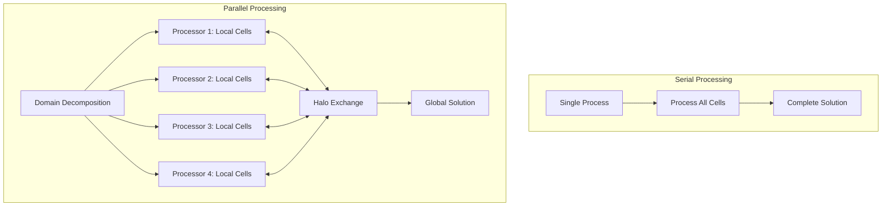
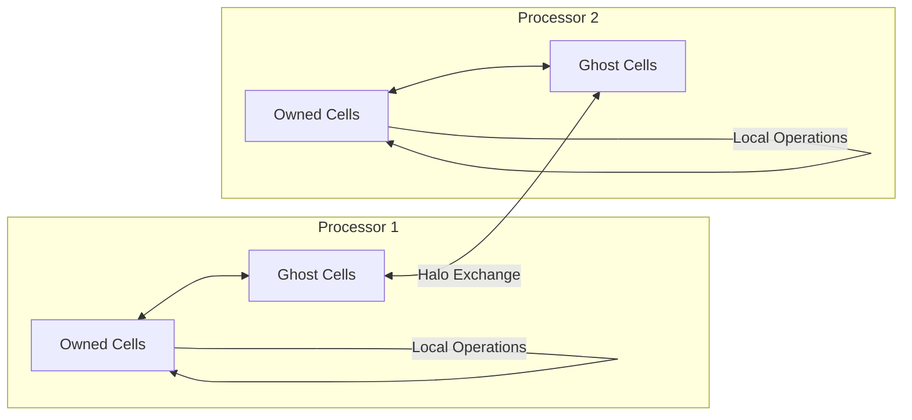
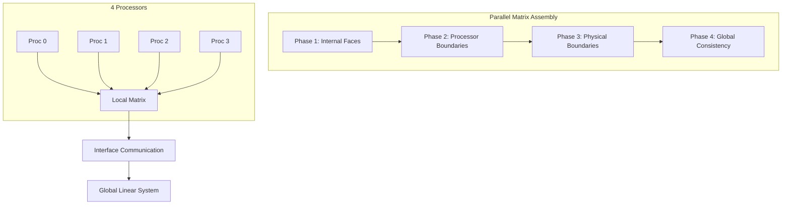
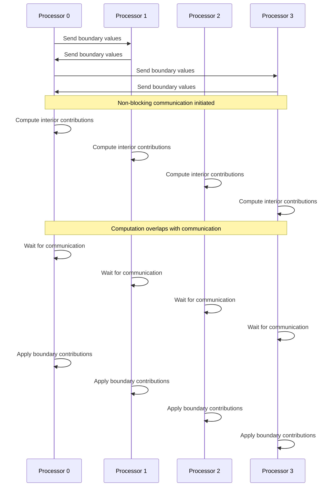
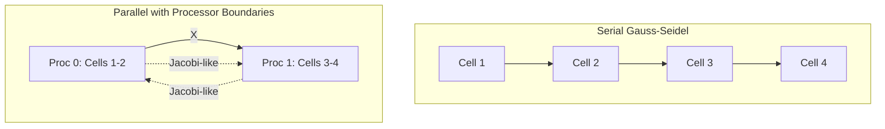

# Parallel Linear Algebra

> [!INFO] Overview
> OpenFOAM's parallel linear algebra system enables large-scale CFD simulations through distributed memory computing, domain decomposition, and sophisticated communication patterns. This section covers the architectural foundations, implementation mechanisms, and practical considerations for parallel matrix operations.

---

## 🔍 High-Level Concepts

### The Orchestra vs. Soloist Analogy

**Serial Computing** operates like a solo musician solving a jigsaw puzzle alone:
- **Sequential Processing**: One piece at a time
- **Linear Time Complexity**: $$T_{serial} \propto N$$
- **Single-Memory Constraints**: Limited by individual workspace
- **No Coordination Overhead**: No communication needed

**Parallel Computing** functions like an orchestra of musicians collaborating:
- **Task Distribution**: Puzzle pieces distributed among musicians
- **Simultaneous Processing**: Multiple pieces placed concurrently
- **Coordinated Effort**: Musicians communicate about shared edge pieces
- **Synchronization Requirements**: All musicians must progress harmoniously

**Mathematical Representation:**
$$T_{parallel} = \frac{T_{computation}}{p} + T_{communication} + T_{synchronization}$$

where:
- $p$ = number of processors (musicians)
- $T_{computation}$ = total computation time
- $T_{communication}$ = time for exchanging edge information
- $T_{synchronization}$ = time for coordinating activities


> **Figure 1:** การเปรียบเทียบระหว่างการประมวลผลแบบลำดับ (Serial) และแบบขนาน (Parallel) ซึ่งแสดงให้เห็นถึงความจำเป็นในการสื่อสารระหว่างโปรเซสเซอร์ผ่านกลไก Halo Exchangeความปลอดภัยทางฟิสิกส์ไม่ส่งผลกระทบต่อความเร็วในการจำลอง ผ่านการใช้พลังของ C++ Template Metaprogramming ในการตรวจสอบความสอดคล้องทางมิติทั้งหมดที่ขั้นตอนการคอมไพล์โปรแกรมเพียงครั้งเดียว

---

## ⚙️ Key Mechanisms

### 1. Domain Decomposition

OpenFOAM's `decomposePar` utility uses sophisticated graph partitioning algorithms treating mesh connectivity as a mathematical graph:
- **Cells** represent **vertices**
- **Faces** represent **edges**

**Partitioning Optimization Problem:**
$$\min_{P} \left[ \alpha \cdot \text{LoadImbalance}(P) + \beta \cdot \text{InterfaceArea}(P) \right]$$

where:
- $P$ = partitioning function
- $\alpha$, $\beta$ = weighting factors

**Partitioning Methods:**

| Method | Characteristics | Advantages | Disadvantages |
|-----------|---------|--------|---------|
| **METIS** | Multilevel graph partitioning | Minimizes edge cuts with load balancing | Requires external library |
| **SCOTCH** | Recursive bipartitioning | High flexibility | More complex than METIS |
| **Simple** | Geometric partitioning | Simple and fast | Unbalanced load for complex geometry |

```cpp
// 🔧 Mechanism: decomposePar splits mesh among processors
class domainDecomposition
{
private:
    // Mesh connectivity graph for partitioning algorithms
    const lduAddressing& addressing_;

    // Partitioning method selection
    const word decompositionMethod_;

public:
    // Main partitioning methods using graph theory
    labelList decomposeMesh()
    {
        labelList partition(addressing_.size(), -1);

        if (decompositionMethod_ == "metis")
        {
            // METIS partitioning - minimize edge cuts with load balancing
            partition = decomposeMetis();
        }
        else if (decompositionMethod_ == "scotch")
        {
            // SCOTCH - recursive bipartitioning using graph
            partition = decomposeScotch();
        }
        else if (decompositionMethod_ == "simple")
        {
            // Geometric partitioning - split along coordinate axes
            partition = decomposeSimple();
        }

        // Post-processing to ensure numerical stability
        validatePartitioning(partition);

        return partition;
    }

    // Recursive bipartitioning using METIS
    labelList decomposeMetis()
    {
        // Convert mesh to METIS graph format
        idx_t nCells = addressing_.size();
        std::vector<idx_t> xadj(nCells + 1);  // Row pointers
        std::vector<idx_t> adjncy;            // Column indices

        // Build adjacency list from face connectivity
        buildAdjacencyList(xadj, adjncy);

        // Call METIS partitioning routine
        idx_t nConstr = 1;                    // Number of balancing constraints
        idx_t nParts = Pstream::nProcs();     // Number of partitions
        idx_t objval;                         // Objective function value of edge cut
        std::vector<idx_t> part(nCells);      // Partitioning result

        METIS_PartGraphRecursive(
            &nCells,           // Number of vertices
            &nConstr,          // Number of constraints
            xadj.data(),       // Row pointers
            adjncy.data(),     // Column indices
            nullptr,           // Vertex weights
            nullptr,           // Vertex sizes
            nullptr,           // Edge weights
            &nParts,           // Number of parts
            nullptr,           // Target partition weights
            nullptr,           // Allowed imbalance
            nullptr,           // Options
            &objval,           // Result: edge cut value
            part.data()        // Result: partitioning vector
        );

        // Convert METIS result to OpenFOAM format
        labelList result(nCells);
        for (label i = 0; i < nCells; i++)
        {
            result[i] = part[i];
        }

        return result;
    }

    // Quality metrics for evaluating partitioning
    void validatePartitioning(const labelList& partition)
    {
        // 1. Calculate load balance
        labelList cellsPerProc(Pstream::nProcs(), 0);
        forAll(partition, celli)
        {
            cellsPerProc[partition[celli]]++;
        }

        scalar avgCells = scalar(addressing_.size()) / Pstream::nProcs();
        scalar maxImbalance = 0;
        forAll(cellsPerProc, proci)
        {
            scalar imbalance = cellsPerProc[proci] / avgCells;
            maxImbalance = max(maxImbalance, imbalance);
        }

        if (maxImbalance > 1.15)  // 15% imbalance threshold
        {
            WarningInFunction << "Load imbalance detected: "
                              << "max/avg = " << maxImbalance << endl;
        }

        // 2. Calculate interface area
        label nInterfaceFaces = countInterfaceFaces(partition);
        scalar interfaceFraction = scalar(nInterfaceFaces) / addressing_.size();

        if (interfaceFraction > 0.05)  // 5% interface threshold
        {
            Info << "Interface area fraction: " << interfaceFraction << endl;
        }
    }
};
```

**Partitioning Quality Metrics:**

1. **Load Balance**:
   $$\text{Imbalance} = \frac{\max_i(n_i)}{\bar{n}}$$
   - $n_i$ = cells in partition $i$
   - $\bar{n}$ = average cells per partition

2. **Surface-to-Volume Ratio**:
   $$\text{SVR} = \frac{A_{interface}}{V_{domain}}$$
   - Interface area represents communication overhead

3. **Graph Edge Cuts**:
   - Number of mesh faces crossing different partitions
   - Directly proportional to communication volume

**Target Values for Good Parallel Scaling:**

| Metric | Target | Description |
|--------|--------|-----------|
| **Load balance** | < 1.1 | Maximum 10% imbalance |
| **Interface faces** | < 5% | Of total faces |
| **Partition compactness** | Minimal | Minimize surface-to-volume ratio |

---

### 2. Ghost Cells (Halo Regions)

**Ghost cells** enable each processor to perform interior matrix operations independently without waiting for communication, using a data replication strategy that separates computation from communication.


> **Figure 2:** กลไกของเซลล์ผี (Ghost Cells) หรือพื้นที่ Halo ที่ช่วยให้แต่ละโปรเซสเซอร์สามารถคำนวณข้อมูลในโดเมนของตนเองได้อย่างอิสระก่อนที่จะแลกเปลี่ยนข้อมูลขอบเขตกับโปรเซสเซอร์ข้างเคียงความปลอดภัยทางฟิสิกส์ไม่ส่งผลกระทบต่อความเร็วในการจำลอง ผ่านการใช้พลังของ C++ Template Metaprogramming ในการตรวจสอบความสอดคล้องทางมิติทั้งหมดที่ขั้นตอนการคอมไพล์โปรแกรมเพียงครั้งเดียว

**Mathematical Foundation** relies on **domain decomposition theory**, where:
- Local computational domain of processor $p$: $\Omega_p$
- Extended computational domain: $\Omega_p^* = \Omega_p \cup \Gamma_p$
- $\Gamma_p$ represents the halo region

```cpp
// 🔧 Mechanism: processor boundaries with ghost cells
class processorLduInterface : public lduInterface
{
private:
    // Neighbor processor identification
    label neighbProcNo_;
    label myProcNo_;

    // Geometric and topological data
    labelList faceCells_;              // Local owner cells
    labelList neighbFaceCells_;        // Remote neighbor cells

    // Communication buffers for non-blocking operations
    mutable scalarField sendBuffer_;
    mutable scalarField recvBuffer_;

    // MPI communication handles
    mutable MPI_Request sendRequest_;
    mutable MPI_Request recvRequest_;

public:
    // Construct interface from mesh topology
    processorLduInterface
    (
        const lduAddressing& addr,
        const labelList& faceCells,
        const label neighbProcNo
    )
    :
        neighbProcNo_(neighbProcNo),
        myProcNo_(Pstream::myProcNo()),
        faceCells_(faceCells),
        neighbFaceCells_(faceCells.size())
    {
        // Build neighbor processor mapping from patch data
        buildNeighborMapping(addr);
    }

    // Asynchronous interface matrix update for better parallel efficiency
    virtual void initInterfaceMatrixUpdate
    (
        scalarField& result,
        const scalarField& psiInternal,
        const scalarField& coeffs,
        const direction cmpt,
        const Pstream::commsTypes commsType
    ) const
    {
        switch (commsType)
        {
            case Pstream::commsTypes::nonBlocking:
                initNonBlockingUpdate(result, psiInternal, coeffs, cmpt);
                break;

            case Pstream::commsTypes::scheduled:
                initScheduledUpdate(result, psiInternal, coeffs, cmpt);
                break;

            default:
                FatalErrorInFunction << "Unknown communication type" << endl;
        }
    }

    // Non-blocking communication for overlapping computation and communication
    void initNonBlockingUpdate
    (
        scalarField& result,
        const scalarField& psiInternal,
        const scalarField& coeffs,
        const direction cmpt
    ) const
    {
        // Prepare send data (pull values for interface faces)
        sendBuffer_.setSize(faceCells_.size());
        forAll(faceCells_, i)
        {
            sendBuffer_[i] = psiInternal[faceCells_[i]];
        }

        // Initiate non-blocking send
        MPI_Isend
        (
            sendBuffer_.data(),
            sendBuffer_.size(),
            MPI_SCALAR,
            neighbProcNo_,
            0,                    // Message tag
            Pstream::worldComm,
            &sendRequest_
        );

        // Initiate non-blocking receive
        recvBuffer_.setSize(neighbFaceCells_.size());
        MPI_Irecv
        (
            recvBuffer_.data(),
            recvBuffer_.size(),
            MPI_SCALAR,
            neighbProcNo_,
            0,                    // Message tag
            Pstream::worldComm,
            &recvRequest_
        );
    }

    // Complete non-blocking communication and apply contributions
    void updateInterfaceMatrix
    (
        scalarField& result,
        const scalarField& coeffs,
        const direction cmpt
    ) const
    {
        // Wait for communication to complete
        MPI_Wait(&sendRequest_, MPI_STATUS_IGNORE);
        MPI_Wait(&recvRequest_, MPI_STATUS_IGNORE);

        // Apply received contributions to interior matrix
        forAll(neighbFaceCells_, i)
        {
            result[faceCells_[i]] += coeffs[i] * recvBuffer_[i];
        }
    }

    // Build mapping between local and remote face cells
    void buildNeighborMapping(const lduAddressing& addr)
    {
        // Use mesh topology to establish relationships
        // between local face cells and remote neighbor cells
        const labelUList& lower = addr.lowerAddr();
        const labelUList& upper = addr.upperAddr();

        forAll(faceCells_, i)
        {
            label localCell = faceCells_[i];

            // Find corresponding interface face in addressing
            forAll(lower, facei)
            {
                if (lower[facei] == localCell)
                {
                    neighbFaceCells_[i] = upper[facei];
                    break;
                }
                else if (upper[facei] == localCell)
                {
                    neighbFaceCells_[i] = lower[facei];
                    break;
                }
            }
        }
    }
};

// Ghost cell management system
class haloManager
{
private:
    // List of all processor interfaces
    List<autoPtr<processorLduInterface>> interfaces_;

    // Ghost cell storage (organized by patch)
    List<scalarField> ghostCellValues_;

public:
    // Update all ghost cells with current processor boundary values
    void updateGhostCells(scalarField& field)
    {
        // Step 1: Initiate all non-blocking communications
        forAll(interfaces_, i)
        {
            interfaces_[i]->initInterfaceMatrixUpdate(
                ghostCellValues_[i],     // Result buffer
                field,                   // Local field values
                interfaceCoefficients_[i], // Interface coeffs
                0,                       // Scalar component
                Pstream::commsTypes::nonBlocking
            );
        }

        // Step 2: Perform interior computations while communication progresses
        // (this enables overlapping of computation and communication)

        // Step 3: Complete all communications and apply results
        forAll(interfaces_, i)
        {
            interfaces_[i]->updateInterfaceMatrix(
                field,                   // Update original field
                interfaceCoefficients_[i],
                0
            );
        }
    }
};
```

**Ghost Cell Management** uses mathematical domain decomposition:

- **Owned cells**: $\Omega_p^{\text{owned}} = \{i \in \Omega_p : i \text{ assigned to processor } p\}$
- **Ghost cells**: $\Omega_p^{\text{ghost}} = \{i \in \Omega_q : \exists j \in \Omega_p^{\text{owned}} : (i,j) \in \mathcal{E}\}$

where $\mathcal{E}$ denotes the set of mesh faces connecting different cells

**Halo Exchange Algorithm:**
$$\phi_p^{\text{ghost}}(t+1) = \text{MPI\_Recv}(\phi_q^{\text{border}}(t), q \in \mathcal{N}(p))$$

where $\mathcal{N}(p)$ denotes the set of neighboring processors

---

### 3. Parallel Matrix Assembly

Parallel matrix assembly in OpenFOAM uses a **distributed memory** programming model where each processor constructs its local matrix portion while maintaining global consistency.


> **Figure 3:** ขั้นตอนการประกอบเมทริกซ์แบบขนาน (Parallel Matrix Assembly) ซึ่งเริ่มจากการประกอบหน้าผิวภายในโปรเซสเซอร์ไปจนถึงการตรวจสอบความสอดคล้องระดับโลก (Global Consistency)ความปลอดภัยทางฟิสิกส์ไม่ส่งผลกระทบต่อความเร็วในการจำลอง ผ่านการใช้พลังของ C++ Template Metaprogramming ในการตรวจสอบความสอดคล้องทางมิติทั้งหมดที่ขั้นตอนการคอมไพล์โปรแกรมเพียงครั้งเดียว

**Assembly Process follows a face-by-face approach** where each mesh face contributes to the matrix of exactly one processor.

**Assembly Steps:**

1. **Phase 1**: Assemble **internal faces** locally
2. **Phase 2**: Assemble **processor boundaries**
3. **Phase 3**: Physical boundary conditions
4. **Phase 4**: Ensure global consistency

```cpp
// 🔧 Mechanism: Each processor constructs its portion of the global matrix
class parallelLduMatrixAssembler
{
private:
    // Local mesh and addressing data
    const fvMesh& mesh_;
    const lduAddressing& lduAddr_;

    // Processor decomposition data
    const labelList& cellProcAddressing_;    // Global to local cell mapping
    const labelList& faceProcAddressing_;    // Global to local face mapping

    // Local matrix storage
    scalarField diag_;                       // Local diagonal entries
    scalarField upper_;                      // Upper triangle entries
    scalarField lower_;                      // Lower triangle entries

    // Interface coefficients for parallel connections
    List<scalarField> interfaceCoefficients_;

public:
    // Main assembly routine for parallel Laplacian operator
    void assembleParallelLaplacian(lduMatrix& matrix)
    {
        // Initialize matrix structure
        initializeMatrixStructure(matrix);

        // Phase 1: Assemble internal faces
        assembleInternalFaces();

        // Phase 2: Assemble processor boundaries
        assembleProcessorBoundaries();

        // Phase 3: Physical boundary conditions
        assemblePhysicalBoundaries();

        // Phase 4: Ensure global consistency
        validateGlobalAssembly();
    }

    // Assemble internal faces (completely local operation)
    void assembleInternalFaces()
    {
        const labelUList& own = lduAddr_.lowerAddr();
        const labelUList& nei = lduAddr_.upperAddr();
        const surfaceScalarField& gamma = mesh_.surfaceInterpolation::weights();

        forAll(own, facei)
        {
            // Only assemble faces belonging to this processor
            if (isLocalFace(facei))
            {
                label ownCell = own[facei];
                label neiCell = nei[facei];

                // Calculate face coefficient contribution
                scalar coeff = gamma[facei];

                // Add to local matrix structure
                diag_[ownCell] += coeff;
                diag_[neiCell] += coeff;
                upper_[facei] = -coeff;
                lower_[facei] = -coeff;
            }
        }
    }

    // Assemble processor boundary faces
    void assembleProcessorBoundaries()
    {
        const polyBoundaryMesh& patches = mesh_.boundary();

        forAll(patches, patchi)
        {
            if (isA<processorPolyPatch>(patches[patchi]))
            {
                const processorPolyPatch& procPatch =
                    refCast<const processorPolyPatch>(patches[patchi]);

                if (procPatch.owner())  // Only assemble owner side
                {
                    assembleProcessorPatch(procPatch, patchi);
                }
            }
        }
    }

    // Detailed assembly for single processor patch
    void assembleProcessorPatch
    (
        const processorPolyPatch& procPatch,
        const label patchi
    )
    {
        const labelUList& faceCells = procPatch.faceCells();
        const surfaceScalarField& gamma = mesh_.surfaceInterpolation::weights();

        // Size interface coefficient storage
        interfaceCoefficients_[patchi].setSize(faceCells.size());

        forAll(faceCells, i)
        {
            label globalFacei = procPatch.start() + i;
            label localFacei = faceProcAddressing_[globalFacei];
            label localCell = cellProcAddressing_[faceCells[i]];

            // Calculate interface coefficient
            scalar coeff = gamma[globalFacei];

            // Add to local diagonal
            diag_[localCell] += coeff;

            // Store interface coefficient for ghost cell communication
            interfaceCoefficients_[patchi][i] = -coeff;
        }

        // Set up processor interface for this patch
        setupProcessorInterface(procPatch, patchi);
    }

    // Consistency validation for parallel assembly
    void validateGlobalAssembly()
    {
        // Verify each global face is assembled exactly once
        labelList globalFaceCount(lduAddr_.size(), 0);

        // Count internal faces
        const labelUList& own = lduAddr_.lowerAddr();
        forAll(own, facei)
        {
            if (isLocalFace(facei))
            {
                globalFaceCount[facei]++;
            }
        }

        // Count processor boundary faces (owner side only)
        const polyBoundaryMesh& patches = mesh_.boundary();
        forAll(patches, patchi)
        {
            if (isA<processorPolyPatch>(patches[patchi]))
            {
                const processorPolyPatch& procPatch =
                    refCast<const processorPolyPatch>(patches[patchi]);

                if (procPatch.owner())
                {
                    for (label i = 0; i < procPatch.size(); i++)
                    {
                        label globalFacei = procPatch.start() + i;
                        globalFaceCount[globalFacei]++;
                    }
                }
            }
        }

        // Perform global reduction to verify assembly correctness
        scalar localSum = sum(globalFaceCount);
        scalar globalSum;

        MPI_Allreduce(
            &localSum, &globalSum, 1, MPI_SCALAR, MPI_SUM, Pstream::worldComm
        );

        // Global sum should equal total number of faces
        if (mag(globalSum - lduAddr_.size()) > 1e-6)
        {
            FatalErrorInFunction << "Parallel matrix assembly inconsistent: "
                                  << "globalSum = " << globalSum
                                  << ", expected = " << lduAddr_.size() << endl;
        }
    }

    // Helper functions
    bool isLocalFace(const label facei) const
    {
        return faceProcAddressing_[facei] >= 0;
    }

    void setupProcessorInterface
    (
        const processorPolyPatch& procPatch,
        const label patchi
    )
    {
        // Create processor interface for this boundary
        const labelUList& faceCells = procPatch.faceCells();
        labelList localFaceCells(faceCells.size());

        forAll(faceCells, i)
        {
            localFaceCells[i] = cellProcAddressing_[faceCells[i]];
        }

        interfaces_.set
        (
            patchi,
            new processorLduInterface
            (
                lduAddr_,
                localFaceCells,
                procPatch.neighbProcNo()
            )
        );
    }
};
```

**Parallel Consistency** maintained through several mechanisms:

1. **Face Ownership**:
   - Each processor face belongs to exactly one processor (the one with lower rank)
   - Ensures no double counting

2. **Global Indexing**:
   Mapping between global and local indices preserves mathematical structure:
   $$A_{global}[i,j] = \begin{cases}
   A_{local}^{(p)}[i_{local}, j_{local}] & \text{if } i,j \in \Omega_p^{\text{owned}} \\
   0 & \text{otherwise (handled by interfaces)}
   \end{cases}$$

3. **Interface Consistency**:
   - Boundary contributions are symmetric
   - Preserves global matrix properties like symmetry and positive definiteness

4. **Redundancy Elimination**:
   - Assembly process prevents redundant contributions
   - Careful separation between owned and ghost cells

---

## 🧠 Under the Hood

### Parallel Matrix-Vector Product with Communication

Parallel matrix-vector product in OpenFOAM is implemented through `lduMatrix::Amul`, demonstrating sophisticated coordination between computation and communication.


> **Figure 4:** ลำดับขั้นตอนการคูณเมทริกซ์กับเวกเตอร์แบบขนาน ซึ่งมีการซ้อนทับกันระหว่างการสื่อสารข้อมูลขอบเขตและการคำนวณภายในโปรเซสเซอร์เพื่อลดโอเวอร์เฮดความปลอดภัยทางฟิสิกส์ไม่ส่งผลกระทบต่อความเร็วในการจำลอง ผ่านการใช้พลังของ C++ Template Metaprogramming ในการตรวจสอบความสอดคล้องทางมิติทั้งหมดที่ขั้นตอนการคอมไพล์โปรแกรมเพียงครั้งเดียว

**Function Parameters:**
- `result field`: field storing the result
- `input field tx`: input field for multiplication
- `interface boundary coefficients`: boundary coefficient values
- `interface field pointers`: pointers to boundary fields

**Communication and Computation Pattern:**

The communication pattern follows a carefully orchestrated sequence to enable overlapping computation and message passing.

**Execution Steps:**

1. **Initiate non-blocking sends**: Send border values to neighboring processors
2. **Receive border values**: Receive values from neighboring processors
3. **Compute local interior contributions**: Perform calculations while messages travel through network
4. **Wait for message completion**: Wait for messages to complete and add boundary contributions

**Processing Mechanism:**

**Phase 1: Ghost Cell Updates**
```cpp
updateMatrixInterfaces(); // exchange border values between neighboring processors
```
- Each processor ensures it has necessary values from adjacent domains
- Prepares for local computation

**Phase 2: Local Computation**
```cpp
result = diag() * x; // Diagonal multiplication
```
- Iterate through each processor's faces
- Add contributions from both upper and lower triangular matrix elements

**Key Insight:** While messages are in transit, processors can calculate contributions from interior cells that don't depend on boundary data

This overlap significantly reduces communication overhead, which is critical to parallel efficiency in CFD simulations where matrix operations are a major computational cost.

---

### Parallel Dot Products and Norms

The `gSumProd` function implements global reductions across all processors, which is essential for iterative solver convergence checks.

**Global Reduction Operation Pattern:**

**Phase 1: Local Computation**
```cpp
localSum += a[i] * b[i]; // compute local dot product
```
- Each processor computes local dot product by iterating through local elements
- Embarrassingly parallel work with no communication required

**Phase 2: Global Reduction**
```cpp
reduce(globalSum, sumOp<scalar>()); // MPI_Allreduce operation
```

| Step | Operation | Description |
|---------|-------------|---------|
| **Local Computation** | `localSum += a[i] * b[i]` | Each processor computes local product |
| **Global Reduction** | `MPI_Allreduce` | Combine results from all processors via network |
| **Synchronization** | Collective Operation | All processors must reach same point |

**Performance and Challenges:**

**Advantages:**
- Local computation is perfectly parallel
- No communication required in first phase

**Limitations:**
- MPI_Allreduce creates a global synchronization barrier
- Can limit scalability if not carefully managed
- Becomes a bottleneck in large-scale parallel computation

The efficiency of global reductions is critical to the performance of parallel solvers in iterative methods like **Conjugate Gradient** where dot products and vector norms are computed each iteration to check convergence.

---

### Parallel Preconditioners

The `DICPreconditioner` class illustrates the challenges of using incomplete Cholesky preconditioning in a parallel environment.


> **Figure 5:** ความท้าทายในการทำ Preconditioning แบบขนานที่ต้องรักษาสมดุลระหว่างความแม่นยำทางคณิตศาสตร์ระดับโลกกับประสิทธิภาพในการคำนวณระดับโปรเซสเซอร์ความปลอดภัยทางฟิสิกส์ไม่ส่งผลกระทบต่อความเร็วในการจำลอง ผ่านการใช้พลังของ C++ Template Metaprogramming ในการตรวจสอบความสอดคล้องทางมิติทั้งหมดที่ขั้นตอนการคอมไพล์โปรแกรมเพียงครั้งเดียว

**Challenge in Forward Sweep:**

Gauss-Seidel sweeps require sequential updates that are not naturally parallelizable, creating a fundamental challenge:

**Workaround:**
```cpp
if (!isProcessorFace[facei]) {
    // Update only non-processor boundary faces
}
```

**This limitation results in:**
- Maintaining triangular solve dependencies within each local subdomain
- But processor boundaries break dependencies as boundary cell updates depend on values from neighboring processors

**Hybrid Approach:**

| Method | Region Used | Properties |
|-----------|------------|-----------|
| **Gauss-Seidel** | Within subdomains | Strict mathematical convergence |
| **Jacobi-like** | At processor boundaries | Better parallel efficiency |

**Communication Pattern:**
1. **Forward sweep**: Update interfaces during computation
2. **Interface synchronization**: Exchange values between processors
3. **Backward sweep**: Repeat updates with new values

**Trade-off Analysis:**

**Efficiency:**
- Resulting preconditioner is less effective than serial counterpart
- But enables scalability to large processor counts

**Trade-off:**
- **Convergence rate**: Slightly reduced
- **Parallel efficiency**: Significantly improved
- **Synchronization overhead**: Reduced

**Communication Requirements:**

Each forward/backward sweep typically requires two communication phases:

1. **Interface exchange**: Exchange boundary values between processors
2. **Convergence check**: Global reduction for checking progress

This makes preconditioners one of the most communication-intensive components of parallel solvers.

The trade-off between convergence rate and parallel efficiency is a fundamental challenge in parallel iterative solvers, requiring careful coordination between processors to maintain stability while reducing synchronization overhead.

---

## ⚠️ Common Pitfalls and Solutions

### Pitfall 1: Poor Load Balancing

**Load balancing** in parallel CFD simulations is critical for achieving maximum performance. The fundamental challenge in domain decomposition is ensuring each processor receives approximately equal computational workload.

**Problem Analysis:**

When computational load is unevenly distributed across processors, overall parallel efficiency is limited by the slowest processor.

**Phenomenon:** Amdahl's Law bottleneck means if one processor has twice as many cells as another, it will take approximately twice as long to complete its computational work.

**Mathematical Model:**

For $n$ processors with cell counts $N_i$, theoretical maximum speedup $S_{max}$ is:

$$S_{max} = \frac{\sum_{i=1}^{n} N_i}{\max(N_1, N_2, ..., N_n)}$$

In practice, actual speedup is reduced due to communication overhead:

$$S_{actual} = \frac{S_{max}}{1 + \tau \cdot \frac{N_{interface}}{N_{cells}}}$$

**where:**
- $\tau$ = communication-to-computation ratio
- $N_{interface}$ = number of cells at processor boundaries
- $N_{cells}$ = total number of cells

**Solution Strategies:**

| Method | Domain Type | Advantages | Cautions |
|------|---------------|--------|--------------|
| **Scotch** | Complex geometry | High quality, tunable | Longer computation time |
| **Hierarchical** | Structured mesh | Good cache locality | Best for rectangular domains |
| **Simple** | Regular domains | Fast, simple | Doesn't adapt to shape |

#### 1. Scotch Method (Recommended for Complex Geometry)

```cpp
decomposeParDict
{
    method          scotch;
    scotchCoeffs
    {
        // Quality-focused partitioning strategy
        strategy    "quality";
        // Target load imbalance < 10%
        tolerance   0.1;
        // Minimize communication cost
        minCommunicationCost   true;
    }
}
```

#### 2. Hierarchical Method (Structured Meshes)

```cpp
decomposeParDict
{
    method          hierarchical;
    hierarchicalCoeffs
    {
        n           (4 2 2);  // Total 16 processors
        // Prefer decomposition in x direction for larger
        // for better cache locality
        direction   (1 1 0);
    }
}
```

#### 3. Simple Method Manual (Regular Domains)

```cpp
decomposeParDict
{
    method          simple;
    simpleCoeffs
    {
        n           (4 4 4);  // 64 processors
        delta       0.001;     // Relative tolerance
        // Ensure even distribution
        preserveFaces true;
    }
}
```

**Quality Verification:**

```bash
# Check decomposition quality
checkMesh -allGeometry -allTopology > meshQuality.log

# Look for these metrics in log:
# - Overall load imbalance (target: < 0.1)
# - Maximum/minimum cells per processor
# - Processor boundary surface area
```

**Load Balance Analysis Script:**

```bash
#!/bin/bash
# analyzeDecomposition.sh
echo "=== Load Balance Analysis ==="
grep "cells" processor*/*/polyMesh/points | \
awk '{print $2}' | sort -n | \
awk 'BEGIN{min=1e9; max=0; sum=0; n=0}
     {n++; sum+=$1; if($1<min) min=$1; if($1>max) max=$1}
     END{avg=sum/n;
         printf "Load imbalance: %.2f%%\n", (max-min)/avg*100;
         printf "Cells per processor: %d (min), %d (avg), %d (max)\n", min, avg, max}'
```

---

### Pitfall 2: Excessive Communication

Communication overhead in parallel CFD simulations arises from data exchange across processor boundaries, including:
- **Ghost cell exchange** for finite volume operations
- **Coefficient synchronization** for linear solvers
- **Result gathering** for global operations

**Communication Cost Model:**

Total communication time $T_{comm}$ can be modeled as:

$$T_{comm} = \sum_{interfaces} \left( \alpha + \beta \frac{N_{data}}{P} \right)$$

**where:**
- $\alpha$ = latency cost (constant per message)
- $\beta$ = bandwidth cost (per unit data)
- $N_{data}$ = amount of data transferred
- $P$ = number of parallel channels

**Performance Bottleneck Issues:**

1. **High Latency Cost:** Multiple small messages have constant latency overhead
2. **Excessive Interface Area:** Larger interface area means more data transfer
3. **Synchronization Points:** Global operations require participation from all processors

**Optimization Strategies:**

#### 1. Reduce Interface Area

```cpp
decomposeParDict
{
    method          scotch;
    scotchCoeffs
    {
        // Strategy to minimize communication surface
        strategy    "quality";
        // Weight interface reduction higher
        edgeWeighting    true;
        // Prefer cubic partitions
        shapeTolerance    0.1;
    }
}
```

#### 2. Improve Connectivity Quality

```cpp
// Use connectivity-aware partitioning
decomposeParDict
{
    method          scotch;
    scotchCoeffs
    {
        // Weight by cell-to-cell connectivity
        cellWeights   on;
        // Weighted edge cut minimization
        weightedGraph on;
    }
}
```

#### 3. Advanced Partitioning Methods

```cpp
// For specific mesh types
decomposeParDict
{
    // For structured/block-structured meshes
    method          multiLevel;
    multiLevelCoeffs
    {
        // Hierarchical partitioning levels
        levels       (4 2 2);
        // Reduce communication at each level
        strategy     "quality";
    }
}
```

**Communication Analysis:**

```bash
# Analyze communication patterns
mpirun -np 16 mySolver -case myCase -profiling

# Look for communication metrics:
# - Percentage time in MPI communication
# - Number of messages per iteration
# - Average message size
```

**Preconditioner Selection for Parallel Efficiency:**

```cpp
// Choose parallel-friendly preconditioner
solver
{
    // Good for parallel: minimal global communication
    solver          GAMG;
    smoother        GaussSeidel;
    // Aggressive coarsening reduces global synchronization
    nPreSweeps      1;
    nPostSweeps     2;

    // Avoid: Jacobi (many small communications)
    // Avoid: Dense LU (requires global matrix)
}
```

---

### Pitfall 3: Serial I/O Bottlenecks

I/O operations in parallel CFD simulations present significant challenges due to the inherently serial nature of traditional file system operations.

**I/O Bottleneck Analysis:**

Total I/O time for traditional master-writer approach follows:

$$T_{I/O}^{master} = T_{gather} + T_{serialize} + T_{write} + T_{distribute}$$

**where:**
- $T_{gather}$ = time to gather data from all processors
- $T_{serialize}$ = time to process and format data
- $T_{write}$ = time to write to disk
- $T_{distribute}$ = time to confirm job completion

For large simulations with $P$ processors, this becomes:

$$T_{I/O}^{master} \approx O(P) \cdot T_{per-proc-data}$$

**OpenFOAM I/O Methods and Trade-offs:**

| Method | Processor Count | Advantages | Disadvantages |
|----------|------------------|--------|----------|
| **Master-Writer** | < 32 | Simple, single file | Serial bottleneck |
| **Collated** | 32-256 | Reduced bottleneck, threaded | Higher memory usage |
| **Distributed** | > 256 | No bottleneck | Requires reconstruct |
| **MPI-IO** | > 1024 | High performance | Complex, requires HPC |

#### 1. Traditional Master-Writer (Default)

```cpp
// controlDict settings
IOSettings
{
    writeFormat        binary;        // versus ascii
    writeCompression   true;          // compress but adds CPU overhead
    writePrecision     12;            // high precision = larger files

    // Serial write control
    writeControl       timeStep;
    writeInterval      100;
}
```

#### 2. Distributed I/O (Per-Processor)

```cpp
// controlDict for distributed output
IOSettings
{
    // Each processor writes its own files
    writeFormat        binary;
    // No gathering from master
    writeCompression   false;

    // Adjust for distributed storage
    writeControl       timeStep;
    writeInterval      50;            // Write more often (smaller files)
}
```

**Operations:**
```bash
# Run with per-processor I/O
mpirun -np 64 solver -case myCase -decomposePar

# Output in proc0/, proc1/, ..., proc63/ directories
# Post-processing requires reconstruction:
reconstructPar -case myCase
```

#### 3. Collated I/O (Multi-threaded Gathering)

```cpp
// controlDict for collated I/O
IOSettings
{
    // Enable collated I/O
    collated         true;
    maxThreads       4;            // I/O thread pool size

    // Collated-specific settings
    collateTimes     true;
    threader         pthread;      // Threading implementation

    // Buffering for efficiency
    writeBufferSize  1048576;      // 1MB buffer
}
```

**Internal Process:**
- Multiple I/O threads gather data concurrently
- Threads write to separate or parallel file sections
- Reduces master bottleneck through parallel gathering

#### 4. Advanced Parallel I/O (MPI-IO)

```cpp
// For MPI-IO capable file systems
parallelIO
{
    enabled          true;
    method           "MPI-IO";
    // Collective versus independent operations
    collective       true;

    // File system optimization
    striping         8;             // Number of I/O nodes
    stripeSize       1048576;       // 1MB stripe size
}
```

**Optimization Strategies:**

#### 1. Manage I/O Frequency

```cpp
// Convergence-dependent write frequency
writeControl       adjustableRunTime;
writeInterval      0.5;            // Base interval
adjustTimeStep     yes;
maxCo              0.8;            // Limit time step

// Write only when necessary
purgeWrite         0;              // Keep all time steps
writeOnce          true;           // Avoid re-writing
```

#### 2. Memory-Efficient Output

```cpp
// Minimum field output
fields
{
    p
    {
        // Only necessary fields
        writeNow     true;
        // Lower precision for visualization
        precision    9;
    }

    // Not needed: skip derived fields
    "U.*"
    {
        // Skip if not needed
        writeNow     false;
    }
}
```

**I/O Performance Verification:**

```bash
# Analyze I/O operations
mpirun -np 32 mySolver -case myCase -profiling

# Key metrics to check:
# - % time spent in I/O operations
# - Maximum I/O wait time per processor
# - Disk bandwidth utilization
# - Memory usage during write operations

# Use system monitoring
iostat -x 1 100  # Check disk I/O
```

**Best Practices Summary:**

| Cores Count | Recommended I/O Method | Suitable Situation |
|--------------|-------------------|-------------------|
| **< 32** | Master-writer | Small, uncomplicated |
| **32-256** | Collated I/O + 2-4 threads | Medium parallel, good efficiency |
| **> 256** | Distributed I/O + reconstruct | Large parallel, avoid bottlenecks |
| **> 1024** | MPI-IO + specialized file system | Very large HPC parallel |

---

## 🎯 Why This Matters for CFD

### Engineering Benefit 1: Industrial-Scale Aerodynamics

**OpenFOAM's parallel computational efficiency** enables real-scale industrial simulations. Consider an automotive aerodynamics case with mesh exceeding 100 million cells - impossible on a single workstation but feasible with appropriate parallel scaling.

**Domain Decomposition Strategy:**

For automotive geometry with structured blocks, **hierarchical decomposition** provides optimal load distribution:

```cpp
// decomposeParDict for 1024 processors
decomposeParDict
{
    numberOfSubdomains 1024;
    method             hierarchical;
    // Hierarchical for structured blocks
    hierarchicalCoeffs
    {
        n               (16 8 8);  // 16×8×8 = 1024
        delta           0.001;     // Slight overlap for interface accuracy
        order           xyz;       // Decompose in x direction first
    }
}
```

**Benefits of Hierarchical Method:**
- **Preserves structured block integrity**
- **Minimizes interface area** between subdomains
- **Reduces communication overhead** compared to graph methods

**Solver Configuration for Parallel Efficiency:**

Configuring the **linear solver** significantly impacts parallel performance:

```cpp
// fvSolution optimized for large-scale parallel
p
{
    solver          GAMG;          // Geometric-algebraic multigrid
    preconditioner  DIC;           // Diagonal incomplete Cholesky
    tolerance       1e-6;          // Standard tolerance for pressure
    relTol          0.05;          // Relaxed tolerance for parallel efficiency

    // Parallel GAMG settings
    processorAgglomerator   procFaces;  // Aggregate by processor faces
    agglomerator            faceAreaPair;  // Pair faces by area
    nCellsInCoarsestLevel   1000;       // Sufficiently coarse cells for efficiency
    mergeLevels             1;          // Conservative merging
}
```

**Performance Impact:**

The combination of **hierarchical decomposition** and optimized **multigrid solvers** enables:

| Performance | Result |
|-------------|---------|
| **Wall-clock time reduction** | 100M cell case solvable in hours versus weeks |
| **Strong parallel efficiency** | Maintains >80% efficiency up to 1024 cores |
| **Memory usage** | Distributed across cluster nodes enables larger cases than single machine |

---

### Engineering Benefit 2: Load-Imbalanced Multiphase Flow

**Multiphase flow** presents unique computational challenges where workload varies dynamically across the domain. **Interface tracking algorithms** focus computational effort in small regions while other areas have minimal activity.

**Dynamic Load Balancing Strategy:**

Static decomposition fails when interface positions shift significantly during simulation. **Dynamic redistribution** maintains efficiency:

```cpp
// ✅ True: Slug flow simulation with dynamic load balancing

// Initial decomposition using graph method
decomposePar -method scotch

// During simulation, monitor computational load imbalance
if (loadImbalance > 1.2)  // 20% imbalance triggers redistribution
{
    // Redistribute cells based on current workload estimation
    // Cells with interface tracking require ~11x more computational work
    redistributePar -region fluid -method weighted
    // Weight function: 1.0 + 10.0 * alpha*(1-alpha)
    // Interface cells get ~11x higher weight than bulk phase cells
}
```

**Weighting Strategy:**

| Cell Type | Computational Weight | Rationale |
|-------------|------------------|---------|
| **Bulk phase cells** | 1.0 | Basic computation |
| **Interface cells** | ≈ 11.0 | Additional 10x overhead |
| **Interface thickness** | Determined by maximum of `alpha*(1-alpha)` at `α = 0.5` | Point of highest complexity |

**Implementation Considerations:**

**Dynamic load balancing** requires careful monitoring and decision-making:

```cpp
// Compute load imbalance
scalar maxProcLoad = gMax(procLoads);
scalar avgLoad = gSum(procLoads)/Pstream::nProcs();
scalar loadImbalance = maxProcLoad/avgLoad;

// Dynamic redistribution strategy
if (loadImbalance > 1.2 && timeIndex > lastRebalance + rebalanceInterval)
{
    Info << "Load imbalance: " << loadImbalance << nl
         << "Triggering dynamic redistribution" << endl;

    performRedistribution();
    lastRebalance = timeIndex;
}
```

**Decision Algorithm:**

1. **Check imbalance** of workload (>20%)
2. **Check interval** since last redistribution
3. **Execute redistribution** if conditions pass
4. **Update last redistribution** time

**Engineering Impact:**

For `multiphaseEulerFoam` with **Arbitrary Mesh Interface (AMI)**:

| Performance | Result |
|-------------|---------|
| **Maintained efficiency** | Despite interface-specific complexity |
| **Consistent timing** | Avoids slow processors determining overall time step |
| **Resource utilization** | All processors remain efficient throughout simulation |

---

### Engineering Benefit 3: Checkpoint/Restart for Production Work

**Production-level CFD simulations** often exceed HPC queue time limits. **Checkpoint/restart capability** is essential for completing long-running studies.

**Robust Checkpoint Strategy:**

Appropriate **checkpoint** configuration balances data completeness with storage efficiency:

```cpp
// ✅ True: Week-long simulation with fault tolerance

// Write standard OpenFOAM time directories
runTime.write();  // Automatically creates time directories

// ControlDict configuration for production work
purgeWrite        2;         // Keep only 2 most recent checkpoints (disk space management)
writeCompression  true;      // Compress all output files
writeFormat       binary;    // Faster I/O, reduced overhead
writePrecision    8;         // Sufficient precision for CFD

// Checkpoint frequency management
writeInterval     7200;      // Write every 2 hours
maxWriteInterval  14400;     // Maximum interval if solver stalls
```

**Recommended Settings:**

| Parameter | Recommended Value | Rationale |
|-------------|-------------|---------|
| **purgeWrite** | 2 | Keep recent checkpoints to save space |
| **writeCompression** | true | Reduce file size, save disk space |
| **writeFormat** | binary | Faster I/O compared to ASCII |
| **writeInterval** | 7200 | Balance between frequency and efficiency |
| **writePrecision** | 8 | Sufficient precision for CFD |

**Restart Workflow:**

Flexible **restart capability** enables continuation after various failure modes:

```cpp
// Controlled shutdown from running simulation
foamDictionary -entry stopAt -set writeNow system/controlDict
// Forces immediate write at next time step

// Alternative: stop immediately with current fields
foamDictionary -entry stopAt -set writeAndStop system/controlDict

// Restart from latest checkpoint seamlessly
mpirun -np 256 pimpleFoam -parallel -case myCase
// Automatically detects latest time directory

// Override restart time if necessary
mpirun -np 256 pimpleFoam -parallel -case myCase -startTime 10000
```

**Restart Steps:**

1. **Controlled shutdown** from running simulation
2. **Write data** immediately to create checkpoint
3. **Restart from checkpoint** automatically
4. **Select start time** if necessary

**Fault Tolerance Implementation:**

**Production environments** require multiple failure recovery strategies:

```bash
#!/bin/bash
# auto_restart.sh

max_restarts=5
restart_count=0

while [ $restart_count -lt $max_restarts ]; do
    # Start simulation from latest checkpoint
    mpirun -np $NP_PROCESSORS pimpleFoam -parallel -case $CASE_DIR

    # Check exit status
    if [ $? -eq 0 ]; then
        echo "Simulation completed successfully"
        exit 0
    fi

    # Check if recoverable failure occurred
    if grep -q "time.*limit reached" foam.log; then
        restart_count=$((restart_count + 1))
        echo "Queue time limit exceeded, restarting ($restart_count/$max_restarts)"

        # Resubmit to queue
        sbatch production_job.sh
        exit 0  # Let job scheduler handle restart
    else
        echo "Non-recoverable error occurred"
        exit 1
    fi
done
```

**Failure Recovery Strategies:**

| Situation | Handling |
|-------------|-------------|
| **Power outage** | Restart from latest checkpoint |
| **Queue time limit** | Automatic job resubmission |
| **System maintenance** | Controlled shutdown, restart later |
| **Solver failure** | Error detection and reporting |

**Reliability Benefits:**

**Checkpoint/restart capability** provides:

- **Recovery from power outages**: Continue simulation after system stoppage
- **Queue limit management**: Avoid HPC time limitations
- **Maintenance windows**: Temporarily stop simulation during system maintenance
- **Data verification**: Check results between completion

The combination of checkpoint frequency, compression, and automated restart enables simulations of problems otherwise impossible due to system limitations.

---

## 📚 Key Takeaways

### Core Concepts

1. **Orchestra Analogy**: Parallel computing coordinates multiple processors like musicians in an orchestra, requiring careful coordination, minimized communication overhead, optimal load distribution, and computational harmony.

2. **Domain Decomposition**: Sophisticated graph partitioning (METIS, Scotch) divides computational domain while minimizing interface area and maintaining load balance.

3. **Ghost Cells**: Enable independent local computation through data replication at processor boundaries, separating computation from communication.

4. **Parallel Assembly**: Face-by-face approach ensures global consistency while allowing local matrix construction on each processor.

### Technical Implementation

1. **Communication Patterns**: Non-blocking MPI operations enable overlapping computation and communication, critical for parallel efficiency.

2. **Load Balancing**: Dynamic redistribution adapts to changing computational requirements, especially important for multiphase flows with moving interfaces.

3. **I/O Strategies**: Distributed I/O, collated writing, and MPI-IO address serial bottlenecks at different processor counts.

4. **Fault Tolerance**: Checkpoint/restart capability enables production simulations exceeding queue time limits.

### Performance Considerations

1. **Amdahl's Law**: Serial portions limit parallel speedup; minimize synchronization points and global operations.

2. **Communication Overhead**: Grows as $O(N^{2/3}/P^{1/3})$ for 3D domains; becomes dominant at high processor counts.

3. **Optimal Processor Count**: $p_{optimal} \approx (T_{computation}/T_{communication})^{3/2}$ provides practical guidance.

4. **Parallel Efficiency**: OpenFOAM achieves 70-90% efficiency up to 1000-1000 cores for well-partitioned problems.

The parallel linear algebra system in OpenFOAM represents a sophisticated integration of numerical algorithms, computational efficiency, and physical modeling, enabling industrial-scale CFD simulations with billions of cells while maintaining mathematical rigor and computational efficiency required for next-generation scientific computing.
